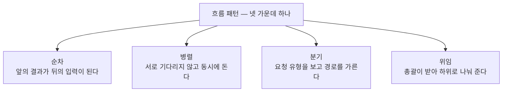
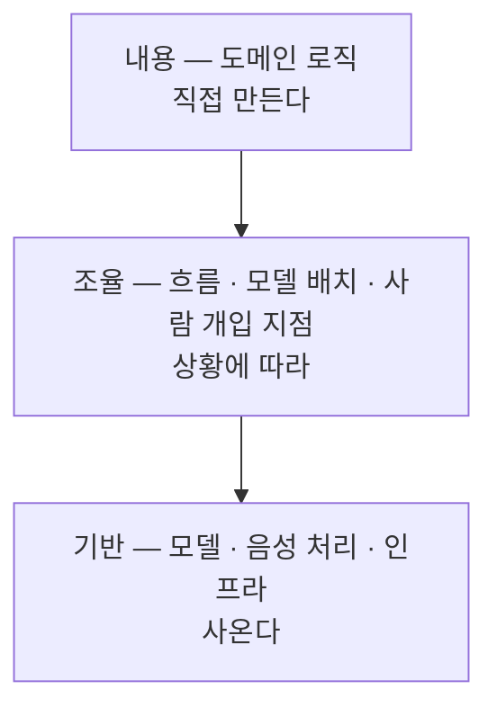

[앞 편](/blog/ai-product-planning/whether-gate/)은 다섯 칸을 순서대로 지나 착수 · 보류 · 추가조사 가운데 하나를 냈다. 이 편은 착수 판정을 받은 착상이 그다음에 무엇으로 바뀌는지를 다룬다. 답부터 적으면 **코드가 아니라 문서**다.

만들기로 정해졌으니 곧바로 만들면 될 것 같지만, 그 사이에 나중에 바꾸기 어려운 결정 다섯 개를 미리 골라 적어 두는 단계가 있다. 다루는 것은 그 다섯 결정과 거기서 나오는 산출물까지이며, 그 산출물을 어떤 표준 형식으로 굳히는지는 다음 편의 몫이다.

## 설계대에 올라가는 것과 내려오는 것

| 항목 | 내용 |
| --- | --- |
| **입력** | 앞 단계의 착수 판정, 또는 「통과한다면 어떻게 만들 것인가」라는 가정. 그리고 어느 시장부터 잡을지에 대한 결정 |
| **활동** | 흐름 패턴 선택 → 세 층 분리 → 기억의 경계 설정 → 모델 배치 → 전략 점검 |
| **산출물** | 구조 문서 한 벌과, 왜 무너지지 않는지를 적은 전략 요약 |
| **통과 기준** | 네 패턴 가운데 하나로 뼈대가 정해졌고, 세 층이 갈렸고, 기억과 망각의 경계가 적혔고, 작업별 모델 배치가 표로 있고, 해자가 명시될 것 |
| **놓치기 쉬운 것** | **설계는 착수 판정을 만들지 않는다.** 구조가 아무리 훌륭해도 판정은 앞 편의 게이트가 낸다 |

마지막 줄이 이 단계의 위치를 정한다. 잘 그린 구조도는 그 자체로 설득력이 있어서 판정을 대신하기 쉬운데, 그러면 증거로 여는 문을 도면으로 여는 셈이 된다.

그렇다면 보류를 받은 건은 설계할 이유가 없어 보인다. 반대다. 「통과한다면 어떻게 만들 것인가」를 미리 그려 보면 **무엇을 확인해야 하는지가 좁아진다.** 층을 가르는 순간 어느 층이 검증되지 않았는지 드러나고, 모델을 배치하는 순간 어느 값을 아직 모르는지 드러난다. 설계는 검증의 해상도를 높이는 도구이지 통과의 근거가 아니다.

## 다섯 갈래가 다섯 결정을 맡는다

설계는 한 덩어리로 하는 일이 아니라 다섯 갈래로 나뉘고, 갈래마다 나중에 바꾸기 어려운 결정 하나씩을 맡는다.

| 갈래 | 왜 따로 떼어 냈나 | 무엇을 정하나 |
| --- | --- | --- |
| 흐름 | 부품을 잇는 방식은 나중에 바꾸려면 사실상 다시 짜야 한다 | 네 패턴 가운데 하나와 그것을 고른 이유 세 문장 |
| 층 | 한 덩어리가 전부를 맡으면 얽힌 정도가 걷잡을 수 없이 불어난다 | 기반 · 조율 · 내용의 분리 |
| 기억 | 무엇을 기억하느냐가 그 도구가 할 수 있는 일을 정한다 | 개인 · 공용 · 집계 세 기억의 경계 |
| 모델 배치 | 가장 좋은 모델로 전부 처리하면 값이 급격히 오른다 | 작업별 모델과 값의 표 |
| 전략 점검 | 구조가 훌륭해도 전략이 없으면 모방당하거나 값에 무너진다 | 수익 방식 · 해자 네 축 · 단위경제 · 특정 모델에 묶인 정도 |

다섯의 공통점은 **되돌리는 값이 크다**는 것이다. 화면 배치나 문구는 나중에 고쳐도 값이 거의 들지 않지만, 이 다섯은 만든 뒤에 바꾸려면 이미 쌓은 것을 걷어 내야 한다. 설계 단계가 코드가 아니라 문서를 남기는 이유가 여기에 있다 — 문서는 고치는 값이 싸고, 이 다섯 결정은 고칠 일이 반드시 한 번은 생긴다.

## 흐름의 뼈대를 먼저 고른다

첫 갈래는 부품을 어떤 모양으로 잇는지를 정한다. 후보는 넷이고, 고른 이유를 세 문장으로 적는 것까지가 이 갈래의 산출물이다.

네 패턴은 성능이 아니라 **관계**로 갈린다. 순차는 뒤가 앞을 기다리고, 병렬은 기다리지 않으며, 분기는 하나만 고르고, 위임은 하나가 나머지를 부린다.

## 세 층으로 가르고 만들 곳만 만든다

| 층 | 무엇이 들어가나 | 사올 것인가 만들 것인가 |
| --- | --- | --- |
| **기반** | 모델, 음성 처리, 인프라 | **사온다** — 여기서는 차별화되지 않는다 |
| **조율** | 흐름, 모델 배치, 사람이 개입하는 지점 | 상황에 따라 갈린다 |
| **내용** | 도메인 로직 — 차별성이 나오는 자리 | **만든다** |

층을 가르는 일은 곧 **직접 만들 곳을 하나로 좁히는 일**이다. 차별화되는 자리에만 힘을 쓴다는 판단이 층 구분과 정확히 겹친다.

## 무엇을 기억할지가 곧 프라이버시 설계다

| 기억 | 담기는 것 | 설계에서 정할 것 |
| --- | --- | --- |
| **개인** | 사용자마다 다른 이력 | 개인정보다. 누가 접근할 수 있는지를 제한한다 |
| **공용** | 도메인 용어와 규칙 | 전원이 함께 본다 |
| **집계** | 보고서에 쓰이는 통계 | **개인정보와 분리해 저장한다** |

쓰는 사람과 값을 내는 사람이 다른 구조에서는 「이것이 누구의 데이터인가」가 그대로 설계 질문이 된다. 사용자가 보는 화면에는 개인의 것을 두고, 값을 내는 쪽이 받는 보고서에는 합쳐 놓은 수치만 남긴다. 이렇게 갈라 두는 일 자체가 제품 설계이지 저장소 설정이 아니다.

경계는 처음에 그으면 선 하나지만 나중에 그으면 구조 전체를 다시 짜는 일이 된다.

## 작업마다 다른 모델을 붙인다

| 작업 | 붙일 모델 | 근거 |
| --- | --- | --- |
| 단순 변환 — 음성을 글로, 번역, 형식 맞추기 | 값이 싼 쪽 | 품질 차이가 결과에 거의 드러나지 않는다 |
| 핵심 판단 — 평가와 결정 | 성능이 좋은 쪽 | 여기가 제품의 가치가 나오는 자리다 |

두 줄뿐이지만 이 표가 **단위경제의 절반**을 정한다. 앞 편의 원가 계산이 한 건에 드는 값을 재는 장치였다면, 이 배치는 그 값을 실제로 결정한다.

## 왜 안 망하는지를 네 항목으로 적는다

| 항목 | 적을 것 |
| --- | --- |
| 수익 방식 | 무엇으로 값을 받는가. 아직 확인되지 않았으면 모의 표기를 붙인다 |
| 해자 네 축 | 왜 모방당하지 않는가 |
| 단위경제 | 고객 한 명이 남기는 총액과 그를 데려오는 데 든 값 |
| 모델 의존 | 특정 모델이나 공급자에 얼마나 묶여 있는가 |

네 항목은 「좋은 제품인가」를 묻지 않는다. **무엇이 이것을 무너뜨릴 수 있는가**를 묻는다. 마지막 항목이 구조 안에 없는 위험을 담는 자리인데, 쓰던 모델의 값이나 정책이 바뀌면 구조가 아니라 사업이 흔들린다.

## 쓰는 사람과 내는 사람이 다르다

| 관점 | 누구인가 | 무엇을 가치로 보는가 | 무엇을 마주하는가 |
| --- | --- | --- | --- |
| **사용자** | 실제로 쓰는 사람 | 자기 일을 해내는 것 | 사용 화면 |
| **지불자** | 예산을 결재하는 사람 | 조직의 성과가 보이는 것 | 보고서 |

설계를 가르는 질문은 「시장이 큰가」가 아니라 **「누가 값을 내는가」다**. 내는 쪽의 지불 의향을 보지 않으면 사용 화면을 아무리 잘 만들어도 구조 전체가 헛돈다.

무엇을 누구에게 보여 줄지도 여기서 갈린다. 사용자에게 평가 점수를 그대로 내보이면 불이익을 걱정해 오히려 위축되는 일이 생길 수 있다. 누구에게 무엇까지 보일지를 설계 시점에 갈라 둔 사례가 있는데, 화면 문제로 보이지만 실은 제품 전략 문제다.

## 한 번에 한 시장만 고른다

| 원칙 | 내용 |
| --- | --- |
| 하나만 고른다 | 여러 시장에 동시에 들어가면 설계가 어느 쪽에도 맞지 않게 된다 |
| 고르는 기준 | 통증의 밀도 × 값을 내는 구조 × 접근할 수 있는 정도 |
| 접은 것도 적는다 | 지금 하지 않을 시장은 이유와 함께 기록하고 확장 후보로 남긴다 |

셋째 줄이 앞 편과 이어지는 자리다. 하지 않기로 한 시장을 이유와 함께 남겨 두면 그것이 다음 판정에서 대조할 기록이 된다.

## 건너뛰면 무엇을 치르는가

| 구분 | 값 |
| --- | --- |
| **정량** | 흐름 패턴을 뒤늦게 바꾸는 일은 처음부터 새로 짜는 것과 다르지 않다. 늦게 발견될수록 값은 배수로 커진다 |
| **정량** | 요청 전부를 가장 좋은 모델에 보내면 한 건당 원가가 몇 배가 되어 마진이 사라진다 |
| **정성** | 층을 섞은 코드는 한 번의 변경이 흩어진 모든 곳을 건드리게 만든다 |
| **정성** | 해자 없이 내보내면 모방당한 뒤에야 차별점을 고민하게 된다 |
| **조직** | 기억의 경계를 나중에 그으면 개인정보 문제가 구조 전면의 재설계로 번진다 |

다섯 줄 가운데 마지막이 가장 늦게 드러난다. 앞의 넷은 만드는 쪽에서 끝나지만 마지막 것은 이미 쌓인 데이터를 건드려야 해서 되돌리는 값이 다른 층에 있다.

## 무엇을 맡기고 무엇을 직접 하는가

| 갈래 | 도구에 맡길 것 | 사람이 판단할 것 |
| --- | --- | --- |
| 흐름 | 네 패턴 비교와 추천, 근거 세 줄 | **최종 채택** — 되돌리기 어렵다 |
| 층 | 층마다 후보 부품을 배치 | **무엇이 우리의 내용 층인가** |
| 기억 | 기억할 항목과 지울 항목의 목록화 | 프라이버시 경계와 법적 위험 |
| 모델 배치 | 작업별 모델과 값의 표 산출 | 품질의 하한을 어디에 둘 것인가 |
| 전략 | 전략 요약의 초안 | **가격과 고객에게 한 약속** — 되돌릴 수 없는 문이다 |

왼쪽은 전부 나열과 계산이고 오른쪽은 전부 선택과 책임이다. 다섯 줄 모두 도구가 후보를 만들고 사람이 하나를 고르는 형태인데, 앞 단계와 달리 여기서는 고른 것을 되돌리는 값이 특히 크다.

## 이 편이 쓴 용어

아래는 [지도편](/blog/ai-product-planning/planning-harness-map/)이 모아 둔 낱말 가운데 이 편의 본문에 등장한 행이다.

| 용어 | 원어 | 이 편에서의 뜻 |
| --- | --- | --- |
| HOW | how | 어떻게 만드는가. 앞 편까지가 만들지 말지를 물었다면 이 편부터가 이 질문이다 |
| 구조 문서 | ARCHITECTURE.md | 다섯 갈래의 결정을 한 벌로 적어 남기는 문서. 이 단계의 주 산출물이다 |
| 흐름 패턴 | orchestration | 부품을 잇는 방식. 순차 · 병렬 · 분기 · 위임 넷 가운데 고른다 |
| 세 층 설계 | 3-tier | 사올 층과 만들 층을 가르는 구분. 기반은 사오고 내용은 만들며 조율은 상황에 따라 갈린다 |
| 사람 개입 지점 | HITL | 자동으로 도는 흐름 가운데 사람의 판단이 들어가는 자리. 조율 층이 이것을 정한다 |
| 매출원가 | COGS | 요청 한 건에 드는 모델과 인프라 값. 모델 배치가 이 값을 직접 정한다 |
| 단위경제 | Unit Economics | 한 사람을 받아 남기는 것과 쓰는 것의 구조. 모델 배치가 그 절반을 정한다 |
| 생애가치와 획득비용 | LTV / CAC | 한 고객이 남기는 총액과 그를 데려오는 데 든 값. 전략 요약의 한 항목이다 |
| 지불 의향과 제공 원가 | WTP / CTS | 치를 뜻이 있는 금액과, 그것을 제공하느라 실제로 드는 값. 지불자가 사용자와 다르면 앞의 것은 지불자에게 물어야 한다 |
| 교두보 | beachhead | 여러 후보 가운데 먼저 들어갈 시장 하나. 둘을 동시에 고르면 설계가 어느 쪽에도 맞지 않는다 |
| 해자 | Moat | 왜 모방당하지 않는가에 대한 답. 전략 요약의 네 축 가운데 하나다 |
| 사용자와 지불자의 분리 | B2B2C | 제품을 실제로 쓰는 쪽과 예산을 결재하는 쪽이 갈리는 구조. 기억의 경계와 화면 구성을 함께 정한다 |

## 정리

세 가지가 이 편에 남는다.

**첫째, 설계 단계가 남기는 것은 코드가 아니라 문서다.** 다섯 갈래가 정하는 것은 전부 되돌리는 값이 큰 결정이고, 그런 결정은 고치는 값이 싼 자리에서 먼저 확정돼야 한다.

**둘째, 설계는 통과를 만들지 않는다.** 구조도가 아무리 설득력 있어도 판정은 앞 편의 게이트가 낸다. 보류를 받은 건을 설계하는 이유도 통과시키기 위해서가 아니라 무엇을 확인할지 좁히기 위해서다.

**셋째, 값이 드는 자리와 차별화되는 자리는 서로 다른 곳에 있다.** 층을 가르면 직접 만들 곳이 하나로 좁혀지고, 모델을 배치하면 한 건당 값이 정해진다. 두 결정이 만나는 자리가 단위경제다.

[다음 편](/blog/ai-product-planning/deliver-and-prd/)은 이 문서들을 실제로 만드는 단계에 넘긴다. 무엇이 갖춰져야 만들기 시작할 수 있는지, 그리고 요구사항 문서를 매번 다시 쓰지 않도록 표준으로 굳히는 방법이 거기서 갈린다.
