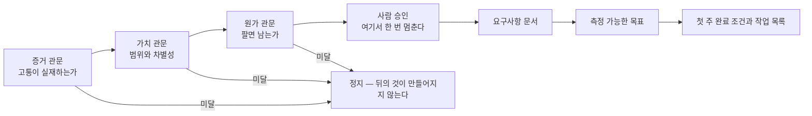

[앞 편](/blog/ai-product-planning/architect-stage/)은 되돌리는 값이 큰 결정 다섯 개를 문서로 남겼다. 이 편은 그 문서들을 들고 실제로 만들기 시작하는 단계를 다룬다. 다만 설계가 끝났다고 곧바로 착수하지는 않는다. 그 사이에 세 개의 관문과 한 번의 사람 승인이 놓여 있다.

이 단계가 앞의 어느 단계와도 다른 점이 하나 있다. 여기서는 조건을 채우지 못하면 **파일이 만들어지지 않는다.** 권고가 아니라 쓰기 실패다. 다루는 것은 그 차단 장치와, 관문을 통과한 뒤에 나오는 요구사항 문서의 표준까지다. 그 표준을 팀 전체가 공유하는 자산으로 만드는 일은 뒤의 편이 맡는다.

## 딜리버리 단계에 들어오는 것과 나오는 것

| 항목 | 내용 |
| --- | --- |
| **입력** | 앞 단계의 구조 문서와 전략 요약, 그리고 게이트를 통과한 건 |
| **활동** | 세 관문 → 사람 승인 → 요구사항 문서 → 목표 → 첫 주 계획 → 증거 확인 → 다음 도구로 넘기기 |
| **산출물** | 요구사항 문서, 측정 가능한 목표, 첫 주 완료 조건, 첫 주 작업 목록, 하류로 넘길 요약 |
| **통과 기준** | 증거 · 가치 · 원가 세 관문이 모두 초록이고, 그 위에 사람의 승인이 한 번 찍혀 있을 것 |
| **미달일 때** | 훅이 파일 시스템 층에서 문서 생성을 막는다. 경고 뒤에 진행하는 것이 아니라 쓰기가 실패한다 |

마지막 줄이 이 단계의 성격을 정한다. 앞 편들의 게이트가 「판정을 낸다」였다면 여기는 **판정이 없으면 다음 산출물이 물리적으로 존재하지 않는다.**

## 세 관문을 지나야 문서가 생긴다

관문에서 산출물까지가 한 줄로 이어져 있다. 앞 칸이 막히면 뒤 칸은 실행되지 않는다.



세 관문의 순서에는 이유가 있다. 고통이 실재하지 않으면 범위를 좁힐 대상 자체가 없고, 범위가 정해지지 않으면 한 건에 드는 값을 계산할 수 없다. 앞의 것이 뒤의 것을 계산 가능하게 만드는 순서다.

사람 승인이 관문 뒤에 따로 놓인 것도 우연이 아니다. 셋이 전부 초록이어도 그것은 「막을 이유가 없다」는 뜻이지 「지금 해야 한다」는 뜻이 아니다. 자동으로 통과시킬 수 있는 자리가 아니다.

## 설득이 아니라 차단이다

| 항목 | 내용 |
| --- | --- |
| 문제의식 | 「하지 마세요」라고 적어 둔 규칙은 지켜지지 않는다. 도구는 경고문을 출력한 뒤에 하던 일을 계속한다 |
| 해결 | 파일을 쓰기 직전에 끼어드는 훅을 걸고, 거기서 조건을 검사한다 |
| 조건 | 승인 기록의 상태가 승인이 아니면 요구사항 문서와 명세 파일의 쓰기를 실패 코드로 끝낸다 |
| 결과 | 검증되지 않은 상태에서는 **파일 자체가 생기지 않는다** |
| 원칙 | 조건 판단과 차단은 코드가 맡고, 초안 작성과 요약만 도구에 맡긴다 |

마지막 줄이 이 시리즈 전체에서 되풀이되는 분업이다. 판단하는 자리에 확률적으로 답하는 것을 두지 않는다.

훅 자체는 짧다. 개인 작업 흐름에도 그대로 붙일 수 있는 크기다.

```python
# hooks/gate_lite.py — 파일 쓰기 직전에 도는 검사
event = json.load(sys.stdin)
target = event["tool_input"]["file_path"]

if target.endswith("PRD.md") and not os.path.exists("harness/approved"):
    print("차단: 승인 기록이 없다", file=sys.stderr)
    sys.exit(2)   # 2 로 끝내면 쓰기 동작 자체가 취소된다
```

핵심은 마지막 줄의 종료 코드다. 0 으로 끝나면 통과, 1 이면 오류로 기록되지만 흐름은 이어지고, **2 여야 쓰기가 취소된다.** 세 값의 차이가 곧 「경고」와 「차단」의 차이다. 이 훅을 쓰기 도구에 걸어 두면 승인 파일이 생기기 전까지 요구사항 문서는 만들어질 수 없다.

## 「완료」를 먼저 정하고 파일로 확인한다

| 항목 | 내용 |
| --- | --- |
| 문제의식 | 무엇이 완료인지 흐릿하면 그 주가 끝나지 않는다 |
| **측정 가능한 목표** | 숫자로 확인되는 목표. 「좋아진다」가 아니라 「무엇이 얼마나」다 |
| **첫 주 완료 조건** | 「가짜 데이터로 끝까지 한 번 돌면 통과」처럼, 봤을 때 참인지 거짓인지 갈리는 문장 |
| 첫 주 작업 목록 | 그 조건 하나를 채우기 위해 필요한 작업들 |

둘째 줄과 셋째 줄은 층이 다르다. 목표는 몇 달 뒤에 판정되고 완료 조건은 이번 주에 판정된다. 이번 주에 판정할 수 없는 것을 완료 조건 자리에 적으면 그 주는 끝나지 않는다.

조건을 적어 두는 것만으로는 부족하다. 채워졌는지를 누가 확인하느냐가 남는다.

| 항목 | 내용 |
| --- | --- |
| 문제의식 | 「됐다」는 선언은 쉽게 나온다. 그것을 말만으로 받아 주면 그만큼 부채가 남는다 |
| 방식 | 조건마다 **무엇이 있으면 참인가**를 파일 경로로 적어 두고, 그 파일이 존재하는지 본다 |
| 동작 | 상태를 미충족에서 충족으로만 바꾼다. 증거가 없으면 완료를 거부한다 |

한쪽 방향으로만 바꾼다는 것이 이 장치의 요점이다. 완료를 취소하는 일은 사람이 하고, 자동으로 도는 부분은 채워진 것을 채워졌다고 표시하는 데까지만 관여한다. 판정의 근거가 파일의 존재라서 결과가 실행할 때마다 달라지지 않는다.

## 승인된 것만 다음 도구로 넘어간다

| 항목 | 내용 |
| --- | --- |
| 문제의식 | 검증되지 않은 기획을 코딩 도구에 넘기면 하류에서 다시 미끄러진다 |
| 요약에 담는 것 | 제품 · 문제 · 대상 고객 · 할 일 관점 · 원가 · 결정 |
| 내보낼 곳 | 실제로 구현을 맡을 도구. 어느 쪽으로 보낼지 지정한다 |
| 조건 | 승인 뒤에만 동작한다. 통과 전에는 넘기기도 함께 막힌다 |

마지막 줄이 앞의 차단 장치와 짝을 이룬다. 문서 생성만 막고 전달을 열어 두면 검증되지 않은 내용이 다른 경로로 새어 나간다. 막을 자리를 하나라도 열어 두면 나머지 차단이 무의미해진다.

## 건너뛰면 무엇을 치르는가

| 구분 | 값 |
| --- | --- |
| **정량** | 범위를 자르지 않은 채 만들기 시작하면 기능이 계속 붙어 내보내는 시점이 오지 않는다 |
| **정량** | 완료 조건 없는 한 주는 끝나지 않는다. 걸리는 시간의 상한이 사라진다 |
| **정성** | 끝나지 않는 상태가 이어지면 미완성인 채로 지쳐 떨어진다 |
| **정성** | 검증되지 않은 기획이 구현 도구로 흘러가 하류 전체가 틀린 전제 위에서 돈다 |
| **조직** | 구두로 오간 「됐다」가 겹겹이 얹혀, **어디에 무엇이 밀려 있는지 보이지 않는 상태**로 굳는다 |

다섯 줄 가운데 마지막이 가장 늦게 드러나고 가장 고치기 어렵다. 앞의 넷은 지연이나 낭비로 눈에 보이지만, 마지막 것은 아무 일도 일어나지 않는 것처럼 보이는 동안 진행된다. 소리 내어 실패하기가 이 자리를 겨냥한 원칙이다.

## 무엇을 맡기고 무엇을 직접 하는가

| 활동 | 도구에 맡길 것 | 사람이 판단할 것 |
| --- | --- | --- |
| 세 관문 | 조건 검사 실행과 미달 사유 정리 | **통과 여부의 최종 승인** |
| 요구사항 문서 | 고정된 골격에 맞춘 초안 생성 | 범위와 비범위의 결정, 성공 지표 확정 |
| 목표와 첫 주 계획 | 작업 후보와 우선순위 초안 | **무엇을 완료로 볼 것인가** |
| 증거 확인 | 파일이 있는지 없는지 검사 | 그 증거가 진짜 증거인가 |
| 넘기기 | 요약 생성과 형식 변환 | 무엇을 밖으로 내보낼 것인가 — 되돌리기 어렵다 |

넷째 줄이 이 표에서 가장 미묘하다. 파일이 있는지는 기계가 정확히 알지만, 그 파일이 조건을 실제로 증명하는지는 알지 못한다. 결정론적으로 판정되는 것과 판정된 값이 옳은 것은 다른 문제다.

## 요구사항 문서를 매번 새로 쓰지 않으려면

여기부터가 관문을 통과한 뒤의 이야기다. 승인이 떨어지면 문서를 쓰기 시작하는데, 그 문서를 매번 백지에서 시작하지 않는 방법이 있다.

| 문제 | 해결 |
| --- | --- |
| 기획서를 쓸 때마다 구성을 처음부터 다시 고민한다 | 골격을 고정한다 |
| 도구에 맡기면 사람마다 매번 다른 모양이 나온다 | 내 섹션과 완료 조건과 거를 것을 한 번 박아 둔다 |
| 기성 도구의 자동 생성은 누구에게나 맞는 일반형 골격이다 | 내 표준이 코드처럼 반복해서 쓰인다 |

셋째 줄이 이 장의 전제다. 일반형 골격이 나쁜 것이 아니라, 그것이 **내가 매번 빠뜨리는 항목**을 알지 못한다는 것이 문제다. 표준을 고정하는 이유는 좋은 문서를 쓰기 위해서가 아니라 같은 자리를 반복해서 비우지 않기 위해서다.

## 골격은 여섯 항목이다

| 순서 | 항목 | 무엇을 적나 | 여기서 자주 비는 것 |
| :---: | --- | --- | --- |
| ① | **문제** | 아픈 사람이 누구이고, 언제 얼마나 아픈가 | 그 빈도와 규모를 뒷받침하는 근거 |
| ② | **사용자와 지불자** | 둘이 다르면 반드시 나눠 적는다 | 쓰는 쪽과 값을 내는 쪽이 갈리는 구조에서 내는 쪽이 통째로 빠진다 |
| ③ | **해결** | 기능은 셋까지. 그 앞에 무엇이 핵심 가치인지를 한 줄로 | 기능이 여덟 개로 불어난다 |
| ④ | **범위와 비범위** | 이번에 하지 않을 것을 명시한다 | 가장 자주 빠지면서 가장 중요한 항목이다 |
| ⑤ | **성공 지표** | 앞서 움직이는 지표 하나 + 떨어뜨리면 안 되는 지표 하나 | 뒤엣것이 빠진다 |
| ⑥ | **위험과 가정** | 무너지면 끝인 가정 하나와 그것을 확인할 방법 | 확인 방법 없이 위험만 나열한다 |

여섯 가운데 ④와 ⑤가 이 골격의 무게중심이다. **좋은 요구사항 문서는 비범위와 지표가 있는 기획서다.** 기능 목록이 아니라 「왜 · 누구에게 · 무엇을 하지 않는가」가 적힌 문서라는 뜻이다.

⑤의 지표가 한 쌍인 것도 의도된 구성이다. 올릴 지표만 두면 그것을 올리기 위해 다른 것을 망가뜨리는 선택이 정당해 보이기 시작한다. 떨어뜨리면 안 되는 지표는 그 선택지를 미리 닫는다.

## 표준을 파일 하나에 박는다

골격을 정했다면 그것을 머리에 두지 않고 파일로 적어 둔다. 다음은 그 파일의 뼈대다.

```markdown
---
name: prd-writer
description: 검증을 마친 문제를 기능으로 옮기기 전에, 고정된 섹션과
  완료 조건으로 초안을 빠르게 뽑고 싶을 때 쓴다.
---

## 규약
   확인되지 않은 수치에는 [리서치], 추정에는 [가정], 정한 것에는 [결정].
   단정하지 않는다. 모르면 되묻는다.

## 입력
   문제 한 문단 + (있으면) 앞 단계의 조사 요약

## 섹션 — 이 여섯 개를 이 순서로 고정한다
   1 문제  2 사용자와 지불자  3 해결(기능 셋 이내)
   4 범위와 비범위  5 성공 지표  6 위험과 가정

## 완료 조건
   비범위가 있다 · 지표가 측정 가능하다 · 미검증에 라벨이 있다 · 기능이 셋 이내다

## 거를 것
   기능 나열 · 확인 안 된 수치의 단정 · 열린 범위 · 비범위 없음
```

읽어 보면 알겠지만 특별한 문법이 없다. 사람이 읽는 지시문 그대로이고, 그것을 매번 다시 타이핑하는 대신 정해진 위치에 두는 것이 전부다. **표준이 표준으로 작동하는 조건은 정교함이 아니라 위치의 고정이다.**

세 라벨은 그대로 쓴다. `[리서치]`는 아직 찾지 않은 것, `[가정]`은 참이라 치고 진행하는 것, `[결정]`은 이미 정해 논의를 닫은 것이다. 셋을 구분해 두면 나중에 문서를 다시 열었을 때 **어느 문장이 검증을 기다리는 중인지**가 한눈에 갈린다.

## 좋은 문서와 나쁜 문서를 가르는 여덟 줄

| 항목 | 나쁜 쪽 | 좋은 쪽 |
| --- | --- | --- |
| 시작점 | 「무엇을 만들까」 — 기능에서 출발한다 | 「누가 언제 얼마나 아픈가」 — 문제에서 출발한다 |
| 기능 수 | 여덟 개를 늘어놓는다 | **셋 이내** |
| 비범위 | 없다. 그래서 범위가 계속 넓어진다 | **적혀 있다** — 이번에 하지 않을 것 |
| 수치 | 근거 없이 단정한다 | 라벨을 붙여 검증 상태를 표시한다 |
| 지표 | 없거나, 올라가도 의미가 없는 것을 고른다 | 앞서는 지표와 지켜야 할 지표를 한 쌍으로 둔다 |
| 사용자와 지불자 | 같다고 전제한다 | 다르면 나눠 적는다 |
| 위험 | 나열만 한다 | 무너지면 끝인 가정과 **그것을 깨 볼 방법**을 함께 적는다 |
| 결과 | 근거가 없어 합의에 올릴 수 없다 | 그대로 검토 자리에 올릴 수 있다 |

여덟 줄을 관통하는 것은 분량이 아니다. 나쁜 쪽이 짧아서 나쁜 것이 아니라 **되묻는 질문에 답할 수 없어서** 나쁘다. 좋은 쪽은 전부 「그건 어떻게 아느냐」에 답을 가지고 있다.

## 채워진 예시 하나

가상 데이터로 만든 예시다. 시니어 만성질환 관리를 소재로 여섯 칸을 채우면 이 정도가 된다.

| 섹션 | 내용 |
| --- | --- |
| 1 문제 | 시니어가 만성질환을 혼자 관리하기 어려워한다. 얼마나 흔한 일인지는 아직 `[리서치]` |
| 2 사용자와 지불자 | 쓰는 쪽은 시니어 본인, 값을 내는 쪽은 자녀 `[가정]`. 둘을 나눠 적었다 |
| 3 해결 | 「하루 1분, 목소리로 확인」 — 약 먹을 시각 알림, 목소리로 묻는 문진, 이상 신호 통지. 여기까지 셋 |
| 4 범위와 비범위 | 범위는 음성 안내. **비범위는 의료 진단 · 보험 연동 · 착용 기기 — 이번에는 하지 않는다** |
| 5 성공 지표 | 앞서는 것은 주 3회 확인율, 지켜야 할 것은 잘못된 알림의 비율 |
| 6 위험과 가정 | 「시니어가 음성 조작을 매일 쓴다」 `[가정]` → 다섯 명에게 짧게 시켜 보고 깨 본다 |

여섯째 줄이 이 예시에서 가장 중요하다. 가정을 적는 것으로 끝내지 않고 **그것을 깨 볼 방법**을 붙였다. 다섯 명이라는 크기는 통계적 유의성을 얻으려는 것이 아니라, 매일 쓴다는 전제가 틀렸다면 그 정도로도 드러나기 때문이다.

## 표준이 표준으로 작동하는지

표준을 적어 두는 양식은 여섯 칸이면 충분하다.

| 칸 | 적을 것 |
| --- | --- |
| ① 언제 쓰나 | 검증을 마친 문제를 내 골격으로 옮길 때 |
| ② 입력 | 문제 한 문단과 앞 단계의 조사 요약 |
| ③ 고정 골격 | 문제 · 사용자와 지불자 · 해결 · 범위와 비범위 · 지표 · 위험 |
| ④ 완료 조건 | 비범위 · 측정 가능한 지표 · 미검증 라벨 · 기능 셋 이내 |
| ⑤ 예시 | 위의 채워진 문서 하나 |
| ⑥ 검증 규칙 | 세 라벨을 붙인다. 모르면 되묻는다 |

⑤가 비어 있으면 나머지 다섯 칸이 잘 채워져 있어도 결과가 흔들린다. 「기능 셋 이내」 같은 문장은 사람마다 다르게 읽히지만, 채워진 예시 하나는 그 폭을 좁힌다.

그리고 이 표준이 제대로 작동하는지는 네 가지로 확인한다.

| # | 기준 |
| :---: | --- |
| ① | **골격이 고정돼 있다** — 섹션과 완료 조건이 매번 같다 |
| ② | **비범위와 지표가 항상 있다** — 앞서는 지표와 지켜야 할 지표가 한 쌍으로 |
| ③ | **검증 상태가 표시돼 있다** — 추정과 미확인에 라벨이 붙어 있다 |
| ④ | **밖에 내놓을 수 있다** — 가상 데이터로 쓰고, 실명과 개인정보를 넣지 않으며, 접속 정보는 별도 파일에 둔다 |

넷 가운데 하나가 미달이면 **분량을 늘리지 말고 그 항목 하나를 먼저 채운다.** 미달인 채로 길어진 문서는 미달인 사실을 덮을 뿐이다.

## 이 편이 쓴 용어

[지도편](/blog/ai-product-planning/planning-harness-map/)이 묶어 둔 어휘 가운데, 이 편의 논지가 기대고 있는 것만 뽑았다.

| 용어 | 원어 | 이 편에서의 뜻 |
| --- | --- | --- |
| 요구사항 문서 | PRD | 이 단계의 주 산출물. 여섯 항목을 고정한 골격으로 쓴다 |
| 쓰기 차단 훅 | gate_guard | 파일 쓰기 직전에 끼어들어 승인 기록을 검사하고, 없으면 쓰기를 실패시키는 장치 |
| 완료의 정의 | DoD | 무엇이 있으면 「됐다」인지를 일을 시작하기 전에 적어 둔 문장 |
| 세 관문 | build gates | 증거 · 가치 · 원가. 셋이 모두 초록이어야 사람 승인 자리로 넘어간다 |
| 사람 승인 지점 | checkpoint | 관문이 전부 초록이어도 한 번 멈추는 자리. 자동 통과가 없다 |
| 소리 내어 실패하기 | Fail Loud | 미달을 미달인 채로 보이게 두는 원칙. 이 편에서는 증거 없는 완료를 거부하는 형태로 나타난다 |
| 매출원가 | COGS | 세 관문 가운데 마지막이 계산하는 값 |
| 비범위 | Non-goals | 이번에 하지 않기로 한 것. 범위와 함께 적어야 범위가 닫힌다 |

첫 줄의 요구사항 문서는 [프로덕트 매니지먼트 시리즈의 기획·관리 편](/blog/product-management/planning-and-product-ops/)에도 나오지만 층위가 다르다. 그쪽에서는 요청이 접수되어 승인으로 가는 아홉 단계 가운데 **다섯째 자리에 놓인 산출물 하나**이고, 이 편에서는 도구가 반복해서 만들어 내도록 **항목을 고정한 표준 형식**이다.

## 정리

세 가지가 이 편에 남는다.

**첫째, 규칙은 문장이 아니라 차단 장치에 산다.** 「승인 전에는 쓰지 마세요」라고 적어 두면 지켜지지 않지만, 쓰기 직전에 검사하는 훅은 승인 기록이 없으면 파일을 만들지 않는다. 종료 코드 하나가 경고와 차단을 가른다.

**둘째, 완료는 선언이 아니라 존재로 확인한다.** 무엇이 있으면 참인지를 미리 파일로 적어 두면, 「됐다」는 말이 아니라 그 파일이 완료를 증명한다. 증거가 없으면 완료가 거부되므로 부채가 보이지 않는 곳으로 쌓이지 않는다.

**셋째, 표준의 값어치는 정교함이 아니라 고정에서 나온다.** 여섯 항목 골격에 특별한 것은 없다. 그것이 매번 같은 자리에 있어서, 내가 반복해서 비우던 칸이 비었다는 사실이 드러난다는 것이 전부다.

[다음 편](/blog/ai-product-planning/operate-stage/)은 만든 것을 내보낸 뒤의 이야기로 넘어간다. 무엇을 측정할지 하나만 고르는 일, 그리고 그 수치를 다시 처음 단계의 입력으로 되돌리는 고리가 거기서 갈린다.
