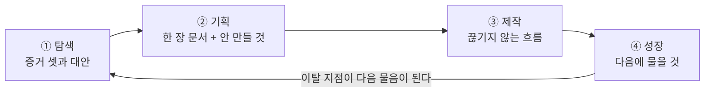
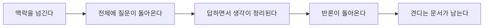

[앞 편](/blog/ai-product-planning/planning-harness-map/)은 이 방법론이 같은 순서를 두 벌로 설명한다고 적었다. 한쪽은 도구가 파일 단위로 막아서는 다섯 스테이지이고, 다른 한쪽은 사람이 차례로 밟는 네 단계다. 그 편은 오른쪽 열, 그러니까 장치 쪽을 그렸다. 이 편이 맡는 것은 왼쪽 열이다.

왼쪽을 따로 떼어 다루는 이유는 그것이 도구보다 먼저 있기 때문이다. 강제 장치는 이미 옳다고 판정된 순서를 지키게 만드는 물건이지, 순서 자체를 만들어 내지 못한다. 그래서 장치를 설치하기 전에 답해야 할 물음이 하나 남는다. **왜 하필 이 순서인가, 그리고 바꾸면 무엇이 망가지는가.**

이 편의 답은 한 문장이다. 네 단계는 나열된 목록이 아니라 **의존 관계**이며, 한 단계의 출력이 그다음 단계의 입력이기 때문에 순서를 바꾸면 입력이 비어 있는 채로 작업이 시작된다. 비어 있는 입력은 그 자리에서 오류를 내지 않는다. 사람이 짐작으로 메우고, 짐작이 틀렸다는 사실은 한참 뒤에 드러난다.

## 네 단계가 무엇을 받아 무엇을 남기는가

단계를 이름으로만 외우면 순서가 임의로 보인다. 각 칸에 무엇이 들어가고 무엇이 나오는지를 함께 놓으면 순서가 고정되는 이유가 표 안에서 드러난다.

| 단계 | 이 단계가 묻는 것 | 받는 것 | 남기는 것 | 다음으로 넘어가도 되는 조건 |
| --- | --- | --- | --- | --- |
| **① 탐색** | 이것을 만들 만한가 | 아직 다듬어지지 않은 착상 | 문제가 실재한다는 증거 셋, 지금 쓰이는 대안과 그 한계, 성공을 숫자로 적은 한 문장 | 같은 처지의 사람 다섯 이상에게 **지난 행동**을 물었고, 유리한 신호만 모으지 않고 **어긋나는 증거도 함께 찾았다** |
| **② 기획** | 무엇을, 어디까지 | 탐색이 남긴 증거 | 한 장짜리 요구사항 문서, 이번에 만들지 않을 것의 목록, 사용자가 지나는 흐름 | 넣을 것보다 **뺄 것을 먼저** 적었고, 기능 목록이 아니라 사용자가 겪는 일의 형태로 적었다 |
| **③ 제작** | 어떻게, 흩어지지 않게 | 기획이 남긴 문서와 기준선 | 핵심 흐름 하나가 끊기지 않고 도는 산출물 | 색과 간격과 데이터 형태의 기준을 **글로** 적었고, 그 흐름을 처음부터 끝까지 한 번 돌려 보았다 |
| **④ 성장** | 쓰이고 있는가, 다음은 무엇인가 | 실제 사용 기록 | 다음에 무엇을 할지, 곧 새 탐색 거리 | 활성화와 유지 가운데 하나를 골라 **측정 정의**를 적었고, 이탈 지점을 다음 탐색으로 옮겨 적었다 |

가운데 두 열을 세로로 읽으면 사슬이 보인다. **탐색이 남긴 것이 기획이 받는 것이고, 기획이 남긴 것이 제작이 받는 것이다.** 마지막 열은 그 사슬을 사람이 자기 손으로 끊지 못하게 하는 자물쇠다.

원 자료는 이 마지막 열을 자가 진단 체크리스트로 두었고, 이것이 뒤에 도구의 질문 세트가 된 원형이다. 체크리스트에서 출발했다는 사실이 중요한 이유는 앞 편이 적은 대로다 — 체크리스트는 읽지 않고 체크할 수 있다. 같은 항목을 사람이 아니라 도구가 물으면 답하지 않고 넘어가는 길이 막힌다.

## 직선이 아니라 고리다

네 단계를 화살표로 이으면 왼쪽에서 오른쪽으로 흐르지만, 마지막 화살표가 처음으로 돌아온다.

되돌아오는 화살표에 붙은 라벨이 이 그림의 전부다. 성장 단계에서 나오는 산출물은 성적표가 아니라 **다음 탐색의 소재**다. 사람들이 어디서 빠져나갔는지를 알아냈다면 그것은 「이번 제품이 이만큼 실패했다」가 아니라 「다음에 무엇을 조사해야 하는지」의 답이다.

그래서 성장은 끝이 아니고, 고리를 한 바퀴 돌 때마다 탐색의 출발점이 달라진다. 첫 바퀴의 탐색은 짐작에서 시작하지만 두 바퀴째의 탐색은 실측에서 시작한다. **고리를 닫는 일이 다음 바퀴의 정확도를 올리는 유일한 수단이다.**

한 가지 덧붙일 것이 있다. 성장 단계에서 먼저 보는 것은 획득한 사용자 수가 아니라 **남아 있는 비율**이다. 유지가 무너진 상태에서 유입을 늘리면 새로 들어온 사람도 같은 자리에서 빠져나간다. 이 순서 역시 뒤집으면 비용이 커지는데, 그 비용의 모양은 뒤에서 다시 다룬다.

## 의존 관계는 취향이 아니다

네 단계의 순서를 「권장 절차」로 읽으면 상황에 따라 조정할 수 있는 것처럼 보인다. 그러나 앞 표의 가운데 두 열이 맞물려 있는 한 이 순서는 조정 대상이 아니다.

기획 단계가 하는 일은 범위를 자르는 것인데, 자르려면 무엇이 중요한지에 대한 판단 근거가 있어야 한다. 그 근거가 탐색의 출력이다. 탐색 없이 기획을 시작하면 무엇을 자를지 정하는 기준이 만든 사람의 취향밖에 남지 않는다. 제작 단계도 마찬가지다. 만들 범위가 확정되지 않은 채로 코드를 쓰기 시작하면 범위는 작업 도중에 계속 자라고, 자란 범위를 자를 근거는 그때도 없다.

**입력이 비어 있어도 작업 자체는 시작된다는 것이 이 구조의 위험한 점이다.** 컴파일러라면 인자가 없을 때 멈추지만 사람은 멈추지 않는다. 빈칸을 짐작으로 채우고 진행하며, 짐작한 자리와 확인한 자리를 구분해 표시해 두지도 않는다. 그래서 나중에 무엇이 틀렸는지 되짚을 때 어디까지 돌아가야 하는지를 알 수 없다.

## 건너뛴 단계는 나중에 청구된다

건너뛰기가 그 자리에서 벌을 주지 않는다는 점이 문제의 핵심이다. 각 단계를 건너뛰었을 때 대금이 청구되는 시점과 형태는 단계마다 다르다.

| 건너뛴 것 | 그 자리에서 벌어지는 일 | 대금이 청구되는 시점 | 청구되는 것 |
| --- | --- | --- | --- |
| **탐색** — 가장 흔하다 | 「만들어 줘」부터 시작한다 | 제작이 다 끝난 뒤 | 그 기간에 들인 작업 전부 |
| **기획** | 범위를 자르지 않고 곧장 만들기 시작한다 | 제작이 진행되는 도중 | 끝나지 않는 작업과 소진 |
| **제작의 일관성** | 우선 화면이 뜨는 데까지만 해 둔다 | 첫 변경 요청이 들어올 때 | 흩어진 자리를 전부 찾아 고치는 비용 |
| **성장의 유지 확인** | 남는 비율을 보지 않고 유입부터 늘린다 | 획득 예산을 집행한 뒤 | 집행한 예산 전액 |

네 행의 공통점은 셋째 열이다. **청구 시점이 전부 그 단계가 아니라 한참 뒤다.** 그래서 건너뛴 사람은 자기가 건너뛴 덕분에 빨라졌다고 느끼는 구간을 실제로 통과한다. 그 구간이 끝나기 전까지는 그 느낌이 사실이기도 하다.

원 자료는 네 함정의 공통 원인을 방법론이 아니라 심리에서 찾는다. 무언가 만들어져 있어야 안심이 되기 때문에 확인을 미루고 손을 먼저 움직인다는 것이다. 그리고 지금은 이 심리가 더 세게 작동한다. 앞 편의 첫 문단이 적은 대로 만드는 비용이 내려갔고, **「못 만들 것 같다」는 저항이 사라진 자리에는 손을 먼저 움직이지 못하게 붙잡는 것도 함께 사라진다.**

## 비용은 더해지지 않고 곱해진다

같은 오류라도 언제 발견하느냐에 따라 치르는 값이 달라진다. 소프트웨어 공학에서 오래 인용되어 온 배수가 있다.

| 잘못된 전제를 발견한 시점 | 고치는 데 드는 상대 비용 |
| --- | ---: |
| 요구를 정리하는 동안 | **1** |
| 설계하는 동안 | **5** |
| 구현하는 동안 | **10** |
| 배포한 뒤 | **100** |

숫자 자체보다 간격이 벌어지는 방식이 중요하다. 오른쪽 열은 더해지지 않고 곱해진다. 앞 단계에서 삼십 분이면 확인할 수 있었던 전제 하나가 틀린 채로 남으면, 그 전제 위에 쌓인 기획과 설계와 구현이 통째로 폐기 대상이 된다. 며칠 분량의 작업이 한 문장 때문에 사라지는 일이 여기서 일어난다.

그리고 이 셈은 지금 더 안 보이게 됐다. 코드가 빨리 나온다는 것은 **구현 단계에 더 일찍 도달한다**는 뜻이고, 구현에 도달한 뒤에 발견되는 오류는 왼쪽 두 행이 아니라 아래 두 행의 값으로 청구된다.

폐기되는 것이 시간만은 아니다.

| 무엇이 사라지나 | 성격 | 회수 가능성 |
| --- | --- | --- |
| **투입한 시간** | 가장 눈에 잘 띈다 | 다시 들이면 된다 |
| **하지 못한 다른 검증** | 더 크지만 보이지 않는다 | 그 기간은 돌아오지 않는다 |
| **잃은 신뢰** | 가장 회복이 어렵다 | 상대가 다시 기대해 주어야만 회수된다 |

작은 조직일수록 가운데 행이 가장 무겁다. 사람이 적으면 동시에 진행할 수 있는 검증의 개수가 하나에 가깝고, 그 하나를 잘못된 대상에 쓰면 그 기간에 확인할 수 있었던 다른 물음은 확인되지 않은 채로 남는다. **틀린 것을 만든 손해보다, 맞는 것을 확인할 기회를 그 기간 동안 쓰지 못한 손해가 크다.**

## 전제가 틀리면 만들어 둔 것도 남지 않는다

「이번 것은 잘 안 됐지만 만들어 둔 것은 다음에 쓰면 된다」는 위로가 성립하는 경우와 성립하지 않는 경우가 갈린다. 갈리는 지점은 무엇이 틀렸느냐다. 구현이 틀렸다면 고쳐 쓸 수 있지만, **전제가 틀렸다면 그 위에 올린 것은 전부 다른 문제를 푸는 물건이 된다.**

기획서에는 대개 적히지 않은 전제가 깔려 있다. 적히지 않으므로 검증 대상에도 오르지 않는다.

| 적히지 않은 전제 | 이것이 틀렸을 때 어디까지 돌아가나 |
| --- | --- |
| 그들에게 이것이 중요한 문제다 | 문제를 세우는 자리까지 되돌아간다 |
| 지금의 방식이 불편하다고 느낀다 | 갈아탈 동기가 없으므로 쓰던 것을 계속 쓴다 |
| 비용을 치를 뜻이 있다 | 쓰이기는 하나 매출로 이어지지 않는다 |
| 이 방식이 그들의 일하는 흐름에 맞는다 | 사용자 경험과 연동 구조 전체를 다시 설계한다 |

오른쪽 열이 전부 「다시」로 시작한다는 것이 요점이다. 네 전제 가운데 어느 하나가 틀려도 되돌아가는 지점은 코드가 아니라 그보다 훨씬 앞이다.

폴 그레이엄이 꼽은 신생 기업의 첫째 실패 원인도 여기에 있다.

> 아무도 원하지 않는 것을 만들었다.

가장 안타까운 형태는 기술적으로 잘 만들어진 제품이 원하는 사람이 없어서 종료되는 경우다. 그래서 탐색 단계에서 해야 할 첫 작업은 조사할 대상을 고르는 것이 아니라 **적히지 않은 전제의 목록을 만드는 것**이다. 목록을 적어 놓기만 해도 어디를 확인해야 하는지가 드러난다. 무엇을 어떤 순서로 반증할지는 다음 편이 다룬다.

## 인공지능 제품이면 셈이 한 번 더 어긋난다

지금까지의 계산은 어떤 제품에나 적용된다. 모델을 호출해 돌아가는 제품에는 여기에 세 가지가 더 붙는다.

| 추가되는 조건 | 무엇이 달라지나 |
| --- | --- |
| **한계비용이 0이 아니다** | 통상적인 구독형 소프트웨어와 달리 호출마다 비용이 발생한다. 검증 없이 무제한으로 열면 쓰일수록 손해가 커진다 |
| **범용 모델이 차별점을 지운다** | 모델이 좋아질수록 「그냥 범용 모델로 되는데」라는 물음에 답해야 하는 범위가 넓어진다 |
| **사용량이 늘 때 비용이 선형으로 늘지 않는다** | 사용자가 늘면 호출도 늘고, 늘어난 호출이 다시 맥락을 키워 비용이 예상보다 가파르게 오른다 |

앞의 두 절에서 계산한 검증 생략 비용은 「시간」이었다. 여기서는 그것이 **시간에 매달 새는 돈이 더해진 값**이 된다. 잘못 만든 것을 방치하는 동안에도 계산서가 쌓인다는 뜻이다.

이 세 조건이 만들지 말지를 먼저 묻는 절차의 근거를 경제 계산으로 바꿔 놓는다. 원가를 얼마로 잡고 어느 선을 넘으면 통과를 막을지는 판정 기준을 다루는 편의 몫이므로 여기서는 셈의 방향만 적어 둔다.

## 기획 단계의 핵심 기술은 빼는 것이다

검증된 문제가 하나만 있어도 떠오르는 기능은 수십 개다. 그것을 다 적으면 반년짜리 계획이 되고, 반년짜리 계획은 앞 절의 배수표에서 가장 아래 행으로 직행한다. 그래서 기획 단계에서 먼저 적는 것은 만들 것이 아니라 **이번에 만들지 않을 것**이다.

빼기를 먼저 하면 세 가지가 따라온다.

| 얻는 것 | 어떻게 작동하나 |
| --- | --- |
| **확증 편향이 걸러진다** | 만들고 싶은 것과 필요한 것을 같은 목록에 두면 구분되지 않는다. 뺄 것을 먼저 적으면 남는 쪽이 필요한 것이다 |
| **반론을 미리 받아 본다** | 무엇을 뺐는지 적힌 문서는 엔지니어와 결정권자와 사용자가 각각 다른 이유로 반대할 지점을 먼저 드러낸다 |
| **몰랐던 빈칸이 보인다** | 뺄 근거를 적으려다 근거를 댈 수 없는 항목이 나오면, 그 자리가 아직 조사되지 않은 영역이다 |

여기서 한 가지가 겹쳐 읽힌다. **이것은 모델에 지시를 내리는 원칙과 같은 모양이다.** 「이것도 하고 저것도 해 달라」는 허용 지시보다 「이것은 하지 말고 저 파일은 건드리지 말라」는 제약 지시가 훨씬 강하게 작동한다. 모델은 발산하는 쪽으로 기울어 있으므로 수렴을 강제하는 일이 사람 몫으로 남는데, 기획 단계에서 뺄 것을 먼저 적는 행위가 정확히 그 몫이다.

빼기로 남긴 목록은 그 자리에서 버려지지 않는다. 무엇을 왜 만들지 않기로 했는지가 기록으로 쌓이면 다음 바퀴에서 같은 항목을 다시 논의하지 않아도 된다. 이 기록을 영구 보관 형태로 운용하는 방법은 게이트를 다루는 편에서 이어진다.

## 답을 받지 말고 질문을 받아라

기획 단계에서 모델을 쓰는 방식은 두 갈래로 갈린다. 요구사항 문서를 써 달라고 하는 쪽과, 지금 세워 둔 전제에 질문을 해 달라고 하는 쪽이다. 앞의 방식은 빈칸이 채워진 문서를 주지만 그 빈칸이 무엇으로 채워졌는지는 알려 주지 않는다.

질문을 유형별로 섞어 달라고 요청하면 한 방향으로만 파고드는 일이 줄어든다.

| 유형 | 무엇을 캐내나 | 이런 형태로 온다 |
| --- | --- | --- |
| **명료화** | 정의가 모호한 낱말 | 그 대상이 정확히 누구를 가리키는지, 범위는 어디까지인지 |
| **전제 검사** | 확인되지 않은 가정 | 그 수치가 측정한 값인지 체감인지 |
| **근거** | 사실과 추측의 구분 | 그 주장을 뒷받침하는 관측이 있는지 |
| **다른 관점** | 검토되지 않은 대안 | 다른 방법이 있다면 이 기능이 여전히 필요한지 |
| **함의** | 결과의 전개 | 석 달 뒤 어디가 먼저 무너지는지 |

이 단계의 성공은 완성된 답을 얻는 것이 아니다. **한 문장으로 답하지 못하는 질문이 나왔다면 그 자리가 지금 메워야 할 빈칸이고, 빈칸을 발견한 것이 성과다.** 답이 술술 나오는 질문만 돌아왔다면 질문의 강도가 모자란 것이다.

같은 원리가 한 층 위에도 적용된다. 좋은 지시문을 짜지 못하겠다면 지시문을 만드는 지시문을 먼저 짜게 하면 된다. 결과물을 받는 대신 **결과물을 만드는 도구를 만들게 하는 것**이고, 방향은 위와 같다.

## 탐색이 묻는 것은 의견이 아니라 지난 행동이다

앞의 표에서 탐색 단계의 통과 조건에 「지난 행동을 물었다」가 들어 있었다. 이 조건 하나가 탐색의 품질을 대부분 결정한다.

| 답이 신호가 되지 않는 질문 | 답이 신호가 되는 질문 |
| --- | --- |
| 이런 것이 있으면 쓰시겠어요 | 지난주에 그 일을 몇 번 하셨어요 |
| 이런 기능이 있으면 좋겠죠 | 한 번 할 때 얼마나 걸리세요 |
| 얼마면 사시겠어요 | 지금은 어떤 방법으로 하고 계세요 |

왼쪽 열은 전부 앞으로의 의향을 묻고 오른쪽 열은 전부 이미 일어난 일을 묻는다. 의향은 예의와 호의에 쉽게 물들지만 **지난 행동은 이미 일어난 뒤라 바뀌지 않는다.** 그리고 진짜로 불편을 겪는 사람은 이미 나름의 임시방편을 쓰고 있다 — 스프레드시트든 손으로 적은 메모든 외부 위탁이든, 무언가를 이미 하고 있다는 사실 자체가 문제가 실재한다는 가장 강한 신호다.

여기서 인터뷰를 어떻게 설계하고 어떤 규율로 진행하는지, 그리고 모델이 만들어 낸 가상의 응답을 증거로 셀 수 있는지는 발견 단계의 도구를 다루는 다음 편의 몫이다. 이 편에서 필요한 것은 하나다. **탐색 단계의 출력이 「사람들이 원한다더라」이면 그것은 아직 출력이 아니다.**

## 이 편이 쓴 용어

앞 편의 용어 정리에서 이 편이 실제로 쓰는 행만 추렸다.

| 용어 | 원어 | 이 편에서의 뜻 |
| --- | --- | --- |
| 라이프사이클 | 4D — Discovery · Definition · Delivery · Growth | 마지막 칸의 출력이 첫 칸의 입력으로 돌아오는 구조. 이 편의 주제다 |
| 하지 않을 목록 | Do-Not-Build | 범위 밖으로 밀어낸 항목을 근거와 함께 쌓아 두는 목록 |
| 맘 테스트 | Mom Test | 의향 대신 이미 일어난 행동을 묻게 만드는 인터뷰 규율 |
| 매출원가 | COGS | 호출 한 번마다 실제로 빠져나가는 운영 비용 |

## 정리

세 가지가 이 편에 남는다.

**첫째, 네 단계는 목록이 아니라 의존 관계다.** 한 단계의 출력이 다음 단계의 입력이므로 순서를 바꾸면 입력이 빈 채로 작업이 시작되고, 사람은 그 빈칸을 짐작으로 메운 뒤 메웠다는 사실을 기록하지 않는다.

**둘째, 건너뛴 대금은 나중에 청구된다.** 그것도 원금이 아니라 배수가 붙은 금액으로 청구되며, 배수는 발견 시점이 뒤로 갈수록 곱해진다. 건너뛰는 구간이 실제로 빨라 보이는 것이 이 함정이 반복되는 이유다.

**셋째, 고리를 닫는 일까지가 한 바퀴다.** 성장 단계에서 나온 이탈 지점을 다음 탐색의 물음으로 옮겨 적지 않으면 다음 바퀴도 첫 바퀴와 같은 정확도에서 출발한다.

[다음 편](/blog/ai-product-planning/whether-three-questions/)은 이 고리의 첫 칸으로 들어간다. 만들지 말지를 판정하기 위해 무엇을 묻는지, 그 물음이 왜 셋이며 왜 그 순서인지, 그리고 세워 둔 가정을 어떤 순서로 반증해야 값이 싸게 드는지가 거기서 갈린다.
