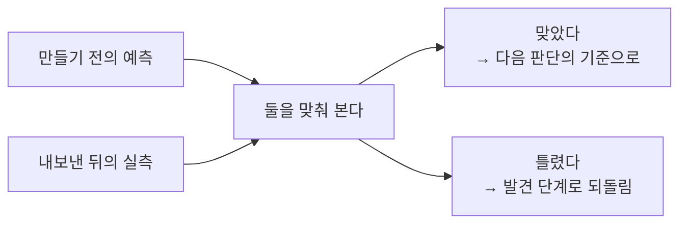
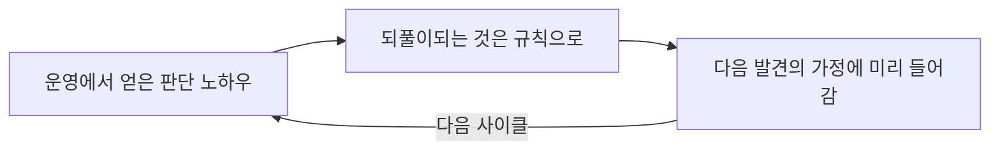

[앞 편](/blog/ai-product-planning/deliver-and-prd/)은 세 관문과 한 번의 사람 승인을 지나야 문서 파일이 생긴다는 데까지 왔다. 이 편은 그렇게 만든 것을 실제로 내보낸 뒤를 다룬다.

내보낸 뒤의 단계는 흔히 마지막으로 여겨진다. 그런데 이 단계는 다섯 가운데 유일하게 **자기 산출물을 첫 단계로 되돌려 보낸다.** 되돌려 보내려면 무엇을 돌려보낼지가 먼저 정해져야 하고, 그것을 정하는 일이 곧 지표를 고르는 일이다. 다루는 것은 지표 체계와 고리를 닫는 방법까지이며, 거기서 얻은 판단을 팀이 함께 쓰는 자산으로 굳히는 일은 다음 편의 몫이다.

## 운영대에 올라오는 것과 되돌아 나가는 것

| 항목 | 내용 |
| --- | --- |
| **입력** | 실제 사용 기록과 운영 로그, 그리고 만들기 전에 세워 두었던 예측 |
| **활동** | 지표 좁히기 → 신뢰성 점검 → 원가 추이 확인 → 고칠 것 고르기 → 배운 것 남기기 → 닮은 결정 견주기 → 반복 판단을 규칙으로 → 예측 채점 |
| **산출물** | 지표 한 벌, 90일 개선 목록, 판단 노하우 기록, 채점 결과, 되돌림 이력 |
| **통과 기준** | 올릴 지표가 하나로 좁혀졌고, 예측과 실측의 대조가 문서로 남아 있을 것 |
| **놓치기 쉬운 것** | 이 단계의 산출물은 **다음 단계가 아니라 다음 사이클이 쓴다** |

마지막 줄이 이 단계를 앞의 넷과 갈라 놓는다. 앞의 네 단계는 산출물을 바로 뒤 단계에 넘겨주고 역할을 마치지만, 여기서 나온 채점 결과와 노하우 기록은 넘겨줄 뒷단계가 없다. 그것들은 다음번 발견이 열릴 때 비로소 쓰인다. 그래서 이 단계를 소홀히 하면 손해가 이번 제품이 아니라 **다음 제품에서** 드러난다.

## 여덟 갈래가 한 사이클을 이룬다

| 갈래 | 왜 따로 떼어 냈나 | 무엇을 하나 |
| --- | --- | --- |
| 지표 | 내보냈다고 끝이 아닌데 감으로 보면 다음 결정이 흔들린다 | 올릴 지표 하나와 곁에 둘 몇 개를 정한다 |
| 신뢰성 | 평균이 빨라도 일부가 느리면 신뢰는 깨진다 | 지연의 꼬리값, 실패율, 오답 비율을 훑는다 |
| 원가 | 쓰는 양이 늘면 드는 값도 함께 는다 | 한 건당 원가의 추이와 소진 속도를 본다 |
| 개선 | 보기만 하고 끝내면 아무것도 달라지지 않는다 | 효과와 품을 견줘 90일치 목록을 세운다 |
| 학습 | 운영에서 얻은 판단은 적지 않으면 사라진다 | 이번 사이클의 노하우를 뽑아 둔다 |
| 대조 | 비슷한 고민을 매번 처음부터 하면 시간이 샌다 | 과거의 닮은 결정을 찾아 견주게 한다 |
| 규칙화 | 되풀이되는 판단은 사람이 매번 할 일이 아니다 | 노하우를 지시문으로 바꿔 자동으로 걸리게 한다 |
| 채점 | 「우리 판단이 맞았나」는 데이터로만 답한다 | 만들기 전의 예측과 지금의 실측을 맞춘다 |

여덟이 나열처럼 보이지만 실은 **세 덩이**다. 앞의 셋은 지금 무슨 일이 벌어지는지를 보고, 넷째 하나만이 이번 제품을 고치며, 나머지 넷은 이번에 얻은 것을 다음 사이클로 넘긴다. 마지막 넷을 빼면 고치는 일만 남아 매 사이클이 같은 자리에서 다시 시작한다.

## 올릴 지표 하나와 떨어뜨리지 않을 지표들

지표에는 성격이 다른 두 종류가 있다. 한 표에 놓되 같은 줄에 섞지 않고 **열로 갈라** 둔다.

| 묻는 것 | 올릴 지표 | 지키는 지표 |
| --- | --- | --- |
| 몇 개를 두는가 | **하나뿐이다** | 여럿이어도 된다 |
| 무엇이 목표인가 | 이 수치를 올리는 것 | 올리는 것이 아니라 **떨어뜨리지 않는 것** |
| 무엇을 보는가 | 지금 단계에서 가장 중요한 한 가지 | 지연의 꼬리값, 실패율, 사실과 다른 답의 비율 |
| 나빠지면 어떻게 하나 | 개선 목록의 맨 위로 올린다 | **치명으로 분류해 다른 성과와 견주지 않는다** |

두 열을 섞으면 안 되는 이유가 넷째 줄에 있다. 올릴 지표는 나쁘면 우선순위가 올라가는 것으로 끝나지만, 지키는 지표는 나쁘면 **다른 모든 성과를 무효로 만든다.** 한 목록에 섞어 두면 후자가 그냥 「점수 낮은 항목 하나」로 보이고, 그때부터 지표판은 판단의 근거가 아니라 성적표가 된다.

쓰는 쪽과 값을 내는 쪽이 갈리는 구조라면 올릴 지표를 각각 하나씩 둘로 나눈다. 이때도 하나라는 원칙은 깨지지 않는다 — 관점마다 하나다.

하나로 좁히라는 말은 나머지를 재지 말라는 뜻이 아니다. 열 개를 나란히 두면 무엇이 나빠져도 「다른 게 좋으니까」로 넘길 수 있다는 뜻이다. 우선순위가 없다는 것은 **무엇을 포기할지 정하지 않았다**는 뜻이다.

## 평균은 아무도 겪지 않는 값이다

절반이 그 아래인 값과 느린 쪽 상위 10%의 값은 같은 시스템에서도 크게 벌어지고, 평균은 그 사이 어딘가에 놓인다. 실제로 그 값을 겪는 사람은 아무도 없다. 느린 쪽을 봐야 하는 이유는 사람이 겪은 일을 평균 내어 기억하지 않기 때문이다 — 아홉 번 빨랐다는 사실은 남지 않고 한 번 멈춘 순간이 남는다.

사실과 다른 답이 섞이는 비율은 도메인에 따라 판단이 갈린다. 다시 물어보면 되는 자리도 있지만 안전이나 금전이 걸린 자리에서는 **한 건도 사고**다. 무엇을 치명으로 볼지는 수치가 정해 주지 않는다.

## 고치는 일과 배우는 일은 다르다

| 구분 | 고치기 | 배우기 |
| --- | --- | --- |
| 무엇이 남나 | 고칠 것의 목록 | 배운 것의 기록 |
| 언제 쓰이나 | 이번 제품의 다음 주기 | **다음 제품** |
| 형태 | 「이 지점을 먼저 손본다」 | 「이런 구조에서는 이렇게 확인한다」 |

두 활동은 같은 데이터에서 출발하지만 도착지가 다르다. 고치기만 하고 배우기를 건너뛰면 제품은 나아지는데 **일하는 방식은 제자리**다. 지난번에 어렵게 알아낸 것을 이번에 다시 알아내게 된다.

적어 두는 순간부터 복리가 붙는다. 기록이 쌓이면 닮은 결정을 찾아 견줄 수 있고, 되풀이되는 판단은 지시문으로 굳혀 자동으로 걸리게 할 수 있다. 사람의 판단이 시스템의 일부가 되는 자리가 여기다.

## 예측을 실측으로 채점한다

게이트를 지날 때 우리는 반드시 무언가를 예측했다. 값을 낼 사람이 실제로 낼 것이다, 이 정도 원가면 남는다 — 그 예측이 통과의 근거였다. 채점은 그 문장들을 다시 꺼내 실제 수치와 맞춰 보는 일이다.

| 나온 결과 | 무엇을 하나 |
| --- | --- |
| 예측이 맞았다 | 그것을 뒷받침한 근거를 다음번 판단에서 쓸 기준으로 올린다 |
| 예측이 틀렸다 | 되돌림을 걸어 발견 단계부터 다시 연다 |
| 원가 예측이 절반 넘게 어긋났다 | 항목 하나가 아니라 **원가 모형 자체**를 다시 본다 |

셋째 줄만 성격이 다르다. 앞의 둘은 예측 하나에 대한 판정이지만, 원가가 절반 넘게 어긋났다는 것은 계산 방식이 틀렸다는 뜻이라 고칠 대상이 결론이 아니라 도구다.

이 절차가 없으면 잘된 것과 잘한 것을 구분하지 못한다. 성과가 좋아도 그것이 판단 덕인지 운 덕인지 알 수 없고, 그러면 다음에 쓸 것이 남지 않는다.

## 쌓일수록 다음이 싸진다

이번 운영에서 알아낸 확인 방법이 다음 아이디어를 조사할 때 **처음부터 목록에 들어 있다.** 그러면 다음 발견과 게이트가 이번보다 정확해지고, 거기서 나오는 노하우의 질도 함께 올라간다. 한 바퀴 돌 때마다 시작점이 높아지는 구조다.

이것이 모방하기 어려운 이유는 결과물이 아니라 **판단의 이력**이 쌓이기 때문이다. 남이 볼 수 있는 것은 지금의 제품이지, 그 제품에 이르기까지 무엇이 틀렸었는지가 아니다.

## 신호가 다음 도구를 부른다

| 무엇이 감지되면 | 무엇이 불려 나오나 | 무엇이 달라지나 |
| --- | --- | --- |
| 원가 소진 속도가 갑자기 뛰었다 | 설계 단계의 모델 배치표 | 어떤 작업을 어느 모델에 보낼지 다시 정한다 |
| 모델 배치가 바뀌었다 | 발견 단계의 원가 모의 계산 | 한 사람당 남는 값이 여전히 맞는지 확인한다 |
| 재계산 결과가 나왔다 | 다시 운영의 지표판 | 고리가 닫히고 다음 감지를 기다린다 |

세 줄이 각각 다른 단계를 가리키는데, 사람이 「저 단계를 부르라」고 지시한 적은 없다. 다섯 단계가 따로 쓰는 도구 다섯 벌이 아니라 **이어진 하나의 흐름**인 이유가 이 표에 있다.

## 건너뛰면 무엇을 치르는가

| 구분 | 값 |
| --- | --- |
| **정량** | 남아 있는 사용자가 줄고 있는데 유입에 예산을 쓰면, 부은 만큼 그대로 빠져나간다 |
| **정량** | 한 건당 원가의 추이를 보지 않으면 흑자로 도는 시점이 계속 뒤로 밀린다 |
| **정성** | 예측을 채점하지 않으면 다음 결정을 지난번과 똑같은 감으로 하게 된다 |
| **정성** | 노하우가 사람 머릿속에만 있으면, 그 사람이 떠날 때 함께 사라진다 |
| **조직** | 같은 논쟁과 같은 실수가 반년마다 되풀이되고, 배운 것이 쌓이지 않는다 |

앞의 둘은 숫자로 곧 드러나지만 뒤의 셋은 드러나지 않는다. 판단력이 늘지 않았다는 사실은 어떤 지표에도 찍히지 않고, 노하우가 사라졌다는 사실은 사라진 뒤에야 알 수 있다. **건너뛴 대가는 이 단계의 지표로 보이지 않는다.**

## 무엇을 맡기고 무엇을 직접 하는가

| 갈래 | 도구에 맡길 것 | 사람이 판단할 것 |
| --- | --- | --- |
| 지표 | 후보를 늘어놓고 지표판을 구성한다 | **무엇을 그 하나로 삼을 것인가** |
| 신뢰성 | 지연 · 실패 · 오답 비율을 자동으로 훑는다 | 무엇을 치명으로 볼 것인가 |
| 원가 | 소진 속도를 좇고 급증을 알린다 | 모델을 바꿀지 승인한다 |
| 개선 | 효과와 품을 점수화해 목록 초안을 만든다 | **이번에 하지 않을 것을 정한다** |
| 학습 | 노하우 후보를 뽑고 규칙 초안을 쓴다 | 그 교훈이 다른 데도 통하는가 |
| 채점 | 예측과 실측의 대조표를 만든다 | 되돌릴 것인가 |

왼쪽은 전부 모으고 세는 일이고 오른쪽은 전부 **버리는 일**이다. 하나를 고르는 것은 나머지를 버리는 것이고, 되돌린다는 것은 지금까지 만든 것을 접는다는 뜻이다. 앞 편까지 사람이 맡았던 것이 승인이었다면 여기서 맡는 것은 포기다.

## 이 편이 쓴 용어

[지도편](/blog/ai-product-planning/planning-harness-map/)이 정리해 둔 어휘 가운데, 이 편의 논지를 떠받치는 것만 골랐다.

| 용어 | 원어 | 이 편에서의 뜻 |
| --- | --- | --- |
| 단 하나의 지표 | OMTM | 올리는 데 집중할 지표 하나. 나머지를 재지 말라는 뜻이 아니라 무엇을 포기할지 정하라는 뜻이다 |
| 가드레일 지표 | guardrail metric | 성과를 내는 자리가 아니라 무너지면 안 되는 선을 맡는 지표. 여기가 나빠지면 나머지 성과가 무효가 된다 |
| 중앙값과 꼬리값 | p50 / p90 | 한가운데 놓이는 값과 느린 쪽 상위 10%의 값. 신뢰가 깨지는 자리는 뒤쪽이다 |
| 암묵지 | TK | 운영에서 얻었지만 어디에도 적히지 않은 판단 노하우. 뽑아내는 데까지가 이 편의 몫이다 |
| 사후 회고 | post-retro | 만들기 전의 예측을 실제 수치와 맞춰 채점하고 고리를 닫는 절차 |
| 사람 개입 지점 | HITL | 자동으로 돌아가는 공정 중간에 사람이 판단을 넣도록 비워 둔 자리. 여기서는 되돌릴지를 정하는 대목이다 |

## 정리

세 가지가 이 편에 남는다.

**첫째, 지표를 하나로 좁히는 일은 포기할 것을 정하는 일이다.** 올릴 지표는 하나여야 하고 지키는 지표는 여럿이어도 되는데, 한 목록에 섞으면 지키는 쪽이 점수 낮은 항목으로 보인다.

**둘째, 운과 실력은 채점으로만 갈린다.** 예측을 실제 수치와 맞춰 보지 않으면 결과가 좋아도 그것이 무엇 덕인지 알 수 없다. 채점은 지난 판단을 평가하는 절차가 아니라 다음 판단에 쓸 것을 남기는 절차다.

**셋째, 이 단계의 산출물은 다음 사이클이 쓴다.** 그래서 건너뛴 대가가 이번 제품의 지표에는 찍히지 않는다. 고리를 닫아 두면 한 바퀴마다 시작점이 높아지고, 그 차이는 결과물이 아니라 판단의 이력에서 나온다.

다음 편은 여기서 뽑아낸 노하우를 한 사람의 것으로 두지 않는 방법으로 넘어간다. 판단을 어떻게 도구의 형태로 굳히는지, 그리고 그것을 남에게 건네 쓰게 만들 때 무엇이 갖춰져 있어야 하는지가 거기서 갈린다.
