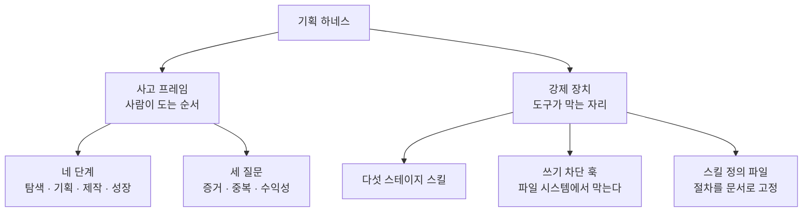
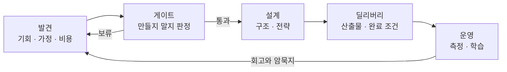

기능 하나를 붙이는 데 사흘이 걸리던 시절에는 무엇을 만들지 오래 고민할 이유가 있었다. 고민이 틀려도 사흘이면 되돌릴 수 있다는 말이 아니라, 사흘이라는 비용이 그 자체로 필터였다는 뜻이다. 만드는 일이 비쌌으므로 아무거나 만들자는 제안은 자연히 걸러졌다.

그 필터가 사라졌다. 초안 수준의 기능은 몇 시간이면 돌아가는 형태로 나오고, 화면 하나를 새로 그리는 데 드는 비용은 회의 한 번보다 싸다. 여기서 흔히 나오는 결론은 「이제 더 많이 만들 수 있다」인데, 실제로 벌어지는 일은 반대다. **만드는 비용이 내려갈수록 잘못 만든 것의 비용만 남는다.** 필터가 비용이었던 자리에 아무것도 놓이지 않으면, 걸러지지 않은 제안이 전부 코드가 되어 쌓인다.

그러면 새 필터를 놓으면 되겠다는 말이 나오고, 대개 문서로 놓는다. 기획서 양식을 정하고 검토 항목을 나열하고 통과 조건을 적는다. 이 방식이 실패하는 이유는 항목이 부실해서가 아니다. **문서는 스스로를 강제하지 못한다.** 항목을 읽고 체크하는 것도 사람이고, 읽지 않고 체크하는 것도 같은 사람이다. 그리고 사람은 아이디어가 마음에 들 때 자기 검증을 가장 적게 한다.

이 시리즈가 다루는 방법론은 그 지점을 정면으로 겨눈다. 판단을 문서가 아니라 **장치**에 싣는다. 조건이 충족되지 않으면 경고를 띄우는 것이 아니라 다음 산출물의 생성 자체를 막는다. 기획서 파일이 만들어지지 않으면 그다음 작업은 시작될 수 없고, 시작될 수 없으면 건너뛸 수도 없다.

이 글이 하는 일은 지형을 그리는 것까지다. 각 스테이지가 무엇을 근거로 통과와 보류를 가르는지, 그 기준의 수치가 얼마인지는 뒤의 여덟 편이 하나씩 맡는다. 여기 남는 것은 넷이다. 판단이 밟고 지나가는 경로, 구간마다 뒤로 넘어가는 산출물, 편에 따라 층이 달라지는 낱말, 그리고 어떤 물음이 몇 편에 실려 있는지.

## 「기획」이라는 낱말을 먼저 갈라 둔다

이 낱말은 이 블로그 안에서만도 두 가지를 가리킨다. 하나는 **직무의 이름**이다. 요구를 모으고 우선순위를 매기고 산출물을 쓰는 사람의 일 전체를 「기획」이라 부르는 용법이며, 프로덕트 매니지먼트를 다루는 글들이 이 뜻으로 쓴다.

다른 하나는 **공정의 한 구간**이다. 무엇을 만들지 이미 정해진 뒤에 그것을 어디까지 만들지 확정하는 단계를 가리키며, 이 시리즈는 끝까지 이 뜻으로 쓴다. 아홉 편에서 「기획 단계」라고 쓰면 그것은 직무가 아니라 **탐색과 제작 사이에 놓인 두 번째 구간**이다.

구분이 중요한 이유는 두 뜻이 다루는 대상이 다르기 때문이다. 직무로서의 기획은 「누가 무엇을 하는가」의 문제이고, 구간으로서의 기획은 「어떤 조건이 충족돼야 다음으로 넘어가는가」의 문제다. 뒤의 여덟 편이 내내 답하는 것은 후자다.

## 두 언어로 같은 것을 두 번 말한다

이 방법론은 같은 순서를 두 벌로 설명한다. 하나는 사람이 머릿속에서 도는 **네 단계**이고, 다른 하나는 도구가 파일 시스템에서 강제하는 **다섯 스테이지**다. 둘을 별개로 외우면 혼란스럽지만, 대응 관계를 먼저 잡아 두면 하나다.

| 사람이 도는 단계 | 그 단계가 묻는 것 | 도구가 맡는 자리 | 무엇으로 강제하나 |
| --- | --- | --- | --- |
| ① 탐색 | 이걸 만들 만한가 | 발견 절차와 판정 게이트 | 근거 문서의 존재와 출처 확인 |
| ② 기획 | 무엇을, 어디까지 | 딜리버리 절차 | 승인 전 산출물 파일 쓰기 차단 |
| ③ 제작 | 어떻게, 일관되게 | 설계와 딜리버리 | 빌드 단계의 검사 세 종과 완료 증거 |
| ④ 성장 | 쓰이고 있는가, 다음은 | 운영 절차 | 출시 전 가설과 실측의 대조 |

**왼쪽 두 열은 사람의 어휘이고 오른쪽 두 열은 파일 시스템의 어휘다.** 이 시리즈가 반복해서 하는 일은 왼쪽을 오른쪽으로 옮기는 것이며, 옮겨지지 않은 판단은 결국 지켜지지 않는다는 것이 전제다.

원 자료가 이 전제에 붙인 논거는 방법론이 아니라 심리에 관한 것이다.

> 사람은 신날 때 탐색을 건너뛰고, 재밌을 때 일관성을 잊는다. 도구는 안 잊는다.

그래서 체크리스트가 아니라 게이트다. 체크리스트는 읽지 않고 체크할 수 있지만, 게이트는 통과하지 못하면 다음 파일이 존재하지 않는다.

전체를 한 장으로 놓으면 이렇게 갈린다.

**왼쪽 가지는 지켜지지 않아도 아무 일도 일어나지 않고, 오른쪽 가지는 지켜지지 않으면 작업이 멈춘다.** 이 시리즈의 여덟 편은 대부분 왼쪽을 오른쪽으로 옮기는 방법에 관한 것이다.

## 다섯 스테이지가 도는 고리

도구 쪽의 다섯 스테이지는 이렇게 이어진다.

읽는 법이 셋 있다.

첫째, **판정하는 자리와 근거를 모으는 자리가 분리돼 있다.** 발견 단계는 증거를 모을 뿐 통과 여부를 정하지 않고, 게이트는 판정할 뿐 증거를 만들지 않는다. 같은 사람이 둘 다 하더라도 절차가 나뉘어 있으면 「자기가 모은 근거로 자기가 통과시키는」 일이 한 단계 늦춰진다.

둘째, **보류가 나오면 앞으로 가지 못하고 되돌아간다.** 화살표가 발견으로 되돌아가는 것이 이 그림의 핵심이며, 뒤에서 다시 짚는다.

셋째, **운영은 끝이 아니라 다음 발견의 입력이다.** 마지막 화살표가 처음으로 이어지므로 이것은 직선이 아니라 고리다.

## 되돌림이 비용이 아니라 자산인 이유

게이트에서 보류가 나오면 그 아이디어는 진행되지 않는다. 손실처럼 보이지만 셈을 해 보면 방향이 반대다.

| 잘못된 가정이 드러나는 시점 | 그때까지 쓴 것 | 되돌리는 비용 |
| --- | --- | --- |
| 발견 단계 | 조사 시간 | 조사 대상을 바꾼다 |
| 게이트 | 조사 + 판정 | 아이디어를 보류 목록에 넣는다 |
| 설계 이후 | 조사 + 판정 + 구조 결정 | 구조를 다시 짠다 |
| 출시 이후 | 위 전부 + 구현 + 운영 | 만든 것을 걷어내고 사용자에게 설명한다 |

행이 내려갈수록 왼쪽 열은 한 항목씩 늘어나는데 오른쪽 열은 성격 자체가 바뀐다. **위쪽 두 행에서는 되돌림이 「다시 하는 일」이지만, 아래쪽 두 행에서는 「이미 한 일을 없애는 일」이 된다.** 없애는 데도 비용이 들고, 없앤 자리에 남는 것은 없다.

여기서 나오는 원칙이 하나 있다. **보류는 실패가 아니라 정상 출력이다.** 게이트가 늘 통과만 내놓는다면 그것은 아이디어가 좋아서가 아니라 게이트가 작동하지 않는다는 뜻이다. 통과와 보류가 섞여 나올 때 비로소 판정이 판정으로 기능한다.

그리고 보류된 아이디어는 지워지지 않는다. 왜 보류했는지와 **어떤 조건이 충족되면 다시 열 것인지**를 함께 기록해 남긴다. 기록이 없으면 반년 뒤 같은 아이디어가 같은 근거로 다시 올라오고, 그때 다시 조사한다.

## 단계마다 무엇이 남는가

각 단계는 다음 단계가 입력으로 쓸 것을 남긴다. 남는 것이 없으면 그 단계는 돈 것이 아니다.

| 단계 | 남기는 것 | 다음 단계가 그것으로 하는 일 |
| --- | --- | --- |
| 발견 | 문제 정의, 가정 위험맵, 통증·원가·시장·경쟁 네 문서 | 무엇을 먼저 반증할지 고른다 |
| 게이트 | 판정서, 보류 시 재개 조건, 하지 않을 목록의 새 행 | 설계에 들어갈지 결정한다 |
| 설계 | 구조 문서, 층 구분, 왜 무너지지 않는가에 대한 답 | 만들 범위를 자른다 |
| 딜리버리 | 요구사항 문서, 첫 주 완료 조건, 검증 증거 | 무엇이 끝났는지 판정한다 |
| 운영 | 지표 한 개와 가드레일, 회고 채점표 | 다음 발견의 주제를 정한다 |

**오른쪽 열이 비어 있는 산출물은 만들 이유가 없다.** 이 시리즈가 문서 양식을 다루면서도 양식 자체를 목적으로 두지 않는 이유가 그것이다.

표에서 두 행만 성격이 다르다. 게이트가 남기는 **하지 않을 목록**과 운영이 남기는 **회고 채점표**는 다음 단계가 쓰는 것이 아니라 **다음 사이클이 쓴다.** 나머지 셋은 한 번 쓰이고 나면 역할이 끝나지만, 이 둘은 쌓일수록 값이 올라간다 — 같은 아이디어를 두 번 조사하지 않게 하고, 예측이 어디서 빗나가는지를 누적으로 보여 준다.

## 용어 정리

아홉 편이 공유하는 어휘다. 뒤의 편들은 여기서 자기 글에 필요한 행만 추려 다시 싣는다. **판정 기준의 수치는 여기 적지 않는다** — 그것은 기준을 다루는 편의 몫이다.

### 판단의 어휘

| 용어 | 원어 | 뜻 | 다루는 편 |
| --- | --- | --- | --- |
| WHETHER | whether | 만들어야 하는가. 만들 가치 자체를 묻는 판단 | 편3 · 편4 |
| HOW | how | 어떻게 만드는가. 스택과 화면과 구현 방식 | 편5 |
| 게이트 | gate | 조건 미달이면 다음 산출물 생성을 막는 장치. 경고가 아니라 차단 | 편4 |
| 진입과 통과의 구분 | — | 부채를 안고 다음 단계에 들어가는 것과, 조건을 채워 통과하는 것은 다르다 | 편4 |
| 게이트 역설 | gate-paradox | 모의 계산이 아무리 정교해도 실제 증거가 없으면 게이트가 구조적으로 열리지 않는 상태 | 편4 |
| 소리 내어 실패하기 | Fail Loud | 검증되지 않은 것을 「완료」로 세탁하지 않고 표면에 드러내는 원칙 | 편4 · 편6 |
| 하지 않을 목록 | Do-Not-Build | 만들지 않기로 한 것을 이유와 함께 덧붙이기만 하며 영구 보관하는 기록 | 편4 |
| 재개 조건 | reopen_trigger | 무엇이 달라지면 이 건을 다시 꺼낼지 미리 적어 둔 조건. 그것이 채워지지 않는 한 보류가 유지된다 | 편4 |

### 증거와 비용의 어휘

| 용어 | 원어 | 뜻 | 다루는 편 |
| --- | --- | --- | --- |
| 신호 게이트 | Signal Gate | 통증·원가·시장·경쟁 네 문서가 존재하고 출처가 붙어 있는지 확인하는 0단계 검사 | 편4 |
| 증거 채점표 | evidence-rubric | 증거의 강도를 100점 척도로 채점해 다음 행동을 가르는 표 | 편4 |
| 매출원가 | COGS | 여기서는 요청 한 건당 드는 모델·인프라 운영비 | 편4 · 편5 |
| 원가 센티넬 | — | 일정 사용량을 가정해 운영비와 마진을 코드로 결정론적으로 계산하는 장치 | 편4 |
| 지불 의향과 제공 원가 | WTP / CTS | 낼 의향이 있는 금액과 제공에 드는 원가. 둘의 차이가 건당 수익이다 | 편3 · 편5 |
| 단위경제 | Unit Economics | 고객 한 명당의 수익과 비용 구조 | 편5 |
| 생애가치와 획득비용 | LTV / CAC | 고객 한 명이 남기는 총액과 그 고객을 데려오는 데 든 비용 | 편5 |

### 문제를 세우는 어휘

| 용어 | 원어 | 뜻 | 다루는 편 |
| --- | --- | --- | --- |
| 할 일 관점 | JTBD | 「어떤 상황에서 어떤 동기로 무엇을 이루려 하는가」 형식으로 문제를 적는 방식 | 편3 |
| 맘 테스트 | Mom Test | 무엇을 원하느냐가 아니라 **지금까지 실제로 무엇을 했느냐**만 묻게 하는 인터뷰 규율 | 편3 |
| 기회 해법 나무 | OST | 성과에서 기회로, 기회에서 해법과 실험으로 역산해 내려가는 구조화 | 편3 |
| 교두보 | beachhead | 처음 잡을 하나의 좁은 시장. 한 번에 하나만 잡는다 | 편5 |
| 해자 | Moat | 왜 무너지지 않는가, 그리고 왜 모방당하지 않는가에 대한 답 | 편5 |
| 사용자와 지불자의 분리 | B2B2C | 쓰는 사람과 돈 내는 사람이 다른 구조 | 편5 |

### 설계와 구현의 어휘

| 용어 | 원어 | 뜻 | 다루는 편 |
| --- | --- | --- | --- |
| 라이프사이클 | 4D — Discovery · Definition · Delivery · Growth | 탐색·기획·제작·성장 네 단계를 도는 바퀴 | 편2 |
| 플러그인 묶음 | — | 다섯 스테이지를 스킬로 구현해 한데 묶은 것 | 편8 |
| 세 층 설계 | 3-tier | 기반·조율·내용으로 층을 갈라 바뀌는 것과 안 바뀌는 것을 나누는 설계 | 편5 |
| 쓰기 차단 훅 | gate_guard | 승인 전에 요구사항 문서나 명세 파일을 쓰려 하면 실패 코드로 막는 장치 | 편6 |
| 사람 개입 지점 | HITL | 자동화 흐름 가운데 사람이 판단을 넣는 자리 | 편5 · 편7 |

### 측정과 자산화의 어휘

| 용어 | 원어 | 뜻 | 다루는 편 |
| --- | --- | --- | --- |
| 단 하나의 지표 | OMTM | 지금 단계에서 가장 중요한 지표 하나 | 편7 |
| 가드레일 지표 | guardrail metric | 올리는 것이 목표가 아니라 **떨어뜨리지 않는 것이 조건**인 지표 | 편7 |
| 중앙값과 꼬리값 | p50 / p90 | 절반이 그 아래인 값과 상위 10%의 값. 평균이 아니라 꼬리를 본다 | 편7 |
| 완료의 정의 | DoD | 무엇이 충족돼야 「됐다」인지를 미리 적어 둔 것 | 편6 |
| 암묵지 | TK | 운영에서 얻었지만 문서에 적히지 않은 판단 노하우 | 편7 · 편8 |
| 사후 회고 | post-retro | 게이트를 지날 때 세웠던 예측을 실제 수치와 맞춰 채점하고 고리를 닫는 회고 | 편7 |
| 에이전트 스킬 | Agent Skills | 정해진 위치에 규약 파일 하나로 두는 절차 정의 | 편8 |
| 스킬 생성기 | skill-creator | 의도에서 스킬 문서와 테스트와 패키징까지 잡아 주는 스킬 | 편8 |
| 공개 우선 | Public-First | 실명과 개인정보 없이 가상 데이터로 작업하고 키는 환경 파일에 두는 원칙 | 편8 |
| 모범 사례 | BP | 잘한 일을 기리는 말이 아니라 **다른 사람이 그대로 따라 할 수 있는 절차** | 편8 |

## 이 시리즈가 다루지 않는 것

지도를 그릴 때는 무엇이 지도 밖인지도 그어야 한다. 세 가지가 밖이다.

**첫째, 만드는 방법 자체는 다루지 않는다.** 어떤 스택을 고르고 어떤 구조로 짜는지는 이 시리즈의 대상이 아니다. 여기서 다루는 설계는 「무엇을 만들지 정하는 판단을 날카롭게 하기 위한 설계」이지 구현 설계가 아니며, 편5가 구조 문서를 다루는 것도 그 문서가 **검증의 입력**이기 때문이다.

**둘째, 조직과 직무의 문제는 다루지 않는다.** 누가 이 판단을 내리는가, 그 사람이 조직의 어디에 앉아 있는가, 이해관계자를 어떻게 설득하는가는 다른 층의 물음이다. 이 시리즈는 **판단이 어떤 절차를 지나야 하는가**만 다루며, 그 절차를 도는 사람이 한 명이든 팀이든 형태는 같다고 본다.

**셋째, 도메인 지식은 다루지 않는다.** 커머스의 상품 구조가 어떻게 생겼는지, 금융에서 무엇이 규제되는지 같은 지식은 판단의 재료이지 판단의 절차가 아니다. 재료가 없으면 게이트는 통과되지 않지만, 재료를 모으는 법을 이 시리즈가 가르치지는 않는다.

셋을 밖에 두는 이유는 같다. **이 시리즈가 답하려는 물음이 「무엇이 좋은 판단인가」가 아니라 「판단을 건너뛸 수 없게 하려면 무엇을 놓아야 하는가」이기 때문이다.** 좋은 판단의 내용은 도메인마다 다르지만, 건너뛰지 못하게 하는 장치는 도메인이 달라도 같은 자리에 놓인다.

밖에 둔 것 가운데 둘은 이미 다른 글이 맡고 있다.

| 이 시리즈가 다루지 않는 것 | 그것을 다루는 글 |
| --- | --- |
| 기획·디자인·퍼포먼스 마케팅·경쟁사 분석 네 영역이 어떤 도구를 쓰는가 — 도구의 목록과 선택 기준 | [병목은 만드는 자리에 없다](/blog/ai-transformation/discovery-to-growth-tooling/) |
| 요구사항부터 배포까지 여섯 단계 각각에 **사람이 승인하는** 게이트를 어디에 박는가 | [요구사항에서 운영까지 여섯 게이트](/blog/ai-transformation/sdlc-human-gates/) |

🔴 **뒤의 글과 이 시리즈는 「게이트」라는 같은 낱말을 쓰지만 가리키는 층이 다르다.** 그 글의 게이트는 **사람이** 산출물을 보고 통과를 정하는 자리이고, 여기서 다루는 게이트는 **조건이 모자라면 파일이 만들어지지 않는** 장치다. 다루는 구간도 다르지만 — 그 글은 요구사항부터 배포까지를 훑고 이 시리즈는 그보다 앞의 한 자리에 머문다 — **누가 게이트를 놓는가가 먼저 다르다.** 사람이 놓은 게이트는 바쁠 때 건너뛸 수 있고 도구가 놓은 게이트는 그럴 수 없다는 것이 이 시리즈의 출발점이다.

## 여덟 편이 각각 내세우는 것

여덟 편 가운데 **일곱 편**이 각자 하나씩 주장을 세운다. 편9는 앞의 물음을 모으는 자리라 자기 주장을 따로 두지 않는다. 지도를 먼저 훑을 때는 이 목록만 봐도 된다.

| 편 | 이 편이 세우는 주장 |
| :---: | --- |
| 2 | 좋은 제품은 순서로 만들어지고, 그 순서의 의존 관계는 바뀌지 않는다 |
| 3 | 통과와 보류는 직감이 아니라 미리 정한 기준으로 갈린다. 가설은 세우는 것보다 **죽이는 것이 싸다** |
| 4 | 진입과 통과는 다른 사건이다. 부채를 안고 들어간 것을 통과로 세지 않는다 |
| 5 | 설계는 검증을 날카롭게 하는 도구다. **통과 판정을 주는 것은 여전히 게이트다** |
| 6 | 「됐다」는 선언이 아니라 증거로 댄다. 무엇이 충족돼야 됐다인지는 시작 전에 적는다 |
| 7 | 측정은 성적표가 아니라 다음 결정의 입력이다. 다음 결정을 바꾸지 못하는 지표는 재도 소용없다 |
| 8 | 한 사람의 판단 기준은 문서로 남겨야 팀의 것이 된다. 남기지 않으면 그 사람과 함께 사라진다 |
| 9 | — (앞 여덟 편에 들어온 물음들을 모은다) |

**주장이 선 일곱 줄 가운데 여섯 줄이 「무엇을 하지 않는가」를 담고 있다.** 순서를 바꾸지 않고, 통과로 세지 않고, 게이트를 대신하지 않고, 선언하지 않고, 재고 넘어가지 않고, 혼자 갖고 있지 않는다. 이 방법론의 형태가 그렇다 — 더 잘하는 법이 아니라 **덜 건너뛰는 법**이다.

## 이 시리즈의 구성

여덟 편이 이 지도의 각 자리를 하나씩 맡는다.

| 편 | 다루는 것 | 이 편이 답하는 질문 |
| --- | --- | --- |
| [편2 — 순서를 바꾸면 어디가 무너지는가](/blog/ai-product-planning/four-stages-of-planning/) | 탐색·기획·제작·성장의 순환 구조와 단계를 건너뛸 때의 비용 | 순서를 바꾸면 무엇이 망가지는가 |
| [편3 — 만들지 말지를 먼저 묻는다](/blog/ai-product-planning/whether-three-questions/) | 증거·중복·수익성 세 관문과 발견 단계의 도구 | 조사를 어디서부터 시작하는가 |
| [편4 — 통과와 보류를 가르는 게이트](/blog/ai-product-planning/whether-gate/) | 판정 절차와 통과 기준, 보류 기록의 형식 | 무엇이 충족돼야 다음으로 가는가 |
| 편5 — 설계 단계가 남기는 것 | 구조 문서와 층 설계, 단위경제와 시장 선택 | 검증을 날카롭게 하는 설계란 무엇인가 |
| 편6 — 딜리버리와 요구사항 문서의 표준 | 빌드 파이프라인, 완료 조건, 문서 골격 여섯 항목 | 「됐다」를 말이 아니라 증거로 어떻게 대는가 |
| 편7 — 운영은 측정이 아니라 다음 결정의 입력이다 | 지표 체계, 꼬리값, 회고로 고리를 닫는 방법 | 무엇을 재야 다음 판단이 나오는가 |
| 편8 — 개인의 판단을 팀의 자산으로 | 스킬화와 패키징, 배포와 확산 | 한 사람의 기준을 어떻게 남기는가 |
| 편9 — 되돌아오는 질문들 | 여덟 편을 읽고 나면 남는 물음들 | — |

**편2와 편3이 사고 프레임을 세우고, 편4부터 편7까지가 스테이지를 하나씩 지나며, 편8이 그것을 남기는 방법을 다룬다.** 순서대로 읽는 것을 전제로 썼지만, 특정 스테이지만 필요하다면 편4~편7 가운데 해당 편으로 바로 들어가도 된다 — 각 편은 자기가 쓰는 용어를 다시 싣는다.

## 정리

세 가지를 잡아 두면 뒤의 여덟 편이 읽힌다.

**첫째, 이 방법론이 겨누는 것은 판단의 품질이 아니라 판단의 강제력이다.** 무엇이 좋은 판단인지에 대한 이야기는 이미 많고, 이 시리즈가 보태는 것은 그 판단을 건너뛸 수 없게 만드는 장치 쪽이다.

**둘째, 판정하는 자리와 근거를 모으는 자리가 나뉘어 있다.** 발견은 증거를 모으고 게이트는 판정한다. 이 분리가 없으면 게이트는 자기 근거로 자기를 통과시킨다.

**셋째, 보류는 정상 출력이다.** 통과만 나오는 게이트는 작동하지 않는 게이트이며, 보류된 것을 재개 조건과 함께 남겨 두는 일까지가 게이트의 몫이다.

다음 편은 사람이 도는 네 단계를 다룬다 — 왜 이 순서이며, 순서를 바꾸면 비용이 어디서 터지는지다.
