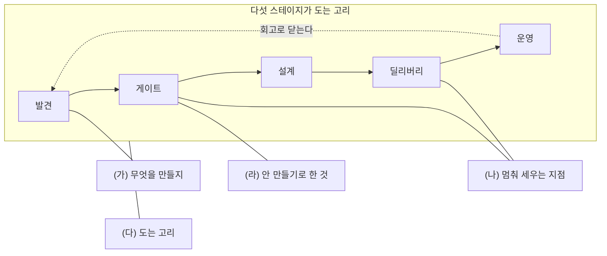

[앞 편](/blog/ai-product-planning/skill-packaging/)으로 다섯 단계와 그것을 도구의 형태로 굳히는 방법까지 끝났다. 여기서 남는 일은 방향이 반대다. 앞의 여덟 편은 머릿속에 있던 판단을 밖으로 꺼내 절차와 파일에 싣는 쪽이었고, 이 편은 그렇게 실어 둔 것을 다시 말로 꺼내야 하는 자리를 다룬다.

하네스를 실제로 굴려 본 사람은 언젠가 **자기가 만든 것을 설명해야 하는 자리**에 선다. 새로 합류한 사람에게 우리 팀이 왜 이런 절차를 쓰는지 말해야 할 때, 다른 조직에 방식을 소개할 때, 자기 일을 정리해 내보여야 할 때가 전부 그 자리다. 거기서 **어떤 질문을 받게 되는지**를 모으고, 물음 하나하나가 **어느 단계의 무엇으로 답해지는지**까지 짚는다.

앞 편들이 사슬을 따라 한 방향으로 내려왔다면 이 편은 그 사슬을 가로로 자른다. 되돌아오는 질문은 단계 순서를 지켜 오지 않기 때문이다. 「왜 그렇게 골랐나」 하나가 게이트를 다룬 편과 설계를 다룬 편에 동시에 걸린다.

## 네 갈래로 이어 붙는다

시리즈에서 빌려 쓸 수 있는 것은 네 갈래다. 각 갈래마다 왼쪽은 여기서 가져가는 어휘와 장치이고, 오른쪽은 그것으로 정리해야 할 자기 쪽 재료다.

| 갈래 | 이 시리즈에서 빌려 오는 것 | 자기 쪽에서 채워야 하는 것 |
| --- | --- | --- |
| **(가) 무엇을 만들지 정하는 판단** | WHETHER 가 HOW 보다 먼저 · 네 단계의 순환 · 할 일 관점 · 맘 테스트 | 요구를 모아 범위를 자르고 순서를 매긴 실제 경위 |
| **(나) 멈춰 세우는 지점의 설계** | 신호 게이트 · 증거 채점표 · 쓰기 차단 훅 · 검증 지점 | 조직 어디에 **정지 지점**을 놓았는가. 코드 검토, 배포 승인, 명세 확인 |
| **(다) 요구에서 구조를 거쳐 운영까지 도는 고리** | 발견에서 운영까지의 다섯 스테이지와 사후 회고로 닫는 폐루프 | 팀의 절차를 어떻게 설계하고 굴렸는가. 회고에서 나온 것이 다음 주기의 첫 입력으로 들어가도록 짜 놓은 구조 |
| **(라) 안 만들기로 한 결정의 기록** | 하지 않을 목록 · 멈추기로 한 것도 성과다 · 비범위 | 무엇을 **하지 않기로** 했고 그 결정을 어디에 어떻게 남겼는가 |

네 갈래가 하네스의 어느 자리에서 나오는지는 이렇게 갈린다.

걸리는 자리의 개수가 셋으로 갈린다. **(가)와 (라)는 한 스테이지에서 나오고, (나)는 게이트와 딜리버리 두 곳에 걸리며, (다)만 특정 스테이지가 아니라 고리 자체에 걸린다.** (다)가 그렇게 되는 것은 그 갈래가 「어느 단계를 잘했나」가 아니라 「단계들이 서로 물려 돌아가게 만들었나」를 묻기 때문이다. 이 차이가 답변의 길이를 가른다. 앞의 셋은 사례 하나로 답이 되지만 (다)는 **한 바퀴가 돌았다는 사실**을 보여야 답이 된다.

오른쪽 열이 비어 있으면 왼쪽 열은 답이 되지 못한다. 어휘만 옮겨 오면 「좋은 방법론을 알고 있다」까지가 전부이고, 듣는 쪽이 알고 싶은 것은 그다음이다. **빌려 온 것은 자기 재료를 담는 그릇이지 재료가 아니다.**

## 여덟 번 되돌아오는 물음

같은 질문이 표현만 바꿔 계속 돌아온다. 여덟 개로 좁혔고, 각 답은 30초 안에 세울 수 있는 네 조각으로 잡았다. 조각 가운데 **자기 사례**만 이 표에서 비어 있다 — 나머지 셋은 시리즈가 채워 주지만 그 칸은 읽는 쪽이 채워야 한다.

| # | 되돌아오는 물음 | 30초 안에 세우는 뼈대 |
| ---: | --- | --- |
| 1 | 무엇을 만들지는 어떻게 정했나 | ① 어떻게보다 **만들 값이 있는가**를 먼저 묻는다 ② 관문 셋을 지난다 — 원하는 사람이 있다는 증거, 이미 있는 것과의 겹침, 팔았을 때 남는가 ③ 증거는 말이 아니라 **지금까지 한 행동**에서 센다 ④ [자기 사례 — 요구를 받아 범위를 잘라낸 대목] |
| 2 | 안 만들기로 한 적이 있나 | ① 이 일의 핵심 기술은 넣을 것이 아니라 **뺄 것**을 먼저 정하는 쪽이다 ② 만들지 않기로 한 것은 **이유와 함께 남긴다** — 반년 뒤 같은 논쟁이 다시 열리지 않게 ③ [자기 사례 — 요청이 들어왔는데도 범위 밖에 둔 것과 그 근거] ④ 그래서 얻은 것 — 내보내는 시점을 지켰고 팀이 갈려 나가지 않았다 |
| 3 | 도구를 작업 절차에 어떻게 들였나 | ① 조건을 따지고 막는 자리는 결정론적 장치가 맡고, 초안과 요약만 모델에 준다 ② 사람이 방향과 검증을 쥐고, 모델에는 할 일이 아니라 **목표와 통과 조건**을 준다 ③ 「하지 마세요」라는 문장은 지켜지지 않으므로 훅이나 검사로 **막는다** ④ [자기 사례 — 도입한 자동화와 그 옆에 세운 안전장치] |
| 4 | 팀의 판단 품질은 어떻게 관리했나 | ① 사람마다 다른 기량에 판단을 맡기는 대신 **통과 조건이 붙은 지점**을 절차 안에 심는다 ② 그 지점은 확인 목록과 다르다. 조건에 미치지 못하면 뒤따르는 산출물이 아예 만들어지지 않는다 ③ 시작한 이유와 멈춘 이유를 적어 두면 그것이 다음번 판단의 입력이 된다 ④ [자기 사례 — 검토와 승인 절차를 설계한 대목] |
| 5 | 무엇을 재고 있었나 | ① 재는 것이 열 개면 우선순위가 없는 것이다 — **하나로 좁힌다** ② 앞서 움직이는 지표 하나에 **무너지면 안 되는 선** 하나를 짝지어 둔다 ③ 평균이 아니라 **뒤쪽 10% 와 실패한 비율**을 본다. 신뢰가 깨지는 자리는 거기다 ④ 잰 값의 쓰임은 성적을 매기는 것이 아니라 **다음 결정에 넣는 것**이다 |
| 6 | 잘 안 된 일은 무엇이었나 | ① 대개 원인은 못 만들어서가 아니라 **한 단계를 건너뛰어서**다 ② 되돌리는 값은 뒤로 갈수록 곱으로 커진다 ③ [자기 사례 — 건너뛴 단계가 어디였고 사고가 어느 지점에서 났는지] ④ 그다음에 바꾼 것 — 검증하는 자리를 절차에 **적어 두었다** |
| 7 | AI 를 쓰는 제품의 수익성은 어떻게 보나 | ① 보통의 구독형과 달리 **한 건 더 파는 값이 0 이 아니다** — 호출마다 비용이 붙는다 ② 그래서 요청당 원가를 한가운데 값뿐 아니라 **뒤쪽 값까지** 본다 ③ 어느 요청을 어느 모델로 보내는가가 단위경제의 절반을 정한다 ④ [자기 사례 — 비용 구조를 놓고 내린 설계 판단] |
| 8 | 조직에 배운 것이 어떻게 쌓였나 | ① 고칠 것을 찾는 일과 배운 것을 남기는 일은 다른 활동이고, 둘 다 해야 복리가 붙는다 ② 되풀이되는 판단은 **규칙의 형태로 굳혀** 다음번에는 저절로 걸리게 한다 ③ 만들지 않기로 한 것 역시 지우지 않고 두어 같은 실수가 되풀이되지 않게 한다 ④ [자기 사례 — 규약과 문서와 합류 절차를 자산으로 만든 대목] |

여덟 줄을 놓고 보면 네 갈래와의 대응이 드러난다. **1·2 번이 (가)와 (라), 3·4 번이 (나), 5·6·8 번이 (다), 7 번이 설계 단계의 단위경제에 걸린다.** 어느 질문을 받든 답의 출처가 시리즈의 특정 자리로 좁혀지므로, 여덟 개를 통째로 외우는 대신 **질문이 어느 단계를 겨누는지** 먼저 가르는 편이 빠르다.

빌려 온 틀이 앞에 서고 자기 재료가 뒤에 붙는 배치는 여덟 줄에서 같지만, 그 자리는 셋으로 갈린다. **다섯 줄은 넷째 조각이 자기 사례이고, 2 번과 6 번은 셋째로 앞당겨 넷째에 그 결과를 붙이며, 5 번에는 그 칸이 아예 없다.** 앞당긴 둘은 무엇을 뺐는지와 어디가 터졌는지를 묻는 질문이라, 틀을 길게 세우다가 정작 무슨 일이 있었는지 말하지 못한 채 시간이 끝나기 쉽다. 5 번이 비어 있는 것은 지표를 어떻게 골랐느냐는 물음에서 **고른 방식 자체가 곧 답**이기 때문이다.

## 말로 옮길 때 쓰는 열 개의 낱말

시리즈의 어휘 가운데 실제로 입에 올릴 만한 것은 많지 않다. 열 개면 충분하고, 각각은 특정한 종류의 질문에서만 값을 한다.

| 낱말 | 어떤 물음에 꺼내나 |
| --- | --- |
| **만들 값이 있는가를 먼저 묻는다** | 무엇을 만들지 정하는 판단력을 말할 때 |
| **뺄 것을 먼저 정한다 · 비범위** | 범위 관리와 우선순위를 묻는 자리에 |
| **게이트는 경고가 아니라 차단이다** | 절차 설계와 품질 관리를 묻는 자리에 |
| **진입과 통과는 다르다 · 소리 내어 실패하기** | 위험 관리와 정직한 보고 문화를 말할 때 |
| **앞서는 지표와 무너지면 안 되는 선** | 지표를 어떻게 설계했는지 묻는 자리에 |
| **단 하나의 지표** | 집중과 포기를 말해야 하는 대목에 |
| **평균이 아니라 꼬리** | 성능·비용·신뢰성을 묻는 자리에 |
| **조건 판단은 결정론적 장치가 맡는다** | 도구를 어떤 방식으로 들였는지 묻는 자리에 |
| **학습이 쌓인 것이 곧 해자다** | 조직 역량이 어떻게 축적됐는지 말할 때 |
| **모범 사례는 남이 복제할 수 있는 절차다** | 지식 공유와 표준화를 묻는 자리에 |

열 줄이 두 무리로 갈린다. **위의 넷은 판단의 방식**을 가리키고 **아래 여섯 가운데 셋은 측정, 셋은 도구와 축적**을 가리킨다. 오른쪽 열이 서로 겹치지 않는다는 점이 이 표의 쓸모다 — 질문의 종류가 낱말을 고르지, 낱말을 먼저 고르고 질문을 끌어오지 않는다.

낱말을 꺼낸 다음에는 반드시 자기 문장이 이어져야 한다. 「게이트는 차단이다」까지만 말하면 방법론을 인용한 것이고, 거기에 「그래서 우리 팀에서는 승인 기록이 없으면 배포가 시작되지 않게 했다」가 붙어야 자기 이야기가 된다. **개념어는 문장의 주어가 아니라 술어 자리에 놓일 때 값을 한다.**

## 넘지 말아야 할 네 줄

이 시리즈에 실린 사례는 방법론을 설명하려고 세운 예시다. 여섯 칸을 채운 시니어 건강 관리 문서도, 스킬 둘을 한데 싼 예시 묶음도, 판정을 보류로 낸 대목도 전부 그렇다. [편6](/blog/ai-product-planning/deliver-and-prd/)이 그 문서를 내놓으면서 **가상 데이터로 만든 예시**라고 못박아 둔 것도 같은 이유다.

빌려 온 틀과 자기가 한 일 사이의 경계가 흐려지면 한 번의 되물음에서 무너진다. 「그 제품은 지금 어떻게 됐나」, 「그 조사는 몇 건이었나」 같은 물음이 그 자리에서 나오기 때문이다. 그래서 네 줄을 미리 그어 둔다.

| 해도 되는 것 | 넘어서면 안 되는 것 |
| --- | --- |
| 틀과 어휘를 빌려 **자기 경험을 정리**한다 | 여기 실린 예시를 자기가 한 일로 말한다 |
| 「이런 틀로 정리하면」이라고 **전제를 밝히고** 시작한다 | 예시에 붙은 숫자를 자기가 낸 성과처럼 가져다 쓴다 |
| 게이트·비범위·단 하나의 지표 같은 **개념어를 자기 사례에 적용**한다 | 써 본 적 없는 도구나 묶음을 자기 팀에 들였다고 말한다 |
| 어디서 익혔는지 물으면 **최근에 정리한 방법론**이라고 답한다 | 익힌 것을 겪은 일로 포장한다 |

네 줄이 다르게 보이지만 하나의 원칙이다. **경계를 미리 밝히면 나머지 전부가 강해지고, 흐리면 사실인 부분까지 함께 의심받는다.** 왼쪽 열은 방법론을 아는 사람의 말이고 오른쪽 열은 방법론을 겪은 척하는 사람의 말인데, 둘의 차이는 내용이 아니라 전제를 밝혔는가에서 갈린다.

수치를 다룰 때는 두 줄이 더 붙는다. 하나, **비어 있는 자기 사례 칸은 실제로 겪은 것으로만 채우고 근거가 없는 숫자는 넣지 않는다.** 둘, **설계와 구현까지만 하고 실제 사용자에게 내놓지 않은 것은 「운영했다」가 아니라 「설계와 구현을 마쳤다」로 말한다.** 이것은 겸손의 문제가 아니라 이 시리즈가 편4에서 세운 원칙과 같은 것이다 — 검증되지 않은 것을 완료로 세탁하지 않는다는 [소리 내어 실패하기](/blog/ai-product-planning/whether-gate/)가 자기 이력을 말하는 자리에도 그대로 적용된다. 게이트를 팀에 놓아 두고 자기 말에는 놓지 않으면 앞의 여덟 편이 통째로 흔들린다.

## 정리

세 가지가 이 편에 남는다.

**첫째, 빌려 온 틀은 그릇이지 내용물이 아니다.** 네 갈래 어디에서든 왼쪽 열만으로는 답이 끝나지 않는다. 듣는 쪽이 확인하려는 것은 방법론을 아는지가 아니라 그 방법론으로 무엇을 정리할 재료가 있는지다.

**둘째, 질문은 단계 순서로 오지 않으므로 답의 출처를 먼저 가른다.** 여덟 물음 전부를 외우는 대신 이 질문이 판단·차단·고리·비용 가운데 어느 쪽을 겨누는지 가르면, 답할 자리가 시리즈의 한 편으로 좁혀진다.

**셋째, 경계를 밝히는 것이 내용을 늘리는 것보다 강하다.** 무엇이 빌린 것이고 무엇이 자기가 한 일인지 먼저 그어 두면 나머지 전부가 그 선 위에서 읽힌다. 흐려 두면 사실인 대목까지 함께 값을 잃는다.

여기까지가 [기획 하네스](/blog/ai-product-planning/planning-harness-map/) 아홉 편이다. 시작은 코드를 만드는 값이 내려간 자리에서 병목이 판단으로 옮겨 갔다는 관찰이었고, 여덟 편이 그 판단을 건너뛸 수 없게 만드는 장치를 하나씩 놓았으며, 이 편은 그렇게 놓은 것을 다시 말로 꺼내는 자리를 다뤘다. **판단을 절차에 싣는 일과 그 절차를 남에게 설명하는 일은 같은 재료를 반대 방향으로 다루는 작업이고, 둘 다 되어야 만든 것이 자기 밖으로 나간다.**
