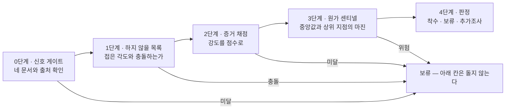
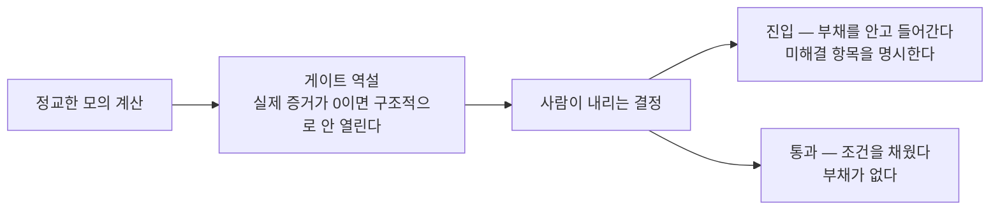

[앞 편](/blog/ai-product-planning/whether-three-questions/)은 만들지 말지를 묻는 세 관문을 세우고 그 답을 어떤 순서로 모아야 값이 싸게 드는지까지 다뤘다. 거기서 만든 것은 판정이 아니라 판정의 **입력**이다. 이 편은 그 입력을 받아 통과와 보류를 가른다.

재료를 앞에 놓고 「이만하면 됐다」고 판단하는 순간 판정은 그날의 사정에 흔들린다. 그래서 이 단계는 다섯 칸으로 쪼개지고 각 칸은 앞 칸의 결과를 받아서만 돈다. 다루는 것은 **판정까지**이며, 통과한 착상을 어떤 산출물로 옮기는지는 다음 편의 몫이다.

## 판정대에 올라가는 것과 내려오는 것

| 항목 | 내용 |
| --- | --- |
| **입력** | 앞 단계의 산출물 — 통증·원가·시장·경쟁 네 문서와 하지 않을 목록 |
| **활동** | 신호 게이트 → 하지 않을 목록 대조 → 증거 채점 → 원가 센티넬 → 판정 |
| **산출물** | 착수 · 보류 · 추가조사 가운데 하나의 판정과, 이유 · 다음 행동 · 막힌 칸 세 줄, 그리고 결정 기록 |
| **통과 기준** | 네 문서가 실제 출처를 갖췄고, 이미 접은 각도와 충돌하지 않으며, 증거 점수가 75 이상이고, 마진이 안전 구간에 있을 것 |
| **막혔을 때** | 앞 칸이 보류를 내면 뒤 칸은 **아예 돌지 않는다** |

마지막 줄이 이 표에서 가장 자주 오해받는 자리다. 막힌 뒤에 남은 칸을 마저 돌리는 것은 무효가 된 입력 위에서 계산을 잇는 일인데, 그렇게 나온 마진도 표에 적히고 나면 근거처럼 읽힌다.

## 검사는 다섯 칸이 직렬로 놓인다

앞의 네 칸이 검사를 맡고 다섯째 칸이 판정을 낸다. 검사하는 칸에서 나온 보류는 어느 자리에서 나오든 같은 곳으로 모인다.

앞 편의 세 관문과 이 다섯 칸은 층이 다르다. 세 관문은 **무엇을 물을지**를 정했고 다섯 칸은 **그 답을 어떻게 검사할지**를 정한다. 첫째 관문의 답이 0단계와 2단계 두 곳에서 검사되듯 관문 하나가 칸 하나에 대응하지도 않는다. 큰 검사 하나는 통과와 미통과만 내놓지만, 다섯으로 쪼개면 **몇 번째 칸에서 멈췄는지**가 함께 나온다.

## 0단계 — 네 문서가 있는가

첫 칸은 내용을 평가하지 않는다. 자료가 **존재하는지**와 그 자료에 **출처가 붙어 있는지**만 본다.

| 문서 | 담기는 내용 | 필수 조건 |
| --- | --- | --- |
| 통증 | 실제 인터뷰 — 날짜와 실제 발화 | 모의 인용 금지. 실제 발화만 |
| 원가 | 요청 한 건당 값의 중앙값과 상위 지점, 마진, 가격의 출처 | 가격 가정에는 모의 표기를 붙인다 |
| 시장 | 시장 규모와 진입 시점 | 조사 라벨과 출처를 함께 |
| 경쟁 | 경쟁 제품 둘과 대체재 하나 | **직접 써 보고** 기록한다 |

네 문서 각각에 출처 절이 필수이며, 이 조건 하나가 증거 없는 진입을 구조적으로 막는다.

통계로 확인된 통증이 크다는 것과 그 통증에 실제로 돈이 오간다는 것은 완전히 다른 사실이고, 통증 문서에만 모의 인용 금지가 붙은 이유가 이것이다. 「직접 써 보고」도 조건을 형식이 아니라 **행위**에 건 것이다.

## 1단계 — 이미 접은 각도와 겹치는가

두 번째 칸은 새 착상을 과거의 기록과 대조한다. 대조 대상은 만들기로 한 것들의 목록이 아니라 **만들지 않기로 한 것들의 목록**이다.

| 항목 | 내용 |
| --- | --- |
| 무엇 | 한 번 접은 착상과 그 이유를 덧붙이기만 하며 영구히 남긴 기록 |
| 왜 | 같은 각도를 다시 검토하느라 시간을 쓰지 않기 위해. 반년 뒤 같은 논쟁을 막는다 |
| 절차 | 목록과 대조 → 충돌하면 재개 조건을 확인 → 채워졌으면 계속, 아니면 즉시 보류 |
| 통과하는 예 | 「개인 대상 한국어 앱」은 이탈률과 획득 비용 때문에 접혔지만, 「비용을 내는 쪽이 고용주인 형태」는 **다른 각도**라 통과한다 |

마지막 행이 이 칸의 판정 방식을 보여 준다. 막는 것은 겹침이 아니라 **접었던 이유가 아직 유효하다는 사실**이고, 그래서 이유를 함께 적는 일이 판정의 재료가 된다. 재개 조건도 접는 시점에 미리 적어 두는데, 그러지 않으면 다시 꺼낼지 말지가 매번 새 논쟁이 되기 때문이다.

기획은 보통 만들 것만 적는데, 안 만들 것을 이유와 함께 영구히 남기는 쪽이 이 단계의 방식이다. 조직 단위로 보면 이것이 **의사결정을 자산으로 쌓는 방법**이다.

## 2단계 — 강도를 점수로 만든다

세 번째 칸은 모인 증거의 **세기**를 잰다. 앞 칸이 존재를 봤다면 이 칸은 무게를 본다.

| 증거 등급 | 예시 | 강도 |
| --- | --- | --- |
| 직감 | 「내가 불편하다」 | 약함 |
| 관찰과 인터뷰 | 잠재 고객이 내놓은 구체적 진술 | 보통 |
| **결제 입증** | 값을 실제로 치른 사례 | 강함 |

채점 결과는 점수 구간으로 다음 행동에 연결된다.

| 점수 | 판정 | 다음 행동 |
| --- | --- | --- |
| **75 이상** | 제작 | 진행한다 |
| **55 ~ 74** | 인터뷰 | 증거를 더 모은다 |
| **35 미만** | 보류 | 증거가 부족하다 — 되돌아간다 |

여기서 나온 「제작」은 증거 하나가 조건을 넘었다는 뜻일 뿐이다. 네 검사를 모두 넘겼다는 뜻의 「착수」는 다섯째 칸에서만 나온다.

점수가 높을수록 진행 쪽이고 낮을수록 되돌아가는 쪽이다. 방향은 당연해 보이지만 이 척도가 재는 것이 「좋은 착상인 정도」가 아니라 **증거가 뒷받침하는 정도**라는 점은 당연하지 않다. 매력적인 착상이 낮은 점수를 받을 때 점수를 의심하는 대신 증거를 더 모으게 하는 것이 이 표의 목적이다. 채점과 함께 **가장 약한 축**이 표시되는 것도 총점만으로는 무엇을 보완할지 알 수 없기 때문이다.

## 3단계 — 한 건당 드는 값이 선을 넘는가

네 번째 칸은 수익성을 본다. 앞의 세 칸이 「원하는 사람이 있는가」를 물었다면 이 칸은 「만들어 주면 남는가」를 묻는다.

| 항목 | 내용 |
| --- | --- |
| 무엇 | 하루 1,000명이 쓴다고 가정했을 때의 운영비를 **코드로** 계산한다 |
| 왜 코드로 | 모델의 추정은 그럴듯한 값을 지어낼 수 있다. 결정론적이고 재현되어야 신뢰가 붙는다 |
| 계산 | 호출 한 건당 값의 중앙값과 상위 지점에 남용 비율을 섞어 총이익률을 낸다 |
| 판정 | 안전(목표 마진 달성) · 조건부 착수 · 위험(수익 불성립) 세 가지 |
| 위험일 때 | 게이트가 **요구사항 문서의 생성을 막는다** |

언어 모델에게 운영비를 물으면 자릿수가 그럴듯한 답이 나오지만 다시 물으면 달라진다. 판정의 근거가 되려면 같은 입력에 같은 값이 나와야 하므로 이 계산만은 생성이 아니라 실행으로 처리한다.

동작은 잘 하는데 하루 1,000건에서 적자가 되는 상태를 만들기 전에 숫자로 잡는 것이 이 칸의 목적이다. 음성 인식처럼 건당 값이 큰 요소가 끼면 마진은 급격히 얇아지고, 가격 가정은 실제 거래로 확인되기 전까지 모의 표기를 유지한다.

## 4단계 — 판정은 셋이다

| 판정 | 의미 | 다음 행동 |
| --- | --- | --- |
| **착수** | 네 검사를 모두 통과했다 | 설계 단계로 넘어간다 |
| **추가조사** | 신호는 있으나 근거가 모자란다 | 지정된 항목을 더 조사한다 |
| **보류** | 증거가 없거나, 충돌하거나, 수익이 성립하지 않는다 | 막힌 칸부터 해결한다 |

착수와 보류만 있는 체계에서 애매한 건은 대부분 착수로 흘러간다 — 보류가 종료처럼 읽히기 때문이다. 그래서 「아직 모른다」를 담을 칸을 따로 두고 **무엇을 더 조사할지**를 함께 적게 한다. 출력이 이유 · 다음 행동 · 막힌 칸 세 줄인 것도 **무엇이 약한지를 명시하게** 만들기 위해서다.

## 진입과 통과는 다르게 적는다

절차를 다 돌린 뒤에는 사람이 결정할 차례가 온다. 조건을 채워 게이트가 열린 경우와, 열리지 않았는데도 진행하기로 하는 경우가 여기서 갈린다.

모의 계산은 게이트를 열지 못하고, 열리지 않은 채 나아가는 일은 사람의 결정으로만 가능하며, 그 결정은 **두 갈래로 갈려 다르게 기록된다.**

| 개념 | 뜻 | 왜 중요한가 |
| --- | --- | --- |
| **게이트 역설** | 모의 계산이 제아무리 정교하게 수렴하더라도, 실증거가 0이면 게이트는 구조상 열리지 않는다 | 모의 계산으로 게이트를 통과시키는 자기기만을 차단한다 |
| **진입과 통과의 구분** | 부채를 진 채 다음 단계로 넘어갈 수는 있지만, 문서에 적히는 낱말은 통과가 아니라 진입이다 | 검증되지 않은 것을 완료로 세탁하지 않는다 |
| **소리 내어 실패하기** | 도구가 이 사실을 숨기지 않고 표면으로 끌어올린다 | 불확실성을 조직이 보게 만든다 |

세 개념이 한 줄로 이어진다. 게이트 역설이 「열리지 않는다」는 사실을 만들고, 진입과 통과의 구분이 그 사실을 기록에 남기며, 소리 내어 실패하기가 그 기록을 감추지 못하게 한다.

이 절차를 실제로 돌린 사례의 결말도 보류였다. 고객 인터뷰가 0건이었고 핵심 가정 하나가 반증됐다. 결정은 통과가 아니라 **부채를 안은 진입**이었고, 인터뷰 세 건 이상이 미해결 항목으로 남았으며 그것이 실패하면 방향을 재고한다는 것까지 적혔다. 판정이 보류일 때 요구되는 것은 중단이 아니라 **부채의 명시**다.

## 건너뛰면 무엇을 치르는가

| 구분 | 비용 |
| --- | --- |
| **정량** | 마진이 위험인 채로 출시하면 사용자가 늘수록 손실이 커진다. 단위당 수익이 음수인 상태이고, 매달 새는 돈이 된다 |
| **정량** | 이미 접은 각도를 다시 검토하면 과거에 쓴 검증 시간을 그대로 다시 쓴다 |
| **정성** | 느낌으로 통과시킨 건이 우선순위를 점유해 다른 기회를 잃는다 |
| **정성** | 검증되지 않은 것을 완료로 보고하는 문화가 자리 잡으면 이후 모든 보고의 신뢰도가 떨어진다 |

네 줄 가운데 마지막이 가장 늦게 드러나고 가장 오래 간다. 앞의 셋은 특정 건에서 끝나지만 마지막 것은 조직의 보고 전체를 다시 읽게 만든다.

## 무엇을 맡기고 무엇을 직접 하는가

| 활동 | 도구에 맡길 것 | 사람이 판단할 것 |
| --- | --- | --- |
| 신호 게이트 | 네 문서의 존재와 출처 절의 유무를 확인 | 그렇게 붙은 출처를 **믿어도 되는가** |
| 하지 않을 목록 | 목록 대조와 충돌 후보 제시 | 재개 조건이 실제로 충족됐는지 |
| 증거 채점 | 채점, 그리고 약한 축의 표시 | 인터뷰를 **직접 수행하는 일** |
| 원가 센티넬 | 결정론적 계산 — 지어낸 값이 섞이지 않는다 | 가격 정책과 감수할 마진의 선 |
| 판정 | 세 줄 이유의 생성 | **착수와 보류의 최종 책임** — 되돌릴 수 없는 문은 사람이 쥔다 |

왼쪽 열은 전부 확인과 계산이고 오른쪽 열은 전부 신뢰와 책임이다. 원가 계산처럼 통째로 넘길 수 있는 항목조차 마진의 선을 어디에 그을지는 넘어가지 않는다.

## 이 편이 쓴 용어

[지도편](/blog/ai-product-planning/planning-harness-map/)의 어휘 가운데 이 편이 실제로 쓴 것만 추렸다.

| 용어 | 원어 | 이 편에서의 뜻 |
| --- | --- | --- |
| 게이트 | gate | 통과하지 못하면 다음 산출물이 만들어지지 않는 자리. 이 편의 다섯 칸이 전부 여기에 해당한다 |
| 신호 게이트 | Signal Gate | 판정을 시작하기 전에 네 문서와 그 출처의 유무만 확인하는 0단계 |
| 하지 않을 목록 | Do-Not-Build | 1단계가 대조하는 기록. 접은 착상과 그 이유가 덧붙기만 하며 쌓인다 |
| 재개 조건 | reopen_trigger | 접힌 건을 다시 꺼내도 되는지를 가르는 문장. 충족되지 않으면 1단계가 즉시 보류를 낸다 |
| 증거 채점표 | evidence-rubric | 2단계가 쓰는 척도. 점수와 함께 가장 약한 축을 내놓는다 |
| 매출원가 | COGS | 3단계가 계산하는 값 — 요청 한 건에 드는 모델과 인프라 비용 |
| 원가 센티넬 | — | 그 값을 코드로 계산해 마진을 판정하는 장치. 추정이 아니라 실행이다 |
| 게이트 역설 | gate-paradox | 모의 계산으로는 게이트가 열리지 않는다는 것. 자기기만을 막는 전제다 |
| 진입과 통과의 구분 | — | 보류를 받고도 나아간 경우를 통과로 적지 않기 위한 구분 |
| 소리 내어 실패하기 | Fail Loud | 그 진입이 부채를 안고 있다는 사실을 도구가 감추지 않는 것 |

## 정리

세 가지가 이 편에 남는다.

**첫째, 판정을 다섯 칸으로 쪼갠 이유는 막힌 자리를 특정하기 위해서다.** 몇 번째 칸에서 멈췄는지가 함께 나오고, 그 번호가 다음에 할 일을 지정한다.

**둘째, 판정이 셋인 것은 애매한 건을 담을 자리를 만들기 위해서다.** 「아직 모른다」에 조사 대상을 붙여 담으면 미룬 것이 미룬 상태로 남는다.

**셋째, 게이트를 열지 못한 채로 나아갈 수는 있으나 그것은 통과가 아니다.** 이 구분이 없으면 검증되지 않은 것이 완료로 세탁되고, 그 뒤로는 모든 완료를 다시 확인해야 한다.

[다음 편](/blog/ai-product-planning/architect-stage/)은 착수 판정을 받은 착상이 무엇으로 바뀌는지를 다룬다. 설계 단계가 어떤 산출물을 내놓는지, 그 산출물이 왜 코드가 아니라 문서인지가 거기서 갈린다.
