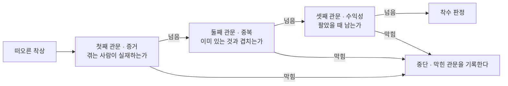
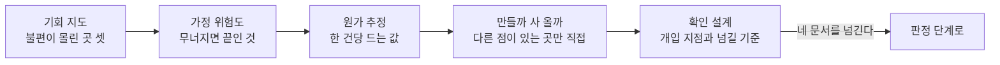

[앞 편](/blog/ai-product-planning/four-stages-of-planning/)은 네 단계가 도는 고리를 그리면서 첫 칸에 「이것을 만들 만한가」를 적어 두었다. 그 칸을 넘어가는 조건으로는 비슷한 처지에 있는 사람 여럿에게 이미 한 일을 물었을 것을 걸어 두었다. 조건은 적혀 있는데 그 조건을 어떻게 채우는지는 적지 않았다. 이 편이 그 자리를 채운다.

채워야 할 것은 둘이다. 하나는 **무엇을 묻느냐**이고 다른 하나는 **어떤 순서로 확인하느냐**다. 앞의 것은 세 개의 물음으로 정리되고 뒤의 것은 값싼 반증을 앞에 놓는 배치로 정리되는데, 둘 다 뒤의 작업이 앞의 결과를 입력으로 받는다는 같은 구조에서 나온다.

이 편은 **무엇을 물어야 하는지와 그 답을 어떻게 모으는지**까지만 다룬다. 모은 답을 놓고 통과와 반려를 가르는 판정은 다음 편의 몫이다. 여기서 만드는 것은 판정의 **입력**이다.

## 어떻게보다 먼저 오는 물음이 있다

아이디어가 떠오르면 손이 먼저 가는 곳은 대개 구현 쪽이다. 어떤 언어로 짤지, 화면을 몇 개 둘지, 데이터를 어디에 담을지를 생각하기 시작한다. 이 순서가 왜 손해인지는 일주일 뒤의 상태를 나란히 놓으면 바로 보인다.

| 먼저 물은 것 | 일주일 뒤에 가진 것 | 방향을 바꾸려면 | 틀렸을 때 잃는 것 |
| --- | --- | --- | ---: |
| **어떻게 만들까** | 이미 만들어진 무언가 | 만든 것을 걷어내야 한다 | 그 주에 들인 **전부** |
| **만들어야 할까** | 확인된 사실과 확인되지 않은 목록 | 조사 대상만 바꾸면 된다 | **0** |

오른쪽 끝 열의 차이가 이 표의 전부다. 아직 아무것도 만들지 않은 상태에서 방향을 트는 데는 값이 붙지 않는다. 그래서 이 물음은 순서상 앞에 있는 것이 아니라 **값이 싼 쪽이 앞에 있는 것**이다. 뒤집어 말하면 만들지 말지가 정해지지 않은 채로 어떻게 만들지를 정하는 일은 쓰이지 않을 답을 미리 준비하는 일이 된다.

다만 이 순서는 마음가짐으로 지켜지지 않는다. **앞의 물음에 대한 답을 도구가 파일로 요구하고, 그 파일이 없으면 다음 산출물이 생성되지 않아야 지켜진다.** 지도편이 체크리스트와 차단 장치를 갈라 두고 앞 편이 다시 짚은 이유가 여기에 있다. 사람이 손으로 표시하는 항목은 표시하지 않고 넘어갈 수 있지만, 조건이 채워졌는지를 도구가 검사하면 넘어가는 길 자체가 없다.

## 세 관문은 순서가 고정돼 있다

물음은 셋이고 직렬로 놓인다. 하나라도 막히면 뒤의 것을 따질 필요가 없어진다.

아래쪽으로 내려가는 세 화살표가 **같은 지점**으로 모인다는 것이 이 그림의 요점이다. 어느 관문에서 막히든 결과는 중단이고, 중단할 때 남겨야 하는 것은 「안 됐다」가 아니라 **몇 번째 관문에서 막혔는가**다. 그 기록이 다음 착상을 판정할 때의 출발점이 된다.

순서를 바꾸면 무엇이 낭비되는지도 정해져 있다.

| 순서를 이렇게 바꾸면 | 무엇이 헛일이 되나 |
| --- | --- |
| 수익성 계산을 맨 앞에 둔다 | 원하는 사람이 없다는 판정이 뒤에 오면 그 계산 전체가 쓸모를 잃는다. **증거가 먼저다** |
| 증거만 확인하고 곧장 수익성으로 뛴다 | 이미 같은 것이 있다면 얼마를 남기는지 따질 일이 없다. **중복이 그다음이다** |

두 행 모두 「뒤에 올 판정이 앞의 작업을 무효로 만든다」는 같은 형태다. 앞 편의 네 단계에서 본 의존 관계가 세 관문 사이에서 다시 나타난다. 그리고 세 관문의 답을 한 문서에 모은 것이 판정의 입력이 되므로, **이 문서가 완성되기 전에는 요구사항 문서를 쓰는 단계로 넘어가지 못한다.**

## 각 관문이 무엇을 보는가

관문마다 보는 대상이 다르고, 통과로 셀 수 있는 것과 셀 수 없는 것의 경계도 다르다.

| 관문 | 무엇을 들여다보나 | 넘었다고 볼 조건 | 증거로 세면 **안 되는** 것 |
| --- | --- | --- | --- |
| **첫째 · 증거** | 직접 만나서 들은 이야기가 가장 무겁고, 사람들이 스스로 올린 글과 쓰던 제품에 남긴 평가가 그 뒤를 받친다 | 서로 이어져 있지 않은 출처 **셋 이상**이 같은 불편을 가리킨다 | 자기가 겪은 일 한 건, 가까운 사람의 호의적인 반응, 머릿속에서 돌려 본 상황, 착상을 설명한 뒤에 돌아온 감상 |
| **둘째 · 중복** | 안쪽으로는 예전에 접어 둔 것과 겹치는지를, 바깥으로는 이미 팔리는 것과 거의 같은지를 본다 | 다른 점이 **쓸 사람의 말로** 설명되고, 같은 이유로 접었던 항목이 남아 있지 않다 | 기능을 나열한 목록. 「이런 것도 되고 저런 것도 된다」는 다른 점이 아니다 |
| **셋째 · 수익성** | 낼 뜻이 있는 금액에서 제공에 드는 값을 뺀다. 드는 값에는 **자기 시간**도 들어간다 | 한 건당 남는 금액이 양수이고, 본전을 넘기는 데 필요한 사람 수가 현실적이다 | 잘될 때를 기준으로 잡은 추정. 사람 수는 **삼분의 일**로, 드는 값은 **한 배 반**으로 눌러 다시 계산한다 |

가운데 열의 조건이 전부 숫자이거나 검사 가능한 형태라는 점이 중요하다. **「충분히 조사했다」 같은 표현은 조건이 될 수 없다.** 채워졌는지를 확인할 수 없는 조건은 언제나 채워진 것으로 처리된다. 셋을 세라는 조건이 붙은 이유도 같다. 하나짜리 관찰은 개인의 사정과 구분되지 않고, 서로 아는 사람들에게서 나온 셋은 하나와 다르지 않다.

### 흩어진 불만을 한 문장으로 접는다

첫째 관문에서 모은 이야기는 그대로 두면 서로 다른 말들의 더미다. 판정에 넣으려면 정해진 형식으로 한 줄로 접어야 한다.

> **[어떤 상황]에서 [어떤 이유] 때문에 [무엇을 이루려] 한다.**

세 칸을 채우면 문제가 사람 단위가 아니라 상황 단위로 적힌다. 「누가 쓰는가」가 아니라 「어떤 상황에서 필요해지는가」로 적히면 뒤의 관문들이 그 문장을 받아 그대로 쓴다. 둘째 관문의 「다른 점」도 셋째 관문의 「얼마를 내겠는가」도 이 문장에 붙는다.

### 얼마를 낼지가 아니라 얼마를 쓰고 있는지를 묻는다

셋째 관문에서 앞으로의 의향을 물으면 답은 거의 언제나 후하게 돌아온다. 물어야 할 것은 **지금 이 문제 때문에 이미 나가고 있는 것**이다. 돈이든 시간이든 남에게 맡긴 몫이든, 이미 나가고 있는 것이 지불 의향의 하한이다. 한 건당 남는 금액이 음수로 나오면 판정은 단순하다. 쓰는 사람을 더 모으는 계획이 전부 손실을 키우는 계획이 된다.

## 검증이라고 착각하기 쉬운 것들

첫째 관문이 막히는 방식은 대체로 정해져 있다. 조사를 하지 않아서가 아니라 조사라고 부른 것이 조사가 아니어서 막힌다.

| 착각한 것 | 왜 증거가 되지 않나 |
| --- | --- |
| 가까운 사람의 호의적인 반응 | 관계가 있는 사람은 부정적인 말을 삼킨다. 돌아온 것은 문제에 대한 정보가 아니라 관계에 대한 정보다 |
| 경쟁 제품 조사로 대신하기 | 비슷한 것이 팔린다는 사실은 그 문제가 실재한다는 증거일 뿐이다. **내가 만들려는 쪽이 필요하다는 증거는 아직 없다** |
| 한 번 통과했으니 끝이라고 두기 | 대상이 바뀌거나 값이 바뀌거나 기능이 붙을 때마다 전제가 달라진다. 달라진 전제는 다시 물어야 한다 |
| 자기가 겪었으니 남도 겪으리라 보기 | 겪은 사람 한 명은 사례 하나다. 사례 하나로는 개인의 사정인지 여럿의 사정인지 갈라지지 않는다 |
| 다른 점을 기능으로 적기 | 기능은 만드는 쪽의 언어다. 쓰는 쪽이 자기 말로 옮기지 못하는 차이는 선택의 이유가 되지 않는다 |
| 잘될 때를 기준으로 셈하기 | 어떤 계산도 낙관적인 입력을 넣으면 통과한다. 눌러서 다시 계산하지 않은 표는 판정에 쓸 수 없다 |

여섯 항목의 공통점은 **확인하지 않은 것을 확인한 것으로 옮겨 적었다**는 데 있다. 그리고 대부분은 아무것도 하지 않은 상태가 아니라 무언가를 열심히 한 상태에서 벌어진다. 시간을 들였다는 감각이 확인했다는 감각으로 바뀌는 자리가 여기다.

## 같은 셋을 제품 밖에서도 묻는다

세 관문은 새로 만드는 것에만 붙는 물음이 아니다. 무언가를 새로 벌이는 자리라면 대상만 바꿔 그대로 쓸 수 있다.

| 무엇을 정할 때 | 셋을 이렇게 바꿔 묻는다 | 답으로 나오는 것 |
| --- | --- | --- |
| 기능을 하나 더 붙일지 | 대상을 그 기능이 필요한 사람들로 좁혀 셋을 묻는다 | 대기 목록에 넣을지 말지 |
| 알리는 경로를 새로 열지 | 그 경로에 있는 사람들을 기준으로 셋을 묻는다 | 예산을 어디에 나눌지 |
| 값을 조정할지 | 낼 뜻이 있는 금액을 다시 확인하는 것으로 셋째 관문만 다시 연다 | 조정할지 말지 |

세 행이 모두 **판정의 대상만 갈아 끼운다.** 다만 셋을 매번 다 여는 것은 아니다. 값을 조정하는 자리처럼 앞의 두 관문이 이미 통과된 상태라면 막힌 관문 하나만 다시 열면 된다. 대상을 갈아 끼우고 필요한 관문만 여는 이 성질이 세 물음을 절차가 아니라 도구로 만든다.

> **중단 판정은 실패가 아니라 가장 값싼 성공이다.**

아무것도 만들지 않은 상태에서 멈추는 것이 가장 적은 값을 치르고 얻는 결론이다. 중단할 때 어느 관문에서 막혔는지를 적어 두면 그 기록은 다음 착상을 판정하는 자산이 된다. 많이 벌이는 쪽이 아니라 **맞는 것을 빨리 골라내는 쪽**이 결과를 낸다는 말은 이 기록이 쌓일 때만 사실이 된다.

## 발견 단계는 무엇을 받아 무엇을 남기는가

세 관문을 통과할 만한 답을 실제로 모아 오는 작업이 발견 단계다. 앞 편의 표에서 첫 칸에 해당한다.

| 항목 | 내용 |
| --- | --- |
| **받는 것** | 아직 형태가 잡히지 않은 착상 한 덩어리 |
| **하는 일** | 불편이 어디에 모여 있는지 지도를 그리고, 가정에 위험도를 매기고, 한 건당 드는 값을 추정하고, 직접 만들지 사 올지를 가르고, 무엇을 어떻게 확인할지를 설계한다 |
| **남기는 것** | 가정별 위험도 표, 확인 계획, 그리고 불편·원가·시장·경쟁 네 갈래의 문서 초안 |
| **여기서 멈추게 되는 경우** | 사람에게 직접 들은 것도, 실제로 무언가를 하려 한 흔적도 모자라거나, 무너지면 끝인 가정에 확인 방법이 붙어 있지 않을 때다 |

셋째 행의 네 문서가 다음 편에서 판정의 대상이 된다. **이 단계의 성과는 결론이 아니라 판정 가능한 형태로 정리된 재료다.** 여기서 결론까지 내려 두면 그 결론을 뒷받침하는 방향으로 재료가 편집된다.

## 발견은 다섯 갈래로 나뉜다

발견 단계를 한 덩어리로 두면 무엇을 얼마나 했는지가 흐려진다. 그래서 다섯 갈래로 갈라 두고 각각이 무엇을 남기는지를 정해 둔다.

| 갈래 | 왜 이 갈래가 필요한가 | 무엇을 하는가 |
| --- | --- | --- |
| **기회 지도** | 처음 눈에 띈 불편이 가장 큰 불편이라는 보장이 없다 | 이루려는 결과를 기한과 함께 적고 그 아래 상황별 할 일을 세운다. 항목마다 시간·비용·오류·규모 가운데 어느 종류의 불편인지 표시한 뒤, 자동화가 먹히는 정도와 불편의 크기를 곱해 상위 셋을 남긴다 |
| **가정 위험도** | 확인되지 않은 가정 위에 올린 계획은 그 가정이 무너질 때 통째로 다시 쓰게 된다 | 값어치·실현 가능성·안정성·윤리 네 축으로 훑고 축마다 확인 질문을 둘씩 세운다. 무너지면 끝인 것에는 이틀 안에 끝나는 확인 방법을 붙인다 |
| **원가 추정** | 매력적인 착상이라도 값 구조가 맞지 않으면 사업이 되지 않는다 | 한 번 처리할 때 오가는 분량과 쓰는 모델을 놓고 한 건당 값을 잡되, 평균이 아니라 절반이 그 아래인 값과 무거운 쪽 십분의 일의 값을 따로 낸다 |
| **직접 만들 것과 사 올 것** | 전부 직접 만드는 선택이 언제나 나은 선택은 아니다 | 직접 만들기·완성품 구매·코드 없이 조립하기 셋을 놓고 쓸 수 있게 되기까지의 시간·고쳐 쓸 수 있는 정도·길게 봤을 때의 운영비·자료의 소유·팀의 감당 범위로 점수를 매긴다 |
| **확인 설계** | 여기까지는 아직 책상 위의 이야기다 | 무너졌을 때의 충격에 **확신이 모자란 정도**를 곱해 위험한 가정 셋을 고르고, 각각에 사람이 개입할 지점과 넘길 기준을 숫자로 붙인다 |

다섯째 갈래에서 확신도가 **빼는 쪽으로** 들어간다는 점이 이 표에서 가장 실용적인 부분이다. 위험도는 충격에 확신이 모자란 정도를 곱한 값이므로 **충격이 크면서 아직 확신이 서지 않은 가정**이 맨 위로 올라오고, 확인이 끝나 확신이 선 가정은 충격이 크더라도 순위가 내려간다. 이 계산이 고르는 것은 「가장 중요한 가정」이 아니라 **「지금 확인해서 가장 많이 줄어드는 불확실성」**이다.

다섯 갈래는 순서대로 이어진다.

## 값싼 반증을 앞에 놓는다

가정을 확인하는 방법은 여럿이지만 값이 같지 않다. 그래서 확인 순서는 중요도가 아니라 **값**으로 정한다.

| 확인하는 방법 | 값 | 여기에 맞는 가정 |
| --- | --- | --- |
| **자료를 찾아 확인한다** | 싸다 | 법과 제도, 기술적으로 되는지 안 되는지처럼 어딘가에 이미 적혀 있는 것 |
| **사람에게 직접 묻는다** | 비싸다 | 얼마를 낼 뜻이 있는지처럼 사람의 사정을 들어야만 풀리는 것 |

자료로 확인되는 가정을 인터뷰 자리에서 물으면, 그 자리에서만 물을 수 있었던 것을 물을 시간이 사라진다. 값 순서로 놓아야 비싼 쪽을 아낄 수 있다.

그리고 **값싼 반증의 결과는 대개 착상을 죽이는 것이 아니라 문장을 고치는 것이다.** 원 자료에 실린 사례가 그렇다. 「법적인 책임을 대신 져 준다」는 주장이 자료 확인만으로 성립하지 않는다는 것이 드러나 「안전을 얼마나 이해하고 있는지를 보이게 만든다」로 바뀌었고, 「자격을 부여한다」도 그 권한이 다른 곳에 있다는 것이 확인되면서 「이해한 정도를 재어 준다」가 됐다. 두 경우 모두 착상은 살아남았고 **말이 정확해졌다.** 인터뷰를 열 번 하고 나서 표현을 고치는 것과, 자료를 두 시간 뒤져 고치고 인터뷰를 시작하는 것은 결과가 같고 값이 다르다.

이 단계를 통째로 건너뛰었을 때의 값은 앞 편에서 본 배수표를 그대로 따르되 한 가지가 더 붙는다. 모델을 호출해 돌아가는 제품이라면 한 건당 드는 값을 모른 채로 여는 것이 가능하고, **동작에는 아무 문제가 없는 상태로 쓰일수록 손해가 커지는 구간**에 들어갈 수 있다. 이 손해는 오류로 표면화되지 않기 때문에 사용량이 어느 선을 넘을 때까지 발견되지 않는다.

## 무엇을 맡기고 무엇을 직접 하는가

발견 단계의 작업은 갈래마다 맡길 수 있는 몫과 사람이 붙어야 하는 몫이 갈린다.

| 작업 | 모델에게 맡길 수 있는 몫 | 사람이 붙어야 하는 몫 |
| --- | --- | --- |
| 기회 지도 | 상황별 할 일 후보를 늘어놓고 불편의 종류를 표시하고 갈래를 쳐 내는 일 | **어느 가지를 처음 잡을 것인가** |
| 가정 훑기 | 축마다 가정 후보를 모으고 확인 질문의 초안을 만드는 일 | **무엇이 무너지면 끝인가** |
| 원가 추정 | 분량을 모델링하고 여러 경우를 계산하는 일 | 값 가정이 현실적인지, 어디까지 감수할지 |
| 만들까 사 올까 | 세 갈래 다섯 축의 점수표 초안 | **다른 점이 어디에 있는가**와 최종 선택 |
| 확인 설계 | 확인 방법의 초안과 넘길 기준의 후보 숫자 | 사람을 섭외하고 **실제로 만나서 듣는 일** |

오른쪽 열을 세로로 읽으면 공통점이 보인다. 전부 **고르는 일**이다. 후보를 늘어놓고 정리하고 계산하는 몫은 넘길 수 있지만, 늘어놓인 것 가운데 무엇을 택할지는 넘어가지 않는다. 앞 편에서 답을 받지 말고 질문을 받으라고 적은 것과 같은 경계다.

여기에 두 가지 규율이 붙는다. 첫째, **조건을 따져 막는 일은 모델에게 맡기지 않는다.** 무엇이 통과이고 무엇이 반려인지를 가르는 자리는 결과가 매번 같아야 하므로, 모델은 초안과 요약을 맡고 판정은 조건을 검사하는 장치가 맡는다.

둘째, **모델이 만들어 낸 응답은 증거로 세지 않는다.** 가상의 사용자를 세워 답을 받아 보는 방식은 질문을 다듬는 데 쓸모가 있지만 그 결과는 첫째 관문의 출처 셋에 들어가지 않는다. **모의로 얻은 것에는 그렇다는 표를 달아 두고, 표가 달린 것은 세지 않는다.** 표를 달지 않으면 며칠 뒤에는 어느 쪽에서 나온 답인지 구분되지 않는다.

## 이 편이 쓴 용어

[지도편](/blog/ai-product-planning/planning-harness-map/)이 정리해 둔 어휘 가운데 여기서 실제로 쓰인 것만 옮겼다.

| 용어 | 원어 | 이 편에서의 뜻 |
| --- | --- | --- |
| WHETHER | whether | 만들 가치가 있는지를 묻는 판단. 이 편이 그 판단의 입력을 만든다 |
| 할 일 관점 | JTBD | 흩어진 이야기를 「상황 · 이유 · 이루려는 것」 세 칸으로 접어 적는 형식 |
| 맘 테스트 | Mom Test | 앞으로의 의향 대신 이미 벌어진 일만 묻게 만드는 인터뷰 규율 |
| 기회 해법 나무 | OST | 이루려는 결과에서 시작해 기회와 해법과 확인 방법으로 내려가는 구조 |
| 지불 의향과 제공 원가 | WTP / CTS | 낼 뜻이 있는 금액과 제공에 드는 값. 셋째 관문이 이 둘의 차이를 본다 |

## 정리

세 가지가 이 편에 남는다.

**첫째, 세 관문의 순서는 값으로 정해져 있다.** 증거가 먼저인 이유는 그것이 중요해서가 아니라 뒤의 두 관문이 첫째 관문의 답을 입력으로 받기 때문이다. 순서를 바꾸면 앞서 한 계산이 뒤의 판정 하나에 통째로 무효가 된다.

**둘째, 증거가 아닌 것을 증거로 세는 일이 가장 자주 벌어진다.** 조사를 하지 않아서 막히기보다 조사라고 부른 것이 관계에 대한 정보이거나 사례 하나여서 막힌다. 그래서 통과 조건은 세는 방법이 정해진 형태여야 한다.

**셋째, 확인은 값이 싼 것부터 한다.** 자료로 풀리는 가정을 자료로 풀고 나면 사람에게 물어야만 풀리는 가정에 시간을 온전히 쓸 수 있다.

다음 편은 여기서 만든 재료를 판정대에 올린다. 네 문서가 갖춰졌는지를 무엇으로 검사하는지, 증거의 강도를 어떤 척도로 채점하는지, 한 건당 드는 값이 어느 선을 넘으면 자동으로 막히는지, 그리고 통과와 반려 사이에 놓인 세 번째 판정이 무엇인지가 거기서 갈린다.
