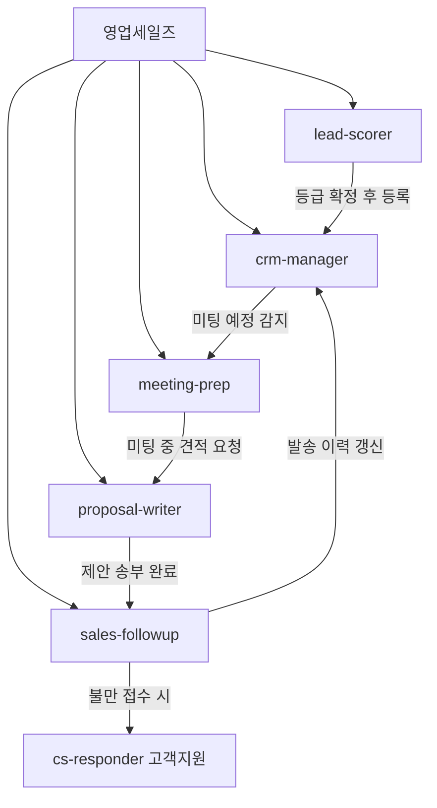
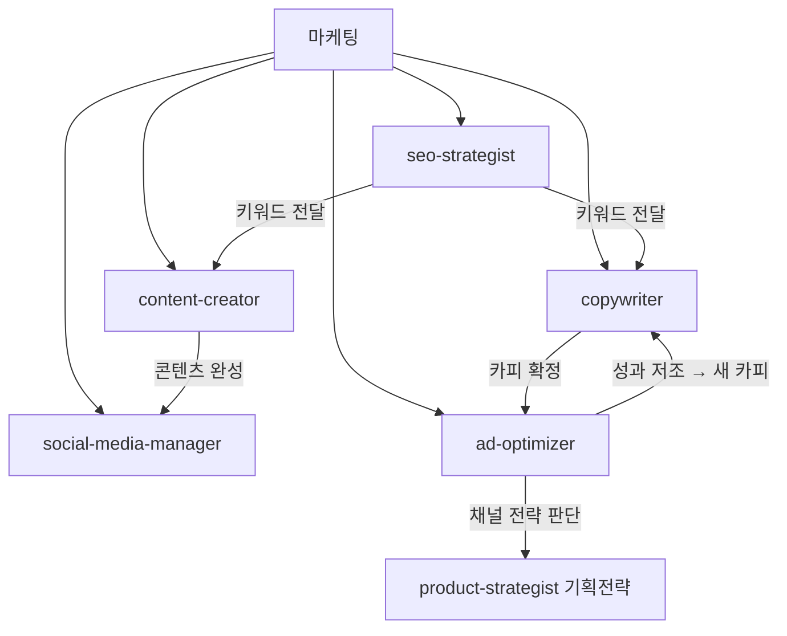
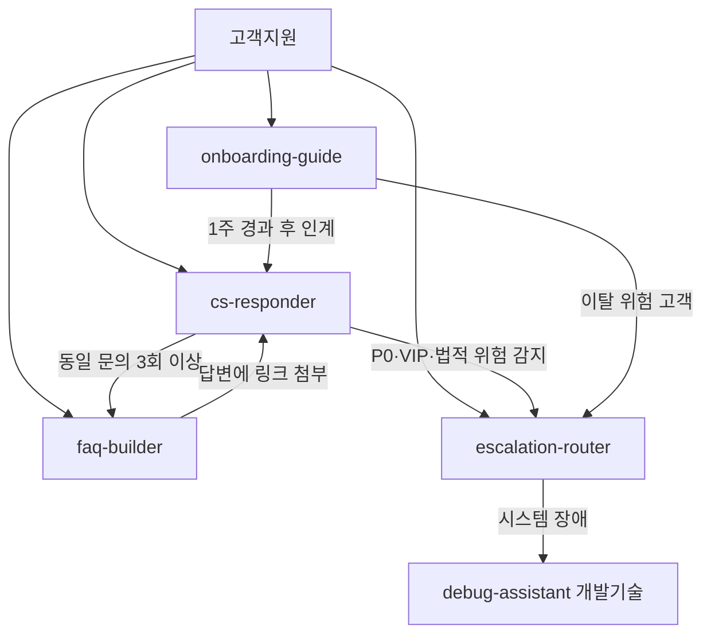
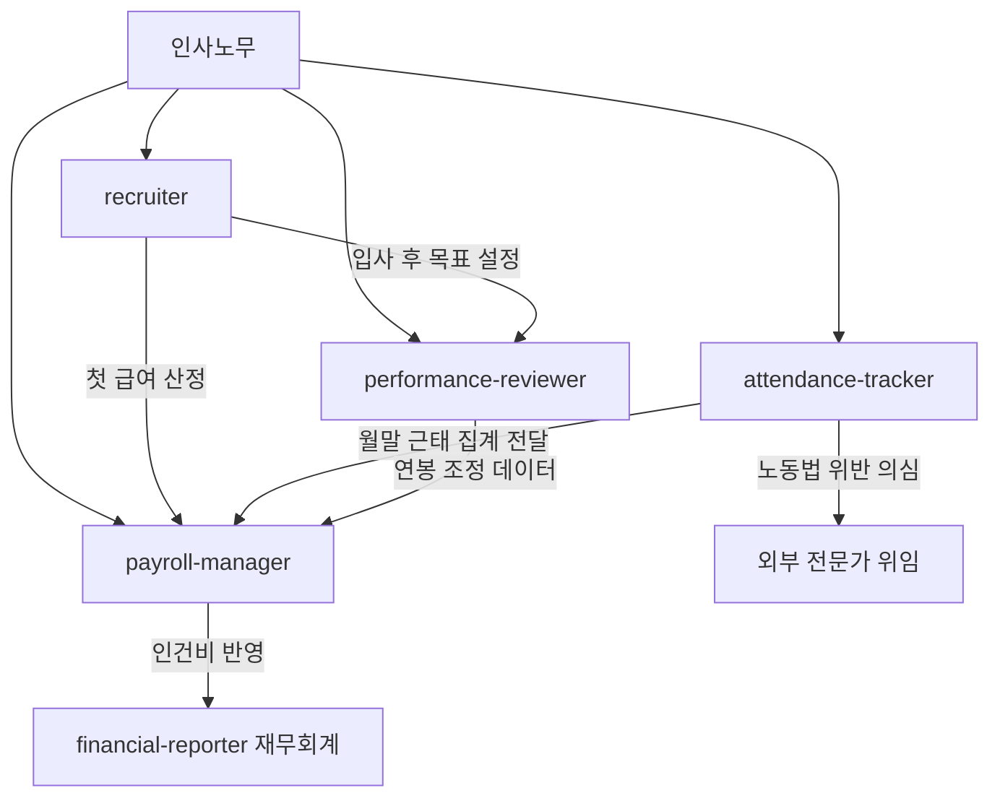
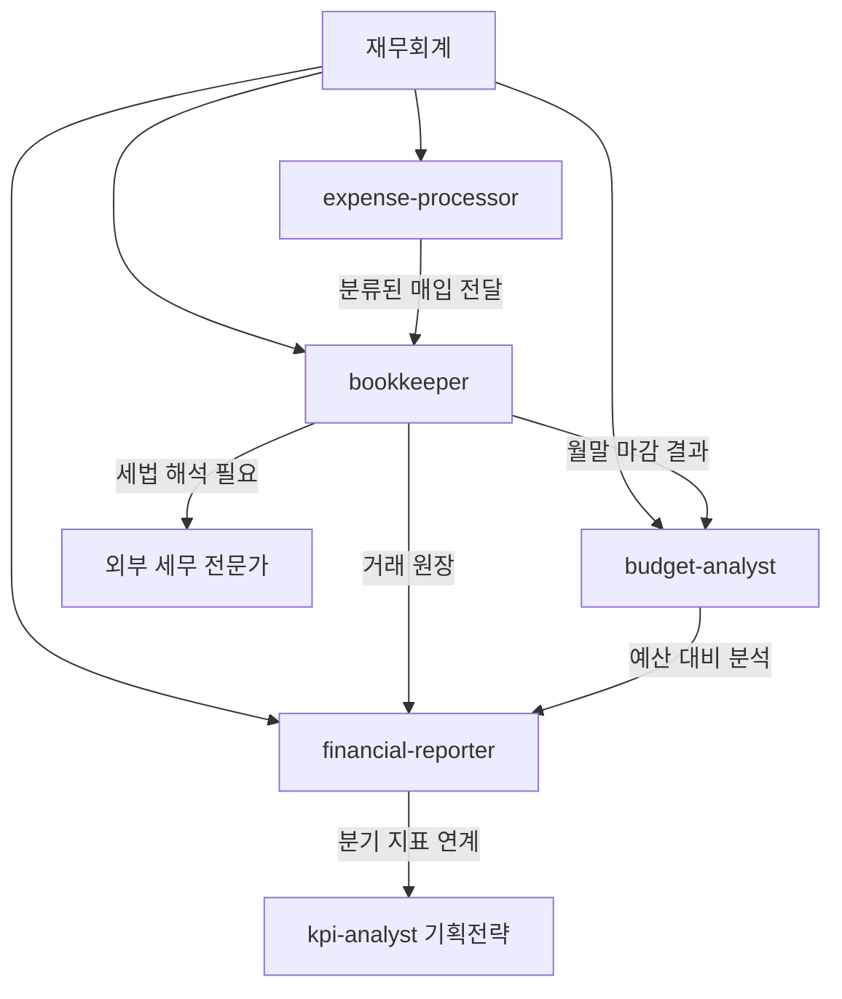
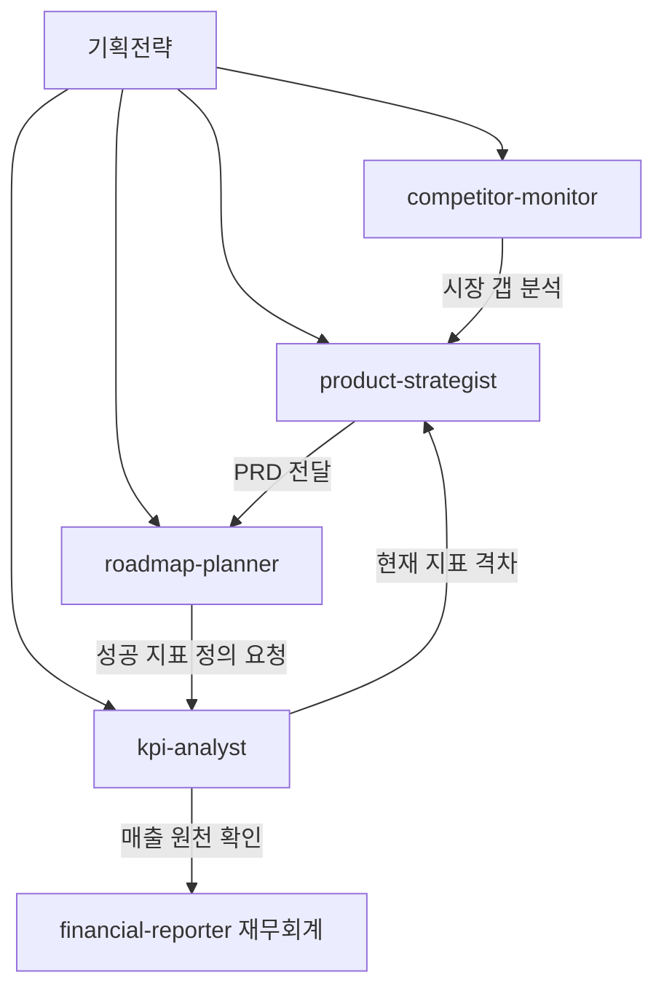

이 글이 옮기는 원 자료의 부서별 정의서 묶음에는 부서마다 위임 흐름 도식이 하나씩 있는데, 그 도식의 **인계 화살표**에는 예외 없이 라벨이 달려 있다. 여섯 부서를 합치면 그런 인계 화살표가 **35개**다.

도식의 나머지 선 26개는 부서 노드에서 각 에이전트로 내려가는 소속 표시라 라벨이 없다. 26 + 35 = 61이 여섯 도식의 전체 화살표 수이고, **이 글이 세는 35는 그중 라벨이 붙은 것만이다.**

이 글은 그 여섯 부서 26종을 하나씩 펼친다. 부서마다 **위임 흐름 도식 → 에이전트 요약표 → 프롬프트 설계 기법**의 순서이고, 이 세 겹이 원 자료의 순서 그대로다.

## 이 글이 다루는 세트와 범위

먼저 짚어 둘 것이 둘 있다.

**첫째, 이 글이 다루는 것은 세트 B다.** 이 블로그에는 총계 30인 7부서 에이전트 표가 세 판본 실려 있고, 셋의 부서 편성이 서로 다르다. 그 구분은 [첫 편의 「총계가 30인 세 번째 표다」 절](/blog/ai-transformation/department-agent-blueprint/)이 이미 표로 정리해 두었으므로 여기서 다시 논증하지 않는다. 이 글은 그 표의 **B — 영문 에이전트 ID를 쓰는 판본**의 부서별 상세다.

그래서 부서 이름이 [첫 편 본문의 조직도](/blog/ai-transformation/department-agent-blueprint/)·[2편](/blog/ai-transformation/department-automation-frontline/)·[3편](/blog/ai-transformation/department-automation-backoffice/)과 어긋난다. 저쪽은 「마케팅부·영업부·고객지원부·인사부·재무부·법무부·경영지원부」이고 이 글은 「영업/세일즈·마케팅·고객지원·인사노무·재무회계·기획전략」이다. **이름을 맞춰 쓰지 않는다** — 편성이 다른 두 세트를 같은 조직으로 뭉개지 않기 위해서다. 저쪽에 있는 법무·경영지원이 이쪽에 없고, 이쪽의 기획전략이 저쪽에 없다.

**둘째, 이 세트의 일곱 부서 중 개발기술 하나가 빠진다.** 30에서 4를 뺀 26종이 이 글의 범위다. 빠진 이유는 이미 발행됐기 때문이고, 그쪽은 [개발조직에 옮길 것과 비어 있는 여섯 자리](/blog/agentic-coding/dev-org-transfer/) 편이 같은 형식으로 다룬다. 30종 전체를 한 줄씩 보려면 [30개 에이전트 카탈로그](/blog/agentic-coding/thirty-agent-catalog/)가 명부를 싣고 있다.

정리하면 이렇다.

| 자리 | 어디에 있나 | 이 글은 |
|---|---|---|
| 30종 명부(부서·역할·입출력·도구 한 줄씩) | [30개 에이전트 카탈로그](/blog/agentic-coding/thirty-agent-catalog/) | 다시 싣지 않는다 |
| 세트 A·B·C 구분 | [첫 편](/blog/ai-transformation/department-agent-blueprint/) | 링크만 한다 |
| 개발기술 4종 상세 | [개발조직에 옮길 것](/blog/agentic-coding/dev-org-transfer/) | 범위 밖 |
| 정의서 공통 스키마와 품질 편차 | [정의서 작성 품질](/blog/agentic-coding/definition-writing-quality/) | 임계값의 출처만 짚는다 |
| **여섯 부서의 위임 흐름 도식 6개(인계 화살표 35개)** | — | **이 글이 싣는다** |
| **부서별 판단 축·산출 형식·안전장치 표 6개(26행)** | — | **이 글이 싣는다** |
| **프롬프트 설계 기법 39가지** | — | **이 글이 싣는다** |

아래 세 행이 이 글의 실질이다.

> 이 글이 옮긴 원 자료의 작성 기준일은 [개발기술 4종 편](/blog/agentic-coding/dev-org-transfer/)이 **2026-07-26**으로 밝혀 두었다. 아래에 나오는 임계값·요율·법정 기준(주 52시간, 4대보험 요율, 5인 미만·20인 이하·30인 미만 특례, CTR·ROAS 구간, OCR 신뢰도, 원본 보관 5년)은 **원 자료가 그 시점에 제시한 기준선**이며 이 글이 측정하거나 검증한 값이 아니다. 법·요율은 개정되고 임계값은 조직과 스택에 따라 달라진다.

## 용어 정리

원 자료의 표가 영문 약어로 적은 것은 그대로 남겼다.

| 용어 | 풀이 |
|---|---|
| **SPICED** | Situation·Pain·Impact·Critical Event·Economic Impact·Decision. 영업 미팅에서 확인할 항목을 나눠 둔 발견 질문 6요소. 원 자료는 이 여섯을 브리핑의 질문 슬롯에 매핑한다 |
| **AIDA / PAS / BAB** | 카피라이팅 구성 틀 세 가지. 인지-흥미-욕구-행동 / 문제-자극-해결 / 이전-이후-다리 |
| **CTR / ROAS** | 클릭률 / Return On Ad Spend, 광고비 대비 매출 배수. 광고 성과 판정의 대표 지표 |
| **JSON-LD** | 검색 엔진이 읽는 구조화 데이터 표기법 |
| **KCS** | Knowledge-Centered Service. 상담 과정에서 지식을 포착·구조화·재사용·개선하는 4단계 운영 방식 |
| **TTFV** | Time To First Value. 고객이 첫 가치를 체감하기까지 걸리는 시간 |
| **SLA** | Service Level Agreement. 응답까지의 약속 시간 |
| **STAR** | Situation·Task·Action·Result. 행동 기반 질문 구조 |
| **JTBD** | Jobs To Be Done. 「고객이 해결하려는 일」 관점으로 요구를 서술하는 방식 |
| **OKR / KR** | Objective and Key Results. 정성 목표 1개 + 정량 지표 3~5개 |
| **Keeper Test** | 「이 사람이 떠난다면 붙잡겠는가」를 채용·유지 판단의 기준으로 삼는 방식 |
| **P/L** | Profit and Loss. 손익계산 |
| **Runway** | 현재 현금과 소진 속도로 계산한 잔여 개월 수 |
| **OCR** | 이미지에서 문자를 읽어 내는 처리. 여기서는 영수증 인식 |
| **적격증빙** | 세법상 비용·매입세액 공제가 인정되는 증빙(세금계산서·현금영수증·카드전표) |
| **멱등성** | 같은 작업을 두 번 실행해도 결과가 한 번 실행한 것과 같은 성질 |
| **SSOT** | Single Source Of Truth. 값이 갈릴 때 어느 저장소를 정답으로 삼을지 하나로 정해 두는 것 |
| **RICE** | (Reach × Impact × Confidence) ÷ Effort. 우선순위 점수식의 네 변수 |
| **PRD** | Product Requirements Document. 제품 요구사항 문서 |
| **NSM** | North Star Metric. 제품의 성공을 대표하는 단일 지표 |
| **AARRR** | Acquisition·Activation·Retention·Referral·Revenue. 사용자 여정 5단계 지표 프레임 |
| **SWOT** | 강점·약점·기회·위협 네 칸으로 경쟁 상황을 정리하는 틀 |

## 영업/세일즈 5종 — 등급이 확정돼야 다음 단계로 넘어간다

에이전트를 잇는 화살표는 여섯이고 그중 하나가 부서 밖으로 나간다. 안쪽 다섯 중 `sales-followup` → `crm-manager`(「발송 이력 갱신」)가 되돌아오는 선이라서 `crm-manager` → `meeting-prep` → `proposal-writer` → `sales-followup` → `crm-manager`가 닫힌 고리를 이룬다. **다섯 에이전트 중 `lead-scorer`만 그 고리 바깥에 있다** — 부서 노드를 빼면 이 에이전트로 들어오는 화살표가 없고 나가는 화살표만 하나 있다. 등급 확정이 파이프라인의 입구라는 뜻이고, 이렇게 읽는 것은 이 글의 정리다.

### 에이전트 요약

| 에이전트 | 판단 축 | 고정된 산출 형식 | 명시된 안전장치 |
|---|---|---|---|
| `lead-scorer` | Fit 3축(산업·직무·규모 40점) + Engagement 3축(행동·응답성·의도 60점) | 차원별 점수표 + 총점 + 4등급 + 권장 액션 | 점수보다 근거를 우선 서술하도록 지시 |
| `crm-manager` | 7단계 파이프라인(Prospect→Onboarding), Closed Lost 별도 보존 | 현재 단계 + 최근 접점 + 다음 액션 + 리스크 | 「다음 액션 없이는 종료 금지」 |
| `proposal-writer` | 8섹션 고정 구조, 고객 이해 섹션이 절반의 가치 | 8섹션 문서 + Basic/Standard/Premium 3안 | 오타·가격 정합성·페이지 흐름 검토 항목 |
| `meeting-prep` | 7섹션 브리핑, SPICED 6요소 질문 | A4 1장 브리핑 + 질문 5개 + 예상 반론 | 미팅 최소 1시간 전 완성 |
| `sales-followup` | 5단계 시퀀스(24h·D+3·D+7·D+14·분기) | 5문장 이내 메일 초안 | **사용자 승인 후 발송** |

다섯 행 중 넷이 「고정된 산출 형식」 칸에 개수나 분량을 숫자로 달고 있다 — 4등급(`lead-scorer`) · 8섹션과 3안(`proposal-writer`) · A4 1장과 질문 5개(`meeting-prep`) · 5문장 이내(`sales-followup`). 숫자가 없는 하나는 `crm-manager`이고, 그 행은 대신 안전장치 칸에서 「다음 액션 없이는 종료 금지」로 완결 조건을 건다. 4 + 1 = 5로 다섯 행이 갈리며, 이 집계는 이 글이 표를 세어 한 것이다.

### 프롬프트 설계 기법 6가지

- **가중치를 표로 못박아 총합 100을 강제한다.** `lead-scorer`는 6차원에 15·15·10·20·20·20점을 배분해 두었다. 모델이 「대략 높음」이라고 얼버무릴 여지를 없앤다.
- **시간 감쇠를 규칙으로 넣는다.** 「30일 이상 미접촉 리드는 자동 -20점」. 데이터의 신선도를 프롬프트 레벨에서 처리한 사례다.
- **출력 완결 조건을 규범으로 선언한다.** `crm-manager`의 「다음 액션 없이는 종료 금지」는 산출물이 미완인 채 끝나는 실패 모드를 막는 장치다.
- **산출물의 편향을 의도적으로 설계한다.** `proposal-writer`는 「가격은 옵션 3개, 중간 선택률 70%」라고 적어 두었다. 형식이 곧 전략인 사례다.
- **질문 프레임을 산출물 슬롯으로 변환한다.** SPICED 6요소를 그대로 「우리 질문 5개」 섹션에 매핑했다.
- **외부 발송 앞에 사람 게이트를 둔다.** `sales-followup`의 절차 5단계가 「사용자 승인 후 발송」이다. 자동화의 종점을 초안까지로 못박았다.

## 마케팅 5종 — 광고 성과가 카피로 되돌아온다

`seo-strategist`가 같은 라벨(「키워드 전달」)로 둘에게 보내고, `ad-optimizer`도 둘을 내보낸다. 그중 `ad-optimizer` → `copywriter`(「성과 저조 → 새 카피」)가 되돌아오는 선이라 **`copywriter` ↔ `ad-optimizer` 두 노드짜리 고리**가 생긴다. 카피를 쓰는 쪽과 성과를 재는 쪽이 직접 붙어 있는 구조다. 반대로 `social-media-manager`는 받기만 하고 내보내지 않는다 — 부서 안에서 나가는 화살표가 없는 유일한 노드다.

### 에이전트 요약

| 에이전트 | 판단 축 | 고정된 산출 형식 | 명시된 안전장치 |
|---|---|---|---|
| `copywriter` | AIDA/PAS/BAB 중 상황별 선택 | 헤드라인 3안(A/B/C) + 본문 + CTA | 자가 검증 문장 「내 친구가 이 말 하면 이상하지 않은가」 |
| `seo-strategist` | 검색 의도 4분류(정보·비교·거래·브랜드) | 키워드 매핑 1:5 + 메타 + JSON-LD + FAQ | 검색어가 외부로 나가므로 회사·고객명 노출 주의 |
| `content-creator` | 채널별 3단 구조(후킹·본문·CTA) | 타임코드가 붙은 스크립트 + 화면 지시 | 1콘텐츠 1메시지, CTA는 한 동작만 |
| `ad-optimizer` | 5대 KPI 3구간 임계(양호·주의·차단) | 세트별 성과표 + Pause/Scale/Replace/Test 판정 | 신규 광고는 최소 48시간 데이터 후 판단 |
| `social-media-manager` | 채널 4종 × 톤·빈도·시간·해시태그 | 요일별 캘린더 + 캡션 + 주간 KPI 목표 | 콘텐츠 비율 교육 50 : 스토리 30 : 홍보 20 |

`seo-strategist`의 안전장치는 같은 표의 다른 넷과 성질이 다르다. 이 행은 **입력이 회사 밖으로 나가는 것**을 경계한다 — 검색어 자체가 외부 서비스로 전달되기 때문이다.

회사 밖으로 나가는 데이터를 경계하는 안전장치는 다른 부서 표에도 있다 — `financial-reporter`의 「외부 배포 시 급여·고객명 마스킹」, 그리고 `sales-followup`·`cs-responder`의 발송 전 승인이다. **다만 그것들이 지키는 것은 에이전트가 만들어 낸 산출물인 반면, 이 행이 지키는 것은 작업 과정에서 밖으로 나가는 입력이다.** 나가는 것이 산출물인지 입력인지를 갈라 읽는 것은 이 글의 정리다.

### 프롬프트 설계 기법 6가지

- **프레임워크를 나열만 하지 않고 선택 규칙을 붙인다.** 「인지도 낮음 → AIDA, 페인 명확 → PAS, 변화 강조 → BAB」. 조건부 분기를 프롬프트에 넣어 모델이 매번 같은 틀만 쓰는 것을 막는다.
- **단일 답을 금지한다.** 헤드라인은 항상 3안. A/B 테스트를 전제로 산출 개수를 고정했다.
- **임계값 표로 판정을 결정론화한다.** `ad-optimizer`의 CTR 1.5%/1%·ROAS 300%/200% 같은 구간은 「판단」을 「조회」로 바꿔 준다. 모델의 재량을 좁히는 대표 기법이다.
- **자가 검증 문장을 심는다.** 「내 친구에게 이 말을 하면 이상하지 않은가?」는 출력 직전에 스스로 돌려 보는 체크다.
- **실험 설계 규범까지 명시한다.** 「단일 변수 변경」, 「Frequency > 3이면 크리에이티브 교체」. 도메인 방법론을 프롬프트에 내장한 사례다.
- **컨텍스트 스위칭 규칙을 표로 준다.** 채널별 톤·게시 시간·해시태그 개수를 표로 두어 에이전트 하나가 4개 채널을 오가면서도 일관성을 유지하게 한다.

## 고객지원 4종 — 두 위임 조건이 어휘와 횟수로 갈린다

`cs-responder`가 이 부서의 허브다 — 부서 노드를 빼고 들어오는 선 둘(`faq-builder`·`onboarding-guide`)과 나가는 선 둘(`escalation-router`·`faq-builder`)을 함께 갖는 유일한 노드다. `faq-builder`와는 양방향이라 **두 노드짜리 고리**가 된다.

이 부서에서 눈에 띄는 것은 위임 조건의 성질이 갈린다는 점이다. `escalation-router`로 가는 조건은 **어휘와 등급**(「P0·VIP·법적 위험 감지」)이고 `faq-builder`로 가는 조건은 **횟수**(「동일 문의 3회 이상」)다. 같은 에이전트가 내보내는 두 화살표인데 하나는 사전 대조로, 다른 하나는 카운트로 판정된다 — 이 구분은 이 글의 정리다.

### 에이전트 요약

| 에이전트 | 판단 축 | 고정된 산출 형식 | 명시된 안전장치 |
|---|---|---|---|
| `cs-responder` | 카테고리 8종 × 긴급도 4단계 × 감정 4단계 | 티켓 분류 + 답변 초안 + 다음 액션 체크박스 | 사용자 승인 후 발송, 법적 단어 감지 시 즉시 위임 |
| `faq-builder` | KCS 4단계(포착·구조화·재사용·개선) | 질문 + 3초 결론 + 단계 가이드 + 관련 FAQ 3개 | 발행 전 도메인 전문가 1회 확인, 답변 300자 제한 |
| `escalation-router` | 트리거 4종(법적·평판·VIP·장애) | 알림 메시지 + 컨텍스트 점검 + 권장 즉시 액션 | 이중 발송 금지, 법적 단어 트리거는 절대 패스 금지 |
| `onboarding-guide` | 7일 시퀀스 + TTFV 정의 | 일자별 메일 + 이탈 위험 알림 | 미진입 7일이면 환불 옵션 제안(강제 잔존 금지) |

`onboarding-guide`의 안전장치는 방향이 거꾸로다. 나머지 셋의 안전장치 하나씩이 잘못 나가는 것을 막거나(`cs-responder`의 승인 후 발송, `faq-builder`의 발행 전 확인) 놓치는 것을 막는(`escalation-router`의 절대 패스 금지) 쪽인 데 비해, 이 행은 **고객을 붙잡지 말라는** 쪽이다 — 「미진입 7일이면 환불 옵션 제안(강제 잔존 금지)」. 제품 지표에 불리한 행동을 정의서가 먼저 규정한 자리이고, 이렇게 읽는 것은 이 글의 정리다.

### 프롬프트 설계 기법 6가지

- **역할 분리를 3곳에 중복 기재한다.** `cs-responder`는 `description`·트리거 섹션·경계 섹션 모두에 「P0/VIP/법적 위험은 `escalation-router`로 위임」을 적어 두었다.
- **분류 축을 곱해서 쓴다.** 8 × 4 × 4 조합으로 답변 톤과 SLA가 결정된다. 단일 라벨이 아니라 다축 분류를 요구하는 설계다.
- **응답 순서를 규범화한다.** 「사과 → 사실 → 해결 → 감사」. 불만 상황에서 순서가 뒤집히면 사과가 변명으로 읽힌다는 도메인 지식을 프롬프트에 박았다.
- **트리거 단어 사전을 명시한다.** 「소송·고소·공정위·변호사·방통위」 같은 어휘를 나열하고 「절대 패스 금지」를 붙였다. 재현율을 정밀도보다 우선한 선택이다.
- **에이전트 간 승격 조건을 숫자로 준다.** 「같은 질문 3회 → FAQ 승격」. 언제 다른 에이전트를 호출할지를 규칙화했다.
- **알림 정책을 명문화한다.** 「과잉 알림이 부족 알림보다 낫다」와 「이중 발송 금지」를 동시에 둬서, 놓침은 막되 수신자 피로는 관리한다.

## 인사노무 4종 — 세 에이전트가 급여로 모인다

`payroll-manager`로 세 화살표가 모인다 — `recruiter`(「첫 급여 산정」)·`attendance-tracker`(「월말 근태 집계 전달」)·`performance-reviewer`(「연봉 조정 데이터」). 채용·근태·평가의 결과가 급여로 흘러들고, 부서 밖 에이전트로 나가는 선도 거기서 시작한다. **되돌아오는 선은 하나도 없다.**

남은 두 선은 급여를 거치지 않는다. 하나는 `recruiter` → `performance-reviewer`(「입사 후 목표 설정」)로 채용에서 평가로 곧장 가고, 다른 하나는 에이전트가 아니라 **사람에게 간다** — `attendance-tracker`의 「노동법 위반 의심」은 외부 전문가 위임으로 끝난다. 도식이 자동화의 바깥 경계를 노드로 그려 둔 자리다. 3 + 1 + 2 = 6으로 이 도식의 인계 화살표 여섯이 남김없이 갈린다.

### 에이전트 요약

| 에이전트 | 판단 축 | 고정된 산출 형식 | 명시된 안전장치 |
|---|---|---|---|
| `recruiter` | 5단계 채용 워크플로우 + STAR 4요소 | JTBD형 JD + 6개월 KPI + STAR 질문 5개 + 평가 시트 | Keeper Test, 레퍼런스 없이 오퍼 금지, 1주 내 회신 |
| `payroll-manager` | 지급·공제 항목 표 + 사업장 규모별 예외 | 급여 명세서 + 공제 내역 + 신고 일정 | **면책 섹션 별도 신설**, 요율 기준일·출처 URL 명시 |
| `attendance-tracker` | 노동법 임계 4종(주 52시간·연속근무·휴게·연차) | 주간 리포트 + 위반 경고 + 연차 잔여 | 개인정보 최소화(GPS 미저장, 사무실/재택 라벨만) |
| `performance-reviewer` | OKR 0.0~1.0 점수 + 360도 4주체 | KR 점수표 + 1on1 어젠다 + 분기 평가 | OKR ≠ 성과급 직결, 부정 피드백 1 : 칭찬 5 |

네 행의 안전장치가 서로 다른 위험을 겨눈다 — `recruiter`는 **판단 근거의 부재**(레퍼런스 없이 오퍼 금지), `payroll-manager`는 **법적 책임**(면책 섹션), `attendance-tracker`는 **개인정보**(GPS 미저장), `performance-reviewer`는 **지표의 오용**(OKR ≠ 성과급 직결)이다. 넷이 겹치지 않는다는 것까지가 표를 대 보아 확인되는 것이고, 이 갈래 나누기는 이 글의 정리다.

### 프롬프트 설계 기법 6가지

- **시효성 있는 수치에 유통기한을 붙인다.** `payroll-manager`는 4대보험 요율마다 「2026년 1월 기준」을 달고, 공단·국세청 확인 URL을 나열하고, 「1월/7월 갱신 점검」을 원칙에 넣었다.
- **면책 섹션을 별도로 둔다.** **원 자료의 30종 중 유일하게** `## 면책 / 확장 가이드`를 만들어 「실제 급여 처리는 노무사·세무사 검증 권장」을 명시했다. 리스크가 큰 도메인에서 에이전트의 책임 범위를 문서로 자른 사례다. 「30종 중 유일하게」는 원 자료가 30종 전수를 대 보고 내린 판정이며, 이 글이 다루는 26종만으로는 확인되지 않는다.
- **규모별 예외 규칙을 표로 정리한다.** 5인 미만 가산수당 면제, 20인 이하 반기납부 특례, 30인 미만 특별연장. 조건 분기를 모델의 상식에 맡기지 않았다.
- **Before/After 대조로 서술 방식을 교정한다.** 「Python 5년 이상」(전통 JD) vs 「매주 200개 결제 트랜잭션을 처리하는 시스템을 만든다」(JTBD JD).
- **평가 척도의 해석까지 지정한다.** 「0.7이 평균 목표, 1.0은 비현실」. 숫자만 주면 모델이 만점을 지향하는 편향을 미리 차단한다.
- **대화의 주도권을 규정한다.** 「1on1은 직원이 주도, 사용자가 묻기보다 직원이 어젠다 설정」. 산출물이 아니라 회의 운영 방식을 규범화했다.

## 재무회계 4종 — 되돌아오는 화살표가 없다

여섯 화살표가 전부 한 방향이다. `expense-processor` → `bookkeeper` → (`budget-analyst`·`financial-reporter`) → 부서 밖으로 흐르고 되돌아오는 선이 하나도 없다. 인사노무와 함께 **고리가 없는 두 부서 중 하나**다.

`bookkeeper`가 분기점이자 외부 위임의 시작점이다 — 나가는 화살표 셋 중 둘은 부서 안(`budget-analyst`·`financial-reporter`)이고 하나는 사람(「세법 해석 필요」 → 외부 세무 전문가)이다. 기장이 이 부서의 원장 노릇을 한다는 뜻이고, 이렇게 읽는 것은 이 글의 정리다.

### 에이전트 요약

| 에이전트 | 판단 축 | 고정된 산출 형식 | 명시된 안전장치 |
|---|---|---|---|
| `bookkeeper` | 5곳 동기 저장 순서 + 계정과목 분개 룰 | 분개 기록 + 월말 손익 요약 + 부가세 산출 | **직렬 처리만 허용, 병렬 절대 금지**, 중복 해시 차단 |
| `expense-processor` | 적격증빙 4종 + 계정과목 매핑 표 9행 | 건별 처리 결과 + 매입세액 집계 + 확인 요청 | OCR 신뢰도 80% 미만은 자동 처리 금지, 원본 5년 보관 |
| `budget-analyst` | 4대 분석(예산·P/L·현금흐름·Runway) | 실적 대비 예산표 + 현금흐름 예측 + Runway | 예산 ±20% 이탈은 사유 확인이지 즉시 차단 아님 |
| `financial-reporter` | 리포트 5종 × 주기·분량·대상 | 8섹션 결산 + KPI 대시보드 + 다음 달 전망 | 외부 배포 시 급여·고객명 마스킹, 데이터는 단일 원천 우선 |

안전장치 칸에 **숫자 임계**가 적힌 행은 이 표에서 둘이다 — `expense-processor`의 「OCR 신뢰도 80% 미만은 자동 처리 금지」와 `budget-analyst`의 「예산 ±20% 이탈은 사유 확인이지 즉시 차단 아님」. **두 임계의 방향이 반대다.** 앞은 임계에 못 미치면 멈추라는 것이고, 뒤는 임계를 넘어도 멈추지 말고 사유를 확인하라는 것이다. 임계값이 언제나 정지 신호는 아니라는 것을 같은 표 안에서 구분해 둔 자리이고, 이 대조는 이 글의 정리다.

### 프롬프트 설계 기법 7가지

- **실제 사고를 규칙으로 각인한다.** `bookkeeper`의 「5곳 동기 — 직렬화 의무: 병렬 실행은 특정 일자 사고로 절대 금지」는 사고 경험을 프롬프트에 박아 재발을 막는 방식이다. **원 자료가 특히 눈여겨볼 설계로 꼽은 것 중 하나다.**
- **무결성 장치를 3중으로 건다.** 멱등성 가드, `content_hash` UNIQUE, SHA256 사본 검증. 「AI가 같은 작업을 두 번 하면 어떻게 되는가」를 정면으로 다룬 사례다.
- **신뢰도 임계로 자동화 경계를 긋는다.** OCR 신뢰도 80% 미만이면 자동 처리를 멈추고 사람에게 넘긴다. 자동화율과 정확도의 트레이드오프를 숫자로 고정했다.
- **결정 테이블로 분류를 대체한다.** 「거래처 키워드 → 계정과목」 9행 매핑표는 모델의 추론 대신 조회를 쓰게 만든다. 재현성이 올라간다.
- **표마다 해설 한 줄을 의무화한다.** 「숫자 + 내러티브: 숫자만 나열 X → '왜 그런가' 한 줄」. 리포트형 산출물의 품질 기준을 명문화했다.
- **신호 색깔 규약을 통일한다.** 🟢 좋음 / 🟡 주의 / 🔴 위험. 부서를 넘어 재무·개발·기획이 같은 규약을 쓴다.
- **데이터 충돌 시 우선순위를 정한다.** 「노션·엑셀과 불일치 시 DB 우선」. SSOT를 한 줄로 선언했다.

## 기획전략 4종 — 지표가 계획의 입력이자 출력이다

`product-strategist`가 둘을 받고(`competitor-monitor`의 「시장 갭 분석」, `kpi-analyst`의 「현재 지표 격차」) 하나를 내보낸다(`roadmap-planner`로 「PRD 전달」). 그 뒤 `roadmap-planner` → `kpi-analyst`(「성공 지표 정의 요청」)를 거쳐 다시 `product-strategist`로 돌아오므로 **세 노드짜리 고리**가 생긴다.

`kpi-analyst`는 그 고리 안에 있으면서 동시에 부서 밖으로 나가는 유일한 출구이기도 하다. 지표가 계획의 입력(「현재 지표 격차」)이자 계획의 산출물(「성공 지표 정의 요청」)이며 부서 간 연결점(「매출 원천 확인」)까지 겸한다 — 화살표 셋을 이렇게 대 보는 것은 이 글의 정리다.

### 에이전트 요약

| 에이전트 | 판단 축 | 고정된 산출 형식 | 명시된 안전장치 |
|---|---|---|---|
| `product-strategist` | JTBD 문장 템플릿 + RICE 4변수 | PRD 10섹션(비목표 포함) + Must/Should/Could | 북극성 지표 1개만, PRD는 가설이며 데이터로 검증 |
| `roadmap-planner` | Now/Next/Later + 확률 표기 | 3구간 로드맵 + 의존성 그래프 + 회고 일정 | NOW 최대 5개, 분기 캐파 80%만 채움 |
| `kpi-analyst` | NSM 1개 + 핵심 5개 + AARRR 드릴다운 | 대시보드 정의 + 주간 인사이트 + 자동 알림 룰 | 이상 감지는 자동, 해석은 사람 |
| `competitor-monitor` | 모니터링 4영역 × 주기 + SWOT | 배틀카드(비교표·승리/패배 시나리오·대응 스크립트) | 질 수 있는 시나리오 의무 기재, 신호 vs 노이즈 구분 |

네 행의 안전장치 중 **둘이 상한**이다 — `product-strategist`의 「북극성 지표 1개만」과 `roadmap-planner`의 「NOW 최대 5개」이고, 뒤의 행은 거기에 분량 상한(「분기 캐파 80%만 채움」)을 하나 더 얹는다. 남은 둘은 상한이 아니라 **역할 분담**(`kpi-analyst`의 「이상 감지는 자동, 해석은 사람」)과 **불리한 내용의 의무 기재**(`competitor-monitor`의 「질 수 있는 시나리오」)를 건다. 2 + 2 = 4로 네 행이 갈리며, 이 집계는 이 글이 표를 세어 한 것이다.

### 프롬프트 설계 기법 8가지

- **문장 템플릿으로 사고를 강제한다.** JTBD는 `When [상황] / I want to [동기] / So I can [기대 결과]` 3줄 틀을 준다. 자유 서술이면 곧장 기능 나열로 돌아가기 때문이다.
- **기능과 가치를 대조해 보여 준다.** 「기능: 이메일 자동 답장 봇 (X) → 진짜 가치: 저녁 시간 회복 (O)」.
- **점수식의 변수 척도까지 정의한다.** RICE의 Impact는 0.25~3, Confidence는 0.5~1.0으로 범위를 못박았다. 척도가 없으면 점수 비교가 무의미해진다.
- **부정 목록을 필수 섹션으로 만든다.** PRD 10섹션 중 4번이 「비목표(이번엔 하지 않을 것)」. 「무엇을 안 할지가 무엇을 할지만큼 중요」를 구조로 관철했다.
- **확률로 약속의 강도를 표현한다.** NEXT는 80%+, LATER는 50%. 분기 이름 대신 확신도를 붙여 이해관계자에게 솔직하게 만드는 장치다.
- **자원 여유를 규칙으로 남긴다.** 「분기 캐파 80% 채우기 — 100% 가득 잡으면 긴급 이슈 대응 불가」. 계획 수립의 흔한 실패를 미리 차단한다.
- **불리한 사실을 의무 기재한다.** 배틀카드에 「질 수 있는 시나리오」와 「솔직히 경쟁사가 더 적합한 고객」을 반드시 쓰게 했다. 영업 자료의 신뢰도를 지키는 설계다.
- **타사 사례로 척도를 앵커링한다.** NSM 예시에 Spotify(청취 시간)·Airbnb(예약 숙박일)를 제시해 「무엇이 좋은 북극성인가」의 기준선을 준다.

## 부서 밖으로 나가는 화살표는 여덟 개다

여섯 도식의 인계 화살표 35개 중 여덟이 부서 경계를 넘는다. 나머지 27개는 부서 안이다.

| 출발 | 인계 조건 | 도착 | 도착지 |
|---|---|---|---|
| `sales-followup` (영업/세일즈) | 불만 접수 시 | `cs-responder` | 고객지원 |
| `ad-optimizer` (마케팅) | 채널 전략 판단 | `product-strategist` | 기획전략 |
| `escalation-router` (고객지원) | 시스템 장애 | `debug-assistant` | 개발기술 — **이 글의 범위 밖** |
| `payroll-manager` (인사노무) | 인건비 반영 | `financial-reporter` | 재무회계 |
| `attendance-tracker` (인사노무) | 노동법 위반 의심 | 외부 전문가 위임 | **사람** |
| `financial-reporter` (재무회계) | 분기 지표 연계 | `kpi-analyst` | 기획전략 |
| `bookkeeper` (재무회계) | 세법 해석 필요 | 외부 세무 전문가 | **사람** |
| `kpi-analyst` (기획전략) | 매출 원천 확인 | `financial-reporter` | 재무회계 |

여덟 중 여섯이 다른 에이전트로 가고 둘이 사람으로 간다. 6 + 2 = 8로 남김없이 갈리며, 사람으로 가는 둘은 **법 해석**이 필요한 자리(노동법·세법) 두 곳이다.

에이전트로 가는 여섯 중 한 쌍이 서로를 가리킨다. `financial-reporter` → `kpi-analyst`(「분기 지표 연계」)와 `kpi-analyst` → `financial-reporter`(「매출 원천 확인」)이다. **여섯 부서 중 상호 참조하는 조합은 재무회계 ↔ 기획전략 하나뿐이고**, 나머지는 전부 한 방향이다. 이 집계는 이 글이 여덟 행을 세어 한 것이다.

목적지 하나는 이 글이 다루지 않는 부서다 — `escalation-router`의 「시스템 장애」가 가리키는 `debug-assistant`는 개발기술 소속이고, 그 부서의 도식과 정의서는 [개발조직에 옮길 것과 비어 있는 여섯 자리](/blog/agentic-coding/dev-org-transfer/) 편에 있다.

### 고리가 있는 부서는 넷이다

부서 안에서 되돌아오는 경로가 생기는지를 도식별로 보면 이렇게 갈린다.

| 부서 | 고리 | 경로 |
|---|:---:|---|
| 영업/세일즈 | 있음 | `crm-manager` → `meeting-prep` → `proposal-writer` → `sales-followup` → `crm-manager` (4노드) |
| 마케팅 | 있음 | `copywriter` → `ad-optimizer` → `copywriter` (2노드) |
| 고객지원 | 있음 | `cs-responder` → `faq-builder` → `cs-responder` (2노드) |
| 인사노무 | 없음 | 되돌아오는 화살표가 없다 — 모든 경로가 부서 밖(`financial-reporter`·외부 전문가)에서 끝난다 |
| 재무회계 | 없음 | 되돌아오는 화살표가 없다 — 모든 경로가 부서 밖(`kpi-analyst`·외부 세무 전문가)에서 끝난다 |
| 기획전략 | 있음 | `product-strategist` → `roadmap-planner` → `kpi-analyst` → `product-strategist` (3노드) |

넷은 고리가 있고 둘은 없다. 4 + 2 = 6으로 여섯 부서가 남김없이 갈린다. 부서 안의 순환 구조를 개선 루프로 읽는 관점은 [개발기술 4종 편](/blog/agentic-coding/dev-org-transfer/)이 이미 짚었고, 이 글이 더하는 것은 **여섯 부서 중 넷에서 같은 형태가 관찰된다는 집계** 하나다. 고리가 없는 둘이 그래서 열등하다는 판정은 이 글이 하지 않는다.

## 프롬프트 설계 기법 39가지가 좁히는 것

여섯 절의 기법을 합치면 6 + 6 + 6 + 6 + 7 + 8 = 39가지다. 이것을 **모델의 재량을 어디서 좁히는가**로 갈라 보면 여섯 갈래가 되고, 39가지가 남김없이 배정된다. 아래 분류는 이 글의 정리다.

| 갈래 | 좁히는 대상 | 항목 |
|---|---|---:|
| **A. 숫자로 못박기** | 판정의 재량 | 9 |
| **B. 산출 형식 고정** | 출력의 모양 | 8 |
| **C. 표·사전으로 조회 전환** | 분기의 근거 | 7 |
| **D. 실패를 미리 규칙화** | 사고·시효·책임 | 6 |
| **E. 규범 명문화** | 순서·정책·표기 | 5 |
| **F. 견줄 기준 제시** | 서술의 방향 | 4 |
| | **합계** | **39** |

배정 내역은 이렇다.

- **A. 숫자로 못박기 (9)** — 가중치 총합 100(`lead-scorer`) · 시간 감쇠 -20점 · 임계값 표 CTR/ROAS(`ad-optimizer`) · 승격 조건 3회(`faq-builder`) · 척도 해석 0.7/1.0(`performance-reviewer`) · 신뢰도 임계 OCR 80%(`expense-processor`) · RICE 변수 범위(`product-strategist`) · 확률 표기 80%/50%(`roadmap-planner`) · 캐파 80%(`roadmap-planner`)
- **B. 산출 형식 고정 (8)** — 출력 완결 조건(`crm-manager`) · 가격 옵션 3개(`proposal-writer`) · 질문 슬롯 5개(`meeting-prep`) · 헤드라인 3안(`copywriter`) · 표마다 해설 한 줄(`financial-reporter`) · JTBD 3줄 템플릿(`product-strategist`) · 비목표 섹션 필수(`product-strategist`) · 질 수 있는 시나리오 의무(`competitor-monitor`)
- **C. 표·사전으로 조회 전환 (7)** — 프레임워크 선택 규칙(`copywriter`) · 실험 설계 규범(`ad-optimizer`) · 채널별 스위칭 표(`social-media-manager`) · 분류 축 8×4×4(`cs-responder`) · 트리거 단어 사전(`escalation-router`) · 규모별 예외 표(`payroll-manager`) · 계정과목 9행 매핑(`expense-processor`)
- **D. 실패를 미리 규칙화 (6)** — 발송 앞 사람 게이트(`sales-followup`) · 수치 유통기한과 확인 URL(`payroll-manager`) · 면책 섹션(`payroll-manager`) · 사고를 규칙으로(`bookkeeper`) · 무결성 3중(`bookkeeper`) · 데이터 충돌 우선순위(`financial-reporter`)
- **E. 규범 명문화 (5)** — 역할 분리 3곳 중복 기재(`cs-responder`) · 응답 순서 규범(`cs-responder`) · 알림 정책(`escalation-router`) · 1on1 주도권 규정(`performance-reviewer`) · 신호 색깔 규약(부서 공통)
- **F. 견줄 기준 제시 (4)** — 자가 검증 문장(`copywriter`) · Before/After JD 대조(`recruiter`) · 기능 vs 가치 대조(`product-strategist`) · 타사 NSM 앵커링(`kpi-analyst`)

9 + 8 + 7 + 6 + 5 + 4 = 39로 서른아홉 항목이 남김없이 갈린다.

## 이미 발행된 글과 겹치는 자리

이 글의 26종은 이름 자체로는 새롭지 않다. 어디가 겹치고 어디가 다른지를 자리별로 표시해 둔다.

| 자리 | 이미 발행된 것 | 이 글이 더하는 것 |
|---|---|---|
| 30종 이름·역할 한 줄 | [카탈로그](/blog/agentic-coding/thirty-agent-catalog/)의 명부 표 | 이름이 아니라 **안전장치** |
| CTR 1.5%/1% · OCR 80% · 병렬 금지 | [정의서 작성 품질](/blog/agentic-coding/definition-writing-quality/)이 좋은 정의서의 예로 인용 | **어느 에이전트의 어느 칸인지** — `ad-optimizer`·`expense-processor`·`bookkeeper` |
| 재사용 후보 10종의 응용 아이디어 | [개발조직에 옮길 것](/blog/agentic-coding/dev-org-transfer/) | 그 10종 중 여섯의 **원래 정의서 내용** |
| 실습 ID 일곱 종의 정의 차이 | [2편의 대조표](/blog/ai-transformation/department-automation-frontline/) | 그 일곱 종의 **부서별 정의서 쪽 전체 정의** |
| `budget-analyst`의 범위 차이 | [3편](/blog/ai-transformation/department-automation-backoffice/) | 「4대 분석(예산·P/L·현금흐름·Runway)」라는 **넓은 쪽 정의의 원문** |

이 셋은 특히 방향이 반대다. 발행된 품질 편은 값을 **좋은 정의서의 예시로 추상화**해 싣고, 이 글은 그 구체 출처를 제공하는 쪽이다.

### 승인 게이트 셋과 면책 하나가 전부 이 26종 안에 있다

[정의서 작성 품질](/blog/agentic-coding/definition-writing-quality/) 편이 30종의 품질 편차를 표로 세면서 **외부 발송 앞 승인 게이트는 3 / 30**이고 그 셋이 `sales-followup`·`cs-responder`·`expense-processor`라고 적었다. 셋 다 이 글의 여섯 부서 안에 있다 — 영업/세일즈·고객지원·재무회계다. 같은 표가 **면책은 1 / 30**이라고 세는데, 그 하나도 위 인사노무 절의 `payroll-manager`다.

30종에서 넷을 뺀 26종에 그 네 자리가 전부 들어와 있다는 것까지가 두 표를 대 보아 확인되는 것이고, 이 대조는 이 글의 정리다.

### 같은 에이전트를 두 표가 다르게 적는다

`cs-responder`의 분류 축이 원 자료 안에서 갈린다.

| 어디 | 분류 축 |
|---|---|
| 명부 표 — [카탈로그](/blog/agentic-coding/thirty-agent-catalog/)로 발행됨 | 문의를 8종·4단계·**감정 3축**으로 분류 |
| 부서별 정의서 표 — 위 고객지원 절 | 카테고리 8종 × 긴급도 4단계 × **감정 4단계** |

앞의 두 축(8과 4)은 같고 **감정 축의 개수만 3과 4로 갈린다.** 카탈로그 값을 인용한 [2편의 대조표](/blog/ai-transformation/department-automation-frontline/)도 3축 쪽을 싣는다. 어느 쪽이 맞는지는 이 글이 가리지 않는다 — 같은 자료의 두 표가 같은 값을 적지 않는다는 것까지가 확인되는 것이고, 이 대조는 이 글의 정리다.

같은 이름의 정의서를 판본 확인 없이 합치면 안 된다는 논의는 [2편](/blog/ai-transformation/department-automation-frontline/)이 일곱 종을 대 보아 이미 정리해 두었다. 여기서 확인되는 것은 판본 사이만이 아니라 **한 자료 안에서도** 같은 종류의 어긋남이 생긴다는 사실 하나다.

## 이 글이 다루지 않은 것

여섯 부서 26종의 정의서에서 이 글이 옮긴 것은 위임 흐름·요약 표·프롬프트 기법 세 겹이다. 그 바깥은 다른 글에 있다.

| 무엇 | 어디 |
|---|---|
| 정의서 한 개의 내부 구조(프론트매터 4필드 + 본문 7섹션) | [정의서 작성 품질](/blog/agentic-coding/definition-writing-quality/) |
| 30종 전체 명부와 도구·모델 배분 | [30개 에이전트 카탈로그](/blog/agentic-coding/thirty-agent-catalog/) |
| 개발기술 4종과 개발조직 이식 | [개발조직에 옮길 것](/blog/agentic-coding/dev-org-transfer/) |
| 부서를 에이전트로 쪼개는 절차와 I/O 계약 | [부서별 에이전트 설계 첫 편](/blog/ai-transformation/department-agent-blueprint/) |
| 다른 판본(세트 C)의 부서별 자동화 설계 | [2편](/blog/ai-transformation/department-automation-frontline/) · [3편](/blog/ai-transformation/department-automation-backoffice/) |

부서별 정의서에서 실무로 곧장 옮겨지는 것은 에이전트가 아니라 **화살표에 붙은 라벨 문장**이라는 것이 이 글의 정리다. 옮기는 쪽이 에이전트가 아니라 그 에이전트가 강제하던 틀이라는 관점은 [개발조직에 옮길 것](/blog/agentic-coding/dev-org-transfer/) 편이 열 종을 대 보아 이미 정리해 두었다.
