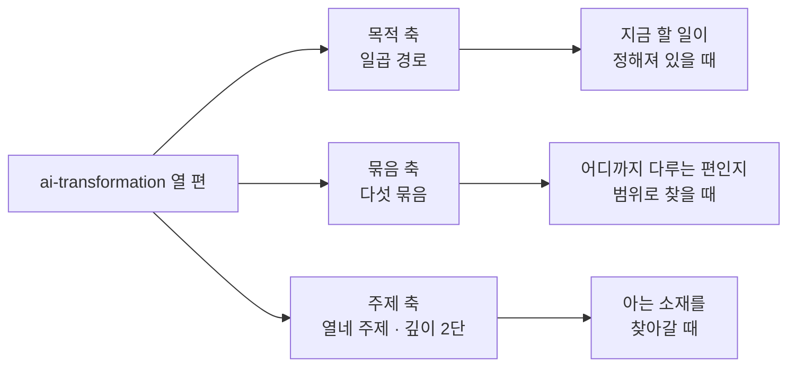
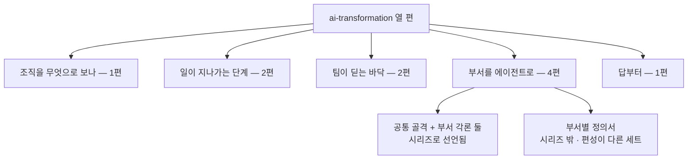

`ai-transformation` 카테고리에는 이 글을 뺀 **열 편**이 있다. 한 편씩은 각자 완결돼 있고, 앞에서부터 순서대로 읽어야 하는 것도 아니다. 열 편 가운데 읽는 순서가 프론트매터에 박혀 있는 것은 세 편뿐이다.

## 목적별 읽는 순서

열 편을 다 읽어야 할 이유는 없다. 지금 하려는 일을 하나 정하고 그 줄기만 따라가면 대개 서너 편에서 닫힌다.

| 목적 | 순서 | 왜 이 순서인가 |
|---|---|---|
| **조직에 처음 들인다** | [조직 설계](/blog/ai-transformation/builder-to-orchestrator-shift/) → [인프라 넷과 성숙도](/blog/ai-transformation/enablement-infra-and-maturity/) → [18문답](/blog/ai-transformation/ai-transformation-qna-org-operations/) | 무엇을 바꾸는 일인지 정의부터 잡고, 팀이 딛는 바닥과 단계별 졸업 조건으로 내려간 뒤, 남는 물음을 문답으로 훑는다 |
| **깔았는데 확산이 안 된다** | [인프라 넷과 성숙도](/blog/ai-transformation/enablement-infra-and-maturity/) → [조직 설계](/blog/ai-transformation/builder-to-orchestrator-shift/) → [세 레이어와 Skill 카탈로그](/blog/ai-transformation/lean-three-layer-harness/) | 먼저 무엇을 재는지 세우고, 확산을 멈출 조건을 확인하고, 그러고도 남는 도구 난립을 걷어내는 쪽으로 간다 |
| **개발 파이프라인에 게이트를 건다** | [여섯 게이트](/blog/ai-transformation/sdlc-human-gates/) → [세 레이어와 Skill 카탈로그](/blog/ai-transformation/lean-three-layer-harness/) → [18문답](/blog/ai-transformation/ai-transformation-qna-org-operations/) | 여섯 단계의 경계를 먼저 잡고, 그 경계 가운데 레포 밖에 남는 것이 무엇인지로 넘어간다 |
| **기획·디자인·마케팅 쪽에 붙인다** | [네 영역 도구 지형](/blog/ai-transformation/discovery-to-growth-tooling/) → [여섯 게이트](/blog/ai-transformation/sdlc-human-gates/) → [조직 설계](/blog/ai-transformation/builder-to-orchestrator-shift/) | 도구 지형을 먼저 보고, 그 산출물이 걸리는 승인 지점으로, 그다음 직무가 어떻게 바뀌는지로 |
| **팀 인프라를 짓는다** | [인프라 넷과 성숙도](/blog/ai-transformation/enablement-infra-and-maturity/) → [세 레이어와 Skill 카탈로그](/blog/ai-transformation/lean-three-layer-harness/) → [여섯 게이트](/blog/ai-transformation/sdlc-human-gates/) | 살 목록을 먼저 보고, 걷어내는 쪽 아키텍처와 대조한 뒤, 강제를 어느 쪽에서 거는지로 |
| **부서 업무를 에이전트로 옮긴다** | [공통 골격](/blog/ai-transformation/department-agent-blueprint/) → [고객 접점 네 부서](/blog/ai-transformation/department-automation-frontline/) → [백오피스 3부서](/blog/ai-transformation/department-automation-backoffice/) → [26종 정의서](/blog/ai-transformation/agent-definition-by-department/) | 골격 → 부서 각론 → 정의서 실물. 앞의 셋은 시리즈 순서 그대로이고, 넷째는 편성이 다른 세트라 부서 이름이 어긋난다 |
| **답만 빨리 본다** | [18문답](/blog/ai-transformation/ai-transformation-qna-org-operations/) | 열여덟 문항이 각자 판정 한 줄과 근거까지만 담고, 표와 각론은 그 물음에 맞는 편으로 넘긴다 |

> **일곱 줄의 배열은 이 글이 정한 것이다.** 편끼리 선후를 선언해 둔 것이 아니라, 어느 편을 먼저 읽어야 뒤따르는 편이 전제로 삼는 것이 채워지는지를 기준으로 늘어놓았다. 다만 두 자리는 각 편이 직접 밝힌 이음새를 그대로 받았다 — 세 레이어 편은 인프라 편이 비워 둔 자리를 자기가 채운다고 첫머리에 적었고, 부서 각론 두 편은 공통 골격 편과 시리즈 순서로 묶여 있다.

일곱 경로의 자리를 다 세면 **스무 개**다. 중복을 걷어내면 **열 편 전부**가 된다. 갈라지는 방식이 고르지 않다 — 다섯 편은 세 경로씩에 들어가고 나머지 다섯 편은 한 경로에만 들어간다. 세 번씩 불리는 쪽은 [조직 설계](/blog/ai-transformation/builder-to-orchestrator-shift/)·[여섯 게이트](/blog/ai-transformation/sdlc-human-gates/)·[인프라 넷과 성숙도](/blog/ai-transformation/enablement-infra-and-maturity/)·[세 레이어와 Skill 카탈로그](/blog/ai-transformation/lean-three-layer-harness/)·[18문답](/blog/ai-transformation/ai-transformation-qna-org-operations/)이고, 한 번만 불리는 다섯 편 가운데 넷은 부서 자동화 경로에 함께 들어가는 편들이다. 5 × 3 + 5 × 1로 합이 스물이다.

같은 열 편을 **세 번 갠다.**

## 열 편이 어떻게 놓여 있는가

| 묶음 | 편수 | 다루는 범위 |
|---|---:|---|
| 조직을 무엇으로 보나 | 1 | AX의 정의, 직무 재정의, 조직 구조, 거버넌스, 변화관리와 실패 수치 |
| 일이 지나가는 단계 | 2 | 요구사항에서 운영까지의 단계 경계, 그리고 단계 번호에 일렬로 세워지지 않는 네 영역의 도구 지형 |
| 팀이 딛는 바닥 | 2 | 팀이 함께 쓰는 인프라와 성숙도, 그 인프라를 얇게 대체하는 아키텍처 |
| 부서를 에이전트로 | 4 | 일곱 부서의 공통 골격, 부서 각론, 그리고 부서별 정의서 |
| 답부터 | 1 | 반복해서 돌아오는 물음에 결론부터 |
| | **10** | |

**다섯 묶음과 그 이름은 이 글이 붙인 것이다.** 각 편이 스스로 선언한 상위 분류가 아니다.

선언된 것이 하나 있다. **부서를 에이전트로 묶음의 네 편 중 셋이 프론트매터에 `department-agents` 시리즈로 1·2·3 순서를 갖고 있고, 넷째 편은 그 시리즈에 들어 있지 않다.** 그 넷째 편은 자기 앞머리의 「이 글이 다루는 세트와 범위」에서 이유를 밝힌다 — 총계 30인 표의 **다른 판본**을 다루기 때문에 부서 이름을 앞의 셋과 맞춰 쓰지 않는다는 것이다. 저쪽에 법무·경영지원이 있고 이쪽에는 없으며, 이쪽의 기획전략이 저쪽에 없다.

## 묶음별 열 편

각 칸의 설명은 그 편이 무엇을 싣는지 가리킨다. 표와 도식은 해당 편 안에 있다.

### 조직을 무엇으로 보나

| 글 | 무엇이 있는가 |
|---|---|
| [빌더에서 오케스트레이터로 가는 조직 설계](/blog/ai-transformation/builder-to-orchestrator-shift/) | AX를 인력 감축이 아니라 생산 함수의 교체로 놓는 정의와 어휘 스물셋, 개인기·팀 시스템·조직 역량 3단 모델, 다섯 직무의 AS-IS와 TO-BE, NIST AI RMF를 다섯 줄로 옮긴 가드레일, 롤아웃의 중단 기준, 기업 사례 열한 개, 그리고 파일럿 95%·투자 72%·KPI 추적 20% 미만이라는 실패 수치 |

### 일이 지나가는 단계

| 글 | 무엇이 있는가 |
|---|---|
| [요구사항에서 운영까지 여섯 게이트와 개발·QA·배포 각론](/blog/ai-transformation/sdlc-human-gates/) | 여섯 단계마다 「AI가 처리하는 것 / 사람 게이트(통과 기준)」를 한 행씩 배정한 표, 모든 단계에 공통으로 거는 안전장치 넷, 생성·검증은 로컬이고 강제는 서버사이드라는 경계, 같은 여섯 단계를 원 자료가 두 번 적은 두 판본의 대조, 그리고 개발·QA·배포 세 영역의 도구와 KPI |
| [기획·디자인·마케팅·경쟁사 분석 네 영역의 AI 도구 지형](/blog/ai-transformation/discovery-to-growth-tooling/) | 네 영역이 각각 어떤 도구를 어떤 기준으로 고르는가, 네 문서가 적은 선택 기준 네 벌의 대조, 그리고 네 영역의 2열 표에서 사람 쪽 열에 남은 항목 열셋을 사전 정의와 판정 두 갈래로 나눈 배정 |

### 팀이 딛는 바닥

| 글 | 무엇이 있는가 |
|---|---|
| [팀 공유 인프라 넷과 성숙도 0 → 1 → N](/blog/ai-transformation/enablement-infra-and-maturity/) | 성숙도 세 단계에 각각 붙은 졸업 조건, 팀이 함께 쓰는 인프라 넷, 그것을 까는 순서를 체감 ROI 다섯과 기간별 네 단계 두 축으로 대조한 결과, KPI 네 분류와 중단 기준, 미리 피할 실패요인 다섯 |
| [하네스·위키·게이트 세 레이어와 Skill 카탈로그 열하나](/blog/ai-transformation/lean-three-layer-harness/) | 레포에 커밋되는 두 층과 커밋할 수 없는 한 층으로 가르는 아키텍처, 팀 절차를 담은 Skill 열한 개의 목적·트리거·입출력·대체 SaaS 표, 위키의 폴더 구조와 뼈대 파일 넷, 그리고 어디까지 위키이고 어디부터 RAG인가의 규모 임계 |

### 부서를 에이전트로

| 글 | 무엇이 있는가 |
|---|---|
| [7부서 30에이전트의 공통 골격](/blog/ai-transformation/department-agent-blueprint/) | 일곱 파이프라인에서 부서 이름을 지우면 남는 다섯 단계와 그 서른다섯 칸, I/O 계약, 도구 조합으로 역할을 정의하는 법, 사람 개입 A~D 네 등급, 파이프라인 복구 네 종, 규모별 구조 선택표, 그리고 총계 30인 표가 이 블로그에 세 판본이 있다는 대조 |
| [고객 접점 네 부서가 자동화를 멈추는 자리](/blog/ai-transformation/department-automation-frontline/) | 마케팅·영업·고객지원·인사 네 부서의 에이전트 명세와 파이프라인, 고객지원의 신뢰도 세 구간, 민감 데이터를 다루는 등급과 인사부의 HARD-GATE 세 곳, 그리고 네 부서의 경계 장치를 판정 주체와 우회 가능성 두 열로 모아 놓은 표 |
| [백오피스 3부서와 자동화 등급 6축](/blog/ai-transformation/department-automation-backoffice/) | 재무·법무·경영지원 세 부서의 각론, 재실행해도 장부가 어긋나지 않게 하는 멱등성 설계와 네 단계 폴백, 예외를 던져 파이프라인을 멈추는 HARD-GATE의 공통 형식, 그리고 새 업무를 에이전트로 쪼개는 여섯 단계와 A~D를 가르는 판단 기준 여섯 줄 |
| [여섯 부서 26종 에이전트 정의서](/blog/ai-transformation/agent-definition-by-department/) | 여섯 부서 스물여섯 종의 정의서와 부서마다 하나씩인 위임 흐름 도식, 그 도식의 인계 화살표 서른다섯 개 중 부서 경계를 넘는 여덟 개, 그리고 프롬프트 설계 기법 서른아홉 가지를 모델의 재량을 어디서 좁히는지로 여섯 갈래에 배정한 표 |

### 답부터

| 글 | 무엇이 있는가 |
|---|---|
| [조직 운영과 부서 자동화 18문답](/blog/ai-transformation/ai-transformation-qna-org-operations/) | 열여덟 문항에 결론부터 답하고 표·수치·각론은 각 편으로 넘긴다. 앞머리에는 자주 걸리는 갈림길 여덟 개를 판정 기준과 나란히 모은 표가 따로 있다 |

1 + 2 + 2 + 4 + 1로 합이 10이다.

## 주제에서 글로 — 열네 주제 교차 참조

찾는 소재의 이름을 이미 알고 들어왔다면 묶음이나 경로보다 이 표가 빠르다. 한 소재가 대개 서너 편에 나뉘어 있기 때문이다.

> **열네 주제와 1차·2차 배정은 이 글의 판정이다.** 그 소재를 **절의 주어로 삼는가**(1차) · **한 절로 받아 두는가**(2차)로 갈랐다. 소재가 절이 아니라 표의 행이나 열로 있는 자리도 있고, 그런 자리는 절 대신 편을 단위로 골랐다. 그중 하나는 아래에서 따로 적는다. 절의 길이는 참고만 했고, 다른 잣대를 대면 두 열의 순서가 바뀔 수 있다.
>
> 오른쪽 끝 열은 1차·2차의 깊이 계산에 들어가지 않는다. 같은 소재를 옆에서 스치는 편이나, 그 소재를 물음 형태로 바꿔 놓은 편을 적었다.

| # | 주제 | 1차 (가장 깊다) | 2차 | 함께 볼 것 |
|---:|---|---|---|---|
| 1 | 단계 경계에 게이트를 놓는 법 | [여섯 게이트](/blog/ai-transformation/sdlc-human-gates/) — 여섯 단계 표와 통과 기준 | [세 레이어](/blog/ai-transformation/lean-three-layer-harness/) — 승인과 감사추적만 남는 Layer 3 | [18문답](/blog/ai-transformation/ai-transformation-qna-org-operations/) |
| 2 | 업무를 자동화할지 판정하는 법 | [백오피스 3부서](/blog/ai-transformation/department-automation-backoffice/) — A~D 판정 기준 여섯 줄 | [공통 골격](/blog/ai-transformation/department-agent-blueprint/) — 사람 개입 A~D 네 등급 | [고객 접점 네 부서](/blog/ai-transformation/department-automation-frontline/) |
| 3 | 자동화를 멈추는 값과 장치 | [고객 접점 네 부서](/blog/ai-transformation/department-automation-frontline/) — 신뢰도 세 구간·점수 70·HARD-GATE | [백오피스 3부서](/blog/ai-transformation/department-automation-backoffice/) — HARD-GATE 공통 형식 | [18문답](/blog/ai-transformation/ai-transformation-qna-org-operations/) |
| 4 | 무엇으로 재나 — 지표 | [인프라 넷과 성숙도](/blog/ai-transformation/enablement-infra-and-maturity/) — KPI 네 분류와 주의 열 | [조직 설계](/blog/ai-transformation/builder-to-orchestrator-shift/) — 95·72·20과 그 출처 | [여섯 게이트](/blog/ai-transformation/sdlc-human-gates/) · [18문답](/blog/ai-transformation/ai-transformation-qna-org-operations/) |
| 5 | 언제 멈추고 되돌리나 — 중단 기준 | [조직 설계](/blog/ai-transformation/builder-to-orchestrator-shift/) — 변화관리 표의 중단 기준 열 | [인프라 넷과 성숙도](/blog/ai-transformation/enablement-infra-and-maturity/) — KPI 절 안의 중단 기준 | [18문답](/blog/ai-transformation/ai-transformation-qna-org-operations/) |
| 6 | 도구를 고르고 줄이는 법 | [네 영역 도구 지형](/blog/ai-transformation/discovery-to-growth-tooling/) — 선택 기준 네 벌 | [세 레이어](/blog/ai-transformation/lean-three-layer-harness/) — 무엇을 걷어내나 | [인프라 넷과 성숙도](/blog/ai-transformation/enablement-infra-and-maturity/) · [18문답](/blog/ai-transformation/ai-transformation-qna-org-operations/) |
| 7 | 성숙도와 도입 순서 | [인프라 넷과 성숙도](/blog/ai-transformation/enablement-infra-and-maturity/) — 0 → 1 → N과 졸업 조건 | [조직 설계](/blog/ai-transformation/builder-to-orchestrator-shift/) — L1·L2·L3 3단 모델 | [18문답](/blog/ai-transformation/ai-transformation-qna-org-operations/) |
| 8 | 팀 지식을 어디에 두나 | [세 레이어](/blog/ai-transformation/lean-three-layer-harness/) — Layer 2 위키의 구조와 규모 임계 | [인프라 넷과 성숙도](/blog/ai-transformation/enablement-infra-and-maturity/) — 회사 두뇌와 RAG·롱컨텍스트 | [18문답](/blog/ai-transformation/ai-transformation-qna-org-operations/) |
| 9 | 부서 파이프라인의 공통 골격 | [공통 골격](/blog/ai-transformation/department-agent-blueprint/) — 다섯 단계 서른다섯 칸 | [백오피스 3부서](/blog/ai-transformation/department-automation-backoffice/) — 업무 분해 여섯 단계 | [고객 접점 네 부서](/blog/ai-transformation/department-automation-frontline/) |
| 10 | 에이전트 하나를 정의하는 법 | [26종 정의서](/blog/ai-transformation/agent-definition-by-department/) — 프롬프트 설계 기법 서른아홉 | [공통 골격](/blog/ai-transformation/department-agent-blueprint/) — I/O 계약과 도구 조합 | [고객 접점 네 부서](/blog/ai-transformation/department-automation-frontline/) |
| 11 | 실패했을 때 되돌리는 법 | [공통 골격](/blog/ai-transformation/department-agent-blueprint/) — 파이프라인 복구 네 종 | [백오피스 3부서](/blog/ai-transformation/department-automation-backoffice/) — 멱등성과 폴백 체인 | [인프라 넷과 성숙도](/blog/ai-transformation/enablement-infra-and-maturity/) |
| 12 | 직무와 조직이 바뀌는 모양 | [조직 설계](/blog/ai-transformation/builder-to-orchestrator-shift/) — 다섯 직무 표와 하이브리드 구조 | [네 영역 도구 지형](/blog/ai-transformation/discovery-to-growth-tooling/) — 재정의된 직무가 쥐는 도구 | [18문답](/blog/ai-transformation/ai-transformation-qna-org-operations/) |
| 13 | 거버넌스와 데이터 보호 | [조직 설계](/blog/ai-transformation/builder-to-orchestrator-shift/) — NIST AI RMF 다섯 줄 | [여섯 게이트](/blog/ai-transformation/sdlc-human-gates/) — 공통 안전장치 넷 | [고객 접점 네 부서](/blog/ai-transformation/department-automation-frontline/) |
| 14 | AX에 드는 비용을 어디서 통제하나 | **없음** | [여섯 게이트](/blog/ai-transformation/sdlc-human-gates/) — 도구별 비용과 예산 가드레일 | [인프라 넷과 성숙도](/blog/ai-transformation/enablement-infra-and-maturity/) · [세 레이어](/blog/ai-transformation/lean-three-layer-harness/) · [백오피스 3부서](/blog/ai-transformation/department-automation-backoffice/) |

### 이 표를 세어 보면

| 세어 본 것 | 값 |
|---|---:|
| 주제 | 14 |
| 1차 자리 | 13 |
| 2차 자리 | 14 |
| 「함께 볼 것」 자리 | 18 |
| **배정한 자리 계** | **45** |
| 깊이 열(1차·2차)만 세었을 때 편 수 | 9 |
| 중복을 걷어낸 편 수 | **10** |

마흔다섯 자리를 열 편이 나눠 갖는다. **빠진 편은 없다.** 다만 1차·2차 두 열만 놓고 세면 아홉 편이고, 남는 한 편인 [18문답](/blog/ai-transformation/ai-transformation-qna-org-operations/)은 오른쪽 끝 열의 여덟 자리로만 등장한다.

1차 자리가 열넷이 아니라 열셋인 것은 주제 14에 1차가 없기 때문이다. 그 열세 자리를 채우는 것도 **바로 그 아홉 편**이다 — [조직 설계](/blog/ai-transformation/builder-to-orchestrator-shift/)가 세 주제(중단 기준·직무와 조직·거버넌스)의 1차를 겸하고, [인프라 넷과 성숙도](/blog/ai-transformation/enablement-infra-and-maturity/)와 [공통 골격](/blog/ai-transformation/department-agent-blueprint/)이 각각 둘씩을 겸한다.

### 주제 14는 왜 1차가 비어 있는가 — 그 자리를 메우는 편들

**AX에 드는 비용을 얼마나 쓰고 어디서 통제하는가를 절의 주어로 삼은 자리가 이 카테고리에 없다.** 낱말이 없어서가 아니다 — 「비용」은 열 편 **전부**에 나오고(낱말 단위로 세어 편당 1회에서 17회), 「예산」은 여덟 편, 「과금」은 네 편, 「ROI」는 네 편에 나온다. 그런데 절 제목에 이 넷 중 하나가 들어가는 자리는 네 곳뿐이다. 그중 비용을 주어로 삼는 둘은 [백오피스 3부서](/blog/ai-transformation/department-automation-backoffice/)의 부서 각론 안이다 — 재무부가 장부의 비용을 분류하고 이상을 잡는 절, 그리고 법무부의 비용 비교(전통 외주와 에이전트 활용을 나란히 놓은 표)다. 앞쪽은 한 부서의 회계 업무이고 뒤쪽은 비교이지 통제가 아니다. 남은 둘은 퍼포먼스 마케팅의 예산 배분과 인프라 도입 순서를 다루는 절이다. **넷 중 어느 절도 AX에 드는 비용을 얼마나 쓰고 어디서 통제하는가를 주어로 삼지 않는다** — 첫 문장이 세운 술어는 이 배제를 거친 것이다. 열 편의 절 제목을 훑어 확인한 결과다.

2차와 「함께 볼 것」에 세운 네 편이 그 자리를 나눠 메운다. 주제가 「통제」이므로 통제 장치를 가진 편을 2차에 두었다 — [여섯 게이트](/blog/ai-transformation/sdlc-human-gates/) 편은 과금 변동에 대비한 예산 가드레일을 공통 안전장치 넷 중 하나로 세우고, 개발·QA·배포 세 영역마다 도구의 용도와 비용을 나란히 놓은 표를 하나씩 둔다(세 표를 합치면 도구 열여섯 종이다). 나머지 셋은 재료 쪽이다. [인프라 넷과 성숙도](/blog/ai-transformation/enablement-infra-and-maturity/) 편에서는 인프라를 까는 순서를 체감 ROI로 매긴 표가 「왜 먼저」 열 안에 비용을 적고, 도구별 비용을 따로 열로 세운 표는 인프라 넷을 하나씩 펼치는 절에 있다. [세 레이어](/blog/ai-transformation/lean-three-layer-harness/) 편은 Skill 카탈로그 오른쪽 끝에 대체 SaaS 열을 두어 무엇을 사지 않게 되는지를 보인다. [백오피스 3부서](/blog/ai-transformation/department-automation-backoffice/) 편에는 원 자료가 든 비용 비교가 그대로 실려 있다. 도구 가격을 열로 단 표는 이 넷 말고도 있다 — 여기 세운 기준은 가격표의 유무가 아니라 비용을 통제하는 장치나 비용에 대한 판정이 그 편에 있는가다. **위에 예고한 자리가 여기다.** 여섯 게이트 편에서 예산 가드레일은 공통 안전장치 넷 표의 넷째 행이고 도구별 비용은 세 표의 한 열이라, 소재가 절이 아니라 표의 행과 열로 있다. 그래서 이 주제의 2차는 절이 아니라 편을 단위로 골랐다.

**이 글은 그 칸을 비운 채로 둔다.** 네 자리를 합치면 비용 이야기가 되기는 하지만, 그중 하나를 1차로 끌어올려 적으면 그 편을 찾아간 독자가 기대한 절을 만나지 못한다. 없는 깊이를 있다고 적는 셈이다.

다만 절 제목으로 재는 이 잣대가 놓치는 자리가 있다는 것은 적어 둔다. [인프라 넷과 성숙도](/blog/ai-transformation/enablement-infra-and-maturity/) 편은 도입 순서 전체에 걸리는 비용 가드레일을 한 문단으로 두었고, [세 레이어](/blog/ai-transformation/lean-three-layer-harness/) 편은 그 편과 비용 판정이 갈리는 자리를 따로 짚는다. 둘 다 절의 주어가 아니라 절 안의 한 대목이라 위 기준에는 걸리지 않는다.

## 같은 이름이 다른 층위를 가리키는 자리

열 편을 옮겨 다니며 읽을 때 걸리는 것은 분량이 아니라 **같은 이름이 편마다 다른 크기를 가리킨다**는 점이다. 「하네스」는 작업 틀 일반을 뜻하는데 어떤 편에서는 특정 도구 한 벌로 좁아진다. 「사람 게이트」는 이 블로그의 `ai-agent` 쪽에서 에이전트 루프의 종료 조건을 뜻하는데, 이 카테고리 안에서는 쓰인 층위가 자리마다 다르다. 「총계 30인 에이전트 표」는 이 블로그에 세 판본이 있고 부서 편성이 서로 다르다.

이 카테고리는 그 문제를 스스로 알고 있다. **열 편 중 네 편이 「소재 / 이미 실린 층위 / 이 글의 층위」 3열 표를 두고 자기 자리를 먼저 밝힌다** — 여섯 게이트 편의 「이 글이 쓰는 「게이트」는 어느 층위인가」, 네 영역 도구 편의 「이미 실린 층위와의 대조」, 인프라·성숙도 편과 세 레이어 편의 「이 글이 서 있는 층위」다. 열 이름이 다를 뿐 같은 일을 하는 표도 있다 — 부서별 정의서 편의 「이 글이 다루는 세트와 범위」가 「자리 / 어디에 있나 / 이 글은」 3열로 이미 실린 것과 여기서 싣는 것을 가른다. 그 다섯 개의 자기 신고가 밝히는 것은 각 편이 선 자리이고, 아래 표가 가르는 것은 이름 쪽 층위다.

지도가 실제로 필요해지는 지점이 여기다. **아래 넷을 한자리에 모은 것이 이 글의 정리다.** 각 항목의 구분 자체는 아래 표의 「어디서 갈라 놓았나」 열에 적힌 편이 이미 해 둔 것이다 — **하나만 예외다.** 하네스 행의 세 레이어 편은 자기 용어표에서 범위를 좁혀 적었을 뿐 다른 편의 정의를 옆에 놓은 적이 없다. 그 이름이 두 층위로 갈린다는 대조는 이 글이 세운다.

| 이름 | 한쪽이 뜻하는 것 | 다른 쪽이 뜻하는 것 | 어디서 갈라 놓았나 |
|---|---|---|---|
| **하네스** | 프롬프트·도구·규칙을 묶어 AI를 반복 사용 가능하게 만든 **작업 틀** — [조직 설계](/blog/ai-transformation/builder-to-orchestrator-shift/)와 [여섯 게이트](/blog/ai-transformation/sdlc-human-gates/)의 용어표가 이 문면을 **글자까지 똑같이** 쓴다 | 모델을 둘러싸고 실행을 통제하는 **운영 구조**, 그 글에서는 **특정 도구 한 벌** — [세 레이어](/blog/ai-transformation/lean-three-layer-harness/)의 용어표 | 세 레이어 편이 자기 용어표에서 「이 글에서는」이라는 단서를 붙여 범위를 한 벌로 좁혀 적었다 |
| **오케스트레이터** | AI의 산출을 감독·검증하고 책임지는 **사람의 직무** — [조직 설계](/blog/ai-transformation/builder-to-orchestrator-shift/) | 여러 에이전트의 실행 순서·병렬 여부를 결정하는 **상위 조정자**, 즉 소프트웨어 — [공통 골격](/blog/ai-transformation/department-agent-blueprint/)의 용어 정리 | [조직 설계](/blog/ai-transformation/builder-to-orchestrator-shift/) 편이 도입부에서 두 층위를 대 놓고 자기가 쓰는 쪽을 밝힌다 |
| **사람 게이트** | 에이전트 **루프의 종료 조건** — 모델의 자기 선언 대신 테스트·정적 검사와 나란히 두는 것. **이 카테고리 밖**, `ai-agent` 쪽의 뜻이다 | **SDLC 단계 경계의 승인 지점** — 하나의 변경이 요구사항에서 프로덕션까지 가는 동안. 이 카테고리 안에서 쓰이는 뜻인데, **안에서도 쓰인 층위가 자리마다 갈린다** | [여섯 게이트](/blog/ai-transformation/sdlc-human-gates/) 편의 「이 글이 쓰는 「게이트」는 어느 층위인가」가 세 행으로 가르면서 왼쪽 뜻의 출처를 `ai-agent` 쪽 두 편에 돌리고, 자기 제목에서 「루프의 종료조건이 아니라 단계의 경계다」로 그 뜻을 물린다. 그 표는 정의서에 적히는 한 스텝을 「승인 지점」이라는 다른 이름의 행에 따로 세운다. [네 영역 도구 지형](/blog/ai-transformation/discovery-to-growth-tooling/) 편은 자기 것이 그 둘과 또 다른 층위 — 영역별 산출물의 채택·승인 지점 — 이라고 적는다 |
| **총계 30인 에이전트 표** | 이 블로그에 **세 판본**이 있고 셋 다 총계 30·일곱 부서인데, 판본마다 세트가 다르다. 앞의 두 판본은 부서별 배분까지 같은데도 표기와 열 구성이 갈리고 부서에 담긴 에이전트도 갈린다 — 개발 부서의 구성과 온보딩이 붙는 부서가 그런 자리다. 셋째 판본은 부서 이름과 배분부터 다르다 | 부서 각론 셋이 쓰는 판본과 [26종 정의서](/blog/ai-transformation/agent-definition-by-department/)가 쓰는 판본이 다르다 | [공통 골격](/blog/ai-transformation/department-agent-blueprint/) 편의 「총계가 30인 세 번째 표다」가 셋째 판본을 세우고 세 편성을 한 표에 놓는다. 다만 그 편은 앞의 두 판본이 서로 다른 세트라는 구분을 [30개 에이전트 카탈로그](/blog/agentic-coding/thirty-agent-catalog/)가 이미 했다고 돌리고, 자기가 더하는 것은 셋째 판본이 있다는 사실 하나라고 적는다. [26종 정의서](/blog/ai-transformation/agent-definition-by-department/) 편은 자기가 어느 판본에 서 있는지 앞머리에서 밝힌다 |

에이전트 서른 종의 명부 자체는 이 카테고리 밖에 있다. [30개 에이전트 카탈로그](/blog/agentic-coding/thirty-agent-catalog/)가 부서·역할·입출력·도구를 한 줄씩 싣고, [26종 정의서](/blog/ai-transformation/agent-definition-by-department/) 편이 앞머리 표에서 그 자리를 가리킨다.

## 결론부터 보려면 — 18문답

[조직 운영과 부서 자동화 18문답](/blog/ai-transformation/ai-transformation-qna-org-operations/)은 나머지 아홉 편을 다시 자르지 않는다. **같은 내용을 물음 형태로 먼저 만나게 한다.** 어느 묶음부터 손댈지 아직 못 골랐다면 여기가 문이 된다.

문항 수는 편 제목에 그대로 적혀 있다. 한 문항이 안고 가는 것은 결론과 그것을 받치는 근거까지이고 그 뒤의 표와 수치와 각론은 물음에 해당하는 편이 갖는다 — 그 편이 앞머리에 자기 규칙으로 적어 둔 것이다. 그래서 답이 짧게 느껴지는 문항은 그 안의 링크가 각론으로 내려가는 길이다. 어느 문항이 어느 편으로 넘어가는지는 그 편이 문항마다 답 끝에서 직접 가리키므로 여기서 다시 펼치지 않는다. 위 주제 표의 오른쪽 끝 열에 적힌 여덟 자리는 반대 방향 — 어느 주제가 그 열여덟 문항에 걸리는가 — 이다.

들어가기 전에 볼 것이 하나 더 있다. 그 편은 앞머리에 갈림길 여덟 개를 따로 모아 두었는데, 열여덟 문항에서 골라 배열한 것이라고 그 편이 밝힌다. 표의 요점은 어느 쪽이 정답인가가 아니라 **무엇을 보고 가르는가**다. 열여덟 문항을 다 읽을 시간이 없다면 그 여덟 줄만 봐도 이 카테고리가 무엇을 반복해서 말하는지 잡힌다.

## 닫으며

이 글은 들어가는 문이 셋이다. 지금 할 일이 정해져 있을 때, 어디까지 다루는 편인지 범위로 찾을 때, 아는 소재의 이름부터 들어갈 때다. 아직 아무것도 읽지 않았다면 앞의 둘이 출발점을 고르는 데 쓰이고, 다 읽고 난 뒤에는 셋째가 그게 어느 편에 있었는지 되짚는 데 쓰인다.

할 일이 정해져 있으면 **경로 표에서 한 줄을 골라 그 줄만 따라가는 편**이 열 편을 차례로 훑는 것보다 낫다. 범위로 찾을 때는 묶음 표가 열 편을 다섯 덩이로 갈라 놓는다. 되짚을 때는 **주제 표에서 소재를 찾아 왼쪽 열부터 연다.** 경로 표와 주제 표가 같은 편을 서로 다른 자리에 놓기 때문에 한쪽만 봐서는 그 편이 맡은 다른 역할이 걸리지 않는다 — 이를테면 [공통 골격](/blog/ai-transformation/department-agent-blueprint/) 편은 부서 자동화 경로의 맨 앞에 있지만 주제 표에서는 「실패했을 때 되돌리는 법」의 1차이기도 하다.

남겨 둘 것 둘이 있다.

**하나는 열네 번째 주제다.** AX에 드는 비용을 얼마나 쓰고 어디서 통제하는가를 절의 주어로 삼은 자리가 이 카테고리에 없다. 억지로 한 편을 끌어다 그 자리에 앉히는 것보다 비어 있는 채로 적어 두는 쪽이 사실에 가깝다. 재료 자체는 여러 편에 흩어져 있고 위 절이 그중 네 편의 자리를 하나씩 적어 두었다.

**다른 하나는 이 카테고리로 들어오는 길이다.** 이 열 편을 가리키는 링크는 지금 전부 이 카테고리 안에서 나온다 — 다른 카테고리의 글이 여기로 걸어 둔 링크는 없다. 반대 방향은 그렇지 않아서, 여러 편이 `agentic-coding`·`ai-agent`·`rag` 쪽으로 나가는 링크를 여럿 갖고 있다. 그래서 이 카테고리는 밖에서 우연히 흘러 들어오기보다 **여기서 시작해 밖으로 나가는** 모양으로 읽힌다. 이 글이 그 시작점의 자리를 맡는다.
