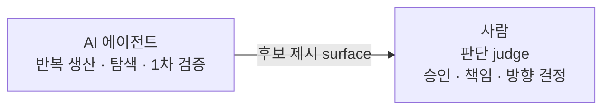
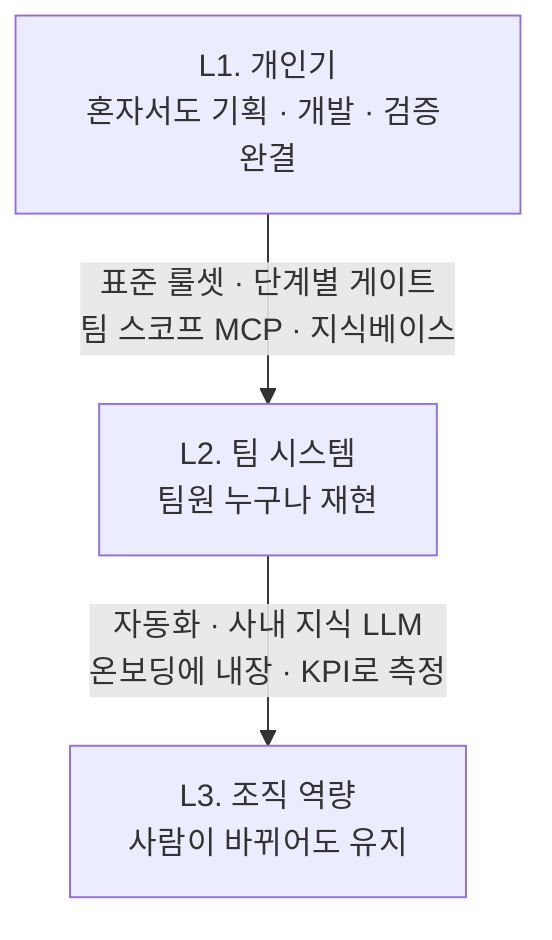
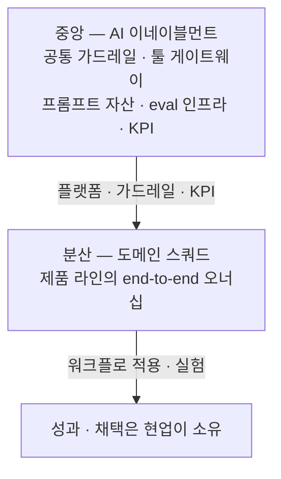
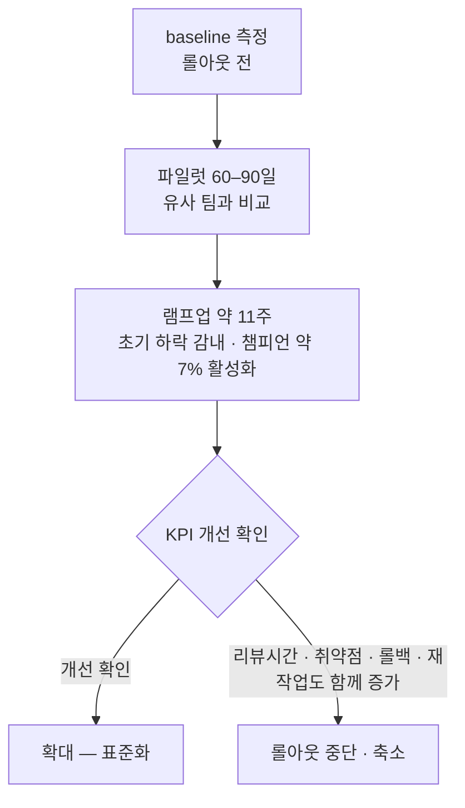

개인이 AI를 잘 쓰는 것과 조직이 AI를 잘 쓰는 것은 같은 일이 아니다. 원 자료는 그 간격을 한 문장으로 적었다 — **대부분의 사람은 1단계, 즉 개인이 AI를 잘 쓰는 데에 머문다.** 그래서 2단계와 3단계를 설계하는 것이 리더의 과제가 된다.

이 글이 자료로 쓰는 것은 2026-06-15 기준으로 작성된 AX 조직 운영 문서 세 벌이다 — 운영 철학, 조직 구성·역할 설계, 그리고 사례집·벤치마크. 세 문서가 한 세트로 다루는 것은 도구 목록이 아니라 **같은 인원으로 산출을 늘리는 조직을 어떤 정의·역할·거버넌스로 굴리는가**이고, 이 글은 그중 철학·직무·조직 구조·거버넌스·변화관리·기업 사례를 옮긴다.

「오케스트레이터」라는 말은 이 블로그에 이미 여러 번 나왔지만 층위가 갈린다. [부서별 에이전트 설계](/blog/ai-transformation/department-agent-blueprint/)는 그것을 **여러 에이전트의 실행 순서·병렬 여부를 결정하는 상위 조정자**, 즉 소프트웨어 층위로 정의했고, [기업 AI 도입 행동](/blog/ai-agent/enterprise-ai-adoption-actions/)은 **프로덕트 오너에 매핑되는 사람 역할**로 썼다. 이 글이 쓰는 것은 뒤쪽 — 사람의 직무 층위다.

이 글에서 가장 오래 남는 관찰을 먼저 적어 둔다. **AI 도입은 모델에서 실패하지 않는다.** 파일럿의 95%가 ROI에 못 미친 원인을 조사한 쪽은 모델이 아니라 조직·통합을 지목했고, 투자의 72%가 가치를 파괴한다고 본 쪽은 도구 난립과 통제 밖 사용을 이유로 들었다. 그런데 성과를 가르는 최강 예측변수인 KPI 추적은 20% 미만만 한다. 이 세 숫자가 이 글의 뒤쪽 절에 있고, 그 앞의 모든 절은 그 세 숫자를 피하기 위한 설계다.

## 용어 정리

이 글이 다루는 어휘 스물셋이다. 원 자료가 세 문서에 흩어 놓은 것을 한자리에 모았다.

| 용어 | 영문·원어 | 뜻 |
|---|---|---|
| **AX** | AI Transformation | 사람의 판단·책임은 남기고 반복 생산·탐색·검증을 AI 에이전트에 위임해, 같은 인원으로 산출의 규모·속도·품질을 동시에 올리는 조직 전환 |
| **생산 함수** | Production Function | 투입 대비 산출의 관계. 원 자료는 AX의 목표를 인력 감축이 아니라 이 함수의 교체로 잡는다 |
| **빌더** | Builder | 직접 만드는 사람. 재정의 이전의 직무 상태 |
| **오케스트레이터** | Orchestrator | 직접 만드는 대신 AI의 산출을 감독·검증하고 책임지는 직무 |
| **surface / judge** | — | "AI가 후보를 제시(surface), 사람이 판단(judge)"라는 역할 분담 프레임 |
| **하네스** | Harness | 프롬프트·도구·규칙을 묶어 AI를 반복 사용 가능하게 만든 작업 틀 |
| **바이브코딩** | Vibe Coding | 자연어 지시 위주로 코드를 만들어 내는 방식 |
| **MCP** | Model Context Protocol | 도구·데이터 소스를 모델에 연결하는 표준 |
| **RAG** | Retrieval-Augmented Generation | 외부 지식을 검색해 생성에 결합하는 방식 |
| **이네이블먼트** | Enablement | 공통 가드레일·툴 게이트웨이·프롬프트 자산·eval 인프라·KPI를 맡는 중앙 기능 |
| **도메인 스쿼드** | Domain Squad | 각 제품 라인이 AI 기능을 end-to-end 오너십으로 가져가는 크로스펑셔널 단위 |
| **AI 챔피언 / 길드** | — | Leaders(전략·거버넌스·측정)와 Activators(팀 내 실전 적용)로 구성된 횡단 조직 |
| **NIST AI RMF** | NIST AI Risk Management Framework | Govern·Map·Measure·Manage 네 기능으로 AI 위험을 관리하는 프레임워크 |
| **HITL** | Human-in-the-loop | 검토 지점·오버라이드 권한·에스컬레이션·책임자를 문서화해 사람 판단을 강제하는 장치 |
| **eval** | Evaluation | AI 생성물의 품질을 재는 평가 시스템과 평가셋 |
| **Shadow AI** | — | 조직이 파악하지 못한 채 개인이 도입해 쓰는 AI 도구 |
| **tool sprawl** | — | 도구가 중복·난립해 투자가 흩어지는 상태 |
| **DORA** | DevOps Research and Assessment | 개발 조직 성과를 throughput·stability 등으로 재는 연례 조사 |
| **램프업** | Ramp-up | 도구 도입 후 완전 생산성에 도달하기까지의 기간. 초기 생산성 하락은 정상이다 |
| **디스킬링 · 스킬 침식** | Deskilling · Skill Erosion | AI 의존으로 사람의 역량이 저하되는 위험 |
| **컨텍스트 엔지니어링** | Context Engineering | 모델에 무엇을 언제 주는지를 설계하는 역량 |
| **team of one** | — | 한 사람이 과거 소규모 팀의 산출을 내는 상태 |
| **U턴** | — | AI 일변도로 갔다가 그 일부를 되돌린 사례 |

## 한 문장 정의 — 인력 대체가 아니라 생산 함수의 교체

> **AX 조직 = "사람의 판단·책임"은 남기고 "반복 생산·탐색·검증"은 AI 에이전트에 위임하여, 같은 인원으로 산출의 규모·속도·품질을 동시에 올리는 조직.**

핵심은 *인력 대체*가 아니라 **생산 함수의 교체**다. 묻는 것이 "몇 명을 줄였나"에서 "한 사람이 다룰 수 있는 일의 폭과 깊이가 얼마나 커졌나"로 바뀐다.

정의를 그림으로 옮기면 위임되는 것과 남는 것이 갈린다.

운영 원칙의 첫 항목도, 거버넌스의 네 번째 가드레일도, 기업 사례의 U턴 반례가 도달하는 결론도 전부 이 한 화살표 — 사람이 승인하는 지점이 파이프라인 안에 남아 있는가 — 로 되돌아온다. 이 연결은 이 글의 정리다.

## 개인기 · 팀 시스템 · 조직 역량 — 3단 모델

개인이 AI를 잘 쓰는 상태에서 조직이 AI를 잘 쓰는 상태까지는 두 번의 이행이 있다. 원 자료는 그것을 세 단계로 나눈다.

| 단계 | 무엇 | 조직에 이식하는 방법 |
|---|---|---|
| **L1. 개인기** | 프롬프트·하네스 엔지니어링, 바이브코딩으로 *혼자서도* 기획·개발·검증을 완결. MCP 직접 제작(Notion·GitHub·AWS·DB·Jira·Confluence 연결), PostgreSQL 기반 RAG 구축, 로컬 지식관리 도구(qmd) 사용 | — (이미 보유) |
| **L2. 팀 시스템** | 개인기를 *규칙·게이트·템플릿·공유 컨텍스트*로 외부화해 팀원 누구나 재현 | 표준 룰셋(CLAUDE.md), 단계별 게이트, 팀 스코프 MCP(원격+OAuth), 지식베이스 |
| **L3. 조직 역량** | 시스템이 *자동화·지식관리·문화*로 굳어져 사람이 바뀌어도 유지 | n8n 자동화, 사내 지식 LLM, 온보딩에 내장, KPI로 측정 |

세 번째 열이 곧 두 번의 이행이다.

두 화살표의 성격이 다르다. **L1에서 L2로 가는 일은 외부화다** — 한 사람의 머릿속에 있던 판단 기준을 규칙·게이트·템플릿·공유 컨텍스트로 꺼내 놓아 다른 사람이 같은 결과를 내게 만드는 것이다. **L2에서 L3으로 가는 일은 고착화다** — 그 규칙이 자동화·지식관리·문화로 굳어져 담당자가 바뀌어도 남게 하는 것이다.

팀 공통 인프라와 성숙도 모델은 [팀 공유 인프라 넷과 성숙도](/blog/ai-transformation/enablement-infra-and-maturity/)에 있다.

## 운영 4원칙 — 하위 규칙의 헌법

원 자료는 아래 넷을 모든 하위 규칙의 상위 프레임으로 둔다. 뒤에 나오는 거버넌스 표도, 변화관리 절차도 이 넷 중 하나로 환원된다.

| 원칙 | 의미 | 실무 함의 |
|---|---|---|
| **① 사람은 게이트, AI는 드래프트** | 생성·탐색·1차 검증은 AI, *승인·책임·방향 결정*은 사람 | 모든 단계에 "사람이 승인하는 체크포인트"를 명시 |
| **② 컨텍스트를 자산화** | 잘 된 프롬프트·문맥·결정은 1회용이 아니라 *공유 자산* | 공유 프롬프트 라이브러리, 지식베이스, ADR — 앞의 둘은 [팀 공유 인프라 넷과 성숙도](/blog/ai-transformation/enablement-infra-and-maturity/)에 |
| **③ 측정 가능한 것만 확산** | "빨라진 것 같다"가 아니라 리드타임·결함율·재작업률로 검증한 뒤 확산 | 성숙도 모델·KPI — [팀 공유 인프라 넷과 성숙도](/blog/ai-transformation/enablement-infra-and-maturity/) |
| **④ 가드레일 우선** | 보안·환각·저작권·스킬 저하 리스크를 *기본값으로* 차단 | 거버넌스·가드레일 — 아래 절 |

원 자료는 네 원칙의 실무 함의를 각각 다른 문서로 넘긴다. 넷 가운데 셋의 도착지가 이 블로그 안이다 — 이 글이 넷째를, 팀 공유 인프라 넷과 성숙도 편이 둘째와 셋째를 받는다.

## 리더십 철학 — 이 글이 옮기는 셋

- **핸즈온 리더** — 리딩과 실무를 분리하지 않는다. 리더가 직접 하네스를 짜 보고, 그 패턴을 팀 규칙으로 내린다.
- **"사람이 이해하는 코드·시스템"** — 컴퓨터가 이해하는 코드는 누구나 짤 수 있다. AI 시대에 더 중요해진 것은 *사람이 이해하고 유지·검증할 수 있는* 산출물이다.
- **꾸준함의 복리** — 매일의 작은 개선(프롬프트 하나, 자동화 하나)이 조직 역량의 복리가 된다.

첫 항목이 앞 절의 L1→L2 이행과 같은 말이라는 점은 짚어 둘 값이 있다. **직접 짜 본 패턴을 팀 규칙으로 내리는 일이 곧 외부화다.** 리더가 실무를 놓으면 외부화할 원본이 없고, 규칙으로 내리지 않으면 외부화가 일어나지 않는다. 이 대조는 이 글의 정리다.

## 역할 재정의 — 빌더에서 오케스트레이터로

모든 직군이 *직접 만드는 사람*에서 *AI를 감독·검증·책임지는 사람*으로 이동한다. AI가 대체하지 못하는 불변 역량은 **맥락 판단(taste/judgment)** 이고, 프레임은 앞에서 본 그대로다 — **"AI가 후보를 제시(surface), 사람이 판단(judge)"**.

핵심 명제는 두 가지다. 한 사람이 과거 소규모 팀의 산출을 내는 **"team of one"** 이 가능해지고, 개발자와 PM의 비율이 역전된다. ([O'Reilly](https://www.oreilly.com/radar/conductors-to-orchestrators-the-future-of-agentic-coding/), [CIO](https://www.cio.com/article/4060162/the-new-org-chart-unlocking-value-with-ai-native-roles-in-the-agentic-era.html))

원 자료는 이 재정의를 개요와 상세 표로 나눠 두 문서에 두었다. 아래가 그 상세다.

| 직무 | AS-IS | TO-BE (오케스트레이터) | 새로 요구되는 역량 |
|---|---|---|---|
| **PM/기획** | 요구사항 정의, 백로그 | AI를 감독·지휘하는 방향 설정자. 프로토타입을 직접 만든다 | **컨텍스트 엔지니어링**, **품질 정의** — good을 100~500개 테스트케이스로 정의해 모델 업데이트마다 벤치마크 |
| **디자이너** | UI/UX 화면 | 에이전트의 성격·목표·제약·시스템 프롬프트 설계 | AI 작동 원리(컨텍스트 윈도·환각·지연) 이해 |
| **개발자** | 코드 작성 | 에이전트 묶음 지휘. **10x = 기술력 + 컨텍스트 관리력** | 컨텍스트 관리, 코드 리뷰·검증, 아키텍처·판단 비중 증가 |
| **QA** | 수동·자동 테스트 | AI 생성물의 **평가 시스템(eval) 설계**, 휴먼 벤치마크 운영 | 평가셋 큐레이션, 회귀 검증 자동화 |
| **마케터** | 캠페인 실행 | 콘텐츠·리서치 에이전트 운용 | 프롬프트·브랜드 가드레일 정의 |

다섯 행의 TO-BE 열을 세로로 읽으면 **네 직무가 "AI에게 무엇을 어떻게 시킬지 정하는 일"로 옮겨 가고, 한 직무(QA)만 "AI가 낸 것을 어떻게 잴지 정하는 일"로 옮겨 간다.** 이 배분은 이 글의 정리다.

불변 역량이 맥락 판단이라는 명제와, 검증 후 책임은 사람에게 남는다는 원칙은 원 자료가 세 출처로 받친다. ([Productboard](https://www.productboard.com/blog/how-ai-is-evolving-pm-skill-sets/), [Atlassian](https://www.atlassian.com/blog/how-we-build/the-future-of-product-craft), [IIL](https://blog.iil.com/human-in-the-loop-is-not-optional-why-ai-in-pm-needs-human-judgment/))

## 조직 구조 — 하이브리드

직무가 바뀌면 그 직무를 담는 그릇도 바뀐다. 원 자료는 조직 구조를 두 번, 다른 축으로 적는다. 앞의 표는 열머리가 「레이어」이고, 뒤의 표는 「패턴」이다.

### 위치로 본 세 레이어

| 레이어 | 역할 |
|---|---|
| **중앙: AI 이네이블먼트** | 공통 가드레일·툴 게이트웨이·프롬프트 자산·eval 인프라·KPI |
| **분산: 도메인 스쿼드** | 각 제품 라인이 AI 기능을 end-to-end 오너십으로 가져간다 |
| **횡단: AI 챔피언/길드** | Leaders(전략·측정) + Activators(팀 내 적용) |

### 기능으로 본 세 패턴

| 패턴 | 역할 | 언제 적합 |
|---|---|---|
| **AI 플랫폼·이네이블먼트팀** | 툴링·가드레일·샌드박스·공통 기반(모델 게이트웨이, eval 인프라, 프롬프트 자산) | 도구 난립·중복 투자 방지. 작은 실험을 빠르게 출시해야 할 때 |
| **도메인 스쿼드(크로스펑셔널)** | 사업부가 AI 기능을 end-to-end 오너십으로 통합 | 성과·채택을 현업이 소유해야 할 때 |
| **AI 챔피언·길드** | Leaders(전략·거버넌스·측정) + Activators(팀 내 실전 적용) | 풀뿌리 확산·문화 전환이 필요할 때 (토스 에반젤리스트가 실제 사례) |

두 표의 세 항목은 이름이 거의 그대로 겹친다 — 뒤의 두 행은 「도메인 스쿼드」·「AI 챔피언/길드」로 같은 말을 쓰고, 첫 행만 「중앙 이네이블먼트」와 「AI 플랫폼·이네이블먼트팀」으로 갈린다. 다른 것은 이름이 아니라 **각 표가 답하는 질문**이다. 앞 표는 "무엇을 어디에 두는가"를, 뒤 표는 "언제 그것이 맞는가"를 답한다. 이 대조는 이 글의 정리다.

원칙은 한 줄로 요약된다. **플랫폼·가드레일·KPI는 중앙, 워크플로 적용·실험은 분산.** ([everworker](https://everworker.ai/blog/team-enablement-ai-agent-platforms-2026-guide), [Scrum.org](https://www.scrum.org/resources/blog/ai-team-scaling-models-organizations))

전망으로는 Gartner가 **2030년까지 대규모 엔지니어링팀의 80%가 더 작은 AI 증강 단위로 재편**된다고 본다. ([8allocate](https://8allocate.com/blog/how-to-build-and-structure-ai-development-team-in-2026/))

## 거버넌스·가드레일 — NIST AI RMF를 체크리스트로

원 자료가 거버넌스의 뼈대로 든 것은 NIST AI RMF의 네 기능 — **Govern · Map · Measure · Manage** 다. NIST의 2024년 7월 GenAI Profile은 환각·프라이버시·정보보안·IP·human-AI configuration을 위험으로 분류했고, 원 자료는 그 분류를 운영 체크리스트 다섯 줄로 옮긴다.

| 가드레일 | 내용 | 근거 |
|---|---|---|
| **① 명확한 AI 방침** | 모호한 가이드 금지 — 허용·금지 도구와 용도를 명시 | [SO Leaders](https://stackoverflow.co/internal/resources/2025-stack-overflow-developer-survey-for-leaders/ai-adoption/) |
| **② 리뷰 게이트** | AI가 쓴 코드도 TDD·정적분석·PR 리뷰 의무. "AI 코드 안주"는 Hold 안티패턴 | [Thoughtworks](https://www.thoughtworks.com/en-us/radar/techniques/complacency-with-ai-generated-code) |
| **③ 데이터 분류·유출 방지** | 사내 코드·비밀이 외부 모델로 새지 않게 등급과 허용 도구를 지정 | NIST RMF |
| **④ Human-in-the-loop** | 검토 지점·오버라이드 권한·에스컬레이션·책임자를 문서화 | [AI Alliance](https://the-ai-alliance.github.io/trust-safety-user-guide/exploring/nist-risk-framework/) |
| **⑤ 제품 출시 규제** | 프로덕트에 AI 기능을 출시할 때 EU AI Act 적합성 평가 | EU AI Act |

표의 근거 열에서 ③과 ⑤는 원 자료가 **기관명만 적고 링크를 달지 않은 자리**다. 이 글은 그 두 자리에 링크를 새로 찾아 붙이지 않는다 — 원 자료가 하지 않은 확인을 이 글이 한 것처럼 보이게 되기 때문이다. 원 자료가 근거로 든 기관 그대로 옮긴다.

다섯 줄을 앞의 운영 4원칙에 대 보면 넷째 원칙(가드레일 우선) 하나가 다섯 줄로 펼쳐진 것이고, 그중 ④가 첫째 원칙(사람은 게이트, AI는 드래프트)을 문서화 의무로 바꾼 자리다. 이 대조는 이 글의 정리다.

## 리더십 운영 원칙 — 도구를 사기 전에 시스템을 본다

> **대전제**: *"AI는 증폭기다 — 좋은 조직은 더 좋게, 망가진 조직은 더 빨리 망가뜨린다."* (2025 DORA)

여기서 나오는 결론은 리더의 일이 도구 구매가 아니라 **AI가 증폭할 건강한 시스템을 먼저 만드는 것**이라는 쪽이다. 원 자료는 다섯 원칙을 근거·수치로 받친다.

| 원칙 | 근거·수치 |
|---|---|
| **개인 속도 ≠ 시스템 성과** | 2024 DORA — AI 채택 25% 증가당 throughput −1.5%, stability −7.2%. throughput만 보지 말고 stability·rework·리뷰부담을 함께 측정 [출처](https://redmonk.com/rstephens/2024/11/26/dora2024/) |
| **마지막 30%가 진짜 엔지니어링** | AI가 70%는 빠르게 하고, 엣지케이스·보안·프로덕션은 사람 몫 (Addy Osmani "70% Problem") [출처](https://addyo.substack.com/p/the-70-problem-hard-truths-about) |
| **측정하는 조직이 3~4배 가치** | McKinsey — 구조적으로 측정하는 조직이 AI 가치를 3~4배 포착. KPI 추적은 20% 미만만 한다 [출처](https://www.gend.co/blog/mckinsey-state-of-ai-2025-key-findings-what-to-do) |
| **램프업을 예산화** | Copilot은 통제 실험 과제에서 55.8% 빠르지만 완전 생산성까지 약 11주. 초기 하락은 정상 [출처](https://github.blog/news-insights/research/research-quantifying-github-copilots-impact-on-developer-productivity-and-happiness/) |
| **지표 게이밍 거부** | AI 사용량("token maxing")을 KPI로 삼으면 게이밍된다 [출처](https://newsletter.pragmaticengineer.com/p/the-pragmatic-engineer-in-2025) |

첫 행과 넷째 행이 같은 함정의 앞뒤다. **도입 직후에는 throughput이 오르지 않거나 오히려 내려가는 것이 정상인데**, 그 구간을 실패로 읽으면 롤백하고, 그 구간을 무시하고 throughput만 보면 stability 하락을 못 본다. 두 행을 함께 읽어야 한 쪽으로 기울지 않는다는 것이 이 글의 정리다.

### 흔한 함정

- **신뢰 격차** — 도입은 84%로 오르는데 정확성에 대한 신뢰는 40%에서 29%로 내려간다. (SO 2025)
- **코드 품질 저하** — copy/paste가 8.3%에서 12.3%로, 2주 안에 폐기되는 코드가 3.1%에서 5.7%로 약 두 배가 된다. (GitClear)
- **주니어 디스킬링** — 시니어는 가속되지만 주니어는 취약한 솔루션을 그대로 받아들인다. 방어책은 페어링과 리뷰이고, 시니어는 AI 멘토·아키텍트 쪽으로 역할을 옮긴다.

앞의 두 항목도 원 자료가 링크 없이 기관명만 든 자리다. 다만 첫 항목이 인용한 조사의 한국어 정리는 뒤의 기업 사례 절에 링크와 함께 실린다.

## 변화관리 — 롤아웃, 측정, 그리고 중단

측정 없는 확산을 막는 장치가 변화관리 절차다. 원 자료의 표는 세 단계이고, 마지막 열이 **중단 기준**이라는 점이 이 표의 요점이다.

| 단계 | 실행 | 중단 기준 |
|---|---|---|
| 파일럿 60–90일 | 롤아웃 전에 baseline을 측정한 뒤 유사 팀과 비교 | — |
| 램프업 약 11주 | 초기 하락을 감내하고 챔피언(직원 약 7%)을 활성화 | — |
| 확대 | KPI 개선을 확인한 뒤 표준화 | **채택은 오르는데 리뷰시간·취약점·롤백·재작업도 함께 오르면 롤아웃을 중단·축소** [출처](https://waydev.co/how-to-measure-ai-roi-on-your-engineering-team/) |

**중단 기준이 채택률이 아니라 부작용 지표로 적혀 있다는 점이 이 표의 핵심이다.** 채택률만 보면 왼쪽 분기와 오른쪽 분기가 구분되지 않는다 — 둘 다 채택은 올라 있기 때문이다. 두 분기를 가르는 것은 리뷰시간·취약점·롤백·재작업 네 지표이고, 그래서 baseline을 롤아웃 *전에* 재라는 첫 줄이 마지막 줄의 전제가 된다. 이 연결은 이 글의 정리다.

## 실제 기업 사례 열한 개

원 자료가 사례를 다루는 원칙을 먼저 옮긴다 — **"출처 + 발표 시점 + 단서(반례 포함)"를 함께 적는다. 과장보다 균형 감각이 신뢰를 만든다.** 아래 표가 시점을 남기는 이유가 그것이다.

### 글로벌 일곱

| 기업 | 무엇을 했나 | 조직·인력 변화 | 생산성·비용 수치 | 출처 |
|---|---|---|---|---|
| **Klarna** | OpenAI 기반 CS 어시스턴트를 2024-02 글로벌 출시. 전사 채용 동결과 함께 AI로 인력 자연 감소 | 정직원 5,527명(2022말) → 3,422명(2024말), **약 40% 감소**. 2025년 약 2,907명까지 | 출시 첫 달 **230만 건** 대화 = FTE 약 **700명분**. 단, CEO가 2025-05 "AI 일변도가 품질을 떨어뜨렸다"며 프리미엄 지원직 **재채용** 선언 | [CNBC](https://www.cnbc.com/2025/05/14/klarna-ceo-says-ai-helped-company-shrink-workforce-by-40percent.html), [FintechWeekly](https://www.fintechweekly.com/magazine/articles/klarna-hires-customer-service-after-ai-pivot) |
| **Shopify** | CEO Tobi Lütke가 2025-04 내부 메모를 공개. "추가 인력 요청 전 AI로 안 되는 이유를 증명하라" | 신규 채용 시 "자율 AI 에이전트가 팀이라면?"을 먼저 검토. 전 직원 AI 일상 사용 의무화 | 정량 효율보다 **채용 필터·문화 전환** 장치. 이후 Duolingo·Box·Meta가 같은 기준을 채택 | [CNBC](https://www.cnbc.com/2025/04/07/shopify-ceo-prove-ai-cant-do-jobs-before-asking-for-more-headcount.html), [The Hill](https://thehill.com/policy/technology/5239841-shopify-ceo-ai-first-hiring/) |
| **Duolingo** | CEO가 2025-04 "AI-first"를 선언하고, AI가 할 수 있는 일은 **외주 계약직을 점진 중단** | 정직원 해고 0건(2009년 이래). 오히려 정직원 증가하고 계약직만 변동 | 무미건조한 톤으로 역풍 → CEO가 "맥락 부족"이라며 일부 철회. **2026년에는 AI 사용 평가 규칙도 폐기** | [PR Daily](https://www.prdaily.com/the-scoop-duolingo-ceo-walks-back-ai-first-memo/), [Fortune](https://fortune.com/2026/04/13/duolingo-ceo-luis-von-ahn-ai-usage-requirement-employee-performance-evaluations/) |
| **MS / GitHub Copilot** | 전사 코딩 어시스턴트 도입, 코드 수용률 추적 | — | 통제 실험에서 Copilot 그룹이 과제를 **55.8% 빠르게** 완료(1h11m vs 2h41m). Nadella는 일부 리포 코드의 **20~30%가 AI 작성**이라고 밝힘 | [GitHub Blog](https://github.blog/news-insights/research/research-quantifying-github-copilots-impact-on-developer-productivity-and-happiness/), [CNBC](https://www.cnbc.com/2025/04/29/satya-nadella-says-as-much-as-30percent-of-microsoft-code-is-written-by-ai.html) |
| **Anthropic** | Claude Code(2025-02 출시)를 자사 엔지니어링에 전면 활용 | 엔지니어가 업무의 약 **60%** 에서 Claude 사용 | 사내 병합 코드의 **80% 이상을 Claude가 작성**. Q2 2026 엔지니어당 일일 병합 코드량이 **2024년의 8배**. 단, 사내 설문은 **스킬 침식** 우려도 보고 | [Anthropic](https://www.anthropic.com/research/how-ai-is-transforming-work-at-anthropic), [VentureBeat](https://venturebeat.com/technology/anthropic-says-80-of-its-new-production-code-is-now-authored-by-claude-how-your-enterprise-can-keep-up) |
| **Amazon** | CEO Jassy의 2025-06 메모. 1,000개 이상의 생성형 AI 서비스·앱을 사용·구축 | "일부 직무는 더 적은 인력으로" → **법인 인력 감소** 예고 | 2025년 AI·데이터센터 투자 **1,000억 달러**(전년 830억) | [CNBC](https://www.cnbc.com/2025/06/17/ai-amazon-workforce-jassy.html), [TechCrunch](https://techcrunch.com/2025/06/17/amazon-expects-to-reduce-corporate-jobs-due-to-ai) |
| **Meta** | LlamaCon 2025 | — | Zuckerberg: "내년쯤 개발의 절반 정도를 AI가, 이후 계속 증가" | [The Register](https://www.theregister.com/2025/04/30/microsoft_meta_autocoding/) |

> ⚠️ **인용할 때는 반례를 함께** — Klarna와 Duolingo는 "AI 일변도로 갔다가 일부를 철회"한 **U턴 사례**다. 여기서 나오는 결론은 "AI로 인력을 갈아치웠다"가 아니라 **"인력 대체가 아니라 역할 재배치이고, 품질과 휴먼인더루프의 균형이 핵심"** 이라는 쪽이다.

일곱 사례의 시점을 세로로 읽으면 선언과 정정의 간격이 보인다. Klarna는 2024-02 출시에서 2025-05 재채용 선언까지 약 15개월, Duolingo는 2025-04 선언에서 2026년 평가 규칙 폐기까지 약 1년이다. Klarna는 프리미엄 지원직을 다시 뽑았고, Duolingo는 AI 사용을 인사 평가에 묶는 규칙을 폐기했다. 이 대조는 이 글의 정리다.

### 한국 넷

| 기업 | 무엇을 했나 | 조직·인력 변화 | 효과·수치 | 출처 |
|---|---|---|---|---|
| **당근** | CS부터 AI 에이전트를 도입한 뒤 2025년 전사 "AI 전투 모드". 비개발 구성원도 AI 툴을 제작 | 전 직군이 AI 에이전트를 쉽게 만드는 방향. 평가 시스템 고도화 | 2025-10 한 달 **토큰 6,854만 / 호출 169만 건** → 배포가 쉬워지면서 **비용 급증이 새 과제** | [Byline](https://byline.network/2025/11/25_danggn-2/), [당근 테크블로그](https://medium.com/daangn) |
| **토스** | **AI 에반젤리스트 프로그램** — 개발자 약 10명이 본업과 병행해 전파 역할. 슬랙 대화 데이터를 AI와 결합 | AI를 "불필요한 일을 줄이는 도구"로 재정의 | 온보딩·맥락 파악이 "눈에 띄게 빨라짐"(정성). 정량은 비공개 | [CIO Korea](https://www.cio.com/article/4111488/) |
| **CJ올리브영** | **다중 도구 비교 검증**으로 벤더 조기 고정을 회피. 개발자당 AI 예산 배정. **AI 코드 리뷰**로 내부 규칙 준수를 점수화 | — | "AI는 악의가 없다"는 피드백으로 코드 리뷰의 정서 부담이 줄었다. 커밋 수보다 **리드타임·협업 변화**가 현실적 지표 | [CIO Korea](https://www.cio.com/article/4111488/) |
| **카카오** | 사내 코드 어시스턴트 **"Code Buddy"** — PR 요약·리뷰·개선과 과거 장애 학습을 통한 재발 방지 | "AI를 만드는 개발자"보다 **"AI를 쓸 줄 아는 개발자"** 양성 | if(kakao)25에서 전사 AI 개편 발표 | [TheBell](https://www.thebell.co.kr/free/content/ArticleView.asp?key=202509111124328720108390), [if(kakao)25](https://if.kakao.com/2025) |

네 사례 중 셋이 **사람 쪽에 장치를 두었다.** 토스는 전파 역할을 맡는 열 명을, CJ올리브영은 도구 비교 검증 절차와 개발자당 예산을, 카카오는 "쓸 줄 아는 개발자" 양성 목표를 든다. 이 배정은 이 글의 정리다. 앞의 조직 구조 절에서 본 **AI 챔피언·길드 패턴에 토스 에반젤리스트를 실제 사례로 붙인 것은 원 자료다.**

**한국 현실의 단서** — 같은 Stack Overflow 2025 조사에서 개발자 **84%가 AI 도구를 쓰거나 쓸 예정**이지만, **66%가 "거의 맞는데 결정적으로 빗나간" 결과물**과 씨름하고, **45%는 AI 코드를 디버깅하는 편이 직접 짜는 것보다 더 오래** 걸린다고 답했다. ([CIO Korea](https://www.cio.com/article/4136337/), [gridge](https://blog.gridge.co.kr/ai-coding-tool-comparison-2026/))

원 자료가 두 묶음을 함께 두라고 한 이유가 여기 있다. **글로벌 빅테크 수치(코드의 30~80%를 AI가 작성)는 "가능성의 상한선"으로, 한국 현실 수치(84% 사용 vs 45%는 디버깅이 더 느림)는 "균형 감각"으로 함께 제시하라는 것이다.** 한쪽만 들면 과장이 되고, 다른 쪽만 들면 도입할 이유가 사라진다.

## 도입은 어디에서 실패하는가 — 95%, 72%, 20%

앞의 모든 절이 피하려는 것이 이 절의 숫자들이다.

- **MIT "The GenAI Divide"(2025)** — 기업 생성형 AI 파일럿의 **95%가 ROI에 미달**했다. 원인은 모델이 아니라 **조직·통합 문제**다. ROI는 백오피스 자동화에 있는데 예산은 세일즈·마케팅에 과배분된다. ([Computing](https://www.computing.co.uk/news/2025/ai/mit-report-95pc-corporate-generative-ai-pilots-fail), [Beam](https://beam.ai/agentic-insights/95-percent-of-enterprise-ai-pilots-are-failing-mit-report-reveals-why))
- **McKinsey State of AI 2025** — **88%가 AI를 쓰지만 전략 성숙은 1%**, **투자의 72%가 가치를 파괴**(tool sprawl·Shadow AI)하고, **AI 고성과자는 6%** 다. ([gend](https://www.gend.co/blog/mckinsey-state-of-ai-2025-key-findings-what-to-do))
- **KPI 추적** — 추적 자체가 가장 강한 예측변수인데 **20% 미만만 추적**한다. ([CX Today](https://www.cxtoday.com/ai-automation-in-cx/mckinseys-state-of-ai-the-scaling-gap-is-now-cxs-problem/))

원 자료가 권하는 지표는 정량과 정성을 함께 두는 쪽이다 — AI 작성 비율·인당 병합 코드량·완료 속도 같은 정량에, 리드타임 변화·협업 개선·체감 설문 같은 정성을 붙인다. **한국 현업도 커밋 수보다 리드타임을 신뢰한다.** ([CIO Korea](https://www.cio.com/article/4111488/))

이 절의 숫자를 나란히 두면 간격이 드러난다. **88%가 쓰고, 20% 미만이 추적하고, 95%가 ROI에 못 미친다.** 도입률과 성과 사이에 비어 있는 칸이 측정이라는 것은 두 조사가 다른 방향에서 같은 자리를 가리킨 결과이고, 이 대조는 이 글의 정리다. 앞 절의 "측정하는 조직이 3~4배 가치"와 "측정 가능한 것만 확산"이 같은 자리를 다른 말로 적은 것이다.

성숙도 모델 0→1→N과 그 축·출처, 단계별 도입 순서, KPI 4분류는 [팀 공유 인프라 넷과 성숙도](/blog/ai-transformation/enablement-infra-and-maturity/)에 있다. 이 글은 그 모델이 피하려는 실패 지점의 수치만 싣는다.

## 조직에 옮기면 무엇이 되는가

원 자료의 주장 열다섯 개를 조직 함의와 실행 시점으로 배치한다. 세 번째 열은 원 자료가 각 절에서 지시한 실행을 시점에 배정한 것이고, **배정은 이 글의 정리다.** 시점의 근거는 변화관리 절의 "파일럿 60–90일"과 "램프업 약 11주"다.

| 주장 | 조직에 미치는 함의 | 첫 90일에 할 일 |
|---|---|---|
| 인력 대체가 아니라 생산 함수의 교체 | 성과 서사를 감축이 아니라 산출의 폭으로 잡는다 | 30일: 롤아웃 전 baseline을 먼저 잰다 |
| 개인기(L1)는 조직 역량(L3)이 아니다 | 개인이 잘 쓰는 것만으로는 조직 성과가 나오지 않는다 | 30일: 표준 룰셋·단계별 게이트·팀 스코프 도구·지식베이스 중 없는 것을 목록화 |
| 사람은 게이트, AI는 드래프트 | 승인 지점 없는 파이프라인은 책임 소재가 없다 | 30일: 모든 단계에 사람이 승인하는 체크포인트를 명시 |
| 컨텍스트를 자산화 | 잘 된 프롬프트·결정이 1회용이면 재현이 안 된다 | 60일: 공유 프롬프트 라이브러리·지식베이스·ADR의 자리를 만든다 |
| 측정 가능한 것만 확산 | "빨라진 것 같다"는 확산 근거가 못 된다 | 30일: 리드타임·결함율·재작업률을 확산 게이트로 문서화 |
| 가드레일 우선 | 사고가 난 뒤 규칙을 만들면 이미 늦다 | 30일: 허용·금지 도구와 용도를 적은 AI 방침을 문서로 못 박는다 |
| 빌더에서 오케스트레이터로 | 직무 기술서의 AS-IS와 TO-BE가 통째로 바뀐다 | 60일: 다섯 직무의 TO-BE와 새 역량을 직무별로 배정 |
| 데이터 등급과 허용 도구 지정 | 사내 코드·비밀의 외부 유출은 사후 복구가 안 된다 | 30일: 데이터 등급과 등급별 허용 도구를 지정 |
| 하이브리드 — 중앙과 분산의 분담 | 도구 난립은 중앙이 막고, 성과·채택은 현업이 소유한다 | 60일: 중앙이 소유할 것과 스쿼드가 소유할 것을 갈라 적는다 |
| AI는 증폭기다 | 망가진 조직에 도구를 넣으면 더 빨리 망가진다 | 30일: throughput만이 아니라 stability·rework·리뷰부담을 함께 계측 |
| 램프업을 예산화 | 초기 생산성 하락을 실패로 읽으면 롤백한다 | 60일: 약 11주 램프업을 일정과 기대치에 미리 반영 |
| 지표 게이밍 거부 | 사용량을 KPI로 삼으면 사용량만 오른다 | 30일: AI 사용량(token maxing)을 KPI 후보에서 제외 |
| 확대·중단 기준 | 중단 기준이 없으면 실패한 롤아웃이 계속 굴러간다 | 90일: 채택은 오르는데 리뷰시간·취약점·롤백·재작업도 오르면 중단·축소한다는 규칙을 사전 합의 |
| 반례를 함께 인용 | U턴 사례를 빼면 조직이 과장된 기대를 갖는다 | 90일: 사내 커뮤니케이션에 Klarna·Duolingo U턴을 함께 싣는다 |
| 실패는 모델이 아니라 조직에서 난다 | 도구 예산보다 측정·이네이블먼트 구조가 먼저다 | 30일: 무엇을 KPI로 추적할지부터 정한다 |

세 번째 열을 세로로 읽으면 **30일 아홉, 60일 넷, 90일 둘**이다. 30일 항목 아홉 개가 전부 재거나 문서로 못 박는 일이고, **도구를 새로 넣는 항목은 하나도 없다.** 기준선 없이 시작한 롤아웃은 확대할 근거도 중단할 근거도 만들지 못한다는 것이 이 배치의 이유다.

## 이 글이 다루지 않은 것

원 자료 세 문서에서 이 글이 옮긴 것은 정의·3단 모델·운영 원칙·리더십 철학·직무 재정의·조직 구조·거버넌스·리더십 운영 원칙·변화관리·기업 사례·실패 수치 열한 겹이다. 그 바깥은 다른 글에 있다.

| 무엇 | 어디 |
|---|---|
| 성숙도 모델 0→1→N과 그 축·출처 | [팀 공유 인프라 넷과 성숙도](/blog/ai-transformation/enablement-infra-and-maturity/) |
| 단계별 도입 순서, KPI 4분류, 실패요인별 회피책 | [팀 공유 인프라 넷과 성숙도](/blog/ai-transformation/enablement-infra-and-maturity/) |
| 팀 공통 인프라 넷 — 워크플로 자동화, 회사 두뇌(사내 지식 LLM), 팀 스코프 MCP, 공유 프롬프트 라이브러리 | [팀 공유 인프라 넷과 성숙도](/blog/ai-transformation/enablement-infra-and-maturity/) |
| 부서를 에이전트로 쪼개는 설계와 I/O 계약 | [부서별 에이전트 설계](/blog/ai-transformation/department-agent-blueprint/) |
| 부서별 에이전트 정의서와 인계 라벨 | [부서별 에이전트 정의서](/blog/ai-transformation/agent-definition-by-department/) |
| 오케스트레이터를 사람 역할로 본 다른 자료와 6주 사이클 | [기업 AI 도입 행동](/blog/ai-agent/enterprise-ai-adoption-actions/) |

원 자료 세 문서를 관통하는 한 문장을 마지막에 남긴다. **AX 조직의 핵심은 도구 도입이 아니라, 개인의 AI 역량을 팀이 반복 재현하는 시스템으로 바꾸는 것이다.** 이 글이 옮긴 열한 겹이 그 한 문장을 나눠 적은 것이고, 어느 겹이 빠져도 개인기는 개인기로 남는다.
