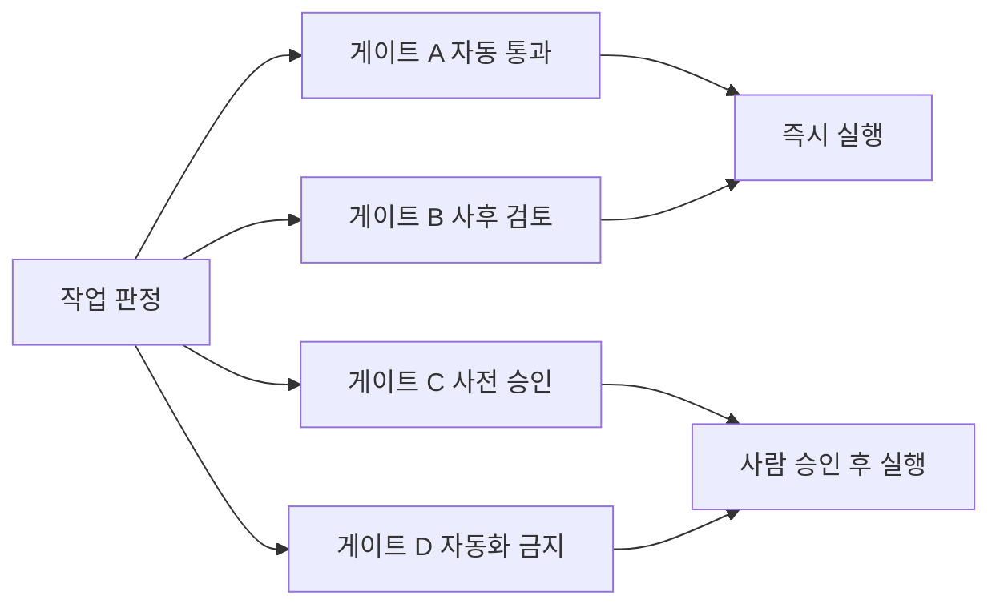

부서 하나를 자동화하는 일과, 일곱 부서를 한 벌로 설계하는 일은 다른 문제다. 부서마다 따로 만들면 계약이 제각각이 되고, 같은 실패를 부서마다 다시 겪고, "이건 사람이 봐야 하는가"의 기준선이 부서마다 다른 곳에 그어진다.

이 시리즈는 원 자료가 다룬 **일곱 개 부서 서른 개 에이전트 한 벌**을 자료로 세 편에 걸쳐 그 문제를 본다. 첫 편인 이 글은 골격이다 — 부서 이름을 지우고 남는 것, 즉 일곱 파이프라인이 공유하는 다섯 단계와 그 위에 얹히는 열 개의 설계 패턴이다. [2편](/blog/ai-transformation/department-automation-frontline/)은 마케팅·영업·고객지원·인사 네 부서의 각론을, [3편](/blog/ai-transformation/department-automation-backoffice/)은 재무·법무·경영지원 세 부서와 새 업무를 에이전트로 쪼개는 절차를 다룬다.

이 글에서 가장 오래 남는 관찰을 먼저 적어 둔다. **부서 이름을 지우면 일곱 개 파이프라인이 같은 다섯 단계로 겹친다.** 부서별 각론이 달라 보이는 것은 같은 칸에 다른 이름이 들어가 있기 때문이고, 새 업무를 만났을 때 채워야 할 칸은 언제나 그 다섯이다.

## 용어 정리

시리즈 세 편이 공유하는 어휘 서른네 개다 — 원 자료 용어표의 서른세 개에 이 글이 「품질 루프」를 더했다. 원 자료는 이 목록을 한 표에 두고 마지막 열로 어느 부서에서 쓰이는지를 가리켰는데, 세 편으로 나뉘면서 그 열이 가리키던 절 번호가 무효가 된다. 아래에서는 **이 글이 쓰는 행과 나머지를 갈라 싣고**, 앞쪽 표에만 이 글 기준의 쓰임을 적었다.

### 이 글이 쓰는 용어

| 용어 | 영문·원어 | 뜻 | 이 글에서의 쓰임 |
|---|---|---|---|
| **HITL** | Human-in-the-loop | 자동 파이프라인 중간에 사람 판단을 강제로 끼워 넣는 지점 | 개입 4등급 절 전체 |
| **HARD-GATE** | — | 코드 레벨에서 자동 통과를 막아 놓은 HITL. 예외를 던져 파이프라인을 중단 | 5단계 골격의 검수 칸. 실물은 인사부 3곳(2편)·법무부 3곳(3편) |
| **I/O 계약** | Input/Output Contract | 에이전트 간 주고받는 데이터의 파일명·타입·필수필드 약속 | 계약 4원칙 절. 이 글의 중심 개념 |
| **오케스트레이터** | Orchestrator | 여러 에이전트의 실행 순서·병렬 여부를 결정하는 상위 조정자 | 부서 간 호출 규약, 아키텍처 선택표의 중앙형 |
| **서브에이전트** | Subagent | 상위 세션이 격리된 컨텍스트로 호출하는 하위 에이전트 | 분해의 이득 절 |
| **컨텍스트 격리** | Context Isolation | 역할별로 문맥을 분리해 오염·혼동을 막는 설계 | 권한·격리 절, 분해의 이득 절 |
| **SoC** | Separation of Concerns | 관심사 분리. 역할별 책임을 나누는 소프트웨어 설계 원칙 | 분해의 이득 절이 이 원칙의 에이전트판이다 |
| **YAGNI** | You Aren't Gonna Need It | 지금 필요 없는 기능·권한은 넣지 않는다는 원칙 | 원 자료가 도구 최소권한에 붙인 이름 |
| **품질 루프** | — | 산출물 점수가 기준 미달이면 이전 단계를 재호출하는 복구 장치 | 파이프라인 복구 4종. **원 자료 용어표에 없고 이 글이 더한 한 행이다** |
| **폴백 체인** | Fallback Chain | 1차 수단 실패 시 2차·3차 수단으로 순차 대체하는 구조 | 파이프라인 복구 4종. 실물은 재무부 4단계(3편) |
| **지수 백오프** | Exponential Backoff | 재시도 간격을 1초→2초→4초로 늘려가는 실패 복구 방식 | 파이프라인 복구 4종 |
| **우아한 저하** | Graceful Degradation | 일부 실패 시 전체 중단 대신 가능한 범위로 축소 동작 | 파이프라인 복구 4종 |
| **멱등성** | Idempotency | 같은 작업을 여러 번 실행해도 결과가 한 번 실행과 같은 성질 | 부서별 요약표의 재무부 행. 각론은 3편 |
| **에스컬레이션** | Escalation | 하위 처리자가 감당할 수 없는 건을 상위 담당자·조직으로 올리는 절차 | 부서 지도의 고객지원부. 각론은 2편 |
| **ICP** | Ideal Customer Profile | 이상적 고객상. 리드 점수의 기준이 되는 정의 | 5단계 골격의 영업 칸(100점 척도). 원 자료는 인사부의 후보자 매칭에도 이 정의를 전용한다. 각론은 2편 |
| **BM25** | Best Matching 25 | 단어 빈도·문서 길이를 반영한 확률적 키워드 검색 랭킹 모델 | 5단계 골격의 인사 칸(후보자 서류 선별). 각론은 2편 |
| **OCR** | Optical Character Recognition | 이미지·PDF에서 문자를 추출하는 기술 | 폴백 체인의 3차 수단. 각론은 3편 |
| **NDA** | Non-Disclosure Agreement | 비밀유지계약 | 부서 지도의 법무부, 개입 4등급의 D 사례. 각론은 3편 |

### 원 자료 용어표의 나머지

아래 열여섯 개는 이 글의 본문에서는 쓰이지 않는다. 원 자료가 부서별 각론에 배정한 어휘이며, 여기에 색인으로 둔다.

| 용어 | 영문·원어 | 뜻 |
|---|---|---|
| 리드 스코어링 | Lead Scoring | 잠재고객을 정량 점수로 환산해 접촉 우선순위를 정하는 기법 |
| SPICED | Situation·Pain·Impact·Critical event·Decision | B2B 제안서 서사 프레임워크 |
| SLA | Service Level Agreement | 응답·해결까지 약속한 시간 한도 |
| NPS | Net Promoter Score | 추천의향(0~10) 기반 만족도 지표. 추천자% − 비추천자% |
| CSAT | Customer Satisfaction Score | 개별 응대 만족도(보통 1~5점) |
| 임베딩 | Embedding | 텍스트를 의미 벡터로 변환한 표현. 유사도 검색에 사용 |
| 코사인 유사도 | Cosine Similarity | 두 벡터의 방향 유사도(0~1). 임베딩 검색의 기본 척도 |
| DRY | Don't Repeat Yourself | 중복 제거 원칙. 하나의 정의를 여러 맥락에서 재사용 |
| RLS | Row Level Security | 행 단위 접근 제어. 정책이 없으면 기본 차단 |
| Z-score | 표준점수 | (값 − 평균) / 표준편차. 평균에서 얼마나 벗어났는지의 척도 |
| IQR | Interquartile Range | 사분위 범위. Z-score와 교차 검증해 이상치를 확정 |
| Hub-and-Spoke | — | 중앙 오케스트레이터가 모든 하위 에이전트를 조율하는 구조 |
| PII | Personally Identifiable Information | 개인 식별 정보 |
| PIPA | Personal Information Protection Act | 개인정보보호법 |
| DPA | Data Processing Agreement | 개인정보 처리위탁 계약 |
| KPI | Key Performance Indicator | 조직·업무의 핵심 성과 지표 |

## 7개 부서 30개 에이전트 지도

원 자료는 7개 부서를 각각 "N인 팀 → N개 에이전트"로 치환한다. 부서별 인원수가 곧 에이전트 수는 아니며, **하나의 결정 단위**가 하나의 에이전트가 된다.

```mermaid
flowchart TD
    ROOT["부서별 에이전트 자동화"]

    ROOT --> M["마케팅부 5인"]
    ROOT --> S["영업부 4인"]
    ROOT --> C["고객지원부 4인"]
    ROOT --> H["인사부 4인"]
    ROOT --> F["재무부 4인"]
    ROOT --> L["법무부 4인"]
    ROOT --> A["경영지원부 5인"]

    M --> M1["키워드 리서처"]
    M --> M2["콘텐츠 라이터"]
    M --> M3["에디터·검수자"]
    M --> M4["SNS 퍼블리셔"]
    M --> M5["디자인 크리에이터"]

    S --> S1["리드 리서처"]
    S --> S2["제안서 작성기"]
    S --> S3["견적서 생성기"]
    S --> S4["팔로업 이메일러"]

    C --> C1["문의 분류기"]
    C --> C2["FAQ 답변기"]
    C --> C3["에스컬레이션 판단기"]
    C --> C4["만족도 분석기"]

    H --> H1["채용공고 수집기"]
    H --> H2["지원자 스크리너"]
    H --> H3["온보딩 가이드"]
    H --> H4["근태·성과 관리기"]

    F --> F1["매출 수집기"]
    F --> F2["세금계산서 정리기"]
    F --> F3["비용 분류기"]
    F --> F4["재무 보고서 작성기"]

    L --> L1["계약서 검토기"]
    L --> L2["NDA 초안 생성기"]
    L --> L3["규정 준수 체커"]
    L --> L4["법률 리서처"]

    A --> A1["데이터 수집기"]
    A --> A2["분석가"]
    A --> A3["보고서 작성기"]
    A --> A4["시장조사 리서처"]
    A --> A5["경쟁사 분석가"]
```

### 총계가 30인 세 번째 표다

이 지도를 읽기 전에 짚어 둘 것이 있다. **이 블로그에 총계 30인 7부서 에이전트 표가 이미 두 번 실렸고, 위 지도는 그 둘과 같은 세트가 아니다.**

| 세트 | 어디에 있나 | 부서 편성 | 표기 |
|---|---|---|---|
| A | [잠재 경로는 개수의 제곱으로 는다](/blog/agentic-coding/scaling-routing-collapse/) | 마케팅 5 · 영업 5 · CS 4 · 재무 4 · 인사 4 · **기획** 4 · **개발** 4 | 한글 기능명 |
| B | [30개 에이전트 카탈로그](/blog/agentic-coding/thirty-agent-catalog/) | 영업 5 · 마케팅 5 · 고객지원 4 · 인사노무 4 · 재무회계 4 · **개발기술** 4 · **기획전략** 4 | 영문 에이전트 ID |
| C | **위 지도 — 이 시리즈가 다루는 세트** | 마케팅 5 · **영업 4** · 고객지원 4 · 인사 4 · 재무 4 · **법무** 4 · **경영지원** 5 | 한글 기능명 |

셋 다 합계가 30이고 부서 수도 일곱으로 같은데, 일곱 개의 이름과 배분이 서로 다르다. **C에만 법무부가 있고, C에는 개발 부서가 없다.** 배분도 갈린다 — A·B는 다섯 부서가 4이고 두 부서가 5인데 그 두 부서가 마케팅·영업인 반면, C에서 5를 받은 두 부서는 마케팅과 경영지원이고 영업은 4다.

A와 B가 서로 다른 세트라는 것은 [카탈로그 편의 「개수가 같다고 같은 세트는 아니다」 절](/blog/agentic-coding/thirty-agent-catalog/)이 이미 표기·열 구성·구성이 갈리는 자리 세 곳을 대 보아 밝혀 두었다. **이 글이 더하는 것은 셋째 판본이 있다는 사실 하나다** — 총계 30을 동일성의 증거로 읽으면 세 개의 서로 다른 조직도가 하나로 뭉개진다. 어느 편성이 옳은지는 이 글도 가리지 않는다. 확인되는 것은 세 표가 같은 조직도의 세 판본이 아니라는 사실까지다.

### 부서별 병목과 배울 설계 요소

각 부서가 자동화로 해결하려는 병목과, 그 부서 설계에서 가장 배울 점을 한 줄로 정리한다.

| 부서 | 자동화 대상 병목 | 이 부서에서 배울 설계 요소 |
|---|---|---|
| 마케팅부 | 키워드 조사 → 발행까지의 수작업 릴레이 | I/O 계약, 순차+병렬 하이브리드, 품질 점수 루프 |
| 영업부 | 리드 응답 지연과 팔로업 누락 | 엄격한 스키마 계약, 공유 DB 기반 느슨한 결합 |
| 고객지원부 | 문의 분류·1차 응답의 인력 소모 | 신뢰도 임계치로 자동/사람 분기, 동일 에이전트 재활용 |
| 인사부 | 후보자 서류 검토·온보딩 안내 반복 | HARD-GATE, 보호계급 배제, 급여 데이터 접근 통제 |
| 재무부 | 정산 CSV·세금계산서 수집·분류 | 멱등성, 폴백 체인, 이상 탐지, 읽기전용 역할 분리 |
| 법무부 | 계약서 검토·규정 점검 외주 비용 | 예외로 강제 중단하는 게이트, 라우팅 경계 정의 |
| 경영지원부 | 데이터 수집·분석·보고서 작성 | 서브에이전트 격리, 오케스트레이터 순차/병렬 조합 |

오른쪽 열이 이 시리즈의 목차 역할을 한다 — 2편이 위 네 행을, 3편이 아래 세 행을 각각 파이프라인 단위로 편다.

### 실습 환경의 공통 전제

일곱 개 부서 실습 폴더는 모두 **가상 회사 "감마컴"(50인 B2B IT 컨설팅)** 컨텍스트를 공유한다. 부서마다 폴더 하나, 폴더마다 `CLAUDE.md` 하나, `.claude/agents/` 아래 에이전트 정의 파일이 놓인다.

| 요소 | 내용 |
|---|---|
| 폴더 스코프 | 부서 폴더 내부 전용. 부서 이동은 세션 종료 후 해당 폴더에서 재실행 |
| 데이터 | `data/`(입력), `docs/`(템플릿), `reports/`(산출물) 3분할 |
| 에이전트 정의 | `.claude/agents/*.md` — 프론트매터(name·description·model·tools) + 역할·입출력·절차·원칙 |
| 모델 배분 | 단순 분류·변환은 경량 모델, 판단·작성은 상위 모델 |
| 부서 간 호출 | 기본 차단. 상위 오케스트레이터만 예외 |

마지막 행이 뒤에 나오는 권한·격리 설계의 전제다. 부서 간 직접 호출을 막아 두었기 때문에 부서를 넘는 업무는 반드시 오케스트레이터를 거친다.

## 부서 이름을 지우면 같은 5단계가 남는다

부서 이름을 지우고 보면 7개 파이프라인은 **같은 5단계**를 반복한다.

검수·게이트에서 갈라지는 두 화살표가 이 골격의 핵심이다. 기준 미달이면 생성 단계로 되돌아가고(품질 루프), 위험이 감지되면 사람으로 빠진다(HITL). 같은 골격이 부서마다 어떤 이름으로 나타나는지 대조하면, 새 업무를 만났을 때 어느 칸을 채워야 할지 바로 보인다.

| 단계 | 마케팅 | 영업 | 고객지원 | 인사 | 재무 | 법무 | 경영지원 |
|---|---|---|---|---|---|---|---|
| 입력 수집 | 시드 키워드 | 리드 리스트 | 문의 텍스트 | 채용공고·후보자 서류 | 정산 CSV·영수증 | 계약서 원문 | 원본 CSV·공시 |
| 분류·점수화 | 롱테일 선별 | ICP 100점 | 8카테고리×4긴급도 | BM25+LLM 점수 | 비용 코드·공제 판정 | RED/YELLOW/GREEN | 트렌드·이상치 |
| 생성·초안 | 블로그 초안 | 제안서·견적서 | FAQ 답변 초안 | 공고문·후보자 질문지 | 월간 P/L | NDA 초안 | 보고서 초안 |
| 검수·게이트 | 품질 점수 70 | 할인·조건 검토 | 신뢰도 0.85 | HARD-GATE 3곳 | 100만원 초과 검토 | HARD-GATE 3곳 | 근거 데이터 확인 |
| 발행·기록 | SNS·배너 배포 | 메일 발송·CRM | 발송·티켓 갱신 | 채널 게시 | 리포트 발송 | 사람이 서명·발송 | 임원 보고 |

서른다섯 칸에 빈 곳이 없다 — 일곱 부서가 다섯 단계를 모두 채운다. 부서 각론이 서로 달라 보이는 것은 같은 칸에 다른 이름이 들어가서다.

> **이 표와 이 글 전체에 나오는 임계값은 원 자료가 실습용으로 정한 값**이며 이 글이 측정하거나 검증한 값이 아니다. 품질 점수 70, 신뢰도 0.85, ICP 100점 척도, 100만원 검토선, 뒤에 나오는 월 50건·100건 규모선과 재시도 3회가 모두 여기에 해당한다. 원 자료 작성 기준일은 2026-07-26이다.

## I/O 계약 — 없으면 팀이 아니라 고립된 도구 N개

원 자료가 "파이프라인이 깨지는 가장 흔한 이유"로 든 항목이다. 계약이 없으면 N개 에이전트는 협업하는 팀이 아니라 **고립된 도구 N개**가 된다.

| # | 원칙 | 내용 | 위반 시 증상 |
|---|---|---|---|
| 1 | 파일 기반 통신 | 에이전트 간 데이터는 파일(또는 공유 DB 레코드)로 교환 | 내부 상태 직접 참조 → 한쪽 변경이 전체 붕괴 |
| 2 | 스키마 명시 | 정의 파일에 Input/Output 타입을 적어둔다 | 문자열/정수 혼동으로 인식 실패 |
| 3 | 계약 검증 | 다음 단계 실행 전 입력 파일 존재·필수필드를 확인 | 빈 입력으로 조용히 헛돈다 |
| 4 | 실패 처리 | 재호출 조건·최대 횟수·폴백 경로를 미리 정한다 | 무한 재시도 또는 무응답 정지 |

네 원칙의 오른쪽 열이 서로 다른 실패 모드를 가리킨다 — 1은 연쇄 붕괴, 2는 오인식, 3은 무해해 보이는 공회전, 4는 정지 또는 폭주다.

### 좋은 계약과 나쁜 계약

영업부 챕터가 제시한 대조표다. 표현만 다를 뿐 API 설계에서 말하는 스키마 규율과 같다.

| 항목 | 나쁜 계약 | 좋은 계약 |
|---|---|---|
| 타입 | `score: any` — 타입 미정 | `score: number (0-100)` — 범위까지 명시 |
| 필수 필드 | 없음. 식별자 누락 가능 | `required: [lead_id, total_score, tier]` |
| 버전 | 없음. 변경 시 전체 붕괴 | `contract_version: v2.1` — 시맨틱 버저닝 |
| 문서화 | 구두 합의 | 필드 주석 포함(예: Hot 등급 = 2시간 내 응답) |
| 결합 | 다른 에이전트 내부 상태 직접 수정 | 공유 DB 경유. 서로의 내부 로직을 모름 |

마지막 행이 앞 셋의 전제다 — 서로의 내부 로직을 모르는 상태여야 타입·필수필드·버전을 계약으로 강제할 이유가 생긴다는 것이 이 글의 정리다.

## 트리거는 셋뿐이다

에이전트를 "언제 깨울 것인가"의 선택지는 셋뿐이다. 원 자료의 권고는 **수동으로 시작해 안정화 후 전환**이다.

| 유형 | 발동 조건 | 구현 예 | 주의점 |
|---|---|---|---|
| 수동 | 사용자가 직접 명령 | 슬래시 커맨드 호출 | 사람 병목이 남지만 초기엔 가장 안전 |
| 이벤트 | 파일 생성·DB 상태 변화 감지 | 훅, DB 트리거 | 서로 다른 파일명을 써서 무한 루프 방지 |
| 스케줄 | 특정 시각 자동 실행 | cron, 배치 잡 | 실패 시 다음 주기까지 방치될 수 있음 |

주의점 열이 위에서 아래로 갈수록 무거워진다 — 수동의 대가는 지연이지만, 이벤트의 대가는 무한 루프이고 스케줄의 대가는 아무도 모르는 사이의 방치다.

## 도구 조합이 곧 역할의 정의다

마케팅 5인 예시의 도구 배분표다. **도구 조합이 곧 역할의 정의**라는 것이 요점이며, 과잉 부여는 보안 사고와 토큰 비용 양쪽에서 손해다. 원 자료는 이 원칙에 YAGNI라는 이름을 붙인다.

| 도구 | 리서처 | 라이터 | 에디터 | 퍼블리셔 | 디자이너 |
|---|---|---|---|---|---|
| 웹 검색 | 필수 | 필수 | 필수 | 미사용 | 미사용 |
| 읽기 | 필수 | 필수 | 필수 | 필수 | 필수 |
| 쓰기 | 필수 | 필수 | 필수 | 필수 | 필수 |
| 편집 | 미사용 | 미사용 | 필수 | 미사용 | 미사용 |
| 셸 실행 | 미사용 | 미사용 | 미사용 | 미사용 | 필수 |
| 외부 문서 조회 | 선택 | 선택 | 선택 | 미사용 | 미사용 |

읽기·쓰기 두 행만 다섯 역할 전부에서 필수이고, 나머지 네 행이 역할을 갈라 놓는다.

> 퍼블리셔가 웹 검색을 갖지 않는 이유가 설계의 핵심이다.
>
> 앞 단계의 에디터가 이미 팩트 체크를 끝냈으므로, 퍼블리셔의 일은 **형식 변환**뿐이다.
>
> 역할 경계가 명확하면 필요한 도구도 자동으로 좁혀진다.

### 권한·격리의 실행 형태

실습 폴더의 권한 설정은 "허용 목록 + 거부 목록"으로 되어 있다. 조직에 도입할 때 그대로 옮겨 쓸 수 있는 최소 골격이다.

| 구분 | 설정 예 | 의도 |
|---|---|---|
| 허용 | 입력 데이터·문서·리포트 폴더 읽기, 리포트 폴더 쓰기 | 업무 수행에 필요한 최소 범위 |
| 거부 | 상위 디렉터리 읽기·쓰기, 디렉터리 이탈 | 부서 간 데이터 혼입 차단 |
| 거부 | 환경변수 파일 읽기 | 자격증명 유출 차단 |
| 거부 | 삭제 명령, 임의 네트워크 호출 | 파괴적·외부 전송 행위 원천 차단 |

거부 세 행이 각각 다른 것을 막는다 — 첫째는 컨텍스트 격리, 둘째는 자격증명, 셋째는 원 자료의 표현대로 파괴적·외부 전송 행위다. 앞의 도구 매트릭스가 "무엇을 쥐여줄 것인가"라면 이 표는 "쥔 도구로 어디까지 닿게 할 것인가"다.

## 사람 개입(HITL) 4등급

부서를 관통하는 개입 강도는 네 단계로 나뉜다. 어디까지 자동화하고 어디서 멈출지를 정하는 기준선이 이 구분이다. 원 자료가 이 절에 붙인 제목은 「HITL 3등급」이지만 실린 등급은 A~D 넷이고 원 자료의 요약 절도 「4등급을 나눈다」로 적는다 — 이 글은 표를 따라 4등급으로 적었다.

| 등급 | 기준 | 실패 시 손실 | 부서 사례 |
|---|---|---|---|
| A 자동 통과 | 되돌릴 수 있고 대외 영향 없음 | 재실행으로 회복 | 데이터 정규화, 문의 분류, 비용 코드 태깅 |
| B 사후 검토 | 대외로 나가지만 정정 가능 | 정정 공지로 수습 | FAQ 자동 답변(신뢰도 상위), SNS 포맷 변환 |
| C 사전 승인 | 금전·계약·평판이 걸림 | 금전 손실·신뢰 훼손 | 견적 할인, 제안서 발송, 세무 판단, 임원 보고 |
| D 자동화 금지 | 법적 책임·인사 처분·개인 권리 | 소송·과태료·형사 책임 | 최종 합격, 연봉 확정, 징계, 계약 서명, NDA 발송 |

두 번째 열의 기준이 A→D로 갈수록 "되돌릴 수 있는가"에서 "책임이 누구에게 남는가"로 옮겨간다. A와 B의 경계는 대외 노출 여부다.

**이 네 등급은 강도의 눈금일 뿐, 어떤 업무를 어느 눈금에 놓을지는 별도의 판정이 필요하다.** 그 판정을 여섯 개 축으로 세운 표가 [3편](/blog/ai-transformation/department-automation-backoffice/)에 있다 — 새 업무를 후보로 올려 A~D 중 하나에 배치하는 절차가 거기서 이어진다.

## 파이프라인 복구 4종

7개 부서에서 반복 등장한 복구 장치다.

| 패턴 | 동작 | 등장 부서 |
|---|---|---|
| 품질 루프 | 점수가 기준 미달이면 이전 단계 재호출, 최대 횟수 제한 | 마케팅(점수 70 미만, 3회) |
| 폴백 체인 | 1차 수단 실패 시 2·3·4차 수단으로 대체, 경로를 기록 | 재무(공식 API → 메일 파싱 → OCR → 수동) |
| 지수 백오프 | 실패 간격을 1초→2초→4초로 늘려 재시도 | 재무, 인사(외부 API 호출) |
| 우아한 저하 | 일부 실패 시 가능한 범위만 산출하고 누락을 명시 | 경영지원(수집 실패 시 캐시 사용) |

네 항목이 모두 **파이프라인 단계 사이의 복구 장치**다. 앞 단계로 되돌리거나(품질 루프), 다른 수단으로 갈아타거나(폴백 체인), 간격을 벌려 다시 걸거나(지수 백오프), 범위를 줄여 내보낸다(우아한 저하). 대화 이력이 길어져 품질이 떨어지는 문제나 도구 출력이 잡음이 되어 모델이 헤매는 문제는 이 표에 없다 — 원 자료 전문에서 「compaction」·「압축」·「도구 출력」·「대화 이력」·「Context」를 훑으면 컨텍스트 관리 맥락의 히트가 0이다(「압축」 2건은 온보딩 문서와 판단 규칙을 줄인다는 뜻이고, 「Context」 1건은 용어표의 「컨텍스트 격리」 행이다). **원 자료가 붙인 제목은 「실패 처리 패턴 4종」이고, 그 범위를 파이프라인 복구로 좁혀 읽는 것은 이 글의 정리다.**

루프 자체가 무너지는 방식은 [열 가지로 따로 정리돼 있다](/blog/ai-agent/loop-antipatterns-and-checklist/). 위 네 항목과 겹치는 자리는 재시도 축 — 그쪽 글의 「상태 없는 재시도」·「제한된 재시도」가 이 표의 품질 루프와 지수 백오프에 걸린다 — 이고, 컨텍스트·관찰·캐시 축은 그쪽에만 있다. 마지막 행의 "캐시"가 데이터 캐시를 가리킨다는 점도 함께 읽어 두는 편이 좋다 — 그쪽 글의 캐시는 프롬프트 접두사 캐시이고, 같은 단어가 다른 것을 가리킨다.

## 규모에 맞는 구조부터 고른다

재무부 챕터가 제시한 선택표다. 처음부터 복잡한 구조를 만들지 말라는 경고가 붙어 있다.

| 패턴 | 구조 | 구현 복잡도 | 실패 격리 | 권장 규모 |
|---|---|---|---|---|
| 단일형 | 하나의 에이전트가 전 과정 처리 | 최저 | 불가 | 월 50건 이하 |
| 순차형 | A→B→C→D 파이프라인 | 낮음 | 보통 | 월 50~100건 |
| 중앙형 | 오케스트레이터가 병렬 조율 | 높음 | 우수 | 월 100건 이상 |

구현 복잡도와 실패 격리가 같은 방향으로 움직인다 — 격리를 얻으려면 복잡도를 지불해야 하고, 그 지불이 정당해지는 지점을 건수로 표시한 것이 마지막 열이다.

> 원 자료의 권고는 명확하다. **처음부터 완벽한 4인조를 만들지 말 것.**
>
> 단일형으로 먼저 돌아가게 하고, 병목이 드러난 지점부터 쪼갠다.
>
> 규모에 맞지 않는 분업은 토큰 비용과 디버깅 난도만 올린다.

## 왜 쪼개는가 — 분해의 다섯 가지 이득

경영지원부 챕터가 정리한 격리의 이점이다. 소프트웨어의 관심사 분리(SoC) 원칙을 에이전트에 옮긴 것이다.

| 이득 | 설명 |
|---|---|
| 컨텍스트 순도 | 수집 담당은 수집만 본다. 문맥 오염으로 인한 실수가 줄어든다 |
| 병렬 실행 | 의존성 없는 작업을 동시에 돌려 소요 시간을 줄인다 |
| 재사용성 | 보고서 작성기처럼 도메인 중립적인 에이전트는 다른 업무에도 쓴다 |
| 디버깅 용이 | 단계가 분리돼 있어 오류 발생 지점을 즉시 특정한다 |
| 확장성 | 새 역할을 추가해도 기존 에이전트를 고치지 않는다 |

첫 행의 컨텍스트 순도가 서브에이전트 컨텍스트 격리의 직접적 효과다. 다만 앞 절의 선택표가 말하듯 이 다섯 가지 이득이 언제나 분업 비용보다 큰 것은 아니다.

## 다음 편으로

이 글은 골격이었다. 부서 이름을 지우면 남는 다섯 단계(5×7 대조표), 그 위에 얹히는 계약·트리거·권한·게이트·복구·구조 선택·분해 원리, 그리고 이 블로그에 실린 총계 30인 세 표가 같은 세트가 아니라는 사실까지다.

골격만 놓고 보면 알 수 없는 것이 두 가지 있다. 하나는 **다섯 단계 중 어느 칸이 부서마다 가장 무거운가**이고, 다른 하나는 **네 등급 중 어느 등급이 실제로 코드에서 강제되는가**다. 둘 다 부서 각론을 열어야 나온다.

[2편](/blog/ai-transformation/department-automation-frontline/)은 마케팅·영업·고객지원·인사 네 부서로 들어간다 — 순차와 병렬을 어디서 가르는지, 리드 점수를 100점으로 어떻게 나누는지, 자동 응답과 사람 이관을 가르는 신뢰도 임계치가 어디에 그어지는지, 그리고 인사부가 왜 "무엇을 자동화할까"가 아니라 "무엇을 자동화하지 않을까"부터 정하는지까지다.
