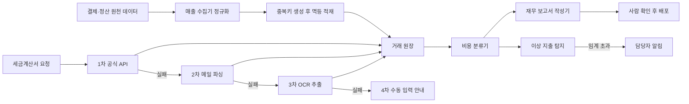
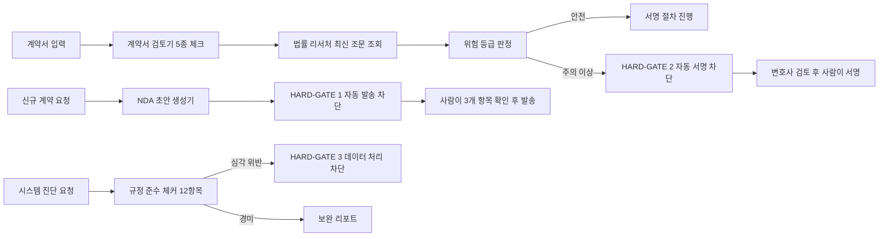
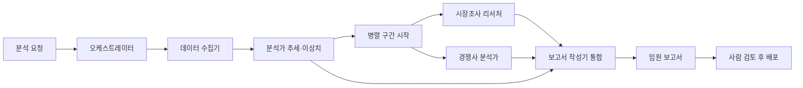
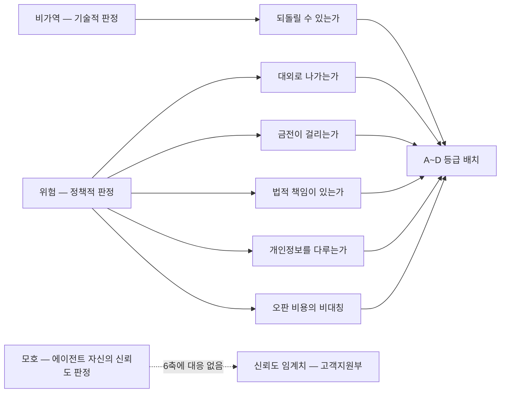

[첫 편](/blog/ai-transformation/department-agent-blueprint/)이 부서를 에이전트로 옮길 때 공유되는 설계 골격을 세웠고, [두 번째 편](/blog/ai-transformation/department-automation-frontline/)이 그 골격을 마케팅·영업·고객지원·인사에 적용했다. 이 글은 남은 세 부서 — 재무·법무·경영지원 — 을 보고, 마지막에 **부서 사례를 지우고 절차만 남긴 체크리스트**로 닫는다.

앞 네 부서와 이 세 부서는 설계 주제가 다르다. 고객을 향하는 부서에서는 "얼마나 잘 판단하는가"가 문제였다면, 백오피스에서는 **"두 번 실행돼도 안전한가", "위험할 때 확실히 멈추는가", "여러 결과를 어떤 순서로 조립하는가"** 가 문제다. 정확도가 덜 중요해서가 아니라, 정확도만으로는 이 셋이 해결되지 않기 때문이다.

용어와 약어는 [첫 편의 용어 정리](/blog/ai-transformation/department-agent-blueprint/)에 한 벌로 모아 두었다. 이 글에 처음 나오는 용어는 `content_hash`·`Runway` 둘뿐이므로 표를 다시 싣지 않는다.

> 이 글이 옮긴 원 자료의 작성 기준일은 **2026-07-26**이다. 에이전트 구성·모델 등급·임계값은 그 시점의 것이며 조직과 스택에 따라 달라진다.
>
> 아래의 예제 에이전트 구성(재무 3종·경영지원 4종)과 정량 기준(이상 탐지 표준점수 `2`·`3`, 과거 데이터 `3개월`, 예산 초과율 `20%`, 규정 준수 `12`항목과 `4`단계 신호)은 **원 자료가 제시한 예제이자 기준선**이며 이 글이 측정하거나 특정 조직에서 관측한 값이 아니다.

## 재무부 — 두 번 실행해도 안전한 파이프라인

재무는 실수가 곧 세무 리스크로 이어진다. 그래서 이 부서의 설계 주제는 정확도보다 **재실행 안전성(멱등성 — 같은 작업을 여러 번 실행해도 결과가 한 번 실행한 것과 같은 성질)과 실패 복구**다.

### 에이전트 명세

| 에이전트 | 입력 | 출력 | 연동(도구·MCP) | 사람 개입 지점 |
|---|---|---|---|---|
| 매출 수집기 | 결제사·플랫폼 정산 데이터 | 정규화된 거래 레코드 | 결제 API, 파일 파싱, DB 적재 | 신규 채널 추가 시 매핑 규칙 확인 |
| 세금계산서 정리기 | 전자세금계산서 식별자, 메일함, PDF | 매입·매출 구분된 세금계산서 레코드 | 공공 API, 메일 파싱, OCR | 4단계 폴백 모두 실패 시 수동 입력 |
| 비용 분류기 | 거래 내역, 영수증 | 비용 코드, 공제 가능 여부, 이상 플래그 | 읽기·쓰기, DB 조회 | 고액 건·판단 불명확 건은 사람(세무) 검토 |
| 재무 보고서 작성기 | 거래·비용 레코드 | 월간 손익, 현금흐름, 신고 자료 | 읽기·쓰기, 문서 변환, 알림 발송 | 대외 보고 전 최종 확인 |

넷 중 셋이 「사람 개입 지점」에 **판단이 막히는 조건**을 적어 두었다는 점이 눈에 띈다 — 신규 채널, 폴백 전부 실패, 고액·불명확. 사람을 부르는 시점이 일정이 아니라 상태로 정의돼 있다.

### 파이프라인

### 멱등성 설계

| 요소 | 방식 |
|---|---|
| 중복키 | 거래처·날짜·금액·통화를 이어붙여 해시(`content_hash`) 생성 |
| 적재 | 중복키 충돌 시 아무것도 하지 않음 |
| 검증 | 같은 데이터를 두 번 적재해도 레코드가 1건인지 테스트 |
| 부수 효과 | 공급가액·세액을 총액에서 역산해 함께 저장 |

> 재무 에이전트에서 가장 중요한 성질은 정확도가 아니라 멱등성이다.
>
> 배치가 중복 실행되거나 사용자가 실수로 다시 돌려도 장부가 어긋나지 않아야 한다.
>
> 이 성질이 없으면 자동화는 오히려 수작업보다 위험해진다.

네 행 중 「검증」 행만 성질이 다르다. 앞의 셋은 어떻게 만드는가이고, 검증 행은 **그 성질이 실제로 성립하는지 확인하는 테스트**를 요구한다. 멱등성은 설계로 선언하는 것이 아니라 두 번 넣어 보고 1건인지 세어야 확인되는 성질이라는 뜻이고, 네 행을 이렇게 3 : 1로 가르는 것은 이 글의 정리다.

### 폴백 체인과 재시도

| 단계 | 수단 | 특징 |
|---|---|---|
| 1차 | 공식 전자세금계산서 API | 정확도 최고, 실패율 존재 |
| 2차 | 발송 메일 본문·첨부 파싱 | 형식 변화에 취약 |
| 3차 | PDF 이미지 OCR 추출 | 비용 발생, 오인식 가능 |
| 4차 | 수동 입력 안내 | 자동화 포기 지점을 명시 |

각 단계는 지수 백오프로 재시도하고, 최종 레코드에는 **어느 경로로 수집됐는지 출처 필드**를 남긴다. 사후 감사와 품질 분석의 근거가 된다.

체인의 마지막 칸이 「수동 입력 안내」라는 점이 이 표의 요점이다. 폴백 체인은 보통 자동화 성공률을 올리는 장치로 읽히지만, 여기서 4차는 성공 경로가 아니라 **자동화를 포기하는 지점을 문서에 못 박은 칸**이다. 그리고 출처 필드가 있어야 4차가 얼마나 자주 밟혔는지 나중에 셀 수 있다.

### 비용 분류와 이상 탐지

| 판정 | 규칙 |
|---|---|
| 비용 코드 | 거래처·품목 키워드를 계정과목에 매핑. 불명확하면 기타로 두고 검토 표기 |
| 공제 가능 여부 | 비공제 키워드 목록에 걸리면 공제 불가로 판정 |
| 고액 예외 | 일정 금액을 넘으면 자동 판정 대신 사람(세무) 검토로 에스컬레이션 |
| 이상 탐지 | 카테고리별 과거 데이터로 표준점수 계산. 2 초과 주의, 3 초과 고위험 |
| 계좌 배분 | 비용 유형에 따라 목적별 계좌로 자동 배분 |

이상 탐지는 카테고리마다 독립 기준선을 쓴다. 광고비와 인건비를 한 분포에 넣으면 의미 있는 경고가 나오지 않기 때문이다. 과거 데이터가 3개월 미만이면 판정을 보류한다.

첫 행의 「불명확하면 기타로 두고 검토 표기」와 마지막 문장의 「3개월 미만이면 판정을 보류한다」는 같은 장치다. **에이전트가 판정을 내리지 않고 빠져나가는 출구**이고, 이 출구가 [고객지원부 편](/blog/ai-transformation/department-automation-frontline/)의 신뢰도 임계치와 같은 계열의 설계다. 이 글 마지막 절에서 그 계열이 왜 따로 필요한지를 다시 본다.

### 읽기와 쓰기를 다른 에이전트로 가른다

| 역할 | 권한 | 이유 |
|---|---|---|
| 세법 판단 담당 | 읽기 전용 | 판단 오류가 금전 피해로 직결. 쓰기 권한을 주지 않는다 |
| 기록 담당 | 쓰기 | 데이터 삽입은 이 역할만 수행 |

읽기와 쓰기를 다른 에이전트로 나누는 것은 [첫 편](/blog/ai-transformation/department-agent-blueprint/)이 정리한 도구 최소권한 원칙의 구체적 실행이다. 조직으로 치면 승인 권한과 집행 권한을 분리하는 것과 같다.

권한을 좁히는 것과 되돌릴 수 있게 만드는 것이 같은 문제의 두 면이라는 논의는 이 사이트의 [되돌릴 수 있어야 권한을 넓힌다](/blog/agentic-coding/reversibility-before-permission/) 편이 따로 다뤘다.

### 예제 환경 버전

| 예제 에이전트 | 모델 급 | 역할 |
|---|---|---|
| `expense-classifier` | 경량 | 영수증 데이터 → 7대 비용 코드 분류 |
| `budget-analyst` | 상위 | 예산 대비 실적 차이 분석 + 초과 부서 감지 |
| `tax-helper` | 상위 | 세무 일정 점검 + 부가세 추정(가이드만) |

세무 보조 에이전트 정의에는 안전장치가 세 줄 들어 있다. **실제 신고 대행 불가, 금액은 반드시 추정치로 표기, 세무 결정은 담당 세무사 확인 안내 포함.** 자동화 범위를 정의 파일 안에서 스스로 제한하는 사례다.

예제 입력은 부서별 예산·실적 CSV(부서·분기예산·분기실적·비고)로, 예산 초과율 20% 이상을 이상으로 태깅한다.

세 종 중 `budget-analyst`는 **이 사이트의 다른 글에 이미 실린 이름**이다. [30개 에이전트 카탈로그](/blog/agentic-coding/thirty-agent-catalog/)의 재무 부서에 같은 이름이 있고, 부서(재무)·역할의 뼈대(예산 대비 실적 비교 + 이상 지출 감지)가 여기와 어긋나지 않는다. 다만 그쪽 정의는 현금흐름 예측과 Runway 계산까지 포함해 더 넓고, 이 표의 정의는 「초과 부서 감지」로 더 좁다. **같은 이름이되 범위가 다른 두 정의라는 것을 확인해 두는 것은 이 글의 정리다.** 나머지 둘(`expense-classifier`·`tax-helper`)은 그 카탈로그에 없는 이름이다 — 재무 부서의 `expense-processor`가 이름과 역할(영수증 처리·계정 분류) 양쪽에서 가장 가깝지만 같은 ID가 아니다.

## 법무부 — 예외를 던져 파이프라인을 멈춘다

법무는 "AI는 검토자, 사람은 결정자"라는 문장을 코드로 강제한 부서다. 게이트가 조건문 경고가 아니라 **예외 발생**으로 구현된 점이 핵심이다. 경고는 로그에 남고 흐름은 계속되지만, 예외는 흐름 자체를 끊는다.

### 에이전트 명세

| 에이전트 | 입력 | 출력 | 연동(도구·MCP) | 사람 개입 지점 |
|---|---|---|---|---|
| 계약서 검토기 | 계약서 원문, 계약 유형, 당사자 지위, 중점 검토 항목 | 5종 체크 결과 + 3단계 위험 요약 + 수정 권고 | 읽기·쓰기, 법령 조회 위임 | HARD-GATE 2 — 서명 직전 차단 |
| NDA 초안 생성기 | 계약 방향, 당사자, 기밀 범위, 기간, 준거법 | 초안 문서 | 읽기·쓰기, 템플릿 렌더 | HARD-GATE 1 — 자동 발송 차단 |
| 규정 준수 체커 | 진단 범위, 시스템·문서·스키마 | 12항목 신호 표 + 보완 가이드 | 읽기·검색·웹 조회 | HARD-GATE 3 — 심각 위반 시 처리 차단 |
| 법률 리서처 | 법령명·판례 키워드 | 법령·판례 목록과 요지 | 공공 법령 API | 결과 해석·적용 판단은 사람·변호사 |

네 에이전트 중 셋에 HARD-GATE가 하나씩 붙고, 게이트가 없는 하나(법률 리서처)는 출력이 **조회 결과**뿐이다. 판단을 내리지 않는 역할에는 게이트가 필요 없다는 배치이고, 이렇게 3 : 1로 읽는 것은 이 글의 정리다.

### 파이프라인

### 라우팅 경계 — 어떤 요청이 어디로 가는가

경계를 문서로 못 박아두면 오호출이 줄어든다. 정의 폴더는 트리거 키워드를 표로 관리한다.

| 담당 | 트리거 키워드 | 연결된 게이트 |
|---|---|---|
| 계약서 검토기 | 계약서 검토, 리스크 분석, 독소조항, 위약금, 저작권, 관할, 해지권 | 2 |
| NDA 초안 생성기 | NDA 작성, 계약서 초안, 용역계약, 파트너십 계약 | 1 |
| 규정 준수 체커 | 개인정보보호법, 전자상거래법, 약관 검증, 컴플라이언스, 국외 이전 | 3 |
| 법률 리서처 | 법령 조회, 판례 검색, 입법예고, 행정규칙 | — |

경계에는 "이건 내 일이 아니다"도 함께 적는다. 약관 텍스트 수정은 계약 담당으로, 노무 관련은 노무 담당으로, 보안 취약점 코드 분석은 보안 담당으로 넘긴다.

### 계약 검토 5종 체크

| # | 항목 | 확인 내용 |
|---|---|---|
| 1 | 독소 조항 | 일방적 해지권, 무한 손해배상, 자동 갱신 트랩, 경쟁금지 범위 |
| 2 | 위약금 | 손해배상 상한·하한, 불가항력 면책 여부 |
| 3 | 저작권·지식재산 | 작업물 귀속 주체, 라이선스 범위, 2차 저작물 처리 |
| 4 | 관할·준거법 | 국내외 준거법, 중재와 소송 중 무엇인지, 분쟁 절차 |
| 5 | 해지권·기간 | 통보 기간, 귀책 없는 해지, 갱신 조건 |

판정은 3색 신호(안전·주의·위험)로 나오고, 당사자 지위를 입력하면 그 지위에서 불리한 조항을 우선 탐지한다.

### HARD-GATE 3개의 공통 형식

게이트 예외는 세 요소를 반드시 포함한다. 이 형식이 있어야 게이트가 "막는 장치"에서 "진행시키는 절차"가 된다.

| 요소 | 뜻 | 예 |
|---|---|---|
| 발동 조건 | 무엇이 감지됐는가 | 자동 발송 시도 감지 / 위험 항목 감지 / 심각 위반 감지 |
| 상세 안내 | 사람이 무엇을 확인해야 하는가 | 수신자 정보, 기밀 범위, 서명 방식 |
| 재개 조건 | 무엇을 하면 다시 진행되는가 | 사용자 명시 확인 입력, 변호사 검토 완료, 보완 후 재진단 |

| 게이트(법무부 국소 번호) | 트리거 | 차단 대상 | 재개 |
|---|---|---|---|
| 1 | 초안 생성 완료 직후 | 자동 발송 | 사람이 3개 항목 확인 |
| 2 | 검토 결과가 주의 등급 이상 | 자동 서명 절차 | 변호사 검토 후 명시적 승인 입력 |
| 3 | 심각 등급 위반 1건 이상 | 개인정보 처리 API·DB 조회·외부 전송 전체 | 보완 완료 후 재진단 요청 |

두 표를 겹쳐 보면 세 게이트가 전부 「재개」 칸을 채우고 있다. 재개 조건이 없는 게이트는 차단이 아니라 고장이고, 그것이 위 표에서 「재개 조건」이 형식의 세 요소 중 하나로 못 박힌 이유다.

### 규정 준수 12항목 자가진단

| 구분 | 항목 |
|---|---|
| 개인정보 | 처리방침 최신화, 동의 분리, 보호책임자 지정, 데이터 이동권, 자동화 결정 거부권, 국외 이전, 암호화, 유출 통지 절차 |
| 전자상거래 | 청약철회, 표시·광고, 약관 표시, 결제대금 보호 |

신호는 4단계(통과·주의·미준수·심각)로 나오며, 심각 등급이 하나라도 나오면 게이트 3이 발동한다. AI가 만든 판정이 곧 법적 판단이 아니라는 면책 문구가 정의 파일과 프로젝트 문서 양쪽에 들어 있다.

12항목은 개인정보 8 + 전자상거래 4로 갈린다. 열둘 중 여덟이 개인정보 쪽에 몰려 있고, 그중 「자동화 결정 거부권」은 에이전트를 도입하는 순간 새로 생기는 항목이다. **자동화가 자기 자신을 진단 항목으로 만드는 유일한 행**이라는 점을 짚어 두는 것은 이 글의 정리다.

### 원 자료가 든 비용 비교

| 항목 | 전통 외주 | 에이전트 활용 |
|---|---|---|
| 상시 자문 | 월 정액 리테이너 | 도구 구독 비용 수준 |
| 계약서 검토 | 건당 수십만 원 | 건당 소액 |
| 규정 진단 | 연 단위 프로젝트 비용 | 상시 자동 스캔 |
| 법령 조사 | 건당 수 시간 | 수십 초(API 조회) |

> **이 표의 비교값은 원 자료가 대비용으로 제시한 예시**이며 이 글이 측정한 값이 아니다. 조직 규모·계약 건수에 따라 전혀 달라지므로 그대로 인용하지 않는다. 원 자료 작성 기준일은 2026-07-26이다. 같은 성격의 정량 예시가 [영업부 절](/blog/ai-transformation/department-automation-frontline/)에도 한 벌 더 있다.

표를 한 행씩 읽으면 성격이 갈린다. 앞 세 행은 양쪽을 견줄 수치가 없는 정성 비교(리테이너 대 구독료, 「건당 수십만 원」 대 「건당 소액」, 프로젝트 비용 대 상시 스캔)이고, **양쪽에 수치를 다 적어 자릿수 주장을 하는 것은 마지막 행 하나**다 — 수 시간 대 수십 초. 인용할 때 위험한 자리도 그 한 행뿐이고, 네 행을 이렇게 3 : 1로 가르는 것은 이 글의 정리다.

## 경영지원부 — 수집·분석·보고의 조립 라인

경영지원 5인은 데이터 파이프라인 그 자체다. 이 부서의 교훈은 **왜 하나의 에이전트에 다 시키면 안 되는가**에 대한 답이다.

### 에이전트 명세

| 에이전트 | 입력 | 출력 | 연동(도구·MCP) | 사람 개입 지점 |
|---|---|---|---|---|
| 데이터 수집기 | 원본 CSV·JSON, 공공 통계·공시 API | 정규화된 표준 JSON | 읽기·쓰기·파일 탐색, 통계·공시 API | 수집 대상·기간 지정 |
| 분석가 | 정규화 데이터 | 추세, 이상치, 핵심 지표 | 읽기·쓰기 | 이상치 판정 결과의 사업적 해석 |
| 보고서 작성기 | 분석·시장·경쟁 결과 | 임원 보고서 1장 | 읽기·쓰기, 웹 검색 | 대외·임원 보고 전 최종 확인 |
| 시장조사 리서처 | 조사 주제 | 시장 동향 정성 요약 | 웹 검색, 보고서 조회 | 출처 신뢰도 판단 |
| 경쟁사 분석가 | 비교 대상 목록 | 가격·기능·포지션 비교표 | 웹 검색, 공시 조회 | 전략적 시사점 도출 |

데이터 수집기(수집 대상·기간 지정)를 뺀 네 행의 「사람 개입 지점」이 사람의 **해석**을 남겨 둔다 — 사업적 해석, 최종 확인, 출처 신뢰도, 전략적 시사점. 수집과 계산은 넘기고 의미 부여는 남긴 배치다.

### 파이프라인

### 순차와 병렬의 판단 규칙

| 구간 | 실행 | 근거 |
|---|---|---|
| 수집 → 분석 | 순차 | 분석은 수집 결과에 의존 |
| 시장조사 ∥ 경쟁분석 | 병렬 | 서로 독립. 입력이 겹치지 않음 |
| 통합 보고 | 순차 | 앞 세 결과가 모두 필요 |

> 판단 규칙은 한 문장으로 압축된다.
>
> **의존성이 있으면 순차, 독립적이면 병렬.**
>
> 여기에 하나를 더한다. 에이전트끼리 직접 통신하지 않고 모든 데이터는 오케스트레이터를 경유한다.

두 번째 규칙이 첫 번째보다 강한 제약이다. 의존성 판단은 구간마다 다르게 내려지지만, 오케스트레이터 경유는 **모든 구간에 예외 없이 걸린다**. 병렬 구간의 둘이 서로 결과를 주고받기 시작하면 「독립」이라는 전제가 그 자리에서 깨지기 때문이다. 이 구조를 [첫 편](/blog/ai-transformation/department-agent-blueprint/)이 아키텍처 패턴으로 정리했다.

### 출력 스키마 표준화

모든 에이전트가 같은 형태로 결과를 돌려주면, 보고서 작성기는 어떤 에이전트의 결과든 동일하게 처리할 수 있다.

| 필드 | 뜻 |
|---|---|
| 에이전트명 | 어느 역할이 만든 결과인가 |
| 상태 | 성공·부분성공·실패 |
| 데이터 | 실제 산출물 |
| 시각 | 생성 시점 |

네 필드 중 실제 산출물은 「데이터」 하나뿐이고 나머지 셋은 **출처·성패·시점**을 적는 자리다. 통합하는 쪽이 결과를 믿어도 되는지 판단하려면 산출물만으로는 부족하다는 뜻이다. 「상태」에 `부분성공`이 있는 것이 다음 절과 이어진다.

### 우아한 성능 저하

| 상황 | 동작 |
|---|---|
| 수집 실패 | 캐시 데이터 사용. 캐시도 없으면 결측을 명시하고 계속 |
| 데이터 불완전 | 가능한 부분만 분석하고 누락 항목을 표기 |
| 일시 오류 | 제한 횟수 재시도 후 실패 처리 |

원칙은 "하나 실패해도 전체가 멈추지 않는다"이며, 원 자료는 여기에 한 줄을 덧붙인다. **불완전한 보고서라도 없는 것보다 낫다** — 다만 무엇이 빠졌는지 반드시 명시한다는 조건이 붙는다.

세 행 중 부분 산출을 허용하는 앞의 둘이 「명시」·「표기」를 조건으로 달고 있다는 점에 주의할 만하다. 부분 산출을 허용하는 설계는 **무엇이 빠졌는지 기록하는 장치와 한 벌일 때만 안전하다.** 기록 없이 부분 산출만 허용하면 불완전한 보고서와 완전한 보고서가 구분되지 않는다.

### 보고서 품질 기준

| 원칙 | 내용 |
|---|---|
| 결론 우선 | 첫 줄에 결론. 임원은 첫 줄만 읽는다는 전제 |
| 근거 3단 | 핵심 인사이트 → 근거 3개 → 상세 데이터 |
| 차트 단순화 | 장식을 덜어내고 메시지 하나에 집중 |
| 행동 권고 | 권고 없는 문서는 보고서가 아니라 분석에 그친다 |

### 예제 환경 버전

| 예제 에이전트 | 모델 급 | 역할 |
|---|---|---|
| `data-collector` | 경량 | 원본 CSV·JSON → 정규화 JSON. 외부 API 호출 금지 |
| `report-writer` | 상위 | 데이터 종합 → 주간·월간 보고서 |
| `comm-helper` | 경량 | 공지·메일·메신저 톤 3종 초안 |
| `schedule-manager` | 상위 | 캘린더 충돌 검출 + 우선순위 정렬 |

수집기 정의의 제약이 인상적이다. **원본 파일 수정 금지(읽기만), 외부 API 호출 금지.** 정규화 규칙도 명시돼 있다 — 헤더를 키로 변환, 빈 값은 널, 날짜는 표준 형식, 금액은 쉼표 제거 후 숫자형.

예제 데이터는 주간 매출 CSV(날짜·요일·매출·거래건수·주요고객·비고)와 일정 CSV이며, 보고서는 텍스트 막대그래프로 매출 추이를 표현한다.

네 이름은 모두 [30개 에이전트 카탈로그](/blog/agentic-coding/thirty-agent-catalog/)에 없다. 이름이 비슷해 보이는 자리는 있다 — 그쪽 재무 부서의 `financial-reporter`와 여기 경영지원의 `report-writer`는 **다른 부서의 다른 이름**이므로 같은 에이전트로 읽으면 안 된다.

## 업무 분해 체크리스트 — 새 업무를 에이전트로 쪼갤 때

일곱 부서 설계에서 반복된 판단을 하나의 절차로 정리한다. 순서대로 답을 채우면 분해가 끝난다.

이 절과 [첫 편의 공통 설계 패턴](/blog/ai-transformation/department-agent-blueprint/)은 층위가 다르다. 첫 편이 다루는 것은 **설계 골격** — 에이전트 하나를 어떤 계약·권한·게이트로 짜는가이고, 이 절이 다루는 것은 **분해 절차** — 아직 에이전트가 아닌 업무 하나를 어떻게 쪼개 후보를 뽑는가다. 골격은 만들 대상이 정해진 뒤에 쓰고, 절차는 그 전에 쓴다. **두 절을 이렇게 순서로 가르는 것은 이 글의 정리다.**

### 분해 6단계

| 단계 | 질문 | 산출물 |
|---|---|---|
| 1 업무 관찰 | 이 사람은 실제로 무슨 일을 하고 있었는가 | 행동 목록(무엇을 읽고 무엇을 쓰는가) |
| 2 결정 단위 분리 | 하나의 판단으로 끝나는 단위는 어디까지인가 | 에이전트 후보 목록 |
| 3 I/O 계약 정의 | 무엇을 받아 무엇을 내놓는가 | 입력·출력 파일명과 필수 필드 |
| 4 도구·권한 최소화 | 이 역할에 정말 필요한 도구는 무엇인가 | 도구 매트릭스 |
| 5 개입 지점 표시 | 어디서 사람이 판단해야 하는가 | HITL 등급 표 |
| 6 실패 경로 설계 | 실패하면 무엇으로 대체하는가 | 재시도·폴백·중단 규칙 |

5단계의 산출물인 「HITL 등급 표」와 6단계의 「재시도·폴백·중단 규칙」은 이 시리즈에서 이미 두 번 나왔다. 등급 표의 형식은 [첫 편](/blog/ai-transformation/department-agent-blueprint/)에, 폴백과 중단의 실물은 이 글 재무부 절(4단계 폴백)과 법무부 절(HARD-GATE 3개)에 있다.

### 자동화 등급 판정표

각 후보 작업을 아래 기준으로 A~D 등급에 배치한다. 등급이 곧 개입 강도다.

| 판단 기준 | A 자동 | B 사후검토 | C 사전승인 | D 금지 |
|---|---|---|---|---|
| 되돌릴 수 있는가 | 즉시 가능 | 정정 가능 | 어려움 | 불가 |
| 대외로 나가는가 | 아니오 | 예 | 예 | 예 |
| 금전이 걸리는가 | 아니오 | 소액 | 유의미 | 큼 |
| 법적 책임이 있는가 | 없음 | 낮음 | 중간 | 높음 |
| 개인정보를 다루는가 | 아니오 | 비식별 | 식별 가능 | 민감정보 |
| 오판 비용의 비대칭 | 낮음 | 낮음 | 높음 | 매우 높음 |
| 예 | 데이터 정규화, 분류 | 자동 답변, 포맷 변환 | 견적 할인, 세무 판단 | 채용 확정, 계약 서명 |

마지막 「예」 행은 판단 기준이 아니라 각 등급의 사례를 든 행이다. **판단 기준은 그 위의 여섯 줄이 전부다.**

첫 행(`되돌릴 수 있는가`)이 이 표에서 가장 넓게 쓰이는 축이다. 등급을 가르는 다른 다섯 축은 업무 도메인에 따라 해당 사항이 없을 수 있지만 — 개인정보를 아예 만지지 않는 업무가 있다 — 되돌림 가능성은 어느 업무에나 물을 수 있다. 이 축 하나를 권한 설계의 출발점으로 삼는 논의는 [되돌릴 수 있어야 권한을 넓힌다](/blog/agentic-coding/reversibility-before-permission/) 편에 따로 있다.

### 위임 3조건 중 둘만 이 표에 있다

위 여섯 축을 이 사이트가 다른 곳에서 세운 기준과 대 보면 대응이 고르지 않다. [위임 격차와 보정된 자율성](/blog/ai-agent/delegation-gap/) 편은 사람에게 넘겨야 할 결정을 세 조건으로 못 박는다.

> 완전자율 ≠ 무인 방치. **되돌릴 수 없거나 · 위험하거나 · 모호한** 결정은 사람에게 넘긴다.
>
> 세 조건이 서로 다른 종류라는 점이 설계상 중요하다. 되돌릴 수 없는 것은 **기술적 판정**이 가능하고(배포·삭제·외부 전송), 위험한 것은 **정책적 판정**이 필요하며(권한 범위·비용 상한), 모호한 것은 **에이전트 자신의 신뢰도 판정**에 달려 있다.

세 조건에 위 여섯 축을 하나씩 배정하면 이렇게 된다.

| 3조건 | 대응하는 축 | 축 수 |
|---|---|---:|
| 되돌릴 수 없거나(비가역) | `되돌릴 수 있는가` | 1 |
| 위험하거나 | `대외로 나가는가` · `금전이 걸리는가` · `법적 책임이 있는가` · `개인정보를 다루는가` · `오판 비용의 비대칭` | 5 |
| 모호한 | 없음 | **0** |

1 + 5 + 0 = 6이므로 **여섯 축은 전수 배정되고, 셋째 조건만 배정받을 축이 하나도 없다.** 둘째 조건 쪽은 반대로 과잉이다 — 「위험하다」는 한 단어를 판정 가능한 다섯 개의 질문으로 편 것이 이 판정표의 기여다.

「없다」는 판정이므로 어디까지 찾아봤는지 적어 둔다. 여섯 축을 한 줄씩 읽으면 전부 **작업이 어떤 성질인가**를 묻는다 — 되돌아가는가, 밖으로 나가는가, 돈이 걸리는가, 책임이 따르는가, 개인정보인가, 틀렸을 때 손실이 한쪽으로 쏠리는가. **에이전트가 자기 판정을 얼마나 확신하는가를 묻는 축은 여섯 중 하나도 없다.** 같은 자료가 개입 강도를 가르는 다른 장치인 [첫 편의 사람 개입(HITL) 등급표](/blog/ai-transformation/department-agent-blueprint/)도 마찬가지다 — 그 표가 등급을 가르는 기준은 되돌림 가능성, 대외 영향과 정정 가능성, 금전·계약·평판, 법적 책임과 인사 처분과 개인 권리로, 역시 전부 작업의 성질이지 에이전트의 확신도가 아니다. **두 표를 다 훑은 결과가 0축이다.**

빠뜨린 것이 아니라 표의 설계가 그렇다. 3조건을 세운 글이 그 이유를 자기 문장으로 적어 둔다.

> 앞의 둘은 규칙으로 목록화할 수 있지만 세 번째는 그럴 수 없어서, 에이전트가 "모르겠다"고 말할 수 있는 경로를 따로 열어 둬야 한다.

위 판정표는 **목록화 가능한 것만 담은 격자**다. 목록화할 수 없는 조건이 격자에 없는 것은 누락이 아니라 격자의 정의다.

그러면 「모르겠다」 경로는 어디에 있는가. **격자가 아니라 수치 임계치로 따로 나와 있고, 자리는 이 시리즈의 [고객지원부 절](/blog/ai-transformation/department-automation-frontline/)이다.** 그 부서는 답변 신뢰도를 세 구간으로 끊어 자동 발송 / 검토 큐 / 수동 작성으로 분기시킨다. 여섯 축이 「이 작업이 위험한가」를 묻는 자리에서 그 임계치는 「에이전트가 자기 판정을 믿어도 되는가」를 묻는다. 같은 계열의 출구가 이 글 재무부 절에도 작게 두 번 나왔다 — 「불명확하면 기타로 두고 검토 표기」와 「과거 데이터가 3개월 미만이면 판정을 보류한다」.

**세 조건을 여섯 축에 배정해 1 : 5 : 0으로 세고, 셋째 조건의 경로를 다른 부서 절에서 찾아 붙이는 것은 이 글의 정리다.** 판정표만 떼어 쓰면 자동화 등급이 두 조건으로만 매겨지므로, 위 도식의 점선 쪽을 함께 설계해야 셋이 닫힌다.

### 에이전트 하나의 완성도 점검

| # | 점검 항목 | 통과 기준 |
|---|---|---|
| 1 | 역할이 한 문장으로 정의되는가 | "무엇을 받아 무엇을 판단·생성한다"로 표현 가능 |
| 2 | 담당하지 않는 일이 적혀 있는가 | 경계와 위임 대상 명시 |
| 3 | 입력이 파일·레코드로 표현되는가 | 구두 지시가 아니라 경로·스키마로 특정 |
| 4 | 출력 형식이 고정돼 있는가 | 파일명 규칙·섹션 구조·필드명 명시 |
| 5 | 도구가 최소한인가 | 쓰지 않는 도구가 목록에 없다 |
| 6 | 트리거가 정해져 있는가 | 수동·이벤트·스케줄 중 하나로 특정 |
| 7 | 사람 개입 지점이 있는가 | 등급 C·D 작업에 게이트가 붙어 있다 |
| 8 | 실패 시 행동이 정의됐는가 | 재시도 횟수·폴백·중단 조건 |
| 9 | 결과 검증이 가능한가 | 점수·체크리스트·테스트로 확인 가능 |
| 10 | 감사 흔적이 남는가 | 출처·처리 시각·판단 근거 기록 |

7번 항목이 바로 앞 판정표를 참조한다. C·D 등급이 붙은 작업에 게이트가 없으면 이 점검을 통과하지 못하고, 그 게이트의 구체적 형식은 이 글 법무부 절의 세 요소(발동 조건·상세 안내·재개 조건)가 제공한다.

### 쪼개면 안 되는 신호

분업이 항상 이득은 아니다. 아래 신호가 보이면 통합을 유지하거나 되돌린다.

| 신호 | 뜻 |
|---|---|
| 처리량이 적다 | 분업의 오버헤드가 이득보다 크다 |
| 단계 간 왕복이 잦다 | 경계를 잘못 그었다는 증거 |
| 계약이 매번 바뀐다 | 결정 단위가 아직 안정화되지 않았다 |
| 디버깅이 오히려 어려워졌다 | 책임 소재가 흐려진 구조 |
| 하나가 죽으면 전부 멈춘다 | 실패 격리가 설계되지 않았다 |

이 절이 위 6단계 도식과 짝을 이룬다. 도식은 관찰에서 실패 경로 설계까지 한 방향으로만 흐르는데, 이 표의 다섯 신호는 전부 **그 흐름을 되감으라는 조건**이다. 분해는 편도가 아니라 왕복이라는 뜻이고, 여기서 되감는 지점이 표의 둘째·셋째 행에 이름으로 적혀 있다 — 경계(2단계 결정 단위 분리)와 계약(3단계 I/O 계약 정의). **다섯 신호를 6단계의 어느 단계로 되돌리는 신호인지로 읽는 것은 이 글의 정리다.**

### 도입 순서 권고

| 순서 | 내용 |
|---|---|
| 1 | 2인 조합(수집기 + 보고서)으로 시작해 흐름을 검증한다 |
| 2 | 병목이 확인된 지점에 분석·검수 역할을 추가한다 |
| 3 | 출력 스키마를 표준화해 새 역할을 붙이기 쉽게 만든다 |
| 4 | 수동 트리거로 안정화한 뒤 이벤트·스케줄로 전환한다 |
| 5 | 게이트와 감사 로그를 붙인 뒤에야 대외 발행을 자동화한다 |

다섯 순서 중 넷을 이 글의 두 부서에 겹쳐 보면 경영지원부가 1~3번, 법무부가 5번의 완성형이다. 1번의 「2인 조합(수집기 + 보고서)」은 경영지원 예제 4종에서 `data-collector`와 `report-writer` 둘만 남긴 형태이고, 3번의 출력 스키마 표준화는 그 부서의 4필드 표가 그대로 실물이다. 그리고 5번은 법무부 세 게이트 중 둘(자동 발송·자동 서명 차단)과 같은 주장을 한다 — **대외로 나가는 마지막 한 걸음만 자동화하지 않는다.**

## 시리즈를 닫으며

세 편을 관통하는 것은 하나다. **부서를 에이전트로 옮기는 작업의 어려운 부분은 판단을 잘하게 만드는 것이 아니라, 판단하지 않을 자리를 정하는 것이다.**

[첫 편](/blog/ai-transformation/department-agent-blueprint/)이 세운 골격에서 I/O 계약과 도구 최소권한과 HITL 등급은 전부 에이전트가 하지 않을 일을 적는 장치였다. [두 번째 편](/blog/ai-transformation/department-automation-frontline/)의 네 부서에서 반복된 것은 자동 발송을 막는 자리였고, 이 글의 세 부서에서 반복된 것은 중복 적재를 막는 해시, 예외를 던져 흐름을 끊는 게이트, 실패해도 부분만 내보내는 규칙이었다.

마지막 체크리스트가 그것을 절차로 압축한다. 여섯 단계 중 앞의 셋이 무엇을 만들지를 정하고, **뒤의 셋이 무엇을 하지 않을지를 정한다.** 그리고 그 위에 얹힌 A~D 판정 6축은 하지 않을 일의 강도를 등급으로 매기는 도구다.

다만 그 6축만으로는 닫히지 않는 자리가 하나 남는다. 여섯 축은 작업의 성질을 묻지 에이전트의 확신도를 묻지 않는다. **작업이 안전한데 에이전트가 확신하지 못하는 경우**는 이 격자로 잡히지 않고, 그 경로는 [고객지원부 절](/blog/ai-transformation/department-automation-frontline/)의 신뢰도 임계치가 맡는다. 판정표를 조직에 옮길 때 그 임계치를 함께 옮기지 않으면, 등급 A로 통과한 작업이 실은 에이전트가 찍은 답이었다는 사실을 아무도 모르게 된다.
