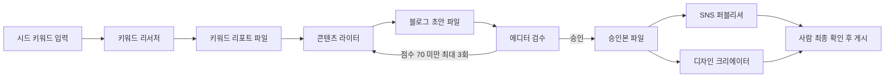
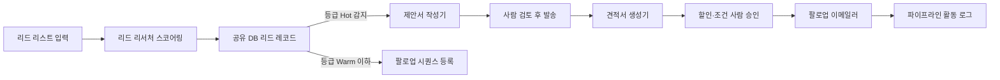
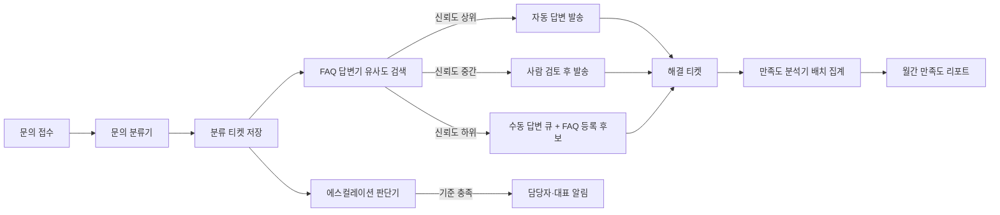
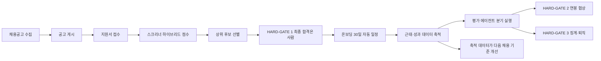

부서를 에이전트로 옮기는 작업에서 어려운 쪽은 "무엇을 자동화할까"가 아니다. **어디서 멈출지를 어떻게 적어 두는가**다. 멈춤 지점이 문서에 없으면 그 자리는 자동화된 것이 아니라 그냥 감시되지 않는 것이 된다.

이 글은 시리즈 세 편 중 두 번째로, 고객과 사람을 직접 상대하는 네 부서 — 마케팅·영업·고객지원·인사 — 의 각론을 다룬다. [첫 편](/blog/ai-transformation/department-agent-blueprint/)이 일곱 부서 전체 지도와 모든 부서가 공유하는 설계 골격(용어·공통 패턴·사람 개입 등급·실패 처리)을 세웠고, [마지막 편](/blog/ai-transformation/department-automation-backoffice/)은 재무·법무·경영지원 각론과 새 업무를 에이전트로 쪼개는 절차를 다룬다. 이 글은 그 사이에서 **공통 골격이 부서마다 어떻게 다른 모양으로 구현되는지**를 본다.

네 부서를 나란히 놓았을 때 드러나는 것을 먼저 적어 둔다. **네 부서가 전부 멈춤 지점을 두는데, 그것을 표현하는 장치의 종류가 다르다.** 마케팅은 산출물 점수로, 영업은 승인 요구로, 고객지원은 신뢰도 구간으로, 인사는 법적 근거를 단 정지 게이트로 멈춘다. 같은 요구("사람이 개입할 자리를 명시하라")가 부서의 오류 비용 구조에 따라 다른 형태를 갖는다는 점이 각론을 네 개 붙여 놓았을 때만 보인다.

## 용어 정리

이 글이 쓰는 어휘 대부분은 [첫 편의 용어·약어 정리](/blog/ai-transformation/department-agent-blueprint/)에 있다. `HITL`·`HARD-GATE`·`I/O 계약`·`품질 루프`·`에스컬레이션`·`ICP`·`BM25`가 전부 거기 실려 있으므로 다시 싣지 않는다. 아래 둘은 이 글에서 처음 나온다.

| 용어 | 풀이 |
|---|---|
| **신뢰도(confidence)** | 에이전트가 자기 답변이 맞을 가능성을 스스로 매긴 값. 여기서는 문의와 지식베이스 문서의 벡터 유사도에서 계산되며, 이 글의 고객지원부 절이 이 값을 축으로 돈다 |
| **ROAS** | Return on Ad Spend. 광고 집행액 대비 매출 비율 |

## 마케팅부 — 키워드에서 발행까지의 릴레이

5인 팀(키워드 담당·콘텐츠 작가·에디터·SNS 담당·디자이너)을 5개 에이전트로 치환한다. 설계 질문은 하나다. **이 사람은 실제로 무슨 일을 하고 있었는가.**

### 에이전트 명세

| 에이전트 | 입력 | 출력 | 연동(도구·MCP) | 사람 개입 지점 |
|---|---|---|---|---|
| 키워드 리서처 | 시드 키워드, 타깃 지역, 개수 | 키워드 리포트, 대표 키워드 | 웹 검색, 읽기·쓰기, 문서 조회(선택) | 시드 키워드 선정 자체(사전) |
| 콘텐츠 라이터 | 키워드 리포트, 페르소나, 분량 | 블로그 초안, 메타 설명, 제목 후보 | 읽기·쓰기, 웹 검색 | 없음(자동). 품질은 다음 단계가 판정 |
| 에디터·검수자 | 블로그 초안, 브랜드 가이드, 검수 강도 | 검수 리포트, 승인본, 점수, 이슈 목록 | 읽기·편집, 웹 검색 | 점수 경계선(70 부근) 건은 사람 최종 판단 |
| SNS 퍼블리셔 | 승인본, 채널 목록, 브랜드 해시태그 | 채널별 발행 준비본 | 읽기·쓰기 | 실제 게시 버튼은 사람이 누른다 |
| 디자인 크리에이터 | 콘텐츠 요약, 디자인 유형, 규격, 브랜드 컬러 | 썸네일·카드뉴스·커버 이미지 | 읽기·쓰기, 셸 실행(외부 생성 API) | 브랜드 적합성 육안 확인 |

### 파이프라인

### 설계 포인트

이 부서에서 배울 것은 **순차와 병렬의 구분**, 그리고 **점수 기반 자동 품질 관리**다. 앞의 구분이 [협업 패턴 세 가지](/blog/agentic-coding/collaboration-patterns-isolation/)와 갈리는 자리다 — 그 글은 같은 다섯 역할(키워드 리서처·콘텐츠 라이터·에디터·채널 배포·이미지 생성)을 **5단 파이프라인 하나**의 실전 예로 들지만, 이 글은 뒤 둘을 병렬 구간으로 가른다.

| 포인트 | 내용 |
|---|---|
| 순차 구간 | 리서처 → 라이터 → 에디터. 뒤 단계가 앞 산출물에 의존하므로 병렬 불가 |
| 병렬 구간 | 퍼블리셔와 디자이너는 서로 독립. 승인본만 있으면 동시 실행 가능 |
| 품질 루프 | 에디터가 산출하는 점수 필드가 자동 품질 관리의 축. 재호출 상한을 둔다 |
| 한 정의 두 역할 | 콘텐츠 작성과 SNS 변환에 같은 정의 파일을 쓰되 맥락으로 역할을 가른다 |
| 병렬 호출 방식 | 한 번의 지시에 두 작업을 함께 실행시키면 병렬로 처리된다 |

점수 70이라는 경계선은 두 가지 일을 한꺼번에 한다. 미달이면 라이터를 다시 부르는 **자동 재시도 조건**이면서, 경계선 부근이면 사람에게 넘기는 **개입 조건**이다. 재호출 상한 3회가 없으면 이 루프는 종료를 보장하지 못한다.

### 실습 환경 버전

원 자료의 이론 편성(5인)과 실습 폴더의 가상 기업 사례(5인)는 구성이 조금 다르다. 실습 쪽은 광고 최적화와 KPI 분석이 추가돼 있다.

| 실습 에이전트 | 모델 급 | 역할 | 산출물 |
|---|---|---|---|
| content-strategist | 상위 | 키워드 → 토픽 클러스터 → 30일 캘린더 | 콘텐츠 캘린더 문서 |
| copy-writer | 상위 | 톤 3종(전문·친근·긴급) 헤드라인·본문·CTA | 카피 초안 |
| ad-optimizer | 상위 | 캠페인 성과 데이터 → 개선안 5건 | 광고 개선 리포트 |
| sns-publisher | 경량 | 원고 1건 → 3채널 포맷 변환 | 채널별 발행 준비본 |
| kpi-analyst | 상위 | 광고·콘텐츠 지표 → 주간 리포트 | KPI 주간 리포트 |

실습 입력 데이터는 캠페인 이력 CSV로, 캠페인명·채널·노출·클릭·전환·집행액·ROAS 컬럼을 갖는다. 지표 계산의 입력이 명확한 표라는 점이 중요하다.

`ad-optimizer`와 `kpi-analyst`는 이미 발행된 카탈로그에도 같은 이름이 있고 정의는 갈린다. 이 글 뒤쪽의 「실습 ID 일곱 종이 발행본과 겹친다」 절에서 대조한다.

### 흔한 함정 5가지

| 함정 | 증상 | 대응 |
|---|---|---|
| 에이전트를 단순 프롬프트로 오해 | 매번 결과 형식이 달라짐 | I/O 계약을 정의 파일에 명시 |
| 모든 것을 순차 연결 | 불필요하게 느림 | 독립 구간을 찾아 병렬화 |
| 출력 형식 미정의 | 다음 단계 파싱 실패 | 파일명·포맷·필드명을 계약으로 고정 |
| 도구 과잉 탑재 | 보안 위험·비용 증가 | 역할에 필요한 최소 도구만 |
| 에러 처리 부재 | 품질 미달 결과가 그대로 발행 | 점수 루프 + 폴백 경로 설계 |

## 영업부 — 리드 응답 속도가 전환율을 만든다

B2B 영업 사이클 4단계(탐색·제안·견적·후속)를 4개 에이전트로 나눈다. 분업의 근거는 **단일 에이전트에 역할을 여러 개 얹으면 성능이 떨어진다**는 관찰이다.

### 에이전트 명세

| 에이전트 | 입력 | 출력 | 연동(도구·MCP) | 사람 개입 지점 |
|---|---|---|---|---|
| 리드 리서처 | 리드 리스트, ICP 정의, 수집 기간 | 100점 점수 + 등급(Hot·Warm·Cold·제외) | 읽기·쓰기, 검색 | ICP 정의 자체를 사람이 정한다. 등급 경계 조정도 사람 |
| 제안서 작성기 | 고객 프로파일, 리드 점수 결과, 서비스 카탈로그 | 맞춤 제안서 문서 | 읽기·쓰기, 고객사 공개정보 조회 | 발송 전 내용 검토(고객 고유 맥락 반영 여부) |
| 견적서 생성기 | 서비스 범위, 예산 민감도, 할인 정책 | 3단 견적서 + 내부 협상 가이드 | 읽기·쓰기 | 할인·조건 승인은 반드시 사람. 가격 결정 위임 금지 |
| 팔로업 이메일러 | 고객 활동 로그, 딜 단계, 건강도 모델 | 팔로업 시퀀스 + 활동 로그 | 읽기·쓰기, 메일 발송 연동 | 첫 발송 전 템플릿 승인. 이후 시퀀스는 자동 |

### 파이프라인

위 파이프라인이 표시한 멈춤 지점은 두 개다. 제안서는 **발송 전 검토**에서, 견적은 **할인·조건 승인**에서 멈춘다. 뒤쪽이 더 강하다 — 가격 결정 권한 자체를 에이전트에 넘기지 않는다. 명세표의 「사람 개입 지점」 열은 네 행이 모두 차 있으나, 나머지 둘(ICP 정의, 첫 템플릿 승인)은 파이프라인이 도는 중이 아니라 그 전에 걸린다.

이 네 역할 이름은 [협업 패턴 세 가지](/blog/agentic-coding/collaboration-patterns-isolation/)가 **분업(병렬) 패턴의 실전 예**로 드는 넷과 그대로 같은데, 묶는 방식이 반대다. 그 글은 오케스트레이터가 넷을 동시에 돌려 결과를 병합하고, 이 글은 사람 검토를 사이에 끼운 순차 라인으로 잇는다. 같은 편성이 어느 패턴으로 묶이느냐가 판본마다 갈린다는 뜻이고, 이 대조는 이 글이 두 자료를 맞춰 본 것이다.

### 점수 설계 — 무엇을 점수로 만들 것인가

리드 스코어링은 "감이 아니라 데이터로 우선순위를 정한다"는 목적을 갖는다. 100점을 적합도와 관여도 두 축으로 절반씩 나눈다.

| 축 | 배점 | 세부 항목 |
|---|---|---|
| 적합도 | 50 | 산업 적합도 15 · 회사 규모 10 · 예산 10 · 의사결정 권한 10 · 서비스 적합도 5 |
| 관여도 | 50 | 유입 채널 15 · 행동 신호 15 · 예산·권한·필요·시기 확인 10 · 시급성 5 · 최근 활동 5 |

실습 데이터(리드 CSV)는 산업·임직원수·매출·기술스택·담당자·페인포인트·관여도와 함께 항목별 점수 컬럼과 최종 등급 컬럼을 갖는다. **점수의 근거를 항목별로 남기는 것**이 설계 요건이다.

총점만 남기면 등급 경계를 조정할 때 무엇을 조정하는지 알 수 없다. 항목별 점수가 남아 있어야 "산업 적합도 배점이 과했다"는 진단이 가능하다.

### 각 에이전트의 실패 모드

원 자료는 에이전트마다 "이렇게 하면 망한다"를 하나씩 붙여 놓았다. 실패 모드를 미리 적어두는 것 자체가 설계 기법이다.

| 에이전트 | 실패 모드 | 방지책 |
|---|---|---|
| 리드 리서처 | ICP 없이 점수만 매김 → 숫자는 있으나 우선순위는 여전히 감각 | ICP 정의를 문서화하고 점수 기준을 고정 |
| 제안서 작성기 | 고객명만 바꾼 템플릿 | 고객 페인포인트를 본문 서사에 반영 |
| 견적서 생성기 | 요구에 즉시 할인 수락 | 가격 대신 범위를 조정. 할인은 사람 승인 |
| 팔로업 이메일러 | 동일 템플릿 반복 발송 | 단계별 톤·내용을 차등화 |

네 실패 모드가 공유하는 형태가 있다. **전부 산출물이 생기기는 한다는 것.** 점수도 나오고 제안서도 나오고 메일도 나간다. 실패가 오류가 아니라 무의미한 성공으로 나타나기 때문에 예외 처리로는 잡히지 않고, 그래서 넷 중 셋의 방지책이 입력 쪽(ICP 문서, 페인포인트, 단계별 톤)에 걸려 있다. 견적서 생성기만 입력 조정(가격 대신 범위)에 사람 승인이라는 개입 게이트를 덧댄다.

### 실습 환경 버전

| 실습 에이전트 | 모델 급 | 역할 |
|---|---|---|
| lead-scorer | 상위 | 리드 JSON → 100점 ICP 점수 + 우선순위 순위표 |
| proposal-writer | 상위 | 고객 니즈 한 줄 → 5섹션 제안서 |
| followup-bot | 경량 | D+0·D+3·D+7 톤 차별 후속 메일 초안 |
| contract-helper | 상위 | 계약 조건 비교 + 협상 마지노선 표 |

리드 스코어러 정의 파일에는 원칙이 세 줄로 박혀 있다. 점수 근거를 항목별로 명시할 것, 기준 미달 리드는 보류로 태깅할 것, **리드 데이터를 외부로 전송하지 말 것**이다. 마지막 항목이 데이터 거버넌스 요건이다.

세 번째 줄은 앞의 두 줄과 성격이 다르다. 앞의 둘은 산출물 품질 요건이라 결과물을 보면 지켜졌는지 알 수 있지만, 외부 전송 금지는 **지켜졌을 때 아무 흔적도 남지 않는다.** 이런 요건은 프롬프트에 적는 것만으로는 검증되지 않고 도구 권한 자체를 좁혀야 한다.

`lead-scorer`와 `proposal-writer`도 발행본에 같은 이름이 있다. 아래 「실습 ID 일곱 종이 발행본과 겹친다」 절의 대조를 참고할 것.

### 원 자료가 든 정량 지표

> **아래 수치는 원 자료가 예시로 제시한 값**이며 검증된 일반값도, 이 글이 측정한 값도 아니다. 인용할 때는 원 자료의 사례값임을 함께 밝혀야 한다. 원 자료 작성 기준일은 2026-07-26이다.

| 지표 | 개선 전 | 개선 후 |
|---|---|---|
| 리드 응답 리드타임 | 24시간 | 2시간 |
| 제안 전환율 | 15% | 35% |
| 견적→계약 전환율 | 20% | 38% |
| 팔로업 누락률 | 40% | 3% |
| 1인당 관리 리드 | 20건 | 80건 |

## 고객지원부 — 신뢰도 임계치가 자동화의 경계선

콜센터 4인(안내데스크·상담사·팀장·품질관리자)을 4개 에이전트로 치환한다. 이 부서의 백미는 **하나의 에이전트 정의를 프롬프트만 바꿔 두 역할로 쓰는 재활용 패턴**이다.

### 에이전트 명세

| 에이전트 | 입력 | 출력 | 연동(도구·MCP) | 사람 개입 지점 |
|---|---|---|---|---|
| 문의 분류기 | 문의 텍스트, 채널, 고객 ID | 카테고리×긴급도×감정 라벨 티켓 | 읽기·쓰기, 티켓 DB 기록, 메일 수신 | 오분류 의심 건 주간 리뷰 |
| FAQ 답변기 | 분류 티켓, FAQ 지식베이스 | 답변 초안, FAQ 갱신 제안 | 읽기·쓰기, 지식베이스 조회 | 신뢰도 중간대(0.70~0.84) 건은 검토 후 발송 |
| 에스컬레이션 판단기 | 분류 티켓 | 알림 + 담당자 배정 | 읽기·쓰기, 알림 웹훅, 셸 실행 | 최상위 긴급 건은 사람에게 즉시 인계 |
| 만족도 분석기 | 해결 티켓, 만족도·추천의향 응답, 리뷰 텍스트 | 지표 산출 + 토픽 클러스터 리포트 | 읽기·쓰기, 피드백 DB 조회 | 개선 과제 채택 여부는 사람이 결정 |

### 파이프라인

### 분류 규칙 — 8카테고리 × 4긴급도

분류 알고리즘은 3단계다. 키워드 1차 매칭 → 감정 분석 → 카테고리와 감정을 결합한 긴급도 판정.

| 카테고리 | 대표 키워드 | 기본 긴급도 |
|---|---|---|
| 결제·환불 | 환불, 결제, 카드, 청구, 취소 | 높음~최상 |
| 불만·클레임 | 불만, 실망, 최악, 신고 | 높음~최상 |
| 기술지원 | 오류, 접속, 로그인, 에러, 버그 | 보통~높음 |
| 계정·접속 | 비밀번호, 계정, 아이디, 탈퇴 | 보통 |
| 콘텐츠 문의 | 과정, 커리큘럼, 수료, 자료 | 보통 |
| 일반 문의 | 문의, 질문, 궁금, 안내 | 보통~낮음 |
| 제휴·협업 | 파트너, 강연, 출강 | 낮음 |
| 기타 | 위 7종 미해당 | 낮음(주간 리뷰 대상) |

「기타」의 기본 긴급도가 낮음이면서 주간 리뷰 대상인 것이 이 표의 안전장치다. 분류에 실패한 건이 낮은 긴급도로 조용히 묻히지 않도록 별도 경로를 하나 열어 둔 것이다.

### 긴급도별 SLA와 알림 경로

| 긴급도 | 대상 | 1차 응답 | 해결 목표 | 알림 경로 |
|---|---|---|---|---|
| 최상 | 결제 오류, 서비스 장애, 법적 위협 | 30분 | 4시간 | 대표 직접 알림 + 전체 멘션 |
| 높음 | 환불 요청, 불만 클레임, 반복 문의 | 2시간 | 8시간 | 팀장 + 당직 담당자 |
| 보통 | 일반 기술지원, 콘텐츠 문의 | 12시간 | 48시간 | 담당자 자체 처리 |
| 낮음 | 일반 문의, 제휴 제안 | 24시간 | 5일 | 담당자 자체 처리 |

야간 시간대의 최상위 건은 알림 채널을 이중화한다. 알림 실패가 곧 SLA 위반이 되기 때문이다.

### 신뢰도 임계치 — 이 부서의 핵심 HITL

FAQ 답변기는 문의를 벡터로 바꿔 지식베이스와 유사도를 계산하고, 상위 3건을 후보로 삼은 뒤 **신뢰도에 따라 세 갈래로 분기**한다.

| 신뢰도 구간 | 처리 | 사람 개입 |
|---|---|---|
| 0.85 이상 | 자동 답변 생성 후 즉시 발송 | 없음(사후 표본 점검) |
| 0.70 ~ 0.84 | 초안 생성 후 검토 큐로 이동 | 사람이 확인 후 발송 |
| 0.70 미만 | 수동 답변 큐 + 신규 FAQ 등록 후보 표시 | 사람이 직접 작성 |

임계치는 고정값이 아니다. 운영 2주 후 만족도 데이터를 근거로 카테고리별 차등을 둔다(결제처럼 실수 비용이 큰 영역은 높게, 일반 문의는 낮게).

이 세 구간이 다른 부서의 개입 장치와 구조적으로 다른 점이 하나 있다. **개입 여부를 사람이 미리 정한 규칙이 아니라 에이전트 자신이 매긴 값이 결정한다는 것.** 인사의 HARD-GATE는 어떤 산출물이 개입 대상인지를 사람이 사전에 지정하지만, 여기서는 에이전트가 "이 건은 확신할 수 없다"고 스스로 신고해야만 검토 큐로 넘어간다. 중간 구간 0.70~0.84가 바로 그 신고 경로다.

시리즈의 다른 두 편이 개입 장치를 각각 다른 층위에서 다룬다. [첫 편의 사람 개입 등급](/blog/ai-transformation/department-agent-blueprint/)이 개입의 **강도**를 나누는 공통 골격이고, [마지막 편의 판정 축](/blog/ai-transformation/department-automation-backoffice/)이 어떤 업무를 개입 대상으로 **분류**할지의 기준이다. 위 임계치는 그 둘과 달리 실행 시점에 건별로 계산되는 값이므로, 세 편을 함께 놓고 봐야 개입 설계의 전체 모양이 나온다.

### 에스컬레이션 트리거와 에이전트 재활용

| 트리거 | 조건 |
|---|---|
| 규칙 1 | 긴급도 최상 → 무조건 에스컬레이션 |
| 규칙 2 | 부정 감정 + 긴급도 높음 → 에스컬레이션 |
| 규칙 3 | 동일 고객이 7일 내 3회 이상 문의 → 에스컬레이션 |

> 분류기와 에스컬레이션 판단기는 **같은 에이전트 정의**를 쓴다.
>
> 시스템 프롬프트만 교체해 "분류하라"에서 "에스컬 기준 충족 여부를 판단하라"로 역할을 바꾼다.
>
> 중복 정의를 없애 유지보수 지점을 하나로 모으는 것이 이 패턴의 이득이다.

### 만족도 분석 — 배치로 도는 유일한 단계

| 항목 | 내용 |
|---|---|
| 실행 방식 | 실시간 아님. 일별 또는 월별 배치 집계 |
| 지표 산식 | 추천자 비율 − 비추천자 비율(중립은 제외) |
| 감정 4단계 | 매우 긍정 / 긍정 / 부정 / 매우 부정 |
| 토픽 분석 | 리뷰 임베딩 후 군집화(5~8개) → 군집별 긍부정 비율 |
| 활용 | 부정 비율이 높은 군집을 최우선 개선 과제로 지정 |

### 실습 환경 버전과 함정

| 실습 에이전트 | 모델 급 | 역할 |
|---|---|---|
| cs-classifier | 경량 | 문의 8종 분류 + 긴급도 4단계 판정 |
| cs-responder | 상위 | 톤 3종(친근·공식·사과) 답변 초안 |
| faq-builder | 상위 | 반복 문의 패턴 → FAQ 아티클 생성 |
| escalation-router | 경량 | 긴급도 → 담당자·팀장·대표 3경로 분기 |

에스컬레이션 라우터 정의에는 판정 원칙이 명시돼 있다. **애매하면 등급을 낮추지 말고 최상위를 유지한다.** 자동화의 오류 비용이 비대칭일 때 어느 쪽으로 기울일지 정해둔 사례다.

이 한 줄이 앞의 신뢰도 임계치와 짝을 이룬다. 임계치는 확신이 없을 때 사람에게 넘기고, 라우터 원칙은 판단이 갈릴 때 비용이 큰 쪽으로 넘긴다. 둘 다 **불확실할 때 어느 방향으로 틀릴 것인지를 미리 정해 둔 것**이고, 이 결정이 문서에 없으면 그 선택은 매 호출마다 달라진다.

실습 함정 케이스도 명시적이다. "이 과정 너무 좋아요, 근데 환불할게요" 같은 반어·복합 문의를 분류기가 칭찬으로 오분류하는지 검증한다.

## 인사부 — 자동화 금지 구역을 먼저 그린다

인사부 설계는 다른 부서와 순서가 반대다. **무엇을 자동화할지보다 무엇을 절대 자동화하지 않을지를 먼저 정한다.**

### 에이전트 명세

| 에이전트 | 입력 | 출력 | 연동(도구·MCP) | 사람 개입 지점 |
|---|---|---|---|---|
| 채용공고 수집기 | 검색 키워드, 지역 | 공고 목록 레코드 | 외부 채용 API, DB 적재 | 수집 채널·키워드 선정 |
| 지원자 스크리너 | 직무기술서, 후보자 서류 | 적합도 점수 + 위험신호 + 추천 인터뷰 질문 | 읽기·쓰기, 검색, LLM 평가 | HARD-GATE 1 — 최종 합격 결정은 사람 |
| 온보딩 가이드 | 신규 구성원 정보, 체크리스트 | 30일 일정 + 진행 상황 추적 | 캘린더·메일 연동, 스케줄러 | 이탈 신호 감지 시 리더가 직접 개입 |
| 근태·성과 관리기 | 근태 기록, 성과 데이터 | 평가 요약 + 인상 범위 제안 | DB 조회, 배치 스케줄 | HARD-GATE 2·3 — 연봉 확정·징계·퇴직 |

### 파이프라인

### HARD-GATE 3곳

| # | 지점 | 이유 | 시스템 동작 |
|---|---|---|---|
| 1 | 최종 채용 합격 | 고용 차별 소송 리스크. 편향된 자동 판정은 방어 불가 | 상위 후보 목록만 만들고 대기 상태로 정지 |
| 2 | 연봉 협상·처우 확정 | 금전 조건은 사람 간 합의 사항 | 인상 범위만 제안하고 승인 요청 |
| 3 | 징계·퇴직 결정 | 근로기준법상 보호 의무(사전 통지 등) | 위험 신호 경고만 발송, 자동 실행 금지 |

> 게이트 설계의 요건은 세 가지다.
>
> 첫째, 사람의 응답을 무시하고 진행하는 코드 경로가 존재해서는 안 된다.
>
> 둘째, 게이트 통과 여부는 감사 로그에 남긴다.
>
> 셋째, 재개 조건을 명시한다. "무엇을 확인하면 다시 진행되는가"가 적혀 있어야 게이트가 운영된다.

세 요건 중 첫째가 이 글의 다른 세 부서와 인사부를 가르는 지점이다. 마케팅·영업·고객지원의 개입은 **운영상의 약속**이라 급할 때 건너뛸 수 있지만, HARD-GATE는 건너뛸 코드 경로 자체가 없어야 한다. 세 지점 중 둘의 근거가 법적 리스크(차별 소송·근로기준법)인 것이 그 강도를 설명한다.

위 번호 1·2·3은 인사부 안에서만 통하는 국소 번호다. [마지막 편](/blog/ai-transformation/department-automation-backoffice/)의 법무부도 HARD-GATE를 세 곳 두지만 가리키는 지점이 다르다 — 자동 발송·서명 직전·심각 위반 처리다.

### 하이브리드 스코어링 — 키워드와 맥락의 결합

| 구성 | 비중 | 강점 | 약점 |
|---|---|---|---|
| 키워드 랭킹(BM25) | 30% | 빠르고 저렴, 직무 키워드 일치도 측정 | 표현이 다르면 우수 후보를 탈락시킴 |
| LLM 심층 평가 | 70% | 맥락·잠재력 파악 | 비용이 높음 |

비중은 고정이 아니다. 기술 직군처럼 필수 스택이 명확하면 키워드 비중을 올리는 식으로 포지션마다 조정한다. 조정 근거를 문서화하는 것이 과제로 포함돼 있다.

### 온보딩 6단계 프레임

| 단계 | 시점 | 내용 |
|---|---|---|
| 등록 | 1일차 | 계정·도구 세팅, 팀 채널 초대 |
| 이해 | 2~3일차 | 핵심 문서 링크 + 이해도 확인 |
| 관계 | 4~7일차 | 팀원별 짧은 면담 일정 자동 생성 |
| 탐색 | 2주차 | 난도 낮은 첫 과제 할당 + 진행 추적 |
| 기여 | 3주차 | 첫 성과 체크인, 궤도 이탈 조기 감지 |
| 평가 | 30일차 | 30일 리뷰 생성 + 다음 분기 목표 제안 |

이탈 감지는 규칙 기반이다. 예를 들어 일정 기간 첫 산출물이 없으면 자동 체크인 메시지를 보낸다. 성공 경로로 유도하는 넛지와 이탈 조기 경보를 한 쌍으로 설계한다.

### 민감 데이터 보호 — L4 등급으로 다룬다

| 장치 | 동작 |
|---|---|
| 행 단위 접근 제어 | 급여 테이블은 본인 행만 조회 가능. 인사 관리자 역할만 전체 조회 |
| 기본 차단 | 정책이 없으면 모든 접근이 막히는 방향으로 설정 |
| 감사 로그 | 급여 테이블 접근 시 사용자·시각·동작을 자동 기록 |
| 출력 가드 | 에이전트가 급여 데이터를 로그·외부로 내보내지 못하도록 훅으로 차단 |

원 자료가 이 절에 붙인 이름은 **L4 등급 취급**이다. `L4`는 층수가 아니라 [권한 등급표](/blog/agentic-coding/scaling-routing-collapse/)의 최상위 등급 이름으로, 민감 데이터를 다루는 자리라 권한이 오히려 「읽기 전용 + 별도 승인 + 감사 필수」로 좁아진다. 그 등급표는 이 시리즈가 싣지 않았으므로 링크로 대신한다.

장치는 셋이다 — 원 자료도 이 절을 **행 단위 접근 제어 + 감사 로그 + 출력 가드 3중**이라 부른다. 위 표의 「기본 차단」은 넷째 장치가 아니라 행 단위 접근 제어의 성질이다. 정책을 하나도 쓰지 않으면 모든 접근이 막히는 쪽이 기본값이라는 뜻이다. 셋은 서로 다른 층에 걸린다. 접근 제어는 DB에, 감사 로그는 사후 추적에, 출력 가드는 에이전트 실행 훅에 있다. 앞서 영업부의 "리드 데이터를 외부로 전송하지 말 것"이 프롬프트 한 줄이었던 것과 대비되는 지점이다 — 같은 요구를 프롬프트가 아니라 세 층의 장치로 강제한다.

실습 폴더의 스크리너 정의에도 같은 취지가 두 줄로 들어 있다. **점수 산정에 성별·나이·출신 지역을 포함하지 않는다. 최종 합격 결정은 에이전트가 내리지 않고 추천 수준까지만 한다.**

### 자동화 순서 5단계

원 자료는 "잘못된 프로세스를 자동화하지 말라"는 경고와 함께 순서를 못 박는다. **자동화는 항상 마지막이다.**

| 순서 | 단계 | 인사 적용 예 |
|---|---|---|
| 1 | 요구사항 의심 | 후보자 서류 검토에 정말 그만한 기간이 필요한가 |
| 2 | 삭제 | 불필요한 인터뷰 차수를 없애고 과제로 대체 |
| 3 | 단순화 | 장문의 온보딩 문서를 체크리스트로 압축 |
| 4 | 가속 | 후보자 서류 평가를 병렬 처리 |
| 5 | 자동화 | 위 네 단계를 마친 뒤에만 에이전트를 만든다 |

### 실습 환경 버전

| 실습 에이전트 | 모델 급 | 역할 |
|---|---|---|
| job-poster | 상위 | 직무 요구 → 3개 채널용 공고문 자동 생성 |
| hr-screener | 상위 | 후보자 서류 → 100점 매칭 + 상위 3인 추천 |
| interview-prep | 상위 | 후보별 맞춤 인터뷰 질문 10개(기술·문화·케이스) |

스크리너의 배점은 직무 경력 일치도 35, 핵심 스킬 30, 교육 배경 15, 자격증 10, 성장 가능성 10으로 구성된다. 입력은 직무 스펙 CSV(직무명·경력요건·연봉범위·마감일·핵심스킬·인원)와 후보자 서류 데이터다.

## 실습 ID 일곱 종이 발행본과 겹친다

위 네 부서의 실습 편성에 나온 에이전트 ID 중 일곱 종은 이미 발행된 [30개 에이전트 카탈로그](/blog/agentic-coding/thirty-agent-catalog/)에 같은 이름으로 존재한다. **이름이 같을 뿐 같은 정의가 아니다.** 두 자료는 같은 30에이전트 구상의 서로 다른 판본이고, 판본 사이의 관계는 [첫 편](/blog/ai-transformation/department-agent-blueprint/)이 정리한다.

아래 대조는 이 글이 두 자료를 직접 대 본 결과다. 오른쪽 열은 발행본 카탈로그 표에서 그대로 확인한 값이다.

| 실습 ID | 이 글의 실습 편성 | 발행 카탈로그 | 갈리는 지점 |
|---|---|---|---|
| `lead-scorer` | 영업 · 리드 JSON → 100점 ICP 점수 + 우선순위 순위표 | 영업 · 6차원 100점 스코어링, Hot/Warm/Cool/Cold 등급 | 채점 축 구성, 셋째·넷째 등급 이름(명세표) |
| `proposal-writer` | 영업 · 고객 니즈 한 줄 → 5섹션 제안서 | 영업 · 8섹션 제안서·견적서 + 가격 옵션 3종 | 섹션 수, 견적 포함 여부 |
| `ad-optimizer` | 마케팅 · 캠페인 성과 데이터 → 개선안 5건 | 마케팅 · 임계값 대조 후 중단·증액·교체 판정 | 출력이 제안인가 판정인가 |
| `kpi-analyst` | 마케팅 · 광고·콘텐츠 지표 → 주간 리포트 | 기획 · 북극성 1개 + 핵심 5개 지표 체계 정의 | **소속 부서가 다르다** |
| `cs-responder` | 고객지원 · 톤 3종 답변 초안(분류는 `cs-classifier` 담당) | 고객지원 · 8종·4단계·감정 3축 분류 + 답변 초안 | 분류 기능이 어느 에이전트에 붙는가 |
| `escalation-router` | 고객지원 · 긴급도 → 담당자·팀장·대표 3경로 분기 | 고객지원 · 법적·평판·VIP·장애 4종 트리거 감지 | 무엇을 기준으로 삼는가(경로 vs 트리거) |
| `faq-builder` | 고객지원 · 반복 문의 패턴 → FAQ 아티클 생성 | 고객지원 · 반복 문의 감지 후 FAQ 아티클 승격·발행 | 사실상 일치 |

일곱 종 중 여섯 종에서 정의가 갈리고 `faq-builder` 하나만 사실상 일치한다. 갈리는 방식도 한 종류가 아니다 — `kpi-analyst`는 소속 부서가 아예 다르고, `cs-responder`는 기능 하나가 옆 에이전트로 옮겨가 있으며, `lead-scorer`·`proposal-writer`는 같은 일을 하되 산출 규격의 숫자가 다르다.

대조 상대가 카탈로그 하나만은 아니다. [정의서 작성 품질](/blog/agentic-coding/definition-writing-quality/) 편이 같은 30종의 모델 배분을 표로 싣는데, 쓰는 일이면 상위(opus), 세는 일이면 경량(sonnet)으로 읽힌다. 위 일곱 종을 그 표와 맞대면 **넷이 갈린다** — `lead-scorer`·`ad-optimizer`·`kpi-analyst`·`faq-builder`가 이 글의 실습 편성에서는 상위인데 그 표에서는 경량이다. 나머지 셋은 맞는다(`proposal-writer`·`cs-responder`가 상위, `escalation-router`가 경량). 갈리는 넷이 전부 「이 글은 상위, 발행본은 경량」 한 방향이라는 점까지가 이 대조로 나온 것이다.

**ID를 키로 삼아 판본이 다른 자료를 합치면 안 된다는 것이 이 대조의 결론이고, 이 판단은 이 글의 정리다.** 이름이 같은 정의서를 덮어쓰는 순간 `kpi-analyst`는 부서가 바뀌고 `cs-responder`는 분류 기능을 얻거나 잃는다. 판본이 다른 정의서를 함께 쓸 일이 있다면 ID가 아니라 입력·출력 규격을 기준으로 대조해야 한다.

## 네 부서가 경계를 긋는 방식

각론 네 개를 나란히 놓으면 같은 요구가 네 가지 다른 형태로 구현된 것이 보인다. **아래 정리는 이 글이 네 부서의 개입 지점을 한 축으로 모아 본 것이다.**

| 부서 | 경계 장치 | 값·형태 | 판정 주체 | 우회 가능성 |
|---|---|---|---|---|
| 마케팅 | 산출물 점수 | 70점 경계선 + 재호출 상한 3회 | 에디터 에이전트 | 상한 도달 시 사람에게 넘어감 |
| 영업 | 승인 요구 | 발송 전 검토 · 할인·조건 승인 | 사람 | 검토는 운영 약속, 가격 결정은 위임 금지 |
| 고객지원 | 신뢰도 구간 | 0.85 이상 · 0.70~0.84 · 0.70 미만 | 에이전트 자신 | 구간이 그대로 경로가 됨 |
| 인사 | HARD-GATE | 3곳(최종 합격·연봉 확정·징계·퇴직) | 사람 | 우회하는 코드 경로가 없어야 함 |

「판정 주체」 열만 세로로 읽으면 고객지원 한 자리에서 축이 바뀐다. 영업과 인사는 사람이 바깥에서 판정하고, 마케팅은 초안을 쓴 것과 **다른** 에이전트(에디터)가 판정한다. 고객지원만 답변을 만든 에이전트 자신이 자기 확신을 직접 신고한다. 이 차이가 왜 중요한지 — 그리고 어떤 업무를 어느 쪽 방식으로 다룰지 판정하는 축 — 는 [마지막 편](/blog/ai-transformation/department-automation-backoffice/)의 몫이다.

「우회 가능성」 열은 오류 비용의 순서를 그대로 따라간다. 잘못 발행된 블로그 글은 내리면 되고, 잘못 나간 할인은 재협상할 수 있지만, 차별 판정으로 탈락시킨 후보는 되돌릴 방법이 없다. 게이트의 강도를 무엇으로 정할지 물을 때 답은 "얼마나 중요한 업무인가"가 아니라 **"틀렸을 때 되돌릴 수 있는가"** 쪽에 있다 — 이 대응 관계는 이 글이 위 표를 세로로 읽어 붙인 것이고, 원 자료가 네 부서를 그렇게 줄 세운 것은 아니다.

## 다음 편으로

이 글은 고객과 사람을 직접 상대하는 네 부서의 각론이었다. 부서별 에이전트 명세와 파이프라인, 마케팅의 점수 루프, 영업의 리드 채점 설계와 실패 모드, 고객지원의 신뢰도 임계치와 정의 재활용, 인사의 HARD-GATE 세 곳과 민감 데이터 보호까지다.

각론을 네 개 붙여 놓았을 때만 보인 것이 둘 있었다. 하나는 **개입 장치의 형태가 부서마다 다르고 그 차이가 오류의 되돌릴 수 없음에 대응한다**는 점이고, 다른 하나는 **같은 이름의 에이전트 정의가 판본에 따라 다른 일을 한다**는 점이다. 둘 다 부서 하나만 열어 봐서는 나오지 않는다.

[마지막 편](/blog/ai-transformation/department-automation-backoffice/)은 재무·법무·경영지원 각론으로 넘어간다. 이 세 부서는 고객 접점이 없는 대신 재실행 안전성과 법적 책임이 설계 주제가 되고, 마지막에 새 업무를 에이전트로 쪼개는 절차와 그 업무를 어느 등급으로 다룰지 판정하는 축이 나온다. 위 신뢰도 임계치가 그 판정 축과 어떤 관계인지도 거기서 정리된다.

시리즈의 [첫 편](/blog/ai-transformation/department-agent-blueprint/)에는 이 글이 전제로 쓴 것들이 있다 — 용어와 약어, 일곱 부서 전체 지도, 모든 부서가 공유하는 설계 패턴, 사람 개입 등급, 실패 처리 유형이다.
