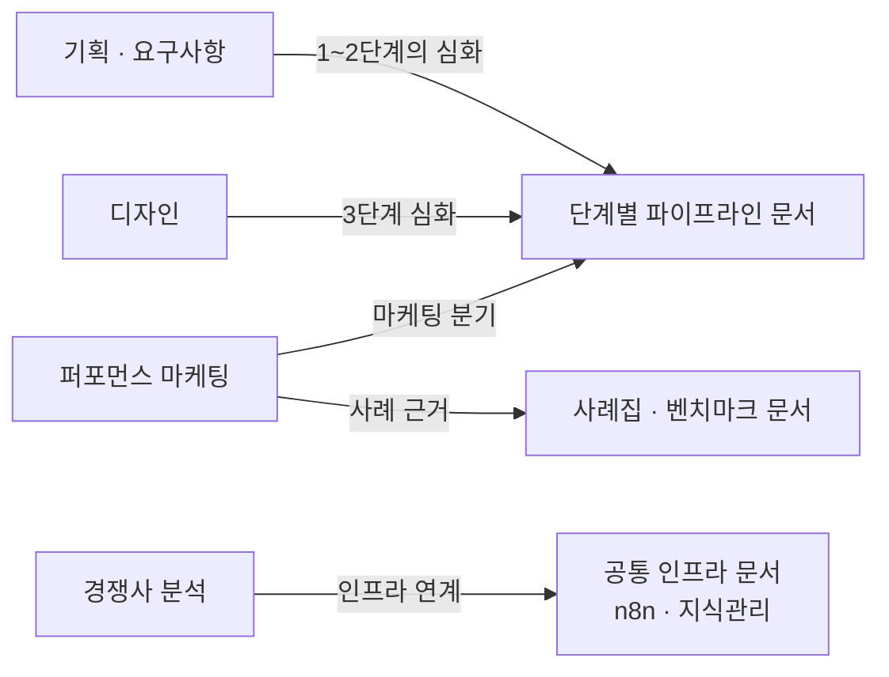
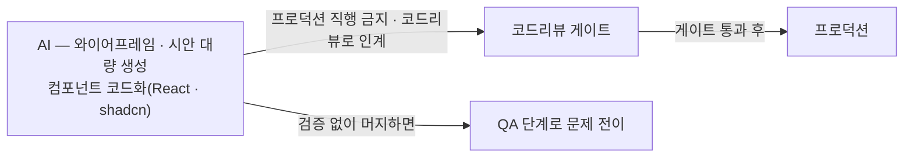
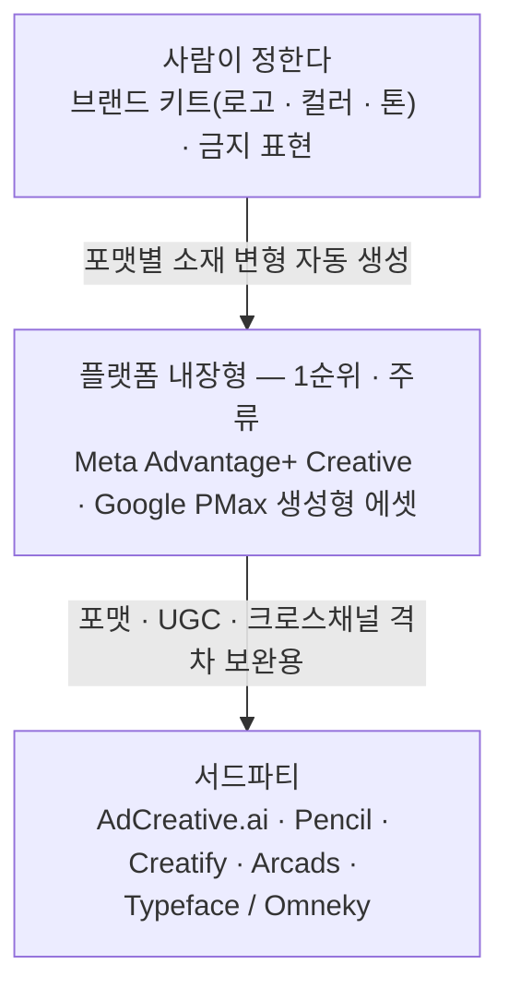
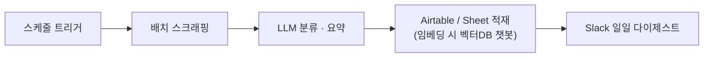

네 문서가 각자 다른 말로 같은 곳을 가리킨다. **병목은 만드는 자리에 없다.** 기획 쪽은 「진짜 병목은 *문서 작성*이 아니라 **흩어진 정성 데이터(회의·인터뷰·문의·리뷰)에서 신호를 뽑는 일**」이라 적었고, 디자인 쪽은 병목이 「"그리기"에서 **"디자인 시스템·접근성·브랜드 일관성 유지"**로 이동」했다고 적었다. 퍼포먼스 마케팅 쪽은 마케터의 일이 「"매일 손으로 돌리기"에서 "AI에 줄 입력 신호와 가드레일을 설계하기"로」 옮겼다고 적었고, 경쟁사 분석 쪽은 「"사람이 본다"에서 "AI가 노이즈를 거르고 요약·배틀카드를 갱신한다"로」라고 적었다.

네 문장이 남겨 둔 사람의 자리는 생산 공정 안이 아니다. **입력을 정의하는 앞자리이거나, 산출을 채택·승인하는 뒷자리다.** 이 겹침은 이 글의 정리이고, 네 문서의 항목 열셋을 전부 세어 다시 확인한다.

이 글이 자료로 쓰는 것은 2026-06-15 기준으로 작성된 영역별 AI 활용 문서 네 벌이다 — 기획·요구사항, 디자인, 퍼포먼스 마케팅, 경쟁사 분석. 네 문서가 공통으로 하는 일은 그 영역에서 **사람이 무엇을 정하고 AI가 무엇을 처리하는가**를 2열 표로 못 박고, 그다음에 **그 일을 실제로 하는 도구를 이름·차별점·비용·출처와 함께 나열**하는 것이다. 도구 목록이 본론이라는 뜻은 아니다. 도구 앞에 붙은 2열 표가 그 도구를 어디까지 쓸지 정하고, 넷 중 둘(기획·디자인)에는 도구 뒤에 KPI·함정 절이 한 번 더 붙어 그 도구를 무엇으로 잴지 정한다.

네 문서를 나란히 놓으면 골격이 갈린다. 기획과 디자인은 절 제목까지 같은 틀을 쓰는데, 퍼포먼스 마케팅과 경쟁사 분석은 §1 이후의 절 제목이 다르고 KPI·함정 절이 없다. **이 글은 그 차이를 지우지 않는다.** 네 영역을 한 글에 묶되 각자의 형태는 그대로 둔다 — 틀을 맞추면 원 자료에 없는 구조가 생기기 때문이다.

## 용어 정리

네 문서가 설명 없이 쓰거나 한 번만 스쳐 푼 어휘 가운데 본문에 실제로 나오는 것만 모았다.

| 용어 | 영문·원어 | 뜻 |
|---|---|---|
| **정성 데이터** | Qualitative Data | 회의·인터뷰·문의·리뷰처럼 수치로 바로 집계되지 않는 자료. 기획 쪽 문서가 병목으로 지목한 대상 |
| **PRD** | Product Requirements Document | 제품 요구사항 문서 |
| **유저스토리** | User Story | 사용자 관점의 문장으로 쓴 요구사항 단위 |
| **비기능 요구** | Non-functional Requirement | 보안·규제·SLA처럼 기능이 아니라 품질·제약 쪽에 걸리는 요구 |
| **디자인 시스템 토큰** | Design Token | 색·간격·타이포 같은 디자인 값을 이름으로 고정해 재사용하는 단위 |
| **WCAG** | Web Content Accessibility Guidelines | 웹 접근성 국제 지침 |
| **브랜드 키트** | Brand Kit | 로고·컬러·톤을 한 묶음으로 정리해 생성 도구에 넘기는 규격 |
| **DCO** | Dynamic Creative Optimization | 동적 소재 최적화. 헤드라인·이미지·CTA 조합을 사용자별로 실시간 조립해 서빙하는 방식 |
| **incrementality** | Incrementality | 광고가 없었어도 일어났을 전환을 걷어내고 순수한 증분만 재는 것 |
| **holdout** | Holdout | 광고를 노출하지 않는 대조군을 남겨 증분을 재는 실험 설계 |
| **ASC** | Advantage+ Shopping Campaign | Meta의 타겟·입찰·예산 통합 자동화 캠페인 |
| **PMax** | Performance Max | Google의 채널 통합 자동화 캠페인 |
| **CPA · ROAS** | Cost Per Acquisition · Return On Ad Spend | 전환당 비용 · 광고비 대비 수익 |
| **룩어라이크** | Lookalike | 기존 전환자와 닮은 사용자를 찾아 타겟을 넓히는 방식 |
| **UGC** | User Generated Content | 사용자가 직접 만든 형식을 띤 콘텐츠 |
| **CI** | Competitive Intelligence | 경쟁 인텔리전스. 경쟁사 정보를 모아 해석하고 의사결정에 넣는 활동 |
| **배틀카드** | Battlecard | 경쟁사별 비교 우위와 대응 화법을 한 장으로 정리한 영업 자료 |
| **importance scoring** | — | 감지된 변경마다 중요도를 점수로 매겨 노이즈를 걸러 내는 것 |
| **ATS** | Applicant Tracking System | 채용 지원자 관리 시스템. 공개 피드로 공고 목록을 노출하는 제품이 있다 |
| **LLM-ready** | — | 크롤링 결과를 모델이 바로 먹을 수 있는 마크다운·JSON 형태로 정리해 둔 상태 |
| **MCP** | Model Context Protocol | AI와 도구를 잇는 개방 표준 |
| **SWOT** | Strengths · Weaknesses · Opportunities · Threats | 강점·약점·기회·위협 네 칸으로 정리하는 분석 틀 |

## 네 영역이 어디에 붙는가

원 자료는 네 문서마다 첫머리에 목적과 상위 문서를 스스로 적어 두었다. 그 목적·상위 두 줄에서 뽑으면 이렇게 된다.

| 영역 | 원 자료가 적은 목적 | 원 자료가 적은 자리 |
|---|---|---|
| **기획·요구사항** | 요구사항 수집·분석 + 서비스 기획 단계의 AI 시스템화 | 파이프라인 **1~2단계의 심화** |
| **디자인** | UI 생성·프로토타입·UX 라이팅의 AI 시스템화 | 파이프라인 **3단계 심화** |
| **퍼포먼스 마케팅** | 크리에이티브 생성·A/B·입찰최적화·오디언스·대량생산의 시스템화 | 파이프라인의 **마케팅 분기** · 사례 근거는 사례집 |
| **경쟁사 분석** | CI를 모니터링 자동화·감성분석·자체 스크래핑 파이프라인·선행신호 포착으로 시스템화 | **공통 인프라**(n8n·지식관리) 연계 |

세 번째 열이 이 글의 경계선이다. 각 영역이 자기 위를 어디로 걸어 두었는지가 서로 다르다. 마케팅이 사례 근거로 건 사례집·벤치마크 문서의 내용은 [빌더에서 오케스트레이터로 가는 조직 설계](/blog/ai-transformation/builder-to-orchestrator-shift/)에 있다.

**경쟁사 분석에서만 파이프라인 쪽으로 가는 화살표가 없다.** 이 문서의 목적 줄과 상위 줄 두 자리를 모두 확인했고, 어느 쪽에도 단계 번호가 없다 — 걸려 있는 것은 공통 인프라 문서 하나다. 퍼포먼스 마케팅도 「마케팅 분기」라고만 적혀 있어 특정 단계 번호에 대응하지 않는다. 그래서 이 글은 네 영역을 파이프라인 단계에 일렬로 세우지 않는다.

### 단계 경계의 게이트는 다른 글에 있다

기획 1~2단계와 디자인 3단계에 어떤 승인 지점이 박히는지, 통과 기준이 무엇인지는 [요구사항에서 운영까지 여섯 게이트와 개발·QA·배포 각론](/blog/ai-transformation/sdlc-human-gates/)이 다룬다. 이 글이 싣는 것은 그 안쪽의 영역별 각론 — **각 영역이 실제로 어떤 도구를 어떤 기준으로 고르고, 무엇을 사람에게 남기는가**다.

그리고 확장 로드맵의 90일+ 구간에 「마케팅·경쟁사분석 등 도메인 확대」가 액션으로 적혀 있다. 그 로드맵과 그 앞 구간의 인프라는 [팀 공유 인프라 넷과 성숙도 0 → 1 → N](/blog/ai-transformation/enablement-infra-and-maturity/)에 있고, 이 글의 뒤쪽 두 영역이 그 항목이 가리키는 자리다.

### 「사람 게이트」의 층위

「사람 게이트」라는 말은 이 블로그에 이미 여러 번 나왔고, 쓰인 층위가 자리마다 다르다. 여기서 쓰는 것은 **영역별 산출물을 사람이 채택·승인하는 지점**이다. 층위가 어떻게 갈리는지는 [요구사항에서 운영까지 여섯 게이트와 개발·QA·배포 각론](/blog/ai-transformation/sdlc-human-gates/)이 다룬다.

### 이미 실린 층위와의 대조

이 블로그에는 마케팅과 경쟁사 분석이 이미 나와 있다. 겹치는 것은 **소재이지 층위가 아니다.**

| 소재 | 이미 실린 층위 | 이 글의 층위 |
|---|---|---|
| **광고 최적화** | 부서를 에이전트로 쪼갠 설계에서 `ad-optimizer` 한 종 — 5대 KPI 3구간 임계와 Pause/Scale/Replace/Test 판정 — [여섯 부서 26종 에이전트 정의서](/blog/ai-transformation/agent-definition-by-department/) | 마케터가 실제로 계약해 쓰는 **상용 플랫폼과 서드파티 도구**, 그리고 그 도구가 보고한 전환을 다시 걸러 내는 검증 규율 |
| **경쟁사 분석** | 부서를 에이전트로 쪼갠 설계에 둘 — 경영지원부의 「경쟁사 분석가」(비교 대상 목록 → 가격·기능·포지션 비교표)와 기획전략부의 `competitor-monitor`(모니터링 4영역 × 주기 + SWOT → 배틀카드) — [백오피스 3부서와 자동화 등급 6축](/blog/ai-transformation/department-automation-backoffice/) · [여섯 부서 26종 에이전트 정의서](/blog/ai-transformation/agent-definition-by-department/) · [7부서 30에이전트의 공통 골격](/blog/ai-transformation/department-agent-blueprint/) | 그 비교표의 **재료를 무엇으로 어떻게 긁어 오는가** — SaaS 네 종과 자체 구축 파이프라인, 그리고 선행 신호의 소스 |
| **배틀카드** | 영업 자료로서의 작성 규칙(불리한 사실 의무 기재) — [여섯 부서 26종 에이전트 정의서](/blog/ai-transformation/agent-definition-by-department/) | 배틀카드를 **자동 갱신하는 도구**와, 그 갱신본을 사람이 어디서 해석하는가 |
| **PM·디자이너·마케터의 직무 재정의** | 다섯 직무의 AS-IS / TO-BE와 새로 요구되는 역량 — [빌더에서 오케스트레이터로 가는 조직 설계](/blog/ai-transformation/builder-to-orchestrator-shift/) | 재정의된 직무가 손에 쥐는 **도구의 이름과 비용** |

세 번째 열을 세로로 읽으면 이 글의 자리가 보인다. **에이전트를 어떻게 짜는가가 아니라, 무엇을 사서 무엇을 지을 것인가다.** 이 대조는 이 글의 정리다.

### 골격이 갈리는 자리

앞에서 말한 골격 차이를 표로 두면 이렇다.

| 영역 | 절 골격 | 2열 표의 열 순서 |
|---|---|---|
| **기획·요구사항** | 패러다임 · 도구 · KPI·함정 | AI가 처리 → 사람 게이트 |
| **디자인** | 패러다임 · 도구 · KPI·함정 | AI가 처리 → 사람 게이트 |
| **퍼포먼스 마케팅** | 패러다임 · 광고 크리에이티브 · A/B·입찰 · 오디언스·예산 · 대량 생성 | 사람이 정하는 것 → AI가 처리하는 것 |
| **경쟁사 분석** | 핵심 전환 · 모니터링 자동화 · 감성 분석 · 자체 구축 · 채용공고 선행 신호 | 사람이 정하는 것 → AI가 처리하는 것 |

**표의 열 순서가 둘씩 갈린다** — 기획·디자인은 AI를 왼쪽에 놓고, 퍼포먼스 마케팅·경쟁사 분석은 사람을 왼쪽에 놓는다. 절 골격의 갈림과 같은 둘씩으로 나뉘지만 절 제목이 그 이유는 아니다 — §1을 「패러다임」으로 다는 문서는 셋이다. 이 확인은 이 글의 정리다.

## 기획·요구사항 — 정성 데이터의 병목을 AI가 푼다

기획의 진짜 병목은 *문서 작성*이 아니라 **흩어진 정성 데이터(회의·인터뷰·문의·리뷰)에서 신호를 뽑는 일**이다. AI가 전사·태깅·클러스터링·요약을 맡고, 사람은 *무엇을 채택하고 무엇을 먼저 할지* 판단한다.

| AI가 처리 | 사람 게이트 |
|---|---|
| 회의·인터뷰 전사·요약·액션아이템 | *무엇을 요구사항으로 채택* (원문 대조) |
| 고객 피드백 태깅·테마 클러스터링 | 우선순위·스코프 확정 |
| PRD 골격·유저스토리·엣지케이스 후보 | KPI·비기능(보안·규제·SLA) 명시 |

앞의 두 행이 나누는 것은 **자료를 다루는 손과 자료를 채택하는 손**이다 — 왼쪽은 이미 나온 말을 옮기거나 묶고, 오른쪽은 그중 무엇을 남길지 정한다. 셋째 행만 축이 다르다. 왼쪽이 없던 초안을 만들고, 오른쪽은 그 초안에 값을 채워 넣는다.

### 도구 — 회의 전사에서 우선순위화까지

| 단계 | 도구 | 차별·선택 기준 | 비용대략 |
|---|---|---|---|
| 회의·전사 | Fireflies / Otter / **Granola** | 봇 참석이 싫으면 Granola(기기 직접 캡처) | 무료~$14 |
| 사용자 리서치 | **Dovetail** | 대화 저장소 + AI 태깅·테마·감성, 리서치 자산화 | $29~ |
| 세일즈·고객콜 | Gong | 영업 대화 패턴·이의제기 추출 | 견적 |
| PRD 작성 | **ChatPRD** / Notion AI | PRD 전문(갭·엣지케이스 분석) vs 워크스페이스 통합 | $15 / $20 |
| 우선순위화 | Productboard Pulse / Jira+Rovo | 피드백 집계 근거 / 백로그 자동화 | 견적 / $20 |

가격은 원 자료 작성 기준일(2026-06-15) 시점의 대략값이다. 도구 가격과 과금은 이 시기에 자주 바뀌므로 도입 직전에 공식 페이지를 다시 확인해야 한다.

이 표에서 「차별·선택 기준」 열이 하는 일은 도구를 고르는 축을 하나씩 다르게 놓는 것이다. 회의·전사는 **봇이 회의에 들어오느냐**로 갈리고, PRD 작성은 **전문성이냐 워크스페이스 통합이냐**로 갈리며, 우선순위화는 **근거 집계냐 백로그 자동화냐**로 갈린다.

원 자료가 든 스타트업 추천 스택은 셋을 잇는 구성이다 — **Granola(회의) + Notion AI(회의록→PRD 한 워크스페이스) + ChatPRD(정밀 PRD).** 기준은 저비용과 연결성 우선이다.

### KPI와 함정

- **KPI**: 요구사항→PRD 리드타임, PRD 재작업률, 고객 피드백 반영 주기.
- **함정**: AI 요약의 *맥락 누락·환각*. 고객 인용을 PRD에 옮길 때는 원문 대조가 필수다. "그럴듯한 유저스토리"가 실제 니즈와 어긋날 수 있어 *채택은 사람 판단*이다.

함정 쪽 문장이 앞 2열 표의 첫 행과 맞물린다. **원문 대조가 사람 게이트의 괄호 안에 적혀 있는 이유**가 여기 있다 — 전사와 요약이 자동화되면 원문과 요약본 사이의 거리가 눈에 보이지 않게 되고, 그 거리를 다시 여는 동작이 원문 대조다.

## 디자인 — 탐색은 폭발적으로, 승인은 시스템으로

AI가 시안·와이어프레임·컴포넌트를 *대량 생성*하면서 디자인의 병목이 "그리기"에서 **"디자인 시스템·접근성·브랜드 일관성 유지"**로 이동한다. 그래서 디자이너는 *에이전트의 제약·시스템 프롬프트를 설계하는 사람*이 된다.

마지막 문장은 직무 재정의 쪽 자료가 다섯 직무 표에 이미 실은 것과 같은 말이다. 그 표와 직무별 새 역량은 [빌더에서 오케스트레이터로 가는 조직 설계](/blog/ai-transformation/builder-to-orchestrator-shift/)에 있고, 여기서는 그 재정의가 도구 목록으로 어떻게 내려오는지만 본다.

| AI가 처리 | 사람 게이트 |
|---|---|
| 와이어프레임·시안 대량 생성 | 디자인 시스템 토큰·접근성(WCAG) 승인 |
| 컴포넌트 코드화(React/shadcn) | 브랜드 일관성 최종 판단 |
| UX 마이크로카피 초안·베리에이션 | **AI 산출 코드 → 코드리뷰 인계**(프로덕션 직행 금지) |

세 번째 행이 다른 둘과 성질이 다르다. 앞의 둘은 **승인·판단**이지만, 셋째는 **다른 공정으로 넘기라는 지시**다.

아래쪽 화살표가 위쪽 두 화살표의 이유다. 검증 없이 머지된 산출 코드는 사라지지 않고 **QA 단계로 옮겨 가서** 그때 발견된다.

### 도구 — 넷

| 도구 | 무엇에 / 차별 | 비용대략 |
|---|---|---|
| **Figma Make** | Figma 내장, 동작 프로토타입·앱, Supabase 연동 | $15 + AI 크레딧 |
| **v0 (Vercel)** | 프롬프트→React+shadcn/ui, Figma import, Vercel 배포 직결 | 무료~$30 |
| **UX Pilot** | 텍스트→스크린 플로우·와이어프레임 | 무료~ |
| **Google Stitch**(구 Galileo) | 텍스트→고품질 UI 화면 | 무료(베타) |

가격은 원 자료 작성 기준일(2026-06-15) 시점의 대략값이다.

네 도구의 산출물 형태가 갈린다. 위의 둘은 **코드나 동작하는 프로토타입**을 내고, 아래 둘은 **화면과 플로우**를 낸다.

원 자료의 선택 기준은 그 갈림을 그대로 축으로 쓴다. 디자인↔개발 핸드오프를 줄이려면 **v0**(코드 산출 + 배포)이고, Figma 자산 중심이면 **Figma Make**다. 단 두 경우 모두 *산출 코드는 코드리뷰 게이트를 통과한 뒤* 프로덕션으로 간다.

### KPI와 함정

- **KPI**: 시안→승인 리드타임, 디자인↔개발 핸드오프 재작업률, 접근성 위반 건수.
- **함정**: AI는 *"그럴듯하지만 비표준"* 컴포넌트를 쉽게 낸다 → 디자인 시스템 기준 리뷰가 없으면 부채가 누적된다. v0 산출 코드를 검증 없이 머지하면 QA 단계로 문제가 전이된다.

## 퍼포먼스 마케팅 — 수동 운영에서 입력 신호 품질 관리로

> **인용 주의**: 벤더 자체 수치는 "업계 리포팅 기준"으로 읽는다. 공식 1차(Meta·Google) 수치만 단정해 쓴다.

이 단서는 원 자료가 이 문서 첫머리에 스스로 붙인 것이고, 아래 표들에 벤더가 낸 수치가 많이 들어간다. 그래서 출처 열을 지우지 않고 그대로 싣는다.

플랫폼이 타겟팅·입찰·소재 변형을 자동화하면서 마케터의 일이 **"매일 손으로 돌리기"에서 "AI에 줄 입력 신호와 가드레일을 설계하기"로** 이동한다. 사람의 레버는 셋이다 — ① 소재 시드·브랜드 키트 품질 ② 전환 신호·예산 제약 정의 ③ incrementality 검증.

| 사람이 정하는 것 (게이트) | AI가 처리하는 것 |
|---|---|
| 브랜드 키트(로고·컬러·톤), 금지 표현 | 포맷별 소재 변형 자동 생성 |
| 전환 정의·목표 CPA/ROAS·예산 상한 | 입찰·예산 채널 간 자동 배분 |
| 오디언스 시드·제외 조건 | 룩어라이크 확장·마이크로세그먼트 |
| incrementality 실험 설계·중단 기준 | 조합 A/B 실시간 서빙·최적안 선택 |

네 행 모두 왼쪽이 **미리 정해 두는 값**이다. 승인 시점에 판단하는 항목이 아니라, 자동화가 돌기 전에 입력으로 넣어 두는 제약이다. 아래 네 개 절이 오른쪽 열을 펼치는데 일대일은 아니다 — 「입찰·예산 채널 간 자동 배분」은 A/B 절과 오디언스 절이 나눠 받고, 대량 생성 절은 새 행을 받는 대신 첫 행을 규모 쪽에서 다시 본다.

### 광고 크리에이티브 자동 생성

#### 플랫폼 내장형 (1순위 — 주류)

| 도구 | 무엇에 / 어떻게 | 출처 |
|---|---|---|
| **Meta Advantage+ Creative** | 정적 소재를 오디언스별 변형 최적화 — 비율 자동 적응(Feed/Stories/Reels), 배경 생성, 헤드라인·본문 변형, 정적→짧은 영상, 자동 음악 | [bir.ch](https://bir.ch/blog/meta-ai-creative-tools) |
| **Meta 2025 신규** | 브랜드 키트 자동 적용, Creative Sticker CTA, 의류 virtual try-on | [Campaign Asia](https://www.campaignasia.com/article/meta-expands-advantage-with-gen-ai-ad-creativity-tools-for-advertisers/gpnjoyd0trklxfjkavop4nmr65) |
| **Google PMax 생성형 에셋** | 헤드라인·설명·이미지·영상 자동 생성, 광고 내 AI 이미지 편집, Product Studio 연동 | [Google 공식](https://blog.google/products/ads-commerce/get-creative-with-generative-ai-in-performance-max/) |

두 번째 행의 「브랜드 키트 자동 적용」이 앞 2열 표의 첫 행과 정확히 맞물린다. 사람이 브랜드 키트를 정의해 두면 플랫폼이 그것을 포맷별 변형에 자동으로 입힌다.

원 자료가 **공식 채택 지표**로 든 수치는 하나다 — Meta 생성형 AI 도구를 쓰는 광고주가 **400만+** 이고, 6개월 전 100만에서 급증했다는 것이다. ([출처](https://imm.com/blog/unpacking-meta-2025-ad-overhaul-andromeda-advantage-and-what-it-means-for-your-ads))

여기에 단서를 하나 붙여 둔다. **원 자료는 이 수치를 「공식 채택 지표」라 부르지만, 붙은 링크는 Meta 공식 페이지가 아니라 3자 매체다.** 같은 문서가 첫머리에 세운 기준(공식 1차 수치만 단정 사용)에 이 한 행이 걸린다. 위의 PMax 행과 뒤에 나올 AI Max 행은 링크가 실제로 `blog.google`이어서 기준을 만족하지만, 이 400만+ 수치는 그렇지 않다. 이 확인은 이 글의 정리다.

#### 서드파티 (포맷·UGC·크로스채널 격차 보완)

| 도구 | 차별점 | 출처 |
|---|---|---|
| **AdCreative.ai** | 성과 데이터로 소재 "성과 예측" 스코어링 | [bestever.ai](https://www.bestever.ai/post/ad-creative-ai) |
| **Pencil (Brandtech)** | $2B 광고비 데이터 스코어링, 채팅형 조정 | [bestever.ai](https://www.bestever.ai/post/ad-creative-ai) |
| **Creatify** | 제품 URL 1개 → 영상·이미지·쇼츠 다포맷 | [skywork.ai](https://skywork.ai/skypage/en/Creatify-vs.-Arcads-An-In-Depth-2025-Review-for-AI-Ad-Creation/1974506119478571008) |
| **Arcads** | AI 배우 기반 UGC 영상 대량 생성·테스트 | [hyperfx.ai](https://www.hyperfx.ai/blog/arcads-vs-creatify-vs-higgs-field-vs-hyper-2026) |
| **Typeface / Omneky** | 브랜드 가이드 학습, 브리프당 5–10 옴니채널 소재 | [Typeface](https://www.typeface.ai/blog/7-generative-ai-use-cases-in-enterprise-marketing) |

다섯 행의 차별점을 세로로 읽으면 둘은 **스코어링**(AdCreative.ai·Pencil), 둘은 **포맷 확장**(Creatify·Arcads), 하나는 **브랜드 학습**(Typeface / Omneky)이다. 이 배정은 이 글의 정리다.

두 표를 잇는 관계는 원 자료가 절 제목에 적어 두었다 — 플랫폼 내장형이 1순위이자 주류이고, 서드파티는 포맷·UGC·크로스채널의 **격차를 보완하는 자리**다.

### A/B 테스트 · 입찰 최적화

| 영역 | 도구 / 수치 | 출처 |
|---|---|---|
| **DCO (동적 소재 최적화)** | 헤드라인·이미지·CTA 조합을 사용자별 실시간 서빙. DCO 캠페인 광고비 $1당 $4.52 수익 | [Cometly](https://www.cometly.com/post/ai-ad-testing-tool) |
| **Smartly.io / Hunch** | 멀티플랫폼 동시 조합 테스트, 1 템플릿→수백 개인화 버전 | [madgicx](https://madgicx.com/blog/ad-tech-platform-for-creative-optimization) |
| **Meta Advantage+ Shopping(ASC)** | 타겟·입찰·예산 통합 자동. 전환당 비용 평균 **17%↓**, 셋업 **71%↓**(벤치마크) | [Marpipe](https://www.marpipe.com/blog/what-is-meta-asc-advantage-shopping-campaign) |
| **Google PMax / AI Max** | 동일 CPA/ROAS에서 전환가치 평균 **14%↑**(일부 27%) | [Google 공식](https://blog.google/products/ads-commerce/google-ai-max-for-search-campaigns/) |

이 표가 첫머리 인용 단서가 가장 직접 걸리는 자리다. 네 행을 링크 도메인으로 가르면 플랫폼 공식은 마지막 하나뿐이고 나머지 셋은 3자 매체다. 그 셋 가운데 ASC 행의 두 수치는 원 자료가 스스로 **「벤치마크」**라 표기해 두었다. 이 확인은 이 글의 정리다.

> ⚠️ **반례 — incrementality 검증 필수**: 250+ 캠페인 독립 분석에서 매출 +13%지만 CPA +16% 상승 사례가 있다. 플랫폼 자동화는 "보고된 전환"을 부풀릴 수 있어 *증분 실험(holdout)*으로 검증해야 한다. ([출처](https://almcorp.com/blog/google-ai-max-search-campaigns-performance-cpa-revenue-study/))

반례가 앞의 2열 표 넷째 행과 짝을 이룬다. **사람이 남는 자리가 incrementality 실험 설계와 중단 기준인 이유가 여기 있다** — 플랫폼이 내는 숫자만 보면 매출 +13%가 성공으로 읽히는데, 같은 기간에 CPA가 +16% 올랐다는 사실은 플랫폼 리포트가 알려 주지 않는다. 그 간극을 여는 장치가 노출하지 않는 대조군이다.

### 오디언스 분석 · 예산 배분

| 도구 | 무엇에 / 어떻게 | 출처 |
|---|---|---|
| **Meta Predictive/Lookalike** | 수천 신호로 전환 가능성 높은 유사 세그먼트 | [madgicx](https://madgicx.com/blog/ai-audience-segmentation-tools) |
| **GA4 예측 세그먼트 / Klaviyo / Braze** | 이탈·재구매·LTV 예측, 최적 발송 시점 | [averi.ai](https://www.averi.ai/guides/top-10-ai-audience-segmentation-tools-2025) |
| **Albert.ai** | 채널 간 실시간 자율 예산 배분 (사례: 증액 없이 ROAS 30%↑) | [Zoomd](https://zoomd.com/albert-ai/) |

세 행 중 위의 둘은 **누구에게 보낼지**를 예측하고, 셋째는 **어디에 얼마를 쓸지**를 배분한다.

### 대량 콘텐츠 생성 (At Scale)

- **Smartly.io Creative Suite** — 컴포넌트 조립 → 변형 자동 테스트 (700+ 브랜드, ~$5B 광고비). ([출처](https://smartyads.com/blog/how-to-use-ai-ad-creatives-to-scale-your-advertising-campaigns))
- **Storyteq / Rocketium** — demographic별 카피·비주얼·톤 적응, 수백 변형 자동. ([출처](https://storyteq.com/blog/how-do-ai-content-generation-tools-handle-bulk-content-creation/))

첫 항목은 앞의 표와 도구군이 겹친다 — Smartly.io는 A/B 표에 이름이 있다. 갈리는 것은 도구가 아니라 **무엇을 재느냐**다. A/B 절에서는 조합의 성과를, 이 절에서는 변형의 수량을 본다.

### 도구를 고르는 기준

원 자료가 이 문서의 마지막에 남긴 선택 기준은 한 줄이다.

> 도구 선택 기준은 **확장할 포맷 × 예산 × 인적 편집 여력**이다. 플랫폼 내장(ASC·PMax)이 디폴트이고, 서드파티는 격차 보완용이다.

세 인수 가운데 앞의 둘은 흔한 축이지만 셋째는 그렇지 않다. **인적 편집 여력**이 곱해져 있다는 것은, 소재를 몇 배로 늘릴 수 있느냐가 아니라 그중 몇 개를 사람이 손볼 수 있느냐가 상한이라는 뜻이다. 대량 생성 절이 이 기준 바로 앞에 놓인 이유이기도 하다.

## 경쟁사 분석 — 사람이 보던 것을 AI가 거르고 갱신한다

경쟁 인텔리전스는 "사람이 본다"에서 **"AI가 노이즈를 거르고 요약·배틀카드를 갱신한다"**로 옮겨 간다. 표준 자체 구축 구조는 **스크래핑 → LLM 요약/임베딩 → 알림/다이제스트** 3단이고, SaaS를 살지(buy) 직접 만들지(build)가 실무 판단 포인트다.

| 사람이 정하는 것 | AI가 처리하는 것 |
|---|---|
| 추적할 경쟁사·페이지·키워드 | 변경 감지·diff·요약 |
| 중요도 기준(무엇이 위협인가) | importance scoring·노이즈 필터 |
| 배틀카드의 전략적 해석 | 배틀카드 초안 자동 갱신 |

세 행 가운데 앞의 둘은 **감시가 시작되기 전에 정해 두는 값**이고, 셋째는 **결과가 나온 뒤의 판단**이다. 오른쪽 열이 앞의 두 값을 그대로 실행 조건으로 받는다 — 추적 대상이 정해져야 변경 감지가 돌고, 중요도 기준이 있어야 importance scoring이 무엇을 거를지 안다.

아래 세 표의 수치 가운데 출처 링크가 도구 벤더 자기 도메인인 것은 벤더 자체 표기로 읽는다 — 마케팅 절 첫머리의 인용 단서가 여기에도 걸린다.

### 모니터링 자동화 — 가격·기능·체인지로그·채용

| 도구 | 무엇에 / 어떻게 | 출처 |
|---|---|---|
| **Crayon** | 엔터프라이즈 CI 표준. Sparks 에이전트가 주간 다이제스트를 자율 생성하고, **AI importance scoring**으로 노이즈를 걸러 배틀카드를 자동 게시 | [Crayon](https://www.crayon.co/blog/a-smarter-way-to-compete-how-ai-is-reinventing-competitive-intelligence) |
| **Klue** | AI 지속 모니터링 → 배틀카드 자동 갱신 (콘텐츠 시간 60–70%↓) | [리뷰](https://www.copy.ai/go-to-market-tools/klue-review) |
| **Visualping** | 경쟁사 페이지를 15분 간격으로 체크 → **AI 요약 + before/after 스크린샷**. 가격·기능·보도·**채용공고**·리뷰 추적, 자연어 필터 | [Visualping](https://visualping.io/blog/ai-competitor-monitoring) |
| **Kompyte** | B2B 웹·가격·캠페인 실시간 추적 | [비교](https://visualping.io/blog/competitor-monitoring-tools) |

네 도구의 산출물이 갈린다. 앞의 둘은 **배틀카드**를 갱신하고, 뒤의 둘은 **변경 자체**를 알린다. 그리고 절 제목의 추적 대상 넷 가운데 채용공고는 Visualping 행에 이름으로 들어가 있고, 뒤에서 따로 한 절을 받는다.

### 리뷰·소셜 감성 분석과 마켓 인텔리전스

| 도구 | 무엇에 / 어떻게 | 출처 |
|---|---|---|
| **Brandwatch** | 100M+ 소스 감성·이미지 감성·경쟁 벤치마킹 | [Brandwatch](https://www.brandwatch.com/blog/social-listening-tools/) |
| **Sprinklr Insights** | 40+ 산업 모델, 일 10B+ 예측·80%+ 정확도 | [Sprinklr](https://www.sprinklr.com/blog/social-listening-tools/) |
| **AlphaSense Generative Search/Grid** | 5억+ 프리미엄 문서 자연어 질의, 다문서에 프롬프트를 동시 적용해 **경쟁 구도 표** 생성, Deep Research가 SWOT을 수분으로 | [AlphaSense](https://www.alpha-sense.com/press/alphasense-supercharges-its-generative-ai-suite-with-groundbreaking-new-features/) |

앞의 두 도구는 **공개 소셜·리뷰**를 읽고, 셋째는 **프리미엄 문서**를 읽는다. 입력의 출처가 다르므로 대체재가 아니다.

### 자체 구축 — 웹 스크래핑 + LLM 파이프라인

| 도구 | 무엇에 / 어떻게 | 출처 |
|---|---|---|
| **Firecrawl** | URL → **LLM-ready 마크다운/JSON** 초 단위 변환(토큰 93%↓), `/monitor`로 변경 즉시 통지, MCP 지원 | [Firecrawl](https://www.firecrawl.dev/) |
| **Apify** | 프리빌트 Actor 마켓(LinkedIn 등) + 커스텀 JS, 개발팀 친화 | [비교](https://dev.to/apify/firecrawl-vs-apify-2025-guide-for-ai-and-data-teams-42e3) |
| **Browse.ai** | 노코드 딥 스크래핑, 비즈니스팀용 | [Browse.ai](https://www.browse.ai/blog/web-scraping-tools-comparison-guide) |

세 도구가 상정하는 사용자가 다르다 — Firecrawl은 **LLM에 바로 먹일 형태**를 내는 쪽, Apify는 **개발팀**, Browse.ai는 **비즈니스팀**이다.

표준 워크플로는 **Firecrawl + n8n + LLM** 조합으로 적혀 있다. 스케줄 트리거 → 배치 스크래핑 → LLM 분류·요약 → Airtable/Sheet 적재(임베딩 시 벡터DB 챗봇) → **Slack 일일 다이제스트**다. ([출처](https://www.firecrawl.dev/blog/firecrawl-n8n-web-automation))

절 첫머리의 3단 구조가 이 다섯 칸으로 펼쳐진다 — 스크래핑이 왼쪽 두 칸, LLM 요약·임베딩이 가운데, 알림·다이제스트가 오른쪽이다. 두 번째 칸에 들어갈 도구가 위 표의 셋이다.

**build vs buy가 실무 이슈라는 것은 도구 생태계 쪽에서도 확인된다.** n8n에 「Klue 대안」 배틀카드 템플릿이 공개돼 있을 만큼이다. ([출처](https://n8n.io/workflows/10205-auto-generate-competitive-battlecards-with-ai-slack-and-notion-klue-alternative/)) n8n 자체의 과금 구조와 셀프호스팅 비용, 그리고 공식 템플릿 목록은 [팀 공유 인프라 넷과 성숙도 0 → 1 → N](/blog/ai-transformation/enablement-infra-and-maturity/)에 있다.

### 채용공고 = 선행 경쟁 신호

원 자료가 **가장 저평가된 신호**로 꼽은 것이 이것이다.

> 경쟁사는 제품 발표 **6–18개월 전**에 그 제품 채용을 시작한다 → 채용공고는 발표보다 이른 선행 신호이며 기술스택·제품·팀 구조를 노출한다. ([출처](https://pagecrawl.io/blog/competitor-job-posting-monitoring-hiring-signals))

- **읽는 법**: ML/AI 직군 → 자동화 기능, 스택 전환(Java→K8s) → 플랫폼 현대화, 다지역 동시 채용 → 글로벌 확장, 채용 급감 → 예산 삭감 신호.
- **소스**: 채용 페이지(1차), 공개 ATS 피드(`boards.greenhouse.io/회사`, `jobs.lever.co/회사`, Ashby), LinkedIn Talent Insights, Apify Hiring Intent Monitor.

읽는 법 넷은 세 축으로 갈린다 — 둘은 **무엇을 뽑는가**(직군·스택), 하나는 **어디서 뽑는가**(다지역 동시), 하나는 **얼마나 뽑는가**(급감)에서 신호를 읽는다. 이 배정은 이 글의 정리다.

채용 페이지와 공개 ATS 피드는 Visualping이나 Firecrawl로 그대로 걸리는 대상이고, 마지막 항목은 Apify의 프리빌트 Actor다.

### 사는 쪽과 짓는 쪽을 함께 두면

원 자료가 buy와 build 사이에서 내린 결론은 양자택일이 아니다. 경쟁분석은 SaaS(Crayon·Klue)를 사거나 Firecrawl+n8n+LLM으로 직접 짜는데, 원 자료는 **자기 팀의 조건**(개발 역량 보유)을 전제로 **핵심은 직접 파이프라인을, 폭은 SaaS를** 쓰는 하이브리드가 ROI 최적이라고 적었다. 이 조건을 갖추지 않은 팀까지 묶는 일반화는 원 자료가 하지 않았다.

앞 절들의 도구 배치가 이 결론과 맞물린다. 직접 짓는 쪽은 추적 대상이 좁고 깊을 때 유리하고, SaaS 쪽은 감시 범위와 갱신 주기를 넓게 가져간다. Visualping의 15분 간격과 Crayon의 주간 다이제스트가 그 폭에 해당한다.

## 네 영역을 겹쳐 놓으면

### 도구를 고르는 기준 네 벌

네 문서가 각각 도구 선택 기준을 한 줄씩 적어 두었다. 나란히 놓으면 기준의 축이 갈린다.

| 영역 | 원 자료가 적은 선택 기준 |
|---|---|
| **기획·요구사항** | 저비용·연결성 우선 — Granola(회의) + Notion AI(회의록→PRD 한 워크스페이스) + ChatPRD(정밀 PRD) |
| **디자인** | 디자인↔개발 핸드오프를 줄이려면 v0(코드 산출+배포), Figma 자산 중심이면 Figma Make |
| **퍼포먼스 마케팅** | 확장할 포맷 × 예산 × 인적 편집 여력. 플랫폼 내장(ASC·PMax)이 디폴트, 서드파티는 격차 보완용 |
| **경쟁사 분석** | SaaS를 살지(buy) 직접 만들지(build)가 실무 판단 포인트 — 개발 역량을 갖춘 조건에서 핵심은 직접, 폭은 SaaS |

네 기준 중 **둘만 비용을 축으로 든다**(기획의 저비용, 마케팅의 예산). 나머지 둘이 드는 축은 산출물의 형태(코드냐 Figma 자산이냐)와 팀의 개발 역량이다. 이 대조는 이 글의 정리다.

### 사람 쪽에 남은 열세 항목

앞의 네 2열 표에서 사람 쪽 열에 적힌 항목은 모두 열셋이다. 전부를 두 갈래로 나눠 배정하면 이렇게 된다 — **사전 정의**는 자동화가 돌기 전에 값으로 넣어 두는 것, **판정**은 산출이 나온 뒤에 사람이 결정하거나 다른 공정으로 넘기는 것이다. 이 두 갈래는 이 글이 나눈 것이다.

| # | 영역 | 사람 쪽 열의 항목 | 갈래 |
|---:|---|---|---|
| 1 | 기획·요구사항 | 무엇을 요구사항으로 채택 (원문 대조) | 판정 |
| 2 | 기획·요구사항 | 우선순위·스코프 확정 | 판정 |
| 3 | 기획·요구사항 | KPI·비기능(보안·규제·SLA) 명시 | 사전 정의 |
| 4 | 디자인 | 디자인 시스템 토큰·접근성(WCAG) 승인 | 판정 |
| 5 | 디자인 | 브랜드 일관성 최종 판단 | 판정 |
| 6 | 디자인 | AI 산출 코드 → 코드리뷰 인계(프로덕션 직행 금지) | 판정 |
| 7 | 퍼포먼스 마케팅 | 브랜드 키트(로고·컬러·톤), 금지 표현 | 사전 정의 |
| 8 | 퍼포먼스 마케팅 | 전환 정의·목표 CPA/ROAS·예산 상한 | 사전 정의 |
| 9 | 퍼포먼스 마케팅 | 오디언스 시드·제외 조건 | 사전 정의 |
| 10 | 퍼포먼스 마케팅 | incrementality 실험 설계·중단 기준 | 사전 정의 |
| 11 | 경쟁사 분석 | 추적할 경쟁사·페이지·키워드 | 사전 정의 |
| 12 | 경쟁사 분석 | 중요도 기준(무엇이 위협인가) | 사전 정의 |
| 13 | 경쟁사 분석 | 배틀카드의 전략적 해석 | 판정 |

사전 정의 일곱, 판정 여섯이다. 두 극단이 눈에 띈다 — **디자인은 세 항목이 모두 판정이고, 퍼포먼스 마케팅은 네 항목이 모두 사전 정의다.**

그 차이가 앞의 절들에서 본 장치의 형태와 이어진다. 디자인 쪽에는 산출물 하나하나를 통과시키거나 되돌리는 **코드리뷰 게이트**가 있고, 마케팅 쪽에는 통과 여부를 건별로 묻는 장치 대신 미리 걸어 두는 **예산 상한·제외 조건·중단 기준**이 있다.

## 이 글이 다루지 않은 것

네 문서에서 이 글이 옮긴 것은 사람/AI 2열 표 네 벌, 도구 표 아홉 벌, KPI·함정 두 벌, 그리고 채용공고 선행 신호 한 절이다. 그 바깥은 다른 글에 있다.

| 무엇 | 어디 |
|---|---|
| 요구사항→기획→디자인→개발→QA→배포 여섯 단계의 사람 게이트와 통과 기준, 개발·QA·배포 각론 | [요구사항에서 운영까지 여섯 게이트와 개발·QA·배포 각론](/blog/ai-transformation/sdlc-human-gates/) |
| n8n 워크플로 템플릿과 과금 비교, pgvector 회사 두뇌, 팀 스코프 MCP, 도입 순서와 KPI 네 분류 | [팀 공유 인프라 넷과 성숙도 0 → 1 → N](/blog/ai-transformation/enablement-infra-and-maturity/) |
| PM·디자이너·마케터의 직무 재정의, 조직 구조, 거버넌스, 기업 사례와 실패 수치 | [빌더에서 오케스트레이터로 가는 조직 설계](/blog/ai-transformation/builder-to-orchestrator-shift/) |
| 마케팅 5종·경쟁사 분석가를 포함한 부서별 에이전트 명세와 프롬프트 설계 | [여섯 부서 26종 에이전트 정의서](/blog/ai-transformation/agent-definition-by-department/) · [고객 접점 네 부서가 자동화를 멈추는 자리](/blog/ai-transformation/department-automation-frontline/) · [백오피스 3부서와 자동화 등급 6축](/blog/ai-transformation/department-automation-backoffice/) |
| 부서 단위로 업무를 에이전트에 쪼개는 공통 골격과 I/O 계약 | [7부서 30에이전트의 공통 골격](/blog/ai-transformation/department-agent-blueprint/) |
| 벡터DB·임베딩·검색기 같은 RAG 구현 세부 | [RAG 파이프라인 (1)](/blog/rag/rag-pipeline-ingestion/) · [(2)](/blog/rag/rag-pipeline-retrieval/) |
