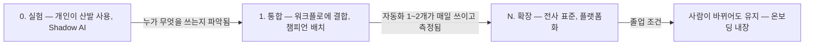
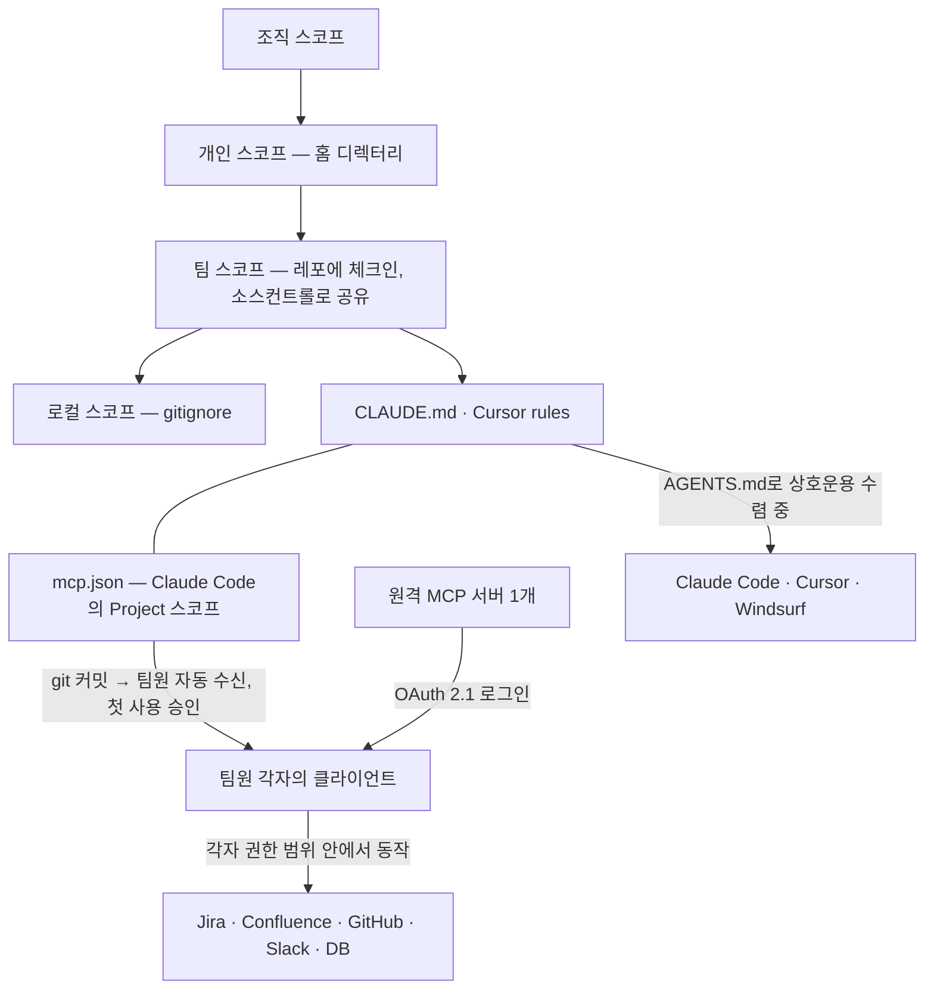
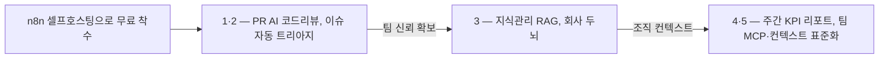
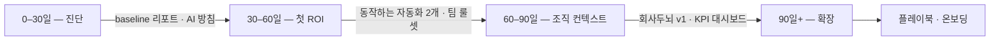

이 글이 옮기는 원 자료는 자기 핵심 명제를 한 문장으로 못 박아 두었다. **모델 품질은 더 이상 병목이 아니고, 에이전트가 프로덕션에서 실패하는 진짜 이유는 조직 컨텍스트(organizational context)의 부재다.**

그 문장이 옳다면 다음에 살 것은 더 좋은 모델이 아니라 **팀이 함께 쓰는 인프라**가 된다. 원 자료가 공통 인프라로 묶은 것은 넷이다 — 워크플로 자동화, 지식관리로 만드는 「회사 두뇌」, 팀 컨텍스트 공유의 표준, 그리고 공유 프롬프트 라이브러리와 레포 체크인 컨텍스트. 여기에 그 넷을 **언제 어떤 순서로 까는가**를 체감 ROI 다섯과 기간별 네 단계로 적었다.

이 글은 그 둘을 함께 싣는다. 인프라 넷이 무엇인지, 그리고 그것을 어느 순서로 세우는지다.

## 용어 정리

원 자료가 설명 없이 쓰는 어휘 가운데 본문에서 실제로 쓰이는 것만 먼저 모았다.

| 용어 | 영문·원어 | 뜻 |
|---|---|---|
| **Shadow AI** | Shadow AI | 조직이 파악하지 못한 채 개인이 몰래 쓰는 AI 도구·계정. 성숙도 0단계의 상태 표현 |
| **챔피언** | Champion | 팀 안에서 도입을 앞장서 끌고 가도록 지정한 소수 인원 |
| **이네이블먼트** | Enablement | 팀이 스스로 쓸 수 있게 만드는 자산·교육·지원 기능. 원 자료는 확장 단계의 전담 조직과 자산화를 이 이름으로 부른다 |
| **baseline** | Baseline | 개선을 재기 위해 착수 전에 찍어 두는 기준선 수치 |
| **청킹** | Chunking | 문서를 검색 단위로 잘게 나누는 사전처리 |
| **top-k** | Top-k | 검색에서 상위 몇 건을 가져올지 정하는 개수 파라미터 |
| **pgvector** | pgvector | PostgreSQL에 벡터 검색을 더하는 확장. 별도 벡터DB 없이 기존 DB를 쓰게 한다 |
| **MCP** | Model Context Protocol | AI와 도구를 잇는 개방 표준 |
| **Streamable HTTP** | Streamable HTTP | 원격 MCP 서버가 쓰는 전송 방식 |
| **OAuth 2.1** | OAuth 2.1 | 팀원이 각자 계정으로 원격 서버에 로그인해 자기 권한만 받는 인증 규격 |
| **RBAC** | Role-Based Access Control | 역할 단위로 권한을 부여하는 접근 제어 |
| **폴백** | Fallback | 1차 수단이 부족할 때 상위·대체 수단으로 넘기는 구조 |
| **오버라이드율** | Override Rate | AI의 판정을 사람이 뒤집은 비율. 분류 정확도를 사후에 재는 지표 |
| **LLM-as-judge** | LLM as a Judge | 출력 품질을 사람 대신 다른 LLM이 채점하게 하는 평가 방식 |
| **tool sprawl** | Tool Sprawl | 도구가 통제 없이 늘어나 중복·사각지대가 생기는 상태 |
| **churn** | Code Churn | 작성 직후 다시 고쳐지거나 버려지는 코드의 비율 |
| **램프업** | Ramp-up | 새 도구·방식을 들인 뒤 완전한 생산성에 이르기까지, 생산성이 일시적으로 떨어지는 구간 |

## 이 글이 서 있는 층위

MCP도 RAG도 이 블로그에 이미 여러 편이 있다. 겹치는 것은 **이름이지 층위가 아니다.**

| 소재 | 이미 실린 층위 | 이 글의 층위 |
|---|---|---|
| **MCP** | 프로토콜 구조, 도구 선별 기준, 인증·권한 설계, 도구 하나가 먹는 토큰 예산 — [MCP 도입은 기능 추가가 아니라 예산 배분이다](/blog/agentic-coding/mcp-selection-practice/) | 팀원 전원이 **같은 도구 목록을 같은 방식으로 받게 하는** 조직 공유 표준 |
| **RAG** | 문서 로드·분할부터 임베딩·검색기·리랭커까지의 구현 — [RAG 파이프라인 (1)](/blog/rag/rag-pipeline-ingestion/) · [(2)](/blog/rag/rag-pipeline-retrieval/) | 사내 문서를 **팀의 공용 두뇌로 둘 것인가**, 둔다면 무엇을 사고 무엇을 짓는가 |
| **도입 사례·실행 프레임워크** | 금융권 도입 지표와 6주 사이클 — [역할을 세 층으로 다시 나눈다](/blog/ai-agent/enterprise-ai-adoption-actions/) | 작은 팀 규모에서 **무엇부터 까는가**의 순서와 중단 기준 |
| **병목이 어디로 옮겨 갔는가** | 프롬프트 → RAG → 에이전트 → MCP로 이어진 기술 수요의 이동 — [LLM 앱 개발의 병목은 네 번 옮겨 갔다](/blog/ai-agent/llm-app-bottleneck-shift/) | 같은 질문을 **조직 쪽에서** 본다 — 남은 병목이 조직 컨텍스트라는 명제 |

그래서 이 글은 청크 크기나 리랭커를 다시 설명하지 않는다. 그 자리는 위 링크에 있고, 여기서는 **팀이 사내 지식을 어떻게 관리하는가**만 남긴다.

### 전제해 둘 것 둘

**첫째, 원 자료가 잡은 타깃은 범용 스타트업이다.** 작은 팀, 빠른 도입, 저비용 셀프호스팅 우선이라고 스스로 적었다. 아래의 비용 수치와 도입 순서는 전부 그 전제 위에 있다.

**둘째, 원 자료는 자기가 나열한 SaaS 목록에 스스로 단서를 달았다.** 단계마다 SaaS를 따로 사기 전에 더 얇은 레퍼런스 아키텍처를 먼저 보라는 것이고, 여기 실린 SaaS 상당수는 하네스와 Skills 쪽으로 흡수되므로 **이 목록은 대안·벤치마크 카탈로그로 쓰는 것이 맞다**는 것이다. 팀 지식도 1순위는 LLM 위키이고 RAG는 규모가 그것을 넘을 때라는 단서까지 붙어 있다. 그 얇은 쪽 아키텍처는 [하네스·위키·게이트 세 레이어와 Skill 카탈로그 열하나](/blog/ai-transformation/lean-three-layer-harness/)가 다룬다.

두 단서를 지운 채로 아래 표를 읽으면 「전부 사라」로 읽히는데, 원 자료는 그렇게 쓰지 않았다.

## 성숙도 0 → 1 → N

원 자료의 성숙도 모델은 세 단계이고, 다른 성숙도 모델과 다른 점은 마지막 열이다. **단계마다 졸업 조건이 붙어 있다.**

| 단계 | 상태 | 핵심 활동 | 졸업 조건 |
|---|---|---|---|
| **0. 실험** | 개인이 산발 사용, Shadow AI | 가시성 확보, 안전한 샌드박스, AI 방침 초안 | "누가 무엇을 쓰는지" 파악됨 |
| **1. 통합** | 워크플로에 결합, 챔피언 배치 | 거버넌스·가드레일, 검증된 플레이북, KPI 정의 | 1~2개 자동화가 매일 쓰이고 측정됨 |
| **N. 확장** | 전사 표준·플랫폼화 | 이네이블먼트팀, 공통 자산(프롬프트·eval·MCP) | 사람 바뀌어도 유지(온보딩 내장) |

졸업 조건을 화살표와 도착점에 놓으면 이렇게 된다.

세 조건을 나란히 놓으면 재는 대상이 **사용량만이 아니다.** 0단계의 졸업은 「파악됨」, 1단계는 「매일 쓰이고 **측정됨**」, N단계는 「**사람이 바뀌어도** 유지됨」이다. 개수가 들어가는 것은 1단계 하나(자동화 1~2개)이고, 그 조건도 개수만으로는 닫히지 않는다. 이 읽기는 이 글의 정리다.

원 자료는 이 세 단계를 관통하는 축도 한 줄로 적었다.

> Visibility → Governance → Workflow Integration → KPI Tracking → Scaling

### 같은 표가 두 자리에 있고 「N. 확장」이 다르다

이 성숙도 표는 원 자료 안에 **두 번** 나온다. 이 글이 옮기는 문서에는 위와 같이 졸업 조건까지 네 열로, 사례집 쪽 문서에는 졸업 조건 없이 세 열로 실려 있다. 두 판본은 「1. 통합」 행이 축자로 완전히 같은데, 나머지 두 행이 갈린다.

| 행 | 이 글이 옮긴 판본의 핵심 활동 | 사례집 쪽 판본의 핵심 활동 |
|---|---|---|
| **0. 실험** | 가시성 확보, 안전한 샌드박스, **AI 방침 초안** | 가시성 확보, 안전한 샌드박스 |
| **1. 통합** | 거버넌스·가드레일, 검증된 플레이북, KPI 정의 | (축자 동일) |
| **N. 확장** | **이네이블먼트팀, 공통 자산**(프롬프트·eval·MCP) | **전략·인재·운영모델·기술·데이터·채택 동시 적용** |

「N. 확장」의 두 서술은 서로를 대체하지 않는다. 한쪽은 **누가 무엇을 들고 있는가**(전담 팀과 공통 자산)를, 다른 쪽은 **무엇을 동시에 건드려야 하는가**(여섯 축)를 적었다. 그래서 여기서는 둘 다 싣는다 — 어느 쪽이 옳은 판본인지는 이 글이 가리지 않는다. 같은 모델의 두 기재가 다른 것을 적고 있다는 것까지가 확인되는 것이고, 이 대조는 이 글의 정리다.

### 출처는 이 문서 밖에 있다

위의 다섯 단계 축 문장은 이 글이 옮기는 문서에서는 **출처 없이** 실려 있다. 같은 문장이 사례집 쪽 문서에 실린 자리에는 출처 두 개가 붙어 있다.

- [Heinz Marketing — AI maturity for enterprise B2B](https://www.heinzmarketing.com/blog/ai-maturity-for-enterprise-b2b-2026/)
- [PUNKU.AI — State of AI 2024, enterprise adoption](https://www.punku.ai/blog/state-of-ai-2024-enterprise-adoption)

**한쪽 문서만 보면 이 모델은 자체 정의로 보인다.** 실제로는 그렇지 않다는 것이 두 문서를 대 보아 확인되는 것이고, 위 두 링크가 붙어 있는 자리는 성숙도 표가 아니라 그 **다섯 단계 축 문장**이다.

### 다른 문서의 3단 모델과의 대응

원 자료는 이 세 단계를 자기가 따로 세운 3단 모델에 하나씩 대응시켜 둔다 — **0 = L1 개인기 가시화, 1 = L2 팀 시스템, N = L3 조직 역량.** 아래에서 다루는 공유 인프라는 그 대응에서 **L2에서 L3으로 넘어가는 물리적 토대**에 해당한다고 적혀 있다.

L1·L2·L3 3단 모델 자체는 이 글의 범위가 아니다. 같은 원 자료의 조직 편을 옮긴 [빌더에서 오케스트레이터로 가는 조직 설계](/blog/ai-transformation/builder-to-orchestrator-shift/) 편이 그 모델을 싣는다.

## 팀이 공유하는 인프라 넷

넷은 서로 독립적이지 않다. 워크플로 자동화가 MCP를 양방향으로 물고, 지식관리가 워크플로 안에서도 돌고, 컨텍스트 파일과 MCP 설정이 같은 레포에 체크인된다. 아래에서 하나씩 본다.

### n8n — 워크플로 자동화

원 자료가 첫 자리에 둔 것은 워크플로 자동화이고, 도구는 n8n이다. 근거는 **공식 템플릿을 import해 자격증명만 연결하면 바로 도는 워크플로가 이미 번호 매겨진 공개 자산으로 있다**는 것이다.

| 워크플로우 | 결합 | ROI |
|---|---|---|
| **이슈 자동 트리아지** | GitHub Trigger→AI(JSON 분류: 우선순위·카테고리·담당)→라벨→Slack 라우팅→Linear/Jira | 분류당 ~$0.001(GPT-4o-mini), 주 2~4h 절감 |
| **PR AI 코드리뷰+Slack** | PR 웹훅→diff→AI 리뷰(버그·보안·성능)→GitHub 코멘트→DB 로그→Slack 고심각도 | 리뷰 1차 부하·머지 리드타임↓ |
| **고객문의 라우팅** | Zendesk/Intercom Trigger→AI 분류(category·confidence·reason)→팀 배정→Slack/ClickUp | 분류 태그로 정확도 측정 |
| **주간 KPI 리포트** | Schedule→GA4·Amplitude·Sheets 수집→집계→Slack/Gmail 요약 | 반복 리포트 제거, 경영진 가시성 |
| **인시던트/온콜** | 모니터링 알림→severity 분류→Port AI 카탈로그 조회→컨텍스트 보강 Jira→critical 에스컬레이션 | 노이즈↓, 대응 컨텍스트 자동화 |

출처는 [n8n.io/workflows](https://n8n.io/workflows)의 공식 템플릿이다.

다섯 행의 가운데 열을 세로로 읽으면 **AI에게 맡긴 일이 분류 셋, 리뷰 하나, 요약 하나**로 갈린다. 이슈 트리아지·고객문의 라우팅·인시던트 severity가 분류이고, PR 코드리뷰가 리뷰, 주간 KPI가 요약이다. 이 배정은 이 글의 정리다.

그리고 **다섯 중 넷이 Slack을 거치거나 Slack에서 끝난다.** 남은 하나(인시던트)는 마지막 단계가 「critical 에스컬레이션」이라고만 적혀 있다.

#### LLM을 어디에 물리는가

| 패턴 | 무엇 |
|---|---|
| **AI Agent 노드** | LangChain JS 기반, 70+ AI 노드. **AI Agent Tool 노드(2.0)** 와 함께 멀티에이전트 오케스트레이션 + persistent memory |
| **MCP 양방향** | `MCP Server Trigger`(n8n 워크플로를 MCP 툴로 노출) ↔ `MCP Client Tool`(외부 MCP 호출). `czlonkowski/n8n-mcp`로 Claude·Cursor가 워크플로를 대신 빌드 |
| **분류·라우팅** | 프롬프트가 **JSON 반환**(`category`/`confidence`/`reason`) → `Switch` 라우팅 → 태그로 정확도·오버라이드율 측정. 대량은 저비용 GPT-4o-mini, 정밀은 상위 모델 폴백 |
| **RAG** | Drive 트리거→청킹→임베딩→벡터 저장 / AI Agent 유사도 검색→출처 인용. 벡터DB 교체 자유(Qdrant↔Pinecone↔Supabase), 완전 로컬은 Ollama+Qdrant |

세 번째 행이 앞의 표에서 센 「분류 셋」과 정확히 맞물린다. **분류를 자연어로 받지 않고 JSON으로 받는 이유**가 여기 적혀 있다 — 반환 필드가 그대로 라우팅 조건이 되고, 붙은 태그가 나중에 정확도와 오버라이드율을 재는 재료가 된다. 분류를 자동화하면서 정확도를 재지 않으면 그 자동화는 1단계의 졸업 조건인 「측정됨」을 만족하지 못한다.

#### n8n · Make · Zapier

| 축 | **n8n** | Make | Zapier |
|---|---|---|---|
| 셀프호스팅 | ✅ 유일(오픈소스) | ❌ | ❌ |
| 과금 | **워크플로 1회=1 execution**(노드 무관) | operation당 | task당 |
| AI 깊이 | 최상(LangChain·멀티에이전트·MCP·셀프호스트 LLM) | 중간 | 최저 진입장벽 |

원 자료의 선택 기준은 **데이터 주권 + 대량 실행 비용 + AI 깊이**가 핵심이면 n8n이다. 셀프호스팅 Community 에디션은 무료·무제한 실행이고, 실비는 통상 **$5~7/월 VPS**다. 다만 n8n Cloud의 영구 무료 요금제는 폐지됐으므로 **무료 경로는 셀프호스팅이 유일하다**는 단서가 붙는다.

과금 축이 AI 워크플로에서 특히 갈리는 이유는 노드 수에 있다. 위 다섯 템플릿은 트리거부터 알림까지 노드가 여러 개씩 이어지는데, **실행 1회를 1로 세는 과금**과 operation·task 단위로 세는 과금은 같은 워크플로에서 청구액이 다르게 붙는다.

#### GitHub Trigger가 전제된다

위 PR·이슈 워크플로는 전부 GitHub Trigger를 전제한다. AWS CodeCommit을 쓰는 팀이면 GitHub 노드가 그대로 쓰이지 않으므로, 원 자료는 **EventBridge(`PR State Change`) → Lambda 또는 n8n → LLM → CodeCommit `PostCommentForPullRequest`** 의 동등 구성을 대안으로 적었다. 매니지드 쪽(CodeGuru·Q)은 신규 사용이 막혀 있어 대체재가 되지 않는다.

**CodeCommit은 2025-11-24 GA로 복귀했다.** 원 자료는 이 시점을 기준으로 플랫폼 리스크는 해소됐다고 보고, 그 이후의 이전은 *생태계 도구를 쓰기 위한 목적*일 때만 의미가 있다고 적었다.

이 단서는 뒤에서 볼 기간별 도입 순서의 30–60일 구간에도 그대로 걸린다 — 그 구간의 첫 액션이 바로 PR AI 코드리뷰이기 때문이다.

### 회사 두뇌 — 지식관리

두 번째 인프라는 사내 지식을 하나의 검색·응답 계층으로 묶는 것이고, 원 자료는 이것을 **「회사 두뇌」** 라 부른다. 갈래는 둘이다 — 완성형 SaaS를 사거나, 직접 짓거나.

| 완성형 SaaS (즉시 검색/Q&A) | 비용 대략 |
|---|---|
| **Glean**(전사 권한인식 통합검색+에이전트) | 검색 ~$50+/user, 구축비 $2만~ |
| **Notion AI / Q&A**(워크스페이스 Q&A) | Business ~$20(AI 번들) |
| **Dust.tt**(커스텀 에이전트 빌더) | Pro €29/user |
| **Guru**(검증 워크플로 강조) | $25/user |
| **MS 365 Copilot / Slack AI** | ~$21 / ~$15 |

가격은 원 자료 작성 기준일(2026-06-15) 시점의 대략값이다.

#### 직접 짓는 쪽

표준 파이프라인은 한 줄로 적혀 있다.

`수집 → 청킹 → 임베딩 → 벡터DB → 검색(top-k) → LLM 컨텍스트 주입(출처 인용)`

여기서 조직 운영에 직접 걸리는 성질은 **갱신 방식**이다. 문서가 바뀌면 **해당 청크만 재임베딩**하면 되고 재학습이 필요 없다. 사내 문서가 매주 바뀌는 조직에서 이 성질이 곧 유지비다.

| 레이어 | 추천 | 비고 |
|---|---|---|
| 프레임워크 | LlamaIndex(+LlamaParse, **한글 표·PDF 강점**) / LangChain·LangGraph(1.0 GA) | LangSmith 트레이싱 |
| 벡터DB | **pgvector**(기존 Postgres 확장, 무료) | 사내 KM(수만~수십만 청크)엔 사실상 최적 — SQL로 권한필터·하이브리드검색 |
| 임베딩 | OpenAI 3-small($0.02/1M) / Cohere(한국어) / **BGE-M3·e5**(OSS, $0, 외부유출 0) | 비공개 사내문서는 OSS 셀프호스트 |

pgvector에 붙은 근거는 하나가 아니다. 원 자료는 **기존 Postgres 확장이라 무료**라는 것과 **SQL로 권한필터·하이브리드검색을 그대로 쓴다**는 것을 함께 들었고, 이 조합이 사내 지식관리(수만~수십만 청크)에 사실상 최적이라고 적었다. 사내 지식은 「누가 무엇을 볼 수 있는가」가 검색 결과에 반영돼야 하는데, 기존 Postgres 확장이면 그 필터를 SQL로 그대로 쓴다. 별도 벡터DB를 세우면 권한 정보를 한 번 더 옮겨 놓아야 한다.

원 자료가 「데이터 주권 우선 풀스택」으로 지목한 조합은 **OSS 임베딩(BGE·e5) + pgvector + LangChain(필요하면 LangGraph) + Langfuse(OSS 관측)** 다. PDF와 표가 까다로우면 LlamaParse 무료 크레딧으로 시작하라는 단서가 붙는다.

#### RAG · 파인튜닝 · 롱컨텍스트

| 기준 | RAG | 파인튜닝 | 롱컨텍스트 |
|---|---|---|---|
| 신선도 | **즉시** | 재학습 필요 | 매 질의 재투입 |
| 출처/인용 | **강함** | 약함 | 부분적 |
| 비용 | **낮음** | 초기 학습비↑ | 20~24x↑ |
| 적합 | 자주 바뀌는 지식·투명성 | 말투·코드패턴 | 길고 정적인 단일 문서 |

사내 지식관리에 RAG가 지목되는 근거는 네 행 중 위 셋이다 — 신선도, 출처·인용, 비용. 여기에 권한필터와 데이터 주권이 더해진다.

그리고 원 자료는 **RAG와 롱컨텍스트를 대립으로 두지 않는다.** 2024~2025년의 컨센서스로 둘을 보완 관계라 적고, **RAG로 후보를 좁혀 롱컨텍스트 창에 투입**하는 결합을 제시한다. 표의 RAG와 롱컨텍스트 두 열이 배타 선택지가 아니라는 뜻이다.

기술 쪽 세부 — 청크 크기, 검색기 종류, 리랭커 — 는 [RAG 파이프라인 (1)](/blog/rag/rag-pipeline-ingestion/) · [(2)](/blog/rag/rag-pipeline-retrieval/) 편이 이미 다뤘다. 여기서 남는 판단은 **살 것인가 지을 것인가**, 그리고 **어느 계층에 권한을 걸 것인가**다. 다만 그 앞에 원 자료가 붙인 단서가 하나 더 있다 — 팀 지식의 1순위는 LLM 위키이고, RAG는 규모가 그것을 넘을 때다.

### MCP — 팀 컨텍스트 공유의 표준

세 번째는 MCP다. 다만 이 글에서 MCP는 도구 선택 문제가 아니라 **배포 문제**로 다뤄진다 — 팀원 열 명이 각자 다른 도구 목록을 들고 있으면 그것은 공유 인프라가 아니기 때문이다.

| 항목 | 내용 |
|---|---|
| **표준** | MCP는 AI와 도구를 잇는 개방 표준("AI용 USB-C"). Anthropic 2024-11 발표 → **2025-12 Linux Foundation 기부로 벤더 중립 확정**(OpenAI·Google·MS 채택) → 종속 리스크가 낮다 |
| **내부 도구 연결** | 벤더 공식 원격 서버를 권장 — Atlassian Rovo Remote MCP(Jira·Confluence, OAuth), GitHub 공식 MCP, Slack(커뮤니티), DB(자격증명은 env 주입, **VCS 커밋 금지**) |
| **원격 MCP = 팀 공유의 핵심** | Streamable HTTP 전송 + OAuth 2.1. **원격 서버 1개 + 팀원 각자 OAuth 로그인** → 각자 권한 범위 안에서만 동작 |
| **Claude Code 팀 공유 = Project 스코프** | `.mcp.json`을 레포 루트에 **git 커밋**하면 팀원이 자동 수신(첫 사용 시 승인). 비밀값은 `${VAR}` 로컬 env. Cursor는 `.cursor/mcp.json` |
| **거버넌스** | Official MCP Registry + MCP Gateway(인증·RBAC·감사로깅). 소규모는 Docker MCP Gateway |

원 자료는 이 다섯을 계층으로 이름 붙이지 않고 나란한 다섯 항목으로 적었다. 위 표는 그 다섯을 그대로 옮긴 것이고, 순서도 바꾸지 않았다.

세 번째 행이 이 절의 요점이다. **서버는 하나이고 계정은 각자다.** 그래서 같은 도구 목록을 공유하면서도 권한은 개인별로 갈린다 — 팀 공유와 최소권한이 충돌하지 않는 구성이다.

도구를 무엇으로 고를지, 하나가 컨텍스트를 얼마나 먹는지는 [MCP 도입은 기능 추가가 아니라 예산 배분이다](/blog/agentic-coding/mcp-selection-practice/) 편이 다룬다. 이 글이 보는 것은 **고른 뒤에 그것을 어떻게 팀 전체에 같은 모양으로 깔 것인가**다.

### 공유 프롬프트 라이브러리와 레포 컨텍스트

넷째는 프롬프트와 컨텍스트를 개인 자산에서 팀 자산으로 옮기는 자리다. 두 갈래가 있다 — 별도 도구를 쓰거나, 레포에 체크인하거나.

| 도구 | 무엇에 | 비용 |
|---|---|---|
| **Langfuse**(OSS) | LLM 옵저버빌리티 + 프롬프트 중앙관리(라벨·diff·Playground) | 셀프호스팅 무료 |
| **PromptLayer** | 비엔지니어 협업, Release labels로 재배포 없이 롤아웃 | Pro $49 |
| **PromptHub** | Git식(브랜치·PR·리뷰·audit) | Team $20/user |
| **Latitude**(OSS) | 프롬프트를 API 엔드포인트로 배포, LLM-as-judge | MIT 셀프호스팅 |

가격은 원 자료 작성 기준일(2026-06-15) 시점 값이다.

레포 체크인 쪽은 도구를 사지 않는 대신 **소스컨트롤을 공유 지점으로 쓴다.**

- **CLAUDE.md 계층**: 조직 → 개인(`~/.claude/`) → **팀(`./CLAUDE.md`, 소스컨트롤 공유)** → 로컬(gitignore). `@path` import, `.claude/rules/`의 글롭 조건 로드, 권장 200줄 이하. 이 숫자를 무엇으로 읽어야 하는지는 [200줄은 상한이 아니라 임계다](/blog/agentic-coding/claude-md-scope-layers/) 편이 다룬다.
- **Cursor rules**: `.cursor/rules/*.mdc` 4타입. **표준이 수렴 중이다** — 양 도구가 `AGENTS.md`(범용 에이전트 지시 파일)로 상호운용에 수렴하고 있어, 한 파일로 Claude Code·Cursor·Windsurf를 함께 덮을 수 있다.

앞 절의 `.mcp.json`과 이 절의 `CLAUDE.md`가 **같은 레포에 함께 커밋된다**는 점이 이 넷째 인프라의 구조다. 도식으로 놓으면 이렇다.

왼쪽 세로줄은 **스코프의 우선순위**다. 네 칸 가운데 소스컨트롤 공유가 명시된 것은 팀 한 칸이고, 개인은 홈 디렉터리, 로컬은 gitignore이며, 조직 스코프에는 그 표기가 붙어 있지 않다. 오른쪽의 `.mcp.json`은 이 계층이 아니라 **Claude Code의 Project 스코프**로 적혀 있다(앞 MCP 표의 넷째 행). 두 파일을 잇는 것은 계층이 아니라 **같은 레포**다.

## 어떤 순서로 까는가

인프라 넷을 동시에 세울 수는 없다. 원 자료는 순서를 **두 축**으로 적었다 — 체감 ROI 순서와 기간별 단계다. 둘은 같은 것을 다르게 자른 것이 아니라, 실제로 다른 목록이다.

### 체감 순서 — ROI 높은 다섯

| 순위 | 자동화 | 왜 먼저 |
|---|---|---|
| **1** | **PR AI 코드리뷰**(CodeRabbit 또는 n8n+LLM) | 매일 체감, 리드타임·버그 조기발견. 셀프호스팅이면 거의 무료 |
| **2** | **GitHub 이슈 자동 트리아지**(n8n) | 주 2~4h 절감, 분류당 ~$0.001. 공식 템플릿 즉시 |
| **3** | **지식관리 RAG / 회사 두뇌**(pgvector+LangChain) | 온보딩·반복질문 제거. 기존 PG 위면 인프라 0, 외부유출 0 |
| **4** | **주간 KPI 리포트 자동 발송**(n8n) | 반복 수작업 제거, 경영진 가시성 즉시 |
| **5** | **팀 MCP + 컨텍스트 파일 표준화** | 모든 개발자·에이전트가 동일 컨텍스트 → AI 코딩 품질 상향 평준화. 비용 ~0 |

다섯을 잇는 전략은 원 자료가 한 줄로 적었다.

**순서의 근거가 각 단계마다 다르다.** 앞의 둘은 팀의 신뢰를 사는 것이고, 셋째는 조직 컨텍스트를 만드는 것이며, 넷째·다섯째는 운영과 표준화다. 그리고 전 단계에 걸쳐 **"AI = 초안·분석, 사람 = 승인·정책"** 게이트를 유지하라는 조건이 붙어 있다 — 순서가 진행돼도 이 게이트는 내려가지 않는다.

### 기간별 네 단계

| 기간 | 단계 | 액션 | 산출물 |
|---|---|---|---|
| **0–30일** | 진단 | 리드타임·재작업·결함률 baseline 측정 / Shadow AI 인벤토리 / AI 방침 v0 / 챔피언 1~2명 | baseline 리포트, AI 방침 |
| **30–60일** | 첫 ROI | n8n 셀프호스팅 → PR AI 코드리뷰 + 이슈 트리아지 / PR 게이트 리뷰 의무화 / CLAUDE.md·Cursor rules 레포 표준화 | 동작하는 자동화 2개, 팀 룰셋 |
| **60–90일** | 조직 컨텍스트 | pgvector 회사두뇌(사내 Q&A·출처인용) / 팀 스코프 MCP(원격+OAuth) / KPI 대시보드 / 확대·중단 기준 합의 | 회사두뇌 v1, KPI 대시보드 |
| **90일+** | 확장 | 마케팅·경쟁사분석 등 도메인 확대 / 이네이블먼트 자산화 / 온보딩 내장 | 플레이북, 온보딩 |

산출물을 화살표에 얹으면 각 구간이 다음 구간에 무엇을 넘기는지가 보인다.

**첫 구간에는 도구가 하나도 없다.** 액션 넷 중 셋이 측정하거나 파악하거나 문서화하는 일이고, 나머지 하나는 챔피언 1~2명을 정하는 일이다. 만들어지는 것은 baseline 리포트와 AI 방침 문서다. baseline 없이 착수한 자동화는 나중에 효과를 증명할 수 없고, 그러면 1단계의 졸업 조건인 「측정됨」이 성립하지 않는다.

**비용 가드레일**은 이 순서 전체에 걸린다. n8n 셀프호스팅($5~7/월 VPS) + pgvector(기존 PG, $0) + OSS 임베딩(BGE·e5, $0)이면 *거의 무료로 착수*할 수 있고, 유료 SaaS는 **효과를 측정한 뒤 ROI가 확인된 곳에만** 넣는다. 앞의 n8n 절과 여기가 같은 $5~7/월을 말하는데, 원 자료에서 이 수치는 세 자리에 반복해 나온다 — 착수 비용이 이 로드맵의 전제라는 뜻이다.

### 두 순서를 대 보면

ROI 다섯과 기간 네 단계를 대 보면 대응이 완전하지 않다. 다섯 중 넷은 로드맵의 액션 열에 **이름 그대로** 들어 있는데, 그중 하나는 두 구간에 쪼개져 있고, 남은 하나는 아예 다른 산출물로 잡혀 있다.

| ROI 순위 | 로드맵에서의 자리 | 판정 |
|---|---|---|
| **1. PR AI 코드리뷰** | 30–60일 액션에 축자 등장 | ✅ 일치 |
| **2. 이슈 자동 트리아지** | 30–60일 액션에 등장 | ✅ 일치 |
| **3. 지식관리 RAG / 회사 두뇌** | 60–90일 「pgvector 회사두뇌」 | ✅ 일치 |
| **4. 주간 KPI 리포트 자동 발송** | 60–90일에는 「KPI 대시보드」가 있다 | ⚠️ **다른 산출물이다** — 정기 발송과 대시보드는 같지 않다 |
| **5. 팀 MCP + 컨텍스트 파일 표준화** | 30–60일 「CLAUDE.md·Cursor rules 레포 표준화」 + 60–90일 「팀 스코프 MCP」 | ⚠️ **두 구간에 쪼개져 있다** |

이 대조는 이 글의 정리다. 한 구간에 그대로 대응하는 것은 셋이고, 하나는 산출물이 갈리며, 하나는 두 구간으로 나뉜다. 그리고 로드맵의 첫 구간(0–30일)과 마지막 구간(90일+)에는 다섯 중 어느 것도 배정되지 않는다 — 앞은 측정이고 뒤는 자산화이기 때문이다.

## 무엇을 재는가

원 자료가 KPI 절에 붙인 제목은 **「측정 = 최강 예측변수」** 다. 근거로 든 것은 McKinsey 조사다 — 구조적으로 측정하는 조직이 AI 가치를 3~4배 포착하는데, **KPI를 실제로 추적하는 곳은 20% 미만**이고, 따라서 추적 여부 자체가 손익 임팩트의 가장 강한 예측 인자라는 것이다. 이 두 수치의 출처와 맥락은 [빌더에서 오케스트레이터로 가는 조직 설계](/blog/ai-transformation/builder-to-orchestrator-shift/) 편에 있다.

| 분류 | 지표 | 주의 |
|---|---|---|
| **속도** | 리드타임(이슈→배포), 인당 병합 코드량, 과제 완료 시간 | 단독으로 보면 함정 |
| **안정성** | 변경 실패율, 롤백·재작업률, 2주 내 폐기 코드 | 속도와 *반드시 함께* |
| **품질** | 결함률, 리뷰 부담(리뷰 시간·PR 크기), 보안 취약점 | AI는 리뷰 부담을 키울 수 있음 |
| **채택·체감** | 활성 사용률, 체감 생산성 설문, 온보딩 시간 | 사용량 자체를 KPI로 삼지 않기 |

네 행의 주의 열을 세로로 읽으면 셋이 같은 형태의 경고다 — **단독으로 보지 마라, 함께 보라, 사용량을 목표로 삼지 마라.** 네 분류를 나눈 목적이 분류 자체보다 **짝지어 보게 하는 데** 있다고 읽히는데, 이 읽기는 이 글의 정리다.

### 중단 기준

원 자료가 명문화하라고 적은 조건은 하나다.

> **채택률은 올라가는데 리뷰 시간·취약점·롤백·재작업도 함께 올라가면 롤아웃을 중단하거나 축소한다.**

중단 기준을 미리 문서로 정해 두는 것은 위 로드맵의 60–90일 **액션**에도 「확대·중단 기준 합의」로 들어가 있다. 기준을 나중에 정하면 이미 깔린 도구를 걷는 결정이 되고, 그때는 판단이 아니라 협상이 된다.

한국 현업에서도 커밋 수보다 리드타임과 정성 지표를 더 신뢰한다는 관찰이 이 절에 함께 적혀 있다. 그 근거와 출처, 그리고 위 중단 기준의 출처는 [빌더에서 오케스트레이터로 가는 조직 설계](/blog/ai-transformation/builder-to-orchestrator-shift/) 편에 있다.

## 미리 피하는 실패요인 다섯

| 실패 | 근거 | 회피책 |
|---|---|---|
| 파일럿 ROI 미달 95% | MIT GenAI Divide | 모델이 아니라 *워크플로 통합·측정*에 집중, 백오피스 자동화부터 |
| 투자 72%가 가치 파괴 | McKinsey | tool sprawl·Shadow AI 차단, 중앙 게이트웨이 |
| 코드 품질 저하(중복·churn 2배) | GitClear | PR 게이트·리팩터 규율 |
| 램프업 비용 무시 | MS·GitHub(~11주) | 초기 하락을 예산에 넣고, 조급한 판단 금지 |
| 지표 게이밍 | Pragmatic Eng | 사용량을 KPI로 삼지 않기 |

회피책 열 다섯 중 셋이 앞의 절들과 맞물린다. 두 번째 행의 「중앙 게이트웨이」에 대응하는 자리에 MCP 절의 MCP Gateway가 있고, 세 번째의 「PR 게이트」는 로드맵 30–60일의 액션이며, 다섯째의 「사용량을 KPI로 삼지 않기」는 KPI 표 넷째 행의 주의와 같은 것을 말한다. 이 대응은 이 글의 정리다.

### 출처에 대해

이 다섯의 근거 열에는 기관 이름만 있고 링크가 없다. 이 글이 옮긴 두 문서를 통틀어 외부 링크는 **하나뿐**이다 — 위 n8n 워크플로 표에 붙은 n8n 공식 템플릿 주소다. 성숙도 절에서 붙인 Heinz Marketing·PUNKU.AI 두 링크도 이 두 문서가 아니라 사례집 쪽 문서에서 가져온 것이다.

MIT·McKinsey·GitClear 등 위 다섯 기관의 수치와 그 맥락은 같은 원 자료의 사례집을 옮긴 [빌더에서 오케스트레이터로 가는 조직 설계](/blog/ai-transformation/builder-to-orchestrator-shift/) 편이 다룬다. 여기서는 **원 자료가 근거로 든 기관 이름** 이상으로 귀속을 올리지 않는다.

## 이 글이 다루지 않은 것

| 무엇 | 어디 |
|---|---|
| 개인기 → 팀 시스템 → 조직 역량 3단 모델, 역할 재정의, 조직 구조, 거버넌스, 기업 사례 | [빌더에서 오케스트레이터로 가는 조직 설계](/blog/ai-transformation/builder-to-orchestrator-shift/) |
| RAG 구현 세부 — 문서 로드·분할·임베딩·검색기·리랭커 | [RAG 파이프라인 (1)](/blog/rag/rag-pipeline-ingestion/) · [(2)](/blog/rag/rag-pipeline-retrieval/) |
| MCP 도구 선별 기준·인증 설계·토큰 예산 | [MCP 도입은 기능 추가가 아니라 예산 배분이다](/blog/agentic-coding/mcp-selection-practice/) |
| 도입 사례의 정량 지표와 6주 실행 사이클 | [역할을 세 층으로 다시 나눈다](/blog/ai-agent/enterprise-ai-adoption-actions/) |
| 부서 단위로 업무를 에이전트에 쪼개는 설계 | [부서 이름을 지우면 같은 5단계가 남는다](/blog/ai-transformation/department-agent-blueprint/) |
| SaaS 목록을 하네스·Skills로 걷어내는 얇은 아키텍처 | [하네스·위키·게이트 세 레이어와 Skill 카탈로그 열하나](/blog/ai-transformation/lean-three-layer-harness/) |
| 다른 규모·업종에 맞춘 변주 | 이 글의 범위 밖 — 원 자료가 전제한 타깃은 범용 스타트업이다 |

인프라 넷 가운데 셋 — 워크플로 자동화·회사 두뇌·프롬프트 라이브러리 — 에는 **무엇을 살 것인가**의 선택지가 표로 붙어 있다. 남은 하나인 MCP 절에는 그 표가 없다. 벤더 공식 원격 서버와 게이트웨이가 이름으로 나열될 뿐 비교표가 서지 않는다.

그리고 ROI 다섯의 「왜 먼저」 열을 세로로 읽으면 앞의 넷은 근거에 **덜어내는 것**이 하나씩 들어 있다 — 리드타임, 주 2~4h, 반복질문, 반복 수작업. 다섯째 하나만 근거가 덜어내기가 아니라 **「상향 평준화」**, 즉 올리는 것이고, 순서에서도 그 하나가 마지막이다. 값을 절감액으로 적을 수 없는 항목이 뒤로 밀린다는 것이 한 표의 두 열을 대 보아 남는 관찰이고, 이 정리는 이 글의 것이다.
