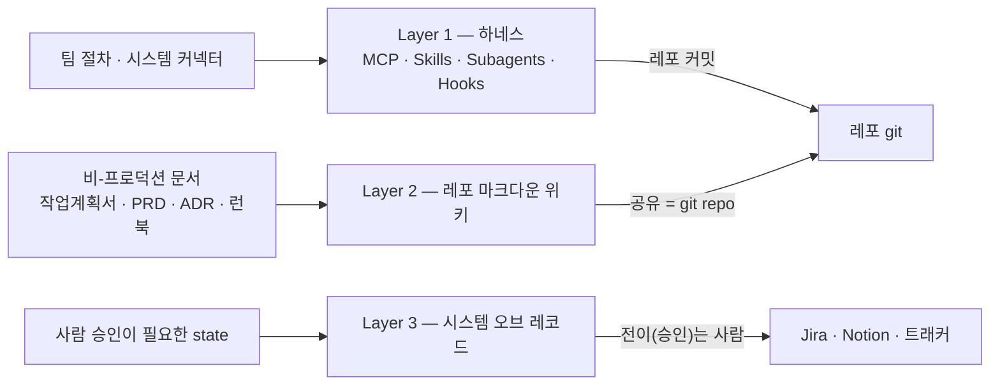
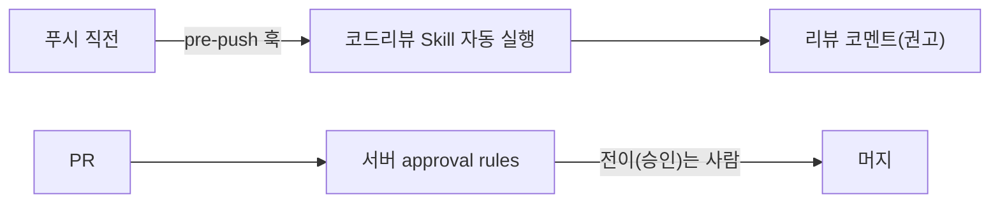
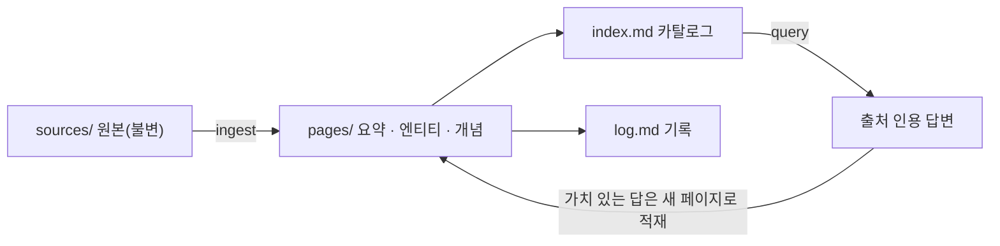

[팀 공유 인프라 넷과 성숙도 0 → 1 → N](/blog/ai-transformation/enablement-infra-and-maturity/) 편은 인프라 카탈로그를 한 벌 펴면서 그 목록에 단서를 하나 붙여 두었다. **도구를 단계마다 사들이기 전에 훨씬 얇은 레퍼런스 아키텍처가 따로 있다**는 것이었고, 그래서 거기 실린 이름들은 구매 목록이 아니라 비교 대상으로 읽어야 한다는 것이었다. 그러면서 「그 얇은 쪽 아키텍처는 후속 편에서 다룬다」고 적고 자리를 비워 두었다.

이 글이 그 자리다. 옮기는 원 자료는 세 문서 — 아키텍처 한 벌과, 그 아키텍처의 두 레이어를 각각 설계한 문서 둘 — 이고, 셋을 합치면 **도구를 늘리지 않는 쪽의 실물**이 나온다. 하네스 한 벌에 팀 절차를 Skill로 넣고, 팀 지식은 레포 마크다운 위키에 두고, 사람 승인이 필요한 state만 트래커에 남긴다.

이 카테고리의 다른 글들이 「무엇을 살 것인가」를 표로 폈다면 이 글은 **무엇을 사지 않고 파일로 쓸 것인가**를 편다. 그래서 이 글에는 가격표 대신 폴더 구조와 카탈로그가 들어간다.

## 용어 정리

설명 없이 쓰는 어휘 가운데 본문에서 실제로 쓰이는 것만 모았다.

| 용어 | 영문·원어 | 뜻 |
|---|---|---|
| **하네스** | Harness | 모델을 둘러싸고 실행을 통제하는 운영 구조. 이 글에서는 Claude Code 한 벌을 가리킨다 |
| **MCP** | Model Context Protocol | AI와 외부 시스템을 잇는 개방 표준 |
| **Skill** | Skill | 폴더 하나에 담긴 절차 문서(`SKILL.md`). 모델이 상황에 맞다고 판단하면 스스로 연다 |
| **Subagent** | Subagent | 하위 작업을 넘겨받아 별도 컨텍스트에서 도는 에이전트 |
| **헤드리스** | Headless | 사람이 화면에 붙지 않은 채 명령 한 줄로 도는 실행 방식(`claude -p`). CI·서버리스에서 쓴다 |
| **시스템 오브 레코드** | System of Record | 어떤 사실의 공식 기록처가 되는 시스템. 감사 대상이 되는 값이 여기 남는다 |
| **approval rules** | Approval Rules | 소스 저장소가 서버에서 강제하는 머지 승인 규칙 |
| **ADR** | Architecture Decision Record | 결정 하나와 그 맥락·대안을 짧게 남기는 기록 문서 |
| **런북** | Runbook | 운영 절차를 순서대로 적어 둔 문서 |
| **롱컨텍스트** | Long context | 문서를 통째로 모델 입력창에 넣어 쓰는 방식 |
| **pgvector** | pgvector | PostgreSQL을 벡터 검색에 쓰게 하는 확장. 벡터 전용 저장소를 따로 세우지 않아도 된다 |

## 이 글이 서 있는 층위

여기 나오는 이름 가운데 처음 나오는 것은 거의 없다. Skill도 LLM 위키도 RAG의 위상도 이 블로그에 이미 실려 있다. **겹치는 것은 이름이고, 이 글이 더하는 것은 그것들이 한 아키텍처 안에서 어느 자리에 놓이는가다.**

| 소재 | 이미 실린 층위 | 이 글의 층위 |
|---|---|---|
| **Skill의 정의·구조** | `SKILL.md` 한 장의 필수 요소, 스킬·커맨드·훅이 갈리는 트리거 축, 프로젝트·개인 스코프 — [커맨드·스킬·훅과 플러그인 번들](/blog/agentic-coding/commands-skills-hooks-plugins/) · [Rules·Hooks·Skills 3계층과 차단 규칙 7종](/blog/agentic-coding/rules-hooks-skills-layers/) | 한 팀의 반복 절차를 **어떤 목록으로 쪼개** 열한 개의 Skill에 담는가 |
| **LLM 위키** | 이름과 출처, 「답변이 지식으로 컴파일돼 재활용된다」는 성격 — [Agent = Model + Harness](/blog/ai-agent/agent-equals-model-plus-harness/) | 그 위키의 **폴더 구조·스키마·뼈대 파일**과 운영 세 연산 |
| **RAG를 쓸 것인가** | 「반드시 해야 하는 것」에서 「규모에 따라 고르는 것」으로 옮겨 간 위상, 소규모·고빈도는 `.md` + 인덱스로 전환 — [Agent Harness](/blog/ai-agent/agent-harness-architecture/) | 그 전환이 걸리는 **규모의 임계값**과, 임계 아래에서 쓰는 뼈대 |
| **사람 게이트** | 요구사항에서 운영까지 여섯 단계 각각에서 무엇이 사람에게 남는가, 로컬과 서버사이드가 갈리는 경계 — [요구사항에서 운영까지 여섯 게이트와 개발·QA·배포 각론](/blog/ai-transformation/sdlc-human-gates/) | 그 경계를 **아키텍처의 한 층으로** 세우면 거기 무엇이 남는가 |
| **팀 공유 인프라** | 워크플로 자동화·회사 두뇌·MCP 표준·프롬프트 라이브러리와 도입 순서 — [팀 공유 인프라 넷과 성숙도 0 → 1 → N](/blog/ai-transformation/enablement-infra-and-maturity/) | 그 목록을 **걷어내는 쪽**의 아키텍처 |

다섯 행의 오른쪽 열이 이 글의 범위다. 그래서 `SKILL.md`의 프런트매터 필드가 무엇인지, RAG의 청킹을 어떻게 잡는지는 다시 설명하지 않는다. 그 자리는 왼쪽 열의 링크에 있다.

## 문제의식 — 도구를 단계마다 사면 무엇이 늘어나는가

AI 투자의 상당 부분이 도구가 흩어지는 데(tool sprawl) 소모된다는 조사 수치는 [빌더에서 오케스트레이터로 가는 조직 설계](/blog/ai-transformation/builder-to-orchestrator-shift/) 편이 출처와 함께 실었다. 여기서 옮길 것은 그 수치가 아니라 **그 아래에 깔린 논리**다.

원 자료가 지목하는 대상은 특정 제품이 아니라 하나의 접근이다 — **단계마다 point SaaS를 하나씩 사는 것.** 리뷰에 하나, PRD에 하나, 테스트 생성에 하나, 지식관리에 하나. 각각은 그 단계에서 합리적인 선택이고, 문제는 개별 선택이 아니라 누적이다. 도구가 하나 늘 때마다 같이 늘어나는 것이 넷 있다 — **통합**(다른 도구·저장소와 이어 붙이는 일), **계약**(갱신·과금·벤더 관리), **학습**(팀 전원이 새 UI와 새 관례를 익히는 일), 그리고 **보안검토**(데이터가 어디로 나가는지를 매번 다시 따지는 일).

전부 그 도구를 **가지고 있기 위해** 치르는 값이다.

그래서 원 자료가 제안하는 방향은 도구를 더 잘 고르는 것이 아니라 **살 자리를 줄이는 것**이다. 하네스 하나에 MCP로 시스템을, Skill로 팀 절차를 흡수하고, 사람 승인이 필요한 게이트 state만 시스템 오브 레코드에 남긴다.

원 자료는 이 방향에 자기 이름을 붙여 두었다. 아키텍처 문서와 Skills 설계 문서가 각각 이것을 **「L1 개인기 → L2 팀 시스템」 외부화의 실체**라고 적는다. 그 3단 모델 자체는 [빌더에서 오케스트레이터로 가는 조직 설계](/blog/ai-transformation/builder-to-orchestrator-shift/) 편이 이미 폈고, 거기서 L1→L2는 **외부화** — 한 사람에게 있던 판단 기준을 팀 누구나 재현할 수 있는 형태로 꺼내 놓는 일 — 로 정의된다. 이 글이 옮기는 세 레이어는 그 외부화가 파일 수준에서 어떤 모양인가다.

## 세 레이어 — 무엇을 어디에 두나

원 자료는 그 방향을 세 층으로 나눈다. 층을 가르는 기준은 기술 스택이 아니라 **그것이 어디에 놓이는가**다.



앞의 두 층은 도착지가 같다. Layer 1의 구성요소는 레포에 커밋되고, Layer 2의 위키도 공유 수단이 git 저장소다. 즉 **하네스와 지식은 둘 다 파일이 되어 버전관리로 들어간다.**

Layer 3만 그 밖에 있다. 그리고 거기 남는 것들에는 공통점이 하나 있다 — 사람의 승인 행위와 그 감사추적은 **레포에 커밋할 수 있는 성질의 것이 아니다.** 커밋 자체가 승인이 아니고, 로컬에서 만들어 넣은 파일은 승인의 증거가 되지 못한다. 세 층을 가르는 선을 그렇게 읽으면 Layer 3은 남은 것들을 모아 둔 잡동사니 층이 아니라 **앞 두 층의 방식으로는 원리적으로 처리할 수 없는 것만 남은 층**이 된다. 이 읽기는 이 글의 정리다.

## Layer 1 — 하네스 하나에 팀 절차를 넣는다

첫 층은 단일 하네스다. Claude Code 한 벌에 네 종류의 확장과 규약 파일 하나가 붙는다.

| 구성요소 | 무엇 | 팀 공유 방식 |
|---|---|---|
| **MCP** | 시스템 커넥터 (이슈 트래커·문서·DB·클라우드·소스 저장소) | `.mcp.json` 레포 커밋, OAuth·스코프 자격증명 |
| **Skills** | **팀 절차의 외부화** (PRD 작성법·코드리뷰 체크리스트·테스트 생성·배포 런북·인시던트 트리아지) | `.claude/skills/` 레포 커밋 — 이 층의 핵심 |
| **Subagents** | 팬아웃 (리뷰 차원 병렬·멀티파일) | `.claude/agents/` 레포 커밋 |
| **CLAUDE.md / AGENTS.md** | 팀 컨벤션·컨텍스트 | 레포 커밋 |
| **Hooks** | 결정적 자동화 게이트 (사람이 아니라 하네스가 강제한다) | 레포 설정 |

오른쪽 열이 가리키는 곳은 대체로 레포 안이다. MCP 행의 OAuth·스코프 자격증명만 레포 밖에 남는다.

> Hooks 행이 가리키는 것은 **하네스 설정에 등록되는 훅**이다. 훅이 차단 사유를 어느 채널로 돌려주는가는 자료마다 갈리는 자리인데, 그 대조는 [Rules·Hooks·Skills 3계층과 차단 규칙 7종](/blog/agentic-coding/rules-hooks-skills-layers/) 편이 따로 다뤘다.

**실행 위치는 두 곳이다.** 로컬(개발자 IDE 보조)과 헤드리스(`claude -p`로 CI·서버리스에서 자동 PR 리뷰 등). 정의는 레포로 공유하고 실행은 로컬과 서버 양쪽에서 한다.

**흡수 예시**도 원 자료가 직접 적었다. 코드리뷰 SaaS는 리뷰 Skill로, PRD 도구는 PRD Skill로, 테스트 생성 SaaS는 테스트 Skill로 간다. point SaaS 다수가 **폴더 하나**로 대체된다는 것이 이 층의 주장이다.

### Skill이 외부화하는 것

Skill의 파일 구조와 호출 방식, 슬래시 명령과 어떻게 갈리는지는 [커맨드·스킬·훅과 플러그인 번들](/blog/agentic-coding/commands-skills-hooks-plugins/) 편에 이미 있다. 여기서 남는 것은 **팀 절차를 담는 그릇으로 쓸 때의 원칙**이고, 원 자료가 다섯을 적었다.

| # | 원칙 | 내용 |
|---|---|---|
| 1 | **1 Skill = 1 절차** | 코드리뷰, PRD 작성, 배포 런북. 비대해지면 쪼갠다 |
| 2 | **description은 트리거 사전** | 「PR·코드 변경을 리뷰할 때」처럼 모델이 잡을 단서를 넣는다 |
| 3 | **입력은 MCP·위키에서** | Skill 본문에는 *절차*만 둔다. 데이터는 MCP와 위키에서 끌어온다 |
| 4 | **게이트 경계 명시** | Skill은 초안·검증까지. 머지·배포 승인은 사람과 서버사이드 |
| 5 | **로컬·헤드리스 양용** | 같은 Skill을 IDE에서도 `claude -p`에서도 그대로 쓴다 |

원칙 3이 이 아키텍처에서 Layer 1과 Layer 2를 잇는 이음매다. 절차와 데이터를 같은 파일에 넣지 않기 때문에 절차는 Skill에, 데이터는 위키에 남는다.

**스코프는 둘로 갈린다.** `.claude/skills/<이름>/`에 두고 레포에 커밋하면 팀 공유가 되고, 홈 디렉터리 아래 `~/.claude/skills/<이름>/`에 두면 그 사용자에게만 적용된다. 원 자료의 지침은 단순하다 — **팀 절차는 전부 앞쪽이다.**

### Skill 카탈로그 열하나

이 아키텍처에서 가장 실물에 가까운 부분이다. 파이프라인 단계별로 열한 개를 세웠다.

| Skill | 목적 | 트리거(description 요지) | 입력 | 출력 | 대체 SaaS |
|---|---|---|---|---|---|
| **prd-작성** | 팀 PRD 양식·KPI·비기능 강제 | 「PRD·기획서를 작성·갱신할 때」 | 이슈 트래커(MCP)·`wiki/plans` | `wiki/plans/PRD.md` | ChatPRD |
| **유저스토리-분해** | 스토리·인수조건·엣지케이스 후보 | 「요구사항을 스토리로 분해할 때」 | PRD(위키) | 스토리 목록 | — |
| **코드리뷰-체크리스트** ★ | 팀 규칙·보안·과거장애 패턴 리뷰 | 「코드·PR을 리뷰할 때」 | diff·`wiki/decisions`·과거장애 | 리뷰 코멘트(권고) | CodeRabbit·Qodo |
| **테스트-생성** | 팀 테스트 컨벤션·핵심 시나리오 커버 | 「테스트를 생성·보강할 때」 | 코드·위키 | 테스트 코드 초안 | Qodo test-gen |
| **커밋-메시지** | 한글 커밋 규칙·형식 통일 | 「커밋 메시지를 작성할 때」 | `git diff` | 한글 커밋 메시지 | Copilot 커밋 |
| **pr-요약** | PR 설명·변경 요약·리스크 표기 | 「PR을 생성·요약할 때」 | diff·이슈 트래커 | PR 본문 | — |
| **배포-런북** | 배포 절차·체크·롤백 기준 | 「배포를 준비·점검할 때」 | `wiki/runbooks` | 배포 체크 결과 | — |
| **인시던트-트리아지** | severity 분류·컨텍스트 보강 | 「장애·알림을 분류할 때」 | 로그·`wiki/runbooks`·최근배포 | 트리아지 요약 | PagerDuty AI(일부) |
| **wiki-ingest** | 새 소스를 요약·인덱스·로그에 반영 | 「새 문서·회의록을 위키에 반영할 때」 | `sources/`(원본) | 위키 페이지 갱신 | Glean ingest |
| **wiki-lint** | 모순·낡은 주장·고아 페이지 점검 | 「위키를 점검·정리할 때(정기)」 | 위키 전체 | lint 리포트 | — |
| **온보딩-가이드** | 신규 합류자 절차·환경·관례 | 「새로 합류한 사람을 온보딩할 때」 | 위키·README | 온보딩 체크 | — |

★ = 플래그십. 가장 회수가 크고 로컬과 헤드리스 둘 다에서 돈다.

**원 자료의 표에는 열이 하나 더 있고, 그 열의 값이 열한 행에서 전부 같다** — scope가 전부 「프로젝트」다. 값이 상수인 열은 보통 지워도 되는 열이지만 여기서는 그 상수가 곧 주장이다. 개인 스코프에 놓인 Skill이 하나도 없다는 것은 이 카탈로그가 **개인 생산성 도구 모음이 아니라 레포에 커밋되는 팀 자산 목록**이라는 뜻이고, 앞 절의 「팀 절차는 전부 앞쪽」이라는 지침이 카탈로그 전체에 실제로 적용돼 있다는 확인이 된다. 상수 열을 상수로 읽는 이 해석은 이 글의 정리다.

⚠️ **다만 이 블로그의 다른 자료는 반대 방향을 든다.** [표준을 강제하지 말고 seed를 주라](/blog/ai-agent/self-evolving-seed-and-fork/) 편은 「표준화가 아니라 분기 가능한 공통 기반」을 답으로 놓고, [자기진화 루프와 비대칭 거버넌스](/blog/ai-agent/self-evolving-harness-governance/) 편은 「개인 하네스가 먼저」이고 「팀 표준부터 만들면 실패」하며 중복이 여러 번 나온 것만 공통으로 승격하라고 적었다. 여기 카탈로그는 반대로 열한 개를 처음부터 전부 팀 스코프에 놓는다. **어느 쪽이 맞는지 이 글은 가리지 않는다** — 원 자료들이 서로 다른 조건을 놓고 처방했을 수 있다.

오른쪽 끝 열은 전수가 차 있지 않다. 열한 행 가운데 대체 대상이 적힌 것은 여섯이고 나머지 다섯에는 `—`가 붙어 있다.

### 먼저 만들 셋

열한 개를 한 번에 만들라는 것이 아니다. 원 자료는 최소 착수 단위로 셋을 지목한다.

| # | Skill | 왜 먼저인가 |
|---|---|---|
| ① | **코드리뷰-체크리스트** | 헤드리스로 돌려 PR에 코멘트까지 붙는다 |
| ② | **prd-작성** | 위키와 직결된다 |
| ③ | **커밋-메시지** | 규칙이 이미 있고 즉시 체감된다 |

나머지는 이 셋의 회수를 확인한 뒤 확장한다.

> 원 자료가 이 셋에 붙여 둔 단서가 하나 있다. 세 Skill의 본문은 **팀의 실제 컨벤션이 한 줄씩 나오기 전에는 채워지지 않는다** — 코드리뷰에서 반드시 보는 것 셋, PRD의 필수 섹션, 그리고 현재 쓰는 커밋 메시지 형식.

### 완성 예시 — 코드리뷰 체크리스트

플래그십 하나는 원 자료가 파일 내용을 적어 두었다. `.claude/skills/코드리뷰-체크리스트/SKILL.md`다.

```markdown
---
name: 코드리뷰-체크리스트
description: 코드/PR 변경을 리뷰할 때 팀 규칙(보안·네이밍·과거 장애 패턴·핵심 시나리오)으로 점검하고 라인별 권고 코멘트를 만든다. 로컬 리뷰와 헤드리스 PR 리뷰 양쪽에 사용.
---

# 코드리뷰 체크리스트

## 입력
- 변경 diff (git 또는 소스 저장소 PR)
- 관련 결정: `/wiki/pages/decisions/` 에서 해당 영역 ADR 참조
- 과거 장애 패턴: `/wiki/pages/runbooks/장애패턴.md`

## 점검 항목 (우선순위 순)
1. **보안**: 시크릿 하드코딩, 입력 검증, 권한 경계, SQL/인젝션.
2. **핵심 시나리오**: 결제·인증·개인정보 변경 시 영향·테스트 유무.
3. **과거 장애 재발**: 위 장애패턴.md 과 대조.
4. **컨벤션**: 네이밍·구조·에러처리(레포 CLAUDE.md 규약).
5. **테스트**: 변경에 대응하는 유효 테스트가 있는가(커버리지 숫자 채우기 금지).

## 출력 규칙
- 각 지적은 `파일:라인 — [심각도] 내용 — 권고`.
- **차단이 아닌 권고**. 머지 승인은 사람(서버 approval rules).
- 심각도 High만 요약 상단에 모아 표기.

## 게이트
- 이 Skill은 *리뷰 코멘트 생성*까지. 머지/배포 승인은 절대 하지 않는다.
```

파일에서 눈에 띄는 것은 마지막 두 절이다. **출력 규칙과 게이트가 Skill 본문 안에 명시돼 있다.** 절차 문서가 자기 권한의 상한을 스스로 적어 두는 형태이고, 앞 절 원칙 4(게이트 경계 명시)가 파일 수준에서 어떻게 생겼는지가 이것이다.

**쓰이는 자리는 둘이다.** 로컬에서는 개발자가 푸시 전에 「이 변경 리뷰해줘」라고 하면 Skill이 자동으로 적용된다. 헤드리스에서는 PR 이벤트가 서버리스 함수를 깨우고, 거기서 `claude -p "이 PR 리뷰"`를 돌린 결과를 PR 코멘트로 게시한다. **정의는 레포에 있는 같은 `SKILL.md` 하나다.**

### 합성 — MCP · 서브에이전트 · 훅

Skill 하나만으로 끝나지 않고 같은 층의 다른 구성요소와 붙는다.

| 붙는 것 | 무엇이 되나 |
|---|---|
| **+ MCP** | 코드리뷰 Skill이 이슈 트래커에서 티켓 맥락을, DB에서 스키마를 읽어 더 정확해진다 |
| **+ Subagent** | 큰 PR은 보안·성능·컨벤션 차원을 서브에이전트 팬아웃으로 병렬 리뷰한 뒤 합본한다 |
| **+ Hook** | pre-push 훅이 코드리뷰 Skill을 자동 실행한다(결정적 게이트) → 사람이 잊어도 강제된다 |

세 번째 행에 걸리는 자리가 있다. 이 아키텍처는 다른 곳에서 **「로컬 선의로는 게이트를 강제할 수 없다」고** 못 박는데, pre-push 훅은 로컬에서 도는 것이다. 두 문장을 나란히 놓으면 로컬이 강제를 할 수 있다는 것인지 없다는 것인지가 어긋나 보인다.

어긋나지 않는다. **「강제」의 목적어가 다르기 때문**이고, 그 근거는 원 자료 안에 둘이 있다. 위 `SKILL.md`는 이 Skill의 산출물이 리뷰 코멘트까지라고 스스로 적었고, 같은 파일의 출력 규칙이 「차단이 아닌 권고, 머지 승인은 사람」이라고 다시 적었다. 즉 **훅이 강제하는 것은 리뷰가 실행되는 것이고, 머지를 막는 일은 서버 approval rules가 한다.** 두 문장을 이렇게 잇는 것은 이 글의 정리다.



두 갈래가 이어져 있지 않은 것이 요점이다. 훅은 왼쪽 끝에서 실행을 걸 뿐 오른쪽 끝의 머지에 손이 닿지 않는다.

## Layer 2 — 지식은 레포 마크다운 위키에

둘째 층은 지식이다. 라이브 서비스가 돌아가는 데는 필요 없지만 팀이 판단하는 데는 필요한 문서 — 작업계획서·PRD·ADR·런북·결정기록 — 를 **레포 마크다운 위키**에 두고, LLM이 그것을 능동적으로 유지한다.

이 방식의 이름과 출처는 [Agent = Model + Harness](/blog/ai-agent/agent-equals-model-plus-harness/) 편이 이미 실었다. 거기서는 「답변이 지식으로 컴파일돼 재활용된다」는 성격으로 요약되고, SKILL·Rules·Playbook과 함께 **같은 구조에 서로 다른 진영이 붙인 네 이름** 가운데 하나로 놓인다. 여기서 더하는 것은 그 이름의 실물이다 — 폴더가 어떻게 생겼고, 스키마 파일에 무엇이 적히고, 어떤 연산으로 돌아가는가.

층은 세 갈래로 나뉜다.

| 갈래 | 무엇 | 누가 쓰나 |
|---|---|---|
| ① **원본** | 회의록·외부문서·캡처 | 불변. LLM은 읽기만 한다 |
| ② **위키** | 요약·엔티티 페이지·개념 페이지·`index.md`·`log.md` | LLM이 소유하고 유지한다 |
| ③ **스키마** | 구조와 ingest·query·lint 규칙을 정의하는 `CLAUDE.md` | 사람이 정한다 |

그리고 그 위에서 도는 연산이 셋이다.

| 연산 | 하는 일 |
|---|---|
| **ingest** | 새 소스가 오면 요약하고, `index.md`를 갱신하고, 닿는 페이지들을 고치고, `log.md`에 적는다 |
| **query** | 위키를 검색해 출처를 인용해 답하고, 좋은 답은 다시 페이지로 적재한다 |
| **lint** | 모순·낡은 주장·고아 페이지·누락을 점검한다 |



query에서 나온 화살표 하나가 되돌아온다는 것이 이 구조의 성격이다. 질문에 답한 결과가 버려지지 않고 페이지가 되므로, **쓸수록 위키가 커진다.** 사람은 큐레이션과 질문을 맡고 유지보수는 LLM이 하는데, LLM은 이 일을 지루해하지 않는다는 것이 원 자료가 붙인 근거다.

### 무엇을 위키에 두나

경계를 먼저 긋는다.

| 위키에 둠 (비-프로덕션) | 코드·프로덕션에 둠 |
|---|---|
| 작업계획서·PRD·ADR·결정기록 | 소스코드·설정·마이그레이션 |
| 운영 런북·장애 패턴·온보딩 | 실행되는 스크립트·IaC |
| 회의록·리서치 요약 (원본은 `sources/`) | 시크릿 (위키에 절대 금지) |

가르는 기준은 **라이브에 필요 없지만 팀 판단과 맥락에는 필요한 것**이다. 시크릿과 자격증명은 어떤 형태로도 넣지 않는다.

### 폴더 구조

```
/wiki/
├── CLAUDE.md            # 스키마 — 구조·규칙·ingest/query/lint 워크플로 (이 폴더 한정)
├── index.md            # 전체 카탈로그 (페이지별 1줄, 카테고리별)
├── log.md              # append-only 연대기 (ingest/query/lint 기록)
├── sources/            # 원본(불변): 회의록·외부문서·캡처 — LLM은 읽기만
├── pages/
│   ├── concepts/       # 개념 (예: 주문-상태전이.md, 권한-모델.md)
│   ├── entities/       # 엔티티 (예: 서비스-검색.md, 벤더-XX.md, 팀-플랫폼.md)
│   ├── decisions/      # ADR (예: 0001-소스저장소-유지.md)
│   ├── plans/          # 작업계획서·PRD
│   └── runbooks/       # 운영 런북·장애패턴
```

세 가지가 이 구조에 붙는다.

- **공유** — 레포 git으로 공유한다. 각 개발자의 로컬 하네스가 같은 위키에 접근한다. 검색은 로컬 마크다운 검색 도구를 그대로 쓴다.
- **스코프** — `/wiki/CLAUDE.md`는 이 폴더 안의 작업에만 걸리는 중첩 스키마다. 레포 루트의 `CLAUDE.md`(코딩 규약)와 분리된다. 규약 파일이 디렉터리 깊이에 따라 어떻게 겹쳐 적용되는지는 [CLAUDE.md의 4계층 Scope와 3덩어리 7단계](/blog/agentic-coding/claude-md-scope-layers/) 편에 있다.
- **교차링크** — 페이지 사이는 `[[페이지명]]`으로 잇는다. 아직 없는 페이지를 가리키는 `[[ ]]`도 그대로 둔다. 「아직 안 쓴 페이지」 표식으로 쓰인다.

### 뼈대 파일 넷

복사해서 그대로 쓰라고 원 자료가 적어 둔 파일들이다. 이 층의 예시에 나오는 이름과 내용은 구조를 보이기 위한 일반 예시로 바꿔 적었다.

#### `/wiki/CLAUDE.md` — 스키마

```markdown
# wiki 스키마

이 폴더는 팀 비-프로덕션 지식의 LLM-wiki다. 사람은 큐레이션·질문, LLM은 유지보수.

## 구조
- sources/ : 원본(불변). 수정 금지, 인용만.
- pages/{concepts,entities,decisions,plans,runbooks}/ : LLM이 소유·유지.
- index.md : 모든 페이지 1줄 카탈로그. query 전 항상 먼저 읽기.
- log.md : append-only. 모든 ingest/query/lint를 기록.

## 페이지 규칙
- 파일명: 한글-케밥(예: 주문-상태전이.md). 엔티티 vs 개념 애매하면 entities/.
- 각 페이지 상단: `> 갱신: YYYY-MM-DD · 출처: [[ ]] / sources/...`
- 교차링크 [[페이지명]] 적극 사용.

## 워크플로
### ingest (새 소스 도착)
1. sources/에 원본 보관. 2. 핵심 요약 페이지 작성/갱신.
3. 관련 entity·concept 페이지 갱신(10~15개 닿을 수 있음). 4. index.md 갱신. 5. log.md 추가.
### query (질문)
1. index.md 읽기 → 관련 페이지 검색 → 출처 인용 답변. 2. 가치 있는 답은 새 페이지로 적재.
### lint (정기)
모순·낡은 주장·고아 페이지·누락 교차링크·데이터 공백 점검 → log.md 기록.
```

스키마 파일이 짧다는 것이 이 방식의 특징이다. 벡터DB도 인덱싱 파이프라인도 아니고 **규칙을 적은 마크다운 한 장**이 위키의 동작을 정의한다.

#### `/wiki/index.md` — 카탈로그

```markdown
# 인덱스

> query 전 항상 먼저 읽기. 페이지별 1줄 요약.

## concepts
- [[주문-상태전이]] — 주문 상태 전이 규칙·예외 흐름
- [[권한-모델]] — 역할 정의·권한 부여 규칙

## entities
- [[서비스-검색]] — 사내 문서 검색 API와 색인 파이프라인
- [[팀-플랫폼]] — 플랫폼 스쿼드 구성·오너십

## decisions
- [[0001-소스저장소-유지]] — 지금 쓰는 소스 저장소 유지, AI리뷰는 커스텀

## runbooks
- [[배포-체크리스트]] — 카나리·롤백 기준
- [[장애패턴]] — 과거 장애·재발 방지 패턴
```

#### `/wiki/log.md` — 연대기

```markdown
# 로그 (append-only)

## [2026-06-15] ingest | 6/15 플랫폼 기획 회의록
- sources/2026-06-15-플랫폼기획.md 보관
- [[서비스-검색]] 갱신, [[팀-플랫폼]] 신규
- index 갱신

## [2026-06-15] lint
- 고아 페이지 0, 낡은 주장 1건([[주문-상태전이]] 취소 경로) → 갱신 필요 플래그
```

로그가 append-only라는 것이 실질적인 제약이다. 위키의 현재 상태는 페이지들이 들고 있고, **그 상태가 어떻게 여기까지 왔는지는 로그가 들고 있다.** 고쳐 쓰기 시작하면 위키 안에서 읽히는 그 연대기가 사라진다.

#### 샘플 페이지 — `/wiki/pages/decisions/0001-소스저장소-유지.md`

```markdown
> 갱신: 2026-06-15 · 출처: [[레퍼런스-아키텍처]] · sources/소스저장소-ga.md

# ADR-0001 소스 저장소 유지

## 결정
지금 쓰는 소스 저장소를 유지한다. PR AI리뷰는 커스텀(이벤트 버스→서버리스 함수→LLM→PR 코멘트 API).

## 맥락
신규 생성 차단으로 한때 종료 리스크가 있었으나 GA 복귀로 해소. 매니지드 리뷰 서비스는 신규 불가·미지원.

## 대안·트레이드오프
호스팅 이전은 생태계(리뷰 SaaS) 목적일 때만. 관련 [[배포-체크리스트]].
```

페이지 한 장의 형식이 여기서 드러난다. 상단 한 줄에 갱신일과 출처가 붙고, 본문은 결정·맥락·대안 셋으로 끝난다. **출처 줄을 상단에 두도록 서식으로 정해 두었기 때문에** query가 답을 만들 때 인용할 자리가 마련된다.

### 인덱스 예시가 넷인데 폴더는 다섯이다

옮기면서 걸리는 자리가 하나 있다. 폴더 구조와 스키마 파일은 둘 다 카테고리를 다섯으로 적는데(`concepts`·`entities`·`decisions`·`plans`·`runbooks`), 위의 `index.md` 예시에는 넷만 있다. **`plans`가 빠져 있다.**

빠진 쪽이 안 쓰는 폴더인 것도 아니다. Skill 카탈로그의 `prd-작성`은 출력을 `wiki/plans/PRD.md`로 쓴다고 적혀 있다. 즉 파이프라인의 첫 Skill이 결과를 떨어뜨리는 자리가 인덱스 예시에만 없다.

예시가 전수일 필요는 없으니 이것이 오류라고까지 할 것은 아니지만, `index.md`는 「query 전 항상 먼저 읽는 카탈로그」이므로 **여기 없는 카테고리는 검색에서 사실상 없는 것**이 된다. 예시를 그대로 복사해 쓰는 팀이라면 `plans` 항목을 손으로 채워 넣어야 한다는 뜻이다. 이 확인은 이 글의 정리다.

### 규모의 임계 — 어디까지 위키이고 어디부터 RAG인가

이 층에서 가장 자주 부딪히는 질문이다. 사내 지식을 다루는데 왜 RAG를 쓰지 않는가.

**RAG의 위상이 「반드시 해야 하는 것」에서 「규모에 따라 고르는 것」으로 옮겨 갔다는 판정은 이 블로그에 이미 실려 있다.** [Agent Harness](/blog/ai-agent/agent-harness-architecture/) 편이 그 이동을 다루면서, 소규모·고빈도 지식은 `.md` + 인덱스로 즉시 전환하라고 적었다. 여기 나온 위키가 정확히 그 `.md` + 인덱스의 실물이다. 그러니 이 글에서 다시 논증할 것은 없고, 더할 것은 **분기가 걸리는 눈금**이다.

| | 위키만 | 위키 + pgvector RAG 병행 |
|---|---|---|
| 규모 | ~150–200페이지 (50–100k 토큰)까지 | 그 이상 |
| 검색 | 100% | 검색기가 고른 것만 |
| 인프라 | 0 | 색인 파이프라인 |
| 추론 범위 | 전역 | 검색된 조각 안 |

원 자료가 적은 것은 왼쪽 열과 규모 행뿐이다 — 「~150–200페이지까진 100% 검색·인프라 0·전역 추론, 그 이상은 pgvector RAG 병행」. **오른쪽 열의 나머지 세 칸은 그 반대항으로 이 글이 채운 것이다.**

임계 아래에서 위키가 이기는 이유는 검색 품질이 아니라 **위키 전체가 그냥 입력창에 들어간다**는 데 있다. 원 자료는 그 구간에서 RAG를 붙이는 것을 순수한 오버헤드이자 신뢰도 하락이라고 적었는데, 이 표현은 원 자료가 인용한 출처([Karpathy의 LLM-wiki gist](https://gist.github.com/karpathy/442a6bf555914893e9891c11519de94f))의 것이다.

⚠️ **다만 이 층에는 [팀 공유 인프라 넷과 성숙도 0 → 1 → N](/blog/ai-transformation/enablement-infra-and-maturity/) 편과 갈리는 자리가 하나 있다.** 그 편은 RAG·파인튜닝·롱컨텍스트를 나란히 놓고 롱컨텍스트의 비용을 20~24배로 적었고, 적합한 대상을 「길고 정적인 단일 문서」로 잡았다. 여기서는 위키 전체를 통째로 읽는 방식의 인프라 비용을 0으로 적는다. 두 판정이 부딪히는 것처럼 보이지만 **재는 대상이 다르다** — 앞쪽은 질의마다 긴 문서를 재투입하는 토큰 비용이고, 뒤쪽은 벡터 저장소를 세우고 유지하는 인프라 비용이다. 그리고 두 편이 같은 결론에 붙어 있다는 것은 그 편이 이미 적었다 — 팀 지식의 1순위는 LLM 위키이고, RAG는 규모가 그것을 넘을 때다.

### 운영 — Skill과 연결

위키는 저절로 돌지 않는다.

- `wiki-ingest`와 `wiki-lint` Skill이 위 워크플로를 수행한다.
- **lint 정례화** — 주 1회 훅/스케줄로 `wiki-lint`를 돌려 결과를 `log.md`에 남긴다.
- **규모 그래프** — 페이지 수가 임계를 넘으면 pgvector RAG를 병행한다.

정례화 항목에 붙은 단서가 실질이다. **오너를 지정하지 않으면 위키는 부패한다.** 자동화가 lint를 돌려 주더라도 리포트를 읽고 고칠 사람이 없으면 리포트만 쌓인다.

> 그리고 시작 방법에 대한 단서가 하나 더 있다. 위키는 기존 문서를 전량 이관해서 여는 것이 아니라 **첫 ingest 대상 셋**을 정해서 연다 — 최근 PRD 하나, 자주 보는 런북 하나, 핵심 도메인 하나. 거기서부터 키우면 인덱스와 로그가 자연히 쌓인다.

## Layer 3 — 레포에 둘 수 없는 state

셋째 층에 남는 것은 **사람 개입과 감사추적이 함께 필요한 state**다. 코드리뷰 승인, PR 머지, 배포 승인, 작업 상태 같은 것들이다.

- 에이전트는 **MCP로 읽고 쓴다.** 전이(승인)는 사람이 한다.
- ⚠️ **강제는 서버사이드다.** 소스 저장소의 approval rules, 파이프라인 승인, 브랜치 보호. **로컬 선의로는 게이트를 강제할 수 없다.**
- **살 것인가 지을 것인가** — 기본값은 범용 트래커(Jira·Notion·Trello)다. 저비용이고, 감사 기록이 남고, MCP로 붙는다. 자체 SaaS는 기존 도구로는 표현되지 않는 게이트 로직이 있을 때만이고, 그 시간은 Layer 1에 쓰는 쪽이 회수가 낫다.

로컬과 서버사이드가 갈리는 경계, 그리고 그 경계가 요구사항부터 운영까지 여섯 단계에서 각각 어떻게 놓이는지는 [요구사항에서 운영까지 여섯 게이트와 개발·QA·배포 각론](/blog/ai-transformation/sdlc-human-gates/) 편이 이미 폈다. 여기서 덧붙일 것은 그 경계의 **로컬 쪽에 위키 질의가 들어간다**는 것 하나다. 위키에 무엇이 있는지 묻는 일은 생성·검증과 같은 칸에 있고, 서버로 올라가지 않는다.

그래서 이 층은 「나머지」가 아니다. Layer 1과 Layer 2가 자산을 레포 파일로 만들어 공유하는 층이라면, 이 층에 남는 것은 **파일로 만들면 그 성질을 잃는 것들**이다. 승인은 커밋될 수 없고, 감사 기록은 만든 사람이 고칠 수 있으면 기록이 아니다.

## 무엇을 걷어내나

앞의 세 층을 세우면 무엇이 빠지는지를 원 자료가 여섯 범주로 적었다.

| 기존 분산 도구 | 이 아키텍처에서 |
|---|---|
| 코드리뷰 SaaS (CodeRabbit·Qodo) | **리뷰 Skill + 헤드리스 하네스** → PR 코멘트 API로 게시 |
| PRD 도구 (ChatPRD) | **PRD Skill** |
| 지식관리 SaaS (Glean·Dust) | **LLM 위키** (+ 규모 초과 시 pgvector) |
| 회의록 → PRD | 전사 도구 + Skill |
| 테스트 생성 SaaS | **테스트 Skill** |
| 작업·승인 추적 | **트래커 유지** (Layer 3) |

원 자료는 이 표의 결론을 **하네스 한 벌 + 마크다운 위키 + 트래커 하나**로 적었다.

**첫 행은 [요구사항에서 운영까지 여섯 게이트와 개발·QA·배포 각론](/blog/ai-transformation/sdlc-human-gates/) 편과 한 칸 차이로 만난다.** 그 편은 리뷰 SaaS가 특정 호스팅의 PR을 전제하므로 다른 소스 저장소에는 직접 적용되지 않는다고 적고, 현실적 최선을 커스텀 파이프라인 — 이벤트 버스 → 서버리스 함수 또는 워크플로 엔진 → LLM → PR 코멘트 API — 으로 정리했다. 여기 첫 행은 같은 종착지에 같은 경로로 도착하는데, **LLM 자리에 무엇이 들어가느냐만 다르다.** 그 편은 범용 LLM API를 놓았고, 여기서는 그 자리에 리뷰 Skill을 실은 헤드리스 하네스가 들어간다. 파이프라인이 바뀌는 것이 아니라 한 칸이 바뀌고, 그 한 칸 때문에 리뷰 기준이 레포의 `SKILL.md`로 옮겨 간다. 두 편을 이렇게 겹쳐 읽는 것은 이 글의 정리다.

## 남는 리스크

원 자료가 자기 아키텍처에 붙인 리스크 넷이다.

| 리스크 | 완화 |
|---|---|
| **단일 하네스 종속** | Skill은 마크다운과 스크립트라 이식성이 높고, MCP와 `AGENTS.md`는 업계 표준이라 모델·하네스 교체 여지가 남는다. 그래도 단일 의존이라는 사실은 의식적으로 관리한다 |
| **비개발자 접점** | 하네스는 개발자 도구다. 기획·마케팅·디자인의 접점은 Layer 3의 트래커와 일반 챗 도구 쪽이다. 전사 흡수가 아니라 개발 조직 중심의 아키텍처다 |
| **라이선스·토큰 비용 변동** | 예산 가드레일과 사용량 모니터링 |
| **Skill·위키 부패** | lint 연산 정례화 + 오너 지정 |

넷 가운데 둘째 행만 성격이 다르다. 나머지 셋은 완화 조치가 붙지만, 둘째는 완화가 아니라 **범위를 좁히는 답**이다. 이 아키텍처가 조직 전체의 AI 도입 계획이 아니라 개발 조직의 것이라는 선언이고, 앞의 다섯 층위 표에서 이 글의 층위를 잡은 것과 같은 선을 긋는다.

넷째 행은 앞의 두 층 모두에 걸린다. Skill도 위키도 레포의 파일이라 **아무도 지우지 않으면 계속 남는다.** 낡은 절차가 담긴 Skill은 사라지지 않고 계속 자동 호출되고, 낡은 페이지는 계속 검색된다. 파일로 만드는 방식의 이점이 그대로 비용이 되는 자리다. 이 표의 두 행을 이렇게 읽는 것은 이 글의 정리다.

## 이 글이 다루지 않은 것

| 무엇 | 어디 |
|---|---|
| `SKILL.md`의 프런트매터 필드, 스킬·커맨드·훅이 갈리는 트리거 축, 플러그인 번들 | [커맨드·스킬·훅과 플러그인 번들](/blog/agentic-coding/commands-skills-hooks-plugins/) |
| 훅이 차단 사유를 어느 채널로 돌려주는가 — 자료마다 갈리는 자리의 대조 | [Rules·Hooks·Skills 3계층과 차단 규칙 7종](/blog/agentic-coding/rules-hooks-skills-layers/) |
| 규약 파일이 디렉터리 깊이에 따라 겹쳐 적용되는 방식 | [CLAUDE.md의 4계층 Scope와 3덩어리 7단계](/blog/agentic-coding/claude-md-scope-layers/) |
| 임계를 넘긴 뒤의 RAG 구현 — 청킹·임베딩·검색기·리랭커 | [RAG 파이프라인 (1)](/blog/rag/rag-pipeline-ingestion/) · [(2)](/blog/rag/rag-pipeline-retrieval/) |
| 사람 게이트가 여섯 단계 각각에서 어떻게 놓이는가 | [요구사항에서 운영까지 여섯 게이트와 개발·QA·배포 각론](/blog/ai-transformation/sdlc-human-gates/) |
| 살 쪽의 카탈로그 — 팀 공유 인프라 넷과 도입 순서·비용 | [팀 공유 인프라 넷과 성숙도 0 → 1 → N](/blog/ai-transformation/enablement-infra-and-maturity/) |
| 살 쪽의 카탈로그 — ChatPRD를 포함한 기획·디자인·마케팅 도구 지형 | [기획·디자인·마케팅·경쟁사 분석 네 영역의 AI 도구 지형](/blog/ai-transformation/discovery-to-growth-tooling/) |
| 도구 흩어짐의 조사 수치와 그 출처 | [빌더에서 오케스트레이터로 가는 조직 설계](/blog/ai-transformation/builder-to-orchestrator-shift/) |
| Skill 열한 개를 실제로 돌린 뒤의 회수 측정 | 원 자료의 범위 밖 — 카탈로그는 제안이고 계측 결과가 붙어 있지 않다 |

마지막 행이 이 아키텍처를 읽을 때 계속 걸리는 자리다. Layer 1과 Layer 2는 전부 **파일을 쓰는 일**이라 착수 비용이 눈에 보이지 않는다. SaaS는 청구서가 오지만 `SKILL.md` 열한 개와 위키 스키마는 청구서가 없고, 대신 그것을 쓰고 유지하는 시간이 든다. 리스크 표의 넷째 행(부패)과 카탈로그의 「먼저 만들 셋」이 둘 다 그 시간을 가리킨다 — 앞은 유지에 드는 시간이고 뒤는 착수에 드는 시간이다.

그래서 이 아키텍처가 실제로 얇은지는 도구 개수만으로 판정되지 않는다. **줄어드는 것은 계약과 통합의 수이고, 늘어나는 것은 팀이 자기 관례를 문장으로 확정해 파일에 적어 두어야 하는 양이다.** 이 교환을 비용의 형태 변화로 정리하는 것은 이 글의 것이다.
