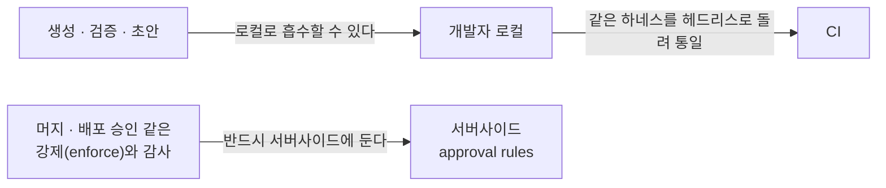
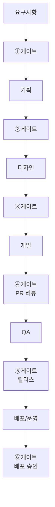
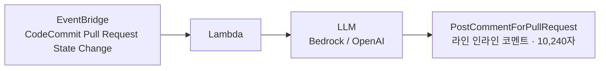

이 글이 옮기는 원 자료는 자기 목적을 한 문장으로 적어 두었다. **팀이 *절차적으로* AI를 쓰도록, 각 단계마다 「AI가 처리하는 것 / 사람이 승인하는 게이트 / 산출물 통과 기준」을 규칙으로 고정한다.** 원 자료는 이 문서를 스스로 AX 운영의 backbone이라 부른다.

자료는 2026-06-15 기준으로 작성된 문서 네 벌이다 — 요구사항에서 운영까지의 파이프라인을 통째로 다루는 총론 하나와, 그 총론의 4·5·6단계를 각각 심화한 개발·QA검증·배포운영 세 벌이다. 각론이 자기 자리를 스스로 밝히고 있다는 점이 이 자료의 성질이다. 개발 문서는 「파이프라인 4단계 심화」, QA 문서는 「5단계 심화」, 배포·운영 문서는 「6단계 심화」라고 첫머리 목적 줄에 적었다.

[빌더에서 오케스트레이터로 가는 조직 설계](/blog/ai-transformation/builder-to-orchestrator-shift/) 편이 조직 원칙 층위에서 남긴 질문이 하나 있다 — **사람이 승인하는 지점이 파이프라인 안에 남아 있는가.** 이 글은 그 질문을 여섯 자리로 내려 받는다. 원 자료도 같은 관계를 명시한다. 운영 4원칙의 첫째 항목(사람은 게이트, AI는 드래프트)을 단계마다 동일 규칙으로 반복 적용한 것이 이 문서라고 적었다. 네 원칙 전체와 그 상위 프레임은 위 편에 있고, 이 글은 그중 첫째의 각론이다.

원 자료가 본문에 앞서 붙인 단서가 하나 더 있다. **도구 가격·과금은 2026 상반기가 격변기이므로 도입 직전 공식 페이지를 재확인하라**는 것이다. 아래 도구 표의 비용 열은 전부 이 단서 위에 있다.

## 용어 정리

원 자료가 설명 없이 쓰거나 한 번만 스쳐 푼 어휘 가운데 본문에서 실제로 쓰이는 것만 모았다.

| 용어 | 영문·원어 | 뜻 |
|---|---|---|
| **게이트** | Gate | 다음 단계로 넘어가기 전에 사람이 승인해야 하는 지점. 원 자료는 이것을 SDLC 각 단계의 경계에 둔다 |
| **eval** | Evaluation | AI 생성물의 품질을 판정하는 평가 시스템과 평가셋 |
| **자동치유** | Self-healing | UI가 바뀌어 깨진 E2E 테스트의 셀렉터를 도구가 스스로 고쳐 붙이는 기능 |
| **회귀 플래그** | Regression Flag | 기존 동작이 깨졌을 가능성이 있는 변경을 후보로 표시하는 것 |
| **AIOps** | AI for IT Operations | 로그·메트릭·트레이스를 AI가 상관분석해 인시던트 조사·요약을 돕는 운영 방식 |
| **MTTR** | Mean Time To Repair | 평균 복구시간 |
| **churn** | Code Churn | 작성 직후 다시 고쳐지거나 버려지는 코드의 비율 |
| **70% Problem** | — | AI가 70%는 빠르게 하지만 마지막 30%(엣지케이스·보안)는 사람 몫으로 남는다는 관찰 |
| **ACU** | Agent Compute Unit | 자율 에이전트가 소비한 연산량을 세는 과금 단위 |
| **approval rules** | Approval Rules | 형상관리 서버가 머지 전에 강제하는 승인 규칙 |
| **카나리** | Canary | 새 버전을 일부 트래픽에만 먼저 노출해 이상을 보는 배포 방식 |
| **하네스** | Harness | 프롬프트·도구·규칙을 묶어 AI를 반복 사용 가능하게 만든 작업 틀 |
| **헤드리스** | Headless | 사람과의 대화 없이 CI 같은 자동 실행 환경에서 도는 상태 |
| **MCP** | Model Context Protocol | 도구·데이터 소스를 모델에 연결하는 표준 |
| **PoC** | Proof of Concept | 개념 검증. 본격 도입 전에 작게 만들어 확인하는 단계 |
| **GA / EoS** | General Availability / End of Support | 정식 출시 / 지원 종료 |

## 이 글이 쓰는 「게이트」는 어느 층위인가

「사람 게이트」라는 말은 이 블로그에 이미 여러 편에 나온다. 겹치는 것은 **이름이지 층위가 아니다.**

| 소재 | 이미 실린 층위 | 이 글의 층위 |
|---|---|---|
| **사람 게이트** | 에이전트 **루프의 종료 조건** — 모델의 자기 선언을 종료 조건으로 쓰지 말고 테스트·정적 검사·사람 게이트를 종료 조건으로 두라는 것 — [안티패턴 10종과 진단 순서](/blog/ai-agent/loop-antipatterns-and-checklist/) · [여덟 개의 설계 표면](/blog/ai-agent/minimal-loop-design-surfaces/) | **SDLC 단계 경계의 승인 지점** — 요구사항에서 운영까지 여섯 단계 *사이*에 놓인다 |
| **승인 지점** | 에이전트 **실행 절차 안의 한 스텝** — 「사용자 승인 후 발송」처럼 정의서에 적히는 항목 — [정의서 스키마와 30종의 품질 편차](/blog/agentic-coding/definition-writing-quality/) · [여섯 부서 26종 에이전트 정의서](/blog/ai-transformation/agent-definition-by-department/) | 파이프라인 **산출물의 통과 기준** — 무엇을 만족해야 다음 단계로 넘어가는가 |
| **단계별 게이트라는 이름** | 개인기(L1)를 팀 시스템(L2)으로 옮기는 **수단의 목록에 든 한 항목** — [빌더에서 오케스트레이터로 가는 조직 설계](/blog/ai-transformation/builder-to-orchestrator-shift/) | 그 항목의 **각론** — 여섯 단계에 무엇을 어떤 기준으로 놓는가 |

재는 단위가 다르다. 앞의 둘은 **한 에이전트가 도는 동안**의 이야기이고, 이 글은 **하나의 변경이 요구사항에서 프로덕션까지 가는 동안**의 이야기다. 시간 축의 길이가 다르므로 게이트를 놓는 사람도 다르다 — 앞의 둘은 에이전트를 만드는 사람이 놓고, 이 글의 것은 조직의 프로세스가 놓는다. 이 구분은 이 글의 정리다.

## 관통 원칙 — AI는 초안·분석, 사람은 승인·정책

원 자료가 여섯 단계 전부에 같은 모양으로 반복 적용하는 규칙이 하나다.

> **AI는 초안·분석, 사람은 승인·정책.**

무엇이 어느 쪽에 떨어지는지를 원 자료는 2열로 적었다.

| 사람이 정한다 (게이트) | AI가 처리한다 |
|---|---|
| 우선순위·스코프, 아키텍처·기술 선택 | 초안 생성, 대량 변형 탐색 |
| 보안·규제·SLA 임계값 | 정형 변환(전사·요약·코드화·테스트화) |
| 머지/릴리스/배포 승인 | 1차 분석·후보 제시 |
| 자율 에이전트 권한 범위 | 회귀·이상 후보 플래그 |

**왼쪽 네 행에는 산출물이 하나도 없다.** 오른쪽 네 행은 전부 *만들어진 것*이다. 사람이 정하는 것과 AI가 만드는 것이 종류로 갈린다는 점이 이 표의 요점이고, 이 읽기는 이 글의 정리다.

### 공통 안전장치 넷

원 자료는 위 분담과 별개로, **모든 단계에 공통으로 거는** 안전장치 넷을 따로 적었다.

| # | 안전장치 | 무엇을 막나 |
|---|---|---|
| **1** | 모든 AI 산출물에 **원천 추적성**(원문 링크·diff) 첨부 | 산출물이 어디에서 왔는지 되짚을 수 없는 상태 |
| **2** | 환각 위험 영역(인용·근본원인·규제 문구)은 **사람 대조 의무** | 그럴듯하지만 원문에 없는 문장이 그대로 통과하는 것 |
| **3** | 비공개 데이터·시크릿은 **에이전트 컨텍스트에서 격리** | 사내 데이터가 모델 쪽으로 넘어가는 것 |
| **4** | 과금 변동(Copilot 토큰·Devin ACU 등)에 대비한 **예산 가드레일** | 과금 모델이 바뀔 때 비용이 통제 밖으로 나가는 것 |

두 번째 열은 원 자료가 각 항목에 붙인 위험을 이 글이 명시한 것이고, **그 배정은 이 글의 정리다.** 원 자료는 넷을 번호만 붙여 나열했다.

### 로컬로 흡수할 것과 서버사이드에 남길 것

원 자료가 「중요」라고 표시해 둔 경계가 하나 더 있다. **생성·검증·초안은 개발자 로컬로 흡수할 수 있지만, 머지·배포 승인 같은 강제(enforce)와 감사는 반드시 서버사이드에 둔다.**

이 경계가 왜 필요한지는 「할 수 있다」와 「해야 한다」의 차이에 있다. 로컬 하네스는 생성과 1차 검증을 **할 수 있는** 자리이고, 강제와 감사는 로컬에 두면 **끄고 우회할 수 있는** 자리가 된다. 그래서 같은 하네스를 헤드리스로 CI에서도 돌려 통일하라는 조건이 붙는다 — 로컬과 CI가 다른 규칙으로 돌면 통과 기준이 두 개가 된다. 이 읽기는 이 글의 정리다. 원 자료는 이 경계를 적은 자리에서 전체 그림을 따로 가리키는데, 그 그림은 [하네스·위키·게이트 세 레이어와 Skill 카탈로그 열하나](/blog/ai-transformation/lean-three-layer-harness/)가 편다.

## 여섯 단계 파이프라인 한눈에

원 자료는 요구사항에서 운영까지를 여섯 단계로 자르고, 단계 사이마다 번호 붙은 게이트를 놓았다.

**게이트 여섯 중 이름이 붙은 것은 뒤의 셋뿐이다** — ④ PR 리뷰, ⑤ 릴리스, ⑥ 배포 승인. 앞의 셋은 번호만 있다. 각 게이트가 무엇을 판정하는지는 아래 표의 오른쪽 열에 있다.

| 단계 | AI가 처리 | 사람 게이트 (통과 기준) |
|---|---|---|
| **요구사항** | 전사·요약·액션아이템·정성 태깅·1차 인사이트 | *무엇을 요구사항으로 채택* — 원문 대조, 핵심 결정 작성자 확인 |
| **기획** | PRD 골격·유저스토리·엣지케이스 후보·피드백 집계 | *우선순위·스코프 확정* — KPI·비기능(보안·규제·SLA) 사람 명시 |
| **디자인** | 와이어프레임·시안 대량 생성·UX 카피·컴포넌트 코드화 | *디자인 시스템·접근성(WCAG)·브랜드* 디자이너 승인 |
| **개발** | 보일러플레이트·구현·테스트 스캐폴딩·리팩터·PR 초안 | *아키텍처·라이브러리·보안 경계·머지 승인* |
| **QA** | 테스트 케이스 생성·E2E 자동치유·PR 1차 리뷰·회귀 플래그 | *릴리스 합격 기준* — 결제·인증·개인정보 커버리지 명시 |
| **배포/운영** | 로그·메트릭 상관분석·알림 그룹핑·근본원인 후보·포스트모템 초안 | *배포 승인·롤백·완화 액션 실행* |

여섯 행의 오른쪽 열을 세로로 읽으면 게이트가 판정하는 대상이 갈린다. 앞의 둘은 **무엇을 할지**(채택·우선순위), 가운데 둘은 **어떻게 만들지**(디자인 시스템·아키텍처), 뒤의 둘은 **내보낼지**(릴리스·배포)를 판정한다. 이 배정은 이 글의 정리다.

## 같은 여섯 단계를 원 자료가 두 번 적었다

원 자료 안에서 여섯 단계는 **두 번** 나온다. 위의 「한눈에」 표가 한 번, 그리고 단계별 상세 절이 또 한 번이다. 두 판본은 겹치는 부분이 넓어서 인상으로는 같은 말을 두 번 한 것으로 읽힌다. 그래서 항목 단위로 세어 보았다.

| 단계 | 「한눈에」 표에만 있는 것 | 상세 절에만 있는 것 |
|---|---|---|
| **요구사항** | AI: 1차 인사이트 · 게이트: 「무엇을 요구사항으로 채택」이라는 판정 대상 | AI: 클러스터링 · 게이트: 환각·맥락 누락이라는 위험의 이름, 「원문 녹취 링크 첨부」, 고객 인용을 PRD로 옮길 때의 원문 대조 책임 |
| **기획** | 게이트: 비기능의 내역 — 보안·규제·SLA | AI: 누락 섹션 후보 · 게이트: 트레이드오프 결정 주체(PM/CTO), AI 자동화 룰은 운영 반영 전 승인 |
| **디자인** | 게이트: WCAG, 승인 주체가 디자이너 | AI: 베리에이션 탐색 · 게이트: 디자인 시스템 「토큰」, v0·Figma Make 산출 코드는 그대로 프로덕션 금지 → 코드리뷰로 인계 |
| **개발** | — | AI: 코드 설명 · 게이트: 자율 에이전트일수록 권한 스코프 제한 + 사람 PR 리뷰, 프로덕션 시크릿·인프라 변경은 위임 금지 |
| **QA** | 게이트: 결제·인증·개인정보 커버리지 명시 | 게이트: AI 리뷰는 차단이 아닌 권고, 머지 승인은 사람, 「통과하는 무의미한 테스트」의 유효성 검토, 보안·성능 임계값은 SLA로 고정 |
| **배포/운영** | — | AI: 트레이스 상관분석, 타임라인, 인시던트 요약 · 게이트: AIOps는 조사·제안까지, 배포 정책(승인자·카나리)·시크릿·감사로그, 근본원인은 가설 → 핫픽스 전 검증 |

세어 보면 **표에만 있는 항목이 여섯, 상세에만 있는 항목이 스물셋이다.** 어느 쪽도 다른 쪽의 부분집합이 아니므로 한쪽을 지우면 잃는 것이 생긴다. 이 대조는 이 글의 정리다.

갈림이 한 종류로 나타나는 것은 게이트 쪽이다. 표 쪽은 **무엇을 판정하는가**를 짧게 적고(채택 대상·비기능 내역·WCAG·커버리지 항목), 상세 쪽은 **왜 그 게이트가 필요한가와 무엇을 하지 말라는가**를 적는다(환각 위험·위임 금지·차단 아닌 권고·가설 검증). 그래서 아래에서는 표를 다시 풀어 쓰지 않고 상세 쪽만 이어 간다.

## 단계별 게이트 상세

원 자료의 상세 절은 단계마다 「AI 처리 / 사람 게이트 / 대표 도구」 셋을 적는다. **이 글은 앞의 둘만 옮긴다.** 대표 도구 열에 나열된 이름은 여섯 단계 모두에서 영역별 각론 문서의 도구 표에 거의 그대로 다시 들어 있고(`Atlassian Intelligence` 한 이름만 각론 표에 없다), 각론 쪽에는 거기에 용도·비용·선택 기준이 붙어 있기 때문이다. 총론에서 이름만 한 번 더 나열하면 같은 목록이 두 자리에 서는 것으로 끝난다.

⚠️ **앞의 세 단계(요구사항·기획·디자인)의 영역별 도구와 활용은 이 글에 없다.** 그 각론은 [기획·디자인·마케팅·경쟁사 분석 네 영역의 AI 도구 지형](/blog/ai-transformation/discovery-to-growth-tooling/) 편에 있다. 이 글은 세 단계의 **게이트만** 싣는다. 뒤의 세 단계(개발·QA·배포운영)는 게이트와 각론이 모두 이 글 안에 있다.

### ① 요구사항 수집·분석

**AI 처리** — 회의·인터뷰 전사·요약, 액션아이템 추출, 고객 대화 태깅·클러스터링.

**사람 게이트** — AI 요약에는 환각과 맥락 누락의 위험이 있으므로 통과 기준을 「**원문 녹취 링크 첨부 + 핵심 의사결정 작성자 확인**」으로 잡는다. 그리고 고객 인용을 PRD로 옮길 때 **원문 대조는 사람 책임**이다.

이 게이트가 공통 안전장치 첫째·둘째와 정확히 같은 것을 요구한다. 원천 추적성(원문 녹취 링크)과 환각 위험 영역의 사람 대조(인용의 원문 대조)다. 이 읽기는 이 글의 정리다. 채택된 요구가 다음 단계로 넘어갈 때 어떤 문서로 굳는지는 [범위 기술서·이벤트 목록·유스케이스로 요구사항을 굳히는 편](/blog/backend-engineering/auth-domain-and-requirements/)에 예가 있다.

### ② 기획 — PRD·유저스토리·우선순위

**AI 처리** — PRD 초안 골격, 유저스토리, 누락 섹션·엣지케이스 후보, 피드백 집계.

**사람 게이트** — 「무엇을 먼저 하고 무엇을 하지 말지」의 트레이드오프는 **PM/CTO의 결정**이다. KPI와 비기능 요구는 반드시 사람이 명시한다. 그리고 **AI 자동화 룰은 운영에 반영하기 전에 승인**을 거친다.

마지막 항목이 이 단계에만 있는 성질이다. 이 항목은 *AI가 앞으로 자동으로 적용할 규칙*을 심사한다. 산출물은 한 번 틀리면 한 번 틀리고, 룰은 한 번 틀리면 반복해서 틀린다. 이 구분은 이 글의 정리다.

### ③ 디자인 — UI·프로토타입·UX 라이팅

**AI 처리** — 초기 와이어프레임·시안 대량 생성, 컴포넌트 코드화, 마이크로카피 초안, 베리에이션 탐색.

**사람 게이트** — 디자인 시스템 토큰·접근성·브랜드 일관성의 최종 승인. 그리고 **v0·Figma Make가 산출한 코드는 그대로 프로덕션에 넣지 않고 코드리뷰로 인계**한다.

두 번째 항목은 게이트가 아니라 **인계 규칙**이다. 디자인 단계의 산출물 일부(코드)가 디자인 게이트가 아니라 다음 단계인 개발의 게이트(④ PR 리뷰)에서 심사된다는 뜻이고, 여섯 단계 가운데 산출물이 자기 단계의 게이트를 건너뛰어 심사되는 자리는 여기 하나다. 이 관찰은 이 글의 정리다.

### ④ 개발 — 코딩 에이전트

**AI 처리** — 보일러플레이트·함수 구현·테스트 스캐폴딩·리팩터링·PR 초안·코드 설명.

**사람 게이트** — 아키텍처·라이브러리·보안 경계, 그리고 **머지 승인**. 여기에 두 조건이 붙는다. **자율 에이전트일수록 「권한 스코프 제한 + 사람 PR 리뷰」** 를 걸고, **프로덕션 시크릿·인프라 변경은 위임하지 않는다.**

이 단계의 각론은 아래 「개발 — 개인기를 팀 표준으로」 절에 이어진다.

### ⑤ QA·검증

**AI 처리** — 단위·통합 테스트 생성, E2E 자동치유, PR 1차 리뷰, 회귀 후보 플래그.

**사람 게이트** — 릴리스 합격 기준(merge/release gate)을 정의한다. **AI 리뷰는 차단이 아닌 권고이고 머지 승인은 사람**이다. AI가 「통과하는 무의미한 테스트」를 만들 수 있으므로 *유효성* 검토가 필요하다. 보안·성능 임계값은 SLA로 고정한다.

각론은 아래 「QA·검증 — QA는 평가 시스템을 설계한다」 절에 이어진다.

### ⑥ 배포·운영 — CI/CD·AIOps

**AI 처리** — 로그·메트릭·트레이스 상관분석, 알림 노이즈 그룹핑, 근본원인 후보·타임라인, 인시던트 요약·포스트모템 초안.

**사람 게이트** — 프로덕션 배포 승인·롤백·완화 실행. **AIOps는 「조사·제안」까지**다. 배포 정책(승인자·카나리)·시크릿·감사로그는 사람 정책으로 고정한다. 그리고 **AI가 낸 근본원인은 「가설」** 이므로 핫픽스 전에 검증한다.

각론은 아래 「배포·운영 — AI는 조사·제안까지, 실행은 사람」 절에 이어진다.

---

여기까지가 총론이다. 아래 세 절은 4·5·6단계의 각론이고, 원 자료에서 각각 별도 문서다.

## 개발 — 개인기를 팀 표준으로

개발은 원 자료가 **AI 효과가 가장 크고(코드의 30~80%를 AI가 작성한 사례) 동시에 품질 저하 리스크도 가장 크다**고 적은 영역이다. 그 수치가 나온 기업 사례와 반례는 [빌더에서 오케스트레이터로 가는 조직 설계](/blog/ai-transformation/builder-to-orchestrator-shift/) 편에 있다.

원 자료가 이 영역의 핵심으로 잡은 것은 도구 선정이 아니다. **개인의 프롬프트·하네스 역량을 레포 체크인 컨텍스트로 외부화해 팀 전체 품질을 상향 평준화하는 것**이다. 「개인기를 팀 표준으로」가 이 문서 §1의 절 제목 명제다.

### 무엇을 AI가 하고 무엇이 사람에게 남는가

| AI가 처리 | 사람 게이트 |
|---|---|
| 보일러플레이트·구현·테스트 스캐폴딩·리팩터 | 아키텍처·라이브러리·보안 경계 |
| PR 초안·코드 설명 | **머지 승인**(사람) |
| 멀티스텝 작업·대규모 변경 | 자율 에이전트 *권한 스코프 제한* |

세 행이 위로 갈수록 좁고 아래로 갈수록 넓다. 첫 행은 파일 단위, 둘째 행은 변경 단위(PR), 셋째 행은 작업 단위다. 이 대응은 이 글의 정리다.

### 도구 다섯과 검증된 실무 패턴

| 도구 | 무엇에 | 비용대략 |
|---|---|---|
| **Claude Code** | 복잡·대규모 리팩터·멀티스텝·PR 생성, MCP 확장 | $20~$200 |
| **Cursor** | 일상 편집·에이전트 모드 | $20~$200 |
| **GitHub Copilot** | 멀티IDE 자동완성 + 에이전트(6/1~ 토큰 과금) | 무료~$19 |
| **Devin** | 자율 엔지니어(티켓→작업, ACU 과금) | $20~$500 |
| **Aider** | OSS CLI 페어프로그래머 | 무료(API 별도) |

비용은 원 자료 작성 기준일(2026-06-15) 시점의 대략값이고, 앞의 가격 시점 단서가 그대로 걸린다. Copilot 행의 「6/1~」도 원 자료 표기를 그대로 옮긴 것으로 연도는 적혀 있지 않다.

> **실무 패턴(검증)**: *일상 편집은 Cursor/Copilot + 복잡 작업은 Claude Code* 하이브리드. Copilot Pro $10이 가성비 기준점이다. 자율 에이전트(Devin)는 권한 스코프·PR 리뷰를 전제한 뒤에만 한정 적용한다.

다섯 도구 가운데 **하이브리드 조합에 든 것은 셋(Cursor·Copilot·Claude Code)** 이다. **Devin은 조합이 아니라 조건과 함께 적혔고**(권한 스코프·PR 리뷰를 전제한 뒤에만 한정 적용), **Aider는 도구 표에만 있고 실무 패턴 문단에는 이름이 없다.** Devin에 붙은 조건이 앞 패러다임 표 셋째 행의 「자율 에이전트 권한 스코프 제한」과 같은 것이라는 점이 두 표를 대 보아 남는 것이고, 이 대조는 이 글의 정리다.

### 스택 하나를 놓고 보면 갈리는 두 자리

원 자료는 위 도구 표에 이어, **2026-06 시점에** 실제로 구성된 스택 하나를 예로 든다. 이 스택 자체가 목적이 아니라 **뒤의 두 절(Copilot 심화·CodeCommit AI 리뷰)이 왜 필요한지를 세우기 위한 자리**다.

| 용도 | 스택 | 메모 |
|---|---|---|
| 바이브코딩 | **Cursor + Claude Code**(주력) | 일상은 Cursor, 복잡·대규모는 Claude Code |
| AI 제품 기능 | **OpenAI API** | 코딩 도구와 기능 모델을 *목적별로 분리 선택*(모델 종속 없음) |
| 문서 작업 | ChatGPT | |
| 자동완성 | **GitHub Copilot** (JetBrains: IntelliJ·DataGrip) | 자동완성 위주 사용 → 그 너머는 아래 절 |
| 형상관리 | **AWS CodeCommit** | GitHub을 전제하는 PR AI리뷰 생태계의 제약 → 아래 절 |

> **시사점**: 코딩 보조를 Cursor/Claude Code가 맡고 있으면 **Copilot은 JetBrains에서 자동완성 너머로 끌어올릴 여지**가 남고, 형상관리가 CodeCommit이면 **PR AI리뷰를 AWS 네이티브 또는 커스텀으로 풀어야** 한다.

다섯 행 가운데 뒤의 두 행만 뒤 절로 이어진다. 앞의 세 행(바이브코딩·AI 제품 기능·문서 작업)은 선택이 끝난 자리이고, 뒤의 두 행은 **선택이 끝났는데 그 선택 때문에 다른 문제가 생긴 자리**다. 두 번째 열이 아니라 세 번째 열이 이 표의 내용인 이유가 그것이고, 이 읽기는 이 글의 정리다.

### JetBrains에서 Copilot을 자동완성 너머로

이미 구독 중인 Copilot을 JetBrains에서 *자동완성 이상*으로 쓰면 본전을 뽑는다. 주력 도구(Cursor/Claude Code)와의 역할 분담은 **Copilot은 IDE 안에서 안 나가고 빠르게**다.

| 기능 | 무엇 / 현황(2026-06) | 매일 쓰는 법 |
|---|---|---|
| **Copilot Chat** | IDE 안 채팅(설명·리팩터·버그·테스트), `@project` 컨텍스트·파일 참조 | 선택 코드 우클릭 → Copilot, 관련 파일 드래그 첨부 |
| **슬래시 명령** | `/explain` `/fix` `/tests` 지원 (**`/doc`·`/optimize`는 JetBrains 미지원**) | 레거시에 `/explain`, 경고·버그에 `/fix`, 테스트 초안에 `/tests` |
| **Copilot Edits** | 다중 파일 편집·diff 일괄 수락 (**2025-04-28 GA**) | 작은 멀티파일 변경 |
| **Agent mode** | 작업 분해 → 다중파일 변경·터미널 제안·오류 자동수정 (**2025-07-16 GA**, MCP 지원) | 기능 단위 작업 위임 (AI Credits 소비) |
| **커밋 메시지 생성** | VCS 커밋창 AI 제안 (2025-02) | diff 기반 자동 |
| **채팅 모델 선택** | GPT-4o·Claude Sonnet 4·Gemini 2.5 Pro 등 (자동완성 모델과 별개) | 작업별 전환 |
| **DataGrip** | SQL 작성·설명·리팩터에 *범용 Chat* 활용 (**SQL 전용 공식 기능은 아님**) | 자연어→SQL 초안, 쿼리에 `/explain` |

일곱 행 가운데 셋에 **기대치를 깎는 단서**가 붙어 있다는 점이 이 표에서 눈에 남는다. 둘은 기능이 없다는 명시(`/doc`·`/optimize` 미지원, DataGrip의 SQL 전용 공식 기능 부재)이고, 하나는 비용 단서(Agent mode의 AI Credits 소비)다. 무엇이 되는지와 나란히 무엇이 안 되는지를 같은 표 안에 적어 둔 것이고, 이 관찰은 이 글의 정리다.

출처: [Edits GA](https://github.blog/changelog/2025-04-28-copilot-edits-for-jetbrains-ides-is-generally-available/) · [Agent mode GA](https://github.blog/changelog/2025-07-16-agent-mode-for-jetbrains-eclipse-and-xcode-is-now-generally-available/) · [슬래시 치트시트](https://docs.github.com/en/copilot/reference/chat-cheat-sheet) · [모델 선택](https://docs.github.com/en/copilot/how-tos/use-ai-models/change-the-chat-model)

> **오늘부터 다섯**: ① 선택 코드에 `/explain` ② `/tests`로 테스트 초안 ③ `/fix`로 경고·버그 ④ 커밋 메시지 자동 ⑤ **Agent mode로 작은 다중파일 작업 위임**. *DataGrip에서는 SQL 초안·설명에 Chat을 쓰되 전용 기능은 기대하지 않는다.*

### AWS CodeCommit 환경의 AI 코드리뷰 — 세 옵션

문제는 한 줄로 정리된다. **CodeRabbit·Qodo 같은 PR AI리뷰는 GitHub/GitLab의 PR을 전제하므로 CodeCommit에는 직접 적용되지 않는다.**

> ✅ **2026-06 사실 정정**: CodeCommit은 「사실상 종료」가 아니다. 2024-07에 신규 가입이 차단됐다가 **2025-11-24 정식 GA로 복귀**했다(신규 가입 재개, Git LFS 등 로드맵 재개). [출처](https://aws.amazon.com/blogs/devops/aws-codecommit-returns-to-general-availability/) 따라서 *플랫폼 종료 리스크 때문에* 이전할 이유는 사라졌고, 이전은 *생태계 도구 확보* 목적으로만 따진다.

이 정정이 세 옵션의 판정을 바꾼다. 이전(C)은 생태계가 꼭 필요할 때만 고르는 선택지로 내려가고, 매니지드 자동리뷰 경로는 여전히 막혀 있으므로 남는 현실적 최선은 커스텀이다.

| 옵션 | 현황(2026-06) | 판단 |
|---|---|---|
| **A. AWS 매니지드** | CodeGuru Reviewer(CodeCommit PR 자동 코멘트)는 **2025-11-07 유지보수 모드 — 신규 association 불가**. Amazon Q Developer 코드리뷰는 **CodeCommit 미지원**(IDE·GitHub·GitLab만)이고 Q Developer 자체가 **2027-04-30 EoS**(→Kiro) | ❌ 신규 구축 불가·종속 위험 |
| **B. 커스텀** | EventBridge(`CodeCommit Pull Request State Change`) → Lambda → LLM(Bedrock/OpenAI) → `PostCommentForPullRequest`(라인 인라인 코멘트 가능, 10,240자). 공식 골격 샘플 `aws-samples/aws-cdk-codecommit-pull-request-hook` | ✅ **권장** — 규칙 완전 제어 |
| **C. GitHub/GitLab 이전** | CodeRabbit·Q(GitHub) 등 생태계를 즉시 쓴다. 단 거버넌스(IAM·CloudTrail·VPC)가 SaaS로 이동하고 PR 메타데이터는 미러되지 않는다 | △ 생태계가 꼭 필요할 때만 |

세 옵션의 판정이 갈리는 축이 각각 다르다. A는 **제공자 쪽 수명**(유지보수 모드·EoS)으로, B는 **직접 만든 것의 통제권**(규칙 완전 제어)으로, C는 **거버넌스의 소재지**(IAM·CloudTrail·VPC가 어디에 남는가)로 갈린다. 이 읽기는 이 글의 정리다.

옵션 B의 경로를 그림으로 놓으면 이렇다.

출처: [CodeGuru 유지보수](https://docs.aws.amazon.com/codeguru/latest/reviewer-ug/codeguru-reviewer-availability-change.html) · [Q Developer EoS](https://aws.amazon.com/blogs/devops/amazon-q-developer-end-of-support-announcement/) · [EventBridge PR 이벤트](https://docs.aws.amazon.com/codecommit/latest/userguide/monitoring-events.html) · [PostCommentForPullRequest](https://docs.aws.amazon.com/codecommit/latest/APIReference/API_PostCommentForPullRequest.html) · [공식 샘플](https://github.com/aws-samples/aws-cdk-codecommit-pull-request-hook)

> **권장**: **B 커스텀 파이프라인으로 PoC**(EventBridge → Lambda → Bedrock → PR 코멘트). Q Developer 유료 구독에 신규 종속되지 않는다(EoS). **PR 게이트 원칙(AI는 권고, 머지 승인은 사람)은 어느 옵션에서나 동일하다.**

마지막 문장이 이 절 전체의 결론이다. 세 옵션은 *AI 리뷰를 어떻게 붙일 것인가*의 선택지이고, *AI 리뷰가 차단이 아니라 권고라는 것*은 선택지가 아니다. 이 구분은 위 ④ 개발 게이트와 ⑤ QA 게이트가 함께 말하고 있던 것이다.

같은 구성을 워크플로 자동화 쪽에서 본 기재는 [팀 공유 인프라 넷과 성숙도 0 → 1 → N](/blog/ai-transformation/enablement-infra-and-maturity/) 편에 있다. 그 편은 n8n 워크플로가 GitHub Trigger를 전제한다는 자리에서 같은 대안을 든다.

### KPI와 함정

- **KPI**: 인당 병합 코드량·리드타임(속도) **+** 변경 실패율·2주 내 폐기 코드·리뷰 부담(안정성). 반드시 *함께* 본다.
- **함정**: copy/paste 중복이 8.3%에서 12.3%로, churn이 두 배가 된다(GitClear). 바이브코딩으로 큰 변경셋을 만들면 *리뷰 난이도가 폭증*한다. 「마지막 30%(엣지케이스·보안)는 사람」이라는 **70% Problem**을 전제로 깐다.

KPI 항목 다섯 가운데 **둘이 속도, 셋이 안정성**이다. 「반드시 함께」라는 조건이 이 배분 위에 있다 — 속도 쪽 둘만 보면 함정 항목 셋(중복·churn·리뷰 난이도)이 전부 지표에서 사라진다. 이 대응은 이 글의 정리다.

GitClear 수치와 70% Problem의 출처·맥락은 [빌더에서 오케스트레이터로 가는 조직 설계](/blog/ai-transformation/builder-to-orchestrator-shift/) 편에 있다.

## QA·검증 — QA는 평가 시스템을 설계한다

AI가 코드를 대량 생산할수록 *검증 병목*이 커진다. 원 자료가 이 영역에서 잡은 명제는 QA의 일이 이동한다는 것이다. **「테스트 수동 작성」에서 「AI 생성물을 판정하는 eval·게이트 설계」로.** 이것이 PM의 품질 정의(good을 100~500개 테스트케이스로 정의하는 것)와 맞물린다.

PM 쪽의 품질 정의가 직무 재정의의 한 항목으로 실린 자리는 [빌더에서 오케스트레이터로 가는 조직 설계](/blog/ai-transformation/builder-to-orchestrator-shift/) 편이다.

### 무엇을 AI가 하고 무엇이 사람에게 남는가

| AI가 처리 | 사람 게이트 |
|---|---|
| 단위·통합 테스트 생성, E2E 자동치유 | *릴리스 합격 기준* 정의 |
| PR 1차 리뷰(버그·보안·성능) | 머지 승인(AI 리뷰는 권고, 차단 아님) |
| 회귀 후보 플래그 | 결제·인증·개인정보 *커버리지 명시*, SLA 임계값 |

오른쪽 열 세 행 가운데 **둘이 기준을 정하는 일**(릴리스 합격 기준 정의, 커버리지·SLA 임계값 명시)이고 **하나가 그 기준에 따른 승인**이다. QA가 평가 시스템을 설계한다는 명제가 오른쪽 열의 앞 둘에 그대로 들어 있고, 이 읽기는 이 글의 정리다.

### 도구 다섯과 선택 기준

| 도구 | 무엇에 | 비용대략 |
|---|---|---|
| **CodeRabbit** | AI PR 코드리뷰(라인별·요약) | $24/dev |
| **Qodo**(구 Codium) | PR 리뷰 + **테스트 자동생성** | 무료~$30 |
| **Cursor BugBot**(구 Graphite) | 스택 PR + AI 버그 탐지 | $40(Cursor 위) |
| **Playwright + AI** | OSS E2E, AI 셀렉터·MCP | 무료 |
| **mabl / Testim** | 로우코드 자동치유(컴퓨터비전) | 견적/$30K~ |

비용은 원 자료 작성 기준일(2026-06-15) 시점의 대략값이다.

> **선택 기준**: 개발 역량이 있는 팀은 **Playwright(무료 E2E) + CodeRabbit/Qodo(PR 리뷰)**. 비개발 QA 비중이 크면 mabl(자동치유 로우코드).

선택 기준을 가르는 축이 도구의 성능이 아니라 **팀의 개발 역량**이다. 무료 OSS를 쓰려면 셀렉터와 MCP를 직접 다뤄야 하고, 그 역량이 없으면 견적 단위의 로우코드로 간다. 이 읽기는 이 글의 정리다.

### 형상관리가 AWS CodeCommit이면

> ⚠️ CodeRabbit·Qodo·Cursor BugBot은 GitHub/GitLab의 PR을 전제하므로 **직접 적용되지 않는다.** 매니지드도 막혀 있다(CodeGuru 유지보수·신규 불가, Q Developer는 CodeCommit 미지원 + EoS). → **현실적 최선은 커스텀**이다: EventBridge(`PR State Change`) → Lambda/n8n → LLM(Bedrock/OpenAI) → `PostCommentForPullRequest`. 참고: CodeCommit은 2025-11-24 GA 복귀로 *플랫폼 종료 리스크가 해소*됐다.

이 문단이 QA 도구 표 다섯 행 가운데 셋을 조건부로 만든다. 위 표의 CodeRabbit·Qodo·Cursor BugBot 세 행은 형상관리가 GitHub/GitLab일 때만 그대로 쓸 수 있고, Playwright와 mabl/Testim 두 행은 형상관리와 무관하다. 이 배정은 이 글의 정리다.

세 옵션의 비교와 커스텀 경로의 상세는 위 「AWS CodeCommit 환경의 AI 코드리뷰 — 세 옵션」 절에 있다. 두 문서가 같은 경로를 적으면서 **두 자리가 다르다** — 이벤트명은 QA 쪽이 축약형(`PR State Change`)이고, 실행 노드는 QA 쪽에 n8n이 더 붙는다(`Lambda` vs `Lambda/n8n`). n8n을 워크플로 자동화 인프라로 놓는 쪽은 [팀 공유 인프라 넷과 성숙도 0 → 1 → N](/blog/ai-transformation/enablement-infra-and-maturity/) 편이 다룬다.

### KPI와 함정

- **KPI**: 결함 탈출률(프로덕션으로 유입된 버그), 테스트 커버리지(*유효* 케이스 기준), 회귀 탐지 리드타임.
- **함정**: AI가 *커버리지 숫자만 채우는 무의미 테스트*를 양산하면 유효성 검토 없이는 **거짓 안정감**이 된다. AI 리뷰를 *차단 게이트*로 쓰면 개발 흐름이 막힌다(권고로 둔다).

KPI 둘째 항목의 괄호가 이 절의 요점이다. **커버리지를 「유효 케이스 기준」으로 한정하지 않으면 그 지표가 함정 첫 항목을 그대로 통과시킨다** — 무의미 테스트도 커버리지는 올린다. 지표 정의 안에 방어가 들어 있는 자리이고, 이 읽기는 이 글의 정리다.

## 배포·운영 — AI는 조사·제안까지, 실행은 사람

운영의 AI는 *조사·상관분석·근본원인 가설·요약*을 자동화한다. 그러나 **배포 승인·롤백·인프라 변경은 사람(또는 명시적 승인 자동화 게이트)에 남긴다.** 이유는 한 문장이다 — AI가 낸 근본원인은 「가설」일 뿐이다.

### 무엇을 AI가 하고 무엇이 사람에게 남는가

| AI가 처리 | 사람 게이트 |
|---|---|
| 로그·메트릭·트레이스 상관분석 | 프로덕션 배포 승인·롤백 |
| 알림 노이즈 그룹핑 | 완화 액션 *실행* |
| 근본원인 후보·타임라인·포스트모템 초안 | 배포 정책(승인자·카나리)·시크릿·감사로그 |

오른쪽 열의 둘째 행이 이 영역에만 있는 형태다. 다른 두 영역(개발·QA)의 게이트는 *승인*이거나 *기준 정의*인데, 여기에는 **실행 자체**가 사람 쪽에 있다. AI가 완화 액션을 제안하는 것과 그것을 누르는 것이 갈려 있고, 그 경계가 「AI는 조사·제안까지, 실행은 사람」이라는 이 문서 §1의 절 제목 명제다. 이 대조는 이 글의 정리다.

### 도구 여섯과 선택 기준

| 도구 | 무엇에 | 비용대략 |
|---|---|---|
| **GitHub Actions + Copilot** | CI/CD + 자동 리뷰 | Actions 분 + AI 크레딧 |
| **Datadog Bits AI** | 텔레메트리 기반 자동 조사·RCA | ~$30/조사 |
| **PagerDuty AIOps** | 이벤트 상관·노이즈 감소·자동화 | ~$24~41+/user |
| **incident.io** | Slack에서 인시던트 관리·원인 조사·픽스 초안 | ~$15~25 |
| **Honeycomb** | 관측성·BubbleUp·MCP 자연어 쿼리 | 무료~$130 |
| **Resolve AI** | 멀티툴 위 자율 SRE 조사 | 견적 |

비용은 원 자료 작성 기준일(2026-06-15) 시점의 대략값이고, 과금 단위가 도구마다 다르다는 점을 함께 본다.

> **선택 기준**: 스타트업은 **incident.io(Slack 네이티브) + Honeycomb(관측성 무료 티어)**부터. 기존 Datadog 스택이면 Bits AI 애드온.

선택 기준이 여섯 중 셋에만 붙어 있는데, 그 셋이 붙는 축은 하나가 아니다. 원 자료가 든 축은 **팀 단계**(스타트업이면 incident.io + Honeycomb부터)와 **기존 스택**(Datadog이면 Bits AI)이다. 이 읽기는 이 글의 정리다.

### KPI와 함정

- **KPI**: MTTR(평균 복구시간), 알림 노이즈 비율, 변경 실패율·롤백율, 인시던트 재발률.
- **함정**: AI가 낸 근본원인을 *검증 없이 핫픽스*하면 오진 위험이 있다. AIOps에 배포 승인까지 위임하면 사고가 났을 때 **책임 공백**이 생긴다 → 「조사·제안 = AI / 실행 = 사람」 경계를 고정한다.

함정 둘째 항목이 게이트의 존재 이유를 비용으로 적은 자리다. 배포 승인을 위임하면 속도는 오르는데, 사고가 났을 때 **누가 승인했는지 가리키는 자리가 비어 있다.** 게이트는 품질 장치이기 전에 책임 장치라는 것이 이 항목에서 읽히고, 이 읽기는 이 글의 정리다.

## 세 영역의 KPI를 나란히 놓으면

세 각론이 각각 KPI와 함정을 따로 적었다. 나란히 놓으면 재는 대상이 갈린다.

| 영역 | KPI | 함정 |
|---|---|---|
| **개발** | 인당 병합 코드량·리드타임 · 변경 실패율·2주 내 폐기 코드·리뷰 부담 | copy/paste 중복 증가, churn 두 배, 큰 변경셋의 리뷰 난이도 폭증 |
| **QA·검증** | 결함 탈출률, 유효 케이스 기준 커버리지, 회귀 탐지 리드타임 | 무의미 테스트의 거짓 안정감, AI 리뷰를 차단 게이트로 쓰면 흐름이 막힘 |
| **배포·운영** | MTTR, 알림 노이즈 비율, 변경 실패율·롤백율, 인시던트 재발률 | 검증 없는 핫픽스의 오진, 배포 승인 위임의 책임 공백 |

함정은 모두 일곱이다(개발 셋 · QA 둘 · 배포·운영 둘). **그 가운데 여섯이 「AI가 낸 것을 그대로 받았을 때」 생긴다** — 개발은 그대로 머지했을 때, QA는 그대로 통과시켰을 때, 배포·운영은 그대로 실행했을 때다. 세 게이트(④ PR 리뷰 · ⑤ 릴리스 · ⑥ 배포 승인)가 놓인 자리가 정확히 그 세 지점이다.

**남은 하나는 방향이 반대다.** 「AI 리뷰를 차단 게이트로 쓰면 개발 흐름이 막힌다」는 QA의 둘째 함정은 AI의 판정을 *그대로 받아서*가 아니라 *너무 강하게 써서* 생긴다. ⑤ QA 게이트가 「권고이지 차단이 아니다」라는 단서를 달고 있는 이유가 이 한 자리에 있다. 이 배정은 이 글의 정리다.

KPI 쪽에서 이름이 겹치는 자리는 둘이다. **변경 실패율은 개발과 배포·운영 두 영역에 축자 그대로 들어 있고**, **「리드타임」은 개발의 리드타임과 QA의 회귀 탐지 리드타임으로 재는 대상을 달리해 들어 있다.**

## 단계에 옮기면 무엇이 되는가

여섯 단계의 게이트를 「없으면 무엇이 비는가」와 「통과 기준으로 무엇을 못 박는가」로 배치한다. 두 번째·세 번째 열은 원 자료가 각 단계에 적은 게이트 문구를 이 글이 두 축으로 나눠 배정한 것이고, **배정은 이 글의 정리다.**

| 단계 | 게이트가 없으면 비는 것 | 통과 기준으로 못 박을 것 |
|---|---|---|
| **① 요구사항** | AI 요약이 환각·맥락 누락을 안은 채 요구사항이 된다 | 원문 녹취 링크 첨부 + 핵심 의사결정 작성자 확인 |
| **② 기획** | 트레이드오프와 비기능 요구가 아무도 정하지 않은 채 남는다 | 우선순위·스코프를 PM/CTO가 확정, KPI·비기능(보안·규제·SLA)을 사람이 명시, AI 자동화 룰은 운영 반영 전 승인 |
| **③ 디자인** | 생성된 코드가 리뷰 없이 프로덕션으로 간다 | 디자인 시스템 토큰·접근성(WCAG)·브랜드를 디자이너가 승인, 산출 코드는 그대로 프로덕션 금지 → 코드리뷰로 인계 |
| **④ 개발** | 아키텍처·보안 경계 결정이 에이전트에게 넘어간다 | 머지 승인은 사람, 자율 에이전트는 권한 스코프 제한 + 사람 PR 리뷰, 프로덕션 시크릿·인프라 변경은 위임 금지 |
| **⑤ QA** | 커버리지 숫자는 오르는데 결함은 그대로 나간다 | 릴리스 합격 기준 정의, 결제·인증·개인정보 커버리지 명시, AI 리뷰는 권고이고 머지 승인은 사람, 보안·성능 임계값은 SLA로 고정 |
| **⑥ 배포/운영** | 사고가 났을 때 누가 승인했는지 가리키는 자리가 없다 | 배포 승인·롤백·완화 실행은 사람, AIOps는 조사·제안까지, 배포 정책(승인자·카나리)·시크릿·감사로그는 사람 정책, 근본원인은 핫픽스 전 검증 |

세 번째 열을 세로로 읽으면 **승인 주체가 이름으로 적힌 것은 다섯이다** — ② PM/CTO, ③ 디자이너, ④·⑤ 사람(머지 승인), ⑥ 사람(배포·롤백·완화 실행). 주체 없이 **통과 조건만** 적힌 것은 ① 요구사항 하나다. 이 분류는 이 글의 정리다.

## 이 글이 다루지 않은 것

원 자료 네 문서에서 이 글이 옮긴 것은 관통 원칙·공통 안전장치·로컬 서버 경계·여섯 단계 파이프라인·단계별 게이트·개발/QA/배포 세 각론 여덟 겹이다. 그 바깥은 다른 글에 있다.

| 무엇 | 어디 |
|---|---|
| 요구사항·기획·디자인 세 단계의 **영역별 도구와 활용**, 그리고 마케팅·경쟁사 분석 도메인 | [기획·디자인·마케팅·경쟁사 분석 네 영역의 AI 도구 지형](/blog/ai-transformation/discovery-to-growth-tooling/) |
| 운영 4원칙 전체, 빌더→오케스트레이터 직무 재정의, 거버넌스, 기업 사례와 GitClear·70% Problem의 출처 | [빌더에서 오케스트레이터로 가는 조직 설계](/blog/ai-transformation/builder-to-orchestrator-shift/) |
| n8n 워크플로 자동화, 회사 두뇌(사내 지식 LLM), 팀 스코프 MCP, 레포 체크인 컨텍스트 표준(CLAUDE.md·Cursor rules·AGENTS.md), 도입 순서와 성숙도 | [팀 공유 인프라 넷과 성숙도 0 → 1 → N](/blog/ai-transformation/enablement-infra-and-maturity/) |
| 에이전트 루프의 종료 조건으로서의 사람 게이트, 검증기 설계 | [안티패턴 10종과 진단 순서](/blog/ai-agent/loop-antipatterns-and-checklist/) · [여덟 개의 설계 표면](/blog/ai-agent/minimal-loop-design-surfaces/) |
| 에이전트 정의서 안에 승인 지점을 적는 서식 | [정의서 스키마와 30종의 품질 편차](/blog/agentic-coding/definition-writing-quality/) · [여섯 부서 26종 에이전트 정의서](/blog/ai-transformation/agent-definition-by-department/) |

원 자료가 첫머리 목적 줄에 적어 둔 것을 마지막에 다시 남긴다. **각 단계마다 「AI가 처리하는 것 / 사람이 승인하는 게이트 / 산출물 통과 기준」을 규칙으로 고정한다.** 이 글이 옮긴 여덟 겹이 그 한 문장을 여섯 자리와 세 영역으로 나눠 적은 것이고, 세 항목 가운데 뒤의 둘이 빠진 자리에서는 첫째만 남는다.
