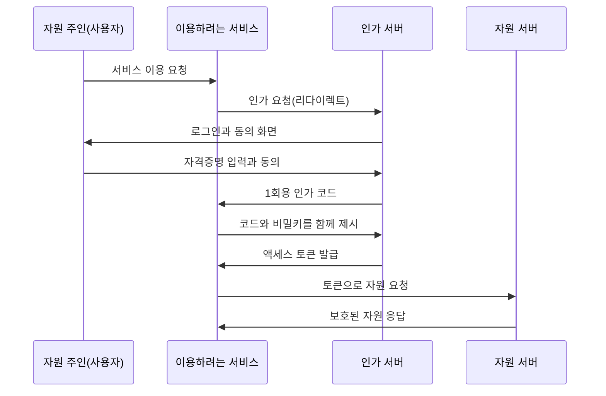
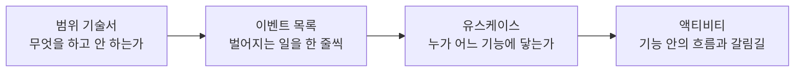
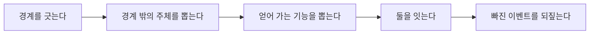
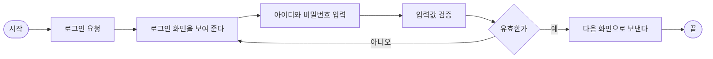

[앞 편](/blog/backend-engineering/auth-service-launch-map/)은 요구사항 한 줄이 배포 구성까지 내려오는 경로를 그렸다. 이 편이 맡는 것은 그 경로의 가장 왼쪽 두 칸이다 — 무엇을 만들 것인지 정하는 자리와, 그 결정을 다음 단계가 입력으로 받을 수 있는 형태로 굳히는 자리다.

「전사 통합 인증」은 요구로서는 한 줄이지만, 그 한 줄을 실현해 온 방식은 하나가 아니다. 사내 시스템들이 로그인 상태를 함께 인정하는 방식, 비밀번호를 넘기지 않고 접근 권한만 위임하는 방식, 사람이 개입하지 않고 시스템끼리 서로를 신뢰하는 방식이 각각 따로 발달했고 셋은 애초에 푸는 문제가 다르다. 무엇을 고를지 정하기 전에 각각이 무엇을 전제하는지부터 봐야 한다.

그보다 먼저 갈라야 할 것이 하나 있다. **인증과 인가**다. 둘을 한 덩어리로 다루면 뒤에서 벌어지는 일의 절반이 설명되지 않고, 특히 「권한을 즉시 거둔다」는 요구가 조용히 지켜지지 않는 상태가 된다. 후반부는 그렇게 내린 판단을 네 종류의 문서로 굳히는 작업이며, 그중 한 줄이 어떻게 데이터 구조 전체를 뒤집는지가 이 편의 마지막이다.

## 인증과 인가 — 실패했을 때 서로 다른 대답을 한다

두 낱말은 영어로도 앞 네 글자가 같아서 줄여 쓰면 더 헷갈린다. 그러나 시스템 안에서 둘은 다른 시각에 일어나고, 다른 데이터를 보고, 실패했을 때 다른 응답을 돌려준다.

| 구분 | 인증 | 인가 |
| --- | --- | --- |
| 묻는 것 | 주장하는 신원이 실제로 그 사람의 것인가 | 확인된 그 사람이 이 자원에 손댈 수 있는가 |
| 판단 재료 | 비밀번호나 생체 정보처럼 본인만 댈 수 있는 것 | 부여된 역할과 거기에 묶인 권한 |
| 순서 | 언제나 먼저다 | 인증을 통과한 뒤에만 성립한다 |
| 실패했을 때 | **401** — 아직 누구인지 모르니 신원부터 대라 | **403** — 누구인지는 알지만 이 자원은 안 된다 |
| 바뀌는 빈도 | 계정이 생기고 사라질 때 | 조직과 직무가 바뀔 때마다 |

마지막 행이 가장 실무적인 줄이다. **인증에 쓰이는 정보는 좀처럼 바뀌지 않는데 인가에 쓰이는 정보는 계속 바뀐다.** 사람이 들고 나는 빈도보다 조직이 개편되는 빈도가 훨씬 높기 때문이고, 그 요구는 「사람이 나가면 권한을 곧바로 거둔다」이다. 인가 판단을 인증 시점으로 끌어와 로그인할 때 권한을 전부 증표에 박아 두면, 권한을 거둬도 이미 발급된 증표에는 옛 권한이 남는다. 회수 화면은 정상적으로 동작하고 데이터베이스의 값도 제대로 바뀌므로 어긋남이 드러나지도 않는다. **시스템이 스스로 틀린 답을 확신 있게 내놓는 구간**이 만료 시각까지 이어지는 것이고, 이 시리즈가 두 낱말을 끝까지 따로 쓰는 이유가 여기에 있다.

## 하나의 로그인을 여럿이 인정하게 만드는 방식들

「계정 하나로 사내 시스템 전부를 쓴다」는 요구 앞의 선택지들은 서로 대체재가 아니다. 각각 다른 문제를 풀려고 만들어졌으므로 **무슨 문제를 푸는가**부터 갈라 두는 편이 낫다.

| 방식 | 푸는 문제 | 오가는 것 | 신뢰의 근거 | 이 프로젝트에서의 자리 |
| --- | --- | --- | --- | --- |
| **SSO** | 시스템마다 따로 로그인해야 한다 | 로그인했다는 사실 자체 | 한 곳이 인증을 도맡고 나머지는 그 판단을 받아 쓴다 | 만들려는 경험 그 자체다 |
| **OAuth** | 비밀번호를 넘기지 않고 내 자원만 쓰게 하고 싶다 | 범위와 기한이 제한된 접근 권한 | 자원의 주인이 직접 동의했다는 사실 | 위임 절차의 표준 형태를 빌려 온다 |
| **SAML** | 여러 서비스가 같은 신원 판단을 공유해야 한다 | 인증 결과와 사용자 속성을 담은 XML 문서 | 신원을 보증하는 쪽이 붙인 서명 | 사내 통합 인증의 오래된 구현 형태 |
| **App2App** | 사람이 없는데도 호출하는 쪽을 확인해야 한다 | 시스템 앞으로 발급된 자격증명 | 미리 등록된 시스템 목록과 허용 범위 | 캘린더가 근태 정보를 조회하는 연동 |
| **JWT** | 검증할 때마다 저장소를 뒤지고 싶지 않다 | 서명이 붙은 자기 완결적 문자열 | 발급자의 비밀키로 만든 서명 | 편4에서 서버 세션과 저울질하는 선택지 |

**앞의 넷은 「어떤 방식으로 신뢰를 옮기는가」의 답이고 마지막 하나는 「그 신뢰를 무엇에 실어 보내는가」의 답**이다. 층이 다르므로 SSO와 JWT 중에 무엇을 고를지 따지는 질문은 성립하지 않는다.

### 인증을 한곳에 모으면 보안이 올라간다

SSO가 주는 것 넷 중 둘은 편의의 문제다. 로그인하는 번거로움이 사라지고 거기 쓰이던 시간이 줄어든다. 나머지 둘은 성격이 다르다 — 인증 로직이 한곳으로 모이므로 취약한 구현이 한 군데만 남고, 접근 제어 정책도 한곳에서 통제된다. **인증 코드가 시스템 수만큼 있으면 그중 가장 허술한 하나가 전체의 수준이 된다.** 대가도 같은 자리에서 나온다. 그곳이 멈추면 전부 멈추므로, 편5가 배포를 길게 다루는 이유가 이 문장 하나다.

### 왜 토큰을 바로 주지 않고 코드를 한 번 거치는가

OAuth는 이름 때문에 오해받는 표준이다. 인증 프로토콜이 아니라 **권한 위임** 프로토콜이고, 표준화한 것은 「내 자원에 손댈 권한만 골라 다른 서비스에 떼어 주는 절차」다. 네 주체가 이런 순서로 주고받는다.

코드를 한 번 거치는 이유는 **경로가 다르기 때문**이다. 사용자를 거쳐 가는 화살표는 브라우저 리다이렉트로 오가고, 그렇게 실려 간 값은 주소창에 노출되며 방문 기록과 중계 서버의 로그에도 남는다. 액세스 토큰이 그 경로를 타면 흔적 하나하나가 그대로 유효한 자격증명이 된다. 반면 인가 코드는 한 번만 쓸 수 있고 수명이 짧아 로그에 남아도 이미 쓸모가 없으며, 실제 토큰은 서버끼리만 통하는 경로에서 교환된다. **노출되어도 무해한 값만 위험한 경로로 보내는 것**이 이 한 단계의 목적이다.

### 이미 돌아가는 것들을 같은 판단 아래 모으기

SAML은 신원을 보증하는 쪽이 만들어 넘기는 XML 문서를 중심에 둔 표준이다. 인증 결과와 사용자 속성이 함께 들어가므로 받는 쪽은 별도 조회 없이 「이 사람은 누구이고 어떤 소속인가」까지 알 수 있다. 지금 새로 고를 일은 많지 않아도 오래 돌아가고 있는 사내 시스템이 아는 방식이 이것뿐인 경우가 드물지 않다 — **통합 인증의 어려움은 새 방식을 고르는 데 있지 않고 이미 있는 것들을 같은 판단 아래 모으는 데 있다.**

### 사람이 없는 자리의 인증

App2App은 응용 프로그램 둘이 서로를 믿는 상태에서 안전하게 주고받도록 만드는 방식이다. 흔히 드는 예는 결제할 때 은행 앱으로 넘어갔다 돌아오는 흐름인데, 이 프로젝트에 등장하는 모습은 더 조용하다 — 캘린더 시스템이 근태 시스템에 같은 부서 구성원의 휴가 정보를 물어보는 자리다.

차이는 결정적이다. **인증받아야 할 주체가 사람이 아니라 시스템이다.** 비밀번호를 입력할 사람도 동의 화면을 볼 사람도 없으므로, 어떤 시스템이 어떤 기능에 접근해도 되는지를 미리 등록해 두었다가 요청이 올 때 대조하게 된다. 그래서 이 요구는 사람에게 역할을 주는 구조와 별개로 **시스템과 기능을 잇는 표**를 하나 더 부른다.

## JWT — 서명은 위조를 막지 내용을 감추지 않는다

JWT는 신원 정보를 담고 서명을 붙인 문자열이다. 점 두 개로 이어진 세 조각이 각각 다른 일을 맡는다.

| 조각 | 담는 것 | 성질 |
| --- | --- | --- |
| 헤더 | 이 문자열이 어떤 종류인지, 서명에 어떤 알고리즘을 썼는지 | 인코딩만 되어 있다 |
| 페이로드 | 발급자 · 만료 시각 · 발급 시각 같은 정해진 항목과 서비스가 직접 넣은 항목 | **누구나 그대로 읽을 수 있다** |
| 서명 | 앞의 두 조각을 비밀키로 계산한 값 | 내용이 바뀌었는지를 알려 준다 |

이 형식이 주는 이점은 **검증하는 쪽이 아무것도 기억하지 않아도 된다**는 하나로 모인다. 필요한 정보를 문자열이 스스로 들고 있어 저장소를 조회하지 않고 서명만 확인하면 되므로, 서버를 여러 대로 늘릴 때 「그 사용자의 상태가 어느 서버에 있는가」를 걱정하지 않아도 된다.

반드시 짚어야 할 것은 두 번째 행이다. **페이로드는 인코딩이지 암호화가 아니다.** 되돌리는 데 비밀키가 필요하지 않으므로 토큰을 가진 사람은 누구나 그 안의 값을 읽는다. 그래서 실수의 모양도 정해져 있다 — 노출되면 곤란한 값을 페이로드에 넣어 두고 서명이 붙어 있으니 안전하다고 여기는 것이다. 위조는 실제로 막히므로 검사도 통과하고 동작도 정상이며, **서명이 주는 안전과 필요한 안전이 다른 종류라는 것만 드러나지 않는다.**

발급하고 나면 만료 전까지 되돌릴 수 없다는 대가는 앞에서 본 권한 회수 요구와 정면으로 부딪힌다. 그 충돌의 처리가 편4의 갈림길이다.

## 요구를 문서로 굳히는 네 개의 산출물

이제 그 판단을 다음 단계가 받아 쓸 형태로 남겨야 한다. 요구사항 분석 단계의 산출물 넷은 독립된 문서가 아니라 **앞의 것이 뒤의 것을 만들어 내는 사슬**이다.

화살표 방향에 규칙이 하나 있다. **뒤의 문서는 앞의 문서에 없는 것을 새로 만들어 내지 않는다.** 이벤트 목록에 없던 기능이 유스케이스에 그려져 있다면 이벤트를 빠뜨렸거나 범위 밖을 그린 것이고, 어느 쪽이든 앞으로 돌아가 고쳐야 한다. **그 되짚음이 산출물을 형식에서 장치로 바꾼다.** 단계 사이에 이런 확인 지점을 세우는 이야기는 [사람 게이트를 단계의 경계로 두는 글](/blog/ai-transformation/sdlc-human-gates/)에서 다른 각도로 다뤘다.

### 범위 기술서 — 절반은 「안 하는 것」이다

| 항목 | 이 프로젝트의 내용 |
| --- | --- |
| 개요 | 전사 통합 인증 서비스를 새로 만든다. 접근 관리와 인증을 한곳에 모아 보안과 로그인 경험을 함께 개선한다 |
| 문제 | 캘린더 · 회의실 예약 · 근태의 로그인이 서로 달라 사용 경험이 나쁘다. 시스템끼리 연동하려 해도 기준으로 삼을 신원이 없다 |
| 목표 | 계정 한 쌍으로 모든 시스템에 접속한다. 캘린더가 회의실과 휴가 정보를 받아 오도록 시스템 간 인증도 함께 만든다 |
| 사용자 | 직무와 직급이 있는 사내 직원. 사람이 아닌 사용자도 있다 — 캘린더 · 근태 · 회의실 시스템 자신이다 |
| 만드는 것 | 인증 서비스 백엔드, 로그인 기능, 시스템 간 연동, 직무별 권한 관리 |
| 만들지 않는 것 | **웹 화면** |

마지막 행이 이 문서에서 가장 값비싼 한 줄이다. 무엇을 만들지는 말하지 않아도 대개 맞춰지지만, **무엇을 만들지 않는지는 적어 두지 않으면 아무도 같은 그림을 갖고 있지 않다.** 화면이 없다는 사실은 개발이 끝날 무렵에야 드러나고 그때는 기대 불일치가 그대로 일정 문제가 된다. 이 결정은 산출물의 경계를 API로 정하므로, 다음 단계에서 명세서 문장 옆에 붙는 것도 메서드와 경로가 된다.

### 이벤트 목록 — 한 줄이 스키마를 뒤집는다

이벤트 목록은 시스템에서 벌어지는 동작과 상태 변화를 한 문장씩 늘어놓은 문서다. 사용자의 행동만이 아니라 외부 시스템과의 주고받음도 같은 층위에 놓는다.

| # | 벌어지는 일 | 유형 |
| ---: | --- | --- |
| 1 | 사람이 새로 들어오면 인사팀이 계정을 만든다 | 사용자 관리 |
| 2 | 인사팀이 직무에 맞는 권한을 준다 | 권한 관리 |
| 3 | 인사팀이 이미 준 권한을 바꾼다 | 권한 관리 |
| 4 | 사람이 나가면 인사팀이 권한을 곧바로 거둔다 | 권한 관리 |
| 5 | 사용자가 아이디와 비밀번호로 신원을 확인받는다 | 인증 |
| 6 | 인사팀이면 계정을 만들고 지울 수 있다 | 인가 규칙 |
| 7 | 조직장이면 휴가를 승인할 수 있다 | 인가 규칙 |
| 8 | **인사팀이면서 조직장이면 두 가지를 다 할 수 있다** | 인가 규칙 |
| 9 | 인사팀이 아니면 계정을 만들거나 지울 수 없다 | 인가 규칙 |
| 10 | 조직장이 아니면 휴가를 승인할 수 없다 | 인가 규칙 |
| 11 | 로그인 상태는 여덟 시간까지 유지되고, 지나면 다시 로그인해야 한다 | 세션 정책 |
| 12 | IT팀이 각 시스템의 기능을 API 단위로 등록한다 | 시스템 관리 |
| 13 | IT팀이 캘린더가 회의실 예약 기능을 쓰도록 허용한다 | 시스템 간 연동 |
| 14 | IT팀이 회의실 예약이 캘린더를 조회하도록 허용한다 | 시스템 간 연동 |
| 15 | IT팀이 캘린더가 같은 부서의 휴가 정보를 보도록 허용한다 | 시스템 간 연동 |

인가 규칙 다섯 줄 중 넷은 할 수 있다는 줄과 할 수 없다는 줄로 짝을 이룬다. **부정형을 굳이 따로 적는 이유는 그것이 검사해야 할 항목이기 때문**이다. 「조직장이면 승인할 수 있다」만 있으면 조직장이 아닌 사람이 승인을 시도했을 때 무엇이 일어나야 하는지가 어디에도 없다.

8번은 설계를 결정하는 줄이다. 이 줄이 없으면 사용자 표에 역할 열 하나만 있으면 되지만, 한 사람이 역할을 둘 이상 가질 수 있는 순간 그 열은 성립하지 않고 **사람과 역할을 잇는 별도의 표가 필요해진다.** 스키마를 먼저 그린 뒤에 이 요구를 만났다면 이미 만든 구조를 뜯어야 했다.

### 유스케이스 — 경계를 먼저 그어야 행위자가 정해진다

유스케이스 다이어그램은 앞에서 늘어놓은 이벤트에 구조를 준다. 누가 무엇을 하는지를 관계로 묶어 한 장에 보이게 만드는 것이다.

| 요소 | 무엇인가 | 이 프로젝트에서 |
| --- | --- | --- |
| 행위자 | 시스템 바깥에서 시스템과 주고받는 주체 | 일반 사용자 · 인사팀 · IT팀, 그리고 캘린더 · 근태 · 회의실 시스템 |
| 유스케이스 | 행위자가 시스템에서 얻어 가는 기능 단위 | 계정 등록 · 권한 부여 · 계정 삭제 · 로그인 · API 등록 |
| 관계 | 어느 행위자가 어느 기능에 닿는가 | 「인사팀이 계정을 등록한다」 |

첫 칸이 가장 중요하다. **무엇이 우리 시스템 안이고 무엇이 바깥인지를 정해야 행위자가 결정된다.** 캘린더 · 근태 · 회의실 예약은 경계 바깥의 행위자이지 구현 대상이 아닌데, 경계를 긋지 않은 채 시작하면 이 셋이 「연동할 대상」에서 슬그머니 「같이 만들 것」으로 넘어오고 범위 기술서가 못 박아 둔 선이 무너진다. 그 셋이 사람들과 나란히 적혀 있다는 사실도 그냥 지나칠 자리가 아니다. 앞에서 본 App2App 요구가 문서의 모양으로 나타난 것이고, 이 셋이 행위자로 인정되었기 때문에 「시스템의 신원을 어떻게 저장할 것인가」가 정식 질문이 된다.

### 액티비티 다이어그램 — 실패 경로가 없으면 예외 처리도 없다

액티비티 다이어그램은 유스케이스 하나의 내부를 연다. 시작과 끝 사이에 동작과 갈림길을 놓아 논리의 순서를 드러내는 그림이다.

원본 그림은 여기서 한 겹 더 나아가 사용자 · 휴가 시스템 · 인증 시스템이라는 세로 구획 셋을 둔다. 같은 흐름을 구획으로 나눠 그리면 **각 동작이 누구의 몫인지**가 드러난다. 화면을 보여 주는 일은 휴가 시스템의 몫이고 입력값을 검증하는 일은 인증 시스템의 몫이라는 사실이 설명 문장이 아니라 위치로 표시되며, 화면 쪽 구획이 우리 구현 대상이 아니라는 점도 함께 드러난다.

반드시 그려야 하는 것은 갈림길에서 「아니오」로 빠지는 화살표다. 이 선이 없어도 그림은 멀쩡해 보이지만, **실패 경로가 그려지지 않은 다이어그램은 예외 처리가 없는 코드가 된다.** 되돌아가는 화살표를 그리는 순간 「몇 번까지 다시 시도하게 할 것인가」가 따라 나오고, 그 질문이 명세 문장이 된다.

## 정리

이 편이 다룬 것은 두 종류의 작업이다. 앞쪽은 판단이었다 — 인증과 인가를 가르고, 통합 인증을 실현하는 방식들이 각각 무엇을 전제하는지 따져 본 부분이다. 뒤쪽은 그 판단을 문서로 굳히는 일이었다.

둘을 관통하는 것은 **결정보다 결정의 근거가 오래 남아야 한다**는 것이다. 「JWT를 쓴다」는 결정만 남으면 반년 뒤 민감한 값을 페이로드에 넣자는 제안이 들어왔을 때 막을 근거가 없다. 「서명은 위조를 막지 내용을 감추지 않는다」까지 남아 있어야 그 제안을 막을 수 있고, 산출물 문서를 형식으로 다루느냐 장치로 다루느냐가 갈리는 자리가 여기다.

문서 넷 중 가장 소박해 보이는 이벤트 목록이 이 편에서 가장 큰 일을 했다는 점도 기록해 둘 값어치가 있다. 한 사람이 역할을 둘 이상 가질 수 있다는 한 줄이 데이터 구조를 바꿔 놓았는데, 그 줄은 대단한 통찰의 결과가 아니라 **벌어질 일을 빠짐없이 늘어놓다 보니 나온 것**이다. 사슬의 앞쪽에서 성실하게 늘어놓는 일이 뒤쪽에서 구조를 뜯는 일을 대신한다.

다음 편은 이 문서들이 실제로 다음 단계의 입력이 되는 과정을 따라간다. 요구 문장 하나마다 API 한 줄이 붙고, 그렇게 쌓인 표에서 되풀이되는 명사가 엔티티 후보로 올라오며, 후보끼리 몇 개씩 이어지는지를 정하는 동안 저장 구조가 확정되는 길이다. 여기서 8번 이벤트가 요구했던 「사람과 역할을 잇는 표」가 실제 이름을 갖게 된다.
