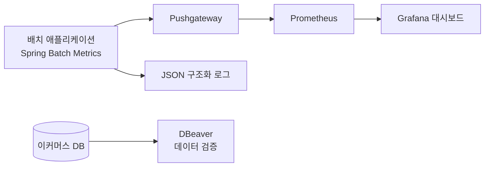
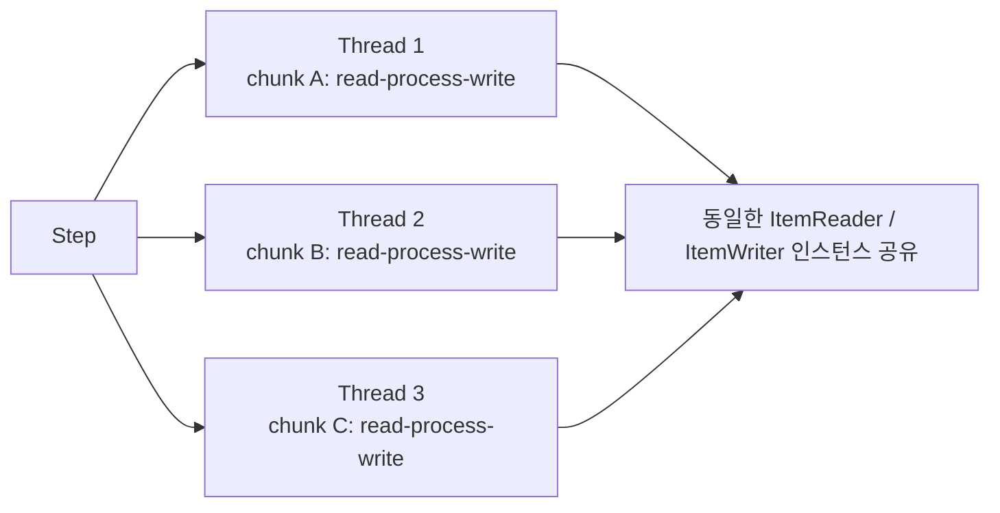
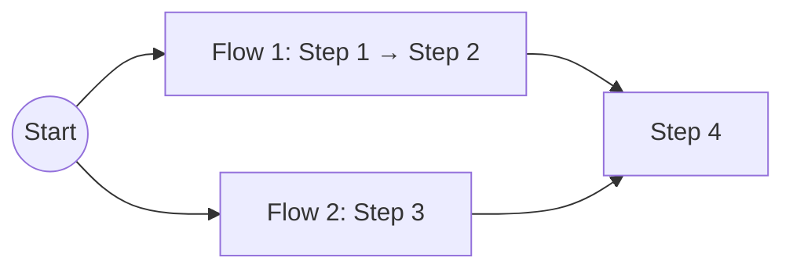
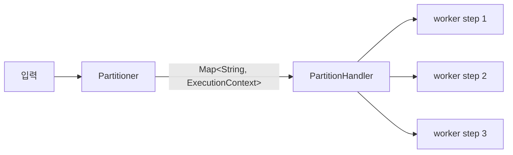

상품 1천만 건을 등록하는 배치가 끝까지 돈다고 하자. 그것으로 끝이 아니다 — 요구사항이 정한 것은 **10분 내에 1천만 건**이고, 그 목표는 초당 약 1.7만 건을 요구한다. 끝까지 도는 것과 시간 안에 끝나는 것은 다른 조건이다. [시리즈 편1](/blog/backend-engineering/batch-processing-fundamentals/)에서 다섯 요구사항 중 셋에 시간 제약이 붙어 있었던 이유가 여기서 드러난다.

가장 먼저 떠오르는 답은 스레드를 늘리는 것이고, 그것이 대체로 가장 나쁜 답이다. 읽기가 병목인 잡에 스레드를 늘리면 같은 Reader 하나를 놓고 줄을 서고, 쓰기가 병목인 잡에서 chunk size를 줄이면 커밋 횟수가 늘어 오히려 느려진다. 두 경우 모두 **손댄 방향이 아니라 손댄 자리가 틀렸다.** 이 글이 다루는 것은 「무엇이 빠른가」가 아니라 **「무엇을 어떤 순서로 손대는가」다**.

## 튜닝은 다섯 축이고 병렬화는 그중 한 칸이다

원본이 성능 작업의 순서를 못박아 두었다 — **측정 → 병목 분석 → 튜닝**. 측정은 다시 네 단계로 나뉜다.

세 번째와 네 번째 노드가 나뉜 것이 중요하다. 단계별 소요 시간은 **어디가** 느린지를, 시스템 리소스는 **왜** 느린지를 알려 준다 — 쓰기가 느린데 디스크 I/O가 한가하다면 원인은 커밋 횟수나 락 대기다. 병목 분석도 같은 축을 따른다. 읽기·처리·쓰기 중 어디인지 짚고, 리소스 사용 패턴을 보고, 그 둘을 겹쳐 시나리오를 세운다.

그다음이 튜닝이고, 원본은 수단을 다섯 축으로 정리했다.

| 튜닝 축 | 세부 수단 |
| --- | --- |
| 데이터베이스 튜닝 | 쿼리 최적화 / 인덱스 설정 / 배치 쿼리 실행 / 캐싱 활용 |
| I/O 성능 최적화 | 파일 처리 최적화 / 네트워크 I/O 튜닝 |
| CPU 및 메모리 최적화 | **멀티스레딩 및 병렬 처리** / 메모리 관리 최적화 / 메모리 풀 관리 |
| 배치 청크 크기 조절 | 작은 청크 ↔ 큰 청크 |
| 캐싱 및 데이터 로딩 전략 | 읽기 성능 최적화 / 지연 로딩 |

이 표가 말하는 것은 수단의 목록이 아니라 **비중**이다. 이 글의 나머지를 거의 다 차지하는 병렬화는 다섯 축 중 하나의, 그 안에서도 세 항목 중 하나다. 인덱스 없는 조회로 읽고 있다면 스레드를 늘려도 그 비효율이 스레드 수만큼 복제된다 — **병렬화는 단위 작업이 이미 효율적일 때만 듣는다.**

## 측정 설비가 먼저다 — 배치는 긁어 갈 때 살아 있지 않다

| 요소 | 역할 | 왜 이 선택인가 |
| --- | --- | --- |
| **Pushgateway** | 배치가 메트릭을 **push** | 배치는 단명 프로세스다. Prometheus의 pull 주기가 오기 전에 프로세스가 끝나 버리므로 push 중계가 필요하다 |
| Prometheus | 메트릭 저장 | Spring Batch Metrics(Micrometer)가 Step별 처리 건수·소요 시간을 노출한다 |
| Grafana | 시각화 | 단계별 처리량 그래프로 병목 지점을 눈으로 식별한다 |
| JSON 로깅 | 구조화 로그 | 거래 트랜잭션 로그를 **다음 배치의 입력**으로 쓴다. 사람이 읽는 로그가 아니라 기계가 파싱하는 데이터다 |
| DBeaver | DB 클라이언트 | 처리 건수와 실제 적재 결과를 대조한다 |

표에서 첫 행만 성격이 다르다. 나머지 넷은 도구 선택이지만 **Pushgateway는 배치라는 실행 형태가 강제한 것**이다. 그리고 pull 주기를 놓치는 것보다 나쁜 사정이 하나 더 있다 — **처리량이 가장 궁금한 순간은 잡이 끝나는 지점인데, 그때 프로세스는 이미 없다.**

JSON 로그가 관측 수단이면서 **파이프라인의 소스**이기도 한 것은 편1의 요구사항 4 때문이다 — API가 남긴 거래 로그를 배치가 읽어 일별 보고서를 만든다. 다음 단계의 입력이 되는 순간 로그 형식은 취향이 아니라 **스키마**가 된다.

이 설비 위에서 볼 지표는 읽기·처리·쓰기 각 단계의 소요 시간, 그리고 CPU 사용률·메모리 사용량·디스크 I/O·네트워크 대역폭이다.

## 병렬화는 셋이고, 셋이 쪼개는 대상이 서로 다르다

원본은 이 절에 **「반드시 구분해서 답할 것」이라는** 단서를 붙였다. 세 방식이 이름만 비슷하고 실제로는 다른 층위의 결정이기 때문이다.

### ① Multi-threaded Step — chunk마다 스레드를 붙인다

하나의 Step 안에서 chunk 단위로 스레드를 할당한다. `TaskExecutor` 지정이 전부라 구현 비용이 없다시피 해서 가장 먼저 시도된다. 대가는 도식 오른쪽 끝에 있다 — 세 스레드가 chunk를 각자 처리하지만 **읽어 오는 곳과 써 내리는 곳은 하나씩뿐이다.** 이 한 칸이 뒤에 나올 문제 전부의 출발점이다.

### ② Parallel Step — Flow마다 스레드를 붙인다

서로 **다른 일**을 하는 Step 묶음을 동시에 돌린다. 편1의 요구사항 5 — 여러 종류의 보고서를 동시에 생성하는 것 — 이 이 케이스다. Flow마다 자기 Reader로 다른 데이터를 보므로 아래에서 다룰 thread-safety 문제가 **발생하지 않고**, 대신 병렬도의 상한이 작업 개수로 묶인다. **「이 잡이 느리다」가 아니라 「이 잡들이 순서대로 도느라 오래 걸린다」에 대한 답이다.**

### ③ Partitioning — worker step마다 스레드를 붙인다

Manager 역할이 입력을 파티션으로 쪼개고 **파티션마다 독립된 worker step**을 실행한다.

성질은 화살표 위의 자료구조가 거의 다 설명한다. `Partitioner`가 계산한 경계를 `ExecutionContext`에 담아 넘기는데, 편1의 용어 정리에서 그것은 「재시작을 위한 키-값 상태 저장소」였다. **경계값이 재시작 상태와 같은 그릇에 실려 나가므로** worker는 자기 Reader와 `StepExecution`을 갖는다.

### 세 방식이 갈라지는 지점은 한 줄이다

| 구분 | 단일 스레드 | Multi-threaded Step | Parallel Step | Partitioning |
| --- | --- | --- | --- | --- |
| 병렬 단위 | 없음 | **chunk** | **Flow(Step 묶음)** | **worker step(파티션)** |
| 쪼개는 대상 | — | 같은 입력 스트림 | 서로 다른 작업 | 입력 데이터 범위 |
| Reader 인스턴스 | 1개 | **공유(1개)** | Flow별 별도 | **파티션별 별도** |
| StepExecution | 1개 | 1개 | Step별 1개 | **파티션별 1개** |
| Reader thread-safety | 무관 | **필수 — 최대 난제** | 무관(작업이 다름) | **구조적으로 해결** |
| 재시작 정밀도 | 정확 | **부정확해지기 쉬움** | Step 단위 | **파티션 단위로 정확** |
| 구현 난이도 | 최저 | 낮음 | 낮음 | 높음(Partitioner 설계) |
| 확장 한계 | 1코어 | 단일 JVM | 작업 수만큼 | 단일 JVM → **원격 파티셔닝으로 다중 노드 확장 가능** |
| 언제 쓰나 | 데이터가 적을 때 | 빠르게 처리량을 올리고 싶고 Reader가 안전할 때 | 독립 작업이 여러 개일 때 | 대용량 + 재시작 정확도 + 확장성이 모두 필요할 때 |

아홉 행이 나열돼 있지만 **독립된 아홉 개의 차이가 아니다.** 세 번째 행 — Reader 인스턴스를 공유하는가 — 이 정해지면 아래 세 행이 따라 나온다. 공유하면 thread-safety가 필수가 되고 「어디까지 읽었는가」가 무너지며, 다른 데이터를 보면 두 문제가 아예 성립하지 않는다. 파티션마다 별도로 두면 공유가 없으면서 **같은 입력을 나눠 처리한다** — 셋 중 유일하게 큰 작업 하나를 안전하게 쪼갠 경우다.

끝에서 두 번째 행도 여기서 나온다. 파티션이 자기 상태를 들고 다니므로 **그 상태를 다른 노드로 보낼 수 있다** — 원격 파티셔닝은 부가 기능이 아니라 `Map<String, ExecutionContext>`라는 자료구조 선택의 귀결이다.

## 병렬로 돌리면 무엇이 깨지는가

편1이 차례로 깨진다고 예고한 세 가지 — Reader의 thread-safety, 트랜잭션 경계, 재시작 가능성 — 가 실제로 깨지는 자리가 여기다.

| 이슈 | 무슨 일이 나는가 | 대응 |
| --- | --- | --- |
| **Reader thread-safety** | 대부분의 `ItemReader`는 「다음에 읽을 위치」라는 **상태**를 가진다. 여러 스레드가 `read()`를 동시에 호출하면 같은 행을 두 번 읽거나 건너뛴다 | `synchronized` 래핑(`SynchronizedItemStreamReader`), 또는 애초에 Partitioning으로 Reader를 분리 |
| **상태 저장 Reader의 재시작 붕괴** | 상태를 가진 Reader는 `ExecutionContext`에 진행 위치를 저장한다. 멀티스레드에서는 어떤 스레드의 위치를 저장할지 정의되지 않아 **「어디까지 처리했는가」가 부정확**해진다 | `saveState(false)`로 상태 저장을 끄고 **재시작을 포기**하거나, Partitioning으로 전환 |
| Reader를 감싸면 병목이 옮겨감 | `synchronized`로 안전하게 만들면 읽기가 직렬화된다. 스레드를 늘려도 읽기 처리량이 안 늘어난다 | 처리·쓰기가 무거운 잡에만 유효. 읽기 병목이면 파티셔닝이 정답 |
| Writer 경합 | 파일 하나에 여러 스레드가 쓰면 라인이 섞인다 | 파티션별 출력 파일을 분리하고 마지막에 병합 |
| DB 커넥션 풀 고갈 | 스레드 수 > 커넥션 풀 크기이면 스레드가 커넥션을 기다리며 굶는다 | 풀 크기와 스레드 수를 함께 사이징 |
| 온라인 서비스 간섭 | 배치가 락·I/O를 점유해 실시간 API 지연 유발 | 배치 윈도우 조정, 읽기 전용 복제본 사용, 낙관/비관 잠금 전략 선택 |

여섯 항목은 성격이 둘로 갈린다. **앞의 셋은 데이터가 틀어지는 문제**이고 뒤의 셋은 자원이 모자라는 문제다. 앞의 셋이 나쁜 것은 예외를 던지지 않는다는 점이다 — 배치는 정상 종료하고 건수도 그럴듯하게 찍히는데 적재된 값이 틀려 있다.

그중 `saveState(false)`는 표에 적힌 것보다 무겁다. 설정 한 줄로 끝나 보이지만 실제로는 **운영 조건을 바꾼다** — 실패 시 「대상 전체를 처음부터」 돌려야 하므로 두 번 돌려도 결과가 같아야 하고, 누적 갱신처럼 이중 반영되면 값이 틀어지는 연산은 쓸 수 없다.

### 배치와 온라인이 같은 DB를 볼 때

편1의 시스템 도식에서 API와 배치는 **같은 DB를 가리키고** 있었고, 병렬화란 배치 쪽 자원 점유를 키우는 일이다. 두 잠금 전략의 동작 자체는 [트랜잭션과 동시성 제어](/blog/backend-engineering/transactions-and-concurrency-control/)가 이미 쿼리 수준까지 갈라 놓았다. **배치에서만 달라지는 것은 조건이다.**

첫째, **잠그는 범위가 다르다.** API 요청 하나는 행 몇 개를 잠그지만 배치는 전량을 훑으므로, 비관적 잠금을 쥐면 그 범위의 온라인 요청이 배치가 지나갈 때까지 막힌다. 둘째, **롤백 단위가 다르다.** 트랜잭션 경계가 chunk이므로 낙관적 잠금에서 한 건만 충돌해도 chunk 전체가 되돌아간다. 셋째, 그래서 먼저 볼 것은 잠금 전략이 아니라 **시간과 대상의 분리**다 — 표 마지막 행이 잠금 전략을 맨 뒤에 적어 둔 것이 그 순서다.

원본은 이 절을 한 줄로 닫는다 — **Multi-threaded Step은 싸고 위험하고, Partitioning은 비싸고 안전하다.**

## 입력을 어떻게 쪼갤 것인가

### 이 파티셔닝은 그 파티셔닝이 아니다

이 카테고리에서 「파티셔닝」이라는 말이 나오는 것은 이번이 세 번째다. 그리고 세 번 모두 **다른 것을 쪼갠다.**

| 어디서 | 쪼개는 대상 | 언제까지 남는가 |
| --- | --- | --- |
| [파티셔닝의 출발점](/blog/backend-engineering/partitioning-fundamentals/) | 테이블 — 컬럼을 나누거나(수직) 행을 나눈다(수평) | **영구** — 저장 구조 자체가 바뀐다 |
| [파티셔닝 전략과 샤딩](/blog/backend-engineering/partitioning-strategies-and-sharding/) | 저장된 데이터의 조각 배치, 그리고 같은 구조가 반복되는 메시징 계층의 토픽 | **영구** — 조각 수가 순서 보장과 재배치 비용의 단위다 |
| **이 글** | **한 번의 실행** — 처리할 입력 범위를 N조각으로 나눈다 | **실행이 끝나면 사라진다** |

앞의 두 글에는 「이 글에서 파티셔닝이란」류의 단서가 없다. 문맥으로 자명했기 때문이다. 세 번째는 자명하지 않다.

차이는 앞 글이 세워 둔 질문에 답해 보면 드러난다. [파티셔닝 전략과 샤딩](/blog/backend-engineering/partitioning-strategies-and-sharding/)이 분할 전략을 관통하는 기준으로 삼은 것은 **「이 결정을 나중에 되돌릴 수 있는가」였고**, 뒤로 갈수록 답이 나빠졌다 — 데이터가 물리적으로 옮겨 가고, 샤드 키를 잘못 고르면 마이그레이션이 필요하며, 파티션 수를 늘리면 `hash(key) % N`의 결과가 바뀌어 키별 순서를 더는 신뢰할 수 없다.

**Spring Batch의 Partitioning은 같은 질문에 반대로 답한다.** 테이블은 그대로 있고, 파티션은 `ExecutionContext`에 담긴 경계값일 뿐이라 잡이 끝나면 사라진다. 이번 실행과 다음 실행의 조각 수를 다르게 잡아도 옮겨 다니는 데이터가 없다. 그래서 아래 여섯 가지는 앞의 두 글이 다룬 분할 전략과 **선택의 무게가 다르다** — 잘못 고르면 이번 실행이 느릴 뿐이고, **재 보고 바꾸는 것이 정상적인 작업 방식이다.**

### 여섯 가지 분할 방식

| 전략 | 방식 | 주의점 |
| --- | --- | --- |
| 고정된 균등 분할 | 전체 건수를 N등분 | 데이터 분포가 균일해야 효과. **skew**에 취약 |
| 키 열을 기준으로 분할 | PK·날짜 등 키 범위로 분할 | 가장 보편적. 인덱스 필수 |
| 뷰를 사용한 분할 | 파티션별 뷰 정의 | DBA 협의 필요 |
| 테이블을 파일로 추출 후 분할 | 덤프 후 파일 단위 분할 | I/O 2배지만 DB 부하는 낮춘다 |
| 처리 표시기 추가 | 처리 상태 컬럼으로 구분 | 갱신 비용·경합 발생 |
| 해싱 컬럼 사용 | 해시값 모듈러로 분산 | 분포는 고르나 범위 스캔 불가 |

「키 열을 기준으로 분할」의 주의점 칸에 붙은 「인덱스 필수」는 경고라기보다 **이 방식이 보편적인 이유**다 — PK나 날짜 컬럼에는 이미 인덱스가 있고 범위 조건이 그것을 그대로 탄다.

「해싱 컬럼 사용」은 앞 글과 그대로 이어진다. 계산식이 [파티셔닝 전략과 샤딩](/blog/backend-engineering/partitioning-strategies-and-sharding/)의 Hash 전략과 글자 그대로 같은 `hash(key) % N`이고 성질도 물려받는다 — 분포는 고르되 범위 스캔이 안 된다. 다른 것은 N을 바꾸는 비용뿐이고, **같은 수식이 어느 층에 놓이느냐에 따라 되돌릴 수 없는 결정이 되기도 하고 튜닝 파라미터가 되기도 한다.**

### 파티션 수는 병렬도가 아니다

원본이 실무 팁을 하나 남겼다. **파티션 수를 스레드 수보다 넉넉히 크게 잡으라는 것.** 둘이 같으면 스레드마다 파티션 하나를 잡고 끝까지 가는데, 그중 하나가 유독 무거우면 나머지가 끝난 뒤에도 혼자 돌면서 전체 종료 시각을 붙잡아 둔다(straggler). 잘게 나누면 먼저 끝난 스레드가 다음 파티션을 집어 가므로 부하가 평준화된다.

**파티션 수가 정하는 것은 병렬도가 아니라 작업 단위의 크기다.** 병렬도는 스레드 수(원격 파티셔닝이라면 노드 수)가 정한다. 표 첫 줄의 skew 주의점과 같은 이야기이기도 하다 — 잘게 써는 것이 분포 불균등을 흡수하는 가장 싼 방법이다.

## 정리

순서가 전부다. **측정 설비를 먼저 세우고** — 배치는 단명 프로세스라 끝난 뒤에는 물어볼 수 없다 — 병목을 확정한 다음에야 병렬화가 온다. 세 방식은 쪼개는 대상이 다르고, 비교표의 아홉 행은 결국 **Reader 인스턴스를 공유하는가** 한 줄에서 갈라진다. 공유하면 싸고 위험하고, 나누면 비싸고 안전하다.

그리고 여기서 쪼개는 것은 저장 구조가 아니라 한 번의 실행이라 잘못 골라도 다음에 다시 정하면 된다. 다만 그러려면 처음으로 돌아가야 한다 — **재 볼 수 있어야 한다.**

다음 편은 이 시리즈가 세운 선택지들을 나란히 놓고 되짚는다. 어떤 상황에서 무엇을 고를지, 터졌을 때 어떤 실패 모드가 나오는지를 문답으로 다룬다.
