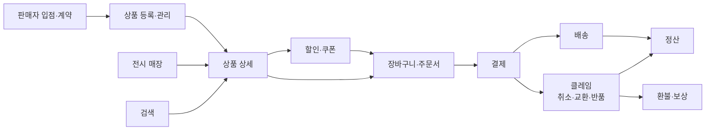
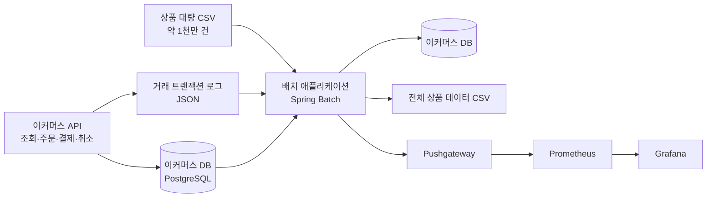

상품 1천만 건을 CSV 한 장으로 등록해 달라는 요구가 들어왔다고 하자. 이미 있는 상품 등록 API를 반복 호출하는 방법이 가장 먼저 떠오른다. 건당 1밀리초라고 낙관적으로 잡고 곱해 봐도 1천만 건이면 두 시간 반이 넘고, 그동안 이 호출은 실제 고객이 쓰는 커넥션 풀·트랜잭션 로그·인덱스를 놓고 다툰다. 이 방법이 실패하는 지점은 「느리다」가 아니다. **「도는 동안 옆에 있는 서비스가 같이 느려진다」** 가 실패다.

「그러면 새벽에 나눠서 돌리자」는 대답이 이미 배치다. 이 한 문장 안에 두 가지 결정이 들어 있다. 결과를 지금 받지 않아도 된다고 인정한 것이 하나고, 그 대가로 한 번에 훨씬 많은 양을 밀어 넣겠다고 정한 것이 둘이다. **배치는 느린 처리가 아니라 지연을 내주고 처리량을 사는 거래다.** 이 글은 그 거래의 전제를 맡는다 — 무엇을 배치로 넘길지 정하는 기준, 그 결정이 되돌려 주는 청구서, 그리고 도구들 사이에서 Spring Batch가 서 있는 자리다. 나머지 네 편이 「어떻게」를 맡으므로 「왜」는 여기서 끝낸다.

## 배치가 붙는 자리는 거래 체인의 양 끝이다

이커머스는 판매자가 상품을 올리는 데서 시작해 고객이 사고 받는 것을 거쳐 정산으로 닫히는 체인이다.

배치가 들러붙는 곳은 이 체인의 **양 끝**이다. 앞단은 판매자가 한 번에 밀어 넣는 상품 대량 등록과 대량 다운로드이고, 뒷단은 정산과 보고서를 위한 일별 집계다. 가운데의 조회·장바구니·결제·클레임은 실시간 API의 영역이다.

양 끝과 가운데를 가르는 기준은 데이터의 양이 아니다. 결제는 건당 데이터가 작지만 하루 총량으로 보면 상품 등록보다 클 수도 있다. 기준은 **그 응답을 사람이 화면 앞에서 기다리고 있는가**다. 결제 버튼을 누른 고객은 기다린다. 어제치 정산 보고서를 받는 쪽은 기다리지 않는다 — 정확히는 내일 아침까지만 나오면 된다. 이 「기다리지 않는 구간」의 길이가 곧 배치에 허용된 시간이고, 뒤에 나올 용어 사전이 Batch Window라고 부르는 것이 이것이다.

## 왜 실시간으로 하지 않는가

### 지연을 허용하는 일곱 가지 일

원본은 배치가 필요한 영역을 일곱으로 나눠 놓았다.

| 영역 | 왜 배치인가 |
| --- | --- |
| 대량의 주문·결제 데이터 처리 | 건별 실시간 처리로는 비용·부하가 감당 안 되는 집계·정산 |
| 재고 관리 및 공급망 최적화 | 주기적 재계산이 본질. 실시간일 필요가 없다 |
| 대규모 로그 및 사용자 데이터 처리 | 발생량이 요청량과 비례해 폭증. 야간 배치 윈도우로 밀어낸다 |
| 대규모 마케팅 데이터 분석 | 분석은 스냅샷 기준. 지연 허용 |
| 정기적인 데이터 백업 및 복구 | 정의상 주기 작업 |
| 데이터 일관성 유지 | 이기종 시스템 간 정합성 보정 |
| 비용 절감 및 시스템 최적화 | 트래픽이 적은 시간대의 유휴 자원을 사용 |

일곱 개는 병렬로 나열돼 있지만 이유는 **셋으로 접힌다.** 첫째, **결과를 기다리는 사람이 없다** — 백업·분석·정산 보고서는 응답 시간이 아니라 「정해진 시각까지 나왔는가」로 평가된다. 둘째, **입력이 요청 수와 비례하지 않고 쌓인다** — 요청 하나가 로그 수십 줄을 만들므로 처리할 양은 트래픽보다 가파르게 늘고, 이 격차는 요청 처리 경로 안에서 흡수되지 않는다. 셋째, **같은 자원이 시간대마다 값이 다르다** — 낮에는 고객의 응답 시간을 깎아 먹는 CPU가 새벽에는 놀고 있다.

앞의 둘은 **실시간으로 하면 안 되는** 쪽이고 셋째는 **배치로 하면 이득인** 쪽이다. 셋째만 해당하는 일은 자원이 넉넉해지면 되돌릴 수 있지만, 앞의 둘은 구조가 바뀌어야 되돌아온다.

### 배치와 실시간을 가르는 축은 사실 하나다

| 주제 | 배치 처리 | 실시간 처리 |
| --- | --- | --- |
| 데이터 처리 방식 | 일정 주기마다 처리 | 데이터 발생 즉시 처리 |
| 용도 | 대량 데이터 처리 | 사용자 상호작용에 즉각 응답 |
| 장점 | 효율적, 대규모 처리 | 즉각적 대응, 실시간 정보 제공 |
| 단점 | 실시간성 부족 | 처리 비용이 높음 |

네 행은 독립된 차이가 아니라 **한 축의 앞뒤**다. 첫 행에서 「언제 처리하는가」가 정해지면 다루는 양도, 건당 비용도, 현재와 벌어지는 간극도 따라 나온다. 그래서 설계에서 정할 것도 하나다 — **얼마나 오래된 데이터까지 정답으로 인정할 것인가.** 0에 가까우면 실시간, 하루면 야간 배치, 몇 분이면 마이크로 배치나 스트리밍이 들어올 자리다.

### 배치가 대신 내주는 것

| 장점 | 단점 |
| --- | --- |
| 효율적인 자원 사용 | 실시간 대응 불가 |
| 비용 절감 | 처리 시간 지연 |
| 신뢰성 | 복잡한 관리 |

이 표에서 눈여겨볼 짝은 마지막 행이다. **「신뢰성」과 「복잡한 관리」는 서로 마주 보는 항목이 아니라 같은 것의 앞뒤다.**

배치가 신뢰성이 높다고 말할 수 있는 근거는 하나뿐이다. 1천만 건 중 900만 건째에서 터졌을 때 처음이 아니라 **거기서부터** 다시 시작할 수 있다는 것. 그런데 「거기서부터」를 알려면 어디까지 처리했는지를 잡이 죽어도 남는 곳에, 즉 DB에 적어 둬야 하고, 그러려면 실행 이력 스키마와 규약이 필요하다. **신뢰성은 공짜로 오지 않고 관리해야 할 상태의 형태로 청구서가 돌아온다.** Spring Batch가 하는 일의 절반이 이 청구서를 대신 받아 주는 것이고, 편2가 그 구조를 다룬다.

운영에서 계속 되돌아오는 질문은 원본이 여섯 가지로 정리해 두었다 — **배치 처리 주기 설정 / 시스템 자원 및 비용 관리 / 데이터 보안 및 개인정보 보호 / 장애 대응 및 복구 계획 / 데이터 일관성 및 무결성 보장 / 스케줄링 및 워크플로우 관리**.

원본은 여섯 가지를 나열하는 데서 멈춘다. 여기에 읽는 각도를 하나 덧붙이면 — **이 구분은 원본에 없는 이 글의 정리다** — 프레임워크가 상당 부분 받아 주는 것은 장애 대응·복구와 데이터 일관성 보장 **둘뿐**이다. 재시작과 Skip·Retry가 기능으로 있고, 청크 단위 트랜잭션 경계가 규약으로 주어지기 때문이다. 나머지 넷은 도구를 무엇으로 고르든 조직이 계속 지는 부담으로 남고, 그래서 「배치로 돌리자」는 기술 선택이 아니라 운영 결정이 된다.

## 무엇으로 배치를 도는가

| 스택 | 성격 | 언제 고르나 |
| --- | --- | --- |
| **Spring Batch** | JVM 애플리케이션 내장형 배치 프레임워크 | 기존 Spring 서비스와 도메인·트랜잭션을 공유해야 할 때 |
| Apache Hadoop | 분산 저장·MapReduce | 단일 노드 메모리를 넘는 초대용량 |
| Apache Spark | 인메모리 분산 처리 | 대규모 변환·ML 파이프라인 |
| Apache Airflow | 워크플로우 오케스트레이션 | 잡 간 의존성·스케줄 관리(배치 실행기 자체는 아니다) |
| Talend | GUI 기반 ETL | 개발 리소스가 적은 조직 |
| AWS Glue | 서버리스 ETL | 클라우드 네이티브·운영 부담 최소화 |

**이 여섯 개는 같은 층에 있지 않다.** 대안 목록처럼 보이지만 세 종류가 섞여 있다 — Hadoop·Spark는 데이터가 한 노드에 안 들어갈 때의 선택, Talend·Glue는 코드를 덜 쓰는 쪽의 선택, Airflow는 **잡을 도는 물건이 아니라 잡들의 순서를 도는 물건**이다.

Spring Batch가 이 지형에서 갖는 성질은 하나다. **이미 있는 애플리케이션의 도메인 코드와 트랜잭션 매니저를 그대로 쓴다.** 상품 등록 규칙이 서비스 계층에 있다면 배치는 그것을 호출하면 되고 별도 클러스터도 데이터 모델도 필요 없다. 뒤집으면, 데이터가 단일 JVM의 처리 능력을 확실히 넘어서는 순간 맞는 답이 아니게 된다.

### Spring Batch는 스케줄러가 아니다

가장 자주 어긋나는 경계다. **「매일 새벽 2시에 돌린다」는 Spring Batch의 기능이 아니다.** 언제 시작할지는 Quartz·Airflow·쿠버네티스 CronJob 같은 바깥의 스케줄러가 맡고, Spring Batch가 답하는 것은 **한 번 시작한 잡을 끝까지 완주시키고 터지면 어디서부터 다시 시작하는가**다. 그래서 배치가 두 시간째 안 끝나는 문제와 아예 시작되지 않은 문제는 서로 다른 곳을 봐야 한다.

## 이 시리즈가 세우는 시스템

앞의 논의를 구체적인 시스템 하나에 걸어 놓는다. 상품 1천만 건을 CSV로 등록하고 다시 CSV로 내려받으며, 거래 로그 1천만 건을 집계해 일별 보고서를 만드는 이커머스 배치다.

도식에서 두 가지가 뒤에 다시 나온다. API와 배치가 **같은 DB를 본다**는 것 — 배치가 실서비스 자원을 건드린다는 뜻이다. 그리고 메트릭이 Prometheus로 직접 가지 않고 Pushgateway를 거친다는 것 — 배치 프로세스가 **단명해서** 긁어 갈 때까지 살아 있지 않기 때문이다.

### 다섯 가지 요구사항과 성능 목표

| 요구사항 | 데이터 흐름 | 성능 목표 |
| --- | --- | --- |
| 1. 상품 대량 등록 | CSV → DB | **10분 내에 상품 1천만 개 등록** |
| 2. 전체 상품 다운로드 | DB → CSV | **5분 내에 상품 1천만 개 다운로드** |
| 3. 소비자용 API | 상품 조회·주문 생성·결제 완료·주문 취소 | (성능 목표 없음) |
| 4. 일별 거래 보고서 | JSON 로그 → DB | **3분 내에 로그 1천만 건 처리** |
| 5. 일별 상품 현황 보고서 | DB → DB | Step Flow로 여러 보고서 **병렬** 생성 |

시리즈 전체의 성격을 정하는 것은 **다섯 중 셋에 시간 제약이 붙어 있다**는 사실이다. 완료 조건이 「돌아간다」가 아니라 「배치 윈도우 안에 끝난다」이면, 동작하는 배치를 만든 시점은 끝이 아니라 절반이다.

그래서 이 시리즈의 서사는 하나로 이어진다 — **돌아가는 배치를 먼저 만든 뒤, 같은 배치를 단일 스레드에서 Multi-threaded Step으로, 다시 Partitioning으로 병렬화하며 목표를 맞춘다.** 그 과정에서 처음에는 문제가 아니었던 셋이 차례로 깨진다. Reader의 스레드 안전성, 트랜잭션 경계, 그리고 재시작을 위해 적어 두던 위치 정보다. **이 셋을 어떻게 방어하는가가 이 시리즈의 실질이다.**

### 숫자에 관한 단서 하나

성능을 다루는 글이므로 미리 밝혀 둘 것이 있다. 원본 자료에는 **위의 목표치만** 기록돼 있고, 「단일 스레드 대비 몇 배 빨라졌는가」에 해당하는 측정 결과는 남아 있지 않다. 따라서 이 시리즈도 배수나 초 단위 실측값을 쓰지 않는다. 병렬화 편에서 다루는 것은 「몇 배 빨라진다」가 아니라 **「무엇이 병목이었을 때 어느 방식이 듣는가」** 다.

## 용어 정리

Spring Batch의 어휘는 층이 섞이기 쉽다. `Job`·`JobInstance`·`JobExecution`처럼 이름은 닮았는데 다른 층에 있는 것이 많고, 이것을 구분하지 못하면 재시작 동작을 설명할 수 없다. 시리즈 전체가 쓰는 24개를 층별로 묶어 둔다.

### 실행 단위 — Job과 Step

| 용어 | 원어 | 뜻 |
| --- | --- | --- |
| Job | Job | 배치 프로세스 전체를 캡슐화한 단위. 여러 Step을 관리하고 글로벌 속성을 설정한다 |
| JobInstance | Job Instance | 「언제 · 어떤 파라미터로 도는 Job인가」의 **논리적** 실행 단위. 재실행 관리의 기준 |
| JobParameters | Job Parameters | JobInstance를 구분하는 키이자 실행 데이터. 예: `date=2024.01.01` |
| JobExecution | Job Execution | JobInstance의 **물리적** 1회 실행. 실패 후 재실행하면 같은 JobInstance에 JobExecution이 하나 더 붙는다 |
| Step | Step | Job을 구성하는 독립적·순차적 처리 단계 |
| StepExecution | Step Execution | Step의 1회 실행 기록(상태·건수·시각) |

여섯의 관계를 한 문장으로 줄이면 이렇다. **Job은 정의, JobInstance는 파라미터가 붙어 특정된 하루치 작업, JobExecution은 그 하루치를 실제로 돌려 본 시도다.** 1월 1일치 정산을 세 번 재시도했다면 Job 1개 · JobInstance 1개 · JobExecution 3개가 된다.

### 기억 — 메타데이터와 기동

| 용어 | 원어 | 뜻 |
| --- | --- | --- |
| ExecutionContext | Execution Context | 재시작을 위한 키-값 상태 저장소. Job과 Step이 각각 독립적으로 보유한다 |
| JobRepository | Job Repository | 위 메타데이터를 RDB에 영속화하는 컴포넌트. 배치의 「기억장치」 |
| JobLauncher | Job Launcher | JobParameters를 받아 Job을 기동시키는 진입점 |

앞에서 말한 청구서의 실체가 이 셋이다. 편2의 주제다.

### 처리 — Reader에서 Writer까지

| 용어 | 원어 | 뜻 |
| --- | --- | --- |
| ItemReader | Item Reader | 입력 소스(File·XML·JSON·DB)에서 아이템을 하나씩 읽는 인터페이스 |
| ItemProcessor | Item Processor | 아이템 변환·비즈니스 로직·필터링. **선택(Optional)** 요소 |
| ItemWriter | Item Writer | 처리된 아이템 묶음을 출력. 단건이 아닌 **chunk 단위**로 받는다 |
| Chunk | Chunk | 한 트랜잭션에 묶어 처리하는 아이템 묶음. chunk size가 곧 커밋 간격 |
| Tasklet | Tasklet | chunk 구조가 필요 없는 단일 작업(파일 삭제·프로시저 호출 등)용 Step 구현 |
| FieldSet | Field Set | 구분자로 토큰화된 한 줄을 필드 배열로 표현한 중간 자료구조 |

**읽기는 한 건씩인데 쓰기는 묶음이라는 비대칭**이 이 층의 핵심이고, 그 묶음 크기가 곧 트랜잭션 커밋 간격이라 성능과 안전성을 동시에 좌우한다. 편3의 주제다.

### 병렬화 — 파티셔닝

| 용어 | 원어 | 뜻 |
| --- | --- | --- |
| PartitionStep | Partition Step | 입력을 파티션으로 쪼개 worker step을 병렬 실행하는 Step |
| Partitioner | Partitioner | 파티션 경계를 계산해 `Map<String, ExecutionContext>`를 만드는 전략 |
| PartitionHandler | Partition Handler | 파티션을 worker step에 배분·실행하는 실행기 |

여기서의 파티셔닝은 **입력 범위를 쪼개는 배치 실행 전략**이고, 데이터베이스 테이블을 물리적으로 나누는 파티셔닝과는 다른 것을 가리킨다. `Partitioner`가 만드는 것이 `ExecutionContext`의 맵이라는 점도 눈여겨볼 만하다 — 파티션 경계가 재시작 상태 저장소와 같은 자료구조에 실린다. 편4의 주제다.

### 방어 — Skip과 Retry

| 용어 | 원어 | 뜻 |
| --- | --- | --- |
| Skip | Skip | 특정 예외가 난 아이템을 건너뛰고 계속 진행 |
| Retry | Retry | 일시적 실패를 재시도. 네트워크·DB 락·외부 API에 유효 |

둘의 갈림은 **그 실패가 다시 해 보면 될 성질인가**에 있다. 형식이 깨진 CSV 한 줄은 백 번 다시 읽어도 그대로이므로 Skip이고, 순간적인 DB 락 경합은 Retry다. 이 판단을 예외 타입으로 표현하는 것이 Spring Batch의 방식이다.

### 주변 어휘

| 용어 | 원어 | 뜻 |
| --- | --- | --- |
| ETL | Extract, Transform, Load | 추출-변환-적재. 배치의 전형적 데이터 파이프라인 |
| CDC | Change Data Capture | 변경분만 추출하는 기법 |
| Pushgateway | Prometheus Pushgateway | 단명 프로세스가 메트릭을 **push**로 남기는 중계 서버 |
| Batch Window | Batch Window | 배치를 돌려도 되는 허용 시간대. 처리 전략 선택의 핵심 제약 |

이 넷은 Spring Batch의 개념이 아니라 배치를 둘러싼 환경의 어휘다. 그중 Batch Window는 이 글이 처음부터 「허용된 시간」이라고 불러 온 것의 정식 명칭이다.

## 이 시리즈의 구성

다섯 편이 각각 질문 하나에 답한다.

| 편 | 제목 | 답하는 질문 |
| :---: | --- | --- |
| **1** | **실시간으로 하면 안 되는 일 — 이커머스에서 배치가 필요한 지점** (이 글) | 이 일을 왜 배치로 하는가 |
| 2 | [Spring Batch 아키텍처와 메타데이터](/blog/backend-engineering/spring-batch-architecture-and-metadata/) | 프레임워크가 무엇을 대신 해 주는가 — 직접 짜면 무엇을 재발명하는가 |
| 3 | [Chunk 지향 처리와 Reader / Writer](/blog/backend-engineering/chunk-processing-and-item-readers/) | 한 Step 안에서 데이터가 실제로 어떻게 흐르는가 |
| 4 | [성능 최적화와 병렬화](/blog/backend-engineering/batch-performance-and-parallelism/) | 느릴 때 무엇을 어떤 순서로 손대는가 |
| 5 | Spring Batch Q&A — 선택지 8개, 실패 모드 8가지, 25문답 | 고를 때 · 터졌을 때 · 설명해야 할 때 |

## 정리

배치를 쓸지 정하는 판단은 데이터가 많은가로 내리지 않는다. **얼마나 오래된 데이터까지 정답으로 인정할 것인가**를 먼저 정하고, 그 값이 0이 아니면 배치가 가능해진다. 그다음에 청구서가 둘 온다 — 실시간성을 잃는다는 것, 그리고 재시작 가능성을 얻는 대가로 관리해야 할 상태가 생긴다는 것이다. Spring Batch는 이 중 두 번째를 대신 받아 주는 프레임워크다.

다음 편은 그 구조를 연다. 3계층 아키텍처가 무엇을 어디에 두었는지, `JobRepository`가 어떤 테이블에 무엇을 적는지, 그 기록이 어떻게 재시작과 멱등성으로 이어지는지를 다룬다.
