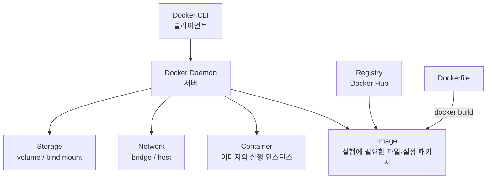

기능 하나를 다 만들고 「이제 합치자」고 할 때 정해야 하는 것은 둘이다. **무엇을 한 덩어리로 보고 합치는가**, 그리고 **합친 것을 무엇에 담아 서버로 보내는가.** 앞의 답이 브랜치 전략이고 뒤의 답이 컨테이너 이미지다.

형상관리와 재현 가능한 실행 단위 — CI/CD가 이 두 전제 위에 서 있다는 것은 [편1 — 사람 손에서 뗀 배포를 무엇으로 멈추는가](/blog/backend-engineering/cicd-pipeline-fundamentals/)가 정리했다. 앞의 것은 편2가 맡았고, 나머지 하나를 이 편이 연다. 편2가 「어느 시점인가」를 정했다면 이 편은 「어느 덩어리인가」를 정한다 — 줄기 하나 안만 보던 시야를 여러 줄기로 넓히는 것이 앞 절반이고, 합친 것을 담을 그릇을 정하는 것이 뒤 절반이다.

둘이 한 편에 있는 이유는 CI를 가운데 놓으면 보인다. 브랜치는 CI에 **들어가는 것**이고 이미지는 CI에서 **나오는 것**이다.

## 왜 나누고 어떻게 합치는가

각자 고친 코드를 서로 다른 줄기에 두는 근본 이유는 하나다 — **강제 덮어쓰기를 막기 위해서다.** 독립된 공간에서 만들고 테스트한 뒤 끝난 것만 본류에 합친다. 나누는 이유는 이렇게 한 줄이지만 합치는 방법은 셋이고, 셋을 가르는 것은 난이도가 아니라 **히스토리에 무엇을 남기는가**다.

| 방식 | 언제 발생 | 결과 | 히스토리 |
| --- | --- | --- | --- |
| **Fast-forward** | 베이스 커밋에 변경이 없고 새 커밋만 추가된 경우 | 브랜치 포인터만 앞으로 이동, 새 커밋 없음 | 가장 깔끔(선형) |
| **3-way merge (Merge Commit)** | 베이스가 이미 다른 커밋과 병합돼 양쪽이 갈라진 경우 | base와 양쪽 끝 커밋 셋을 비교해 **병합 커밋을 만든다** | 갈래가 남아 복잡해진다 |
| **Rebase** | 비슷한 기능의 feature 브랜치를 정리해 합칠 때 | 대상 커밋의 diff를 임시 저장 → 베이스를 다른 커밋으로 바꿈 → diff 재적용 | 선형으로 정리된다 |

한 축으로 세우면 이렇다. **Fast-forward는 아무것도 남기지 않고, 3-way merge는 합쳤다는 사실을 커밋 하나로 남기고, Rebase는 남기는 대신 다시 쓴다.** 어느 쪽이 깔끔한가가 아니라 나중에 무엇을 읽을 수 있어야 하는가가 고르는 기준이다.

명령 안의 브랜치 이름은 손대지 않고 원본 그대로 싣는다. 그 자리는 설명이 아니라 저장소가 실제로 가진 값이라 읽기 좋게 고치면 복사해 붙였을 때 돌지 않는다. [편1이 정한 표기 방침](/blog/backend-engineering/cicd-pipeline-fundamentals/#master--slave-표기는-이렇게-쓴다)이 그것이다. 기본 브랜치가 `main`인 저장소라면 아래 `master`를 `main`으로 읽으면 된다.

**Fast-forward 절차**

```text
# 현재 브랜치: feature/#1
git checkout master
git merge feature/#1
git push origin master
```

**Merge Commit 절차 — feature 쪽에서 먼저 충돌을 해소한다**

```text
# 현재 브랜치: feature/#2
git merge master              # 충돌 발생 시 여기서 해결
git add .                     # 충돌 파일 스테이징
git commit && git push
git checkout master
git merge feature/#2
git push origin master
```

**Rebase 절차**

```text
git rebase feature/#1         # 베이스로 지정할 브랜치
# 충돌 발생 시 해결 후 커밋
git rebase --continue
```

## 합칠 때 터지는 것

방법을 골랐다고 끝이 아니다. 둘이 남는다 — 같은 자리를 양쪽에서 고쳤을 때 무엇이 나오는가, 그리고 합치기 전에 내 커밋을 어떻게 정리해 둘 것인가.

### 충돌 표지를 읽는 법

```text
<<<<<<< HEAD
3. 장바구니 담기          ← 베이스(현재) 브랜치의 코드
=======
3. 디테일 페이지 보여주기   ← 병합 대상 브랜치의 코드
>>>>>>> main
```

`=======` 위가 현재 브랜치이고 아래가 병합 대상이다. 표지가 알려 주는 것은 여기까지다. **Git은 어느 쪽이 맞는지 판단하지 않는다** — 같은 줄을 양쪽에서 건드렸다는 사실만 알 뿐, 무엇이 의도된 것인지는 코드의 의미를 알아야 정해지기 때문이다.

이 시리즈에서 자동화의 경계가 가장 또렷하게 보이는 자리다. 파이프라인은 충돌을 즉시 알리고 충돌난 채로 배포되는 것을 막을 수 있지만 어느 쪽을 남길지는 정해 주지 못한다. 그래서 CI가 하는 일은 충돌을 없애는 것이 아니라 **일찍 드러내는 것**이다.

### 커밋을 하나로 묶는다 — `rebase -i`로 squash

작업 중간 저장이나 하루 마감 표시로 feature 브랜치에 커밋이 쌓이면 그 히스토리가 PR에 전부 노출된다. 무엇이 바뀌었는지 보러 온 리뷰어에게는 노이즈다.

```text
git rebase -i HEAD~4        # 현재부터 4번째 커밋까지 대상
# 가장 오래된 커밋만 pick으로 두고 나머지는 s(squash)
# 합쳐진 커밋 메시지를 새로 작성
git push -f origin feature/#3
```

`HEAD~4`는 지금 서 있는 시점에서 넷째 뒤의 커밋이다. HEAD가 무엇을 가리키는 포인터인지는 편2가 정의했다. 주의할 것은 둘이다.

- **가장 오래된 커밋을 `pick`으로 남긴다.** 나머지가 그 커밋으로 접혀 들어가는 구조라 기준이 하나는 있어야 한다.
- **squash 뒤에는 강제 푸시(`-f`)가 따라온다.** 히스토리를 다시 썼으므로 원격이 가진 것과 어긋나기 때문이다.

둘째는 여기서 새로 논증할 것이 없다. 편2가 **남과 함께 쓰는 브랜치에서는 히스토리를 다시 쓰지 않는다**로 이미 결론을 냈다. 그러므로 이 절차의 적용 범위는 한 줄로 정해진다 — **아직 나만 쓰고 있는 feature 브랜치.**

## 브랜치 전략은 팀 조건이 정한다

병합 방식이 「어떻게 합치는가」였다면 브랜치 전략은 **「무엇을 언제 합치는가」**다. 줄기를 몇 개 두고 어느 줄기가 배포되는지를 정하는 규칙이다. 원본은 브랜치를 여럿 두는 복잡한 전략과 `main` + feature 둘만 두는 단순한 전략을 나란히 놓고 **「은총알은 없다」**로 마무리한다. 아래 표의 앞 두 행이 그 둘이다.

표의 Git Flow 행에 `master`가 남는다. 그 이름이 **전략의 정의에 들어 있어서** 바꾸지 않는다.

| 전략 | 브랜치 구성 | 릴리즈 방식 | 적합한 팀·주기 | 대가 |
| --- | --- | --- | --- | --- |
| **Git Flow** | master, develop, feature, release, hotfix | 릴리즈 브랜치에서 안정화 후 태깅 | 대규모·엔터프라이즈, 정해진 릴리즈 주기, 버전 병행 지원 | 브랜치가 많고 복잡하다. 유연성이 떨어진다 |
| **GitHub Flow** | main + feature | main 머지가 곧 배포 | 소~중규모, 지속 배포, 웹 서비스 | 릴리즈 단위 관리가 약하다. main 보호 규칙이 필수다 |
| **GitLab Flow** | main + environment 브랜치(staging/production) 또는 release 브랜치 | 환경 브랜치로 승격(promote) | 환경이 여러 개이고 승인 단계가 필요한 조직 | 환경 브랜치 동기화 관리 부담 |
| **Trunk Based** | trunk(main) 하나 + 아주 짧은 수명의 브랜치 | 피처 플래그로 미완성 기능을 숨긴다 | 고빈도 배포, 성숙한 자동화 테스트를 가진 팀 | 테스트 자동화·피처 플래그 인프라가 없으면 사고로 직결된다 |

셋째 행의 `environment 브랜치`에서 이 시리즈가 세 뜻으로 쓰는 낱말 하나가 처음 나온다. **여기서 「환경」은 배포 등급이다** — 같은 코드를 어느 급의 인프라에 올리는가다. `staging`은 운영과 같은 구성이되 사용자 트래픽만 받지 않는 등급이고, `production`은 그 트래픽을 받는 등급이다. GitLab Flow는 이 등급을 **브랜치로 표현한다** — `production` 브랜치로 승격하는 것이 곧 배포이므로 배포 상태를 브랜치 포인터로 읽을 수 있고, 두 브랜치가 어긋나면 그 값이 거짓이 된다. 편5·편6은 같은 낱말을 다른 뜻으로 쓴다 — [편1의 낱말 구분표](/blog/backend-engineering/cicd-pipeline-fundamentals/#시리즈-안에서-갈리는-넷)가 셋을 갈라 두었다.

양 끝을 잡으면 판단 축이 드러난다.

| 판단 축 | Git Flow 쪽 | Trunk Based 쪽 |
| --- | --- | --- |
| 릴리즈 주기 | 길다(주·월) | 짧다(일·시간) |
| 동시 지원 버전 | 여러 버전 병행 | 항상 최신 하나 |
| 자동화 테스트 성숙도 | 낮아도 사람이 릴리즈 브랜치에서 방어한다 | 높아야 한다 |
| 규제·승인 절차 | 강하다(금융·PG) | 약하다 |
| 팀 규모·경험 편차 | 크다 | 작고 균질하다 |

다섯 축 모두 기술이 아니라 **조직의 조건**이다. 그래서 실제로 갈리는 것은 어느 전략이 정답인가가 아니라 **팀 상황을 근거로 그 선택을 설명할 수 있는가**다. 감독기관 승인과 릴리즈 노트가 필요한 결제·PG 도메인이면 태그 기반 릴리즈와 환경 승격 쪽으로, 하루에 수십 번 배포하는 서비스라면 Trunk Based와 피처 플래그 쪽으로 기운다. 편2가 「자동화 성숙도가 아니라 감사 요건이 정한다」고 한 것과 같은 축이다.

### 릴리즈 단위를 어디서 끊는가

편2는 「배포의 기준은 브랜치가 아니라 태그다」로 닫으면서 그 태그를 **어디서 붙이는지**는 이 편에 넘겼다. 답은 위 표의 셋째 열에 있고 전략마다 다르다.

**Git Flow는 그 자리가 브랜치 하나로 명시돼 있다.** release 브랜치에서 안정화한 뒤 태그를 붙이므로 릴리즈 범위가 확정되는 시점과 이름이 붙는 시점이 한자리에 모인다. **GitHub Flow에는 그 자리가 없다.** `main` 머지가 곧 배포라 릴리즈가 커밋 단위로 흩어지고, 「이번 릴리즈에 무엇이 들어갔나」는 나중에 로그를 모아 재구성해야 한다 — 표의 대가 열이 「릴리즈 단위 관리가 약하다」고 적은 것이 이것이다. GitLab Flow는 환경 승격 시점에, Trunk Based는 피처 플래그를 켜는 시점에 그 선이 그어진다. 마지막 것만 **브랜치가 아닌 설정이 그 선을 긋는다.**

즉 「릴리즈 단위를 어디서 끊는가」는 따로 고르는 문제가 아니라 전략을 고른 결과로 따라온다.

### Pull Request — 규칙이 실제로 강제되는 자리

- `origin/main`은 운영에 배포되는 브랜치이므로 협의 없이 merge할 수 없다.
- PR은 코드 리뷰와 동의를 요청하는 절차다. 리뷰어가 변경 내역과 로직을 확인하고 승인한다.
- 일정 수 이상의 승인을 받아야 merge 버튼이 활성화되도록 설정한다(브랜치 보호 규칙).
- CI 관점에서 PR 이벤트는 **컴파일·포맷·린트·테스트를 자동 수행하는 트리거**가 된다.

앞의 셋은 사람이 지키는 규칙이지만 넷째는 규칙이 아니라 **사건**이다. PR을 여는 행위가 파이프라인을 깨우고, 그것이 실패하면 승인이 다 모여도 merge가 막힌다 — 브랜치 전략이 기계에 옮겨지는 지점이다.

## 나르는 단위 — 컨테이너

편1이 세운 전제 둘 중 나머지 절반이 여기서 열린다. **「내 로컬에서는 됐는데」가 성립하지 않는 실행 단위**다. 담는 방법 둘을 가르는 것은 **어디까지 함께 싣는가**다.

| 구분 | 가상 머신(VM) | 컨테이너(Docker) |
| --- | --- | --- |
| 격리 방식 | 하드웨어를 분할해 Guest OS를 각각 구동한다 | 호스트 OS 커널을 공유하고 프로세스만 격리한다 |
| 부팅·기동 | 무겁고 느리다 | 가볍고 빠르다 |
| 자원 효율 | 낮다 | 높다(호스트 OS 기능을 그대로 쓴다) |
| CI/CD 관점 | 이미지 배포 단위가 크다 | **「빌드 결과 = 이미지」**로 배포 단위를 통일할 수 있다 |

마지막 행이 이 시리즈에 걸리는 줄이다. VM은 OS를 통째로 담아 CI가 커밋마다 만들기에 너무 크지만, 컨테이너는 커널을 빌려 쓰므로 애플리케이션과 실행에 필요한 것만 담긴다. **빌드 결과가 곧 배포 단위**가 되는 것이 재현성의 실체다 — CI가 만든 물건과 CD가 나르는 물건이 같으면 그 사이에서 어긋날 자리가 없다.

Docker는 클라이언트-서버 구조다. 명령을 받는 것은 CLI지만 이미지를 만들고 컨테이너를 띄우고 지우는 일은 Docker Daemon이 한다.



| 개념 | 정의 |
| --- | --- |
| Image | 서버 프로그램·소스·라이브러리·실행 파일을 하나로 패키징한 것. 특정 프로세스 실행에 필요한 모든 파일과 설정값 |
| Container | 이미지를 실행한, 격리된 프로세스 |
| Dockerfile | 이미지를 만들기 위한 스크립트. 필요한 설정과 라이브러리 설치를 순차로 선언한다 |
| Registry | 이미지를 올리고 내려받는 저장소(Docker Hub 등) |

넷째 행이 편2의 결론을 받는다. 레지스트리에 올라간 이미지에는 태그가 붙고, 그 태그가 **되돌릴 대상을 지목하는 이름**이 된다. Git 태그가 커밋을 지목하면 이미지 태그는 그 커밋으로 만들어진 산출물을 지목한다. 배포가 실패했을 때 되돌아갈 곳은 브랜치가 아니라 직전 이미지 태그이고, 되돌리는 절차는 편6이 맡는다.

### 상태를 어디에 둘 것인가 — 볼륨과 바인드 마운트

| 저장소 방식 | 설명 | 선택 기준 |
| --- | --- | --- |
| Volume | 컨테이너 데이터를 Docker 엔진이 관리하는 디렉터리에 저장한다 | 이식성·백업 관리가 필요한 영속 데이터 |
| Bind mount | 호스트의 특정 디렉터리와 컨테이너 디렉터리를 직접 연결한다 | 설정 파일 주입, 개발 중 소스 공유 |

둘 다 같은 전제 위에 있다. **컨테이너는 언제든 지워지는 단위이므로 남아야 하는 것은 밖에 둔다.** 배포가 컨테이너를 갈아 끼우는 일인 이상, 이 선을 긋지 않으면 배포할 때마다 데이터가 사라진다.

### 네트워크 — bridge와 host

| 네트워크 방식 | 설명 | 실무 사용 |
| --- | --- | --- |
| Bridge | 호스트가 L2/L3 역할을 하고 컨테이너는 호스트 네트워크 인터페이스를 거쳐 내외부와 통신한다 | 기본값, 권장 |
| Host | 호스트와 컨테이너가 IP·포트를 공유한다 | **보안상 취약해 실무에서 쓰지 않는다** |

Host가 빠른 것은 맞지만 격리를 포기한 대가로 얻는 속도다. 컨테이너를 쓰는 이유를 되돌리는 선택이다.

## Dockerfile — 이미지를 코드로 적는다

이미지를 만드는 절차는 문서가 아니라 파일이다. `Dockerfile` 한 장이 소스와 함께 저장소에 들어가므로 **이미지를 만드는 방법 자체가 형상관리를 받는다.**

```dockerfile
FROM openjdk:21-jdk
LABEL maintainer="you"
ARG JAR_FILE=build/libs/*.jar     # jar 위치를 변수화
ENV CUSTOM_NAME default           # 환경변수
COPY ${JAR_FILE} app.jar          # jar를 컨테이너 내부로 복사
EXPOSE 8080                       # 노출 포트 문서화
ENTRYPOINT ["java","-jar","app.jar"]
```

일곱 줄이 각각 다른 시점에 산다. `FROM`이 바탕 이미지를 정해 런타임을 확정하고, `ARG`는 빌드할 때만 살아 있는 변수인 반면 `ENV`는 컨테이너가 뜬 뒤까지 남는다. `EXPOSE`만 성격이 다르다 — **이 줄은 포트를 열지 않는다.** 어느 포트를 쓰는지 알리는 선언일 뿐 실제 공개는 실행 시점 옵션이 한다.

| 기법 | 내용 | 효과 |
| --- | --- | --- |
| 레이어 캐시 활용 | 자주 안 바뀌는 명령(의존성 설치)을 위로, 자주 바뀌는 것(소스 복사)을 아래로 배치한다 | 재빌드 시간이 크게 줄어든다 |
| 멀티스테이지 빌드 | 빌드 스테이지에서 컴파일하고 런타임 스테이지에는 산출물만 복사한다 | 이미지 크기 축소, 빌드 도구·소스를 담지 않아 공격면 감소 |
| `--no-cache` | 캐시를 무시하고 완전히 다시 빌드한다 | 재현성 확보. 대신 빌드 시간이 늘어난다 |
| `--platform` 지정 | 대상 아키텍처를 고정한다(예: `linux/amd64`) | Apple Silicon에서 빌드해 x86 서버에 배포할 때 필수 |
| `.dockerignore` | 빌드 컨텍스트에서 불필요한 파일을 제외한다 | 전송량 감소, 비밀 파일 유입 방지 |

첫 행과 셋째 행이 정반대다. 캐시는 이전 결과를 재사용해 빌드를 빠르게 하고 `--no-cache`는 그 재사용을 금지해 재현성을 보장한다. **속도를 사는가 재현성을 사는가**로 갈리며, 원본의 Jenkins 파이프라인은 후자를 골라 이 옵션을 쓴다.

둘째 행의 「스테이지」는 이 시리즈에서 세 뜻으로 갈리는 낱말의 **둘째 뜻**이다. 하나의 Dockerfile 안에서 `FROM`으로 시작하는 한 층을 가리킨다. 빌드용 층에서 컴파일을 끝내고 런타임 층으로 결과물만 넘기면 최종 이미지에 컴파일러도 소스도 남지 않는다. 편2가 쓴 Git의 Index와도, 편5·편6이 쓸 Jenkins `stage()` 블록과도 다르다 — [편1의 낱말 구분표](/blog/backend-engineering/cicd-pipeline-fundamentals/#시리즈-안에서-갈리는-넷)가 셋을 나란히 놓았다.

## Compose와 손에 익는 명령

컨테이너를 CLI로 매번 실행하고 중지하고 지우는 방식은 오래가지 못한다. 이미지 버전을 바꾸거나 환경변수를 더하는 일이 손으로 친 명령의 기억에 얹히기 때문이다. Compose는 그 명령들을 YAML 한 장의 선언으로 옮긴다. **Dockerfile이 이미지에 한 일을 Compose가 실행 구성에 한다.**

| 명령 | 용도 |
| --- | --- |
| `docker-compose up -d` / `docker-compose <svc> up -d` | 정의된 전체 또는 특정 서비스 실행(백그라운드) |
| `docker-compose down <svc>` | 특정 서비스 중지·정리 |
| `docker ps` / `docker ps -a` | 실행 중 / 전체 컨테이너 목록 |
| `docker logs -f <id>` | 최신 로그 팔로우 |
| `docker exec -it --user root <id> /bin/bash` | root로 컨테이너 셸 접근 |
| `docker stop <id> && docker rm <id>` | 종료 후 삭제 |
| `docker system prune -f` | 미사용 리소스 강제 정리 |

마지막 줄은 청소 습관이 아니라 운영 규칙이다. 배포할 때마다 이미지가 쌓이고, 정리하지 않으면 디스크가 차서 **배포 자체가 실패한다.** 멈추는 원인이 코드가 아니라 남은 옛 이미지라서 찾는 데도 시간이 걸린다. 그래서 파이프라인 마지막 스텝에 `docker system prune -f` 같은 정리 단계를 넣어 둔다.

## 정리

- **병합 세 방식이 갈리는 지점은 히스토리에 무엇을 남기는가이고, 전략 네 종이 갈리는 지점은 조직의 조건이다.**
- **릴리즈 단위를 끊는 자리는 전략이 정한다.** Git Flow는 release 브랜치에서 태그를 붙이고, GitHub Flow에는 그 자리가 없어 릴리즈가 커밋 단위로 흩어진다. 편2가 넘긴 「태그를 어디서 붙이는가」의 답이 여기 있다.
- **컨테이너가 그 「나르는 단위」다.** 빌드 결과가 곧 배포 단위이므로 CI가 만든 것과 CD가 나르는 것이 어긋나지 않는다.
- **이미지를 만드는 방법도 파일이다.** Dockerfile과 Compose가 빌드와 실행을 사람의 기억 밖으로 내보낸다.

편1의 도식에서 이 편이 채운 것은 양 끝 두 칸이다. 왼쪽의 「개발자 로컬 feature 브랜치」와 오른쪽의 「아티팩트 — 컨테이너 이미지」가 무엇인지가 정해졌으니, 남은 것은 그 사이에서 도는 기계다.

다음 편이 그 첫 갈래를 연다. 저장소 이벤트가 곧 트리거인 모델, GitHub Actions다. 이 편이 정한 두 단위가 거기서 워크플로의 시작과 끝으로 다시 나타난다.
