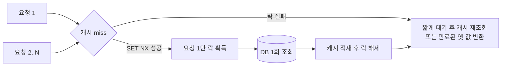
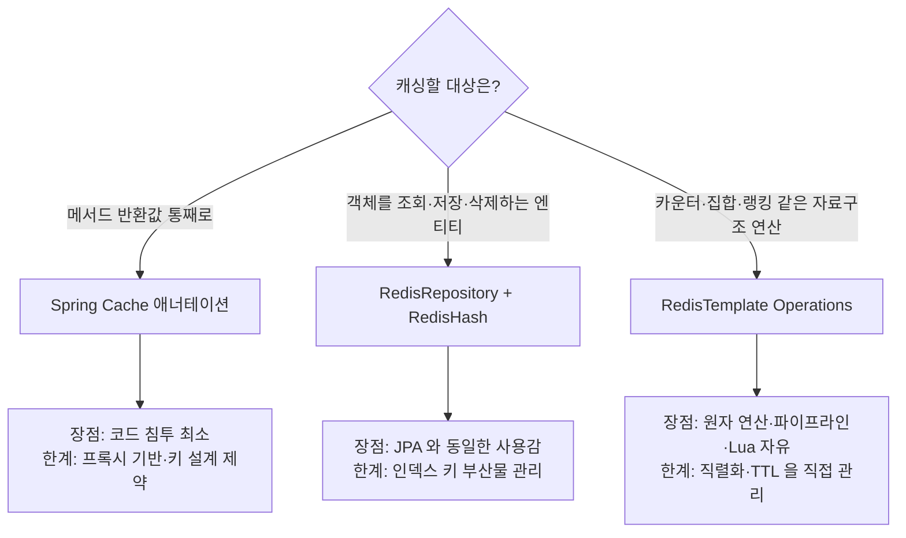
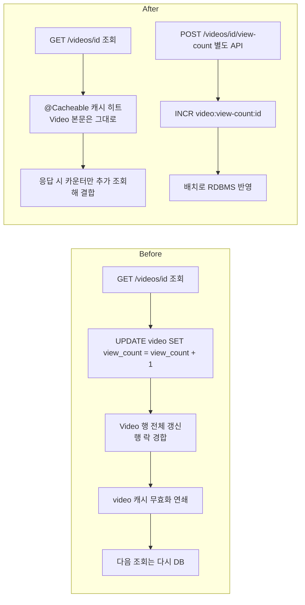

캐시를 붙이는 코드는 짧다. 어려운 것은 **낡은 값을 언제 어떻게 지우는가**이고, 그다음이 **여러 요청이 동시에 같은 키를 건드릴 때 무슨 일이 벌어지는가**다. 이 두 가지를 설계하지 않은 캐시는 성능 개선이 아니라 정합성 사고의 원인이 된다.

이 글은 그 두 가지를 다룬다. 무효화 방식 네 가지와 TTL 설계 원칙, 캐시가 무너지는 세 가지 방식과 각각의 방어, Spring이 제공하는 세 가지 구현 계층과 그 함정, 그리고 조회수처럼 동시 갱신이 몰리는 값을 원자 연산과 분산 락으로 다루는 법이다. 캐싱 대상 선정과 자료구조 선택, 전략 네 가지의 비교는 [Redis 캐시 설계](/blog/backend-engineering/redis-cache-design/)에서 다룬다.

## 캐시 무효화

### 무효화 방식 네 가지

무효화란 원본이 바뀌었을 때 캐시의 옛 값(stale)을 없애는 일이다. 방식은 넷이고, 각각 다른 비용을 낸다.

| 방식 | 동작 | 장점 | 단점 |
|---|---|---|---|
| TTL 만료 | 시간이 지나면 자동 삭제된다 | 구현이 단순하고 키 누수가 없다 | TTL 동안 stale이 유지된다. 만료 순간 스탬피드가 난다 |
| 명시적 삭제(Evict) | 쓰기 트랜잭션에서 관련 키를 삭제한다 | 즉시 정합 상태가 된다 | 삭제 대상 키 목록을 관리하기 어렵다. 누락하면 영구 stale이다 |
| 버전 키 | `video:v3:{id}`처럼 버전을 키에 포함한다 | 전체 무효화가 O(1)이다(버전만 올리면 된다) | 구 버전 키가 메모리에 남아 TTL을 병행해야 한다 |
| 이벤트 기반 | 변경 이벤트를 Pub/Sub·Kafka로 전파해 각 노드가 삭제한다 | 다중 인스턴스의 로컬 캐시까지 무효화된다 | 인프라 복잡도가 올라간다 |

실무에서는 이 넷을 배타적으로 고르지 않는다. **명시적 삭제를 주 경로로 두고 TTL을 안전망으로 깔아 두는 조합**이 기본형이다. 삭제를 놓쳐도 유한 시간 안에 스스로 복구되기 때문이다.

### 연관 캐시를 함께 지워야 한다

비디오 하나를 수정하면 단건 캐시만 지워서는 안 된다. 그 비디오가 포함된 **목록 캐시**도 같이 낡는다. Spring에서는 `@Caching`으로 묶는다.

```java
@Caching(evict = {
    @CacheEvict(cacheNames = "video",      key = "#videoId"),
    @CacheEvict(cacheNames = "video_list", key = "#channelId")
})
public Video updateVideo(String videoId, String channelId, ...) { ... }
```

- **왜 필요한가.** 단건만 지우면 목록 API는 계속 옛 제목·썸네일을 반환한다. 사용자 눈에는 "수정이 안 먹었다"로 보인다.
- **안 하면 무슨 일이 생기나.** TTL이 길수록 불일치가 길게 유지되고, TTL이 없으면 영구 불일치다.

무효화가 어려운 지점은 단건이 아니라 **파생 캐시**다. 제목 하나를 바꾸면 단건·목록·검색 결과·랭킹 스냅샷이 함께 낡는데, 기능이 늘수록 "무엇을 함께 지워야 하는가"의 목록이 코드 여기저기로 흩어진다. `@Caching`으로 한 지점에 모아 선언하는 것은 성능 때문이 아니라 **누락을 코드 리뷰에서 잡을 수 있게 하려는 것**이다.

### TTL 설계 원칙

| 원칙 | 이유 |
|---|---|
| TTL은 반드시 건다(무한 캐시 금지) | 무효화 누락 시의 안전망이며 메모리 상한을 관리한다 |
| 데이터 성격별로 다르게 준다 | 프로필은 길게, 목록은 짧게, 랭킹은 집계 주기에 맞춘다 |
| TTL에 지터(랜덤 편차)를 섞는다 | 동시 만료로 인한 Avalanche를 막는다. 예를 들어 300초 ± 0~60초 |
| 인기 키는 TTL을 갱신하지 않는다 | 무한 연장되면 stale이 영원히 유지된다 |

세 번째 원칙이 가장 자주 빠진다. 캐시를 한 번에 적재하면(배포 직후 워밍업, 배치 적재) **같은 시각에 들어온 키가 같은 시각에 죽는다.** 지터는 그 동시성을 흩는 한 줄짜리 방어다.

## 캐시 3대 장애

### 세 장애 비교

셋 다 "DB가 직격당한다"는 결과는 같지만 **발생 조건이 다르므로 방어도 다르다.**

| 장애 | 발생 조건 | DB에 가해지는 부하 | 대응 |
|---|---|---|---|
| **Stampede (Thundering Herd)** | 인기 키 하나가 만료된 순간 동시 요청이 전부 miss | 같은 쿼리 N개가 동시에 | 분산 락으로 하나만 재계산, `sync=true`, 논리적 만료, 사전 워밍 |
| **Penetration** | 존재하지 않는 ID를 반복 조회한다(공격 포함) | 캐시가 전혀 방어하지 못하고 전량 통과 | null 결과도 짧은 TTL로 캐싱, Bloom Filter, 입력 검증 |
| **Avalanche** | 다수 키가 동시 만료하거나 Redis 노드가 죽는다 | 전체 트래픽이 그대로 DB로 | TTL 지터, 다층 캐시(로컬+Redis), 서킷 브레이커, 레플리카·클러스터 |

세 장애를 가르는 질문은 "**캐시에 값이 없는 이유가 무엇인가**"다. 만료됐으면 Stampede, 애초에 없으면 Penetration, 캐시 전체가 사라졌으면 Avalanche다.

### Stampede 대응 흐름



- **논리적 만료(logical expiry).** 실제 TTL은 길게 두고 값 안에 `expireAt`을 넣는다. 만료가 보이면 **옛 값을 즉시 반환**하고 갱신은 비동기로 돌린다. 사용자 지연이 0에 수렴하는 대신 잠시 stale을 허용한다.
- **Spring Cache의 `sync = true`.** `@Cacheable(sync = true)`는 **같은 JVM 안에서만** 하나의 스레드가 계산하도록 잠근다. 인스턴스가 여러 대면 인스턴스 수만큼 DB를 때린다는 점을 반드시 알고 써야 한다. 진짜 방어는 Redis 분산 락이다.

두 번째 항목이 실무에서 오해가 잦다. `sync = true`는 스탬피드를 "완화"하지 "해결"하지 않는다. 인스턴스가 20대면 DB 조회가 N번에서 20번으로 줄 뿐이다.

### Penetration 방어에서 주의할 점

null 캐싱은 쉬운 대신 **공격자가 임의의 존재하지 않는 ID를 무한 생성하면 캐시 메모리가 오염된다.** 그래서 TTL을 짧게(수십 초) 두고, ID 형식 검증(UUID 형태인지)을 앞단에서 먼저 건다. 대규모라면 Bloom Filter로 "확실히 없는 키"를 O(1)에 거른다. Bloom Filter는 "없다"는 판정만 확실하고 "있다"는 판정에 위양성이 있으므로, 통과한 요청은 여전히 DB가 확인한다.

## Spring에서의 구현 — 세 계층

### 접근법 세 가지

Redis를 Spring에서 쓰는 방법은 추상화 수준이 다른 세 가지가 있고, **대상에 따라 셋을 섞어 쓴다.**

| 접근 | 대표 API | 추상화 수준 | 적합한 대상 |
|---|---|---|---|
| **Spring Cache** | `@Cacheable` `@CacheEvict` `@Caching` | 높다(저장소 교체 가능) | 메서드 반환값 단위 캐싱. Video 조회·목록 |
| **Spring Data Redis Repository** | `CrudRepository` + `@RedisHash` `@Indexed` | 중간 | 엔티티처럼 다루고 싶은 객체. Channel·User |
| **RedisTemplate** | `ValueOperations` `SetOperations` `ZSetOperations` … | 낮다(Redis 명령에 직접 대응) | 카운터·Set·랭킹 등 자료구조를 그대로 써야 하는 것 |



### `@RedisHash`가 실제로 만드는 키

`@Indexed`는 공짜가 아니다. 무엇이 생기는지 보면 이유가 분명해진다.

```java
@RedisHash("channel")
public class Channel {
    @Id String id;
    @Indexed String contentOwnerId;
    String title;
    String description;
}
// channel:9744d588-...        <- Hash 본체
// channel:9744d588-...:idx    <- 이 엔티티가 속한 인덱스 목록
// channel:contentOwnerId:user <- 보조 인덱스(Set)
```

**Redis에는 인덱스가 없으므로 Spring Data가 Set 키를 별도로 만들어 흉내 낸다.** 그래서 삭제·수정 시 본체와 인덱스 키를 함께 정리해야 하고, 애플리케이션이 비정상 종료하면 인덱스에 유령 참조가 남을 수 있다. 조건 조회가 복잡해질수록 RDBMS로 넘기는 쪽이 맞다.

### Spring Cache를 쓸 때의 함정

| 함정 | 내용 | 대응 |
|---|---|---|
| 자기 호출(self-invocation) | 같은 클래스 내부 메서드 호출은 프록시를 거치지 않아 캐시가 **아예 동작하지 않는다** | 빈을 분리하거나 자기 주입 |
| 직렬화 | 기본 JDK 직렬화는 크고 클래스 버전에 취약하다 | `GenericJackson2JsonRedisSerializer` 등 JSON 직렬화를 지정 |
| TTL | 애너테이션에 TTL 파라미터가 없다 | `RedisCacheManager`에서 cacheName별 TTL 구성 |
| null 캐싱 | 기본적으로 null도 캐싱된다. Penetration 방어에는 유리하나 의도치 않은 stale이 생긴다 | `unless = "#result == null"`로 제어 |
| 키 충돌 | 파라미터가 여러 개면 기본 키 생성 규칙이 모호하다 | `key = "#videoId"`처럼 명시 |

첫 번째 함정은 조용히 실패한다는 점에서 가장 위험하다. **에러가 나지 않고 그냥 캐시가 없는 것처럼 동작**하므로, 성능이 개선되지 않은 이유를 Redis 설정에서 찾다가 시간을 쓴다. 세 번째와 네 번째는 앞의 TTL 설계·Penetration 방어를 Spring에서 실행하는 자리이기도 하다.

## 조회수 — 동시성 카운터와 분산 락

### 조회와 조회수 증가를 분리한다



근거는 네 가지다.

- **조회와 조회수 증가를 API로 분리한다.** 조회 응답 성능과 카운팅 정확도는 요구사항이 다르다.
- **조회수 증가마다 Video 전체를 갱신하는 것은 부하가 크다.** 한 필드 때문에 행 전체가 잠기고, 그 순간 캐시도 무효화된다.
- **Redis 키를 분리한다(`video:view-count`).** 변경 빈도가 다른 데이터를 같은 캐시 엔트리에 묶지 않는다.
- **조회 시 카운터를 추가 조회해 결합한다.** 본문 캐시는 오래, 카운터는 실시간이라는 서로 다른 신선도를 한 응답에 합칠 수 있다.

세 번째 항목이 앞 절의 무효화 문제와 직접 이어진다. 변경이 잦은 필드를 캐시 엔트리에 묶으면 **그 필드 때문에 엔트리 전체가 계속 무효화된다.** 키를 쪼개는 것은 무효화 빈도를 낮추는 설계다.

### 왜 `INCR`이 안전한가

Redis는 명령을 **단일 스레드로 순차 처리**하므로 `INCR`은 read-modify-write가 쪼개지지 않는다. 반면 애플리케이션에서 `GET` → `+1` → `SET`을 하면 두 요청 사이에 lost update가 발생한다. "원자성을 어디서 보장받는가"가 카운터 설계의 전부다.

| 방식 | 원자성 | 정확도 | 비고 |
|---|---|---|---|
| RDBMS `UPDATE ... SET c = c + 1` | 보장된다 | 정확하다 | 행 락 경합이 있어 인기 컨텐츠에서 병목이 된다 |
| 앱에서 GET/SET | **깨진다** | 유실된다 | 쓰지 않는다 |
| Redis `INCR` | 보장된다 | 정확하다(Redis 유실 범위 안에서) | 이 프로젝트의 선택 |
| Redis `PFADD`(HyperLogLog) | 보장된다 | 근사값이다(오차 약 0.81%) | UV 집계용. 메모리 12KB 고정 |

중복 조회를 막아야 한다면 `SETEX view:{videoId}:{userId} 1800 1` 같은 **중복 방지 키**를 먼저 걸고, 성공했을 때만 카운터를 올린다.

### 분산 락

여러 인스턴스가 같은 자원을 동시에 갱신할 때 필요하다. 캐시 재계산, 배치 flush, 재고 차감이 대표적이다.

```
SET lock:video:{id} {randomToken} NX PX 3000     # 획득: 없을 때만, 3초 자동 만료
EVAL "if redis.call('get',KEYS[1])==ARGV[1] then return redis.call('del',KEYS[1]) else return 0 end"
                                                  # 해제: 내 토큰일 때만 삭제(Lua 로 원자화)
```

| 요소 | 이유 |
|---|---|
| `NX` | 없을 때만 설정한다 — 락의 상호 배제 자체다 |
| `PX`(만료) | 락 보유자가 죽어도 영원히 잠기지 않게 한다 |
| 랜덤 토큰 | 만료 후 남의 락을 실수로 해제하는 사고를 막는다 |
| Lua로 해제 | `GET` 후 `DEL` 사이의 경쟁 조건을 없앤다 |

- **Redisson `RLock`** 은 위를 감싸고 **watchdog**으로 작업이 길어지면 TTL을 자동 연장한다. 직접 구현보다 이쪽이 낫다.
- **Redlock 논쟁.** 다중 마스터 기반 Redlock은 GC 정지·시계 오차 상황에서 상호 배제가 깨질 수 있다는 비판(Kleppmann)이 있다. 결론은 "**Redis 락은 성능 최적화용이지, 정합성이 돈과 직결되는 곳의 최후 방어선이 아니다**"이다. 금액·재고 확정은 DB 트랜잭션·유니크 제약으로 마무리한다.

락에 만료를 거는 순간 상호 배제는 시간 가정에 의존하게 된다. 락을 잡은 프로세스가 GC로 길게 멈추면, 본인은 락을 쥐고 있다고 믿는 동안 TTL이 지나 다른 프로세스가 같은 락을 얻는다. 그래서 **틀리면 돈이 나가는 자원은 최종 방어를 DB에 둔다** — `UPDATE stock SET qty = qty - 1 WHERE id = ? AND qty > 0` 같은 조건부 갱신이나 유니크 제약이 그 자리다. 분산 락은 그 앞에서 불필요한 DB 경합을 줄이는 최적화 계층으로 쓴다.

## 정리

| 문제 | 1차 방어 | 안전망 |
|---|---|---|
| 원본이 바뀌었는데 캐시가 낡았다 | 쓰기 시 명시적 삭제(`@CacheEvict`), 연관 키는 `@Caching`으로 묶는다 | 전 키에 TTL 강제 |
| 인기 키 만료 순간 DB가 직격당한다 | 분산 락으로 하나만 재계산 | 논리적 만료로 옛 값 반환 |
| 없는 키를 반복 조회한다 | 입력 형식 검증 | null 짧은 TTL 캐싱, Bloom Filter |
| 키가 한꺼번에 죽는다 | TTL 지터 | 다층 캐시, 서킷 브레이커 |
| 동시 갱신에 값이 유실된다 | Redis 원자 연산(`INCR`) | 확정이 필요한 값은 DB 조건부 갱신 |

여기까지가 "캐시를 지키는 법"이다. 남은 질문은 Redis에 무엇을 담고 무엇을 담지 않을 것인가, 그리고 담은 것을 어떻게 운영할 것인가다. 좋아요·구독을 집합 연산으로 푸는 법, 운영 중 캐시를 다룰 때의 함정, 댓글을 Redis가 아닌 저장소에 두는 판단은 다음 편에서 다룬다.
