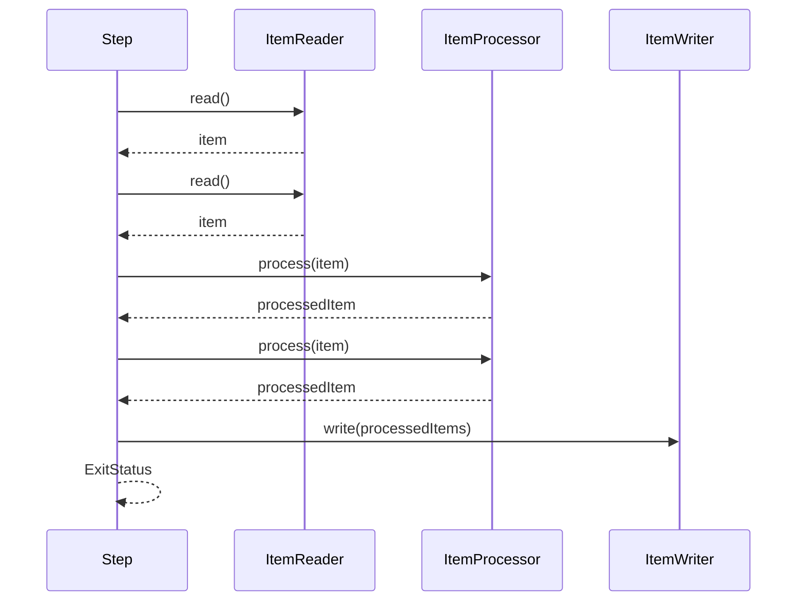
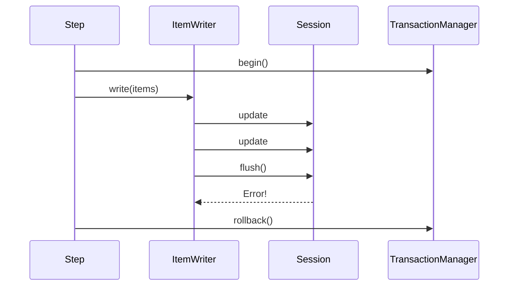
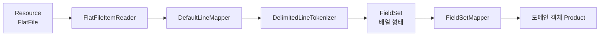
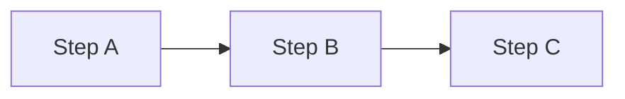
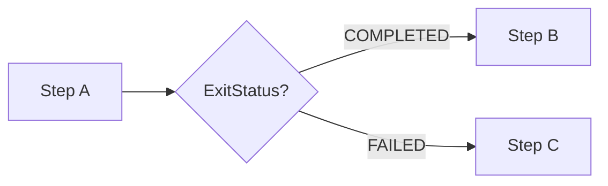

배치 Step 하나를 열어 보면 인터페이스 셋이 있다. 읽고, 바꾸고, 쓴다. `ItemReader`·`ItemProcessor`·`ItemWriter`라는 이름은 [시리즈 편1의 용어 정리](/blog/backend-engineering/batch-processing-fundamentals/)에 이미 나왔지만, 이름만으로는 넘어가게 되는 사실이 하나 있다. **셋 중 둘은 한 건을 받고, 하나는 묶음을 받는다.**

이 비대칭이 이 글의 축이다. 묶음의 크기가 곧 트랜잭션 커밋 간격이 되고, 그 제약이 선 다음에야 「무엇으로 읽을 것인가」가 온다. 마지막으로 JPA를 얹으면 계산이 다시 돌아간다 — 원래 요청 하나만큼 살도록 만들어진 영속성 컨텍스트가 배치에서는 몇 시간을 살기 때문이다.

## 처리 흐름

마지막 화살표가 커밋에서 다시 읽기로 돌아온다. Step은 「전부 읽고 전부 쓰는」 3단계 파이프라인이 아니라 **chunk size만큼 읽고 그만큼 처리하고 한 번에 쓰고 커밋하는 루프**다. 1천만 건이면 이 루프가 1천만을 chunk size로 나눈 횟수만큼 돈다.

시퀀스로 보면 비대칭이 분명해진다 — `read()`와 `process()`는 아이템 수만큼 오가는데 `write()`는 한 번만 불린다. 읽기와 처리가 한 건 단위인 것은 **책임을 아이템에 붙이기 위해서**다. 세 번째 줄이 형식 위반이라는 판정은 그 줄을 읽는 자리에서만 내릴 수 있고, `ItemProcessor`가 `null`을 반환하면 그 아이템만 빠지는 필터링도 같은 성질이다. 반대로 쓰기가 묶음인 것은 **출력 비용이 건수가 아니라 왕복 횟수에 붙기 때문**이다. chunk 하나치 INSERT를 개별 문장으로 보내면 왕복이 아이템 수만큼 생기지만, JDBC batch로 묶으면 한 번이다.

## chunk size는 커밋 간격이다

**chunk size = 커밋 간격**이다. 이 한 문장이 전부이고 나머지 트레이드오프가 여기서 파생된다. chunk size를 정하는 일은 「몇 건씩 묶어 쓸까」가 아니라 **「트랜잭션을 몇 건마다 끊을까」**를 정하는 일이다.

| chunk size | 장점 | 단점 |
| --- | --- | --- |
| **작게** | 메모리 사용량이 적다 / 실패 시 롤백·재처리 범위가 좁다 | 커밋·I/O 왕복 횟수가 늘어 느려진다 |
| **크게** | I/O 왕복이 줄어 처리량이 오른다 | 메모리 압박 / 롤백 시 통째로 되돌아간다 / 락 보유 시간이 길어진다 |

표가 말하는 것은 어느 쪽이 낫다가 아니라 **손잡이 하나에 넷이 매달려 있다**는 사실이다. 메모리·재처리 범위·왕복 횟수·락 보유 시간이 같은 값으로 동시에 움직이므로 chunk size에는 정답이 없고, 무엇을 먼저 지킬지 정한 뒤 측정으로 좁히는 값만 있다. 원본도 「배치 청크 크기 조절」을 명시적 튜닝 축으로 잡는다.

넷 중 **락 보유 시간**만 성격이 다르다. 앞의 셋은 배치 자신의 문제지만 락은 옆에 있는 것들의 문제다 — chunk가 커밋될 때까지 그 행은 잠겨 있고 같은 시간대의 다른 잡이나 API가 기다린다. 잠금과 격리 수준의 규약은 [트랜잭션과 동시성 제어](/blog/backend-engineering/transactions-and-concurrency-control/)에서 다뤘고, 배치에서 달라지는 것은 **그 지속 시간을 요청 처리 시간이 아니라 chunk size가 정한다**는 점이다.

## Writer 시점의 트랜잭션 실패

`JdbcBatchItemWriter`는 chunk의 아이템들을 모아 JDBC batch로 실행한다. 트랜잭션이 chunk를 감싸므로 flush 시점에 에러가 나면 **그 chunk 전체가 rollback**된다.

에러가 나오는 위치가 실무 함정이다. **DB 제약 위반이 update 시점이 아니라 flush 시점에 터진다.** update는 세션에 적어 두기만 하고 실제 왕복은 flush 한 번뿐이어서다. 처리량을 사려고 왕복을 묶은 최적화가 실패 지점을 아이템에서 묶음으로 밀어 올린 셈이다.

그래서 예외는 chunk 안의 어느 아이템이 범인인지 알려 주지 않는다. `faultTolerant()`의 Skip이 하는 일이 여기서 나온다 — 터진 chunk를 **1건씩 재실행하며 범인을 찾는 비싼 스캔 모드**로 전환한다. chunk size가 클수록 이 재실행도 비싸진다. Skip과 Retry가 갈리는 조건은 시리즈 편2가 다룬다.

## Reader / Writer 구현체 선택

고르는 축은 둘이다. **입력이 파일인가 DB인가**가 첫째고, DB라면 **연결을 쥘 것인가 놓을 것인가**가 둘째다.

### 파일 계열

`"red shoes, 50000, nike"` 한 줄이 `FieldSet(["red shoes","50000","nike"])`를 거쳐 `Product("red shoes", 50000, "nike")`가 된다. 중간에 낀 `FieldSet`이 설계 의도를 드러낸다 — **한 줄을 토막 내는 일과 토막을 도메인에 꽂는 일이 서로 다른 컴포넌트에 있다.** 구분자가 바뀌면 토크나이저만, 도메인 필드가 늘면 매퍼만 바뀐다. 파일 포맷은 바깥에서 오고 도메인은 안에서 자라므로 두 변경의 출처가 다르다. JSON은 `JsonItemReader` / `JsonItemWriter`가 같은 자리를 맡고, 편1의 요구사항 4(거래 로그 JSON을 DB로)가 이 조합을 쓴다.

### DB 계열 — Cursor vs Paging

| 주제 | Cursor 기반 ItemReader | Paging 기반 ItemReader |
| --- | --- | --- |
| 데이터 처리 방식 | 커서로 하나씩 읽는다 | 페이지 단위로 나눠 한 페이지씩 읽는다 |
| DB 연결 | 처리 동안 **연결을 계속 유지한다** | 쿼리마다 연결을 열고 닫는다 |
| 메모리 사용량 | 적다 (한 번에 한 행) | 페이지 크기만큼 로드하므로 클 수 있다 |
| 성능 | 작은 데이터셋에 효과적. 긴 연결로 **DB 자원을 점유한다** | 큰 데이터셋에 적합. 페이지마다 별도 쿼리라 오버헤드가 생긴다 |
| 재시작 용이성 | 처리 위치 추적이 **복잡하다** | 페이지마다 독립 쿼리 → **상대적으로 용이하다** |
| 인덱스 필요 여부 | 불필요 | **정렬과 인덱스가 필요하다** |
| 구현체 | `JdbcCursorItemReader` | `JdbcPagingItemReader`, `JpaPagingItemReader` |

일곱 행이 독립된 일곱 개의 차이로 보이지만, **두 번째 행이 나머지 여섯을 낳는다.** 커서는 서버에 열려 있는 결과 집합을 가리키는 포인터이므로 그것을 쥐고 있으려면 연결이 끊기면 안 된다. 거기서 나머지가 따라 나온다. 결과 집합이 이미 서버에 있으니 클라이언트는 한 행만 들고 있으면 되고(메모리), 한 번 훑고 지나가므로 정렬용 인덱스도 필요 없다. 대신 배치가 도는 내내 커넥션 하나가 묶여 DB 자원을 점유하고, 잡이 죽으면 결과 집합도 사라지므로 「어디까지 읽었다」를 복원할 방법이 없다.

페이징은 반대다. 매번 새 쿼리를 던지니 연결을 오래 쥐지 않고, 「어디까지」가 페이지 번호나 마지막 키라는 **값**으로 표현되므로 그것만 적어 두면 재시작이 성립한다. 편1이 말한 「신뢰성의 청구서」가 여기서 구체적 형태를 얻는다 — 재시작 가능성은 상태를 값으로 꺼낼 수 있을 때 생긴다. 대신 매 페이지가 독립 쿼리이므로 **같은 순서가 매번 재현돼야 한다.** 정렬 키가 고정돼 있지 않으면 페이지마다 순서가 달라져 어떤 행은 두 번 읽히고 어떤 행은 빠진다. 정렬과 인덱스가 「필요」인 이유는 성능이 아니라 정확성이다.

선택 규칙을 한 줄로 줄이면 **1천만 건을 안정적으로 훑고 재시작까지 원하면 Paging, 데이터가 작고 커넥션 점유가 문제되지 않으면 Cursor**다. 다만 Paging은 `OFFSET`이 커질수록 느려진다 — 건너뛸 행을 실제로 세어 가며 버리기 때문에 뒤로 갈수록 한 페이지가 비싸진다. 그래서 실무 대용량에서는 **키 기반 페이징**(`where id > last_id`)으로 가거나 아예 파티셔닝으로 넘어간다. 키 기반은 재시작 관점에서도 낫다 — 적어 둘 상태가 마지막 키 하나이고, 앞쪽 행이 지워져도 뒤쪽 페이지가 밀리지 않는다. 파티셔닝은 편4의 주제다.

### 구현체 요약

| 구현체 | 입력/출력 | 특징 | 병렬 안전성 |
| --- | --- | --- | --- |
| `FlatFileItemReader` | CSV·고정길이 | LineTokenizer + FieldSetMapper 조합 | **상태 보유(줄 위치)** → 스레드 공유 불가 |
| `FlatFileItemWriter` | CSV | 라인을 모아 flush | 파일 하나에 다중 스레드 쓰기는 위험 |
| `JsonItemReader` / `JsonItemWriter` | JSON | 로그·API 응답 형태 처리 | Reader는 상태 보유 |
| `JdbcCursorItemReader` | RDB | 커넥션 유지, 인덱스 불요 | 커서 공유 불가 |
| `JdbcPagingItemReader` | RDB | 페이지 단위 독립 쿼리 | **정렬 키가 있으면 상대적으로 안전** |
| `JpaPagingItemReader` | RDB(JPA) | 엔티티로 조회 | 영속성 컨텍스트 이슈 (아래 절) |
| `JdbcBatchItemWriter` | RDB | JDBC batch update로 일괄 반영 | Writer는 대체로 안전 |

마지막 열을 세로로 읽으면 규칙이 보인다 — **Reader는 거의 다 위험하고 Writer는 대체로 안전하다.** Reader는 「어디까지 읽었는가」를 자기 안에 들고 있어야 하는 물건이라, 두 스레드가 함께 만지면 같은 줄을 두 번 읽거나 건너뛴다.

## Step Flow와 TaskletStep

### Sequential과 Conditional

가장 단순한 형태는 순차 실행이다. 여기서 Step 경계는 트랜잭션 경계가 아니라 **재시작 경계**다 — Step B에서 죽으면 재실행 시 Step A는 COMPLETED로 남아 있으므로 B부터 재개된다.

분기 기준은 `ExitStatus`다 — 앞의 시퀀스 도식에서 Step이 마지막에 돌려주던 그 값이다. 실패 시 보상 Step(정리·알림·롤백 잡)으로 빠지는 패턴을 여기에 얹는데, `try-catch`와 다른 점은 **보상 Step도 Step이라 실행 이력이 메타데이터에 남는다**는 것이다. 편1의 요구사항 5(일별 상품 현황 보고서)는 이 Step Flow로 **여러 종류의 보고서를 병렬로** 생성한다.

### TaskletStep

chunk 구조는 「반복해서 읽을 아이템이 있다」를 전제한다. 그 전제가 없는 단발성 작업 — 임시 파일 삭제, 저장 프로시저 호출, 디렉터리 준비, 잡 시작·종료 마킹 — 에 `TaskletStep`을 쓴다. 계약은 하나다. **`RepeatStatus.FINISHED`를 반환할 때까지 반복 호출된다.** Tasklet도 Step이므로 실행 이력이 남고 재시작 시 건너뛸 수 있다는 성질은 그대로다.

## JPA 적용 시 주의점

이미 서비스에 JPA가 깔려 있다면 배치도 같은 엔티티를 재사용하고 싶어진다. 그런데 배치에서 JPA는 **비용이 먼저 온다.** 이유를 한 줄로 줄이면 **영속성 컨텍스트는 요청 하나만큼 살도록 설계됐는데 배치에서는 그 수명이 몇 시간**이라는 것이고, 아래 다섯 가지가 전부 그 파생이다.

| 이슈 | 왜 문제인가 | 대응 |
| --- | --- | --- |
| **영속성 컨텍스트 누적** | 읽은 엔티티가 1차 캐시에 계속 쌓여 **OOM**으로 간다. 1천만 건 배치에서 치명적이다 | chunk마다 `EntityManager.clear()` |
| **더티 체킹 비용** | 커밋 시점에 영속 엔티티 전부를 스냅샷과 비교한다. 컨텍스트가 클수록 **커밋이 느려진다** | 읽기 전용이면 `setReadOnly` / DTO 프로젝션 사용 |
| **N+1** | 연관 엔티티를 아이템마다 지연 로딩하면 chunk size × 연관 수만큼 쿼리가 터진다 | fetch join, `@EntityGraph`, 또는 필요한 컬럼만 조회 |
| **개별 INSERT** | JPA는 기본적으로 건별 INSERT라 `JdbcBatchItemWriter`의 일괄 처리보다 느리다 | `hibernate.jdbc.batch_size` 설정, IDENTITY 전략 회피(배치 INSERT가 비활성화된다) |
| **`JpaPagingItemReader` + 페이지 이동 중 데이터 변경** | 같은 데이터를 두 번 읽거나 빠뜨린다 | 정렬 키 고정, 스냅샷 기준 조회, 또는 파티셔닝으로 범위 고정 |

다섯 행은 「JPA의 단점 목록」이 아니라 **수명 가정이 어긋났을 때 어디가 먼저 부러지는가**의 목록이다. 위의 둘은 컨텍스트가 커져서 생기므로 대응도 같다 — chunk 경계에서 비운다. chunk size가 커밋 간격이면서 동시에 **영속성 컨텍스트의 수명 단위**로 쓰이는 셈이다.

세 번째 행은 이 카테고리에서 이미 다룬 문제의 배치 버전이다. `@ManyToOne`이 기본 즉시 로딩이라 목록 조회 하나가 쿼리 101번이 되는 형태는 [OAuth2 로그인과 채팅 도메인](/blog/backend-engineering/oauth2-login-and-chat-domain/)에서 다뤘고, 그 글이 일반형을 [트랜잭션과 동시성 제어](/blog/backend-engineering/transactions-and-concurrency-control/)로 넘긴다. **배치에서만 달라지는 것은 chunk size가 곱셈 계수로 들어온다는 점**이다. 웹에서는 사람이 화면 앞에서 기다리므로 문제가 곧바로 드러나지만, 배치는 자정에 돌고 아무도 기다리지 않아 N+1이 있어도 「돌긴 돈다」. 드러나는 시점이 응답 지연이 아니라 **배치 윈도우를 넘긴 어느 날 아침**이다.

마지막 행은 앞 절의 Paging 이야기와 같다. 페이지마다 독립 쿼리라는 성질이 재시작을 쉽게 만든 대가로 **페이지 사이에 데이터가 변할 수 있는 틈**을 연다. Cursor는 결과 집합을 붙들어 그 틈이 없는 대신 연결을 붙들어야 했다.

그래서 실무의 절충은 한쪽을 고르는 형태가 아니다. **읽기는 JPA로(도메인 재사용), 쓰기는 `JdbcBatchItemWriter`로(성능)** 섞는 하이브리드가 흔하다. 판단할 질문은 「JPA를 쓸까 말까」가 아니라 **「어디까지 쓰고 어디서 내려놓을까」**다.

## 정리

한 Step 안의 데이터 흐름은 결정 하나가 다음 결정의 제약이 되는 사슬이다. 쓰기를 묶음으로 받기로 하면 트랜잭션이 chunk를 감싸고, chunk size를 정하면 메모리와 롤백 범위와 락 보유 시간이 한꺼번에 정해지며, 그 제약 위에서 Cursor와 Paging이 갈리고, JPA를 얹으면 계산이 다시 돌아간다. chunk size를 「일단 적당히 두고 나중에 튜닝하자」로 넘길 수 없는 이유가 여기 있다.

그리고 이 결정들은 전부 **한 스레드를 전제로** 내려졌다. Reader가 상태를 들고 있어도 괜찮았던 것은 그것을 만지는 손이 하나뿐이어서였다. 다음 편은 그 전제를 걷어낸다 — 목표 시간을 맞추려 무엇을 어떤 순서로 측정하고, 병렬로 바꿀 때 이 글에서 세운 것들 중 무엇이 먼저 깨지는지를 다룬다.
