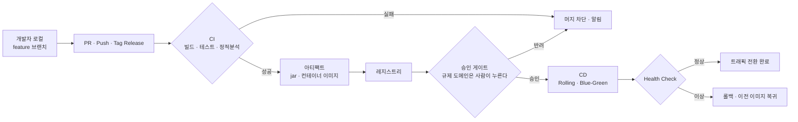

릴리즈 전날 밤에 팀 전원이 각자의 브랜치를 한꺼번에 합치는 광경은 그렇게 오래된 것이 아니다. 충돌은 그날 한꺼번에 터지고, 빌드는 누군가의 로컬에서만 되고, 배포 절차는 담당자의 머릿속과 위키 문서 사이 어딘가에 흩어져 있다. 이 방식이 그럭저럭 버틴 이유는 하나다 — **릴리즈가 드물었기 때문이다.**

그 조건을 깬 것은 기술이 아니라 시장이다. 요구사항을 처음에 확정하고 순서대로 내려가는 방식은 만들 것이 무엇인지 미리 아는 경우에만 성립하는데, 진입 속도가 점유율과 매출을 가르기 시작하면서 그 가정부터 무너졌다. 확정하는 대신 계속 반영하는 쪽으로 갈아탄 것이 애자일이다.

애자일로 주기가 짧아지면서 그 전제가 사라졌다. 분기에 한 번이던 배포가 주에 한 번이 되고 하루에 몇 번이 되면, 손으로 하던 절차는 비용이 아니라 **위험**이 된다. 같은 일을 스무 번 더 하면 스무 번 더 틀릴 기회가 생기고, 틀린 것을 되돌리는 절차마저 여전히 손에 있기 때문이다.

원본이 푸는 문제는 그래서 한 문장이다. **「사람이 손으로 하던 통합·배포를 어떻게 기계에 옮기고, 그 기계를 어떻게 멈출 수 있게 만드는가.」** 앞의 절반만 읽으면 자동화 이야기지만 뒤의 절반이 이 시리즈의 절반을 차지한다. 멈출 수 없는 자동화는 사람이 손으로 하던 시절보다 **더 빠르게** 틀린 것을 내보내기 때문이다.

이 글은 일곱 편의 지도다. 나머지 여섯 편이 「어떻게」를 나눠 맡으므로 여기서는 지형만 그린다 — CI와 CD가 각각 무엇을 자동화하는지, 시리즈가 쓰는 낱말이 어디에서 갈리는지, 그리고 어느 편에 무엇이 있는지다.

## 기계에 옮기려면 먼저 두 가지가 있어야 한다

CI와 CD는 붙어 다니지만 자동화하는 대상이 다르고, 실패했을 때 어디까지 번지는지도 다르다.

| | 자동화하는 것 | 실패가 닿는 곳 |
| --- | --- | --- |
| **CI** | 변경을 자주 합치고, 합친 결과를 자동으로 빌드·테스트한다 | 팀 안 — 머지가 막힌다 |
| **CD** | 검증을 통과한 산출물을 릴리즈 가능 상태로 두거나(Delivery) 운영까지 반영한다(Deployment) | 팀 밖 — 사용자가 겪는다 |

오른쪽 열이 이 시리즈의 무게 배분을 정한다. CI에 묻는 것은 **얼마나 빨리 알려 주는가**이고, CD에 묻는 것은 **틀렸을 때 되돌릴 수 있는가**다. 앞의 다섯 편이 첫 질문을, 편6이 두 번째 질문을 맡는다.

둘 다 전제가 같다. **형상관리와 재현 가능한 실행 단위다.** 자동으로 합치려면 무엇을 합치는지가 이력으로 남아 있어야 하고(Git), 자동으로 반영하려면 「내 로컬에서는 됐는데」가 성립하지 않는 단위여야 한다(컨테이너 이미지). 이 둘이 없으면 파이프라인은 자동화가 아니라 **자동으로 실패하는 절차**가 된다. 편2와 편3이 이 전제를 하나씩 맡는 이유다.

### 커밋에서 트래픽까지, 한 판의 모양

도식에서 갈래가 지는 곳이 셋이다. **CI에서 한 번, 승인 게이트에서 한 번, Health Check에서 한 번.** 셋 다 「통과」와 「멈춤」이 갈리는 자리이고, 앞에서 말한 「기계를 멈출 수 있게 만드는」 장치가 이 셋으로 끝난다. 자동화의 값은 빨라진 데 있는 것이 아니라 **멈출 자리를 세 군데 남긴 채 빨라진 데** 있다.

가운데 하나는 도메인을 탄다. 결제·금융처럼 승인이 법이나 내규로 강제되는 곳에서는 이 자리가 필수지만, 그렇지 않은 조직은 이 자리를 아예 없애고 배포까지 자동으로 내보낸다. **그 경계가 어디인지가 편2의 주제다.**

셋 중 가운데 하나만 성격이 다르다. CI와 Health Check는 기계가 수치로 판정하지만 승인 게이트는 사람이 누른다. 이 자리를 어디에 몇 개 놓을지, 무엇을 통과 기준으로 못 박을지는 도구 설정이 아니라 조직이 정하는 정책이다. 그 정책 쪽은 [요구사항에서 운영까지 여섯 게이트](/blog/ai-transformation/sdlc-human-gates/) 편이 다루고, 거기서 나오는 경계 하나가 이 시리즈에 그대로 걸린다 — **생성·검증은 개발자 로컬로 흡수해도 되지만 머지 승인과 배포 승인은 서버사이드에 둔다.** 로컬에 두면 끄고 우회할 수 있기 때문이다. 이 시리즈는 그 경계의 아래쪽, 즉 서버사이드에서 실제로 무엇이 도는가를 맡는다.

### 도구가 두 갈래인 이유

| | GitHub Actions | Jenkins |
| --- | --- | --- |
| 출발점 | 저장소 이벤트 | 자체 서버 |
| 확장 방식 | 마켓플레이스 액션 조립 | 플러그인 조립 |
| 실행 주체 | Runner(호스팅 또는 self-hosted) | Controller + Agent |
| 소유 | 빌려 쓴다 — 운영 부담이 없다 | 직접 가진다 — 운영 부담이 있다 |

원본의 결론은 **「둘 다 알아야 한다」** 이고, 근거는 취향이 아니라 **레거시 마이그레이션**이다. 새로 짜는 파이프라인은 GitHub Actions로 가는 일이 많지만, 옮겨야 할 것이 Jenkins에 쌓여 있는 조직은 여전히 많다. 옮기려면 옮길 대상을 읽을 수 있어야 하고, 그러려면 Jenkinsfile을 읽을 수 있어야 한다. 편4와 편5가 나란히 있는 이유가 이것이다.

## 낱말이 갈리는 자리

시리즈 첫 글이 어휘를 한 뜻으로만 못 박으면 뒤의 편들이 다른 뜻으로 쓸 때 독자가 걸린다. 실제로 갈리는 것부터 먼저 갈라 둔다.

### 시리즈 안에서 갈리는 넷

| 낱말 | 이 시리즈에서 갖는 뜻 |
| --- | --- |
| **Stage / 스테이지** | **셋이다.** ① Git의 Index — 커밋에 넣을 변경을 모아 두는 대기 장소(편2) ② Docker 멀티스테이지 빌드의 한 층(편3) ③ Jenkins 파이프라인의 `stage()` 블록(편5·6) |
| **Job / Step** | **층의 높이가 다르다.** GitHub Actions는 Workflow → Job → Step으로 Job이 가운데 층이지만(편4), Jenkins에서 Job은 등록된 작업 항목 전체를 가리키고 가운데 층의 이름은 Stage다(편5·6) |
| **환경** | **셋이다.** ① 배포 등급 — staging·production처럼 어디에 올리는가(편3) ② Blue/Green 인스턴스 쌍 — 같은 등급 안의 두 벌(편6) ③ 실행 환경 — `agent any`처럼 무엇 위에서 도는가(편5) |
| **Pipeline** | **둘이다.** ① 커밋에서 배포까지의 단계 사슬 일반(편1·4·6) ② Jenkins가 Groovy DSL로 적는 정의 그 자체(편5). 원본 사전은 ②로만 정의해 두었다 |

네 행 모두 한 가지 문제다 — **같은 낱말이 층을 옮겨 다닌다.** 도구들이 서로의 어휘를 빌려 쓰면서 계층 구조만 자기 식으로 잡았기 때문이다.

### 이 블로그 안에서 이미 다른 뜻으로 자리잡은 셋

시리즈 밖으로 한 발만 나가도 같은 낱말이 다른 것을 가리킨다.

| 낱말 | 이 시리즈에서 | 이 블로그의 다른 자리에서 |
| --- | --- | --- |
| **파이프라인** | 커밋에서 배포까지의 단계 사슬 | Redis의 명령 일괄 전송 · 데이터 변환·적재 사슬(ETL·ML) · DB 설계 공정 사슬 |
| **워크플로** | `.github/workflows/*.yml` 파일 하나 | [미리 정의된 코드 경로로 오케스트레이션되는 시스템](/blog/ai-agent/agent-vs-workflow/) · Airflow의 잡 오케스트레이션 |
| **게이트** | **둘을 다 쓴다.** Quality Gate — 기계가 수치로 판정하는 관문(편6) · 승인 게이트 — **배포 단계에서** 사람이 통과를 허가하는 자리(편1·2·5·6) | [사람 게이트](/blog/ai-transformation/sdlc-human-gates/) — 개발 수명주기의 **여러 지점**에서 사람이 판정을 넘겨받는 자리 |

첫 행이 가장 심하다. 이 카테고리 안에서만 「파이프라인」이 이미 세 가지를 가리키고 있고 이 시리즈가 더해지면 넷이 된다. 그래서 뒤의 편들은 **혼동이 생기는 자리에서** **「CI/CD 파이프라인」**·**「Jenkins Pipeline」** 처럼 한정어를 붙인다. **문맥이 이미 CI/CD로 잡힌 뒤에는 홀로 쓴다.**

반대로 **블루그린은 뜻이 갈리지 않는다.** 어디서나 「같은 구성을 두 벌 두고 통째로 전환」이다. 갈리는 것은 두 벌로 두는 **대상**이고, 그 대상이 상태를 가지면 값이 달라진다 — [Elasticsearch 노드](/blog/search-engineering/elasticsearch-operations/)를 두 벌 두면 데이터까지 두 벌이라 자원이 2배다. 이 시리즈가 다루는 무상태 애플리케이션 서버와 같은 낱말을 쓰지만 드는 값이 다르다.

### `master` · `slave` 표기는 이렇게 쓴다

원본 사전은 Jenkins의 두 노드를 「Controller / Master」와 「Agent / Worker / Slave」로 적었다. 이 시리즈는 **산문에서 현행 어휘만 쓰되, 그 이름이어야만 성립하는 자리는 바꾸지 않는다** — 제어 노드는 Controller, 빌드 노드는 Agent, 기본 브랜치는 `main`이지만 `JENKINS_SLAVE_SSH_PUBKEY`도 이미 실행된 명령 안의 `master`도 그대로 적는다. 읽기 좋게 고치면 글은 깔끔해지고 실행은 안 되기 때문이다. 거꾸로 **독자가 자기 저장소에 옮겨 쓸 설정값**은 현행 어휘로 적는다. 거기서는 원본 그대로가 안 돌아간다.

## 용어 정리

원본 사전은 51개다. 그중 특정 편에서만 쓰는 것 — Jenkins의 `Executor`·`Freestyle`, GitHub Actions의 `Context`·`Action`, Git의 `Rebase`·`Squash` 같은 것 — 은 그 편이 처음 쓰는 자리에서 정의한다. 여기 모은 34개는 **일곱 편 어디에서든 다시 나오는 것들**이다. `★` 표시한 여덟은 원본 사전에 없지만 시리즈 전체가 그 위에 서 있어 보탰다.

### 자동화의 뼈대

| 용어 | 원어 | 뜻 |
| --- | --- | --- |
| CI | Continuous Integration | 변경 코드를 자주 합치고 자동 빌드·테스트로 품질을 보장하는 프로세스 |
| CD | Continuous Delivery / Deployment | 테스트를 통과한 산출물을 릴리즈 가능 상태로 두거나(Delivery), 운영까지 자동 반영(Deployment) |
| DevOps | Development + Operations | 개발~배포~운영~모니터링 전 생명주기를 관리하고 개발·운영 협업을 강화하는 역할·문화 |
| 빌드 ★ | Build | 소스를 실행 가능한 산출물로 바꾸는 과정. 이 시리즈에서는 Gradle이 jar를 만드는 층과 Docker가 이미지를 만드는 층 둘 다를 가리킨다 |
| 배포 ★ | Deploy | 산출물을 실행 환경에 올려 트래픽을 받게 하는 것. 「릴리즈 가능 상태로 만드는 것」과는 다른 단계다 |
| 트리거 ★ | Trigger | 파이프라인을 시작시키는 사건. push · PR · 태그 · 일정 · 수동 실행 |

### 형상관리

| 용어 | 원어 | 뜻 |
| --- | --- | --- |
| SCM | Source Code Management | 소스 코드 형상관리. Git·SVN 등 |
| VCS | Version Control System | 버전 관리 시스템. Git이 대표 |
| PR | Pull Request | 병합 전 코드 리뷰·승인을 요청하는 절차. CI가 붙는 대표 지점 |
| Webhook | — | 저장소 이벤트가 나면 외부 시스템에 HTTP 요청을 보내 파이프라인을 트리거하는 방식 |

### 실행 주체와 정의 파일

| 용어 | 원어 | 뜻 |
| --- | --- | --- |
| Workflow | — | GitHub Actions에서 이벤트에 반응해 실행되는 작업 정의 파일(`.github/workflows/*.yml`) |
| Runner | — | 트리거된 워크플로를 실제로 실행하는 서버. 한 번에 하나의 Job만 실행한다 |
| Self-hosted Runner | — | 제공되는 서버가 아니라 직접 운영하는 서버에서 Runner를 실행하는 방식 |
| Artifact | — | 빌드 결과물 파일(jar 등). CI 서버에 업로드·다운로드해 **Job 간**에 전달한다. Step끼리는 파일시스템을 공유하므로 필요 없다 |
| Gradle Wrapper (`gradlew`) | — | 프로젝트에 지정된 Gradle 버전을 자동으로 내려받아 실행하는 스크립트. 빌드 재현성을 확보한다 |

### 컨테이너

| 용어 | 원어 | 뜻 |
| --- | --- | --- |
| 컨테이너 ★ | Container | 애플리케이션과 실행에 필요한 것을 함께 묶어 호스트에서 격리해 돌리는 실행 단위 |
| 이미지 ★ | Image | 컨테이너의 정지 상태 스냅샷. 같은 이미지면 어디서 띄워도 같은 것이 뜬다 |
| Dockerfile | — | 도커 이미지를 만드는 절차를 적은 선언 스크립트 |
| Registry | — | 이미지 저장소. Docker Hub·ECR 등. CI가 밀어 넣고 CD가 꺼내 간다 |
| Docker Compose | — | 다수 컨테이너를 YAML 한 장으로 정의·실행하는 도구 |

### 무중단 배포

| 용어 | 원어 | 뜻 |
| --- | --- | --- |
| 무중단 배포 ★ | Zero-downtime Deployment | 서비스를 내리지 않고 버전을 바꾸는 것. 아래 세 전략이 그 방법이다 |
| Rolling | — | 서버를 순차로 교체하며 배포하는 전략 |
| Blue-Green | — | 같은 구성을 두 벌 두고 트래픽을 통째로 전환하는 전략 |
| Canary | — | 일부 트래픽에만 신버전을 노출해 검증한 뒤 확대하는 전략 |
| HA | High Availability | 고가용성. 이중화·삼중화 구성. 무중단 배포는 이 구성 위에서만 성립한다 |
| LB | Load Balancing | 부하 분산. 트래픽 전환을 실제로 수행하는 주체 |
| L4 / L7 | — | L4 스위치(전송 계층 부하분산) / Nginx 같은 애플리케이션 계층 프록시·LB |
| Health Check | — | 배포 후 애플리케이션이 정상 기동했는지 확인하는 API 호출. 전환과 롤백을 가르는 판정 |
| 롤백 ★ | Rollback | 이전 이미지·이전 인스턴스로 되돌리는 것. CD 실패의 회수 수단 |

### 품질·보안 게이트

| 용어 | 원어 | 뜻 |
| --- | --- | --- |
| 정적 분석 ★ | Static Analysis | 코드를 실행하지 않고 읽어서 결함·취약점을 찾는 것 |
| SonarQube | — | 정적 분석 도구. 버그·코드 스멜·보안 취약점을 검출한다 |
| Quality Gate | — | 정적 분석 기준에 미달하면 파이프라인을 실패시키는 품질 관문 |

### 배포 방식과 도메인

| 용어 | 원어 | 뜻 |
| --- | --- | --- |
| GitOps | — | 배포 대상 상태를 Git에 선언해 두고 도구(Argo CD 등)가 그 선언에 맞춰 동기화하는 운영 방식 |
| PG | Payment Gateway | 결제대행. 이 시리즈의 예제 도메인이자 금융 감독 대상이라 승인·감사 기록이 강하게 요구되는 영역 |

## 이 시리즈의 구성

일곱 편이 앞의 도식을 왼쪽에서 오른쪽으로 걸어간다. 편2·편3이 파이프라인이 서 있는 **전제**를, 편4·편5가 **도구 두 갈래**를, 편6이 마지막 구간인 **배포와 게이트**를 맡고, 편7이 운영과 설명 자리에서 되돌아오는 질문을 모은다.

| 편 | 다루는 구간 | 답하는 질문 |
| :---: | --- | --- |
| **1** | 지형 전체 (이 글) | 무엇을 왜 기계에 옮기는가 |
| [**2**](/blog/backend-engineering/version-control-as-cicd-premise/) | 형상관리와 Git의 세 영역 | 「되돌린다」는 무엇을 어디로 되돌리는 것인가 |
| [**3**](/blog/backend-engineering/branching-strategy-and-containers/) | 브랜치 전략과 컨테이너 | 무엇을 단위로 합치고 무엇을 단위로 나르는가 |
| [**4**](/blog/backend-engineering/github-actions-pipeline/) | GitHub Actions | 저장소 이벤트에서 시작하는 파이프라인은 어떻게 조립되는가 |
| [**5**](/blog/backend-engineering/jenkins-pipeline-and-agents/) | Jenkins | 서버를 직접 가지면 무엇이 달라지는가 |
| [**6**](/blog/backend-engineering/zero-downtime-and-quality-gates/) | 무중단 배포와 품질·보안 게이트 | 멈추지 않고 바꾸되, 잘못됐을 때 멈추려면 |
| 7 | Q&A | 고를 때 · 터졌을 때 · 설명해야 할 때 |

**[편2](/blog/backend-engineering/version-control-as-cicd-premise/) — 형상관리가 전제인 이유.** Git이 파일을 Working Directory · Index · Repository 세 영역에 나눠 두는 구조에서 시작한다. 이 셋을 구분하지 못하면 「되돌린다」가 한 가지 명령으로 보이지만, 실제로는 대상이 어느 영역에 있느냐에 따라 다른 일이 된다.

**[편3](/blog/backend-engineering/branching-strategy-and-containers/) — 합치는 단위와 나르는 단위.** 브랜치 전략은 「무엇을 언제 합치는가」의 규칙이고 컨테이너는 「합친 것을 무엇에 담아 나르는가」의 답이다. 둘이 한 편에 있는 것은 각각 CI의 입력과 출력이기 때문이다.

**[편4](/blog/backend-engineering/github-actions-pipeline/) — GitHub Actions.** 저장소 이벤트가 곧 트리거인 모델이다. Workflow → Job → Step 세 층과 Runner, 마켓플레이스 액션을 조립하는 방식을 다룬다.

**[편5](/blog/backend-engineering/jenkins-pipeline-and-agents/) — Jenkins.** 서버를 직접 가지는 모델이다. Declarative Pipeline 문법, Jenkinsfile을 형상관리에 넣는다는 발상, Controller와 Agent의 분리를 다룬다. 편4를 읽고 오면 같은 개념이 다른 이름과 다른 층에 놓인 것이 보인다.

**[편6](/blog/backend-engineering/zero-downtime-and-quality-gates/) — 무중단 배포와 게이트.** 세 전략이 각각 무엇을 대가로 무엇을 얻는지, 그리고 파이프라인을 **실패시키는** 쪽 — 테스트 리포트·API 테스트·정적 분석의 Quality Gate가 여기서 붙는다. 첫 문장의 「어떻게 멈출 수 있게 만드는가」가 이 편에서 답을 받는다.

**편7 — Q&A.** 실제로 되돌아오는 질문은 편의 경계를 가로지른다. 「둘 중 무엇을 고르나」는 편4와 편5에, 「배포가 실패했는데 롤백이 안 된다」는 편3과 편6에 걸친다.

## 정리

자동화가 무엇을 바꾸는지는 「빨라진다」로 요약되지 않는다. 손으로 하던 시절에는 절차 전체가 사람의 판단 안에 있었고, 느린 대신 **매 단계에서 멈출 수 있었다.** 그 판단을 기계에 옮기면 속도를 얻는 대신 그 멈춤이 사라지므로, 사라진 자리에 명시적인 관문을 다시 심는 것이 CI/CD 설계의 실질이다. CI의 실패 조건, 승인 게이트, Health Check가 그 세 자리다.

그래서 이 시리즈는 도구를 배우는 순서로 가지 않고 **전제 → 도구 → 게이트** 순서로 간다. 형상관리와 컨테이너가 없으면 파이프라인이 재현되지 않고, 게이트가 없으면 파이프라인이 멈추지 않는다. 도구는 그 사이에 있고, 도구를 바꿔도 앞뒤는 그대로 남는다.

다음 편은 가장 아래의 전제를 연다. Git이 파일을 어느 세 영역에 나눠 두는지, 「되돌린다」가 왜 한 가지 명령이 아닌지, 그리고 그 구분이 없으면 자동화가 왜 첫 단계에서 막히는지를 다룬다.
