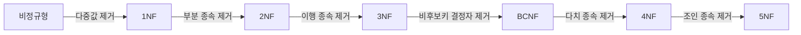
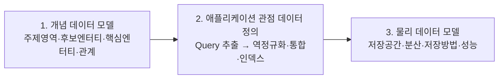
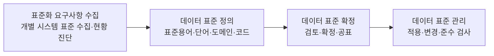

테이블을 어떻게 나눌지는 코드를 짜기 전에 정해지고, 한 번 정해지면 되돌리는 비용이 코드와 비교가 안 된다. 이 글은 그 결정을 내리는 절차 — 요구사항을 개체-관계 모델로 옮기고, 정규화로 이상현상을 걷어내고, 필요할 때만 반정규화를 꺼내는 순서를 다룬다. 스키마를 처음 설계하거나, 이미 돌아가는 스키마가 왜 자꾸 값이 어긋나는지 찾는 사람에게 필요한 내용이다.

그 앞 단계 — 저장소 자체를 무엇으로 고르는가 — 는 시리즈 1편 [관계형 데이터베이스와 NoSQL](/blog/backend-engineering/rdbms-and-nosql-fundamentals/)이 맡는다. 이 글은 저장소가 정해진 다음의 이야기이고, 시리즈 전체가 쓰는 용어 정의도 1편에 있다.

## 모델링은 무엇을 정하는 일인가

데이터 모델링은 **현실의 요구사항(비즈니스)으로부터 데이터의 실체를 나타내는 일**이다. 정의만 보면 문서 작업처럼 들리지만, 실제로 얻는 것은 셋이다.

| 관점 | 모델링이 주는 것 |
|---|---|
| 애플리케이션·데이터 통합 | 데이터를 중심에 둔 애플리케이션 설계가 가능해진다 |
| 개발자의 시스템 이해 | 논리적·물리적 개념을 사용자 관점의 데이터 정의로 표현해, 조직이 필요로 하는 **본질적 데이터**를 정의한다 |
| 그 밖 | 비즈니스 규칙을 도출하고, 중복을 배제하며 데이터를 재사용하게 하는 **의사소통 도구**가 된다 |

세 행을 관통하는 것은 「무엇을 저장할까」가 아니라 **「이 조직이 다루는 것이 무엇인가를 한 벌의 정의로 합의한다」는** 성격이다. 그래서 모델이 없으면 같은 개념이 팀마다 다른 이름과 다른 타입으로 저장되고, 그 상태는 뒤에서 다룰 데이터 표준 문제로 그대로 이어진다.

## 개체-관계 모델의 네 요소와 ERD

### 네 요소

ERD는 네 가지로 이뤄진다.

| 요소 | 정의 | 예시 |
|---|---|---|
| **엔터티(Entity)** | 업무상 관심 있는 개체의 집합 또는 행위의 집합. 속성을 가진다 | 도서, 작가 |
| **속성(Attribute)** | 개체 집합의 특성을 설명하는 항목 | 작가ID, 작가명, 작가설명 |
| **식별자(Identifier)** | 집합에서 하나의 개체를 식별해 주는 속성. 여러 개일 수 있다 | 도서ID |
| **관계(Relationship)** | 엔터티 간의 연관성. 연결할 때 **카디널리티**를 표시한다 | 작가 -집필- 도서 |

주의할 것은 엔터티가 「사물」만이 아니라 **행위의 집합**도 된다는 점이다. 「대출」·「반납」·「결제」는 명사로 보이지 않아 자주 누락되는데, 이력을 남겨야 하는 순간 반드시 엔터티가 된다.

### 카디널리티와 선택성

관계를 선으로만 그리면 모델은 절반만 정해진다. **몇 개가 대응하는가(카디널리티)와** **없어도 되는가(선택성, Optionality)는** 서로 독립된 축이고, 둘을 함께 지정해야 표기가 하나로 확정된다. 까마귀발(Crow's Foot) 표기는 이 두 축을 교차시켜 네 가지를 만든다.

| 표기(까마귀발) | 의미 | 읽는 법 |
|---|---|---|
| `—\|\|` | 정확히 1 (필수, 하나) | 반드시 하나 |
| `—o\|` | 0 또는 1 (선택, 하나) | 없거나 하나 |
| `—\|<` | 1 이상 (필수, 다수) | 반드시 하나 이상 |
| `—o<` | 0 이상 (선택, 다수) | 없거나 여러 개 |

카디널리티는 표기에서 끝나지 않고 **물리 스키마의 형태를 직접 결정한다.**

| 카디널리티 | 물리 구현 | 예 |
|---|---|---|
| **1:1** | 어느 한쪽에 FK를 두고 UNIQUE 제약을 건다 | 사원 – 사원상세 |
| **1:M** | M쪽 테이블에 FK를 둔다 | 작가 – 도서 |
| **M:M** | **교차(연결) 테이블**로 분해해야 한다. RDBMS는 M:M을 직접 저장하지 못한다 | 도서 – 공동작가 |

세 행 중 실무에서 사고가 나는 곳은 마지막 행이다. M:M은 표기법에는 있지만 **저장 구조에는 없다.**

도서관을 예로 들어 관계를 문장으로 읽으면 이렇게 된다.

- 작가는 도서를 집필할 수도 있고, **하지 않을 수도 있다** → 작가 쪽은 선택(optional)이다.
- 도서는 **반드시** 집필한 작가가 존재해야 한다 → 도서 쪽은 필수(mandatory)다.
- 한 도서를 집필하는 작가는 한 명이다 → 1:M이다.

### 모델이 SQL을 결정한다

위 세 문장 중 「집필한 도서가 없는 작가도 있을 수 있다」는 조건이 곧 조인 방식을 바꾼다. 선택성은 ERD 위의 기호가 아니라 **쿼리의 결과 집합**이다.

```sql
-- 집필한 도서가 있는 작가만 (INNER JOIN)
SELECT 작가.작가명, 도서.도서명
FROM 작가, 도서
WHERE 작가.작가ID = 도서.작가ID;

-- 모든 작가 (집필 이력 없는 작가 포함) → OUTER JOIN 이 필수
SELECT 작가.작가명, 도서.도서명
FROM 작가 LEFT OUTER JOIN 도서
ON 작가.작가ID = 도서.작가ID;
```

두 쿼리는 문법이 아니라 **요구사항이 다르다.** 「작가 목록을 보여 준다」는 화면에 첫 번째 쿼리를 쓰면 신인 작가가 통째로 사라지는데, 데이터도 코드도 정상이라 원인을 찾는 데 시간이 걸린다. 선택성을 모델 단계에서 적어 두면 이 결정이 리뷰 대상이 되고, 적어 두지 않으면 쿼리를 쓰는 사람의 그때그때 판단이 된다.

## 정규화 — 이상현상을 없애는 절차

### 정규화가 막는 것

정규화의 목적은 **논리적 데이터 모델의 일관성을 유지하고, 중복을 제거한 안정적인 자료구조를 얻는 것**이다.

필요성은 반대편에서 더 분명하다. 정규화되지 않은 엔터티는 입력·삭제·수정 시 오류가 발생할 개연성(Anomaly)이 있고, 변경 이상이 일어나면 신뢰할 수 없는 값이 채워져 **일관성과 무결성을 해친다.** 이상현상은 셋이다.

| 이상현상 | 정의 | 증상 예시 |
|---|---|---|
| **입력 이상(Insertion Anomaly)** | 데이터 입력이 안 되거나, 불필요한 데이터까지 함께 입력된다 | 아직 등록한 학생이 없는 과목을 넣을 수 없다 |
| **삭제 이상(Deletion Anomaly)** | 일부 정보를 삭제할 때 유지되어야 할 정보까지 함께 삭제된다 | 마지막 학생을 지우면 과목 정보까지 사라진다 |
| **수정 이상(Update Anomaly)** | 일부 속성만 수정해 정보의 무결성·모순성이 발생한다 | 과목명을 한 행만 바꿔 같은 과목코드에 두 이름이 존재한다 |

셋의 공통 원인은 하나다 — **독립적으로 존재해야 할 두 사실이 한 행에 묶여 있다.** 과목이라는 사실과 등록이라는 사실이 같은 행에 있으면, 등록을 넣어야 과목이 생기고 등록을 지우면 과목이 사라진다. 정규형은 그 묶임을 단계별로 푸는 절차다.

### 정규형 단계별 비교

| 단계 | 규칙 (한 줄 정의) | 제거하는 것 | 위반 예 | 해소 방법 |
|---|---|---|---|---|
| **1NF** | 모든 속성은 반드시 **하나의 값**을 가져야 한다 | 반복 그룹·다중값 속성 | `구매도서 = "A, B, C"`처럼 한 컬럼에 여러 값 / 구매도서1·구매도서2 컬럼 반복 | 별도 엔터티로 분리하고 1행 1값으로 전개한다 |
| **2NF** | 식별자가 아닌 모든 속성은 **식별자 전체에 완전 함수 종속**이어야 한다 | 부분 함수 종속(복합키의 일부에만 종속) | PK가 (학생번호+과목코드)인데 `과목명`은 과목코드에만 종속 | 과목 엔터티를 분리한다 |
| **3NF** | 식별자를 제외한 **속성 간 종속성**이 존재하면 안 된다 | 이행 함수 종속(A→B→C) | `평가내역`이 PK가 아니라 `평가코드`에 종속 | 평가 엔터티를 분리한다 |
| **BCNF** | **모든 결정자가 후보키**인 관계여야 한다 | 후보키가 아닌 결정자 | 후보키가 여러 개이고 서로 겹칠 때 남는 잔여 이상 | 결정자를 기준으로 분해한다 |
| **4NF** | **다치 종속(Multi-valued Dependency)** 을 제거한다 | 서로 독립적인 다중값의 조합 폭발 | 한 교수의 `담당과목`과 `보유자격증`이 한 테이블에서 교차 곱을 만든다 | 독립 관계별로 테이블을 분리한다 |
| **5NF** | **조인 종속**을 제거하고 **무손실 조인**이 가능해야 한다 | 3개 이상 테이블로만 분해되는 잔여 종속 | 공급자-부품-프로젝트 3자 관계 | 3원 관계를 이원 관계 3개로 분해한다 |



1NF 다음부터의 화살표 라벨을 이어 읽으면 정규화가 무엇을 하는 절차인지 한 줄로 나온다 — **종속성을 한 종류씩 제거하는 것**이다. 단계가 올라갈수록 제거 대상이 좁아지고, 그만큼 실무에서 마주치는 빈도도 떨어진다.

**실무 기준선**은 여기서 나온다. 대부분의 OLTP 설계는 **3NF까지**를 목표로 하고, 후보키가 복잡한 예외 상황에서만 BCNF를 검토한다. 4NF·5NF는 이론적 완결성의 영역이라 실무에서 명시적으로 적용하는 일은 드물다.

### 잘못된 모델을 되돌리는 비용

「여러 명의 공동작가가 존재할 수 있다」는 요구를 뒤늦게 발견했다고 하자. 1:M으로 잡아둔 모델을 M:M으로 바꾸는 순간 아래가 전부 따라온다.

| # | 해야 하는 일 |
|---|---|
| 1 | 신규 테이블 생성(교차 테이블) |
| 2 | 데이터 마이그레이션 |
| 3 | 기존 도서 정보를 조회하던 **SQL 전부 수정** |
| 4 | 프로그램 수정 |
| 5 | 테스트 진행(**성능 포함**) |
| 6 | 배포·모니터링 |

조회 SQL이 어디에 몇 개나 있는지는 **모델을 바꾸기로 결정한 뒤에야** 세어진다.

이것이 모델링을 「설계 문서 작업」이 아니라 **리스크 관리**로 봐야 하는 이유다. 코드는 리팩터링으로 되돌릴 수 있지만, **운영 중인 데이터 구조는 되돌리는 비용이 비대칭적으로 크다.** 마이그레이션 도중 정합성이 깨지면 복구가 불가능한 경우도 있다.

## 반정규화를 언제 하는가

정규화는 **중복 제거**를 얻고 **조인 비용**을 지불한다. 반정규화는 그 거래를 반대로 하는 것이다 — 조인을 줄이는 대신 중복을 되살린다. 어느 쪽도 공짜가 아니므로, 판단은 「무엇을 지불할 것인가」로 내린다.

| 상황 | 반정규화 카드 | 지불하는 대가 |
|---|---|---|
| 조인이 3~4단계 이상 반복되고 조회 빈도가 압도적으로 높다 | 컬럼 중복 — 자주 쓰는 코드명·이름을 자식 테이블에 복사한다 | 원본이 바뀔 때 동기화를 놓치면 값이 어긋난다 |
| 집계 쿼리가 매번 전체 스캔을 유발한다 | 집계 컬럼 또는 요약 테이블을 추가한다 | 갱신 시점의 정합성, 배치 지연 |
| 이력 테이블에서 「현재 값」만 자주 조회한다 | 최신 여부 플래그 또는 현재값 별도 테이블 | 이력 입력 로직의 복잡도가 올라간다 |
| 한 테이블의 일부 컬럼만 집중 조회된다 | 수직 분할(테이블 분리) | 전체 조회 시 조인이 필요해진다 |
| 특정 기간의 데이터만 조회된다 | 수평 분할(파티셔닝) | 파티션 키 설계에 실패하면 오히려 느려진다 |

앞 세 행의 오른쪽 열은 같은 형태다 — **읽기를 싸게 만든 대가를 쓰기 쪽이 지불한다.** 그래서 반정규화의 성패는 「얼마나 빨라졌나」가 아니라 「그 대가를 누가 어떻게 감당하기로 했나」에서 갈린다. 아래 3원칙을 순서대로 적용한다.

1. **먼저 정규화한다.** 반정규화는 정규화된 모델이 있어야 되돌릴 수 있다.
2. **측정한 뒤에 한다.** 실행계획·응답시간 데이터 없이 「느릴 것 같아서」 하는 반정규화는 부채다.
3. **동기화 책임을 명시한다.** 트리거·애플리케이션·배치 중 무엇이 중복 값을 맞출지 문서에 남긴다.

중복 컬럼을 만든 사람은 그 순간 동기화 코드를 함께 쓰지만, **나중에 원본 컬럼을 수정하는 사람은 사본이 있다는 사실을 모른다.** 값 불일치는 그렇게 생긴다.

## NoSQL 데이터 모델링

NoSQL은 유연한 구조를 가지는 DBMS이기 때문에, 기존의 개체-관계 모델링을 그대로 적용하면 최종 물리 모델과 일치하기 어렵다. 그래서 NoSQL에서의 데이터 모델링은 **애플리케이션(개발 관점)으로 접근**해야 한다.



| 단계 | 하는 일 | 유의점 |
|---|---|---|
| 개념 데이터 모델 | 주제영역 정의(가입·정산·상품) → 후보 엔터티 설정 → 핵심 엔터티 정의 → 관계 정의 | 관계는 **직접적인 관계만** 정의한다 |
| 애플리케이션 관점 | 실제 개발에 필요한 데이터 관점으로 정리한다. 역정규화·통합·인덱스 모델 패턴을 적용한다 | **쿼리가 모델을 결정한다** |
| 물리 데이터 모델 | DBMS의 특징을 고려해 저장 구조로 변환한다 | 논리 모델과 **1:1로 매핑되지 않을 수 있다** |

RDBMS 모델링과 갈라지는 지점은 2단계다. RDBMS에서는 모델을 먼저 세우고 쿼리가 그 위에서 작성되지만, NoSQL에서는 **필요한 쿼리를 먼저 뽑고 그 쿼리가 모델을 정한다.** 순서가 뒤집히므로, 나중에 새로운 조회 패턴이 생기면 모델을 다시 만들어야 하는 경우가 나온다.

### 디자인 패턴 3종

| 패턴 | 내용 | 대가 |
|---|---|---|
| **역정규화(Denormalization)** | 조인을 허용하지 않으므로 도서 테이블에 작가 테이블의 정보(작가명)를 넣어 설계한다 | 같은 작가ID인데 작가 테이블의 작가명과 도서 테이블의 작가명이 **다를 수 있다** |
| **통합(Aggregate)** | 슈퍼-서브타입을 하나의 집단으로 통합한다. 서브타입별로 다른 컬럼은 `상세내용` 컬럼에 몰아넣는다 (`관계인구분 1:학생 → 학생번호`, `2:직원 → 부서코드·직급`) | 상세내용을 파싱하는 책임이 애플리케이션으로 이동한다 |
| **인덱스 테이블(Index Table)** | 인덱스를 쓸 수 없는 NoSQL은 역인덱스 테이블을 별도로 설계한다 (`부서코드 11 → R002, R003`) | 데이터 입력 시 인덱스에도 함께 입력되도록 **애플리케이션을 수정해야 한다**(또는 배치로 처리한다) |

세 패턴의 대가 열을 나란히 읽으면 공통점이 보인다 — **DBMS가 하던 일이 애플리케이션으로 넘어온다.** 정합성 유지(역정규화), 스키마 해석(통합), 인덱스 갱신(인덱스 테이블)이 각각 그렇다. 앞 절의 RDBMS 반정규화가 「선택적으로 넘기는 것」이라면, NoSQL 모델링에서는 그것이 기본값이다.

| NoSQL 모델링 | 내용 |
|---|---|
| **장점** | 스키마가 유연해 구조 변경이 매우 쉽다 / 애플리케이션에서 구조를 바꿀 수 있어 개발이 편하다 / 조인이 없어져 프로그램이 간단해진다 |
| **단점** | 데이터 일관성이 보장되지 않는다 / **NoSQL 모델링만으로는 비즈니스를 이해하기 어렵다** / 데이터 표준을 맞추기 어렵다 |

단점의 두 번째 항목이 앞의 모델링 정의와 정확히 맞부딪힌다. 모델링이 주는 것 중 하나가 「조직이 필요로 하는 본질적 데이터의 정의」였는데, 쿼리에서 출발한 모델은 그 정의를 담지 않는다. **모델을 봐도 업무가 읽히지 않는다**는 뜻이고, 그래서 NoSQL을 쓰더라도 개념 모델은 따로 유지하는 편이 낫다.

## 데이터 표준

**데이터 표준**은 데이터의 명칭·정의·형식·규칙에 대한 원칙을 수립해 **전사적으로 적용**하는 것이다. 표준이 없을 때 나타나는 증상은 구체적이다.

| 데이터 활용상 문제점 | 구체적 증상 |
|---|---|
| 중복 관리, 그리고 조직·업무·시스템별 불일치 | 전화번호 / 서비스번호 / 연락처 / 모바일번호 / 폰번호 / 핸드폰번호 — 같은 것인가? 고객ID가 `cust_id(int)`, `custId(int)`, `customer_id(string)`, `cId(int)` 로 제각각이다 |
| 의미 파악이 지연돼 정보 제공의 적시성이 없다 | 커뮤니케이션 오류가 난다 |
| 데이터 통합이 어렵다 | 분석을 위한 데이터 Clean 작업이 **전체 작업 시간의 70%** 를 차지한다 |
| 정보시스템 변경·유지보수가 곤란하다 | 영향도를 파악할 수 없다 |

세 번째 행의 70%는 분석 인력이 모델링 부재의 비용을 뒤늦게 대신 치르고 있다는 뜻이다. 표준화는 네 단계로 진행한다.



마지막 단계가 없으면 앞의 셋은 공표된 문서로 남는다. **준수 검사가 표준을 살아 있게 한다.**

| 표준화 원칙 | 예시 |
|---|---|
| 관용화된 용어를 우선 사용한다 | 고객(O) / 손님(X) |
| 영문명(물리명)은 정상적인 영어로 쓴다. 발음식 표기는 지양한다 | 도서 → `DOSE`(X), `BOOK`(O) |
| 한글명·영문명에 특수문자와 띄어쓰기를 쓰지 않는다. **한글명 동음이의어는 불가**하다 | 다리(LEG) / 다리(BRIDGE) 공존 (X) |
| 하나의 영문명에 대해 복수의 한글명은 허용한다(이음동의어) | 수납(PAY), 납부(PAY) (O) |

세 번째와 네 번째 행이 비대칭인 것이 핵심이다. **한글명 하나에 뜻이 둘이면 금지, 뜻 하나에 한글명이 둘이면 허용**이다. 앞은 이름에서 뜻을 복원할 수 없게 만들지만, 뒤는 물리명이 같으므로 복원에 지장이 없다.

표준 용어집은 `용어명 / 물리용어명 / 도메인명 / 도메인물리명 / 인포타입명 / 용어정의` 로 관리한다.

| 용어명 | 물리용어명 | 도메인명 | 도메인물리명 | 인포타입 | 정의 |
|---|---|---|---|---|---|
| 변경일시 | CHG_DTM | 일시 | DTM | 날짜 | 변경한 일시 |
| 작가명 | AUTHOR_NAME | 명 | NAME | 변동문자50 | 작가의 이름 |
| 직원연봉금액 | EMP_SAL_AMT | 금액 | AMT | 숫자10 | 직원이 1년간 받는 세전 기준 급여 금액 |
| 조직구분코드 | ORG_GB_CD | 코드 | CD | 변동문자20 | 조직구분코드(A001: 관리부서) |

표준화의 진짜 효과는 「이름이 예뻐지는 것」이 아니다. **접미어(도메인)만 보고 타입과 길이를 알 수 있게 만드는 것**이다. `_AMT`면 숫자10, `_DTM`이면 날짜 — 이 규칙이 서면 신규 테이블 설계 리뷰 시간이 급격히 줄고, 시스템 간 인터페이스 매핑 오류가 사라진다.

## 정리

모델링의 각 단계는 「무엇을 얻고 무엇을 지불하는가」로 요약된다. 「판단 기준」 열은 이 글의 정리다.

| 단계 | 얻는 것 | 지불하는 것 | 판단 기준 |
|---|---|---|---|
| 개체-관계 모델링 | 업무를 데이터로 옮긴 합의된 정의 | 설계 시간 | 카디널리티와 선택성을 **둘 다** 적었는가 |
| 정규화 | 이상현상 제거, 일관성·무결성 | 조인 비용 | OLTP는 3NF까지, BCNF는 예외 상황에서만 |
| 반정규화 | 조회 성능 | 중복과 동기화 책임 | 측정한 뒤에, 동기화 주체를 문서에 남기고 |
| NoSQL 모델링 | 스키마 유연성, 조인 없는 단순한 프로그램 | 일관성, 업무 가독성 | 조회 패턴이 먼저 확정돼 있는가 |
| 데이터 표준 | 이름에서 타입·길이가 읽히는 상태 | 정의·공표·준수 검사의 운영 비용 | 준수 검사 단계까지 갖췄는가 |

앞 세 행을 관통하는 질문은 하나다 — **되돌리는 비용이 얼마인가.** 정규화는 되돌릴 수 있고(반정규화가 그것이다), 반정규화는 정규화된 모델이 남아 있을 때만 되돌릴 수 있으며, 운영 중인 데이터 구조 변경은 앞에서 본 6단계를 전부 치른다. 그래서 모델링에 쓰는 시간은 설계 품질의 문제이기 전에 **나중에 지불할 금액을 지금 깎는 일**이다.

모델이 정해지면 그 위에서 SQL이 돈다. 같은 데이터인데 어떤 쿼리만 느린 이유 — 파싱, 인덱스, 실행계획, 조인 — 와 언제 SQL 대신 모델을 손대야 하는지는 다음 편 [SQL 실행과 인덱스](/blog/backend-engineering/sql-execution-and-indexes/)가 받는다.
