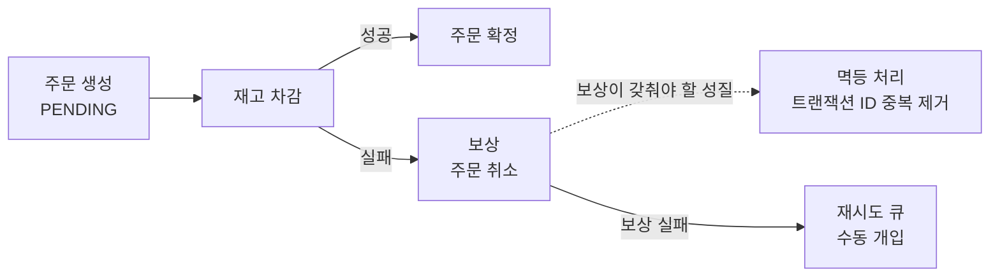

확장을 다루는 일이 어려운 이유는 개별 기법을 몰라서가 아니다. 파티셔닝도 알고 복제도 아는 상태에서, 이 서비스가 지금 무엇을 내주고 무엇을 받을지 정해야 하기 때문이다. 손실을 0으로 둘 것인가 응답을 빠르게 할 것인가, 샤딩을 지금 넣을 것인가 더 버틸 것인가 — 답이 하나로 고정되지 않는 자리들이다.

이 글은 앞 다섯 편이 세운 선택지들을 **선택지 표 · 실패 모드 표 · 문답** 세 형태로 다시 세운다. 확장 방식을 지금 결정해야 하는 상황, 그리고 이미 운영 중인 시스템에서 출처가 잡히지 않는 지연·불일치·데이터 소실을 추적하는 상황에서 쓸모가 있다.

| 편 | 그 편이 세운 축 | 이 글에서 받는 묶음 |
|---|---|---|
| [1. 파티셔닝의 출발점](/blog/backend-engineering/partitioning-fundamentals/) | 왜 쪼개고 어느 방향으로 쪼개는가. 이 시리즈의 용어 32개가 그 글에 모여 있다 | 용어 정의 전부 |
| [2. 파티셔닝 전략과 샤딩](/blog/backend-engineering/partitioning-strategies-and-sharding/) | 무엇을 기준으로 자를 것인가, 인덱스도 함께 자를 것인가, 조각을 다른 머신에 보낼 것인가 | 나누기 — 8문답 |
| [3. 복제](/blog/backend-engineering/replication-topologies-and-lag/) | 몇 벌을 어떤 모양으로 두고, 쓰기가 어디까지 닿기를 기다릴 것인가 | 복사하기 — 9문답 |
| [4. 분산 시스템과 CAP](/blog/backend-engineering/distributed-systems-and-cap/) | 네트워크가 갈라졌을 때 무엇이 원리적으로 불가능하고 무엇을 포기하는가 | 갈라짐 — 5문답 |
| [5. 분산 트랜잭션과 합의](/blog/backend-engineering/distributed-transactions-and-consensus/) | 흩어진 노드를 하나의 결정으로 모으는 방법과 그 값 | 합의 — 6문답 |

오른쪽 열의 숫자를 더하면 28이고, 한 줄로 답할 수 없어 뒤에 따로 뺀 네 문항을 더하면 32다. 주제별로 묶고 개수를 배정한 것은 이 글의 편집이다 — 바탕이 된 자료는 번호만 차례로 매긴 한 장의 표였다.

## 선택지 16개 — 무엇을 얻고 무엇을 내주는가

| 선택지 | 얻는 것 | 내주는 것 | 언제 쓰나 |
|---|---|---|---|
| **Range 파티셔닝** | 기간 단위 관리가 최적화되고, 지난 구간은 파티션 DROP으로 지운다 | 최근 구간 파티션에 접근이 몰려 핫스팟이 생긴다 | 보존 정책이 걸린 이력성 데이터 |
| **Hash 파티셔닝** | 균등 분산 | 범위 조회가 성립하지 않고, 파티션 수를 바꾸면 대규모 재배치 | 균등 분산 하나만이 목적일 때 |
| **Composite** | 기간 관리와 경합 분산을 동시에 | 설계·운영 복잡도가 오른다 | 대량 이력에 높은 동시 쓰기가 겹칠 때 |
| **로컬 인덱스** | 파티션을 DROP해도 인덱스가 무효화되지 않는다 | 파티션 키 없는 조회는 전 파티션을 훑는다 | 파티션 키가 조건에 항상 들어올 때 |
| **글로벌·비파티션 인덱스** | 파티션 키 없이 던지는 조회가 빠르다 | 파티션 DDL 한 번에 인덱스가 전역 무효화된다 | 파티션 키 없이 조회하는 OLTP |
| **샤딩** | 진짜 Scale-Out | **되돌릴 수 없다.** 크로스 샤드 조인과 트랜잭션이 불가능해진다 | 단일 노드의 한계를 이미 넘은 뒤 |
| **단일 리더 복제** | 쓰기 충돌이 없고 구조가 단순하다 | 리더가 죽으면 페일오버가 필요하고, 쓰기는 확장되지 않는다 | 대부분의 OLTP |
| **다중 리더 복제** | 지역별로 가까운 곳에 쓰고, 네트워크 장애를 견딘다 | **쓰기 충돌 해소가 어렵다** | 멀티 DC, 오프라인 편집 |
| **리더리스 복제** | 페일오버 절차 자체가 없어 가용성이 가장 높다 | 쿼럼을 튜닝해야 하고 충돌이 발생한다 | 초고가용성이 요구될 때 |
| **동기 복제** | 데이터 손실이 0 | 팔로워 한 대가 느리면 전체가 막힌다 | 금전·재고처럼 손실이 허용되지 않는 데이터 |
| **반동기 복제** | 손실과 지연 사이의 균형 | 타임아웃이 걸리면 비동기로 강등되어 손실 위험이 되살아난다 | 실무 기본값 |
| **비동기 복제** | 쓰기 성능이 가장 높다 | 페일오버 시 아직 전달되지 않은 쓰기가 사라진다 | 손실을 감당할 수 있는 데이터 |
| **2PC** | 원자성 보장 | 블로킹, 코디네이터라는 단일 장애점, 디스크 로그 비용 | 단일 조직 안에서 짧게 끝나는 분산 트랜잭션 |
| **Saga** | 블로킹이 없고 MSA에 맞는다 | 격리성이 없고 보상 로직을 직접 써야 한다 | MSA, 오래 걸리는 비즈니스 프로세스 |
| **Raft·Paxos** | 리더 유일성과 로그 일관성을 보장 | 과반 노드가 필요하고 쓰기마다 합의 지연이 붙는다 | 메타데이터·설정 관리, 리더 선출 |
| **PBFT** | 악의적 노드까지 견딘다 | 메시지가 O(N²)이고 노드가 3f+1 필요 | 참가자를 신뢰할 수 없을 때 |

열여섯 행을 확장의 축으로 갈라 보면 **나누기 6행 · 복사하기 6행 · 합의 4행**이다. 앞 여섯이 파티셔닝·인덱스·샤딩, 가운데 여섯이 토폴로지 셋과 동기화 강도 셋, 뒤 넷이 분산 트랜잭션 둘과 합의 알고리즘 둘이다. 이 6·6·4 배정은 이 글이 매긴 것이다.

「내주는 것」 열을 세로로 읽으면 한 행만 성격이 다르다. 나머지 열다섯 행이 내주는 것은 성능이거나 복잡도이거나 운영 부담이어서, 나중에 값을 더 치르면 되돌릴 수 있는 종류다. **샤딩 한 행만 되돌림 자체가 불가능하다는 것을 대가로 적는다.** 뒤에 따로 뺀 네 문항 중 하나가 그 행의 도입 시점을 다룬다.

## 실패 모드 11가지 — 증상에서 대응으로

| 실패 모드 | 증상 | 대응 |
|---|---|---|
| **Pruning 미적용** | 파티셔닝을 넣었는데 오히려 느려진다 | 실행계획으로 접근한 파티션 수를 확인. 파티션 키를 쿼리 조건에 넣거나 전략을 다시 짠다 |
| **파티션 스큐** | 특정 파티션만 비대해진다 | 파티션 키를 다시 고르거나, Composite로 하위에 Hash를 덧붙인다 |
| **Jumbo Chunk** | 청크가 더 이상 분할되지 않는다 | 카디널리티가 높은 샤드 키로 리샤딩, 또는 해시 샤딩 |
| **Hot Shard** | 최신 데이터가 한 샤드로 몰린다 | 해시 샤딩, 또는 해시 prefix에 시간을 붙인 복합 샤드 키 |
| **크로스 샤드 브로드캐스트** | 시간이 갈수록 느려진다 | 쿼리에 샤드 키를 싣는다. 불가능하면 조회 전용 인덱스 저장소를 따로 둔다 |
| **복제 지연** | 방금 쓴 데이터가 조회되지 않는다 | 쓰기 직후에는 리더에서 읽기, 세션 고정, 지연 모니터링 알람 |
| **페일오버 데이터 손실** | 성공 응답을 받은 데이터가 사라진다 | 반동기 복제. 손실이 허용되지 않는 데이터는 동기 |
| **스플릿 브레인** | 리더가 둘이 되고 데이터가 갈라진다 | 홀수 노드 + 과반 쿼럼, fencing token |
| **선출 폭풍** | 페일오버가 반복된다 | 타임아웃 상향, 연속 실패 횟수 조건, 다중 관측자의 동의 |
| **2PC In-doubt** | 락을 쥔 채 무한 대기한다 | 코디네이터 이중화. 타임아웃 뒤 휴리스틱 결정 + 감사 로그 |
| **Saga 보상 실패** | 부분 성공 상태가 그대로 남는다 | 보상을 멱등하게 구현. 실패 시 재시도 큐 + 수동 개입 대시보드 |

「대응」 열을 기준으로 열한 행을 가르면 **앞 네 행과 뒤 일곱 행**으로 갈린다. 앞 네 행의 대응에는 「키를 다시 고른다」·「전략을 다시 짠다」·「리샤딩한다」가 들어간다. 이미 확정된 설계를 되돌리는 작업이고, 셋째·넷째 행에서는 그 되돌림이 곧 리샤딩이다. 선택지 표에서 샤딩만 되돌릴 수 없다고 적혔던 것이 여기서 실제 청구서로 돌아온다.

뒤 일곱 행의 대응은 이미 자른 것을 다시 자르지 않는다. 설정을 바꾸거나, 경로·복제본을 하나 더 두거나, 보정 장치를 덧대는 선에서 끝난다. 4와 7로 가른 이 배정은 이 글이 매긴 것이다.

## 나누기 — 파티셔닝과 샤딩 8문답

| 질문 | 결론 |
|---|---|
| 파티셔닝과 샤딩은 무엇이 다른가 | 머신 경계를 넘느냐가 갈림길이다. 파티셔닝은 한 인스턴스 안의 분할이라 로컬 트랜잭션과 조인이 그대로 남고, 샤딩은 여러 서버로 흩어 Scale-Out을 얻는 대신 그 둘을 잃는다. 그리고 샤딩은 되돌릴 수 없다 |
| 파티셔닝을 했는데 빨라지지 않는다 | 1순위 원인은 Pruning 미적용이다. 조건에 파티션 키가 없으면 전 파티션 스캔에 분할 오버헤드까지 얹힌다. 실행계획에서 접근한 파티션 수부터 본다. 2순위는 데이터 스큐, 3순위는 인덱스 전략 불일치다 |
| 로컬 인덱스와 글로벌 인덱스는 언제 각각 쓰나 | 파티션 키가 조건에 항상 들어오면 로컬(Prefixed)이다. 파티션 키 없이 다른 컬럼으로 찾는다면 비파티션·글로벌 쪽인데, 파티션 DROP 운영이 잦다면 전역 무효화 비용을 먼저 계산한다 |
| 샤드 키는 무엇을 보고 고르나 | 카디널리티·데이터 분포·쿼리 패턴 셋이고, 하나씩 따로가 아니라 동시에 봐야 한다. 실무 해법은 해시 prefix에 범위 컬럼을 붙인 복합 샤드 키다 |
| 주문ID를 샤드 키로 쓰면 어떻게 되나 | serial 증가라 최신 문서가 한 샤드·한 청크로 몰려 Hot Shard와 Hot Chunk가 된다. 해시 샤딩이나 리샤딩으로 푸는데, 리샤딩은 전체 재분배라 서비스에 영향이 간다 |
| Range 샤딩과 Hash 샤딩은 리밸런싱 비용이 어떻게 다른가 | Range는 경계만 조정하면 되어 이동량이 적다. 모듈러 Hash는 N이 바뀌면 대부분이 재배치된다. Consistent Hash는 이동량이 평균 1/N 수준에 머문다 |
| Kafka 파티션 수를 늘리면 무엇이 좋아지고 무엇이 깨지나 | 병렬 소비와 처리량이 오른다. 대신 `hash(key) % N` 의 결과가 바뀌어 키 단위 순서 보장이 그 지점에서 끊긴다. 그리고 파티션 수는 줄일 수 없다 |
| Kafka에서 전역 순서를 보장하려면 | 파티션을 1개로 두는 방법밖에 없고, 그러면 병렬성을 통째로 포기한다. 통상은 키 단위 순서로 충분하도록 도메인을 설계하는 쪽을 답으로 본다 |

여덟 문항은 1·2·5로 갈린다. 첫 문항이 경계 자체를 정의하고, 둘째와 셋째가 같은 인스턴스 안에서 끝나는 문제이며, 나머지 다섯이 경계를 넘은 뒤의 문제다. 경계를 넘는 순간 질문의 성격이 「어떻게 빠르게 할까」에서 「무엇을 포기하고 시작할까」로 바뀐다는 것이 첫 문항의 답이 말하는 바다. 분할 전략을 고르는 기준과 인덱스를 함께 자를지의 판단, 그리고 파티셔닝이 샤딩으로 넘어가는 경계는 [파티셔닝 전략과 샤딩](/blog/backend-engineering/partitioning-strategies-and-sharding/)에 있다.

## 복사하기 — 복제 9문답

| 질문 | 결론 |
|---|---|
| 복제는 무엇 때문에 하나 | 셋이다. 장애가 나도 계속 도는 고가용성, 읽기 처리량을 나누는 부하 분산, 사용자 가까이 두어 지연을 줄이는 지역 근접성 |
| 동기·반동기·비동기의 트레이드오프는 | 동기는 손실이 0이지만 느린 팔로워 한 대가 전체 쓰기를 세운다. 비동기는 빠른 대신 페일오버 때 잃는다. 반동기가 실무 기본값이나 **타임아웃이 걸리면 비동기로 자동 강등되어** 손실 위험이 그대로 되살아난다 |
| 복제 지연이 만드는 이상 현상과 해결은 | RYW 위반은 쓰기 직후 리더에서 읽어 막고, Monotonic Read 위반은 같은 팔로워에 고정해 막으며, Consistent Prefix 위반은 인과 관계가 있는 쓰기를 같은 파티션으로 몰아 막는다 |
| 복제 로그 4가지 방식은 각각 무엇이 문제인가 | 구문 기반은 비결정적 함수에서 어긋나고, WAL은 엔진 포맷에 묶여 롤링 업그레이드가 어렵다. Row 기반(CDC)은 로그가 커지는 대신 외부 연동이 열리고, 트리거 기반은 오버헤드와 버그를 안는다 |
| 리더가 죽으면 어떤 절차를 밟고 무엇이 위험한가 | 장애 감지 → 새 리더 선출 → 라우팅 재설정이다. 비동기였다면 아직 복제되지 않은 쓰기가 사라지고, 구 리더가 살아 돌아오면 데이터가 갈라진다. 통상 구 리더의 미복제 쓰기를 버리는 쪽으로 정리한다 |
| 스플릿 브레인은 왜 생기고 어떻게 막나 | 네트워크 분할로 리더가 둘이 되는 상태다. 과반 쿼럼(그래서 홀수 노드), fencing token, STONITH로 막는다. 노드 수가 짝수여서 정확히 반으로 갈리면 양쪽 모두 과반을 얻지 못해 어느 쪽도 리더가 되지 못한다 |
| 단일·다중·리더리스는 각각 어디에 맞나 | 단일 리더는 충돌이 없어 대부분의 OLTP에, 다중 리더는 충돌 해소를 감수하는 멀티 DC·오프라인 편집에, 리더리스는 페일오버가 필요 없는 초고가용성 요구에 맞는다. 리더리스에는 쿼럼 튜닝이 따라온다 |
| 쿼럼 `w + r > n` 은 왜 최신값을 보장하나 | 쓰기가 성공한 노드 집합과 읽기를 질의한 집합의 크기 합이 n을 넘으면 두 집합은 최소 한 노드에서 반드시 겹치고, 겹친 그 노드가 최신값을 갖고 있기 때문이다 |
| Read Repair와 Anti-Entropy는 어떻게 다른가 | Read Repair는 읽는 순간 고치므로 자주 읽히는 데이터만 복구된다. Anti-Entropy는 백그라운드로 주기 비교를 돌려 잘 안 읽히는 데이터까지 닿지만 복구가 늦다. 그래서 둘을 함께 쓴다 |

둘째 문항의 답에서 뒤집히는 조건 하나가 이 묶음 전체의 요점이다. 반동기를 켜 두었다는 사실이 손실 0을 뜻하지 않는다 — **강등이 일어난 그 순간의 쓰기는 비동기와 똑같은 위험을 진다.** 「반동기로 설정했다」와 「지금 반동기로 동작하고 있다」가 다른 문장이라는 뜻이고, 그래서 여섯째 실패 모드의 대응에 지연 모니터링 알람이 들어간다. 토폴로지 셋의 구조와 지연이 만드는 이상 현상은 [복제](/blog/backend-engineering/replication-topologies-and-lag/)에 있다.

## 갈라짐 — 분산 시스템 5문답

| 질문 | 결론 |
|---|---|
| CAP를 「셋 중 둘」로 설명하면 무엇이 틀리나 | P는 고르는 항목이 아니라 반드시 일어나는 사실이다. 실제 선택지는 분할이 났을 때 C를 잡을지 A를 잡을지 하나뿐이고, CA를 골랐다는 말은 분산 시스템이 아니라는 말과 같다 |
| PACELC는 CAP에 무엇을 더하나 | 분할이 없는 정상 상태(Else)에서도 지연(L)과 일관성(C) 사이에 선택이 있다는 것이다. 분할은 드물지만 지연은 매 요청 발생하므로 실무에서 더 큰 비용은 EL/EC 쪽에서 나온다 |
| FLP 불가능성 정리는 실무에 무엇을 남기나 | 비동기 시스템에서는 「죽음」과 「느림」을 구별할 수 없어, 반드시 종료하는 합의 프로토콜이 존재하지 않는다. 그래서 Raft는 종료 보장을 포기하고 랜덤 타임아웃으로 확률적 종료를 택했다 |
| 장애 감지에서 SWIM이 하트비트보다 나은 점은 | 직접 프로빙이 실패했을 때 다른 노드에 **간접 프로빙**을 부탁해, 일시적 네트워크 문제로 인한 오탐을 크게 줄인다. 중앙 모니터 한 대에 걸리던 O(N) 부하도 흩어진다 |
| 내결함성 시스템의 4원칙은 | 복제·중복, 점진적 성능 저하, 결함 격리(방화문), 결함 감지다. 이 중 격리가 단일 지점 장애를 없애는 핵심이다 |

이 다섯은 앞의 두 묶음과 층이 다르다. 나누기와 복사하기가 「어떻게 할 것인가」를 묻는다면, 여기는 먼저 **무엇이 원리적으로 불가능한가**를 확정하고, 그 불가능성을 인정한 채 **무엇을 덧대어 버틸 것인가**를 잇는다. 앞의 세 문항이 앞쪽을, 뒤의 두 문항이 뒤쪽을 맡는다. 분할은 반드시 일어나고 죽음은 느림과 구별되지 않는다 — 이 두 사실이 다음 묶음의 프로토콜들이 왜 그런 모양인지를 설명한다. 장애 모델과 감지·선출, 그리고 CAP와 PACELC의 전체 맥락은 [분산 시스템과 CAP](/blog/backend-engineering/distributed-systems-and-cap/)에 있다.

## 합의 — 분산 트랜잭션과 합의 6문답

| 질문 | 결론 |
|---|---|
| 2PC의 가장 큰 문제는 | 1단계에서 Yes를 보낸 뒤 코디네이터가 죽으면 코호트는 Commit도 Abort도 못 하고 **락을 쥔 채 무한 블로킹**에 빠진다. 코디네이터 이중화나 복구 알고리즘이 선택이 아니라 필수인 이유다 |
| 3PC는 2PC의 무엇을 고쳤나 | 준비 단계에서 코호트끼리 상태를 공유해, 코디네이터가 죽어도 **코호트가 스스로 커밋·중단을 결정**할 수 있게 했다. 블로킹이 완화되는 대신 메시지 라운드가 늘어난다 |
| MSA에서 2PC 대신 무엇을 쓰나 | Saga다. 로컬 트랜잭션을 연쇄시키고 실패하면 보상 트랜잭션을 돌린다. 격리성을 내주고 블로킹을 없애는 교환이며, 보상이 불가능한 단계(메일 발송·외부 결제 승인)는 맨 뒤에 배치한다 |
| Raft는 리더가 하나뿐임을 어떻게 보장하나 | 과반 득표를 요구하고 term마다 표를 한 장만 준다. 과반을 이루는 두 집합은 동시에 존재할 수 없다. 여기에 Request Vote가 최종 로그 ID를 싣고 다녀, 로그가 뒤처진 후보는 표를 받지 못한다 |
| Raft와 PBFT는 무엇이 다른가 | 전제하는 장애 모델이 다르다. Raft는 Crash 내성(2f+1 노드, O(N) 메시지), PBFT는 Byzantine 내성(3f+1 노드, O(N²) 메시지)이다. 참가자를 신뢰할 수 있다면 Raft로 충분하다 |
| 블록체인을 도입하지 말아야 할 때는 | 기존 DB로 풀리거나, 공유 쓰기가 필요 없거나, 참여자를 전부 신뢰할 수 있거나, 제3자 개입이 오히려 필수인 경우다. 「신뢰할 수 없는 다수가 같은 데이터에 쓰는가」가 아니면 과잉이다 |

여섯 문항이 두 종류로 갈린다. 앞 셋은 **여러 자원에 걸친 하나의 작업을 어떻게 끝낼 것인가**의 문제이고, 뒤 셋은 **여러 노드가 하나의 값에 어떻게 동의할 것인가**의 문제다. 둘은 자주 뭉뚱그려지지만 실패했을 때 남는 것이 다르다 — 앞쪽이 실패하면 데이터가 어중간한 상태로 남고, 뒤쪽이 실패하면 시스템이 결정을 내리지 못한 채 멈춘다. 2PC의 구조와 Saga, 합의 알고리즘들의 비교는 [분산 트랜잭션과 합의](/blog/backend-engineering/distributed-transactions-and-consensus/)에 있다.

## Q. 방금 쓴 글이 안 보인다는 제보가 올라왔다

**이것을 버그가 아니라 구조의 알려진 성질로 규정하는 데서 시작한다.** 읽기 부하를 나누려고 팔로워에서 읽게 만든 순간, 비동기 복제 위에서 Read-Your-Writes 위반은 예외가 아니라 정상 동작이다. 원인을 애플리케이션 코드에서 찾기 시작하면 고칠 자리를 영영 못 찾는다.

그다음은 범위를 좁히는 일이다. 모든 읽기를 리더로 되돌리면 부하 분산이 통째로 사라지므로, 쓰기 직후 일정 시간 동안 **그 사용자의 읽기만** 리더로 보낸다. 세션에 마지막 쓰기 시각을 남기고, 그 시점부터 정해진 구간 안이면 리더로 라우팅하는 방식이다.

| 처방 | 무엇을 보장하나 | 대가 |
|---|---|---|
| 모든 읽기를 리더로 | 세 가지 이상 현상을 전부 막는다 | 읽기 부하 분산이 사라진다 |
| 쓰기 직후 구간만 리더로 | 그 사용자의 RYW | 세션 상태와 시간 임계치를 관리해야 한다 |
| 사용자ID 해시로 팔로워 고정 | Monotonic Read. RYW는 보장하지 않는다 | 고정된 팔로워가 뒤처지면 그 사용자만 계속 늦게 본다 |
| 지연이 임계치 이내인 팔로워만 후보로 | 지연의 상한 | 지연을 상시 조회해야 하고, 후보가 0이 되는 순간의 동작을 정의해야 한다 |

셋째 행은 둘째 행의 대체재가 아니다. 팔로워를 고정해도 그 팔로워가 자기 쓰기를 아직 못 받았을 수 있으므로 RYW는 여전히 깨진다. 팔로워 라우팅을 유지해야 할 때 최소한을 건지는 선택이지, 같은 문제를 푸는 다른 방법이 아니다.

마지막으로 지표를 건다. 복제 지연에 알람이 없으면 같은 문제가 다음번에는 더 큰 규모로 돌아온다. 근본 대책은 라우팅 코드가 아니라 **지연을 관측 가능한 값으로 만들어 두는 쪽**에 있다.

## Q. 주문과 재고가 각각 DB를 가진 MSA에서 정합성을 어떻게 세우나

**2PC는 후보에서 뺀다.** 코디네이터가 1단계 뒤에 죽으면 두 서비스가 락을 쥔 채 무한히 기다리고, 이 블로킹은 한 트랜잭션의 실패로 끝나지 않는다. 대기가 쌓이면서 서비스 전체의 가용성 사고로 번진다.

남는 선택은 Saga다. 「주문 생성(PENDING) → 재고 차감 → 주문 확정」 순서로 로컬 트랜잭션을 잇고, 재고 차감이 실패하면 **주문 취소 보상 트랜잭션**을 돌린다.

도식에서 한 줄만 정상 흐름이고 나머지 갈래는 전부 실패 경로다.

| 정해야 할 것 | 무엇으로 정하나 | 안 정하면 |
|---|---|---|
| 조율 방식 | 단계가 셋 이하면 이벤트 기반 Choreography, 그보다 많거나 보상 로직이 복잡하면 Orchestration. 앞 편의 표는 이 경계를 3~4개 이하로 적는다 | 단계가 늘수록 전체 흐름을 따라갈 수 없게 된다 |
| 중간 상태의 표현 | PENDING이 외부에 보인다는 사실을 UI와 정책이 받는다. 「결제 대기 중」이 그 표현이다 | 격리성이 없다는 대가가 사용자에게 버그로 보인다 |
| 보상의 멱등성 | 보상에도 트랜잭션 ID 기반 중복 제거를 넣는다 | 보상이 두 번 돌아 재고가 두 번 복구된다 |
| 보상 실패 시 경로 | 재시도 큐와 수동 개입 대시보드 | 부분 성공 상태가 그대로 남는다 |

대가는 분명하게 적어 두는 편이 낫다. **격리성이 없다.** PENDING 주문이라는 중간 상태가 외부에 노출되므로, 그 상태를 화면과 정책이 이름 붙여 다뤄야 한다.

그리고 실전에서 사고가 나는 자리는 정상 흐름이 아니라 **보상의 멱등성**이다. 정상 흐름은 개발 중에 수없이 밟아 보지만 보상 경로는 장애가 나야 처음 밟히고, 그때 재시도가 겹치면 두 번 실행된다. 표의 셋째 행과 넷째 행이 하나로 묶여 있는 이유다.

## Q. 「CAP에서 CA를 선택했다」는 설명은 어떻게 읽히나

**그 문장은 성립하지 않는다.** 네트워크 분할은 설계자가 고를 수 있는 항목이 아니라, 분산 시스템이라면 반드시 일어나는 사실이기 때문이다.

따라서 CA를 골랐다는 말은 둘 중 하나를 뜻한다. 실제로는 분산 시스템이 아니거나(단일 노드 RDB), 분할이 일어났을 때 어떻게 동작할지를 **아직 정하지 않았다**는 뜻이다. 뒤쪽이 훨씬 흔하고 훨씬 위험하다.

그래서 확인할 것은 CAP 분류명이 아니라 구체적 동작이다.

| 확인할 것 | 무엇이 갈리나 |
|---|---|
| 분할이 났을 때 소수파 노드가 쓰기를 거부하는가, 받아 두었다가 나중에 합치는가 | 거부하면 일관성 쪽, 받아 두면 가용성 쪽이다 |
| 받아 둔다면 충돌 해소 규칙이 LWW인가 버전 벡터인가 | LWW는 동시에 들어온 쓰기 하나를 조용히 버린다 |
| 그 규칙으로 생기는 데이터 유실을 비즈니스가 감당할 수 있는가 | 감당할 수 없다면 가용성을 골랐다는 결정 자체가 무효다 |
| 정상 상태에서 동기 복제로 일관성을 사고 있는가 | PACELC의 E 쪽 선택이다. 분할은 드물지만 지연은 매 요청 발생한다 |

네 행이 위에서 아래로 좁혀 들어간다. 분류를 동작으로 바꾸고, 그 동작의 규칙을 특정하고, 규칙의 결과를 비즈니스 언어로 옮기고, 끝으로 분할이 없는 평상시까지 질문을 넓힌다. 넷째 행을 빼면 거의 일어나지 않는 사건만 이야기하다 끝나는데, 사용자 체감을 만드는 것은 매 요청 붙는 지연 쪽이다.

## Q. 서비스 초기에 샤딩을 미리 넣어 두는 것은 어떤가

**권할 만하지 않다. 이유는 성능이 아니라 되돌릴 수 없다는 성질이다.** 샤딩에는 롤백이 없고, 샤드 키를 바꾸려면 컬렉션 전체를 리샤딩해야 한다. 데이터가 적을 때 잘못 고른 샤드 키는 데이터가 많아진 뒤에 가장 비싼 부채가 되어 돌아온다.

게다가 초기에는 샤드 키를 잘 고를 정보 자체가 없다. 카디널리티도 데이터 분포도 쿼리 패턴도 실제 트래픽을 봐야 알 수 있는데, 그 전에 결정을 고정하는 셈이다.

| 순서 | 무엇을 얻나 | 되돌릴 수 있나 |
|---|---|---|
| 1. 파티셔닝 | 스캔 범위와 관리 단위 축소. 트랜잭션과 조인은 그대로 남는다 | 된다 — 같은 인스턴스 안의 일이다 |
| 2. 읽기 복제본 | 읽기 처리량 분산 | 된다 — 복제본을 떼면 원상태다. 대신 복제 지연이 따라온다 |
| 3. 샤딩 | 진짜 Scale-Out | **안 된다** |

세 단계를 이 순서로 두는 근거는 오른쪽 열이다. 되돌릴 수 있는 수단을 먼저 다 써 보고, 그것으로 부족하다는 사실이 데이터로 확인된 다음에 되돌릴 수 없는 수단으로 넘어간다.

다만 미리 해 둘 것이 하나 있다. **샤드 키가 될 만한 컬럼을 애플리케이션이 항상 쿼리 조건에 싣도록** 접근 경로를 정리해 두는 일이다. 지금 하면 비용이 들지 않고, 나중에 샤딩할 때 가장 큰 장벽을 미리 치워 둔다. 크로스 샤드 브로드캐스트가 다섯째 실패 모드로 올라와 있는 것이 이 준비를 건너뛴 결과다.

## 정리

이 시리즈 여섯 편을 관통하는 갈림은 셋이다.

| 갈림 | 어디에서 나타나나 |
|---|---|
| **되돌릴 수 있는 결정인가** | 샤딩, Kafka 파티션 수, 샤드 키 선정. 선택지 표에서 되돌림 불가를 대가로 적은 행은 하나뿐이고, 실패 모드 표의 앞 네 행이 그 값을 치른다 |
| **손실을 0으로 둘 것인가 지연을 낮출 것인가** | 동기·반동기·비동기, 분할 시의 C와 A, 정상 시의 L과 C |
| **보장을 프로토콜에 맡길 것인가 도메인 설계로 피할 것인가** | 2PC 대신 Saga, 전역 순서 대신 키 단위 순서, 크로스 샤드 조인 대신 샤드 키를 실은 쿼리 |

세 번째가 가장 늦게 손에 잡힌다. 앞의 둘은 선택지가 표에 나열되어 있어 고르기만 하면 되지만, 세 번째는 **문제를 푸는 대신 문제가 생기지 않도록 경계를 다시 긋는** 일이라 기술 목록 어디에도 항목으로 적혀 있지 않다.

그래서 확장 설계를 마무리할 때 마지막으로 확인할 것은 「이 구조가 얼마나 확장되는가」가 아니라 **「지금 되돌릴 수 없는 것을 무엇으로 정했고, 그 근거가 실제 데이터인가」다**. 근거가 예측뿐이라면 그 결정은 아직 이른 것이고, 미룰 수 있다면 미루는 편이 거의 항상 싸다.
