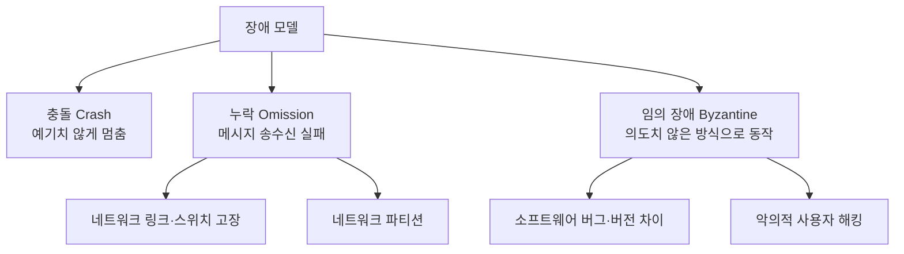
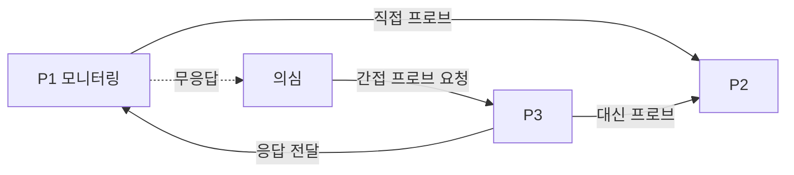
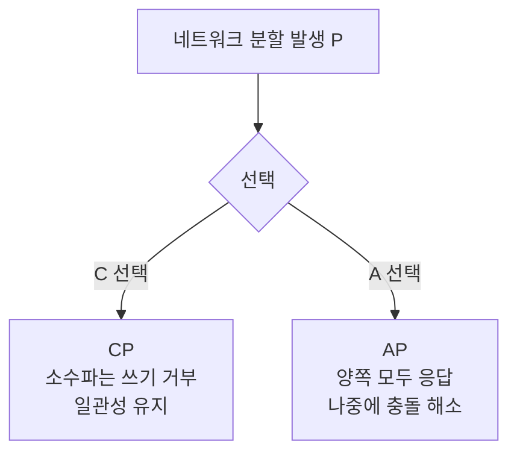

[파티셔닝의 출발점](/blog/backend-engineering/partitioning-fundamentals/)에서 그린 지도는 어느 축을 골라도 한 지점으로 모였다. 나누든 복사하든 도착지는 여러 머신에 걸친 시스템이고, 거기서부터는 성격이 다른 문제가 시작된다.

앞의 편들은 전부 "어떻게 하면 되는가"를 다뤘다. 이 글의 질문은 반대쪽이다 — **아무리 잘 만들어도 안 되는 것이 무엇인가.** 어떤 장애를 상정하고 출발하는지, "모든 노드가 하나의 값에 동의한다"가 왜 시간 안에 끝난다고 보장될 수 없는지, 그리고 네트워크가 끊어졌을 때와 멀쩡할 때 각각 무엇을 내주게 되는지를 다룬다. 한계를 확정하는 데서 멈추지는 않는다 — 그 위에서 장애 감지와 리더 선출과 결함 격리를 어떻게 배치하는지도 함께 다룬다.

여기서 쓰는 약어의 원어와 한 줄 정의는 편1에 모아 두었다. `CAP`·`PACELC`·`FLP`·`SWIM`·`FUSE`가 처음이라면 그쪽이 먼저다.

## 존재조차 몰랐던 컴퓨터가 고장 날 때

> "... a system in which the failure of a computer you didn't even know existed can render your own computer unusable." — Leslie Lamport
>
> 분산 시스템이란, 존재조차 몰랐던 컴퓨터가 고장 나면 당신의 컴퓨터까지 못 쓰게 될 수 있는 시스템이다.

어려움의 출처가 노드 개수가 아니라 **모르는 노드에 대한 의존**이라는 것을 정의문보다 잘 알려 주는 문장이다. 구성요소 자체는 단출하다.

| 구성요소 | 설명 |
|---|---|
| 노드 | 분산 시스템을 구성하는 개별 머신 |
| 네트워크 | 노드 연결 및 통신 |
| 리소스 | 각 노드의 H/W 또는 S/W |

셋 중 앞뒤 둘은 단일 서버에도 있다. 분산 시스템에만 있는 것은 가운데의 네트워크이고, 뒤의 문제는 전부 그 한 줄에서 파생된다.

| 특징 | 내용 |
|---|---|
| 투명성 | 사용자는 분산을 인지하지 못하고 하나의 시스템처럼 사용 |
| 확장성 | 새로운 노드를 쉽게 추가 |
| 내결함성 | 일부 노드 장애에도 계속 동작 |
| 성능 | 병렬 처리 이점 |

네 항목 중 첫 줄이 나머지 셋과 층이 다르다. 확장성·내결함성·성능은 시스템이 갖는 성질이고, 투명성은 **사용자에게 보이는 모습**에 대한 약속이다.

| 종류 | 예시 |
|---|---|
| 클라우드 컴퓨팅 | AWS, GCP, Azure |
| 분산 데이터베이스 | MongoDB Shard Cluster, MySQL Clustering, Oracle RAC |
| 분산 파일 시스템 | GFS, HDFS |
| 분산 웹서비스 | Meta, Netflix |
| 분산 컴퓨팅 | Apache Spark, Hadoop |

다섯 갈래는 무엇을 분산시켰는지로 갈린다 — 연산 자원, 데이터, 파일, 요청 처리, 작업이다. 이 시리즈의 자리는 둘째 줄이지만, 뒤에 나오는 제약은 다섯 전부에 똑같이 걸린다.

## 무엇이 고장 난다고 가정할 것인가

전제는 하나다. **신뢰할 수 있는 시스템은 없다.** 이 전제를 받아들이면 설계의 질문이 "고장이 나지 않게 하려면"에서 "어떤 고장을 견딜 것인가"로 바뀐다.

| # | 장애 유형 | 내용 |
|---|---|---|
| 1 | 네트워크 장애 | 단절(파티션), 지연 |
| 2 | 노드 장애 | 프로세스 중단 또는 무응답 |
| 3 | 데이터 불일치 | 복제본 간 불일치 |
| 4 | 자원 경합 | 병렬 처리·분산 트랜잭션에서 공유 자원 접근 |
| 5 | 타이밍 문제 | 노드 간 시간 불일치, 이벤트 순서 혼동 |

다섯 유형은 순위 목록이 아니라 서로 다른 층의 목록이다. 1·2번은 무언가가 멈추는 문제, 3·5번은 멈추지 않았는데 값이나 순서가 어긋나는 문제, 4번은 여럿이 동시에 움직여 생기는 문제다. 뒤의 셋이 까다로운 것은 **정상 동작과 겉모습이 같기 때문**이다.

장애 유형을 나열하는 것과, 알고리즘을 고르려고 장애를 분류하는 것은 다른 작업이다. 후자를 장애 모델이라고 부르고 분류는 셋이다.

도식에서 하위 갈래가 달린 것은 누락과 임의 장애 둘이고, 충돌에는 없다. 누락의 원인은 링크·스위치 고장이거나 파티션이고, 임의 장애는 버그·버전 차이 같은 오작동이거나 해킹 같은 악의다.

**장애를 해결할 방법을 찾기 전에, 어떤 장애가 발생할 수 있는지를 나타내는 장애 모델을 먼저 정의해야 한다.** 모델이 다르면 필요한 알고리즘이 다르기 때문이다. Crash 내성이면 Raft로 충분하지만, Byzantine 내성이면 PBFT가 필요하다.

## FLP — 완벽한 합의가 불가능한 이유

장애 모델을 정했다면 다음 질문은 그 모델 위에서 노드들이 하나의 값에 동의할 수 있는가다. 여기에는 이론적인 답이 있다.

| 항목 | 내용 |
|---|---|
| 출처 | Fischer, Lynch, Paterson 공저 논문. 저자 이름을 따 FLP |
| 합의 문제 | 여러 프로세스가 새로운 값·결정에 동의해야 하는 상황. 완료 후 모든 정상 프로세스의 최신 값은 같아야 한다 |
| 핵심 주장 | **비동기 시스템에서 한정된 시간 내에 합의가 반드시 이뤄지는 프로토콜은 없다** |
| 이유 | 비동기 시스템에서는 타임아웃을 신뢰할 수 없다. 프로세스가 **죽은 것인지 느린 것인지 구별할 방법이 없다** |
| 결론 | 완벽한 합의는 불가능하지만, **실용적인 수준의 합의는 가능하다** |

핵심 주장 행은 조건절을 떼고 읽으면 뜻이 달라지는 문장이다. 조건은 둘 — **비동기 시스템에서**, 그리고 **한정된 시간 내에 반드시**다. 앞의 조건이 빠지면 "합의는 불가능하다"가 되어 Raft와 Paxos가 돌아가고 있는 현실과 어긋나고, 뒤의 조건이 빠지면 "합의는 이뤄지지 않는다"가 되어 결론 행과 정면으로 충돌한다. 불가능하다고 말하는 대상은 합의 자체가 아니라 **모든 실행에서 반드시 끝난다는 보장**이다.

표에 적히지 않은 전제가 하나 더 있다. 원논문의 제목이 *Impossibility of Distributed Consensus with One Faulty Process*인 데서 드러나듯, FLP가 말하는 것은 **프로세스가 하나라도 죽을 수 있는 경우**의 **결정론적 프로토콜**이다. 아무도 죽지 않는 비동기 시스템이라면 전원의 값이 모일 때까지 기다리기만 해도 합의는 끝난다 — 언제 끝날지 모를 뿐이다. 죽을 수 있는 프로세스가 **하나만** 있어도 그 "끝난다"의 보장이 사라진다는 것이 이 정리의 내용이다. **전제를 이렇게 두 개 더 세는 것은 이 글의 보충이다.**

> 점심 메뉴를 정하는 상황이 이 구조를 그대로 갖고 있다. 메신저로 팀원 전원에게 "국밥 드실래요?"를 물어 **한정된 시간 안에 전원의 YES/NO를 받는 것은 거의 불가능**하다. 회의 중일 수도, 업무에 집중하고 있을 수도, 폰이 충전 중일 수도 있다.
>
> 그리고 답이 안 오는 사람이 "거절"인지 "자리에 없는 것"인지 구별할 방법이 없다. 이것이 정확히 FLP가 말하는 상황이다.
>
> 그래서 Raft·Paxos는 **"반드시 종료한다"를 포기하고 "확률적으로 거의 항상 종료한다"** 로 타협한다. Raft의 랜덤 선거 타임아웃이 바로 그 타협의 구현이다.

마지막 문단이 비유의 요점이다. 실무의 합의 알고리즘은 FLP를 우회하지 않고, **보장 항목 하나를 내려놓는 방식으로 타협한다.**

## 죽은 것인가 느린 것인가 — 장애 감지

FLP가 지목한 구별 불가능성에 장애 감지기가 매초 부딪힌다. 응답이 없는 노드를 죽었다고 판정하면 오탐 시 멀쩡한 노드를 잘라내고, 판정을 미루면 진짜 장애의 다운타임이 늘어난다.

| 방식 | 원리 | 강점 | 약점 |
|---|---|---|---|
| **Heartbeat / Ping** | 모니터링 노드가 ping을 보내고 일정 시간 내 응답 확인. 또는 피어에게 활성 상태를 알리는 하트비트 전송 | 단순 | 모니터링 노드가 병목·단일 장애점. O(N) 부하 |
| **SWIM (하트비트 아웃소싱)** | **직접 프로빙 + 간접 프로빙**. 직접 응답이 없으면 다른 노드에게 대신 확인을 요청 | 네트워크 일시 문제로 인한 **오탐을 크게 줄임** | 구현 복잡도 |
| **Gossip** | 각 노드가 자기 상태를 갱신해 다른 노드에 전파("소문"). 장애 노드는 시간이 지나도 갱신 기록이 생기지 않음 | 중앙 조정자 불필요. 대규모에서 확장성 우수 | 전파 지연. 감지까지 시간이 걸림 |

강점과 약점 열을 나란히 읽으면 셋이 무엇을 사고 무엇을 파는지 드러난다. Heartbeat는 단순함을 사고 중앙 노드의 병목을 팔고, SWIM은 오탐을 줄이고 구현 복잡도를 지며, Gossip은 확장성을 얻고 감지 지연을 받아들인다. **무엇이 낫다는 순서가 아니라 무엇을 내줄 수 있는지가 다른 목록이다.**

SWIM이 오탐을 줄이는 장치가 간접 프로빙이다. 관측자를 하나 더 세워, "응답이 없다"는 사실이 대상 노드의 문제인지 관측 경로의 문제인지 가른다.

판정 주체는 여전히 P1이지만 관측은 둘이 되고, P1→P2 경로만 끊긴 경우와 P2가 죽은 경우가 여기서 갈라진다. 점선의 "의심"이 그 중간 상태의 이름이다.

### 장애 전파 — FUSE

감지 다음은 전파다. FUSE는 네트워크 파티션이 발생해도 낮은 비용으로 신뢰성 있게 장애를 전파한다. 모든 장애는 발생 노드에서 다른 모든 노드로 전파되며, **단일 노드 장애가 그룹 장애로 확장된다.** 이 "전부 아니면 전무" 성질이 FUSE의 핵심 보장이다 — 일부만 장애를 아는 애매한 상태를 없앤다.

단일 노드 장애를 그룹 전체로 번지게 만드는 것은 언뜻 손해로 읽히는데, 대신 사는 것이 **상태의 명확성**이다. 절반은 알고 절반은 모르는 상태에서는 어느 쪽이 옳은지 판정할 근거가 없다.

## 리더를 다시 뽑는 세 가지 방식

리더가 죽었다는 판정이 서면 다음 리더를 정해야 한다. 알고리즘 셋은 "누구를 뽑을 것인가"를 다르게 정한다.

| 알고리즘 | 원리 | 문제 |
|---|---|---|
| **불리(Bully, 깡패)** | 순위 기반. **가장 높은 순위 노드가 리더**가 된다 | 최고 순위 노드가 불안정하면 선출이 반복(선출 폭풍) |
| **다음 서열 승계** | 불리 개선. 장애를 감지한 노드가 **그다음 높은 순위**를 리더로 선출 | 메시지 수 감소. 여전히 순위 고정의 경직성 |
| **초대(Invitation)** | 자신부터 시작해 **점진적으로 그룹을 merge**하며 리더 선출 | 분할 후 병합 상황에 강함. 수렴 시간이 길 수 있음 |

앞의 둘과 셋째가 성격이 갈린다. 불리와 다음 서열 승계는 순위가 미리 정해져 있다고 보고 그것을 읽는 방식만 다르게 하는데, 초대는 순위를 전제하지 않고 그룹을 합쳐 가며 결정한다. 분할 뒤 다시 붙는 상황에서 셋째가 유리한 이유가 여기 있다.

도식은 순위 기반 선출의 진행이고, 다섯 단계 전체가 첫 칸의 "장애 인지"에 매달려 있다. 앞 절의 감지가 오탐이면 나머지 넷은 멀쩡한 리더를 끌어내리는 절차가 된다.

## CAP — 셋 중 둘을 고르는 문제가 아니다

**완벽한 분산 시스템은 존재할 수 없다.** 시스템 설계 시 트레이드오프를 고려해 상황에 맞게 선택해야 한다. CAP는 그 선택의 상대가 무엇인지를 세 글자로 못 박는다.

| 속성 | 의미 |
|---|---|
| **C**onsistency | 모든 노드가 같은 시점에 같은 데이터를 본다(선형화 가능성) |
| **A**vailability | 모든 요청이 (최신이 아닐지라도) 응답을 받는다 |
| **P**artition tolerance | 네트워크가 분할되어도 시스템이 계속 동작한다 |

세 정의를 나란히 놓으면 P만 결이 다르다. C와 A는 요청에 무엇을 보장하는가의 서술이고, P는 네트워크가 어떤 상태일 때의 이야기인가의 서술이다. 이 층 차이가 다음 도식의 모양을 결정한다.

도식에서 분기점은 하나뿐이고, P는 그 분기점 앞에 놓인 조건이지 선택지가 아니다. 갈림길에 놓인 것은 C와 A 둘이다.

| 분류 | 동작 | 대표 시스템 |
|---|---|---|
| **CP** | 분할 시 정족수 미달 쪽은 응답 거부 | MongoDB, HBase, ZooKeeper, etcd |
| **AP** | 분할 시에도 양쪽 모두 읽기·쓰기 수용, 이후 수렴 | Cassandra, DynamoDB, Riak |
| CA | 분할이 없다는 가정. **분산 시스템에서는 실현 불가** | 단일 노드 RDB |

표는 세 줄이지만 고를 수 있는 것은 위의 두 줄이다 — 마지막 줄에는 "실현 불가"가 적혀 있다.

> 여기서 바로잡아야 할 흔한 오해가 하나 있다. CAP는 "셋 중 둘을 고르라"가 아니다.
>
> 네트워크 분할(P)은 **선택 사항이 아니라 반드시 발생하는 사실**이다. 따라서 실제 선택지는 "분할이 일어났을 때 C를 지킬 것인가 A를 지킬 것인가" 둘 중 하나뿐이다.
>
> "우리는 CA 시스템입니다"라고 말하는 순간, 그것은 분산 시스템이 아니거나 분할을 무시하고 있다는 뜻이다.

## PACELC — 분할이 없는 동안의 선택

CAP는 **분할이 일어났을 때**만 설명한다. 정상 상태에서의 선택은 설명하지 못한다. PACELC가 이 공백을 메운다.

> **if (P)** artition → **A**vailability or **C**onsistency
>
> **E**lse → **L**atency or **C**onsistency

앞 절이 답한 것은 첫 줄뿐이다. 둘째 줄이 새로 붙는 질문이고, 여기서 갈리는 상대는 가용성이 아니라 지연이다. 두 줄을 곱하면 네 조합이 나온다.

| 분류 | 의미 | 예시 |
|---|---|---|
| **PA/EL** | 분할 시 가용성, 정상 시 저지연 우선 | Cassandra, DynamoDB (기본 설정) |
| **PC/EC** | 분할 시·정상 시 모두 일관성 우선 | VoltDB, 강한 일관성 모드의 Spanner |
| **PA/EC** | 분할 시 가용성, 정상 시 일관성 | MongoDB (설정에 따라) |
| **PC/EL** | 분할 시 일관성, 정상 시 저지연 | Yahoo PNUTS |

예시 칸의 "(기본 설정)"·"(설정에 따라)"·"강한 일관성 모드의"라는 단서가 이 표의 성격을 말해 준다. 같은 제품도 구성에 따라 분류가 움직이므로 PACELC는 **구성에 붙는 라벨**에 가깝다. 앞의 CP 표에 올랐던 MongoDB가 여기서는 PA 쪽에 적힌 것이 그 사례다 — 두 표가 서로 다른 제품을 말하는 것이 아니라, 셋째 행에 붙은 「(설정에 따라)」가 바로 그 이동을 가리킨다. 분할 시 정족수 미달 쪽의 쓰기를 거부하게 두면 앞 표의 CP이고, 느슨하게 두면 이 표의 PA다.

PACELC가 중요한 이유는 **동기 복제를 켜는 순간 정상 상태에서도 지연을 지불한다**는 사실을 명시하기 때문이다. 분할은 드물지만, 지연은 매 요청마다 발생한다.

## 강한 일관성과 결과적 일관성

CAP와 PACELC가 고르라고 한 그 "C"를 실제 설정으로 옮기면 두 갈래가 된다.

| 구분 | 강한 일관성 (Strong) | 결과적 일관성 (Eventual) |
|---|---|---|
| 보장 | 쓰기 완료 후 모든 읽기가 최신값 | 더 이상 쓰기가 없으면 **언젠가는** 모든 복제본이 수렴 |
| 비용 | 매 쓰기마다 합의·동기 복제 지연 | 쓰기 지연 최소 |
| 적합 | 계좌 잔액, 재고 차감, 결제 | 조회수, 좋아요 수, 추천 목록, 타임라인 |
| 중간 지대 | Read-Your-Writes, Monotonic Read, Consistent Prefix 등 **세션 일관성** — 전역 강일관성 없이 사용자 체감만 지킨다 | |

적합 행의 두 열을 가르는 기준은 중요도가 아니라 **틀렸을 때 되돌릴 수 있는가**로 읽힌다. 재고를 두 번 차감한 것은 사후에 맞추기 어렵고, 조회수가 잠깐 어긋난 것은 다음 수렴에서 사라진다.

마지막 행은 앞의 둘 어느 쪽으로도 가지 않는 선택지다. 세션 일관성은 보장 범위를 한 사용자로 좁혀 전역 강일관성의 비용과 결과적 일관성의 체감 사이를 메운다.

## 데이터베이스를 고르는 세 관점

CAP는 저장소 선택의 한 축일 뿐이다. 실제 선택은 **문제 해결(CAP)·비용·유지보수** 세 관점을 함께 놓고 이뤄진다. 앞의 하나만 보면 이론적으로는 옳지만 운영할 수 없는 결론이 나오고, 뒤의 둘만 보면 익숙한 것을 계속 쓰게 된다.

관계형·Column·Key-Value·Document·Graph, 그리고 벡터·시계열까지 여섯 갈래가 각각 어느 영역에 자리 잡았는지는 [관계형 데이터베이스와 NoSQL — 무엇을 고르고, 무엇을 기준으로 고르는가](/blog/backend-engineering/rdbms-and-nosql-fundamentals/)의 표가 정리해 두었다.

그 표를 이 글의 앞부분과 겹쳐 보면 대표 제품 칸에 적힌 열여섯 이름 가운데 **MongoDB·HBase·Cassandra·DynamoDB** 넷이 CP·AP 표와 PACELC 표에도 그대로 나온다. 저장소를 고르는 일이 곧 분할이 났을 때의 동작을 고르는 일이기도 하다는 뜻이다.

## 무너지지 않게 만드는 네 가지 원칙

불가능성의 목록을 받아들인 뒤에도 할 수 있는 일이 남는다. 장애를 없애는 대신 영향 범위를 설계하는 일이다.

| # | 원칙 | 내용 |
|---|---|---|
| 1 | **복제 / 중복** | 중요한 구성요소·데이터를 여러 노드에 복제. 하나가 죽으면 다른 것이 역할 대신 |
| 2 | **점진적 성능 저하 (Graceful Degradation)** | 제한된 기능으로라도 동작 허용. 일부 노드 장애에도 시스템 지속 |
| 3 | **결함 격리 (Fault Isolation)** | 장애 확산 방지 — **화재 시 방화문의 역할**. 단일 지점 장애 제거 |
| 4 | **결함 감지** | 모니터링과 즉각 대응으로 빠른 복구 |

네 원칙은 시간 순서로 읽으면 짝이 맞는다. 1·3은 장애 전에 구조로 만들어 두는 것이고, 2·4는 장애 뒤에 작동한다. 3번의 방화문 비유는 앞 절의 FUSE와 어긋나 보이지만 대상이 다르다 — FUSE가 퍼뜨리는 것은 **장애가 났다는 사실**이고, 결함 격리가 막는 것은 **장애의 영향**이다. 이 구분은 이 글의 정리다.

## 정리

이 글이 답한 것을 네 줄로 압축하면 이렇다.

| 질문 | 답 |
|---|---|
| 무엇을 먼저 정해야 하는가 | **장애 모델이다.** 충돌·누락·임의 장애 중 어디까지 상정하는지에 따라 알고리즘이 달라진다 — Crash 내성이면 Raft, Byzantine 내성이면 PBFT다 |
| 완벽한 합의는 왜 안 되는가 | 비동기 시스템에서는 **죽은 것인지 느린 것인지 구별할 방법이 없어** 타임아웃을 신뢰할 수 없다. 불가능한 것은 합의 자체가 아니라 한정된 시간 내에 반드시 끝난다는 보장이다 |
| CAP는 무엇을 고르라는 말인가 | 셋 중 둘이 아니다. 분할(P)은 반드시 발생하는 사실이므로 **분할이 났을 때 C를 지킬지 A를 지킬지** 하나만 고르게 된다 |
| CAP로 부족한 자리는 | 정상 상태다. PACELC가 그 공백을 메우고, 거기서 갈리는 상대는 가용성이 아니라 **지연**이다 |

네 답을 관통하는 것은 하나다. **고르는 것은 좋은 쪽과 나쁜 쪽이 아니라 무엇을 내줄지다.** 감지 방식 셋도, 리더 선출 셋도, 일관성의 두 갈래도 우열이 아니라 교환 조건의 목록이었다.

이 제약들을 전부 인정한 위에서, 여러 노드가 그럼에도 하나의 결정에 이르려면 무엇을 해야 하는가. 다음 편이 그 자리를 맡아 분산 트랜잭션과 합의 알고리즘을 다룬다 — [분산 트랜잭션과 합의 — 여러 노드가 하나의 결정에 이르는 법](/blog/backend-engineering/distributed-transactions-and-consensus/).
