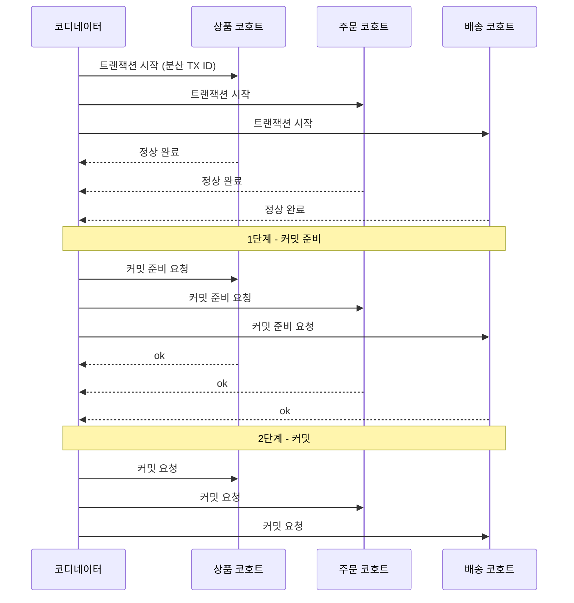
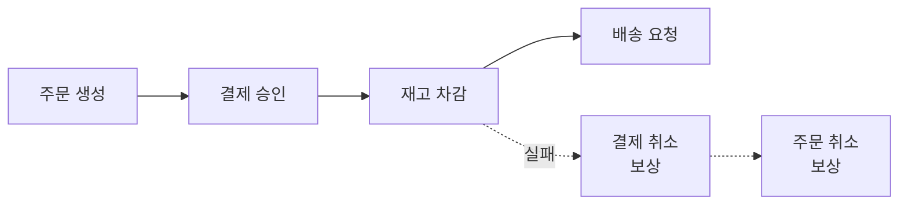
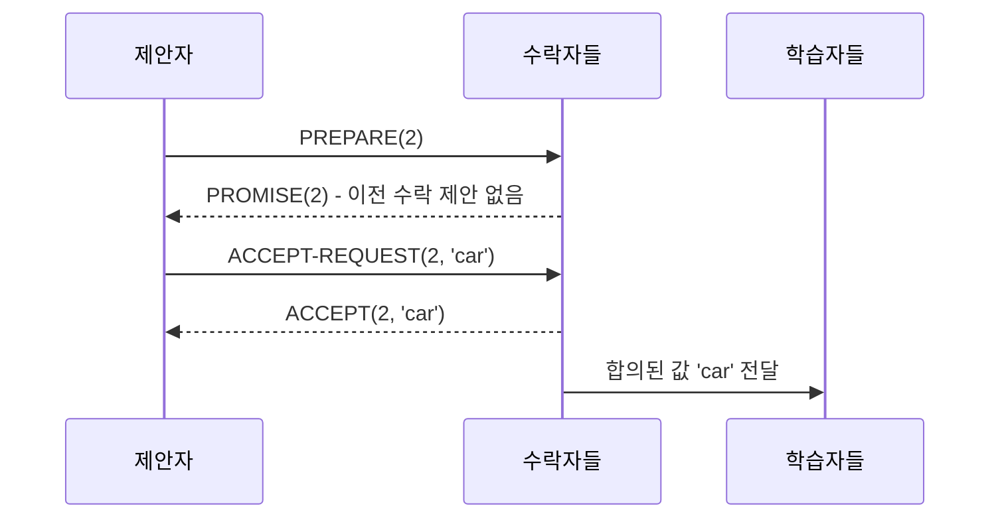
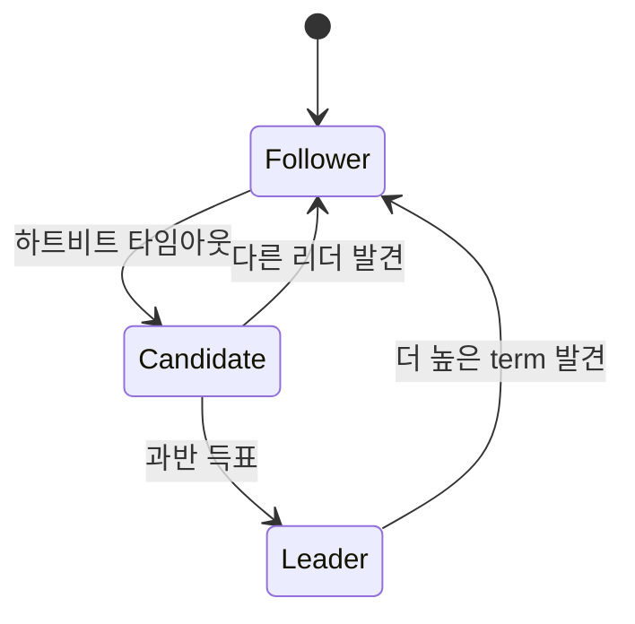

한 대의 데이터베이스에서 `COMMIT`은 결정이라기보다 선언에 가깝다. 되돌릴 근거도, 다시 적용할 근거도, 남이 끼어들지 못하게 막는 장치도 전부 그 한 프로세스 안에 있다. [트랜잭션과 동시성 제어](/blog/backend-engineering/transactions-and-concurrency-control/)가 다루는 세계가 그쪽이다 — Undo와 Redo가 원자성과 영속성을 각각 받치고, 락과 MVCC가 서로 간섭하지 않게 막는다. 무엇을 커밋할지 물어볼 상대가 없으니 협상도 없다.

[파티셔닝의 출발점](/blog/backend-engineering/partitioning-fundamentals/)에서 시작한 축을 따라 데이터를 나누고 복사하고 나면 이 전제가 무너진다. 하나의 업무가 여러 노드나 파티션에 걸치면 **어떤 노드에서는 성공하고 어떤 노드에서는 실패**할 수 있다. 원자성을 그대로 유지하려면 이제 **모든 노드가 트랜잭션의 결과에 동의**해야 한다. 커밋은 선언에서 합의로 성격이 바뀐다.

이 글은 그 합의를 다룬다. 2PC가 무엇을 보장하고 어디서 무너지는지, 3PC·Calvin·Spanner와 Saga가 그 대가를 어디로 옮기는지, 한 층 아래에서 하나의 값을 확정하는 Paxos·Raft·PBFT가 각각 어떤 장애를 견디도록 설계됐는지, 그리고 같은 합의 위에 서면서도 데이터베이스와 갈라지는 분산 원장이 무엇인지다.

## 2PC — 커밋을 두 단계로 쪼갠다

2단계 커밋은 이름 그대로 커밋을 둘로 나눈다. 모든 참가자에게 "커밋할 수 있는가"를 묻고, 전원이 그렇다고 답한 뒤에야 "커밋하라"를 보낸다. 묻는 쪽이 코디네이터, 답하는 쪽이 코호트다.

### 코디네이터가 지휘하는 두 단계

도식에서 눈여겨볼 자리는 코호트가 `ok`를 보낸 직후다. 그 `ok`는 "커밋했다"가 아니라 **"커밋하겠다고 약속했다"** 는 뜻이다. 약속한 이상 코호트는 물러설 수 없고, 2단계 메시지가 올 때까지 자기 상태를 붙들고 있어야 한다.

### 코디네이터는 어느 시점에 죽었는가

2PC의 성질은 코디네이터가 언제 사라지느냐로 완전히 갈린다.

| 장애 시점 | 코호트의 상태 | 결과 |
|---|---|---|
| **1단계 전** (준비 요청 전) | 아직 약속하지 않음 | 각 코호트가 스스로 **Abort** 가능. 안전 |
| **1단계 후** (준비 요청에 Yes 응답 후) | **Abort 불가능** — 이미 커밋을 약속함 | 코디네이터의 요청을 받을 때까지 **무한 대기(블로킹)**. 락을 쥔 채로 |

두 행의 차이를 만드는 것은 시간이 아니라 약속이다. 준비 요청 전이라면 코호트에게 의무가 없어 혼자 판단해도 안전하지만, `ok`를 보낸 뒤로는 커밋도 중단도 혼자 고를 수 없다. 다른 코호트가 `no`를 보냈을 수도 있고 그것을 아는 것은 코디네이터뿐이다. 이 상태를 in-doubt라 부른다.

단일 DB에서 후행 트랜잭션이 선행을 기다리는 것은 오류가 아니라 정상 동작이고, 앞이 끝나면 반드시 풀린다. in-doubt 블로킹은 풀어 줄 주체가 이미 죽어 있다.

### 2PC가 매 커밋마다 내는 비용

| 2PC의 비용 | 내용 |
|---|---|
| **블로킹 원자적 커밋** | In-doubt 상태의 코호트는 락을 쥐고 대기. 다른 트랜잭션까지 연쇄 대기 |
| **디스크 로그 선기록** | 코디네이터는 결정을 디스크에 먼저 기록해야 함 → **성능 저하의 직접 원인** |
| **필수 대비책** | 백업 코디네이터 또는 복구 알고리즘이 **반드시** 필요 |
| 지원 DBMS | MySQL, PostgreSQL, MongoDB. 단순하고 메시지 복잡도가 낮다는 장점은 있음 |

네 행 중 앞의 셋은 대가이고 마지막 한 행은 그럼에도 2PC가 살아남은 이유다. 블로킹은 장애가 났을 때만 아프지만, 디스크 로그 선기록은 **장애가 없어도 매번** 지불한다. 결정을 잃어버리면 코호트를 영원히 매달아 두게 되므로 코디네이터는 응답하기 전에 디스크에 먼저 적어야 하고, 그 쓰기가 커밋 경로 위에 얹힌다. 셋째 행이 "반드시"인 이유도 같다 — 대비책 없이 2PC를 켜면 단일 장애점이 커밋 경로 한복판에 선다.

## 2PC 다음의 세 갈래

2PC의 블로킹은 결정 권한이 코디네이터 한 곳에 몰려 있어 약속한 코호트가 혼자 판단할 수 없다는 데서 온다. 아래 세 알고리즘은 그 구조의 서로 다른 층을 건드리고, 겨냥하는 것도 블로킹 하나가 아니다.

| 알고리즘 | 핵심 | 2PC 대비 개선점 |
|---|---|---|
| **3PC** | 제안 → 준비(코호트 상태 공유) → 커밋 | 코디네이터 장애에 견고. **코호트가 직접 커밋/중단을 결정 가능** → 블로킹 완화 |
| **Calvin** | 시퀀서가 모든 트랜잭션의 **실행 순서를 미리 결정**. 스케줄러가 수행 감독 | 결정론적 실행이라 합의를 순서에만 쓰고 커밋에는 안 씀. 시퀀서-스케줄러-워커-스토리지를 같은 노드에 배치 |
| **Spanner** | **TrueTime API**로 트랜잭션 순서를 정확히 결정. Paxos로 리더 선출·데이터 합의. 2PC로 일관성 있는 커밋 | GPS·원자시계로 시계 불확실성을 경계값으로 한정 → **전역 강일관성**을 실현 |

세 행이 손대는 층이 다르다. 3PC는 단계를 늘려 코호트끼리 상태를 공유하게 하고, Calvin은 커밋에서 합의를 빼내 순서 결정으로 옮기며, Spanner는 2PC 위에 시계를 얹는다. 3PC의 개선점이 블로킹 **완화**이지 제거가 아니라는 표기도 그대로 읽을 값어치가 있다.

> Spanner가 특별한 이유는 **하드웨어로 CAP의 제약을 우회하지 않고, 불확실성의 상한을 알아냈다**는 점이다.
>
> TrueTime은 "지금 시각"이 아니라 "지금 시각은 `[earliest, latest]` 구간 안에 있다"를 반환한다. 커밋 시 그 구간이 지날 때까지 의도적으로 기다리면(commit-wait), 전역 순서가 보장된다.
>
> 대가는 매 커밋마다 수 밀리초의 대기다. 즉 Spanner도 PACELC의 EC(정상 시 일관성 우선, 지연 지불)를 선택한 것일 뿐이다.

## Saga — 원자적 커밋 자체를 포기한다

MSA에서는 서비스마다 DB가 분리되어 2PC를 걸 대상 자체가 없다. Saga는 **긴 트랜잭션을 로컬 트랜잭션의 연쇄 + 보상 트랜잭션**으로 대체한다. 각 단계는 자기 DB에서 곧바로 커밋하고, 실패하면 앞 단계를 되돌리는 별도 트랜잭션을 실행한다.

실선과 점선의 방향이 반대인 것이 이 그림의 전부다. 정상 흐름은 앞으로 가고 보상은 뒤로 되짚는데, 그 경로가 롤백이 아니라 **직접 작성한 취소 로직**이라는 것이 2PC와의 차이다.

### 누가 다음 단계를 부르는가

| 구분 | Choreography (안무) | Orchestration (오케스트레이션) |
|---|---|---|
| 제어 | 각 서비스가 이벤트를 듣고 다음 동작 | 중앙 오케스트레이터가 순서를 지시 |
| 장점 | 결합도 낮음, 단일 장애점 없음 | 흐름이 한곳에 보임, 디버깅·보상 관리 용이 |
| 단점 | 전체 흐름 파악 어려움, 순환 의존 위험 | 오케스트레이터가 단일 장애점이자 복잡도 집중 |
| 적합 | 단계 3~4개 이하 | 단계가 많고 보상 로직이 복잡할 때 |

두 방식의 대립은 앞 절에서 본 코디네이터 문제의 재판이다. 안무는 지휘자를 없애 단일 장애점을 지우는 대신 전체 흐름이 어디에도 적혀 있지 않게 되고, 오케스트레이션은 흐름을 한곳에 모으는 대가로 그 한곳을 다시 단일 장애점으로 만든다. 마지막 행이 실무 기준이다.

### 2PC와 Saga는 무엇을 맞바꾸는가

| 2PC vs Saga | 2PC | Saga |
|---|---|---|
| 격리성 | 보장 | **보장 안 됨** — 중간 상태가 외부에 보인다 |
| 원자성 | 보장 | 보상으로 "결과적 원자성"만 |
| 블로킹 | 있음 | 없음 |
| 실패 처리 | 롤백 | **보상 트랜잭션**(취소 로직을 직접 작성) |
| 적합 | 단일 조직, 짧은 트랜잭션 | MSA, 장기 실행 비즈니스 프로세스 |

표에서 가장 비싼 행은 첫째 행이다. 격리성이 없다는 말은 결제는 승인됐고 재고 차감은 아직인 상태를 다른 트랜잭션이 **정상적으로 조회한다**는 뜻이다. 2PC의 블로킹은 그 중간 상태를 감추려고 락을 붙들던 비용이었으므로, Saga가 얻은 "블로킹 없음"과 잃은 격리성은 같은 거래의 앞뒤다.

Saga의 실전 함정은 **보상 불가능한 작업**이다. 메일 발송, 외부 결제 승인은 되돌릴 수 없다. 그래서 되돌릴 수 없는 단계는 **Saga의 마지막에 배치**(pivot transaction 이후)하는 것이 설계 원칙이다.

## 합의 알고리즘 — 하나의 값을 확정한다

지금까지는 "이 트랜잭션을 커밋할 것인가"에 관한 합의였다. 한 층 아래에 더 일반적인 문제가 있다 — 여러 노드가 **하나의 값**에 동의하는 문제다. 리더가 누구인지, 로그의 5번 칸에 무엇이 들어가는지가 전부 여기로 환원된다. 아래 세 알고리즘은 같은 문제를 서로 다른 장애 가정 아래에서 푼다.

### Paxos

그리스 섬 팍소스의 입법·투표 방식에서 유래했다. 여러 노드가 하나의 값에 합의하기 위해 사용하며, **노드 간 통신이 불안정하거나 일부 노드가 실패하는 환경에서도 안전하게** 동작하도록 설계되었다.

| 역할 | 책임 |
|---|---|
| 제안자(Proposer) | 합의할 값을 제안 |
| 수락자(Acceptor) | 수락하거나 거부 |
| 학습자(Learner) | 수락된 결과를 각 복제 노드에 저장 |

세 역할은 물리적 노드 구분이 아니다. 한 노드가 동시에 여러 역할을 수행할 수 있다.

| 단계 | 동작 |
|---|---|
| **준비(Prepare)** | 제안자가 고유 제안 번호를 골라 수락자에게 준비 요청. 수락자는 이전에 수락한 제안 번호·값을 응답하고, 받은 번호가 더 크면 그것을 기억하고 작은 번호는 무시 |
| **제안(Accept)** | 제안자는 응답 중 **가장 큰 제안 번호의 값**을 선택(응답이 없으면 자기 값). 모든 수락자에게 번호+값 전송. 수락자는 기억한 번호보다 작지 않으면 수락 |

핵심은 "**이미 수락된 값이 있으면 제안자가 자기 값을 버리고 그 값을 이어받는다**"는 규칙이다. 이 한 줄이 서로 다른 두 값이 동시에 합의되는 것을 막는다. 도식의 `PROMISE`에 "이전 수락 제안 없음"이 붙어 있는 이유도 여기에 있다 — 이전 값이 있었다면 제안자가 보낸 `'car'`는 그 값으로 바뀌었을 것이다.

이 규칙이 작동하려면 제안자가 **과반의 수락자**에게 묻고 받아야 한다. 한 대에게만 묻고 받는다면 두 제안자가 서로 다른 수락자에게서 각각 "이전 값 없음"을 듣고 서로 다른 값을 확정할 수 있다. 임의의 두 과반은 반드시 겹치므로, 앞서 수락된 값이 있었다면 새 제안자의 응답 집합에 그것이 반드시 들어온다. 뒤에 나오는 Raft가 과반으로 얻는 것과 같은 성질이다. **이 보충은 이 글의 정리다.**

### Raft

**Paxos보다 이해와 구현이 쉬운** 알고리즘이다.

| 노드 상태 | 역할 |
|---|---|
| 리더(Leader) | 클라이언트 요청을 처리. **클러스터에 대한 명령은 오직 리더만 처리** |
| 팔로워(Follower) | 로그 저장 및 리더 명령 처리 |
| 후보자(Candidate) | 리더를 희망하는 노드 |

Paxos의 세 역할이 한 노드에 겹칠 수 있었던 것과 달리, 여기서 셋은 한 노드가 시점마다 하나씩 갖는 **상태**다. 그래서 도식도 상태 전이로 그려진다.

| 주요 개념 | 동작 |
|---|---|
| **리더 선출** | 후보자가 모든 참가자에게 Request Vote를 보내며 **최종 로그 ID를 전달**. 과반 득표 시 리더 선출 |
| **주기적 하트비트** | 리더가 팔로워에게 주기적 하트비트 전송. 설정 시간 내 안 오면 장애로 판단 |
| **로그 복제** | 리더가 클라이언트 명령을 로그에 추가 → 팔로워에게 **AppendEntries** 전송 → 팔로워가 리더 로그를 복제해 일관 상태 유지 |

세 개념은 도식의 화살표와 짝을 이룬다. 하트비트가 끊기면 팔로워가 후보자가 되고, 과반 득표가 리더를 만들며, 그 뒤는 로그 복제가 리더의 일상이다.

> Raft가 스플릿 브레인을 막는 방식은 두 조건으로 끝난다.
>
> 리더는 **과반의 표**를 받아야 하고, 표는 term당 1회만 준다. 과반은 정의상 두 집합이 동시에 존재할 수 없으므로, 리더는 **같은 term에서** 항상 최대 1명이다.
>
> 그리고 Request Vote에 **최종 로그 ID를 실어 보내는 이유**는, 자기보다 로그가 뒤처진 후보에게는 표를 주지 않기 위해서다. 이로써 커밋된 로그를 가진 노드만 리더가 될 수 있다.

### PBFT — 거짓말하는 노드까지 견딘다

Paxos와 Raft는 노드가 죽거나 응답하지 않는 상황만 가정한다. 노드가 **틀린 값을 적극적으로 퍼뜨리는** 경우는 다루지 않는다. 그쪽이 비잔틴 장군 문제이고, PBFT가 그 가정 위에서 동작한다.

| 항목 | 내용 |
|---|---|
| 내성 한계 | 전체 노드 n개에서 **(n-1)/3까지** 악의적 노드 허용. f개를 허용하려면 **n = 3f + 1** |
| 구성 | 리더 노드 + 팔로워 노드 |

두 표기는 같은 식을 방향만 바꿔 쓴 것이다. `f = (n-1)/3`을 n에 대해 풀면 `n = 3f + 1`이 된다. 숫자를 넣어 확인하면 f = 1일 때 n = 4이고, 역으로 n = 4를 `(n-1)/3`에 넣으면 f = 1이 나온다. 거짓말하는 노드 하나를 견디는 데 **전체 4대**가 든다는 뜻이다.

| 단계 | 동작 |
|---|---|
| 요청 | 클라이언트가 리더 노드에 요청 |
| 사전준비(Pre-prepare) | 리더가 요청 내용 + digest 포함 메시지를 팔로워에게 전송. 팔로워는 메시지와 digest를 검증해 동일하면 수락 |
| 준비(Prepare) | 팔로워가 모든 노드에게 digest 포함 prepare 메시지 전달 |
| 커밋(Commit) | **최소 2f개**의 동일 prepare 메시지를 받으면 커밋 메시지를 전파. **2f+1개 이상** commit 메시지를 받으면 커밋 수행 |
| 합의 | 커밋 결과를 클라이언트에 전송. **f+1개 이상** 노드에서 동일 응답을 받으면 결과를 신뢰 |

f = 1을 대입하면 각 문턱이 prepare 2개, commit 3개, 클라이언트 응답 2개가 된다. 마지막 문턱이 `f+1`인 이유는 f개까지는 거짓 응답일 수 있으므로, f+1개가 같아야 그중 최소 하나가 정직한 노드의 답이기 때문이다. 준비 단계에서 팔로워가 리더가 아니라 **모든 노드에게** 메시지를 보내는 것도 같은 가정에서 나온다 — 리더 자체가 거짓말할 수 있으므로 팔로워끼리 직접 대조해야 한다.

| 비교 | Raft / Paxos | PBFT |
|---|---|---|
| 장애 모델 | Crash / Omission | **Byzantine** (거짓말하는 노드 포함) |
| 노드 요구량 | 2f+1 (과반) | **3f+1** |
| 메시지 복잡도 | O(N) | **O(N²)** |
| 적용 | 사내 클러스터(etcd, Consul, Kafka Raft) | 신뢰할 수 없는 참가자(허가형 블록체인) |

네 행이 위에서 아래로 인과로 이어진다. 장애 모델에 거짓말을 넣는 순간 노드 요구량이 2f+1에서 3f+1로 오르고(f = 1이면 3대에서 4대로), 팔로워끼리 전부 대조해야 하므로 메시지가 O(N)에서 O(N²)로 뛴다. 마지막 행의 적용 구분은 그 비용을 누가 낼 만한가에 대한 답이다.

## 분산 원장은 데이터베이스인가

| 개념 | 정의 |
|---|---|
| Database | 공유 목적으로 데이터 관리 |
| Distributed Database | 데이터가 **분산되어 저장** |
| Distributed Ledger | 참여자들이 **탈중앙화 합의를 통해 관리** |

세 정의가 한 단계씩 조건을 더한다. 분산 데이터베이스와 분산 원장을 가르는 것은 데이터가 흩어져 있느냐가 아니라 **누가 관리하느냐**다.

분산 원장의 특징은 다음과 같다. P2P 분산 아키텍처와 동일하고, 비잔틴 장군 문제가 존재하며(악의적 노드), 모든 노드가 동일 데이터를 유지하고, 하나의 기관이 아닌 다수 이해관계자가 참여하며, **합의 프로세스가 반드시 필요**하다. 앞 절에서 PBFT가 허가형 블록체인에 배치된 이유가 두 번째 항목에 있다.

### 블록체인을 쓰지 않아도 되는 경우

Hyperledger Besu의 판단 차트는 네 가지 조건을 든다.

| # | 조건 |
|---|---|
| 1 | 기존 데이터베이스로 문제 해결이 가능한 경우 |
| 2 | 데이터베이스에 **공유 쓰기**가 필요 없는 경우(중앙화 서버에서 저장) |
| 3 | 참여자(서버)를 모두 신뢰할 수 있고, DB가 손상·해킹될 가능성이 낮은 경우 |
| 4 | 제3자(중개자)의 개입이 필수적이거나 당사자 간 해결이 어려운 경우 |

기술 선택 판단에서 가장 실용적인 체크리스트다. **"신뢰할 수 없는 다수의 참여자가 같은 데이터에 쓰기를 해야 하는가"** — 이 질문에 Yes가 아니면 분산 원장은 과잉이다.

뒤의 세 조건이 각각 그 질문의 한 조각을 부정한다. 2번은 "쓰기"를, 3번은 "신뢰할 수 없는"을, 4번은 "다수가 직접"을 지운다. 하나라도 지워지면 남는 것은 비용뿐이다 — 허가형 원장을 쓴다면 앞에서 본 3f+1대의 노드와 O(N²)의 메시지가 그것이다.

## 정리

이 글이 다룬 선택들을 질문 단위로 다시 배열했다.

| 질문 | 답 |
|---|---|
| 여러 노드의 커밋은 왜 어려운가 | 일부만 성공할 수 있어서다. 원자성을 지키려면 결과에 **동의**가 필요하고, 커밋은 선언에서 협상으로 바뀐다 |
| 2PC는 정확히 무엇을 잃는가 | `ok`를 보낸 코호트는 물러설 수 없다. 코디네이터가 그 뒤에 죽으면 **락을 쥔 채 무한 대기**한다. 장애가 없어도 디스크 로그 선기록은 매번 낸다 |
| Saga는 무엇을 맞바꾸는가 | 블로킹을 없애는 대신 **격리성**을 판다. 중간 상태가 외부에 보이고, 롤백 대신 취소 로직을 직접 쓴다 |
| 합의 알고리즘의 차이는 어디서 오는가 | 장애 모델이다. 죽는 노드만 가정하면 2f+1과 O(N)이지만, 거짓말하는 노드를 넣으면 **3f+1과 O(N²)** 가 된다 |
| 분산 원장이 필요한 경우는 | 신뢰할 수 없는 다수가 같은 데이터에 써야 할 때뿐이다. 조건 하나라도 빠지면 비용만 남는다 |

다섯 행이 같은 모양이다. 무엇을 보장할지 정하면 그 값을 대기 시간·메시지 수·노드 대수 중 어딘가로 내야 한다. 청구서를 없앨 수는 없고 받을 자리를 고를 수 있을 뿐이다.

여기까지가 이 시리즈가 다룬 선택지 전부다. 마지막 편 [데이터베이스 확장 Q&A](/blog/backend-engineering/database-scaling-qna/)는 이 선택지들을 트레이드오프와 장애 시나리오에 놓고 문답 형식으로 종합한다.
