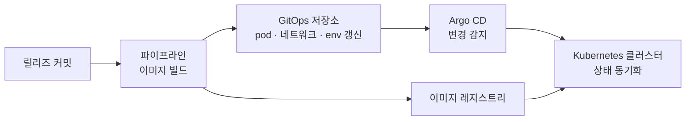
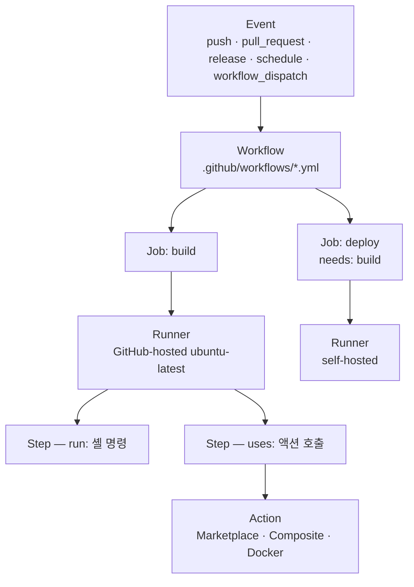
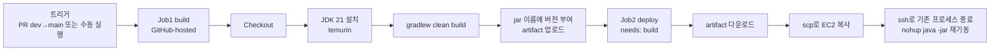

저장소에 `.github/workflows/deploy.yml` 한 장을 넣고 커밋하면 그다음 push부터 빌드가 돈다. 파이프라인을 등록한 적도 서버를 세운 적도 없다. **파일이 곧 등록이고, 저장소에서 일어난 일이 곧 트리거다.**

앞 편이 정한 두 단위가 양 끝에 놓인다. 합치는 단위인 **브랜치**에서 깨어나 나르는 단위인 **컨테이너 이미지**를 밀어 넣으면서 끝난다. [편3](/blog/backend-engineering/branching-strategy-and-containers/)이 「Dockerfile이 무엇인가」까지 적고 넘긴 자리에 그 파일을 부르는 스텝이 들어간다.

대신 실행 서버가 남의 것이다. 시간이 제한되고 사내망에 닿지 않으며, Job마다 다른 머신이 떠서 방금 만든 파일도 다음 Job으로 넘어가지 않는다. **뒤 절반은 그 격리를 넘어 다니는 방법이다.**

## 도구를 고르기 전에 그림을 먼저 그린다

「무엇을 쓸까」는 두 번째 질문이다. 첫 번째는 **빌드한 것이 서버까지 어떤 경로로 가는가**이고, 축은 둘이다 — 서버를 내가 두는가 빌리는가, 파이프라인이 대상에 손을 뻗는가 대상이 스스로 맞추는가.

### 서버를 직접 두는 두 갈래

| 구성 | 흐름 | 적용 조건 |
| --- | --- | --- |
| **물리서버 + GitHub Actions** | Actions에서 통합·빌드 → 물리서버로 직접 배포 | 가장 단순하고 합리적이다. 단, 「피자 한 판을 나눠 먹을 수 있는 규모」의 팀일 때다 |
| **Docker 컨테이너 + GitOps** | ① 릴리즈 커밋 → ② 파이프라인이 이미지 생성 → ③ GitOps 저장소 갱신 → ④ Argo CD가 클러스터에 동기화 | 컨테이너 오케스트레이션 환경. 배포 상태가 Git에 선언되어 감사·롤백이 쉽다 |

둘째 행의 파이프라인 자리에는 Jenkins가 자주 들어간다. 서버를 직접 두는 다른 갈래여서 편5가 맡는다 — **무엇이 들어가도 나머지 화살표는 그대로다.**



파이프라인은 클러스터를 건드리지 않고 레지스트리와 GitOps 저장소까지만 간다. 반영은 **Argo CD**, 즉 Git의 선언과 클러스터의 실제 상태를 견주어 다른 만큼을 적용하는 도구가 한다([GitOps는 편1이 정리했다](/blog/backend-engineering/cicd-pipeline-fundamentals/#배포-방식과-도메인)). 배포 기록이 실행 로그가 아니라 Git 커밋에 남는 것이 표의 「감사·롤백이 쉽다」다.

### 클라우드에 맡기는 두 갈래

| 구성 | 방식 | 특징 |
| --- | --- | --- |
| **AWS EC2 + S3 + CodeDeploy** | 빌드 산출물을 S3에 올리고 CodeDeploy가 EC2에 배포한다 | 가장 보편적인 AWS 배포 시스템 |
| **AWS Elastic Beanstalk** | 파이프라인으로 Beanstalk에 컨테이너 형태로 배포한다 | 컨테이너를 바꿀 때 도메인 교체가 쉬워 많이 쓴다 |

같은 축이다. 파이프라인은 S3까지만 책임지고 EC2에 손을 대는 것은 CodeDeploy다 — 선언이 Git이 아니라 클라우드 쪽에 있을 뿐이다.

### 그래서 무엇을 고르는가 — 표의 축은 셋이다

| 도구 | 비용 | 설치 | 설정 난이도 | 특징 |
| --- | --- | --- | --- | --- |
| **GitHub Actions** | Public 저장소 무료 | 제공되므로 설치가 없다 | 낮다 — 공개된 액션을 조립한다 | GitLab CI와 거의 같은 모양 |
| **Jenkins** | 완전 무료 | War 또는 Docker 이미지 | 높다 — 기본 기능이 없어 「무에서 유를 창조」한다 | 사용자 정의 자유도가 가장 높다 |
| **Travis-CI** | 크레딧 10,000 소진 후 유료 | — | Jenkins보다 훨씬 적게 든다 | 국내 레퍼런스가 부족하다 |

비용 열의 값은 2026년 7월 기준이다. **돈으로만 읽으면 Jenkins의 압승으로 보이지만** 실제로 드는 것은 서버를 세우고 지키는 사람의 시간이고 그 값은 표에 없다.

## 저장소에서 일어난 일이 곧 트리거다

어느 구성에 놓이든 하는 일은 같다. **저장소에서 사건이 나면 파일 하나를 읽어 그대로 실행한다.** 이 문장의 등장인물 여섯이 문법을 결정한다.

### Workflow → Job → Step

화살표를 따라가면 사건 하나가 아래로 세 번 갈라진다.



| 요소 | 정의 | 핵심 성질 |
| --- | --- | --- |
| Event | 워크플로를 실행시키는 사건 | `on:` 으로 선언한다 |
| Workflow | 사건이 났을 때 수행할 행위를 정의한 파일 | `.github/workflows` 디렉터리에 둬야 인식된다 |
| Job | 하나의 Runner에서 실행되는 실행 단위 | **완전히 격리된다** — Job끼리 다른 머신이다. 기본은 병렬이고 `needs`로 순서를 준다 |
| Step | Job의 목표를 위해 실행되는 개별 행위 | 위에서 아래로 순차. 각 Step이 자체 프로세스라 **환경변수 변화가 다음 Step에 남지 않는다** |
| Action | 반복 작업을 함수처럼 모듈화한 것 | JavaScript · Composite · Docker 세 종류 |
| Runner | 워크플로를 실제로 실행하는 서버 | 한 번에 하나의 Job만 실행한다 |

층은 셋이다. **Workflow → Job → Step.** 파일 하나가 Workflow이고 그 안에 Job이 여럿, Job 안에 Step이 선다. **가운데 층의 이름은 기억해 두는 편이 좋다** — 다음 편에서 「Job」이 다른 높이로 간다([편1의 낱말 구분표](/blog/backend-engineering/cicd-pipeline-fundamentals/#시리즈-안에서-갈리는-넷)).

여섯 중 **Action**만 성격이 다르다. 나머지는 구조의 이름이지만 Action은 **남이 만들어 둔 Step 하나**여서 체크아웃도 JDK 설치도 마켓플레이스의 것을 `uses:`로 부른다. Job 행과 Step 행에는 같은 낱말이 있다 — **격리.**

### 무엇이 워크플로를 깨우는가

| 이벤트 | 언제 | 주 용도 |
| --- | --- | --- |
| `push` | 새 커밋이 저장소에 유입될 때 | 브랜치를 한정해 쓴다(`branches: [main]`, `feature/**`) |
| `pull_request` | PR 생성·갱신 시. 기본은 `opened`·`synchronize`·`reopened` | **CI의 주력** — 컴파일·포맷·린트·테스트 |
| `release` | 릴리즈 생성 시. `types: [published]` 등으로 한정한다 | 태그 기반 운영 배포 |
| `workflow_dispatch` | 수동 실행 버튼 | 테스트·디버깅, **비상 시 수동 배포** |
| `schedule` | Crontab 문법(분 시 일 월 요일) | 야간 정기 빌드, 정기 점검 |

둘째 행이 앞 편의 빈자리를 채운다. 편3은 [PR을 규칙이 강제되는 자리](/blog/backend-engineering/branching-strategy-and-containers/#pull-request--규칙이-실제로-강제되는-자리)로 놓으면서 CI만은 규칙이 아니라 사건이라고 적었다. 그 사건의 이름이 `pull_request`이고 필수 체크의 실체가 이것으로 깨어난 워크플로다.

셋째 행의 **Release**는 태그와 붙어 다니지만 같은 것이 아니다. Git 태그가 커밋에 이름을 붙이는 표시라면 Release는 **그 태그에 릴리즈 노트와 산출물을 매달아 게시하는 것**이다. [편2](/blog/backend-engineering/version-control-as-cicd-premise/)가 「태그는 배포에 이름을 주는 장치」로 닫았는데, `release` 배포는 **릴리즈가 게시되는 시점**에 돈다.

넷째 행만 저장소 바깥에서 오는 사건이고, 버튼을 누를 때 값을 함께 넘긴다.

```yaml
on:
  workflow_dispatch:
    inputs:
      tags:
        description: 'Set Tags Name'
        required: true
        type: string
        default: main
```

만들어지는 것은 입력칸 하나가 달린 실행 버튼이다. 요점은 입력받는 것이 브랜치가 아니라 **태그**라는 점이다.

> 실무에서는 `main`을 그대로 배포하지 않는다. 릴리즈를 낸 뒤 특정 태그를 배포한다.
>
> 그래서 배포 워크플로는 「어떤 태그를 배포할지」를 입력받을 수 있어야 한다.

왜 브랜치로는 안 되는지는 편2가 논증을 끝냈다. 이 두 줄은 표의 세 행을 한 축으로 꿴다 — `push` 배포와 `release`·`workflow_dispatch` 배포는 **배포 대상이 다르고**, 선택은 편7이 받는다.

## 어디서 도는가 — Runner 두 종

Job이 「하나의 Runner에서 실행되는 단위」였으니 무엇이 도는지는 Runner가 정한다.

| 항목 | GitHub-hosted | Self-hosted |
| --- | --- | --- |
| 실행 위치 | 제공되는 인스턴스 | 직접 운영하는 서버(예: 서비스용 EC2) |
| 시간 제한 | **6시간 타임아웃** | 없다 |
| 속도 | 매 실행마다 리눅스 라이브러리를 설치해 느리다 | 사전 설치 상태가 유지되어 빠르다 |
| 네트워크 | 외부에서 사내망에 접근할 수 없다 | **사내망·VPC 내부 자원에 접근할 수 있다** |
| 비용 | Public 무료 / Private는 사용량 과금 | 서버 운영 비용을 자기가 부담한다 |
| 보안 | 제공자가 격리한 일회용 머신 | **저장소에 쓰기 권한이 있는 사람이 러너 머신에서 코드를 실행한다** — Public 저장소에 붙이면 위험하다 |
| 대표 용도 | 빌드·테스트 | 배포(서비스 서버에 직접 접근), 대용량·장시간 빌드 |

시간 제한과 비용 두 행은 2026년 7월 기준이다. 일곱 행이 한 문장으로 모인다 — **GitHub-hosted는 매번 깨끗한 남의 머신이고 self-hosted는 계속 살아 있는 내 머신이다.**

여섯째 행이 이 편에서 가장 조심할 자리다. self-hosted runner를 붙인다는 것은 **저장소에 들어온 코드를 내 서버에서 실행하겠다는 선언**이고, 그 코드를 넣을 수 있는 사람이 곧 내 서버에서 명령을 돌릴 수 있는 사람이 된다. **네트워크 행의 장점과 같은 성질의 뒷면이다.**

## 워크플로를 쓰는 문법

남은 것은 적는 법이다. 키워드 열한 개는 어느 층에 붙는지가 함께 정해져 있어 **「위치」 열이 문법의 절반이다.**

| 키워드 | 위치 | 의미 |
| --- | --- | --- |
| `name` | workflow | Actions 목록에 표시될 이름 |
| `on` | workflow | 실행 트리거 |
| `env` | workflow / job / step | 환경변수(Map). 하위에서 덮어쓸 수 있다 |
| `jobs.<job_id>` | workflow | Job 식별자. `needs`에서 이 이름으로 참조한다 |
| `runs-on` | job | 실행 머신 타입(필수). Job마다 독립된 머신이 뜬다 |
| `needs` | job | 선행 Job 지정 → 순차 실행 |
| `outputs` | job / step | Job·Step 간 값 전달 |
| `if` | job / step | 실행 조건. `steps.<id>.outcome`으로 이전 결과 참조 |
| `run` | step | OS 셸 명령 실행. `name`을 안 적으면 명령이 이름이 된다 |
| `uses` | step | 액션 호출(같은 저장소·공용 저장소·도커 이미지) |
| `with` | step | 액션에 넘길 입력 Map. `INPUT_` 접두사 대문자 환경변수로 변환 |

열한 개 중 셋이 골격을 만든다. `runs-on`이 Job을 **어디에** 놓고, `needs`가 **사이의 순서**를 만들고, `outputs`가 그 순서를 따라 **값**을 흘린다.

### Step 사이로 값을 넘긴다

가장 이상해 보이는 행이 `outputs`다. 붙어 있는 Step끼리 왜 전달이 필요한가 — **각 Step이 자체 프로세스**라 앞 Step에서 만든 셸 변수가 다음 Step에는 없다.

```yaml
steps:
  - id: set-foo
    run: echo "foo=bar" >> "$GITHUB_OUTPUT"
  - run: echo ${{ steps.set-foo.outputs.foo }}
```

값을 셸 변수가 아니라 `$GITHUB_OUTPUT`이 가리키는 파일에 적는 것이 요점이다. 프로세스는 끝나도 파일은 남고, 러너가 그것을 `steps.<id>.outputs`로 옮긴다. **`id`를 안 붙이면 참조할 이름이 없다.**

층을 올리면 같은 문제가 더 심해진다. **Job은 서로 다른 머신**이라 파일에 적어 두는 방법조차 통하지 않는다.

```yaml
jobs:
  build:
    outputs:
      release: ${{ steps.set-version.outputs.VERSION_NAME }}
  deploy:
    needs: build
    steps:
      - run: echo ${{ needs.build.outputs.release }}
```

위쪽 Job이 자기 Step의 출력을 `outputs`로 한 번 더 **밖에 내걸고** 아래쪽이 `needs`로 가져온다. `needs`는 순서만 정하지 않는다 — **순서를 만들면서 값이 흐를 길을 낸다.**

### Context — 도는 중의 상황을 읽는다

워크플로는 자기가 **어떤 사건으로 깨어났는지**도 알아야 한다. 태그면 배포하고 브랜치면 테스트만 하는 식이다. **Context는 실행 중인 상황을 `${{ }}` 안에서 읽는 변수 묶음**이고 앞의 `steps`·`needs`도 Context다.

| 프로퍼티 | 반환값 |
| --- | --- |
| `github.ref_name` | 트리거한 브랜치·태그 이름 (`main`, `v1.0.0` …) |
| `github.ref_type` | 트리거 유형 (`tag` / `branch`) |
| `github.workspace` | 러너에서 체크아웃·스텝이 실행되는 경로 |
| `github.run_number` | 실행 회차(빌드 번호로 활용) |

앞의 두 행이 짝이다. `ref_type`으로 태그인지 가르고 `ref_name`으로 어느 태그인지 집으면 앞 절의 「어떤 태그를 배포할지」가 조건문 하나가 된다.

## Job 사이에는 파일이 안 넘어간다

값은 `outputs`로 넘겼다. 파일은 안 된다 — jar 하나가 수십 MB이고 YAML 변수에 담을 방법이 없다.

**Artifact — 올려 두고 내려받는다**

Job이 다른 머신에서 도는 이상 빌드 결과 파일은 넘어가지 않는다. 중간에 올려 두는 자리가 Artifact다. [편1의 용어 정리](/blog/backend-engineering/cicd-pipeline-fundamentals/#실행-주체와-정의-파일)가 「**Job 간**에 전달한다. Step끼리는 파일시스템을 공유하므로 필요 없다」로 적어 둔 자리다.

```yaml
# build job
- name: Upload build artifact
  uses: actions/upload-artifact@v4
  with:
    name: cicd-study-application
    path: build/libs/cicd-study-${{ steps.set-version.outputs.VERSION_NAME }}.jar

# deploy job
- name: Download build artifact
  uses: actions/download-artifact@v4
  with:
    name: cicd-study-application
    path: build/libs/
```

두 스텝을 잇는 것은 `name` 값 하나여서, 어긋나면 다음 Job이 빈손이다. `path`는 올릴 때 **무엇을 담을지**, 내려받을 때 **어디에 풀지**다. 액션 버전 `@v4`는 2026년 7월 기준이고 가장 자주 낡는 문자열이다.

**Composite Action — 반복하는 것을 내가 만든다**

모든 워크플로에 똑같이 들어가는 스텝 묶음은 복사해 둘수록 제각각이 된다. **Composite Action은 그 묶음을 매개변수와 출력을 가진 하나의 액션으로 포장하는 방식**이고, 조립의 나머지 절반이 여기 있다.

```yaml
name: 'Hello World'
description: 'Greet someone'
inputs:
  who-to-greet:
    description: 'Who to greet'
    required: true
    default: 'World'
outputs:
  random-number:
    value: ${{ steps.random-number-generator.outputs.random-number }}
runs:
  using: "composite"        # 이 선언이 Composite Action임을 규정한다
  steps:
    - name: Set Greeting
      run: echo "Hello ${{ inputs.who-to-greet }}."
      shell: bash           # run을 쓰면 shell은 필수다
```

워크플로 파일과 닮았지만 최상위 키가 다르다. `on`이 없고 `runs`가 있다 — **스스로 깨어나지 않고 불려 나가는 것**이라 트리거가 필요 없다.

| 규칙 | 내용 |
| --- | --- |
| 메타데이터 파일명 | 반드시 `action.yml` 또는 `action.yaml` |
| `runs.using` | `composite` / JavaScript / Docker 중 실행 방식 지정(필수) |
| `shell` | `run`을 설정했다면 필수 |
| `inputs` 네이밍 | 런타임에 소문자로 변환되므로 **소문자를 쓴다** |
| 호출 시 버전 | `owner/repo@main` 처럼 브랜치명·태그명을 반드시 명시한다 |

마지막 행이 자주 물리는 자리다. 버전을 브랜치명으로 적으면 **그 저장소가 바뀌는 순간 내 파이프라인도 바뀐다.** 태그로 고정하라는 결론은 앞 두 편과 같다.

## 조립하면 이렇게 된다

여기까지가 부품이다. 흐름 둘을 놓으면 앞 절이 어디 들어가는지 보인다 — **둘의 차이는 나르는 단위 하나다.**

**jar를 서버에 직접 올리는 흐름**



`needs: build`가 두 Job의 순서를 만들고 Artifact가 그 사이로 jar를 나른다. Job1은 GitHub-hosted에서 돌고 Job2가 남의 서버에 손을 뻗는데, **그 마지막 대목이 이 흐름의 약점이다.**

```bash
echo "${{ secrets.EC2_SSH_KEY }}" > private_key.pem
chmod 600 private_key.pem
scp -i private_key.pem -o StrictHostKeyChecking=no build/libs/app.jar user@host:/home/user/
ssh -i private_key.pem -o StrictHostKeyChecking=no user@host \
  "pgrep java | xargs kill -9; nohup java -jar /home/user/app.jar > app.log 2>&1 &"
rm -f private_key.pem          # 키 파일은 반드시 삭제한다
```

여섯 줄 중 셋이 열쇠 관리다. GitHub-hosted 러너는 매번 지워지지만 **self-hosted라면 지우지 않은 키가 남는다.** 다섯째 줄에는 진짜 문제가 있다 — 죽인 직후 재기동까지 **서비스가 떠 있지 않은 구간**, 곧 다운타임이 생기고, 그것을 없애는 **무중단 배포**가 편6의 주제다.

**컨테이너 이미지를 밀어 넣는 흐름**

```mermaid
flowchart LR
    T["트리거"] --> B["Job1 build-docker-image<br/>ubuntu-latest"]
    B --> B1["Checkout · JDK21 · gradlew build"]
    B1 --> B2["docker build -t user/cicd-study ."]
    B2 --> B3["docker login<br/>docker/login-action"]
    B3 --> B4["docker push"]
    B4 --> D["Job2 run-docker-image-on-ec2<br/>runs-on: self-hosted"]
    D --> D1["docker pull 최신 이미지"]
    D1 --> D2["docker-compose down app"]
    D2 --> D3["docker-compose up app -d"]
    D3 --> D4["docker system prune -f"]
```



바뀐 것이 셋이다. **Artifact 자리에 레지스트리가, `scp`·`ssh` 자리에 `runs-on: self-hosted`가, 프로세스를 죽였다 살리던 자리에 컨테이너 교체가 들어왔다.** 가운데 것이 Runner 표 마지막 행의 실물이어서 열쇠 파일이 없다 — **위험을 줄인 게 아니라 종류를 바꾼 것**이다.

왼쪽 끝의 트리거와 오른쪽 끝의 `docker push`가 편3이 정한 두 단위다. **이 편이 채운 것은 그 사이 전부다.**

이미지를 **어떻게 만드는가**는 다시 쓰지 않는다 — [Dockerfile은 편3이 열어 두었다](/blog/backend-engineering/branching-strategy-and-containers/#dockerfile--이미지를-코드로-적는다). 새로 정해지는 것은 **누가 언제 부르는가**뿐이어서 손으로 치던 `docker build`가 커밋마다 돈다. 편3이 운영 규칙으로 적어 둔 `docker system prune -f`도, 지정된 Gradle 버전을 스스로 내려받아 어디서든 같은 결과를 내는 `gradlew`도 매번 새 머신이 뜨는 곳에서는 전제다.

## 정리

- **파이프라인을 등록하는 절차가 없다.** 저장소에 파일을 두면 그다음 사건부터 돈다.
- **층이 셋이면 격리도 그만큼이다.** Job은 다른 머신, Step은 다른 프로세스다. `outputs`와 Artifact는 그 격리를 넘는 장치다.
- **Runner를 고르는 것은 어디까지 손이 닿게 할지를 고르는 것이다.** 사내망에 닿는 러너는 사내망 안에서 남의 코드를 돌린다.
- **조립은 양방향이다.** 남이 올린 액션을 `uses`로 가져오고 내가 반복하는 것을 액션으로 내민다.

다음 편은 같은 일을 반대 순서로 하는 도구를 연다. 여기서는 저장소에 파일을 얹었지만 거기서는 **서버를 먼저 세우고 무엇을 볼지 알려 준다.** 나란히 두는 이유는 [옮겨야 할 것이 한쪽에 쌓여 있기 때문](/blog/backend-engineering/cicd-pipeline-fundamentals/#도구가-두-갈래인-이유)이고, 옮길 때 걸리는 것이 이름이다 — 이 편에서 못 박은 세 층이 거기서는 **다른 높이에 놓인다.**
