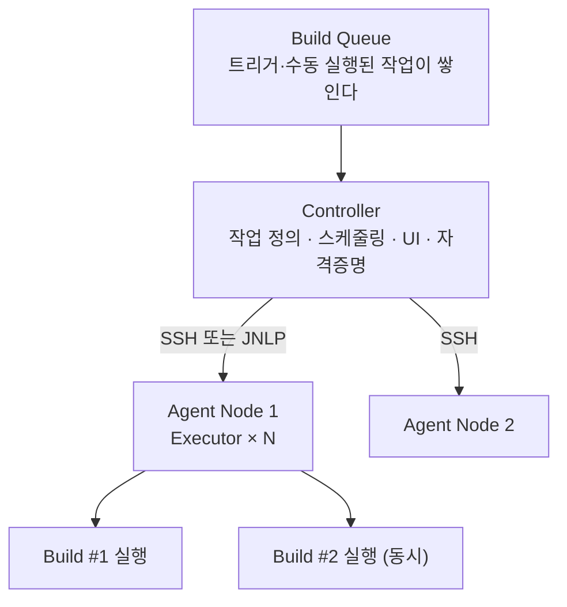

Jenkins를 띄우고 접속하면 빈 화면과 「새로운 Item」 버튼 하나가 있다. 저장소를 아직 하나도 모르고, 무엇이 나면 무엇을 할지도 모른다. **여기서는 파일을 두는 것이 등록이 아니다. 서버가 먼저 있고, 무엇을 볼지는 내가 알려 준다.**

그래서 이 편이 첫 줄부터 답해야 하는 질문은 하나다 — **빌드는 어느 기계에서 도는가.** [편4](/blog/backend-engineering/github-actions-pipeline/)는 이 질문을 받지 않았다. 물어볼 필요가 없어서가 아니라 답이 이미 적혀 있어서다. `runs-on:` 한 줄이 그 답이었고, 값을 적으면 그 종류의 머신이 떠 주었다([Runner 두 종](/blog/backend-engineering/github-actions-pipeline/#어디서-도는가--runner-두-종)). 여기에는 띄워 줄 사람이 없다. 노드를 세우고 접속 방법을 등록하는 것까지가 이 편의 앞쪽이고, 그 위에 무엇을 얹을지가 뒤쪽이다.

옮겨 올 때 가장 먼저 걸리는 것은 문법이 아니라 이름이다. 편4가 못 박은 세 층은 여기서도 셋이지만 **가운데 층의 이름이 다르고, 「Job」은 아예 다른 높이로 간다.** 이 편은 그 이름표부터 붙이고 문법으로 들어간다.

## 서버를 세운다 — Controller와 Agent

Jenkins는 실행하고 끝나는 프로그램이 아니라 **상주하는 서버**다. 켜 두면 대기열을 지켜보다가 뭔가 들어오면 그것을 돌릴 기계를 고른다. 그래서 첫 설정이 **기계를 몇 대 어떻게 붙일 것인가**다.



**받는 쪽과 돌리는 쪽이 같은 기계가 아니어야 한다**는 것이 이 그림의 요점이다.

| 요소 | 역할 | 설정할 때 유의할 것 |
| --- | --- | --- |
| Controller | 작업 정의·스케줄·플러그인·자격증명 관리 | 여기서 빌드를 돌리면 SPOF가 된다 |
| Agent | 실제 빌드 수행 | Remote root directory는 `/var/jenkins` 같은 **절대 경로**를 권한다 |
| Executor | 한 노드가 동시에 처리할 수 있는 빌드 수 | **CPU 코어 수와 같게 두기를 권한다.** 과도하게 높이면 전체 처리량은 늘지만 개별 빌드가 느려진다 |
| Build Queue | 트리거·수동 실행된 작업의 대기열 | 처리 가능한 Executor가 집어 가면 「실행」 상태로 바뀐다 |

네 행이 두 짝이다. 위 둘이 **어느 기계인가**를, 아래 둘이 **동시에 몇 개인가**를 정한다. 셋째 행이 이 시리즈에서 처음 나오는 낱말이라 여기서 못 박는다 — **`Executor`는 한 Agent 노드 안의 실행 슬롯이고, 슬롯 수가 그 노드의 동시 빌드 수다.** 노드를 늘리는 것과 슬롯을 늘리는 것은 다르다.

Controller가 Agent에 붙는 기본 방식은 SSH 자격증명 등록(`SSH Username with private key`)이다. `ssh-keygen -t rsa`로 키를 만들어 공개키를 Agent 쪽에 넣고 개인키를 Jenkins 자격증명으로 등록한다. 공개키가 들어가는 자리는 `authorized_keys`이거나, 공식 Agent 컨테이너를 쓴다면 환경변수 `JENKINS_SLAVE_SSH_PUBKEY`다 — [실행이 걸린 이름은 바꾸지 않기로 한](/blog/backend-engineering/cicd-pipeline-fundamentals/#master--slave-표기는-이렇게-쓴다) 바로 그 자리다. 반대로 Agent가 Controller 쪽으로 먼저 접속을 여는 JNLP 방식도 있고, 이때 열어 두는 포트는 **2026년 7월 기준 50000번**이다.

### 등록된 것 하나가 Job이다

노드가 붙었으면 다음은 무엇을 시킬지다. 작업 하나를 이루는 요소는 셋이다.

| 요소 | 정의 | 대응 개념 |
| --- | --- | --- |
| Trigger | 작업을 언제 시작할지 | GitHub Actions의 `on:` |
| Build Step | 목표를 이루기 위한 단계별 Task | Actions의 `steps:` |
| Post-build Action | 완료 후 실행할 작업(알림·산출물 복사·리포트) | Actions에는 대응 개념이 약하다(`if: always()`로 대신한다) |

오른쪽 열은 새 대조가 아니라 되짚기다 — 앞의 둘은 편4의 [무엇이 워크플로를 깨우는가](/blog/backend-engineering/github-actions-pipeline/#무엇이-워크플로를-깨우는가)와 [워크플로를 쓰는 문법](/blog/backend-engineering/github-actions-pipeline/#워크플로를-쓰는-문법)이 맡았다. 셋째 행만 짝이 없다. **「끝난 뒤에」를 일급 요소로 두는 것**이 이쪽 특징이고, 알림과 리포트와 승인이 걸리는 자리가 여기다.

여기서 이름 하나가 층을 옮긴다. **Jenkins에서 `Job`은 등록된 작업 항목 전체를 가리킨다.** 편4에서 Job은 Workflow 아래 가운데 층이었지만([편1의 낱말 구분표](/blog/backend-engineering/cicd-pipeline-fundamentals/#시리즈-안에서-갈리는-넷)), 여기서는 위 표의 셋을 모두 담은 그릇 자체가 Job이고 **가운데 층의 이름은 Stage**다. 그 Job을 한 번 돌리는 것이 **빌드(Build)이고**, 실행마다 고유 ID가 붙어 로그도 결과도 그 ID로 추적한다.

## Freestyle과 Pipeline — 설정이 어디에 남는가

Job을 만들 때 첫 화면에서 종류를 고른다. 실질적으로 갈리는 것은 둘이다.

| 항목 | Freestyle | Pipeline |
| --- | --- | --- |
| 정의 방식 | Web UI 폼 설정 | 코드(Groovy DSL) |
| 복잡도 대응 | 단순 Build·Test·Packaging·리포트 전송 | 자유로운 Step 정의, 복잡한 CI/CD 조작 가능 |
| Agent 지정 | 작업 단위 | **Stage별로 서로 다른 agent 사용 가능** |
| 중단·재개 | 불가 | 사용자 입력 대기 중지·재시작, 재부팅 시 실패 지점 재시작(옵션 설정 필요) |
| 형상관리 | Jenkins 내부 설정에 갇힌다 | **설정이 코드라서 SCM으로 버전 관리 가능** |
| 선택 기준 | 정말 단순한 작업 | 그 외 전부 |

첫 행이 나머지를 전부 낳는다. **`Freestyle`은 Job의 설정을 Jenkins 웹 화면의 폼에 채워 넣는 방식이고, `Jenkins Pipeline`은 같은 설정을 Groovy DSL 코드로 적는 방식이다.** 폼은 작업 하나에 한 벌뿐이라 Stage마다 다른 값을 줄 수 없고(셋째 행), 폼은 파일이 아니라 Jenkins 내부 데이터라 저장소에 넣을 수 없다(다섯째 행). 넷째 행만 결이 다르다 — 멈췄다 이어가려면 어디까지 갔는지가 어딘가에 적혀 있어야 하는데, 코드로 적힌 정의에는 그 「어디」에 이름이 있다.

> 요는 「적절한 기술을 선택하는 능력」이다.
>
> 단순 작업에 Jenkins Pipeline을 쓰는 것은 오버엔지니어링이고, 복잡한 배포에 Freestyle을 쓰면 설정이 UI에 갇혀 감사·복구가 불가능하다.
>
> 다만 실무 기준선은 명확하다. **CI/CD 정의가 코드로 남고 리뷰·롤백이 가능한가**가 갈림길이며, 이 기준에서는 Pipeline이 사실상 기본값이다.

기준선 쪽은 앞 편들이 이미 한 말이다. 편2가 [되돌리려면 시점이 이름으로 지목돼야 한다](/blog/backend-engineering/version-control-as-cicd-premise/#배포의-기준은-브랜치가-아니라-태그다)고 했고 편3이 그 이름을 나르는 단위에 붙였는데, **되돌릴 수 있는 목록에 CI/CD 파이프라인의 정의 자체가 들어가느냐**가 위 표 다섯째 행이다. Freestyle을 고르면 그 항목만 목록에서 빠진다 — 코드도 이미지도 되돌릴 수 있는데 「어떻게 배포했는가」만 남지 않는다.

## Freestyle 화면이 어휘를 정한다

기준선이 Pipeline이라면 Freestyle 화면은 왜 보는가. **거기 적힌 항목 이름이 그대로 Jenkins의 어휘이기 때문이다.** 뒤에 나올 `options`·`triggers`·`parameters`가 이 화면에서 그대로 온 이름이다. 세 섹션이 같은 무게는 아니다 — **Build Trigger만 「누가 먼저 말을 거는가」 하나로 닫힌다. Build Env는 돌기 전후의 처리를 모으고, General은 나머지 전부가 모이는 자리다.**

| 섹션 | 설정 | 의미 |
| --- | --- | --- |
| General | Github project | 체크아웃 대상 저장소 URL(작업 메타 정보) |
| General | Throttle builds | 동시 호출 제한. `Number of builds` / `Time period` / 수동 실행 예외 허용 |
| General | Discard old builds | 오래된 빌드 삭제(디스크 관리) |
| General | 매개변수 사용 | 프로젝트 내 사용할 파라미터 정의 |
| General | concurrent 빌드 | 기본은 직렬 실행. 병렬 허용 여부 |
| General | Restrict where this project can be run | 실행 노드 지정 |
| Build Trigger | 원격 유발(스크립트) | 인증 토큰으로 URL 호출해 빌드. `curl -X POST .../job/<name>/build?token=<t>` |
| Build Trigger | Build after other projects | 선행 프로젝트 완료 후 실행. 광범위 테스트 연쇄에 사용 |
| Build Trigger | Build periodically | Cron 주기 실행. `0 9 * * 1-5` = 평일 오전 9시 |
| Build Trigger | GitHub hook trigger | GitHub Webhook 수신 시 즉시 빌드 |
| Build Trigger | Poll SCM | 주기적으로 저장소 변경 여부를 확인해 **변경이 있을 때만** 빌드 |
| Build Env | Delete workspace before build | 시작 전 워크스페이스 정리(예외 디렉터리 지정 가능) |
| Build Env | Use secret text(s) or file(s) | 자격증명을 환경변수로 바인딩 |
| Build Env | SSH before/after build | 빌드 전후 원격 명령 실행·파일 전송 |
| Build Env | Terminate a build if it's stuck | 빌드 고착 시 타임아웃 종료 |

가운데 다섯 행이 그 「누가」를 셋으로 가른다 — 바깥에서 Jenkins를 부르는 것이 둘, Jenkins가 시계를 보고 스스로 깨는 것이 둘, Jenkins가 Jenkins를 부르는 것이 하나다. 위아래 두 섹션은 앞 절의 노드 이야기로 돌아온다 — **Restrict where this project can be run**을 비워 두면 Agent 여러 대 중 어디서 돌지 알 수 없어, 배포 키가 한 대에만 있으면 그 작업은 확률로 실패한다. **Delete workspace before build**는 더 자주 물린다 — Agent는 계속 살아 있는 기계라 지난 빌드의 산출물이 남고, 그것 때문에 **통과해 버리는 테스트**가 생긴다.

### Webhook과 Poll SCM

트리거 다섯 중 둘은 같은 목적을 정반대 방향으로 이룬다.

| 비교 | Webhook | Poll SCM |
| --- | --- | --- |
| 방향 | GitHub → Jenkins (push) | Jenkins → GitHub (pull) |
| 지연 | 즉시 | 폴링 주기만큼 |
| 부하 | 낮음 | 주기적 요청으로 낭비 발생 |
| 요구사항 | **Jenkins가 외부에서 접근 가능한 공인 도메인 필요** (ngrok 같은 터널링 도구로 임시 발급) | 없음. 방화벽 뒤 Jenkins도 가능 |
| 선택 | 기본 선택 | 사내망 격리 환경에서 차선 |

첫 행이 나머지 넷을 결정한다. GitHub이 부르면 즉시 오지만 닿을 주소가 있어야 하고, Jenkins가 물으러 가면 주소는 필요 없지만 주기만큼 늦는다. **사내망 안에 두면 도달 가능성 때문에 차선을 고른다.**

## Declarative Pipeline 문법

Pipeline을 고르면 폼 대신 Jenkinsfile을 쓴다. 최소 형태는 이렇다.

```groovy
pipeline {
    agent any
    environment {
        DOCKERHUB_CREDENTIALS = credentials('docker-hub-access-key')
        DOCKERHUB_REPOSITORY  = "user/cicd-study"
        TARGET_HOST           = "ec2-....compute.amazonaws.com"
    }
    options { timeout(time: 1, unit: 'HOURS') }
    stages {
        stage('Build Source Code') {
            steps { sh './gradlew clean test bootJar' }
        }
    }
    post {
        success { junit '**/build/test-results/test/*.xml' }
    }
}
```

중괄호가 층을 그대로 드러낸다. `pipeline` 안에 `stages`, 그 안에 `stage`, 그 안에 `steps`, 그 안에 명령이다. **`stage`가 편4의 Job 자리이고 `steps`가 Step 자리다.** 쓸 수 있는 블록은 열세 개다.

| 블록 | 역할 |
| --- | --- |
| `pipeline` | 전체 CI/CD 프로세스의 시작점. 자바의 `main()`에 해당 |
| `agent` | 실행 환경. `any` / `none`(stage별 필수 선언) / `label 'x'` / `docker` |
| `environment` | key-value 환경변수. `credentials('id')` 헬퍼로 자격증명 즉시 사용 |
| `tools` | steps에서 쓸 도구(JDK 등). Global Tool Configuration(2026년 7월 기준 「Tools」)에 사전 등록 필요 |
| `options` | 실행 옵션. 파이프라인 블록에서 **한 번만** 정의 |
| `triggers` | 재실행 자동화. `cron('H */4 * * 1-5')` |
| `parameters` | 실행 시 입력 매개변수. `choice`, Git Parameter 플러그인 등 |
| `stages` / `stage` | 단계 정의. stage는 `steps`/`parallel`/`matrix` 중 최소 하나 포함 |
| `steps` | 실제 동작이 정의되는 최소 실행 단위 |
| `script` | Declarative 안에서 Scripted 문법 사용. `steps` 내부에 위치 |
| `when` | 조건부 실행. `when { branch 'main' }` |
| `input` | 사용자 승인 대기. `steps` 앞에 위치, `when`과 조합 가능 |
| `post` | 완료 후 조건별 후처리. `always`, `changed`, `fixed`, `regression`, `aborted`, `failure`, `success`, `unstable`, `unsuccessful`, `cleanup` |

열세 블록이 앞 절의 세 섹션과 겹친다. `triggers`·`parameters`가 Build Trigger와 General이고 `options`가 실행 제어, `post`가 Post-build Action이다. **폼에서 본 것을 파일로 옮겨 적은 것이 이 표다.**

둘째 행이 이 편의 「환경」이다. 시리즈 안에서 이 낱말은 세 가지를 가리키는데([편1의 낱말 구분표](/blog/backend-engineering/cicd-pipeline-fundamentals/#시리즈-안에서-갈리는-넷)), `agent any`의 그것은 **무엇 위에서 도는가**를 뜻하는 셋째 것이다.

**Declarative와 Scripted**

같은 Jenkins Pipeline을 적는 방식이 둘이라 문서를 찾으면 두 문법이 섞여 나온다.

| 항목 | Declarative | Scripted |
| --- | --- | --- |
| 등장 시기 | 최신(구버전 비호환 가능) | 기존 방식 |
| 가독성 | 높음 | 낮음 |
| Groovy 이해도 요구 | 낮음(DSL 제공) | 높음(엄격한 문법) |
| 절차적 표현력 | 제한적 → `script` 블록으로 보완 | 높음 |
| 권장 | 기본 선택 | 복잡한 절차 로직이 꼭 필요할 때 |

넷째 행이 둘의 관계를 말한다. **Declarative가 Scripted를 대체한 것이 아니라 감쌌다** — 표현력이 모자라는 자리에는 `script` 블록을 열어 그 안에서 Scripted 문법을 쓴다. 실제 판단은 「무엇을 고를까」가 아니라 「어디서 열까」다.

열셋 중 `options`에 자주 넣는 셋만 따로 본다.

| 옵션 | 효과 |
| --- | --- |
| `timeout(time: 1, unit: 'HOURS')` | 실행 제한 시간. **좀비 빌드가 Executor를 점유하는 것을 방지** |
| `retry(3)` | 실패 시 전체 파이프라인 재시도 |
| `disableResume()` | Controller 재시작 시 파이프라인 재개 금지 |

셋 다 첫 절로 돌아온다. **`timeout`이 지키는 것은 시간이 아니라 Executor 슬롯이다.** 빌려 쓰는 러너에서는 타임아웃이 제공자가 정한 상한이었지만 여기서는 내가 걸지 않으면 아무도 걸어 주지 않는다.

사전 정의 환경변수로는 `WORKSPACE`(작업 공간 절대 경로), `JENKINS_HOME`(Controller 데이터 경로), `JOB_NAME`(프로젝트 이름)이 바로 쓰인다. `triggers`의 `cron`에는 표준 crontab에 없는 문자도 하나 있다 — **`H`(해시)를 쓰면 실행 시각이 흩어진다.** `0 * * * *`를 열두 작업에 걸면 정각마다 부하가 몰리지만 `H H * * *`는 하루 한 번을 유지하면서 시각을 흩뜨린다. 남의 머신에서는 몰려도 남의 문제였다.

## 승인 게이트 — `input`

편1이 갈래가 지는 자리 셋을 꼽으면서 가운데 하나만 성격이 다르다고 했다. 양옆은 수치가 통과를 결정하는데 [가운데만 사람이 누르고, 그 자리를 둘지는 도메인이 정한다](/blog/backend-engineering/version-control-as-cicd-premise/#cd가-손을-떼는-지점은-도메인이-정한다). 결제 도메인처럼 승인이 내규나 법으로 강제되는 곳에서 이 문법은 선택이 아니다. **자동화한 CI/CD 파이프라인을 의도적으로 멈추고 사람의 승인을 받는 지점**이 `input`이다.

```groovy
script {
    def approval = input(
        id: 'wait-approval',
        message: 'Approve?',
        submitterParameter: 'approver',
        parameters: [choice(choices: ['Cancel', 'Deploy'], name: 'choice')]
    )
    if (approval['approver'] != 'admin') {
        throw new Exception('You do not have permission.')
    }
    if (approval['choice'] == 'Deploy') { currentBuild.result = 'Success' }
    else { throw new Exception('Choosed cancel') }
}
```

읽을 곳은 두 군데다. `submitterParameter`가 **누가 눌렀는지**를 값으로 돌려주고, 아래 `if`가 그 값을 검증한다. 버튼을 다는 것과 누른 사람을 기록하는 것은 다른 일이어서, `submitter`·`submitterParameter` 없이 화면만 띄우면 「승인을 받았다」는 사실이 아무 데도 남지 않는다. **감사 추적이 필요해서 게이트를 두는 것이라면 기록하는 쪽이 본체다.**

흐름 쪽에는 함정이 하나 있다. **승인을 기다리는 동안에도 그 빌드는 Executor를 점유한다.** 결재자가 퇴근했으면 그 슬롯은 밤새 잠긴 채로 있고, 코어 수만큼밖에 없는 슬롯이 하나 줄면 뒤의 빌드가 밀린다. 그래서 `input`은 앞 절의 `options { timeout }`과 반드시 짝으로 건다 — **사람을 기다리는 자리에는 사람이 오지 않는 경우의 처리도 함께 적어야 한다.**

`input`은 `steps` 앞에 놓이고 `when`과 조합되므로 조건까지 걸린다. 운영 배포 stage에만 승인을 붙이고 나머지는 통과시키는 구성이 여기서 나온다.

## Jenkins 실무 파이프라인은 이렇게 생겼다

부품이 모였으니 한 벌로 세운다. 태그를 골라 실행하면 열 단계가 순서대로 돈다.

```mermaid
flowchart LR
    S1["1. Tag / Branch 선택<br/>Git Parameter"] --> S2["2. 파이프라인 실행"]
    S2 --> S3["3. 선택 태그로 Checkout"]
    S3 --> S4["4. gradlew clean test bootJar"]
    S4 --> S5["5. docker build<br/>--no-cache --platform linux/amd64"]
    S5 --> S6["6. Docker Hub login · push"]
    S6 --> S7["7. 원격 EC2에 ssh<br/>docker pull"]
    S7 --> S8["8. docker-compose down"]
    S8 --> S9["9. docker-compose up -d"]
    S9 --> S10["10. Health Check · junit 리포트"]
```



가운데 여덟 단계는 편4의 컨테이너 흐름과 같은 그림이다. 다른 것은 양 끝이다 — 왼쪽 끝이 저장소 사건이 아니라 **사람이 태그를 고르는 화면**이고, 오른쪽 끝에 리포트 수집이 붙는다. 다섯째 단계의 `--no-cache`는 [편3이 속도와 재현성의 맞바꿈으로 정리해 둔](/blog/backend-engineering/branching-strategy-and-containers/#dockerfile--이미지를-코드로-적는다) 바로 그 선택이고, 이 파이프라인은 재현성 쪽을 골랐다.

이 구성이 내린 결정 셋은 따로 볼 값어치가 있다.

| 결정 | 이유 |
| --- | --- |
| 배포 기준을 브랜치가 아니라 **태그**로 | `main` 배포는 버전을 특정할 수 없고 어떤 기능이 들어갔는지 확인이 어렵다. Git Parameter 플러그인으로 태그 목록을 동적으로 선택한다 |
| Pipeline Script를 **애플리케이션 저장소와 분리**된 저장소에 보관 | 소스 코드의 소유자(앱 개발자)와 CI/CD 스크립트의 소유자(DevOps)가 다르기 때문. 다수 팀의 스크립트가 한 저장소에 모이므로 어떤 스크립트를 실행할지 지정한다 |
| Jenkins 컨테이너에 **Docker socket 마운트** | 컨테이너 안에서 `docker build`를 하기 위해 호스트 도커를 사용한다. `- /var/run/docker.sock:/var/run/docker.sock` |

첫 행은 편2가 이미 논증을 끝냈고, 둘째 행이 이 편에서만 나올 수 있는 결정이다. 편4에서는 워크플로 파일이 앱 저장소 안에 있는 것이 모델의 전제였는데 여기서는 **Jenkinsfile의 소재지가 선택지**다. 나누면 어느 스크립트를 돌릴지 Job이 지목해야 한다. 셋째 행은 편리한 만큼 값이 있다.

> Docker socket 마운트는 편리하지만 보안상 중대한 트레이드오프다.
>
> 소켓을 마운트한 컨테이너는 호스트의 도커 데몬을 제어할 수 있고, 이는 사실상 **호스트 root 권한과 동등**하다.
>
> 파이프라인 스크립트를 쓸 수 있는 사람 = 호스트를 장악할 수 있는 사람이 되므로, 스크립트 저장소의 쓰기 권한 관리가 곧 인프라 보안이 된다. 대안으로 Kaniko·BuildKit rootless 같은 데몬리스 빌더를 검토한다.

둘째 결정과 셋째 결정이 여기서 만난다. 스크립트를 별도 저장소로 뺀 것은 소유권 정리였는데, 소켓을 마운트한 순간 **그 저장소의 쓰기 권한이 호스트 root 권한과 같아진다.** 편4에서 self-hosted 러너를 붙이는 것이 저장소에 코드를 넣을 수 있는 사람이 내 서버에서 명령을 돌리게 된다는 선언이었던 것과 같은 구조이고, 대상만 워크플로 파일에서 Pipeline Script로 바뀌었다. **서버를 직접 가지면 권한 경계도 직접 그어야 한다.**

## Groovy는 이만큼만 알면 된다

Pipeline 정의도 `build.gradle`도 Groovy다. 자바에 Python·Ruby의 성질을 더한 동적 객체지향 언어라 기초 문법은 자바와 흡사하고, `script` 블록을 열 때 걸리는 것도 아래 여섯 줄을 넘지 않는다.

| 항목 | 예시 |
| --- | --- |
| 동적 타입 | `def a = 20` → `a = "문자열"` 가능. `def` 생략도 가능 |
| 정적 타입 | `int a = 20` → 다른 타입 할당 시 오류. `String a`에 `20`을 넣으면 `"20"`으로 자동 형변환 |
| List | `scoreList = [90, 80, 100]`, `list[2]`, `list.get(2)`, `list.size()`, 빈 리스트 `[]` |
| Map | `["국어":100]`, `map["수학"]` / `map.수학` 둘 다 접근. 실제 타입 `LinkedHashMap`. 빈 맵 `[:]` |
| 반복 | `for (i in 0..9)`, `list.each{ println it }`, `map.each{ k, v -> ... }`, `eachWithIndex` |
| 함수 | `def plus(a, b) { a + b }` — 마지막 표현식이 반환값. 괄호 생략 가능 |

여섯 행 중 앞의 둘과 마지막 하나가 실수를 만든다. `def`를 생략해도 돌아가므로 오타 난 변수명이 조용히 새 변수가 되고, 마지막 표현식이 곧 반환값이라 `return`을 안 적어도 무언가가 돌아온다. 앞 절의 `approval['choice']` 같은 Map 접근이 넷째 행이다.

## 정리

- **등록이 먼저다.** 저장소에 파일을 두는 것으로는 아무 일도 일어나지 않는다. 노드를 붙이고 Job을 만들고 트리거를 지정하는 것까지가 시작 조건이다.
- **`Executor`가 이 편의 유한 자원이다.** 코어 수만큼의 슬롯을 좀비 빌드도 쓰고 승인 대기도 쓴다.
- **설정을 코드로 적는 이유는 되돌리기 위해서다.** Freestyle과 Pipeline의 갈림길은 문법 취향이 아니라 「어떻게 배포했는가」가 형상관리에 남느냐다.
- **직접 가지면 경계도 직접 긋는다.** 워크스페이스를 언제 지울지, 승인을 누가 눌렀는지, Pipeline Script를 누가 쓸 수 있는지 — 빌려 쓸 때는 제공자가 정해 주던 것들이다.

여기까지가 도구 두 갈래다. 남은 것은 이 흐름의 오른쪽 끝, `docker-compose down`과 `up` 사이의 구간이다. 편4의 마지막 그림도 이 편의 8·9단계도 같은 자리에서 서비스가 잠깐 내려간다. [지도편이 예고한 대로](/blog/backend-engineering/cicd-pipeline-fundamentals/#이-시리즈의-구성) 그 구간을 없애는 방법과, CI/CD 파이프라인을 통과시키는 대신 **실패시키는** 쪽의 관문이 다음 편의 주제다.
