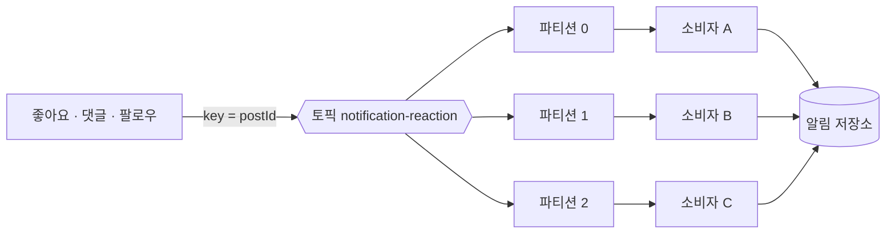
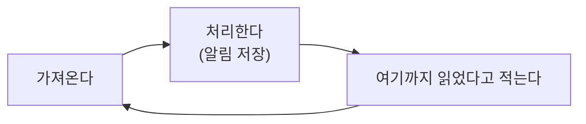
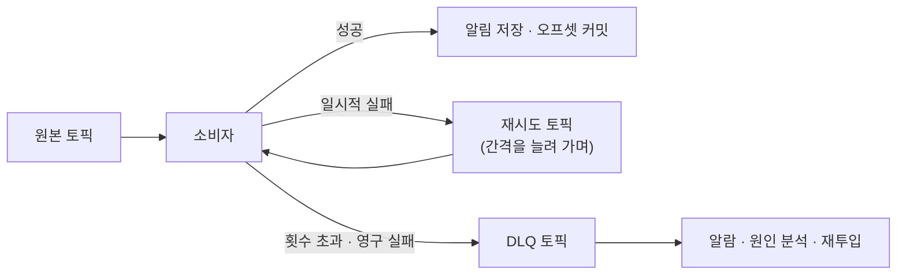

좋아요를 눌렀다가 3초 만에 취소한 사용자가 있다. 두 사건은 분명히 순서대로 일어났는데 알림 탭에는 취소된 좋아요의 알림이 남아 있고, 그것을 지워 줄 배치도 없다. 코드에는 버그가 없다. 등록과 취소가 서로 다른 파티션에 실려 각자의 속도로 처리됐고, 취소가 등록보다 먼저 도착했을 뿐이다.

[앞 편](/blog/backend-engineering/read-write-separation-and-multimodule/)은 좋아요 서비스가 알림 서버를 직접 부르던 화살표를 끊고 그 사이에 브로커를 세웠다. 끊고 나면 알림 쪽 장애가 좋아요 쪽으로 되돌아오지 않는다. 사라진 것은 장애가 번지는 경로뿐이고, 그 자리에 셋이 청구된다 — 사건과 알림 사이의 **시간 차**, 같은 사건의 **중복**, 두 사건의 **뒤집힌 앞뒤**다.

이 글은 그 청구서를 한 줄씩 갚는다. 앞의 세 절이 브로커의 구조를 먼저 보는 것은 뒤의 청구서가 전부 그 구조에서 나오기 때문이다.

## 메시지가 쌓이는 자리

브로커에 던진다는 것은 어딘가로 보낸다는 뜻이 아니라 **어딘가에 쌓는다**는 뜻이다. 발행하는 쪽은 토픽 이름 하나만 알고 그 토픽을 누가 읽는지도 알지 못한다. 소비자가 전부 죽어 있어도 발행은 성공하고, 메시지는 보존 기간이 다할 때까지 남는다.

토픽 하나를 여러 조각으로 쪼갠 것이 파티션이고, 그 조각들은 여러 브로커에 흩어져 저장된다. 쪼개는 이유는 저장 용량이 아니라 **동시에 읽을 수 있는 갈래를 만들기 위해서**다. 어느 조각에 넣을지는 발행할 때 함께 넘기는 키가 정하고, 같은 키는 항상 같은 조각으로 간다.



이 그림에서 실제로 정해야 하는 값은 여섯이고, 그중 셋은 되돌리기가 대단히 어렵다.

| 정할 것 | 고른 값 | 나중에 바꿀 수 있나 |
| --- | --- | --- |
| 토픽 이름 | `notification-reaction` — 세 종류의 사건이 한곳으로 | 쉽다. 새로 만들고 발행 대상을 옮기면 된다 |
| 파티션 키 | 게시물 식별자 | **어렵다.** 이미 쌓인 것과 새로 오는 것의 배치가 어긋난다 |
| 파티션 수 | 앞으로 필요할 만큼 넉넉히 | **늘리기만 된다.** 줄이는 명령이 없다 |
| 소비자 그룹 | `notification-service` | 쉽다. 새 그룹은 과거분부터 다시 읽을 수 있다 |
| 브로커 노드 수 | 셋 이상 | 늘릴 수 있다. 조각이 새 노드로 재배치된다 |
| 오프셋 커밋 시점 | 처리 뒤 | 설정 한 줄이지만 **전달 보장이 통째로 바뀐다** |

셋째 행과 여섯째 행이 이 글의 나머지를 거의 다 만든다. 각각 처리량의 상한과 전달 보장을 정하는 값이다.

## 컨슈머를 늘려도 처리량이 늘지 않는 구간

파티션 하나는 같은 그룹 안에서 소비자 하나에만 배정된다. 이 한 줄이 규모 확장의 모양을 전부 결정한다.

| 파티션 | 그룹 안 소비자 | 배정 결과 | 하나를 더 투입하면 |
| ---: | ---: | --- | --- |
| 3 | 3 | 하나씩 맡는다. 균등하다 | **놀고 있는 소비자가 하나 생긴다** |
| 3 | 2 | 한쪽이 둘을 맡는다. 처리는 되지만 기울어 있다 | 균등해진다 |
| 3 | 5 | 셋만 일하고 **둘은 아무 배정도 받지 못한다** | 노는 쪽이 하나 더 는다 |
| 30 | 3 | 소비자당 열 개. 여유가 크다 | 즉시 처리량이 는다 |

셋째 행이 운영에서 실제로 당하는 자리다. 밀린 양이 줄지 않아 서버를 두 대 더 띄웠는데 지표가 미동도 하지 않으면, 대개는 처리 성능이 모자란 것이 아니라 **배정받을 조각이 없어서** 새 인스턴스가 놀고 있는 것이다. 병렬도의 상한이 언제나 파티션 수이므로, 파티션 수는 「지금 필요한 만큼」이 아니라 **「앞으로 필요할 만큼」** 잡는다.

넉넉히 잡는 쪽이 공짜는 아니다. 조각이 늘면 브로커가 관리할 파일 핸들과 복제 트래픽도 함께 는다. 그럼에도 그쪽으로 기우는 이유는 **양쪽 비용이 대칭이 아니기** 때문이다. 넉넉히 잡은 값은 자원을 조금씩 상시로 쓰는 데서 그치지만, 모자라서 나중에 늘리면 키를 조각에 대응시키는 계산의 분모가 바뀐다. 같은 게시물의 사건이 전에는 2번 조각에, 늘린 뒤에는 7번 조각에 들어가고 **두 조각이 각자의 속도로 처리되는 동안 순서 보장은 성립하지 않는다.** 다음 절의 사고가 이 상태에서 난다.

## 어디까지 읽었다고 말하는 순간

소비자는 메시지를 가져와 처리하고 자기가 어디까지 읽었는지를 브로커에 적어 둔다. 이 적어 두는 행위가 오프셋 커밋이고, 다시 살아난 소비자는 적힌 자리의 다음부터 읽는다.



세 상자의 순서를 어떻게 두느냐가 전달 보장의 이름을 정한다.

| 커밋하는 시점 | 보장 | 그 사이에 죽으면 |
| --- | --- | --- |
| 처리하기 **전** | at-most-once | 처리되지 않은 것을 읽은 것으로 적어 두었으므로 **그 알림은 영영 만들어지지 않는다** |
| 처리한 **뒤** | at-least-once | 아직 적지 못했으므로 되살아난 뒤 **같은 메시지를 다시 처리한다** |
| 일정 주기마다 자동으로 | 사실상 at-most-once 쪽 | 커밋 주기와 처리 시점이 어긋난 구간만큼 유실된다 |

고를 때 기준은 성능이 아니라 도메인이다. 알림은 두 번 보이면 사용자가 이상하다고 느끼는 정도지만, 한 번도 오지 않으면 사용자는 **그 사건이 있었다는 사실 자체를 모르고** 되돌릴 방법도 없다. 그래서 알림센터는 둘째 줄을 고르고 중복은 뒤에서 따로 처리한다. 셋째 줄은 고른 적이 없는데도 자주 쓰이게 되는데, 자동 커밋이 기본값 쪽에 가까워 명시적으로 끄지 않으면 첫째 줄에 가까운 시스템이 조용히 완성되기 때문이다. **아무것도 고르지 않으면 유실 쪽이 선택된다.**

정한 뒤에 볼 지표는 하나다. 조각에 마지막으로 실린 번호에서 소비자가 적어 둔 번호를 빼면 아직 처리하지 못한 양이 나오고, 이 값이 계속 커진다면 원인은 셋 중 하나다.

| 밀린 양이 커진다 | 함께 관측되는 것 | 조치 |
| --- | --- | --- |
| 처리가 발행을 못 따라간다 | 모든 조각에서 고르게 커진다 | 소비자를 늘린다 — 조각이 남아 있을 때만 듣는다 |
| 소비자가 죽었거나 멈췄다 | 그 소비자가 맡은 조각만 커진다 | 인스턴스 상태를 본다. 리밸런스가 반복될 수 있다 |
| 특정 조각으로만 몰린다 | **한 조각만** 커진다 | 키 설계를 본다. 증설로는 줄지 않는다 |

셋째 행은 소비자 증설이 듣지 않는 유일한 경우라 가장 먼저 배제해야 한다. 셋을 가르는 방법은 전부 같다 — **조각별로 나눠서 보는 것**이다. 합계만 보면 셋이 똑같은 곡선으로 보인다. 비동기로 바꾼 시스템에서 [무엇이 느린지를 데이터로 가려내는 문제](/blog/rag/rag-observability/)는 도메인이 달라도 같은 모양이고, 거기서도 답은 총 소요시간이 아니라 단계별로 쪼갠 값에서 나온다.

## 순서가 지켜지는 범위

브로커는 토픽 전체의 순서를 보장하지 않는다. **보장하는 범위는 조각 하나의 안쪽까지**이며, 서로 다른 조각에 들어간 두 메시지 사이에는 앞뒤가 없다.

이 문장이 도입의 사고를 그대로 설명한다. 등록과 취소가 키 없이 발행되어 다른 조각에 들어갔다면 취소가 먼저 처리될 수 있다. 취소를 먼저 받은 소비자는 지울 알림을 찾지 못해 아무 일도 하지 않고, 뒤이어 등록이 처리되면서 **이미 취소된 좋아요의 알림이 새로 만들어진다.**

고칠 방법은 넷이고, 넷 다 무언가를 내놓는다.

| 방법 | 순서가 지켜지는 범위 | 내놓는 것 |
| --- | --- | --- |
| 키를 게시물 식별자로 | 같은 게시물의 사건은 항상 한 조각으로 | 사건이 몰리는 게시물의 조각만 뜨거워진다 |
| 조각을 하나만 둔다 | 토픽 전체 | 병렬도가 1이 된다. 처리량 상한이 한 소비자의 성능이다 |
| 키 없이 고르게 흩는다 | 없다 | 부하는 가장 고르다 |
| 메시지에 발생 시각을 싣는다 | 없지만 **늦게 온 것을 무시**할 수 있다 | 판단 로직이 소비자 쪽으로 들어온다 |

첫 행과 셋째 행이 정확히 반대 방향이고, 그 사이의 거래가 이 절의 전부다 — 순서를 얻는 값은 **부하의 균등함**이다.

실무에서 고르는 것은 첫 행이되 대가를 방치하지는 않는다. 한 게시물에 반응이 초당 수천 건씩 쏟아지면 그 조각을 맡은 소비자만 밀리고 나머지는 논다. 이때 조각을 늘리는 것은 앞 절에서 본 이유로 위험하므로 먼저 볼 것은 **키를 무엇으로 잡았는가**다. 수신자 단위로 바꾸면 같은 부하가 사람 수만큼 흩어지지만 「같은 게시물의 등록과 취소」가 다시 갈라지므로, **두 축 중 무엇의 순서가 실제로 필요한지가 먼저다.**

넷째 행만 성격이 다르다. 순서를 지키는 대신 **순서가 깨져도 결과가 같아지게** 만드는 쪽이고, 이 발상을 중복으로 밀면 다음 절이 된다.

## 두 번 처리해도 결과가 같으려면

at-least-once를 고른 이상 같은 메시지가 두 번 들어오는 것은 사고가 아니라 정상 동작이다. 소비자가 죽었을 때만 생기지도 않는다 — 리밸런스가 돌면 아직 커밋되지 않은 구간이 다른 소비자에게 넘어가 그대로 다시 처리되므로, **배포할 때마다 일정량의 중복이 발생한다**고 보는 편이 사실에 가깝다.

받아 내는 방법은 셋이다.

| 방법 | 어떻게 거르는가 | 어디에 맞나 |
| --- | --- | --- |
| 자연 키로 덮어쓴다 | 수신자·게시물·종류를 묶어 유일 키로 삼고, 있으면 갱신하고 없으면 넣는다 | **최종 상태만 의미 있는** 도메인. 첫 번째로 검토할 방법이다 |
| 처리한 식별자를 남긴다 | 이미 남아 있으면 건너뛴다 | 최종 상태로 환원되지 않는 도메인 |
| 현재 상태로 판단한다 | 이미 반영된 상태면 아무 일도 하지 않는다 | 상태 전이가 명확한 도메인 |

둘째가 가장 일반적으로 보이지만 가장 비싸다. 식별자를 얼마나 오래 들고 있을지 정해야 하고, 그 기간이 재처리 가능 구간보다 짧으면 거르지 못하며 길면 그 저장소가 알림 저장소만큼 커진다. **중복을 거르는 장치가 또 하나의 운영 대상이 된다.**

알림센터가 첫째를 고른 이유는 도메인의 모양 덕이다. 알림 탭에 보이는 것은 「어떤 게시물에 누가 반응했는가」이고 같은 게시물에 대한 알림은 원래 한 줄로 합쳐 보여 준다. 그래서 같은 메시지를 두 번 처리해도 반응한 사용자 집합에 같은 사람이 두 번 들어가지 않는 한 화면은 동일하다.

**중복을 견디는 힘은 앞단에 세운 장치가 아니라 도메인 모델의 모양에서 나온다.** 저장 연산이 덮어쓰기로 표현되는 도메인은 별도 장치 없이 이미 안전하고, 더하기로만 표현되는 도메인은 무엇을 얹어도 새는 자리가 남는다.

## 끝내 실패하는 한 건

중복은 견디면 되지만 실패는 견딜 수 없다. 소비자가 메시지 하나를 처리하지 못하고 예외를 던지면 그 자리에서 멈추는데, 멈추는 단위가 그 한 건이 아니라 **조각 전체**라는 점이 문제다.



가지가 갈라지는 이유는 실패의 성격이 여럿이기 때문이고, 이것들을 같은 방식으로 다루면 반드시 한쪽이 망가진다.

| 실패의 성격 | 어떤 모습으로 오는가 | 다시 해 보면 | 보낼 곳 |
| --- | --- | --- | --- |
| 잠깐 그런 것 | 연결이 순간 고갈되거나 네트워크가 끊겼다 | 성공한다 | 간격을 늘려 가며 재시도 |
| 원래 안 되는 것 | 형식이 어긋났거나 필수 값이 비었다 | **몇 번을 해도 실패한다** | 즉시 DLQ |
| 아래쪽이 통째로 죽은 것 | 저장소 전체가 응답하지 않는다 | 지금은 전부 실패한다 | **소비를 멈춘다** |

셋째 행이 자주 놓치는 자리다. 저장소가 전부 죽었는데 재시도 횟수를 소진시키면 정상 메시지 수십만 건이 통째로 DLQ에 쌓이고, 살아난 뒤에 그 전부를 손으로 되돌려야 한다. **아래쪽이 죽었을 때 필요한 것은 실패 처리가 아니라 잠시 멈추는 것**이다.

둘째 행을 재시도로 처리하면 더 나쁘다. 성공할 수 없는 한 건을 붙잡고 있는 동안 같은 조각의 뒷 메시지는 한 건도 처리되지 않고, 그 조각에 배정된 모든 게시물의 알림이 함께 멈춘다. 그래서 DLQ의 본질은 실패한 것을 보관하는 데 있지 않고 **뒤에 줄 서 있는 정상 메시지를 진행시키는 데** 있다. 이름이 오해를 부르는 장치다.

성격이 다른 실패를 갈라 각각 재시도와 격리로 보내는 구조는 이 도메인의 발명이 아니다. [배치에서 건너뛰는 설정과 재시도하는 설정을 따로 두는 것](/blog/backend-engineering/batch-processing-fundamentals/)이 정확히 같은 구분이고, 거기서도 둘을 한 덩어리로 묶으면 한 건 때문에 전체가 멈추거나 잘못된 건이 조용히 통과한다.

DLQ는 만들어 두는 것만으로는 아무 일도 하지 않는다. 유입 알람이 없으면 몇 주 뒤 사용자 문의로 알게 되고, 원본과 실패 사유를 남기지 않으면 무엇이 왜 실패했는지 재구성할 수 없으며, 다시 넣는 경로가 없으면 원인을 잡아도 빠진 알림은 복구되지 않는다. 셋 중 하나라도 없으면 DLQ는 메시지가 조용히 사라지는 자리와 구분되지 않는다. **한 번도 실행해 본 적 없는 복구 절차는 복구 절차가 아니다.**

## 세 브로커를 같은 축에 놓으면

여기까지의 논의는 전부 특정 브로커의 성질 위에 서 있다. 다른 것을 골랐다면 순서·중복·DLQ 이야기의 상당 부분이 성립하지 않거나 아예 불필요해진다.

| 축 | Kafka | RabbitMQ | Redis Pub/Sub |
| --- | --- | --- | --- |
| 무엇에 가까운가 | 당겨 가는 **로그 저장소** | 밀어 주는 **큐** | 지금 듣는 쪽에만 닿는 **방송** |
| 읽고 난 메시지 | 보존 기간 동안 남는다 | 확인 응답과 함께 빠진다 | 애초에 남지 않는다 |
| 과거를 다시 읽기 | 위치를 되감으면 된다 | 따로 저장했어야 가능하다 | 불가능하다 |
| 순서 | 조각 안에서 | 큐 단위. 소비자가 여럿이면 깨진다 | 보장 없음 |
| 기본 전달 보장 | at-least-once | at-least-once | at-most-once |
| 라우팅 | 토픽과 조각까지. 단순하다 | 조건·우선순위·만료까지 | 채널 이름과 패턴 |
| 운영 부담 | 높다. 조각 수와 클러스터를 설계한다 | 중간 | 낮다 |
| 잘 맞는 일 | 대량 확산, 재처리, 나중에 소비자가 붙는 구조 | 작업 큐, 복잡한 분배 규칙 | **놓쳐도 되는** 실시간 신호 |

둘째 행과 셋째 행이 이 표의 값이고 나머지는 그 둘에서 파생된다. 읽어도 남는다는 성질 하나가 되감기와 나중 구독을 동시에 가능하게 만들고, 소비하면 사라지는 성질 하나가 그 둘을 동시에 불가능하게 만든다.

알림센터가 첫 열을 고른 근거 셋도 전부 그 성질에서 나온다. 좋아요는 평소와 몰릴 때의 차이가 커서 소비자가 따라잡는 동안 어딘가에 **쌓여 있어야** 하고, 생성 규칙에 버그가 있었다면 고친 뒤 지난 사건을 **되감아** 알림을 다시 만들어야 하며, 같은 사건을 피드나 통계가 뒤늦게 필요로 할 때 **소비자만 붙일 수 있어야** 한다. 둘째 근거의 무게는 겪어 보기 전에 알기 어렵다. 생성 규칙 중 일부는 배포하고 나서야 잘못이 드러나는데, 소비하면 사라지는 구조에서는 **고친 코드에 먹일 입력이 이미 없다.**

> **Redis Pub/Sub은 왜 후보에서 먼저 빠지는가**
>
> 보내고 잊는 구조라서다. 발행하는 순간 듣고 있는 쪽에만 닿고, 끊겨 있던 소비자 몫은 어디에도 남지 않는다. 배포로 소비자가 재시작되는 30초 동안 눌린 좋아요가 전부 증발하며, 증발한 사실을 알아낼 방법도 없다.
>
> 다만 Redis 자체가 빠지는 것은 아니다. Redis Streams는 소비자 그룹과 확인 응답을 지원해 사정이 다르다. 스트리밍 설비만큼의 보존과 확장성은 아니지만, 이미 Redis를 쓰고 있고 규모가 크지 않다면 검토할 만한 경량 선택지다.

## 브로커를 추상화한 대가

브로커를 고르고 나면 그 클라이언트 코드가 비즈니스 로직에 스며든다. Spring Cloud Stream은 그 자리를 함수 하나로 바꾼다.

```java
@Bean
public Consumer<ReactionEvent> reactionConsumer(NotificationService service) {
    return event -> service.handleReaction(event);
}
```

```yaml
spring.cloud.stream:
  bindings:
    reactionConsumer-in-0:
      destination: notification-reaction
      group: notification-service
```

메서드 안에 브로커 관련 타입이 하나도 없다는 점이 전부다. 토픽과 그룹 이름은 설정으로 빠졌고 함수는 도메인 객체를 받아 도메인 서비스를 부르므로, 테스트에서도 브로커를 띄우지 않고 함수를 직접 호출하면 된다. 다만 사라진 것이 어디로 갔는지를 함께 봐야 판단이 선다.

| 코드에서 사라진 것 | 간 자리 |
| --- | --- |
| 클라이언트 생성, 구독, 역직렬화 | 설정 파일과 프레임워크가 고르는 기본값 |
| 언제 오프셋을 적을지 | 바인더 설정. **앞 절에서 도메인으로 정한 값이 설정 항목 하나가 된다** |
| 어느 소비자가 어느 조각을 맡을지 | 바인더 설정. 기본값을 쓰게 되기 쉽다 |
| — | 문제가 났을 때 볼 곳이 **추상화 계층과 클라이언트 두 겹**이 된다 |

둘째 행이 이 절의 핵심이다. 「처리한 뒤에 커밋한다」는 도메인 판단으로 내린 결정인데, 추상화 뒤에서는 그것이 설정 한 줄로 표현되고 그 줄이 없으면 프레임워크의 기본값이 대신 결정한다. **명시적으로 고른 값과 기본값이 같은 모양으로 보이는 상태**가 위험하다.

그래서 판단 기준은 브로커를 실제로 갈아 끼울 계획이 있는가 하나다. 계획이 있다면 설정 수준의 교체가 값을 하고, 없다면 클라이언트를 직접 쓰는 편이 층이 하나 적어 단순하다. 이 선택은 「추상화 대 직접 사용」이라기보다 **「어느 층에서 디버깅할 각오를 하는가」**에 가깝다.

## 정리

청구서 세 줄은 각각 다른 방식으로 갚였다. **순서**는 없애지 못하고 범위를 좁혀 받았다 — 키로 「같은 게시물 안에서는 지켜진다」는 좁은 보장을 사고 부하의 균등함을 값으로 냈다. **중복**은 막지 않고 무해하게 만들었다 — 덮어쓰기로 표현되는 도메인 모델 덕에 두 번 처리해도 결과가 같다. **영구 실패**는 고치지 않고 격리했다 — 성공할 수 없는 한 건을 줄 밖으로 빼내는 것이 목적이고 그 한 건을 살리는 것은 나중 일이다.

셋 다 문제를 없애지 않았다. 없애는 대신 **손해가 어디까지 번지는지를 좁혀 두고** 그 범위 안에서 감당할 방법을 도메인 쪽에서 찾았다. 분산된 시스템에서 「일어나지 않게 한다」는 목표는 대체로 값이 너무 비싸거나 아예 불가능하다.

메시지가 무사히 도착하고 나면 남는 일은 그것을 어디에 담고 어떻게 꺼내 보이느냐다. 알림은 쌓이기만 하고 지워지지 않으며, 사용자가 실제로 여는 것은 가장 최근 몇십 건뿐인데도 조회는 하루 수천만 번 일어난다. 다음 편은 그 비대칭 위에서 저장소를 고르고 페이징과 캐시를 설계한다.
