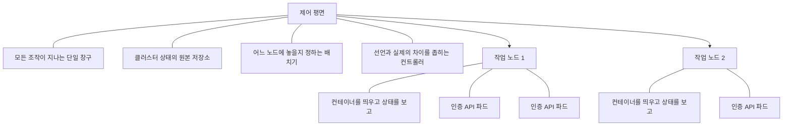
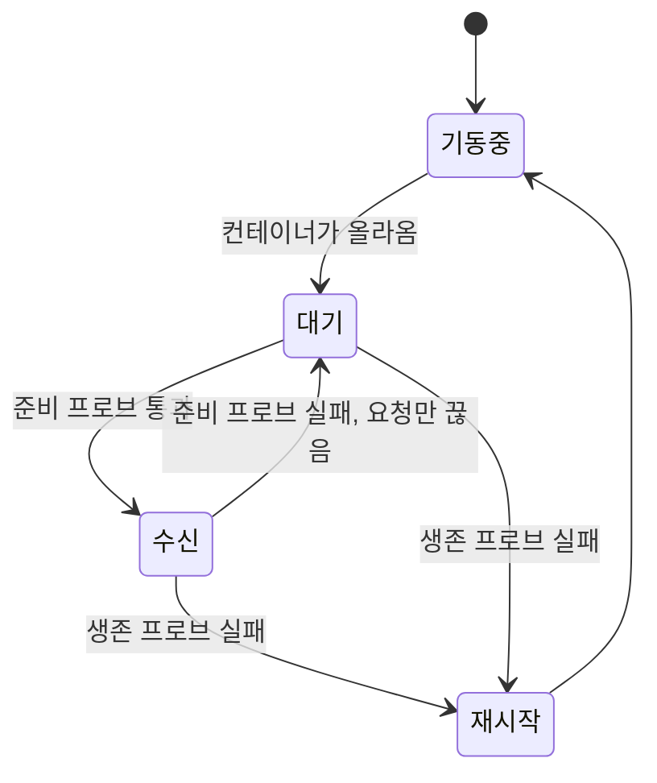

[앞 편](/blog/backend-engineering/session-vs-token-authentication/)은 만들 것을 다 만들어 놓고 세 가지를 그대로 넘겼다. 몇 개를 띄울 것인가, 환경마다 달라지는 값과 남에게 보이면 안 되는 값을 어디에 둘 것인가, 새 판을 올리는 동안 요청이 끊기지 않게 하려면 무엇이 필요한가다. 이 편이 맡는 구간이 그 셋이다.

여기서부터는 인증 로직을 다시 꺼내지 않는다. 로그인 상태를 어디에 둘지는 앞 편이 매듭지었고, 이 편은 그 판단이 **띄우는 모양에 어떤 조건을 걸어 두었는지**만 받아 쓴다. 대신 새로 갈리는 것이 생긴다. 죽은 것과 아직 준비되지 않은 것은 겉으로 똑같이 응답을 못 하는데, 둘에게 해야 할 일은 정반대다. 그 구분을 못 하면 설정은 멀쩡해 보이면서 서비스만 조용히 무너진다.

## 선언한 상태로 계속 되돌리는 판

클러스터는 크게 두 덩어리다. 무엇을 어디에 둘지 결정하는 쪽과, 결정된 것을 실제로 돌리는 쪽이다.



이 판의 성질은 **명령이 아니라 선언**이라는 데 있다. 「지금 서버를 한 대 더 띄워라」가 아니라 「복제본이 세 개인 상태를 유지하라」를 적어 두면, 실제 상태가 그 문장에서 벗어날 때마다 컨트롤러가 다시 끌어다 붙인다. 새벽에 노드 하나가 빠져도 아무도 깨우지 않아도 되는 까닭이 여기다. 반대로 말하면 **선언문이 틀리면 클러스터는 틀린 상태를 성실하게 유지한다.** 그래서 뒤에 나오는 값들은 취향이 아니라 근거를 갖고 적혀야 한다.

그 대신 갈리는 것이 있다. 선언을 받아들인 시점과 실제 상태가 거기 도달한 시점이 더 이상 같지 않다. 적용 명령이 성공했다고 새 버전이 요청을 받는 것은 아니라는 뜻이고, **배포가 끝났는지는 명령의 결과가 아니라 클러스터가 보고하는 현재 상태로 판단해야 한다**는 뜻이다.

## 요구가 오브젝트 이름을 얻는 자리

첫 편은 비기능 요구의 오른쪽 열을 쿠버네티스 이름이 아니라 요구 쪽 언어로 적었다. 「필요하니 장치가 있고, 그 장치의 이름이 이것이다」의 순서를 지키기 위해서다. 그 이름을 이제 채운다.

| 첫 편이 요구 쪽 언어로 적어 둔 것 | 클러스터에서 그 일을 맡는 것 |
| --- | --- |
| 한 대가 죽어도 나머지가 받는다 | 복제본 개수를 세는 컨트롤러가 사라진 수만큼 다시 만든다 |
| 죽은 컨테이너를 교체하고 준비 안 된 곳으로는 요청을 보내지 않는다 | 재시작 판정과 수신 판정을 각각 맡는 두 점검 |
| 지표에 따라 복제본 수를 늘리고 줄인다 | 사용률을 보고 파드 개수를 조절하는 오토스케일러 |
| 새 버전을 하나씩 올리고 준비된 것부터 받는다 | 배포 오브젝트가 갖는 교체 전략과 준비 판정 |

이름마다 맡은 일이 다르고, 그 차이는 **하나를 빼 보면** 드러난다.

| 오브젝트 | 맡는 일 | 없으면 무엇이 무너지나 |
| --- | --- | --- |
| 파드 | 배치의 최소 단위. 컨테이너 하나 이상이 네트워크와 볼륨을 함께 쓴다 | — |
| 레플리카셋 | 정해 둔 개수의 파드를 항상 채워 둔다 | 죽은 파드가 그대로 비어 있다 |
| 디플로이먼트 | 레플리카셋을 갈아 끼우며 버전 전환과 되돌리기를 맡는다 | 새 판을 무중단으로 올리거나 되돌릴 수 없다 |
| 서비스 | 파드 집합에 고정된 이름과 주소를 주고 요청을 나눈다 | 파드가 다시 뜰 때마다 주소가 달라져 부를 수가 없다 |
| 인그레스 | 바깥에서 들어온 요청을 경로와 호스트로 갈라 서비스에 넘긴다 | 서비스마다 부하 분산 장비를 따로 붙여야 한다 |
| 컨피그맵 | 환경마다 달라지는 **민감하지 않은** 값을 밖에서 주입한다 | 환경 하나가 늘 때마다 이미지를 다시 구워야 한다 |
| 시크릿 | 데이터베이스 암호나 서명 키처럼 보이면 안 되는 값을 주입한다 | 자격 증명이 코드와 이미지에 남는다 |

표의 첫 세 줄은 나란한 것이 아니라 **포개져 있다.** 파드를 직접 띄우면 그것이 죽는 순간 아무도 다시 만들지 않으므로, 사람이 손으로 적는 대상은 개수와 이미지를 함께 들고 있는 맨 위층이 되고 아래 둘은 거기서 파생된다.

마지막 두 줄이 앞 편이 넘긴 두 번째 질문의 답이다. 환경마다 다른 값과 감춰야 할 값은 **둘 다 이미지 밖으로 빼되 서로 다른 자리에** 둔다. 갈라 두는 이유는 취급이 다르기 때문이다 — 앞의 것은 배포 담당자가 열어 보며 고치는 값이고, 뒤의 것은 열람 권한 자체를 좁혀야 하는 값이다.

## 소스가 이미지로 굳어 클러스터에 닿기까지

배포는 한 번의 명령이 아니라 여러 단계를 지나는 사슬이다.


```dockerfile
FROM eclipse-temurin:17-jre-alpine
COPY build/libs/auth-*.jar app.jar
ENTRYPOINT ["java","-jar","/app.jar"]
```

이 사슬에서 값을 가장 많이 청구하는 것은 **태그**다. 움직이는 이름을 태그로 쓰면 지금 떠 있는 것이 어느 커밋인지 특정할 수 없고, 노드에 남은 캐시 때문에 새로 뜬 파드가 옛 이미지를 들고 있을 수도 있다. 어느 쪽이든 되돌릴 지점을 잃는다. 커밋 해시나 버전 번호처럼 **한 번 붙으면 두 번 다시 다른 것을 가리키지 않는 이름**이어야 한다. 이미지를 실행에 필요한 것만 담아 가볍게 유지하는 것도 취향 문제가 아니다 — 내려받는 시간이 그대로 확장과 교체의 지연이 된다.

사슬 중간에 **더 손댈 수 없는 지점**이 하나 생기는 것도 중요하다. 같은 태그를 덮어쓰지 않는 한 올라간 이미지의 내용물은 바뀌지 않으므로, 어느 환경에 올리든 도는 것은 같은 바이트가 되고 환경 사이의 차이는 전부 밖에서 주입되는 값으로 몰린다.

이 사슬을 빈 폴더에서 세워 본 기록은 [따로 적어 두었다](/blog/agentic-coding/empty-folder-to-deploy/).

## 매니페스트는 판단을 값으로 적은 문서다

앞의 논의가 실제로 남는 곳은 선언 파일 한 장이다.

```yaml
apiVersion: apps/v1
kind: Deployment
metadata: { name: auth-api }
spec:
  replicas: 3
  strategy:
    type: RollingUpdate
    rollingUpdate: { maxSurge: 1, maxUnavailable: 0 }
  template:
    spec:
      containers:
        - name: auth-api
          image: registry/auth:1.2.0
          envFrom:
            - configMapRef: { name: auth-config }
            - secretRef:    { name: auth-secret }
          readinessProbe:
            httpGet: { path: /actuator/health/readiness, port: 8080 }
          livenessProbe:
            httpGet: { path: /actuator/health/liveness, port: 8080 }
```

복제본을 셋으로 잡은 것은 하나가 빠져도 남은 둘이 평상시 부하를 감당하면서 교체까지 돌 수 있는 최소치이기 때문이다. 값을 밖에서 주입하는 두 줄에는 조건이 하나 붙는다 — 환경변수로 넣은 값은 컨테이너가 뜰 때 한 번 읽히므로, **설정만 고치는 변경도 결국 파드가 새로 떠야 반영된다.**

눈여겨볼 값은 `maxUnavailable: 0`이다. 교체가 진행되는 동안에도 받을 수 있는 파드 수가 한 번도 줄지 않는다는 뜻이고, 그 대가로 교체가 한 칸씩 느리게 진행된다. 인증이 멎는 순간 사내 전 시스템이 로그인에서 멈춘다던 첫 편의 문장이 여기서 숫자 하나로 번역된 것이다. 성격이 다른 서비스였다면 이 자리에 다른 숫자가 들어가는 것이 맞다.

## 갈아 끼우는 네 가지 방식

무중단이라는 말 하나에 실제로는 네 갈래가 들어 있다.

| 전략 | 어떻게 바꾸나 | 얻는 것 | 치르는 것 |
| --- | --- | --- | --- |
| 통째 교체 | 옛 것을 전부 내린 뒤 새 것을 올린다 | 절차가 단순하고 버전이 섞이지 않는다 | **중단 구간이 생긴다** |
| 순차 교체 | 정해진 폭만큼 조금씩 바꿔 나간다 | 중단 없이 넘어간다 | 두 버전이 함께 떠 있어 서로 맞물려야 한다 |
| 두 벌 전환 | 새 환경을 통째로 띄워 두고 입구를 옮긴다 | 문제가 나면 입구만 되돌리면 끝난다 | 잠시 자원을 두 배로 쓴다 |
| 일부 노출 | 소수의 요청만 새 버전으로 흘린다 | 문제가 퍼지는 범위가 작다 | 요청을 나누고 지켜볼 장치가 따로 필요하다 |

네 줄을 가르는 축은 중단이 있느냐가 아니라 **한 번에 위험에 노출되는 양**이다. 아래로 갈수록 잘못된 버전에 닿는 요청이 줄지만, 뒤의 두 줄은 환경을 하나 더 유지하거나 요청을 비율로 나누고 지켜보는 체계가 먼저 있어야 성립한다. 그래서 고르는 기준은 「어느 것이 가장 안전한가」가 아니라 「지금 있는 장치로 어디까지 갈 수 있는가」다. 앞 절의 두 값이 두 번째 줄의 조절 손잡이인데, 받는 쪽 용량이 얇아지지 않게 잡으면 교체가 느려지고 반대로 잡으면 빨리 끝나는 대신 남은 파드에 부하가 몰린다.

두 번째 줄이 기본값이 되는데, 그 대가가 실무에서 가장 자주 사고로 돌아온다. 교체가 도는 동안 옛 버전과 새 버전이 같은 데이터베이스를 함께 본다는 뜻이기 때문이다. 이 구간에 컬럼을 지우거나 이름을 바꾸면 아직 남아 있는 옛 파드가 그 자리에서 깨진다. 그래서 파괴적인 변경은 **먼저 더하고, 양쪽이 함께 쓰다가, 옮기고, 마지막에 지우는** 여러 번의 배포로 나눠야 한다. 무중단은 배포 설정만으로 얻어지지 않고 스키마 변경 습관까지 따라와야 성립한다.

## 살아 있는가와 받을 준비가 되었는가는 다른 질문이다

겉으로는 둘 다 「응답이 없다」로 보인다. 그런데 물어보는 질문이 다르고, 답이 아니오일 때 해야 할 일이 정반대다.

| 항목 | 생존 프로브 | 준비 프로브 |
| --- | --- | --- |
| 묻는 것 | 이 컨테이너가 아직 살아 있는가 | 지금 요청을 넘겨도 되는가 |
| 실패했을 때 | **컨테이너를 재시작한다** | 요청 대상 목록에서만 빼고 재시작은 하지 않는다 |
| 대표적인 실패 원인 | 교착, 빠져나오지 못하는 반복 | 아직 데우는 중, 연결을 아직 못 잡음 |
| 잘못 잡으면 | 기동이 느린 앱이 재시작을 반복한다 | 준비되지 않은 곳으로 요청이 흘러 오류가 난다 |



두 점검이 성립하려면 애플리케이션이 **자기 상태를 스스로 답해 주어야 한다.** 포트가 열려 있다는 사실만으로는 아무것도 증명되지 않는다. 연결을 아직 잡지 못한 상태에서도 포트는 이미 열려 있고, 그 사이에 들어온 요청은 그대로 실패한다. 그래서 두 질문에 각각 답하는 경로를 애플리케이션이 따로 내놓고, 그 경로가 무엇을 근거로 답하는지까지 정해 두어야 점검이 판단의 근거가 된다.

가장 흔한 사고는 화살표 하나를 잘못 연결하는 데서 난다. 생존 프로브의 첫 검사 시각을 너무 이르게 잡으면 애플리케이션이 다 올라오기도 전에 실패로 찍히고, 재시작한 컨테이너가 또 같은 자리에서 죽는다. 뜨는 데 오래 걸리는 앱은 초기 구간만 따로 보는 기동 프로브로 떼어 내야 이 고리가 끊긴다. 준비 프로브에 데이터베이스 확인을 넣을지도 저울질이다. 넣으면 정확해지지만, 데이터베이스가 잠깐 끊기는 순간 모든 파드가 **동시에** 빠져 서비스가 통째로 멈춘다.

## 복제본을 늘리려면 상태가 없어야 한다

늘리는 방법 자체는 여러 층에 걸쳐 있다.

| 방식 | 무엇을 늘리나 | 무엇이 방아쇠인가 |
| --- | --- | --- |
| 사람이 직접 | 복제본 개수 | 예정된 행사처럼 미리 아는 부하 |
| 파드 오토스케일러 | 복제본 개수 | 사용률이나 직접 정한 지표 |
| 자원 요청량 조절기 | 파드 하나가 요구하는 자원 | 실제 사용 패턴의 누적 |
| 노드 오토스케일러 | 노드 수 | 놓을 자리가 없어 대기 중인 파드 |

두 번째 줄이 성립하려면 조건이 하나 붙는다. **애플리케이션이 상태 없음이어야 한다.** 어떤 파드가 요청을 받든 같은 답이 나와야 새로 뜬 파드가 곧바로 제 몫을 한다. 로그인 상태를 각 인스턴스의 메모리에 두면 그 순간 애플리케이션은 상태 있음이 되고, 새로 뜬 파드는 방금 로그인한 사람을 알지 못한다. 앞 편이 수평 확장 쪽 요구를 서명된 짧은 접근 토큰에 배정한 이유가 여기서 드러난다 — 그 판단은 인증 방식의 선택으로 보였지만 실은 **배포 형태를 미리 정한 결정**이었다.

한 가지 더 딸려 온다. 파드가 요구하는 자원의 하한을 적어 두지 않으면 배치기가 어느 노드에 여유가 있는지 계산할 수 없고, 사용률을 기준으로 삼는 자동 조절도 분모가 없어 성립하지 않는다. 자동으로 늘어나기를 기대하려면 먼저 **얼마를 쓸 것인지 선언**해 두어야 한다.

## 코드가 아니라 데이터를 고치는 자리

요구는 띄운 뒤에 오히려 늘어난다. 미리 알 수 있는 것은 무엇이 올지가 아니라 그것이 **어느 지점을 건드릴지**다.

| 나중에 올 만한 요구 | 건드리는 곳 | 미리 해 둘 수 있는 것 |
| --- | --- | --- |
| 부서 단위로 권한을 준다 | 권한을 조회하는 부분 | 역할을 개인뿐 아니라 조직 단위에도 걸 수 있게 열어 둔다 |
| 조직장의 권한이 팀원에게 내려간다 | 권한을 계산하는 부분 | 역할 사이에 상하 관계를 둘 자리를 만든다 |
| 바깥 서비스 계정으로 로그인한다 | 인증이 시작되는 지점 | 인증 수단을 갈아 끼울 수 있는 경계로 분리한다 |
| 누가 무엇을 했는지 남긴다 | 사실상 모든 API | 요청을 가로채는 공통 지점에서 한 번에 처리한다 |
| 로그인 유지 시간을 바꾼다 | 토큰을 발급하는 부분 | 만료 시간을 이미지 밖 설정값으로 빼 둔다 |

오른쪽 열을 관통하는 원칙은 다섯 줄로 정리된다. 권한을 개인이 아니라 역할에 걸어 인사 이동이 매핑 한 행의 수정으로 끝나게 하고, 그 규칙 자체를 코드가 아니라 **정책 데이터**로 표현해 새 API 하나를 허용하는 데 배포가 필요 없게 한다. 만료 시간과 서명 키처럼 환경을 타는 값은 이미지 밖으로 빼고, 누가 무엇을 했는지 남기는 일은 API 마다 흩지 않고 요청을 가로채는 공통 지점에 모은다. 그리고 앞 편이 세운 계층 경계를 유지해 인증 수단이 바뀌어도 그 아래가 흔들리지 않게 둔다.

가장 값이 큰 것은 두 번째다. 조직 규칙을 조건문으로 박아 두면 직무가 하나 늘 때마다 배포가 필요하지만, 같은 규칙이 **정책 데이터**로 표현되어 있으면 운영 화면에서 행 하나를 넣는 일이 된다. 앞 편들에서 매핑 테이블을 굳이 따로 둔 결정이 배포 이후에 값을 돌려주는 자리가 여기다.

## 정리

이 편이 한 일은 앞에서 내린 판단들이 **띄우는 모양에 어떤 값을 요구하는지** 확인한 것이다. 공통 의존 대상이라는 성격이 교체 중 가용 파드 수의 하한을 0이 아닌 값으로 못 박았고, 로그인 상태를 서명된 문자열에 실어 보낸 선택이 인스턴스를 상태 없음으로 유지해 주었으며, 조직이 바뀐다는 전제가 규칙을 정책 데이터 쪽에 두게 했고, 환경을 타는 값과 감출 값은 이미지 밖 서로 다른 자리로 밀려났다. 어느 것도 쿠버네티스를 쓰기로 해서 생긴 값이 아니다.

새로 갈린 것은 하나다. **살아 있음과 받을 준비됨은 같은 증상으로 보이지만 처방이 정반대다.** 준비 여부를 생존 프로브로 판정하면 멀쩡한 컨테이너가 재시작을 반복하고, 생존 여부를 준비 프로브로 판정하면 죽은 파드가 재시작 없이 목록에서만 빠진다. 두 종류를 갈라 적는 순간부터 설정 파일이 무엇을 주장하는 문서가 된다.

남은 것은 경계를 지키지 않는 질문들이다. 왜 그 방식을 골랐느냐는 물음은 인증 방식을 훑던 편과 로그인 상태를 저울질하던 편에 함께 걸리고, 로그인이 안 된다는 신고 하나의 원인은 검사 순서에도 생존·준비 두 프로브의 설정에도 있을 수 있다. 다음 편은 그래서 앞의 다섯 편을 편 순서가 아니라 **선택지 · 실패 모드 · 문답으로 다시 엮는다.**
