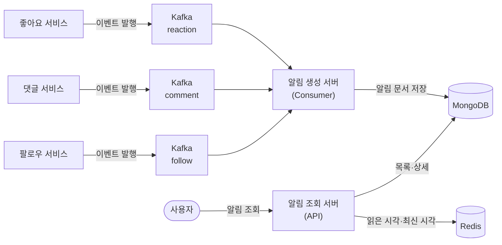

소셜 서비스의 알림 탭은 화면만 보면 한 줄짜리 목록이다. 「ooo님이 회원님의 사진을 좋아합니다」가 최신순으로 쌓이고, 누르면 그 게시물로 넘어가고, 아직 보지 않은 것 위에는 빨간 점이 붙는다. 요구사항으로 적으면 다섯 줄이면 끝난다.

그 다섯 줄이 어려워지는 지점은 기능이 아니라 **비대칭**이다. 알림을 읽는 부하는 접속자 수에 비례해 완만하게 늘지만, 알림을 만드는 부하는 사건 하나가 수신자 수만큼 불어난다. 인기 계정의 게시물에 좋아요가 초당 수천 건씩 들어오면 알림을 **만드는** 일이 서버의 스레드와 커넥션을 전부 가져가고, 아무 잘못도 없는 알림 **조회** 요청이 그 뒤에 줄을 선다.

비대칭이 하나 더 있다. 알림은 부가 기능인데, 좋아요를 누르는 순간 알림 서버를 동기로 호출하는 구조라면 그 부가 기능이 죽을 때 핵심 기능인 좋아요까지 함께 실패한다. **중요도는 알림이 낮은데 장애가 번지는 방향은 알림에서 좋아요로 흐른다.** 설계가 손대야 하는 것이 이 어긋남이다.

이 설계가 푸는 문제는 그래서 한 문장으로 줄어든다. **「늦어도 되는 일이 늦으면 안 되는 일을 붙잡지 않게, 죽어도 되는 일이 죽으면 안 되는 일을 끌고 가지 않게 경로를 어떻게 끊는가.」** 끊는 도구는 셋이다 — 서버를 쪼개고, 사이에 브로커를 끼우고, 쪼갠 뒤에도 도메인 코드는 한 벌로 남기는 것이다.

이 글은 다섯 편의 지도다. 「어떻게」는 뒤의 네 편이 나눠 가지므로 여기서 그리는 것은 지형뿐이다 — 알림 한 건이 지나는 경로, 요구사항의 어느 문장이 이미 설계를 확정해 버렸는지, 어떤 낱말이 편마다 다른 것을 가리키는지, 그리고 무엇이 어느 편에 있는지다.

## 알림 한 건이 지나는 길

좋아요 한 번이 알림 한 줄이 되기까지 지나는 것을 전부 그리면 이렇게 된다.

도식에서 눈여겨볼 것은 화살표가 **한 방향으로만 흐른다**는 점이다. 좋아요 서비스는 알림 생성 서버를 알지 못한 채 브로커에 이벤트만 던지고, 알림 생성 서버는 조회 서버를 알지 못한 채 저장소만 갱신하며, 조회 서버는 그 저장소를 읽을 뿐 생성 쪽을 호출하지 않는다. 세 구간 중 어디가 멈춰도 **호출한 쪽으로 되돌아가는 화살표가 없어서** 장애가 상류로 번지지 않는다.

도식의 위쪽 줄기와 아래쪽 줄기를 갈라 보면 워크로드 둘이 성격부터 다르다는 것이 드러난다.

| 축 | 알림 생성(쓰기) | 알림 조회(읽기) |
| --- | --- | --- |
| 트래픽 모양 | 사건에 따라 튀는 스파이크형 | 접속 수에 비례하는 완만형 |
| 지연 허용 | 수 초 늦어도 사용자는 모른다 | 수십 밀리초. 늦으면 화면이 빈다 |
| 늘릴 신호 | 밀린 메시지 수(Consumer Lag) | 응답시간·초당 요청 수 |
| 실패했을 때 | 다시 처리하면 된다 | 다시 처리할 기회가 없다 |

결정적인 것은 **지연 허용** 행이다. 늦어도 되는 쪽과 늦으면 안 되는 쪽을 한 서버에 두면 늦어도 되는 쪽이 늦으면 안 되는 쪽을 인질로 잡는다. 서버를 쪼개는 근거는 「부하가 크니까」가 아니라 **두 워크로드의 요구 지표가 다르고 그래서 늘리는 기준도 달라야 하기 때문**이다.

## 이 설계가 푸는 문제는 세 겹이다

앞의 도식은 결과물이고, 거기 도달하기까지 서로 다른 문제 셋을 차례로 푼다.

| 겹 | 문제 | 손대는 것 | 맡는 편 |
| --- | --- | --- | :---: |
| 부하 격리 | 생성 폭주가 조회 응답을 끌어내린다 | 조회 서버와 생성 서버를 분리해 따로 늘린다 | 편2 |
| 장애 격리 | 알림 서버 장애가 좋아요·댓글로 역전파된다 | 동기 호출을 브로커를 통한 비동기 단방향으로 바꾼다 | 편2·편3 |
| 코드 중복 | 서버를 쪼개면 같은 알림 도메인 코드가 두 벌이 된다 | 한 프로젝트 안의 멀티모듈로 `core`를 공유한다 | 편2 |

세 번째 겹은 앞의 둘을 푼 **대가로 생긴 문제**라는 점에서 성격이 다르다. 부하와 장애를 격리하려고 서버를 둘로 나눴더니 알림이 무엇인지 아는 코드가 두 곳에 생긴다. 저장소 스키마를 한쪽만 고치면 다른 쪽이 조용히 어긋나므로 이것은 취향이 아니라 정합성 문제다. 그래서 이 시리즈는 서버를 **배포 단위로는 쪼개되 코드베이스로는 쪼개지 않는** 쪽을 고른다.

더 밀고 나가면 서비스마다 저장소와 팀까지 나누는 MSA가 되는데, 이 설계는 **거기까지 가지 않는 이유**를 함께 다룬다. 네트워크 경계를 하나 그으면 부분 실패·지연·분산 추적·정합성이 전부 새 비용으로 붙기 때문이다. 그 판단의 기준은 조직에서 오고, 편2가 그 자리를 맡는다.

## 요구사항이 이미 설계를 정해 놓은 자리

알림센터의 요구사항은 화면 명세처럼 생겼지만, 그중 몇 줄은 읽는 순간 구현 방식을 확정해 버린다.

| # | 정책 | 명세가 확정하는 것 |
| :---: | --- | --- |
| 01 | 좋아요·댓글·팔로우 알림. 누르면 게시물로 이동 | 알림 종류마다 필드가 다르다 |
| 02 | 최신순 정렬 | 발생 시각이 정렬 키이자 페이징 커서다 |
| 03 | 보관 주기 최대 90일 | 만료 삭제를 누가 할지 정해야 한다 |
| 04 | 읽지 않은 알림은 목록에서 선으로 구분 | 「어디까지 읽었나」의 경계가 필요하다 |
| 05 | 새 알림은 빨간 점으로 표시 | 앱이 주기적으로 물어보는 API가 하나 생긴다 |

오른쪽 열은 각각 다른 답으로 이어진다. 01은 저장소를 문서형으로 고르는 근거가 되고, 02는 커서 페이징을, 03은 만료 인덱스를, 04는 읽은 시각 한 값으로 경계를 긋는 설계를, 05는 캐시를 부른다. 편4가 다섯 줄을 전부 회수한다.

종류별 명세에는 더 센 문장이 하나 숨어 있다.

| 구분 | 좋아요 알림 | 댓글 알림 | 팔로우 알림 |
| --- | --- | --- | --- |
| 메시지 | 1명일 때 「ooo님이 좋아합니다」 N명일 때 「ooo님 외 N−1명이 …」 | 「ooo님이 댓글을 남겼습니다」 | 「ooo님이 팔로우하기 시작했습니다」 |
| 시간 기준 | 좋아요 발생 시각 | 댓글 발생 시각 | 팔로우 발생 시각 |
| 읽지 않음 표시 | 최초 1회만 | 최초 1회만 | 최초 1회만 |

**「ooo님 외 N−1명」이 알림 생성을 단순한 저장이 아니게 만든다.** 좋아요마다 알림을 한 건씩 새로 쌓으면 게시물 하나가 알림 수천 건이 되고 화면에는 같은 문장이 수천 줄 늘어선다. 그래서 알림은 게시물 단위로 하나만 두고 그 안에 사용자를 모으는 **집계 문서**가 된다. 취소가 오면 그 사용자를 빼고, 마지막 한 명까지 빠지면 알림 자체를 지운다.

이 한 줄이 뒤의 두 편을 동시에 건드린다. 저장 쪽에서는 삽입이 아니라 **갱신을 겸한 저장과 삭제**가 되고(편4), 메시지 쪽에서는 같은 사건을 두 번 받아도 결과가 같아야 한다는 조건이 붙는다(편3). 이 시리즈에서 중복을 견디는 힘은 별도 장치가 아니라 **집계 문서라는 도메인 모델 자체에서** 나온다.

## 낱말이 갈리는 자리

시리즈 첫 글이 어휘를 한 뜻으로 못 박지 않으면, 뒤의 편이 다른 뜻으로 쓸 때 독자가 걸린다. 이 원본에서 실제로 갈리는 것 셋을 먼저 갈라 둔다.

| 낱말 | 갈리는 뜻 | 이 시리즈의 표기 |
| --- | --- | --- |
| **파티션** | ① 토픽을 쪼갠 Kafka의 병렬 단위 ② 큰 테이블을 쪼개는 데이터베이스의 분할 | 수식어 없는 「파티션」은 **Kafka 파티션**이다. 데이터베이스 쪽은 반드시 「DB 파티셔닝」으로 적는다 |
| **모듈** | ① 한 프로젝트 안에서 빌드가 갈리는 단위 ② 따로 띄워 트래픽을 받는 배포 단위 | 「모듈」은 **빌드 단위**다. 따로 띄우는 쪽은 「실행 모듈」로 적는다 |
| **이벤트** | ① 좋아요·댓글 같은 도메인 사건 ② 브로커에 실려 오가는 메시지 | 「이벤트」는 **도메인 사건**이다. 실려 오가는 것은 「메시지」로 적는다 |

갈리는 이유는 행마다 다르다. 「파티션」은 분야 둘이 같은 낱말을 각자 가져다 쓴 경우이고, 「모듈」은 이 설계가 빌드 경계와 배포 경계를 일부러 어긋나게 잡아서 갈리며, 「이벤트」는 도메인 언어와 미들웨어 언어가 한자리에서 만나 갈린다.

특히 「파티션」은 이 카테고리 안의 다른 시리즈까지 가로지른다. [파티셔닝을 다루는 시리즈](/blog/backend-engineering/partitioning-fundamentals/)가 이미 그 낱말을 데이터베이스 뜻으로 쓰는데, 거기서 쪼개는 목적은 **운영 작업의 단위를 줄이는 것**인 반면 이 시리즈가 파티션을 쪼개는 목적은 **읽는 쪽의 병렬도를 올리는 것**이다. 그래서 편3은 혼동이 생기는 자리마다 「Kafka 파티션」이라고 한정어를 붙인다.

## 용어 정리

원본 사전의 23개를 그대로 옮기되, 뜻은 이 시리즈가 실제로 쓰는 자리에 맞춰 다시 적었다. 특정 편에서만 쓰는 설정값과 API 이름은 그 편이 처음 쓰는 자리에서 정의한다.

### 도메인과 확산

| 용어 | 원어 | 뜻 |
| --- | --- | --- |
| SNS | Social Network Service | 소셜 네트워크 서비스. 이 시리즈의 도메인은 그중에서도 사진 게시물에 붙는 알림 탭 하나다 |
| Fan-out | — | 사건 1건이 수신자 N명의 알림 N건으로 불어나는 것. 읽기와 쓰기의 부하 비대칭이 여기서 생긴다. [정적 팬아웃의 한계](/blog/ai-agent/newsletter-agent-static-fanout/)에서 같은 낱말이 갈래 수의 뜻으로 쓰인다 |

### Kafka의 구조

| 용어 | 원어 | 뜻 |
| --- | --- | --- |
| Broker | Kafka Broker | 클러스터를 이루는 서버 노드 한 대. 파티션 데이터를 실제로 디스크에 들고 있는 주체이고, 노드가 늘면 파티션이 그 위로 흩어진다 |
| Topic | — | 메시지가 모이는 논리적 채널. 발행하는 쪽과 구독하는 쪽은 이 이름 하나로만 이어지고, 서로의 주소나 생사는 알지 못한다 |
| Partition | — | 토픽을 물리적으로 쪼갠 단위. 여러 브로커에 나뉘어 저장되고, **병렬 처리의 단위이자 순서 보장의 경계**다 |
| Offset | — | 파티션 안에서 메시지에 매겨진 순번. 소비자가 어디까지 읽었는지를 가리키는 커서 노릇을 한다 |
| Consumer Group | — | 같은 토픽을 나눠 읽는 소비자 집합. 파티션 하나는 그룹 안에서 소비자 하나에만 배정된다 |
| Rebalance | — | 그룹의 구성원이 늘거나 줄 때 파티션 소유권을 다시 나눠 주는 과정. 진행되는 동안 그룹 전체의 소비가 잠시 멈춘다 |
| ISR | In-Sync Replicas | 리더와 동기화가 유지되는 복제본 집합. 발행 확인을 가장 엄격하게 잡으면 이 집합 전체가 반영될 때까지 기다린다 |
| Zookeeper / KRaft | — | 클러스터 메타데이터와 리더 선출을 관리하는 층. 최신 Kafka는 Zookeeper 의존을 걷어낸 KRaft 모드를 쓴다 |

### 전달 보장과 실패 처리

| 용어 | 원어 | 뜻 |
| --- | --- | --- |
| at-least-once | — | 최소 한 번은 전달한다는 보장. 유실은 없는 대신 중복이 생기므로 받는 쪽에 멱등성이 필요하다 |
| at-most-once | — | 많아야 한 번 전달한다는 보장. 중복은 없는 대신 유실이 생긴다. 알림은 중복보다 유실이 나쁘므로 고르지 않는 쪽이다 |
| exactly-once | — | 정확히 한 번. Kafka 트랜잭션으로 브로커 안에서는 성립하지만, 바깥 저장소까지 묶어 주지는 않는다 |
| 멱등성 | Idempotency | 같은 메시지를 여러 번 처리해도 결과가 한 번 처리한 것과 같은 성질. 중복 전달을 견디는 힘이 여기서 나온다 |
| DLQ | Dead Letter Queue | 반복해서 실패한 메시지를 따로 옮겨 두는 토픽. 본질은 보관이 아니라 **뒤의 정상 메시지를 진행시키는 것**이다 |
| Consumer Lag | — | 파티션의 최신 오프셋에서 소비자가 커밋한 오프셋을 뺀 값. 얼마나 밀렸는지를 알려 주는 운영 제1 지표다 |

### 경계와 저장

| 용어 | 원어 | 뜻 |
| --- | --- | --- |
| MSA | Microservice Architecture | 서비스를 독립 배포 가능한 단위로 쪼갠 구조. 저장소와 팀까지 함께 갈라지며, 이 시리즈는 그 앞 단계인 멀티모듈에서 멈추는 근거를 다룬다 |
| TTL | Time To Live | 데이터가 살아 있는 기간. 보관 90일 정책을 따로 도는 삭제 배치가 아니라 저장소 자체의 기능으로 푸는 수단이 된다 |
| Pivot 방식 | Cursor / Keyset pagination | 페이지 번호 대신 기준값을 넘겨 다음 묶음을 받는 페이징. 목록에 새 항목이 계속 들어와도 경계가 흔들리지 않는다 |

### 프레임워크와 도구

| 용어 | 원어 | 뜻 |
| --- | --- | --- |
| Spring Cloud Stream | — | 브로커를 함수 단위로 추상화한 프레임워크. Kafka와 RabbitMQ를 코드 변경 없이 갈아 끼우는 것을 노린다 |
| Binder / Binding | — | Binder는 브로커 연결을 감싸는 구현이고, Binding은 그 연결과 애플리케이션 함수를 이어 붙인 통로다 |
| Springdoc | springdoc-openapi | 코드에서 OpenAPI 문서를 뽑아내는 라이브러리. 조회 서버가 내보내는 API 3종의 명세가 구현과 따로 놀지 않게 잡아 준다 |
| Testcontainers | — | 테스트를 돌릴 때 실제 미들웨어를 컨테이너로 띄워 주는 라이브러리. 브로커와 저장소를 흉내 내지 않고 진짜로 검증한다 |

## 이 시리즈의 구성

뒤의 네 편은 앞의 도식을 왼쪽 끝에서 출발해 오른쪽으로 따라간다 — 경계, 메시징, 그리고 알림이 담기고 읽히는 끝자리 순이다.

| 편 | 다루는 구간 | 답하는 질문 |
| :---: | --- | --- |
| **1** | 지형 전체 (이 글) | 무엇을 왜 쪼개고, 낱말은 무슨 뜻인가 |
| [**2**](/blog/backend-engineering/read-write-separation-and-multimodule/) | 조회·생성 분리와 멀티모듈 | 경계를 어디에 긋고 어디서 멈추는가 |
| [**3**](/blog/backend-engineering/kafka-messaging-and-delivery-guarantees/) | Kafka 구조와 전달 보장 | 한 번 이상 오는 것을 한 번처럼 다루려면 |
| [**4**](/blog/backend-engineering/notification-storage-and-query-performance/) | 저장소 선택과 조회 성능 | 쌓이기만 하는 데이터를 빠르게 읽으려면 |
| [**5**](/blog/backend-engineering/kafka-notification-qna/) | 문답 | 고를 때 · 터졌을 때 · 설명해야 할 때 |

**편2 — 경계를 어디에 그을 것인가.** 조회와 생성을 쪼갠 다음, 쪼갠 서버들이 도메인 코드를 한 벌로 공유하도록 모듈을 나눈다. 모듈 사이의 의존은 한 방향으로만 흐르게 두는데, 그 방향이 깨지면 멀티모듈은 폴더만 나뉜 덩어리로 되돌아간다. 후반은 한 발 더 나가면 만나는 MSA를 놓고 넘어갈 신호가 어디서 오는지를 다룬다.

**편3 — 한 번 이상 오는 메시지.** 브로커의 구성 요소와, 파티션 수가 소비자 수의 상한을 정한다는 규칙에서 시작한다. 이어서 값비싼 셋을 다룬다 — 순서는 파티션 안에서만 보장된다는 것, 최소 한 번 전달의 대가로 중복을 견뎌야 한다는 것, 영원히 실패하는 메시지 한 건이 뒤의 수십만 건을 막지 않게 하는 방법이다.

**편4 — 담는 자리와 읽는 자리.** 저장소를 문서형으로 고른 근거를 도메인 특성에서 끌어내고, 같은 논리라면 정합성이 우선인 도메인에서 왜 반대로 골랐어야 하는지도 적는다. 뒤쪽 절반은 조회 성능이다 — 기준값으로 넘기는 페이징, 읽음 처리를 시각 한 값으로 푸는 설계, 가장 자주 불리는 API를 캐시로 받는 자리다.

**편5 — 되돌아오는 질문.** 그 질문들은 편의 경계를 가로지른다. 「왜 저 브로커를 골랐나」는 편3과 편4에 걸치고, 「알림이 안 온다」는 편3의 지연에서도 편4의 인덱스에서도 시작된다. 그래서 설계 선택지·실패 모드·문답 세 벌로 다시 짠다.

## 정리

알림센터를 어렵게 만드는 것은 알림 자체가 아니라 **알림이 다른 기능에 얹혀 있다는 사실**이다. 좋아요와 댓글은 알림 없이도 성립하지만 알림은 그 사건들 없이 성립하지 않고, 그래서 알림 쪽의 부하와 장애는 늘 자기보다 중요한 기능 쪽으로 번질 자리에 있다.

끊고 나면 대가가 남는다. 동기 호출을 비동기로 바꾼 대가는 **지연과 중복**이고, 서버를 쪼갠 대가는 **코드가 두 벌이 될 위험**이며, 정합성보다 유연성을 고른 대가는 **트랜잭션을 쓸 수 없는 구간**이다. 뒤의 세 편이 그 대가를 하나씩 받아 든다.

다음 편은 가장 먼저 그어야 하는 선을 다룬다. 조회와 생성을 왜 다른 속도로 늘려야 하는지, 쪼갠 서버들이 어떻게 도메인 코드를 한 벌로 유지하는지, 그 경계를 더 밀어 서비스까지 쪼개는 판단은 무엇을 보고 내리는지다.
