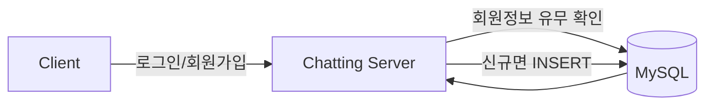
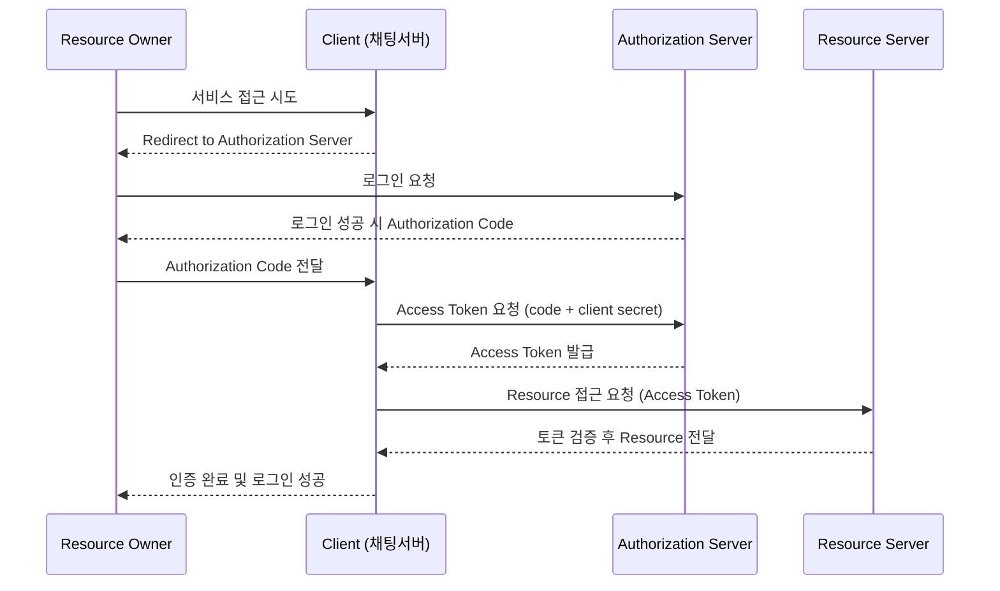
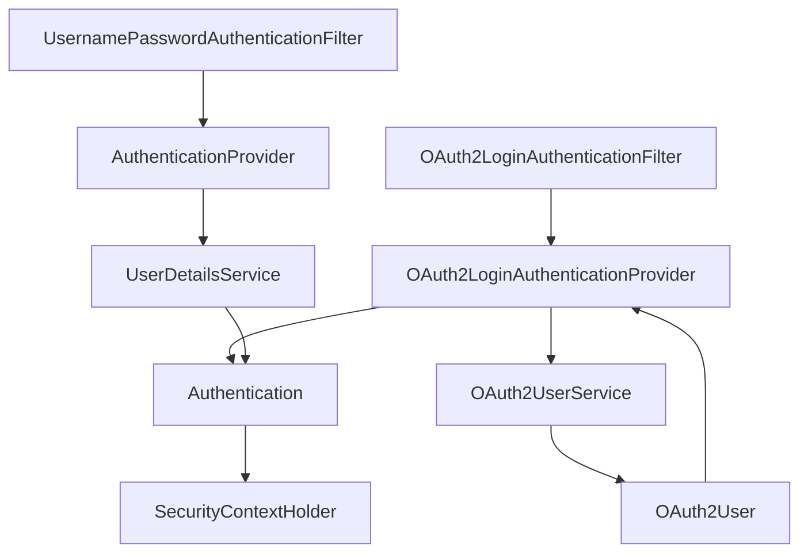
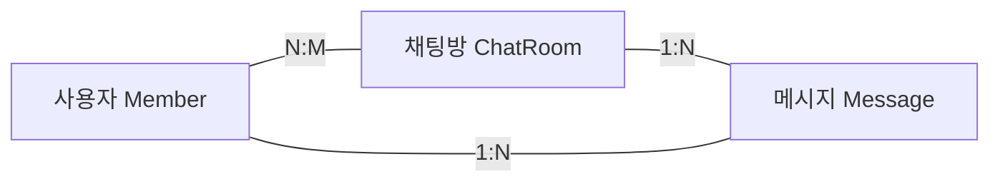
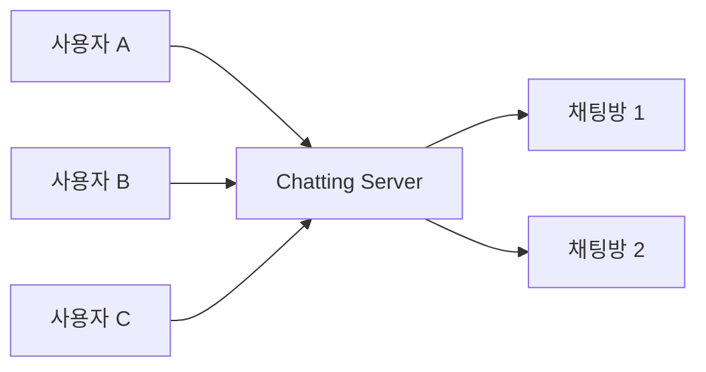
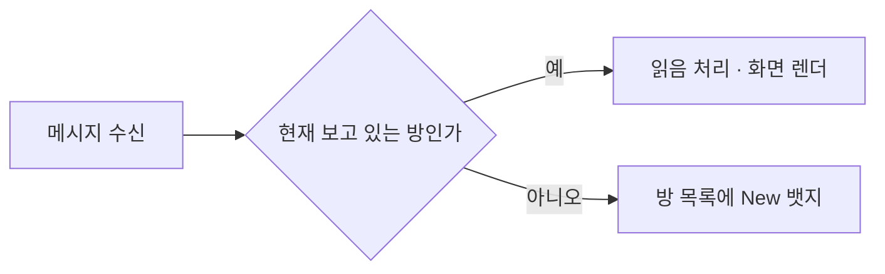
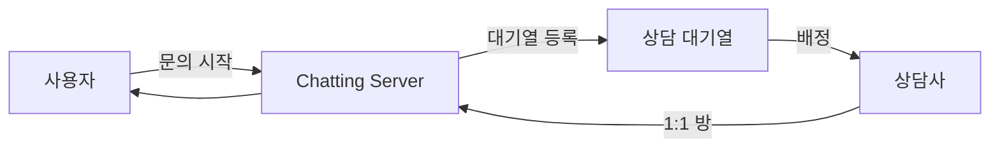

앞 편에서 인증이 걸리는 두 지점을 정했다. 남은 것은 그 지점에서 무엇을 검사할 것인가다. 자체 회원가입만 받는다면 비밀번호를 저장하고 대조하면 되지만, 그 순간 우리는 **남의 비밀번호를 보관하는 책임**을 진다. 유출되면 그 사용자가 다른 서비스에서 쓰는 비밀번호까지 함께 새는 종류의 책임이다.

소셜 로그인은 그 책임을 지지 않으면서 사용자를 식별하는 방법이다. 카카오나 구글이 "이 사람이 맞다"고 보증해 주고, 우리는 그 보증만 받는다. 이 글은 그 보증이 어떤 순서로 오는지, Spring Security가 그것을 기존 인증 경로에 어떻게 끼워 넣는지를 본다. 그리고 인증이 끝난 뒤 비로소 시작되는 것 — 방과 메시지를 어떤 모양으로 저장할 것인가 — 까지 다룬다.

## 저장소가 먼저 필요하다

인증을 붙이기 전에 사용자를 어디에 둘지가 정해져야 한다. 이 설계가 고른 조합과 이유는 이렇다.



| 요소 | 선택 | 이유 |
|---|---|---|
| Docker | MySQL을 컨테이너로 기동 | 로컬·CI·운영 환경 동일화. 설치 없이 버전 고정 |
| MySQL | 회원·채팅방·메시지 저장 | 오픈소스 RDB, 관계 모델과 무결성이 필요 |
| Spring Data JPA | ORM 표준(JPA) 위 리포지토리 추상화 | 객체-테이블 매핑, 보일러플레이트 제거 |

가운데 행이 뒤에서 다시 문제가 된다. 회원과 채팅방은 관계 모델이 잘 맞지만 **메시지는 성격이 다르다** — 쓰기만 계속 쌓이고, 수정되지 않으며, 조인이 거의 필요 없다. 그 어긋남이 4편의 저장소 논의로 이어진다. 저장소 선택 자체의 기준은 [관계형 데이터베이스와 NoSQL](/blog/backend-engineering/rdbms-and-nosql-fundamentals/)에서 다뤘다.

## OAuth2 — 네 등장인물과 한 번의 우회

### 누가 무엇을 하는가

OAuth2 문서가 어렵게 읽히는 이유의 절반은 등장인물 이름이 역할을 직관적으로 알려 주지 않기 때문이다. 먼저 정리해 둔다.

| 역할 | 정체 | 예시 |
|---|---|---|
| Resource Owner | 자원의 주인 = 사용자 | 카카오·구글 계정 소유자 |
| Client | 자원을 쓰려는 애플리케이션 | 우리 채팅 서버 |
| Authorization Server | 인가와 토큰 발급 | 카카오·구글 인증 서버 |
| Resource Server | 실제 자원 보관 | 카카오·구글 프로필 API |

주의할 것은 **Client가 브라우저가 아니라 우리 서버**라는 점이다. 이름 때문에 클라이언트 쪽 코드로 오해하기 쉽지만, 여기서 클라이언트는 "남의 자원을 빌려 쓰려는 쪽"이라는 뜻이다.

### 흐름 — 코드를 받아 토큰으로 바꾼다



흐름을 처음 보면 단계가 하나 남는 것처럼 느껴진다. 인증 서버가 로그인을 확인했으면 액세스 토큰을 바로 주면 될 텐데, 왜 코드를 먼저 주고 그것을 다시 토큰으로 바꾸게 하는가.

**액세스 토큰이 브라우저를 지나가지 않게 하기 위해서다.** 인증 서버의 응답은 사용자의 브라우저를 거쳐 우리 서버로 온다. 그 경로에 토큰을 실으면 URL에 남고, URL은 브라우저 히스토리·프록시 로그·리퍼러 헤더에 남는다. 코드는 그 자리를 대신 지나가는 **1회용 교환권**이다.

교환은 브라우저를 거치지 않는 서버 대 서버 통신으로 이뤄지고, 그때 `client secret`이 함께 검증된다. 즉 코드를 가로챘더라도 시크릿이 없으면 토큰으로 바꿀 수 없다. 우회 한 번이 사는 것은 이것이다.

### Spring Security는 자리만 갈아 끼운다



도식의 위아래를 나란히 놓고 보면 **구조가 완전히 대칭**이다. 앞 편에서 본 폼 로그인 경로 — 필터가 자격 증명을 뽑고, 프로바이더가 인증하고, 유저 서비스가 사용자를 로딩하고, 결과가 `SecurityContextHolder`에 들어가는 — 그 자리마다 OAuth2용 구현이 하나씩 들어가 있을 뿐이다.

이 대칭 덕분에 공급자를 늘리는 일이 가벼워진다. 카카오에 구글을 더하는 것은 **설정 추가와 `OAuth2UserService` 분기**로 끝난다. 공급자마다 사용자 속성의 키 이름이 달라서(`id`, `sub`, `kakao_account`) 그 매핑만 갈라 주면 된다.

그리고 여기서 우리 도메인 객체로 정규화한다.

```java
@AllArgsConstructor
public class CustomOAuth2User implements OAuth2User, Serializable {
    Member member;
    Map<String, Object> attributeMap;
    public Member getMember() { return this.member; }
}
```

커스텀 사용자 객체를 두는 이유는 **공급자별 응답 모양을 여기서 끝내기 위해서**다. 이 지점을 지나면 나머지 코드는 사용자가 카카오로 들어왔는지 구글로 들어왔는지 알 필요가 없다.

`Serializable`이 붙어 있는 것을 기억해 두자. 서버가 한 대인 동안은 아무 의미가 없는 선언이다. **세션을 서버 밖으로 옮기는 순간 이 객체가 직렬화 대상이 되고**, 그때 이 한 줄이 없으면 로그인이 통째로 깨진다. 4편에서 다시 만난다.

### 로그인이 끝난 뒤 무엇이 남는가

여기서 한 가지를 분명히 해 두는 편이 좋다. **카카오가 준 액세스 토큰은 카카오의 자원에 접근하기 위한 것이지 우리 서비스의 인증 수단이 아니다.** 프로필을 한 번 읽어 `Member`를 만들고 나면 그 토큰의 역할은 대개 거기서 끝난다.

그 뒤로 사용자를 알아보는 것은 우리가 발급한 것이다. 앞 편에서 본 두 갈래가 여기서 나뉜다.

| 방식 | 무엇이 남는가 | WebSocket에서 |
|---|---|---|
| 세션 | 서버가 사용자 상태를 들고 있고 브라우저는 세션 ID 쿠키만 갖는다 | 핸드셰이크에 쿠키가 실려 오므로 `HttpSessionHandshakeInterceptor`로 그대로 잇는다 |
| JWT | 서명된 토큰 자체가 상태다. 서버는 검증만 한다 | 쿠키가 아니라면 `CONNECT` 프레임 헤더로 실어 보낸다 |

두 방식의 값은 4편에서 갈린다. 세션은 구현이 단순하지만 **서버가 상태를 들고 있다**는 성질 때문에 서버를 늘릴 때 문제가 되고, JWT는 그 문제가 없는 대신 발급한 토큰을 도중에 무효화하기 어렵다. 앞 편에서 "핸드셰이크 인증만으로는 권한 회수가 반영되지 않는다"고 한 것이 JWT에서는 더 크게 나타난다.

## 채팅 도메인 — 관계를 어떻게 잡는가

### 중간 엔티티가 없으면 알림 기능이 막힌다



| 관계 | 종류 | 설계 시 고려 |
|---|---|---|
| 사용자 ↔ 채팅방 | 다대다 | **중간 엔티티(참여자)를 두는 것이 정석**. 입장 시각·마지막 읽음 시각 같은 속성을 걸 자리가 필요하다 |
| 채팅방 → 메시지 | 일대다 | 메시지가 압도적으로 많다. 컬렉션 즉시 로딩은 금물 |
| 사용자 → 메시지 | 일대다 | 발신자 표시용. 보통 메시지 쪽에서 `@ManyToOne`으로만 잡는다 |

첫 행이 이 절의 요지다. 사용자와 채팅방을 `@ManyToMany`로 직접 매핑하면 JPA가 중간 테이블을 자동으로 만들어 주고 코드는 짧아진다. 대신 **그 테이블에 컬럼을 붙일 수 없다.** 마지막으로 읽은 메시지가 무엇인지 적어 둘 자리가 사라지고, 그러면 뒤에 나올 안 읽은 메시지 알림이 성립하지 않는다.

편의를 위한 선택이 기능 하나를 통째로 막는 형태이고, **막힌다는 사실이 기능을 만들 때에야 드러난다**는 점이 이 함정의 성질이다.

두 번째 함정은 로딩 전략이다. JPA에서 **`@ManyToOne`은 기본이 즉시 로딩(EAGER), `@OneToMany`는 지연 로딩(LAZY)이다**. 메시지 100건을 조회하면 각 메시지가 발신자를 즉시 로딩하면서 쿼리가 101번 나간다. 메시지 쪽 연관을 `fetch = LAZY`로 바꾸지 않으면 목록 조회에서 곧바로 터진다. 이 문제의 일반적인 형태는 [트랜잭션과 동시성 제어](/blog/backend-engineering/transactions-and-concurrency-control/)에서 다뤘다.

### 방 구독은 인가 검사를 동반한다



방 단위 브로드캐스트는 STOMP destination으로 자연스럽게 표현된다. `/topic/room/{roomId}` 하나면 된다.

문제는 그 자연스러움이 **구독을 아무나 할 수 있게** 만든다는 것이다. 구독 시점에 "이 사용자가 이 방의 참여자인가"를 검사하지 않으면, roomId 숫자만 바꿔 남의 대화를 그대로 받아 볼 수 있다. 앞 편에서 본 채널 인터셉터가 필요한 이유가 여기다. 보내는 쪽만 막고 **받는 쪽을 안 막는 것이 흔한 누락**이다.

### 과거 조회 — 채팅에는 커서 페이징이 정답이다

| 방식 | 쿼리 | 장점 | 단점 |
|---|---|---|---|
| Offset 페이징 | `LIMIT n OFFSET m` | 구현이 단순, 페이지 번호 이동 | **뒤로 갈수록 느려짐**(앞 행을 다 훑음). 새 메시지가 들어오면 경계가 밀려 중복·누락 발생 |
| Cursor(Keyset) 페이징 | `WHERE id < :lastId ORDER BY id DESC LIMIT n` | 항상 일정 속도, 실시간 삽입에도 안전 | 임의 페이지 점프 불가 |

두 방식의 우열이 아니라 **접근 패턴이 답을 정한다.** 채팅은 위로 스크롤하지 7페이지로 점프하지 않는다. 커서 페이징의 유일한 단점이 채팅에서는 단점이 아니다.

반대로 offset의 문제는 채팅에서 가장 크게 드러난다. 대화 중에는 새 메시지가 계속 앞에 쌓이므로 "20번째부터 20건"의 기준점이 스크롤할 때마다 밀린다. 사용자는 방금 본 메시지를 다시 보거나, 중간 몇 건을 건너뛴 채로 읽는다. 같은 성질을 다른 저장소에서 본 사례는 [Redis 캐시 Q&A](/blog/backend-engineering/redis-cache-qna/)에 있다.

인덱스는 `(room_id, id DESC)` 또는 `(room_id, created_at DESC)` 복합으로 잡는다. **방 안에서 최신순으로 잘라내는 것이 유일한 접근 패턴**이므로 인덱스도 그 모양이면 된다.

### 신규 알림 — 구독을 늘리지 않고 푼다



구현의 핵심은 **읽음 지점**을 참여자 엔티티에 들고 있는 것이다. 안 읽은 개수는 "방의 최신 메시지 id"와 "내 마지막 읽음 id" 사이를 세면 나온다. 앞에서 중간 엔티티를 둔 이유가 이 한 컬럼이다.

설계가 갈리는 자리는 구독 방식이다. 안 읽은 알림을 받으려면 그 방을 구독하고 있어야 하니, 소박하게 짜면 **가진 방 전부를 구독**하게 된다.

**안 하면 무슨 일이 나는가.** 방 100개를 가진 사용자가 접속하면 구독이 100개 생긴다. 브로커의 구독 테이블은 사용자 수 × 방 수로 커지고, 앞 편에서 본 내장 브로커를 쓰고 있다면 그것이 그대로 서버 메모리다.

대안은 채널을 갈라 두는 것이다. **알림은 사용자 전용 채널(`/user/queue/notify`) 하나로만 받고, 실제 대화는 열어 놓은 방만 구독한다.** 구독 수가 사용자당 1 + 열린 방 수로 줄어든다. 서버는 메시지를 저장할 때 그 방의 참여자들에게 알림을 밀어 주면 되고, 그 푸시가 `convertAndSendToUser()`다.

## 상담으로 넓히면 흐름이 대칭이 아니게 된다



| 요구 | 설계 포인트 |
|---|---|
| 역할 구분 | `ROLE_USER` / `ROLE_COUNSELOR` 권한으로 구독 가능한 destination을 분리 |
| 상담 배정 | 서버가 능동적으로 푸시해야 한다 → `SimpMessagingTemplate.convertAndSendToUser()` |
| 상담사 화면 | 여러 사용자와 동시 1:N. 방 목록 + 미응답 뱃지가 앞 절 알림과 같은 구조 |
| 상담 이력 | 일반 채팅과 같은 메시지 테이블. 상담 종료 시각·처리 상태만 추가 |

일반 채팅과 결정적으로 다른 점은 **메시지 흐름이 대칭이 아니라는 것**이다. 사용자는 방 하나를 보지만 상담사는 여러 방을 동시에 본다. 앞 절에서 구독 폭증을 걱정한 대상이 일반 사용자였다면, 상담사는 그 상황이 기본값이다. 상담사 쪽 구독과 알림 설계가 곧 병목이 된다.

여기서 앞 편에 나온 `SimpMessagingTemplate`의 값어치가 드러난다. **배정은 WebSocket 이벤트에서 발생하지 않는다.** 대기열을 지켜보는 스케줄러나 상담사가 누른 HTTP 버튼에서 발생한다. 템플릿이 있으면 그 지점에서 곧장 푸시할 수 있고, 없으면 배정 결과를 사용자에게 알릴 방법이 폴링밖에 남지 않는다.

## 정리

- **Authorization Code의 우회 한 번이 사는 것은 토큰이 브라우저를 지나가지 않는다는 것**이다. 코드는 1회용 교환권이고, 교환에는 시크릿이 필요하다.
- **`@ManyToMany`의 편의는 컬럼 하나를 걸 자리와 맞바꾼 것**이다. 마지막 읽음 지점을 둘 곳이 없어지고, 그 사실은 알림 기능을 만들 때에야 드러난다.
- **접근 패턴이 페이징 방식을 정한다.** 채팅은 위로 스크롤만 하므로 커서 페이징의 단점이 단점이 아니고, offset의 단점은 가장 크게 드러난다.
- **알림과 대화는 채널을 갈라야 한다.** 방마다 구독하면 구독 수가 사용자 수 × 방 수로 커지고, 내장 브로커에서는 그것이 서버 메모리다.

지금까지는 서버가 한 대라는 전제 위에 있었다. 다음 편은 그 전제를 걷어낸다. 서버를 두 대로 늘리는 순간 세 가지가 동시에 깨지고, 그중 둘은 WebSocket이 아니었으면 겪지 않았을 문제다. 세션을 어디에 둘 것인가, 다른 서버에 붙은 사용자에게 어떻게 메시지를 보낼 것인가, 그리고 그 다음에 오는 데이터베이스 확장을 다룬다.
