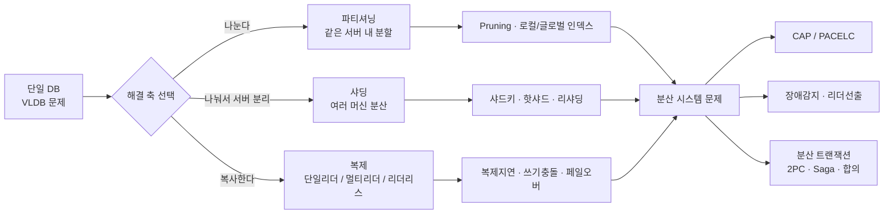
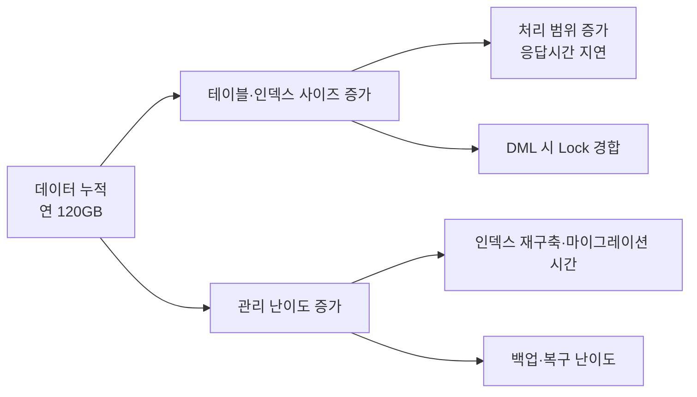
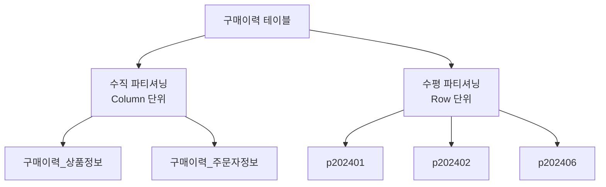

"테이블이 너무 커졌다"는 문제의 이름이 아니라 증상의 이름이다. 같은 증상 아래에 조회가 느려지는 문제, 대량 DML이 락을 오래 잡는 문제, 백업과 삭제가 통째로 움직여야 하는 문제가 함께 들어 있고, 이 셋은 서로 다른 해법을 요구한다. 손댈 축을 정하려면 증상이 아니라 어느 문제인지를 먼저 갈라야 한다.

이 글은 데이터베이스를 확장하는 방법의 지도를 그린다. 다룰 축이 왜 나누는 것과 복사하는 것 둘뿐인지, 파티셔닝이 실제로 값어치를 내는 자리가 조회 성능이 아니라 어디인지, 그리고 수직 분할과 수평 분할이 각각 어떤 동기에서 나오는지다. 단일 DB로 버티던 서비스가 한계에 닿은 자리, 또는 이미 쪼개 놓은 구조를 두고 왜 이 모양이냐는 질문을 받는 자리에서 쓸모가 있다.

## 이 시리즈의 구성

데이터베이스 확장은 **"나눌 것인가 → 복사할 것인가 → 나뉘고 복사된 것을 어떻게 합의시킬 것인가"** 라는 하나의 축을 따라간다. 앞의 선택이 뒤의 문제를 만들기 때문에 순서가 뒤집히지 않는다. 이 축을 여섯 토막으로 잘라 편마다 하나씩 맡겼다. 순서대로 읽지 않아도 각 편이 홀로 서도록 썼다. 다만 용어 정의만은 흩어 놓지 않고 이 글에 모았다.

| 편 | 다루는 것 |
|---|---|
| **1. 파티셔닝의 출발점** (이 글) | 용어 사전, 확장의 두 축, VLDB 문제, 수직 파티셔닝과 수평 파티셔닝 |
| 2. 파티셔닝 전략과 샤딩 | 분할 전략 4종, 로컬 인덱스와 글로벌 인덱스, 파티셔닝과 샤딩의 경계, Kafka 파티셔닝 |
| 3. 복제 토폴로지와 복제 지연 | 복제의 목적, 토폴로지 3종, 동기·반동기·비동기, 복제 지연과 이상 현상, 스플릿 브레인 |
| 4. 분산 시스템과 CAP | 분산 시스템의 장애 모델, FLP 불가능성, 장애 감지와 리더 선출, CAP와 PACELC |
| 5. 분산 트랜잭션과 합의 | 2PC의 문제, Saga, Paxos·Raft·PBFT, 분산 원장은 DBMS인가 |
| 6. Q&A | 앞 다섯 편의 선택지를 트레이드오프와 장애 시나리오에 적용하는 문답 |

## 용어 정리

이 주제의 약어는 층이 섞이면 길을 잃기 쉽다. `Quorum`과 `Paxos`는 둘 다 "여러 노드가 동의한다"는 말처럼 들리지만 하나는 복제본 몇 개의 응답을 받을 것인가의 이야기이고 다른 하나는 하나의 값을 확정하는 알고리즘이다. 그래서 이 시리즈가 쓰는 용어 **32개를, 문제가 어느 층에서 생기는지를 기준으로 네 묶음(11 · 10 · 5 · 6)으로 갈라 빠짐없이 배정**했다. 이 층 구분은 이 글의 정리다.

### 파티셔닝 층 — 11개

데이터를 조각내는 순간 생기는 개념들이다.

| 약어 | 원어 | 뜻 |
|---|---|---|
| VLDB | Very Large Database | 단일 테이블·DB가 물리적으로 너무 커져 성능·관리 문제가 발생하는 상태 |
| Pruning | Partition Pruning | 쿼리 조건으로 접근할 파티션을 미리 잘라내는 최적화. 안 되면 파티셔닝 효과 없음 |
| Prefixed Index | Prefixed Partitioned Index | 인덱스의 leading 컬럼 = 테이블 파티션 키인 경우 |
| Nonprefixed Index | Nonprefixed Partitioned Index | 인덱스의 leading 컬럼 ≠ 테이블 파티션 키인 경우 |
| Local Index | — | 파티션 1:1로 함께 쪼개진 인덱스 |
| Global Index | — | 테이블은 파티션이지만 인덱스는 전체를 한 덩어리로 갖는 인덱스 |
| Cardinality | — | 컬럼 값의 고유값 개수. 낮으면 샤드 키로 부적합 |
| Jumbo Chunk | — | 카디널리티 부족으로 쪼개지지 않는 거대 청크(MongoDB) |
| Hot Shard / Hot Chunk | — | 특정 샤드·청크에만 트래픽이 몰리는 현상 |
| Resharding | — | 샤드 키 변경 등으로 컬렉션을 다시 분산하는 작업 |
| Offset | — | Kafka 파티션 내 레코드의 순번 |

### 복제 층 — 10개

같은 데이터를 여러 벌 두는 순간 생기는 개념들이다. 대부분이 "복제본끼리 값이 다를 때 무엇을 보장할 것인가"에 대한 답이다.

| 약어 | 원어 | 뜻 |
|---|---|---|
| WAL | Write-Ahead Log | 쓰기 전 기록 로그. 복제·복구의 기반 |
| CDC | Change Data Capture | 변경된 row를 식별해 하류로 전파하는 방식 |
| RYW | Read-Your-Writes | 자기가 쓴 것은 반드시 읽히도록 보장 |
| Monotonic Read | 단조 읽기 | 시간을 거슬러 과거 데이터가 다시 보이지 않도록 보장 |
| Consistent Prefix Read | 일관된 순서로 읽기 | 인과 순서가 뒤집혀 보이지 않도록 보장 |
| LWW | Last Write Wins | 타임스탬프·ID 기준으로 마지막 쓰기를 채택하는 충돌 해소 전략 |
| Quorum | 정족수 | 리더리스 복제에서 `w + r > n` 을 만족시키는 응답 수 |
| Anti-Entropy | — | 백그라운드로 복제본을 비교·동기화하는 과정 |
| Read Repair | 읽기 복구 | 읽기 시점에 뒤처진 복제본을 최신값으로 갱신 |
| Split Brain | 스플릿 브레인 | 네트워크 분할로 리더가 둘 이상 동시 존재하는 상태 |

### 분산 시스템 층 — 5개

여러 머신에 걸친 순간, 무엇이 원리적으로 불가능한가에 대한 개념들이다.

| 약어 | 원어 | 뜻 |
|---|---|---|
| CAP | Consistency / Availability / Partition tolerance | 분할 발생 시 일관성과 가용성 중 하나를 포기해야 한다는 정리 |
| PACELC | Partition→A or C, Else→L or C | CAP 확장. 정상 시에는 지연(L)과 일관성(C) 사이의 선택도 존재 |
| FLP | Fischer–Lynch–Paterson | 비동기 시스템에서 완벽한 합의 프로토콜은 없다는 불가능성 정리 |
| SWIM | Scalable Weakly-consistent Infection-style Process Group Membership | 간접 프로빙을 쓰는 장애 감지 프로토콜 |
| FUSE | Lightweight Guaranteed Distributed Failure Notification | 장애를 그룹 전체로 확실히 전파하는 기법 |

### 합의와 분산 트랜잭션 층 — 6개

불가능성을 인정한 위에서, 그럼에도 하나의 결정에 이르는 방법들이다.

| 약어 | 원어 | 뜻 |
|---|---|---|
| 2PC | Two-Phase Commit | 준비→커밋 2단계 원자적 커밋 프로토콜 |
| 3PC | Three-Phase Commit | 제안→준비→커밋. 코디네이터 장애에 더 견고 |
| Paxos | — | 제안자·수락자·학습자 기반 합의 알고리즘 |
| Raft | — | 리더·팔로워·후보자 기반, Paxos보다 이해·구현이 쉬운 합의 알고리즘 |
| PBFT | Practical Byzantine Fault Tolerance | 악의적 노드 f개를 `n = 3f + 1` 로 견디는 비잔틴 내성 합의 |
| Saga | — | 장기 트랜잭션을 로컬 트랜잭션 + 보상 트랜잭션으로 분해하는 패턴 |

## 축은 두 개뿐이다

데이터가 커지고 서버가 늘어나면 다뤄야 할 축은 두 개뿐이다. **나눌 것인가(파티셔닝·샤딩)**, **복사할 것인가(복제)**. 두 축은 직교하며 실제 시스템은 둘을 곱해서 쓴다. 그리고 그 순간부터 **네트워크는 반드시 끊어지므로**, 나뉘고 복사된 데이터를 어떻게 합의시킬 것인가라는 분산 시스템의 문제가 따라온다.

도식의 화살표가 전부 아래쪽 한 지점으로 모이는 것이 이 주제의 성격이다. 어느 축을 골라도 도착지는 분산 시스템 문제다.

| 축 | 목적 | 얻는 것 | 새로 생기는 문제 |
|---|---|---|---|
| 파티셔닝 | 데이터를 조각낸다 | 스캔 범위 축소, 관리 단위 축소, 락 경합 분산 | Pruning 실패, 데이터 편중, 인덱스 설계 난이도 |
| 샤딩 | 조각을 다른 머신에 둔다 | Scale-Out(용량·처리량 선형 확장) | 되돌릴 수 없음, 샤드 키 고정, 인프라 복잡도 |
| 복제 | 같은 데이터를 여러 벌 둔다 | 고가용성, 읽기 부하 분산, 지역 근접성 | 복제 지연, 쓰기 충돌, 페일오버 시 데이터 손실 |
| 합의 | 노드들이 하나의 값에 동의 | 원자성·리더 유일성 보장 | 성능 저하, 블로킹, 완벽한 합의는 불가능(FLP) |

표의 오른쪽 두 열을 나란히 읽으면 이 시리즈의 구조가 그대로 보인다. **얻는 것은 이번 편의 주제이고, 새로 생기는 문제는 다음 편의 주제다.** 파티셔닝이 스캔 범위를 줄이면서 Pruning 실패라는 새 문제를 만들고, 샤딩이 확장을 주면서 되돌릴 수 없다는 제약을 만든다. 확장은 문제를 없애는 작업이 아니라 다룰 수 있는 문제로 바꾸는 작업이다.

## 왜 파티셔닝인가 — 테이블이 커지면 무엇이 무너지는가

규모를 구체적인 숫자로 놓으면 문제가 선명해진다. 가입자 1,000만 명이 1인당 월평균 10개 제품을 구매하는 서비스라면 구매이력은 **매월 1억 건**씩 쌓인다. 레코드 하나가 100바이트면 월 10 GB, 1년이면 120 GB, 그리고 이력을 10년 보존한다면 **약 1.2 TB**가 한 테이블에 누적된다.

이 구매이력 테이블에 붙는 요구사항은 네 가지다. 결제 시 INSERT, 구매확정·환불 시 UPDATE, 최근 1개월 조회 SELECT, 그리고 10년 경과분 DELETE다. 앞의 셋은 테이블이 커져도 형태가 변하지 않지만, 마지막 하나는 테이블 크기에 정비례해 위험해진다.

도식이 두 갈래로 갈라지는 것에 주목할 값어치가 있다. 위쪽 갈래는 성능 문제이고 아래쪽 갈래는 관리 문제다. 성능 갈래는 인덱스를 손보거나 하드웨어를 키워서도 어느 정도 밀어낼 수 있지만, 아래쪽 갈래는 그렇지 않다. 백업 대상이 통째로 하나라는 사실은 장비를 바꿔도 그대로다.

| 문제 영역 | 구체적 증상 | 파티셔닝이 주는 해결 |
|---|---|---|
| 성능 | 인덱스가 커져 탐색 범위 증가, 응답 지연 | 최근 1개월 조회 시 해당 파티션만 스캔 |
| 성능 | 대량 DML로 인한 Lock 경합 | 파티션 단위로 처리가 분산되어 자원 경합 감소 |
| 관리 | 백업·삭제·마이그레이션이 전체 테이블 단위 | 10년 경과분 삭제 = **파티션 DROP 1회**. DELETE 대량 실행의 리스크 제거 |

세 행 중 마지막 행이 나머지 둘과 성격이 다르다. 앞의 두 행은 같은 작업이 빨라진다는 이야기이고, 마지막 행은 **작업의 종류 자체가 바뀐다**는 이야기다.

> **삭제 작업의 성격이 바뀐다.**
>
> "10년 지난 데이터 삭제"를 `DELETE FROM ... WHERE 구매일자 < ...` 로 처리하면 언두 폭증·락 지속·리두 폭주가 동시에 온다.
>
> Range 파티셔닝을 적용하면 같은 작업이 메타데이터 조작 수준의 `DROP PARTITION` 이 된다.
>
> 파티셔닝의 진짜 가치는 조회 성능보다 **운영 작업의 리스크를 상수 시간으로 낮추는 것**에 있다.

이 인용의 마지막 문장이 파티셔닝을 도입할 때 흔히 뒤집히는 자리다. 도입 근거로 먼저 나오는 것은 대개 조회 성능인데, 조회 성능은 인덱스 설계로도 상당 부분 얻을 수 있고 Pruning이 걸리지 않으면 파티셔닝만으로는 아무것도 얻지 못한다. 반면 `DROP PARTITION`이 `DELETE`를 대체한다는 사실은 조건에 거의 의존하지 않는다. **상수 시간**이라는 말이 그 뜻이다 — 지워야 할 행이 1억 건이든 10억 건이든 걸리는 시간이 같아진다.

## 수직 파티셔닝과 수평 파티셔닝

쪼개기로 정했다면 다음 질문은 방향이다. 테이블은 행과 열로 이루어져 있으므로 자를 수 있는 방향도 둘뿐이다.

| 구분 | 수직 파티셔닝 (Vertical) | 수평 파티셔닝 (Horizontal) |
|---|---|---|
| 분할 단위 | 컬럼 | 로우 |
| 예시 | 구매이력(상품정보) / 구매이력(주문자정보) | 2024년 1월 구매이력 / 2월 구매이력 … |
| 동기 | 자주 안 쓰는 대형 컬럼(BLOB·설명문) 분리, 접근 권한 분리 | 데이터 건수 자체가 감당 불가 |
| 효과 | 핫 컬럼만 담은 테이블의 블록 밀도 상승 → I/O 감소 | 스캔 범위 축소, 관리 단위 분리 |
| 부작용 | 원래 한 행이던 것을 조인해야 함 | 파티션 키가 조건에 없으면 전 파티션 스캔 |

표에서 눈여겨볼 행은 **동기**다. 두 방향은 이름이 대칭이지만 출발하는 문제가 다르다. 수직 분할의 동기는 "한 행 안에 성격이 다른 컬럼이 섞여 있다"는 구조의 문제이고, 수평 분할의 동기는 "건수 자체가 감당이 안 된다"는 규모의 문제다. 그래서 컬럼 구성이 잘 정리된 테이블도 건수가 늘면 수평 분할이 필요해지고, 반대로 건수가 적어도 BLOB 컬럼 하나 때문에 수직 분할이 필요할 수 있다.

부작용 행도 대칭이 아니다. 수직 분할의 부작용인 조인은 쿼리를 고치면 눈에 보이는 대가로 드러난다. 수평 분할의 부작용은 그렇지 않다 — 파티션 키가 조건에 없는 쿼리는 **에러 없이 잘 동작하면서** 전 파티션을 훑는다. 파티셔닝을 넣었는데 아무것도 빨라지지 않는 상황이 대개 여기서 나온다. 이것이 용어 사전 첫머리에 `Pruning`이 있는 이유이고, 다음 편에서 분할 전략을 고르는 기준 전체가 결국 "어떤 조건으로 Pruning이 걸리게 할 것인가"로 수렴하는 이유다.

## 정리

이 글이 정리한 것을 세 줄로 압축하면 이렇다.

| 질문 | 답 |
|---|---|
| 확장의 축은 몇 개인가 | **둘이다.** 나누거나 복사한다. 두 축은 직교하고 실제 시스템은 곱해서 쓰며, 어느 쪽을 골라도 분산 시스템 문제로 도착한다 |
| 파티셔닝은 무엇을 사는가 | 조회 성능도 얻지만 그것은 조건부다. 조건에 거의 의존하지 않는 이득은 **운영 작업의 리스크를 상수 시간으로 낮추는 것**이다 |
| 어느 방향으로 쪼개는가 | 수직은 **구조**의 문제에서, 수평은 **규모**의 문제에서 출발한다. 이름은 대칭이지만 동기도 부작용의 성격도 대칭이 아니다 |

방향을 정했다면 다음 질문은 기준이다. 수평으로 자르기로 했을 때 무엇을 기준으로 행을 나눌 것인가 — 날짜인지, 값의 목록인지, 해시인지 —에 따라 Pruning이 걸리는 조건이 달라지고, 그 선택이 인덱스를 어떻게 쪼갤지까지 끌고 간다. 그리고 조각을 같은 서버에 둘 것인지 다른 머신으로 보낼 것인지에서 파티셔닝과 샤딩이 갈린다. 다음 편이 그 주제를 받는다.
