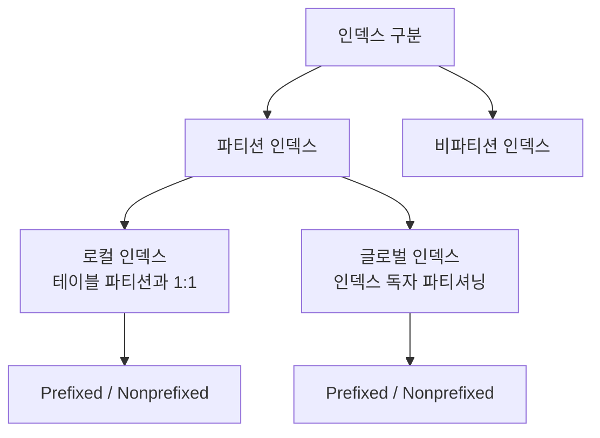
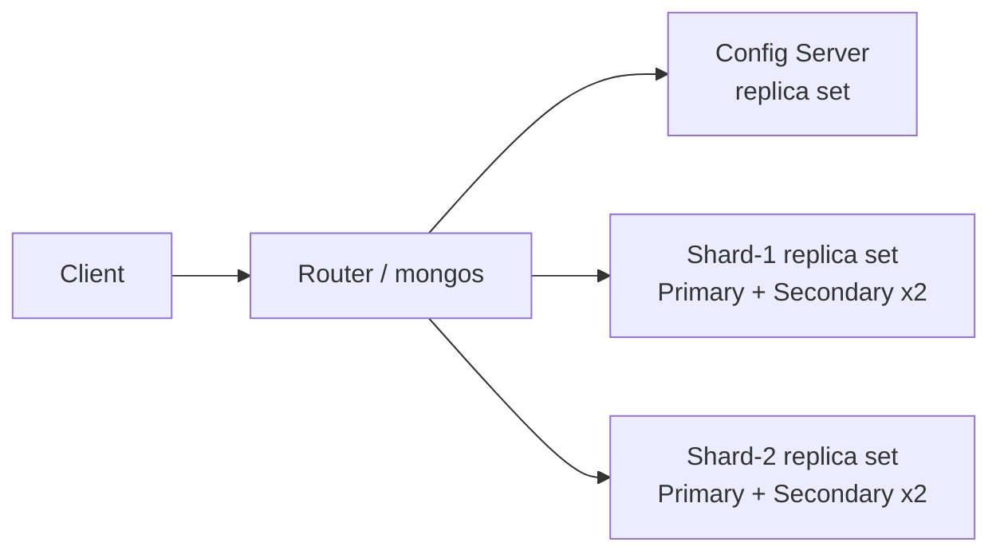
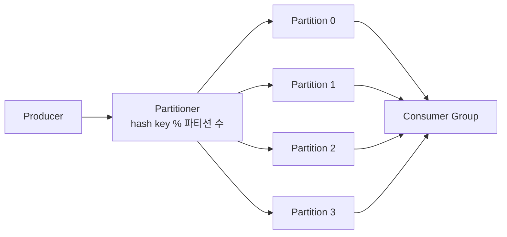

수평으로 쪼개기로 정하고 나면 곧바로 다음 질문이 온다. 무엇을 기준으로 행을 나눌 것인가. 날짜로 자르는 것과 해시로 흩는 것은 둘 다 수평 분할이지만 Pruning이 걸리는 조건이 다르고, 나중에 조각을 하나 더 붙일 때 치르는 비용도 다르다. [파티셔닝의 출발점](/blog/backend-engineering/partitioning-fundamentals/)이 어느 방향으로 자를지를 정했다면, 이 글은 어떤 기준으로 자를지와 그 조각을 어디에 둘지를 정한다.

순서는 넷이다. 분할 기준 네 가지를 비교하고, 테이블을 쪼갠 뒤 인덱스를 어떻게 쪼갤지 고르고, 조각이 머신 경계를 넘을 때 무엇이 달라지는지 보고, 같은 구조가 Kafka에서 어떻게 반복되는지 확인한다. 네 토막을 관통하는 질문은 하나다. **이 결정을 나중에 되돌릴 수 있는가.** 뒤로 갈수록 답이 나빠진다.

## 무엇을 기준으로 자를 것인가 — 전략 네 가지

| 전략 | 분할 기준 | 적합한 상황 | 핫스팟 위험 | 리밸런싱 |
|---|---|---|---|---|
| **Range** | 값의 범위(주로 날짜) | 범위 기반 SQL이 대부분, 기간별 데이터 관리 필요 | **높음** — 최근 파티션에 쓰기 집중 | 쉬움. 파티션 ADD/DROP으로 처리 |
| **Hash** | `hash(key) % N` | 범위 패턴이 없고 균등 분포가 목적, 파티션 수 고정 가능 | 낮음 | **어려움** — N이 바뀌면 대부분 재배치 |
| **List** | 명시된 값 집합 | 카테고리·지역 등 명확한 그룹, 값별 정책이 다른 경우 | 값 분포에 그대로 종속 | 값 추가 시 파티션 추가 |
| **Composite** | Range + Hash / Range + List | 기간 관리와 균등 분산이 동시에 필요 | 상위 Range의 핫스팟을 하위 Hash가 완화 | 상위는 쉽고 하위는 Hash 특성 그대로 |

오른쪽 두 열을 Range 행과 Hash 행에서 나란히 읽으면 둘이 정확히 반대로 움직인다. Range는 파티션을 붙이고 떼기가 쉬운 대신 최근 파티션 하나에 쓰기가 몰리고, Hash는 고르게 흩는 대신 파티션 수를 바꾸는 순간 대부분을 옮겨야 한다. 이 축 위에 없는 것은 List 한 행뿐이다.

### Range — 값의 범위로 자른다

가장 많이 쓰이는 전략이다. `MAXVALUE` 파티션을 반드시 두어 범위를 벗어난 값이 INSERT 실패하지 않게 한다.

```sql
CREATE TABLE 구매이력 (
  구매번호 varchar(10), 구매일자 varchar(8), 고객ID INT
) PARTITION BY RANGE(구매일자) (
  partition p202401 values less than ('20240201')
 ,partition p202402 values less than ('20240301')
 ,partition p999912 values less than (MAXVALUE)
);
```

위 정의에서 명시된 경계는 2월 말까지다. `p999912`가 없으면 3월 1일자 행이 갈 곳을 잃어 INSERT가 실패한다. 파티션 추가를 깜빡한 하루가 그대로 장애가 되므로 `MAXVALUE`는 선택 사항이 아니다.

이 글에 실린 DDL 예시는 Oracle 문법이다. MySQL은 `RANGE`·`HASH` 파티션 식에 정수를 요구하므로 `varchar` 컬럼을 그대로 쓰려면 `RANGE COLUMNS`나 `KEY` 파티셔닝으로 바꿔 적어야 한다.

### Hash — 키를 흩는다

```sql
CREATE TABLE 구매이력 (
  구매번호 varchar(10), 구매일자 varchar(8), 고객ID INT
) PARTITION BY HASH(구매번호) partitions 4;
```

범위 조회 패턴이 없고 고르게 흩는 것 자체가 목적일 때 고른다. 대가는 파티션 수 `4`가 사실상 고정값이 된다는 것이다. 4를 5로 늘리면 원래 자리를 지키는 행은 다섯 중 하나꼴이고 나머지 넷은 다른 파티션으로 옮겨 가야 한다. 표의 「리밸런싱: 어려움」이 뜻하는 계산이 이것이다.

### List — 값의 목록으로 자른다

명시한 값 집합으로 나눈다. 카테고리나 지역처럼 그룹의 경계가 이미 정해져 있고 값마다 정책이 다를 때 고른다. 갈라지는 지점은 분포를 만들지 않고 있는 그대로 받는다는 것이다 — 특정 지역에 주문이 몰려 있으면 그 파티션이 그대로 커진다.

### Composite — 두 기준을 겹친다

Range로 나눈 뒤 각 파티션 내부를 Hash 또는 List 서브파티션으로 다시 쪼갠다. **"기간으로 버리고 싶고, 동시에 쓰기 경합은 흩고 싶다"는** 상충 요구를 해소하는 표준 답이다.

```sql
CREATE TABLE 구매이력 (...)
PARTITION BY RANGE(구매일자)
SUBPARTITION BY HASH(구매번호) SUBPARTITIONS 4
( partition p202401 values less than ('20240201')
, partition p202402 values less than (MAXVALUE) );
```

이 정의는 Range 파티션 2개를 각각 Hash 4벌로 다시 나누므로 물리 세그먼트는 8개가 된다. 상위 Range 덕분에 기간 단위 DROP이 살아 있고, 하위 Hash 덕분에 최근 파티션 한 곳에 몰리던 쓰기가 네 갈래로 흩어진다. 다만 하위의 성질은 Hash 그대로라 서브파티션 수를 바꾸는 일은 여전히 비싸다. 상충을 없앤 것이 아니라 층을 나눠 각각에 다른 답을 준 것이다.

네 전략 중 DDL로 확인한 것은 Range·Hash·Composite 셋이다. 빠진 List는 Range와 같은 자리에 있다 — 범위로 적든 값 목록으로 적든 매핑을 사람이 적어 둔다. Hash만이 그것을 계산으로 대신하고, 그래서 고치는 순간 대부분이 움직인다.

### 쪼갰는데 아무것도 빨라지지 않는 경우

| # | 함정 | 왜 문제인가 |
|---|---|---|
| 1 | **Pruning이 적용되지 않으면 성능 향상은 0** | 쿼리 조건에 파티션 키가 없으면 모든 파티션을 스캔한다. 오히려 파티션 개수만큼 오버헤드가 붙는다 |
| 2 | **부적절한 분할 → 특정 파티션에만 누적** | 데이터 스큐. "나눴는데 안 나뉜" 상태 |
| 3 | **로컬/비파티션 인덱스 구성 실패 → 성능 저하** | 인덱스 설계가 파티션 전략과 어긋나면 매 조회마다 전 파티션 인덱스 탐색 |

세 함정의 공통점은 전부 조용히 실패한다는 것이다. 쿼리는 결과를 정확히 돌려주고 배치는 끝나며, 다만 파티셔닝 이전과 같거나 조금 느릴 뿐이다. 3번은 다음 절의 주제다.

## 테이블을 나눴다고 인덱스가 나뉘지는 않는다

파티셔닝에서 가장 실수하기 쉬운 지점이 여기다. **테이블을 나눴다고 인덱스가 자동으로 나뉘는 것이 아니다.**



도식은 두 단계로 나뉜다. 인덱스가 쪼개져 있는가로 먼저 갈리고, 쪼개져 있다면 테이블 파티션을 따라가는가(로컬) 독자적으로 나뉘는가(글로벌)로 다시 갈린다. Prefixed와 Nonprefixed가 양쪽에 똑같이 매달린 것은 그 구분이 직교하는 별개의 축이기 때문이다.

| 구분 | 로컬 인덱스 | 글로벌 인덱스 | 비파티션 인덱스 |
|---|---|---|---|
| 구조 | 테이블 파티션마다 별도 인덱스 세그먼트 | 인덱스를 테이블과 무관하게 파티셔닝 | 전체 테이블을 하나의 인덱스로 |
| Pruning | 파티션 키 조건이 있으면 해당 인덱스만 접근 | 인덱스 키 조건으로 Pruning | 불가 — 항상 전체 인덱스 탐색 |
| 파티션 DROP | **인덱스도 함께 사라짐. 무효화 없음** | 인덱스 전역 무효화 → 재구축 필요 | 재구축 필요 |
| 강점 | 이력성 데이터 관리에 압도적. OLTP에서 파티션 키가 `=` 조건일 때 유리 | 경합 분산 용도 외엔 거의 안 쓰임 | 파티션 키 없이 조회하는 OLTP에서 유리 |

네 행 중 무게중심은 파티션 DROP 행이다. 로컬 인덱스라면 파티션을 떼는 순간 그 조각의 인덱스도 같이 사라져 뒷정리가 없지만, 글로벌 인덱스가 걸려 있으면 같은 `DROP`이 인덱스 전역을 무효화하고 재구축을 부른다. 앞 편에서 파티셔닝의 값어치로 꼽은 「상수 시간이 되는 삭제」를 인덱스 하나가 도로 가져가는 셈이다.

### Prefixed와 Nonprefixed

| 구분 | Prefixed (인덱스 leading 컬럼 = 파티션 키) | Nonprefixed (leading 컬럼 ≠ 파티션 키) |
|---|---|---|
| 예시 | 파티션 키 `구매일자`, 인덱스 `구매일자 + 상품ID` | 파티션 키 `구매일자`, 인덱스 `상품ID + 구매일자` |
| 로컬 인덱스 | 이력성 데이터 관리에 효과적. 파티션 키가 `=` 조건인 OLTP에 유리 | **파티션 키가 범위 검색 조건이면 Nonprefixed가 유리할 수 있다** |
| 글로벌 인덱스 | 경합 분산 외엔 거의 안 쓰임(비파티션 인덱스가 더 효율적) | **지원하지 않는 경우가 많음** (로컬 인덱스가 효율적) |

두 예시는 같은 두 컬럼의 순서만 바꾼 것이고, 달라진 leading 컬럼 하나가 파티션 키와 일치하느냐로 성질이 갈린다. 글로벌 행의 오른쪽 칸은 조심해서 읽어야 한다 — 「지원하지 않는 경우가 많음」은 원리적으로 불가능하다는 말이 아니라 제품에 따라 다르다는 말이다.

> 실무 판단 기준을 한 문장으로 압축하면 이렇다.
>
> **파티션 키가 쿼리 조건에 항상 들어온다면 로컬 Prefixed**, **파티션 키 없이 다른 컬럼으로 자주 조회한다면 비파티션(글로벌) 인덱스**.
>
> 둘 다 필요하면 인덱스를 두 벌 만들되, 파티션 DROP 운영이 잦은 테이블에서는 글로벌 인덱스 무효화 비용을 반드시 계산에 넣는다.

인덱스를 두 벌 만드는 값을 매길 때 진짜 청구서는 저장 공간이 아니라 매달 돌아오는 파티션 정리 작업에서 나온다.

## 머신 경계를 넘는 순간 — 파티셔닝과 샤딩

샤딩은 파티셔닝의 범주에 들어가되 데이터를 여러 서버에 분산 저장하는 개념이다. 경계는 하나뿐이다. **머신 경계를 넘느냐.**

| 항목 | 파티셔닝 | 샤딩 |
|---|---|---|
| 물리 위치 | 같은 DB 인스턴스 내 | 서로 다른 서버(샤드) |
| 확장 방향 | Scale-Up 한계 안에서 관리 최적화 | **Scale-Out** — 용량·처리량 자체를 늘림 |
| 트랜잭션 | 로컬 트랜잭션으로 파티션 간 원자성 보장 | **분산 트랜잭션 필요**. 대개 포기하거나 Saga로 대체 |
| 조인 | 일반 조인 가능 | 크로스 샤드 조인은 사실상 불가 / 애플리케이션 조합 |
| 롤백 | 파티션 병합·재정의 가능 | **되돌리는 기능이 없다** |
| 운영 복잡도 | 중간 | 높음. 라우터·컨피그 서버 등 별도 인프라 |

여섯 행이 서로 독립된 항목처럼 보이지만 첫 행이 원인이고 아래 다섯 행은 그 결과다. 같은 인스턴스 안에 있으면 로컬 트랜잭션과 일반 조인이 공짜로 성립하고, 서버가 갈리는 순간 둘 다 무너지며, 무너진 것을 대신할 라우터와 컨피그 서버가 필요해져 운영 복잡도가 올라간다.

그중 롤백 행은 따로 놓고 봐야 한다. 나머지가 「비싸진다」는 이야기라면 이 행만은 「되돌릴 수 없다」는 이야기다. Hash 파티셔닝의 리밸런싱 비용은 시간과 부하로 계산되는 값이었지만, 여기서는 되돌리기라는 선택지 자체가 목록에서 빠진다.

### MongoDB 샤드 클러스터



| 구성요소 | 역할 |
|---|---|
| mongos (Router) | 쿼리를 어느 샤드로 보낼지 라우팅. 샤드 키가 없으면 **전 샤드 브로드캐스트(scatter-gather)** |
| Config Server | 청크-샤드 매핑 메타데이터 보관. 자체도 리플리카셋 |
| Shard | 실제 데이터. 각 샤드는 그 자체가 리플리카셋 = **샤딩 × 복제** |

도식에서 실제 데이터를 가진 것은 아래 두 샤드뿐이고 나머지는 「어디로 보낼지」를 아는 역할이다. 표의 마지막 행이 이 글과 다음 편을 잇는다 — 각 샤드가 그 자체로 리플리카셋이라는 것은 샤딩과 복제가 택일이 아니라 곱이라는 뜻이다.

### 샤드 키를 잘못 고르면 생기는 세 가지 문제

| 문제 | 원인 | 증상 | 해결 |
|---|---|---|---|
| **Jumbo Chunk** | 샤드 키 카디널리티 부족(중복값 과다) | 청크가 쪼개지지 않고 거대해짐. 분산 실패 | 샤드 키 개선, 리샤딩, 해시 샤딩 |
| **Uneven Load Distribution** | 샤드 키가 주문ID처럼 **serial 증가** | 최신 문서가 전부 같은 샤드·청크로 → **hot shard / hot chunk** | 리샤딩, 해시 샤딩 |
| **Decreased Query Performance Over Time** | 쿼리에 샤드 키가 포함되지 않음 | 전 샤드 브로드캐스트 → 샤드 수만큼 부하 증가 | 쿼리에 샤드 키 포함, 리샤딩 |

해결 열을 세로로 읽으면 세 행 모두에 리샤딩이 들어 있다. 원인이 카디널리티든 증가 패턴이든 쿼리 모양이든 결국 데이터를 전부 다시 분배하는 길로 수렴한다. 세 번째 행은 이름부터 시간을 담고 있어, 도입 직후의 지표가 괜찮다는 사실은 샤드 키가 옳다는 증거가 되지 못한다.

> 샤드 키는 **카디널리티 · 데이터 분포 · 쿼리 패턴** 세 가지를 동시에 보고 골라야 한다.
>
> 셋 중 하나만 봐서는 반드시 실패한다. 카디널리티만 보고 UUID를 고르면 분포는 완벽하지만 범위 조회가 전부 브로드캐스트가 되고, 쿼리 패턴만 보고 날짜를 고르면 최신 샤드가 불타오른다.
>
> 실무의 통상 해법은 **복합 샤드 키**다. 예를 들어 `(고객ID 해시, 구매일자)` 처럼 앞자리로 흩고 뒷자리로 범위를 유지한다.

인용이 든 실패 사례는 세 기준 중 둘, 카디널리티와 쿼리 패턴이고 두 사례는 대칭이다. 하나는 분포를 얻고 조회를 잃었고, 다른 하나는 조회를 지키고 분포를 잃었다. 컬럼 하나로 셋을 동시에 만족시키려는 시도가 무리라는 것이 복합 샤드 키가 표준이 된 이유다.

### 샤딩 전에 계산해야 할 것

| # | 항목 | 함의 |
|---|---|---|
| 1 | 샤딩은 적용되면 **rollback 기능이 없다** | 되돌릴 수 없는 결정. 도입 시점을 미룰 수 있으면 미룬다 |
| 2 | 샤드 키를 신중히 선택 | 사실상 스키마보다 바꾸기 어려운 결정 |
| 3 | 샤드 클러스터 인프라 구축은 복잡 | 운영 환경은 관리 요소가 더 늘어난다 |
| 4 | 샤드 키 변경 = **컬렉션 리샤딩** | 전체 데이터 재분배. 서비스 영향 필연 |

네 항목 중 1번과 4번이 같은 말의 앞뒤다 — 샤딩 자체를 되돌릴 수 없고, 그 안에서 샤드 키만 바꾸는 것도 전체 재분배를 부른다. 1번의 「미룰 수 있으면 미룬다」는 되돌릴 수 없는 결정을 정보가 더 쌓인 뒤로 늦추라는 계산이다.

### 노드를 하나 더 붙일 때 — 리밸런싱 네 가지

| 방식 | 매핑 결정 | 노드 추가 시 이동량 | 핫스팟 | 대표 사례 |
|---|---|---|---|---|
| **Range** | 값 범위 → 샤드 | 경계만 조정. 이동 적음 | 최신 범위에 쓰기 집중 | MongoDB Range 샤딩, HBase |
| **Hash** | `hash(key) % N` | **N 변경 시 대부분 재배치** | 낮음 | 단순 모듈러 샤딩 |
| **Consistent Hash** | 해시 링 + 가상노드 | 평균 `1/N` 만 이동 | 가상노드로 완화 | Cassandra, DynamoDB |
| **Directory** | 룩업 테이블 조회 | 테이블만 갱신 → 임의 재배치 가능 | 정책으로 제어 가능 | 커스텀 샤딩, Vitess 계열 |

앞의 두 행은 첫 절의 Range·Hash가 머신 경계를 넘어온 모습이고, 새로 등장한 두 행은 넘어온 뒤에야 값어치가 생긴다. 파티션에서는 재배치가 로컬 작업이지만 샤드에서는 네트워크를 타므로, 「얼마나 옮기는가」가 비용의 본체가 된다.

> Directory 방식의 대가는 **룩업 테이블이 단일 장애점이자 모든 요청의 경로에 낀다는 것**이다.
>
> 그래서 실무에서는 룩업 테이블 자체를 캐시하고, 캐시 미스 시에만 조회하는 구조로 만든다.
>
> 반대로 Consistent Hash는 룩업이 필요 없지만 특정 키를 특정 샤드에 강제로 두는 정책(예: 지역별 데이터 주권)을 표현할 수 없다.

두 대가가 정확히 맞바꿈이다. Directory는 임의의 배치를 표현하는 대신 그것을 담을 곳을 하나 더 두어야 하고, Consistent Hash는 더 둘 것이 없는 대신 배치를 지정할 수단이 없다.

## 같은 구조가 메시징 계층에서 반복된다 — Kafka

Kafka는 발생한 순서대로 이벤트를 저장하는 **로그**를 관리하는 시스템이다. Topic은 내구성 있게 저장되는 정렬된 이벤트 로그의 모임이고, Topic은 다시 Partition으로 나뉜다.



도식의 두 번째 노드가 이 절이 왜 같은 글에 있는지를 말해 준다. Partitioner가 목적지를 정하는 식이 앞에서 본 Hash 파티셔닝의 `hash(key) % N`과 글자 그대로 같고, 같은 연산이므로 같은 제약을 물려받는다.

| 개념 | 정의 | 짚어 둘 점 |
|---|---|---|
| Event | key, value, timestamp, optional metadata headers | "일어난 사실"의 기록. 변경 불가 |
| Producer / Consumer | 발행 / 구독 애플리케이션 | **완전히 분리되어 서로를 인식하지 않음** |
| Topic | 폴더에 해당. 이벤트는 그 안의 파일 | 보존 기간 설정 후 자동 삭제 |
| Partition | Topic의 분할 단위 | **같은 event key는 항상 같은 파티션** → 키 단위 순서 보장 |
| Offset | 파티션 내 순번 | 순서는 **파티션 안에서만** 보장. 토픽 전역 순서는 보장되지 않음 |

다섯 개념 중 뒤의 둘이 이 절의 핵심이다. 같은 키가 항상 같은 파티션으로 간다는 성질이 순서 보장의 근거이고, 그 범위가 파티션 안으로 한정된다는 것이 Offset 행이다. 붙여 읽으면 Kafka가 주는 것은 전역 순서가 아니라 키 단위 순서다 — 주문 하나의 이벤트가 뒤섞이지 않는 것은 보장되지만, 서로 다른 두 주문의 이벤트가 발생 순서대로 소비되는 것은 보장 밖이다.

```bash
kafka-topics --create --bootstrap-server localhost:9092 \
  --replication-factor 1 --partitions 4 --topic database
```

`--partitions 4`가 도식의 Partition 0부터 3까지를 만든다. 토픽 생성 시점에 정하는 이 숫자 하나가 아래 표의 세 줄을 전부 결정한다.

| 파티션 수를 늘리면 | 얻는 것 | 잃는 것 |
|---|---|---|
| 병렬 소비 | Consumer Group 내 컨슈머가 파티션 수만큼 병렬 처리 | 컨슈머 수 > 파티션 수이면 남는 컨슈머는 논다 |
| 처리량 | 브로커 간 부하 분산 | 파티션당 파일 핸들·메모리 증가, 리더 선출 비용 증가 |
| 순서 | 키 단위 순서 유지 | **전역 순서 소실**. 전역 순서가 필요하면 파티션 1개 = 병렬성 포기 |

세 행이 병렬성의 상한을 각각 다른 쪽에서 누른다. 파티션 수가 컨슈머 병렬도의 천장이고, 그 천장을 무작정 올리면 브로커가 자원으로 값을 치른다. 셋째 행이 가장 날카롭다 — 전역 순서를 요구하는 순간 파티션은 하나여야 하고, 그러면 첫 행의 병렬 소비가 정확히 1이 된다.

> Kafka에서 파티션 수는 **줄일 수 없다**. RDB 샤딩이 되돌릴 수 없는 것과 정확히 같은 성격의 결정이다.
>
> 또 파티션 수를 바꾸면 `hash(key) % 파티션 수` 의 결과가 바뀌므로, 기존 키의 파티션 배정이 달라져 **키 단위 순서 보장이 그 지점에서 끊긴다.**
>
> 그래서 초기 설계에서 여유 있게 잡되, 지나치게 크게 잡으면 브로커 리소스와 리밸런싱 시간이 비용으로 돌아온다.

인용의 두 번째 문단이 이 글을 한 바퀴 돌려 제자리로 데려온다. 나누는 수를 바꾸면 배정이 전부 흔들린다는 것은 첫 절 Hash 파티셔닝에서 이미 본 계산이고, 다른 점은 무엇이 깨지느냐다 — RDB에서는 데이터가 옮겨 다니는 부하로 값을 치렀지만 Kafka에서는 보장이 사라진다.

## 정리

지금까지의 판단을 네 줄로 줄이면 이렇게 된다.

| 질문 | 답 |
|---|---|
| 무엇을 기준으로 자르는가 | Range·Hash·List·Composite **네 가지**. Range와 Hash는 핫스팟과 리밸런싱을 서로 맞바꾸고, List는 값 분포를 그대로 물려받으며, Composite는 층을 나눠 위아래에 다른 답을 준다 |
| 인덱스는 어떻게 쪼개는가 | 파티션 키가 조건에 항상 들어오면 **로컬 Prefixed**, 그렇지 않으면 비파티션(글로벌). 판단에 조회 속도만이 아니라 **파티션 DROP 횟수**를 함께 넣는다 |
| 파티셔닝과 샤딩의 경계는 무엇인가 | **머신 경계를 넘느냐** 하나다. 넘는 순간 트랜잭션·조인·운영 복잡도가 따라 움직이고, 무엇보다 **되돌리기라는 선택지가 목록에서 빠진다** |
| Kafka 파티션도 같은가 | 목적지를 정하는 식이 같아 제약도 같다. 파티션 수는 **줄일 수 없고**, 바꾸면 그 지점에서 **키 단위 순서 보장이 끊긴다** |

네 줄을 관통하는 것은 도입부의 질문이다. 파티션 키는 바꿀 수 있고, 인덱스는 다시 만들 수 있고, 샤드 키는 전체 재분배를 부르며, Kafka 파티션 수는 줄어들지 않는다. 순서대로 나빠지므로 결정도 그 순서로 미룰 수 있으면 미룬다.

여기까지의 두 결정 — 무엇을 기준으로 자를 것인가, 조각을 어느 머신에 둘 것인가 — 은 모두 데이터를 한 벌만 두는 전제 위에 서 있다. 한 벌뿐이면 그 조각을 가진 서버가 멈추는 순간 그 조각은 없는 것이 된다. MongoDB 샤드 하나하나가 이미 리플리카셋이었던 것이 그 전제가 유지되지 않는다는 신호다. 다음 편 [복제 — 무엇을 사고 무엇을 지불하는가](/blog/backend-engineering/replication-topologies-and-lag/)가 복제를 다룬다.
