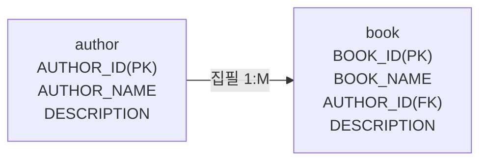
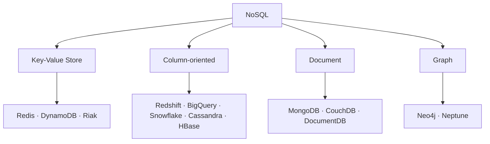

"어떤 DB를 쓸까"라는 질문에 "Redis가 빠르다" 또는 "MongoDB가 유연하다"로 답하면 절반만 답한 것이다. 제품의 성능은 선택 근거로 충분하지 않다. 조직을 실제로 무너뜨리는 쪽은 성능이 아니라 유지·보수 비용이기 때문이다.

이 글은 저장소를 고르기 전에 정리해야 할 것들을 다룬다. 관계형 모델이 "관계"를 물리적으로 어디에 저장하는지, NoSQL 네 유형이 각각 무엇을 잘하고 무엇을 못하는지, 그리고 제품 선택을 성능이 아니라 문제 해결·비용·유지·보수 세 축으로 판정하는 이유다. 저장소를 새로 고르는 자리에 있거나, 이미 쓰고 있는 저장소가 왜 그 자리에 있는지 설명해야 하는 백엔드 엔지니어를 위한 글이다.

## 이 시리즈의 구성

데이터베이스 기초는 **"데이터를 어떻게 담고(모델링) → 어떻게 꺼내고(SQL) → 어떻게 동시에 안전하게 다룰 것인가(트랜잭션)"** 라는 하나의 축을 따라간다. 이 축을 다섯 구간으로 끊어 한 편씩 맡겼다. 어느 편부터 펼쳐도 읽히도록 썼고, 시리즈 전체가 쓰는 용어 정의는 이 글이 갖는다.

| 편 | 다루는 것 |
|---|---|
| **1. 관계형 데이터베이스와 NoSQL** (이 글) | 용어 사전, DBMS가 걸어온 길, RDBMS가 관계를 저장하는 방식, NoSQL 4유형, 제품 선택 기준 |
| 2. [데이터 모델링과 정규화](/blog/backend-engineering/data-modeling-and-normalization/) | ERD의 네 요소, 정규화, 그리고 반정규화를 언제 하는가 |
| 3. [SQL 실행과 인덱스](/blog/backend-engineering/sql-execution-and-indexes/) | SQL이 느린 이유를 어디서 보는가 — 파싱, 인덱스, 실행계획, 조인 |
| 4. [트랜잭션과 동시성 제어](/blog/backend-engineering/transactions-and-concurrency-control/) | ACID, 격리수준, 락, 그리고 데드락 |
| 5. Q&A | 앞 네 편의 선택지를 트레이드오프와 장애 상황에 적용하는 문답 |

## 용어 정리

약어가 어느 층의 이야기인지 모르면 같은 문서 안에서도 길을 잃는다. 이 시리즈가 쓰는 용어 **30개를 주제별로 네 묶음(7 · 5 · 9 · 9)에 전수 배정**했다. 묶는 방식은 이 글의 정리다.

### 이 글이 쓰는 용어 — 7개

| 약어 | 원어 | 뜻 |
|---|---|---|
| DB | Database | 공유·통합 관리 목적으로 모아둔 데이터의 집합 |
| DBMS | Database Management System | DB를 여러 사용자가 효과적으로 쓰도록 구현한 소프트웨어 집합 |
| RDBMS | Relational DBMS | 데이터를 개체-관계로 표현하고 테이블(열·행)로 저장·관리하는 DBMS |
| ORDB | Object-Relational DB | RDB + OODB 확장형(1997년경) |
| NewSQL | — | RDBMS의 트랜잭션 보장 + NoSQL의 확장성을 함께 노리는 계열 |
| PK | Primary Key | 행을 유일하게 식별하는 기본키 |
| FK | Foreign Key | 다른 테이블의 PK를 참조해 관계를 저장하는 외래키 |

### 모델링 층 — 5개

| 약어 | 원어 | 뜻 |
|---|---|---|
| ERD | Entity-Relationship Diagram | 개체와 개체 간 관계를 도식화한 모델 표기법 |
| 1NF~5NF | Normal Form | 정규형. 이상현상 제거 단계 |
| BCNF | Boyce-Codd Normal Form | 모든 결정자가 후보키인 강화된 3NF |
| Anomaly | — | 이상현상(입력/삭제/수정 이상) |
| MD | Merchandiser | 상품·판매촉진 담당자(모델링 예시에 등장) |

### SQL 층 — 9개

| 약어 | 원어 | 뜻 |
|---|---|---|
| DDL/DML/DCL/TCL/DQL | Data Definition/Manipulation/Control, Transaction Control, Data Query Language | SQL 명령 분류 |
| SGA | System Global Area | 오라클 공유 메모리 영역(Shared Pool, Data Buffer Cache, Log Buffer) |
| Shared Pool | — | SQL 텍스트·파싱 결과·실행계획을 캐시하는 SGA 영역 |
| Literal SQL | — | 값을 바인드 변수 없이 상수로 박아 넣은 SQL |
| Bind Variable | — | SQL 문장에서 값을 `:var` 형태로 분리한 변수. 실행계획 재사용의 핵심 |
| Hard/Soft Parsing | — | 실행계획을 새로 만드는 파싱 / 캐시된 계획을 재사용하는 파싱 |
| Optimizer | — | 실행계획을 선택하는 DBMS 모듈 |
| Index Range/Full/Skip Scan | — | 인덱스 일부 범위 탐색 / 전체 탐색 / 선두 컬럼을 건너뛰며 탐색 |
| NL Join | Nested Loop Join | 외부 테이블 행마다 내부 테이블을 인덱스로 찾는 조인 |

### 트랜잭션 층 — 9개

| 약어 | 원어 | 뜻 |
|---|---|---|
| ACID | Atomicity, Consistency, Isolation, Durability | 트랜잭션의 4대 특성 |
| MVCC | Multi-Version Concurrency Control | Undo 등으로 시점별 스냅샷을 만들어 읽기와 쓰기를 서로 막지 않게 하는 기법 |
| CR 블록 | Consistent Read Block | 실행 시점 데이터로 복원한 읽기 전용 복사 블록 |
| SCN | System Change Number | 오라클의 논리적 시점 번호. 읽기 일관성 판단 기준 |
| Undo | — | 변경 전 이미지를 보관해 롤백·일관성 읽기에 쓰는 영역 |
| S/X Lock | Shared / Exclusive Lock | 공유(조회) 잠금 / 배타(갱신) 잠금 |
| IS/IX Lock | Intention Shared / Exclusive Lock | 하위 레벨에 S/X를 걸겠다는 의도를 상위 레벨에 표시하는 잠금 |
| Blocking | — | 선행 트랜잭션의 Lock 때문에 후행 트랜잭션이 대기하는 상태 |
| Deadlock | — | 두 트랜잭션이 서로가 쥔 Lock을 기다려 영원히 진행 못 하는 상태 |

네 묶음의 크기가 고르지 않다는 점 자체가 정보다. **SQL 층과 트랜잭션 층에 용어가 몰려 있는 것은 그 두 층이 DBMS 내부 동작에 가장 깊이 닿기 때문**이다. 모델링 층은 개념이 적은 대신 판단이 어렵고, SQL·트랜잭션 층은 개념 자체가 많다.

## 이 시리즈가 따라가는 축

비즈니스 요구사항이 하나의 파이프라인을 거쳐 서비스가 된다. 각 편이 이 파이프라인의 어느 구간을 맡는지 먼저 보면 길을 잃지 않는다.

이 파이프라인의 각 구간에는 고유한 실패 방식이 있고, 그 실패를 막는 해법도 구간마다 다르다.

| 층 | 문제 | 해법 |
|---|---|---|
| 모델링 | 데이터가 중복되면 이상현상이 난다 | 개체-관계 모델로 실체를 정의하고 정규화로 중복을 제거한다. NoSQL은 반대로 애플리케이션 질의 관점에서 역정규화한다 |
| SQL | SQL이 잘못 짜이면 파싱·I/O가 폭발한다 | 바인드 변수로 실행계획을 재사용하고, 고급 SQL로 DB 왕복 횟수를 줄이고, 인덱스·조인 방식을 데이터 양에 맞게 고른다 |
| 트랜잭션 | 동시 접근을 제어하지 않으면 데이터가 깨진다 | 격리수준을 올리면 일관성이 올라가고 동시성이 떨어진다. 이 트레이드오프를 의식적으로 선택하는 것이 설계다 |

세 행의 해법 열을 나란히 읽으면 성격이 갈린다. 모델링과 SQL의 해법은 **더 나은 쪽이 정해져 있는** 문제다 — 중복은 제거하는 쪽이 낫고, 실행계획은 재사용하는 쪽이 낫다. 트랜잭션만 다르다. 격리수준에는 "더 나은 값"이 없고 **교환 조건만 있다.** 이 시리즈에서 마지막 편이 가장 판단을 많이 요구하는 이유가 여기 있다.

## 데이터베이스와 DBMS — 무엇이 무엇인가

용어 네 개의 관계부터 못박고 시작한다. 일상에서 뭉뚱그려 쓰이지만 층이 다르다.

| 용어 | 정의 |
|---|---|
| 데이터베이스 | 공유되어 사용될 목적으로 통합하여 관리하는 **데이터의 집합** |
| DBMS | 데이터베이스를 여러 사용자가 효과적으로 사용할 수 있도록 구현해 놓은 **소프트웨어 집합** |
| RDBMS | 데이터를 **개체-관계**로 표현하고 **테이블(열과 행)** 구조로 저장·관리하는 DBMS |
| NoSQL | 관계나 제약에 얽매이지 않고 **유연한 구조**로 저장·관리하는 DBMS |

핵심은 첫 두 행의 차이다. **데이터베이스는 데이터이고 DBMS는 소프트웨어다.** "MySQL을 쓴다"는 말은 DBMS 층의 이야기이고, "회원 DB"라는 말은 데이터 층의 이야기다. 그 아래 두 행 RDBMS와 NoSQL은 DBMS를 **저장 구조를 기준으로 가른 것**이지, 서로 다른 계층이 아니다.

### 역사 — 저장에서 관계로, 유연성으로, 분산으로

데이터베이스 역사는 "저장 → 관계 정립 → 유연성 확보 → 분산" 순으로 움직였다. 지금 고르는 선택지들이 각각 어떤 문제에 대한 답으로 태어났는지가 이 흐름에 들어 있다.

| 연도 | 사건 | 의미 |
|---|---|---|
| 1950 | 군사비용 관리 프로그램. "데이터의 기지" → database 명명 | 저장의 시대 |
| 1968 | IBM 계층형 DB **IMS DB** 발표 | 계층 구조 |
| 1970 | 에드거 F. 커드 박사, **관계형 모델** 논문 | 이론적 기반 확립 |
| 1978 | **오라클 RDBMS V1.0** 출시 | 상용화 |
| 1985 | 객체지향 DB(OODB) | 객체 매핑 시도 |
| 1997 | RDB + OODB = **ORDB** | 확장 |
| 2000 | Google File System → BigTable, **NoSQL 태동** | 확장성 |
| 2010 | 페이스북·트위터 등 SNS의 NoSQL 확산, **Managed DB** 전환 시작 | 클라우드 |
| 2020~ | 분산 DB·실시간 스트리밍, NoSQL 춘추전국, **NewSQL** 등장. RDBMS 영역은 여전히 확고 | 분산·혼합 |

마지막 행의 단서가 이 표에서 가장 중요하다. **NoSQL이 나온 뒤에도 RDBMS 영역은 줄지 않았다.** 새 선택지는 기존 선택지를 대체한 것이 아니라 기존 선택지가 못 풀던 문제를 가져간 것이고, 그래서 오늘날의 선택은 "무엇이 최신인가"가 아니라 "이 문제가 어느 쪽 것인가"가 된다. NewSQL이 2020년대에 등장한 것도 같은 맥락이다 — 트랜잭션 보장과 확장성 중 하나를 포기하고 싶지 않은 자리가 남아 있다는 뜻이다.

> 뒷이야기: 커드 박사는 관계형 모델 논문 발표 후 정작 IBM 내부에서 배척당했고, 그 논문에서 영감을 얻은 래리 엘리슨이 오라클을 만들었다.
>
> 정규형 **BCNF**의 "C"가 바로 Codd다. 이름 하나에 이 계보가 통째로 들어 있다.

## RDBMS — "관계"는 어디에 저장되는가

관계형 모델을 이해했는지 가르는 질문은 하나다. 도서관 시스템의 "작가는 도서를 집필한다"를 개체-관계로 옮기면 아래처럼 된다.

**"집필이라는 관계는 어디에 저장되는가?"** — 이 질문이 RDBMS의 핵심이다. 답은 **book 테이블의 FK 컬럼(AUTHOR_ID)** 이다. 관계는 별도 객체가 아니라 **외래키 값**으로 물리적으로 구현된다.

도식에서 화살표로 그려진 "집필 1:M"은 저장 구조에 존재하지 않는다. 존재하는 것은 book 행마다 들어 있는 AUTHOR_ID 값 하나뿐이다. 관계가 값이라는 사실에서 관계형 모델의 성질이 거의 다 따라 나온다 — 관계를 검사하는 일이 곧 값을 검사하는 일이므로 무결성 제약이 성립하고, 관계를 따라가는 일이 곧 값을 맞춰 보는 일이므로 조인이 필요하며, 관계가 깊어질수록 조인이 쌓여 비용이 는다.

테이블을 구성하는 요소는 다음과 같다.

| 번호 | 용어 | 설명 |
|---|---|---|
| (1) | 테이블명 | 개체 집합의 물리적 이름 (book) |
| (2) | 컬럼(Column) | 개체를 설명하는 속성 (BOOK_NAME) |
| (3) | 행(Row)·레코드 | 개체 하나의 인스턴스 |
| (4) | PK | 행을 유일 식별. NULL 불가 |
| (5) | 값(Value) | 컬럼과 행이 만나는 지점 |
| (6) | NULL | 값이 없음(0도 공백도 아님) |
| (7) | FK | 다른 테이블의 PK를 참조. 관계의 물리적 구현체 |

(4)와 (6)을 붙여 읽어야 한다. **PK는 NULL을 허용하지 않는데 NULL은 0도 공백도 아닌 "값 없음"이다.** 이 둘을 함께 두면 왜 PK에 NULL이 불가능한지가 정의에서 바로 나온다 — 식별이란 값을 비교하는 일이고, "값 없음"끼리는 비교가 성립하지 않는다.

## NoSQL 네 유형

NoSQL은 하나의 제품군이 아니다. **저장 구조가 서로 다른 네 계열의 총칭**이고, 계열이 다르면 잘하는 일도 다르다.

| 유형 | 저장 방식 | 강점 | 약점 |
|---|---|---|---|
| **Key-Value** | Key를 해시 함수로 매핑해 Value 저장. 언어의 Map/Hash 테이블과 동일 | 자료구조 단순, 매우 빠른 읽기/쓰기, 유연한 스키마 | 집합 연산 등 복잡한 쿼리에 불리 |
| **Column-oriented** | 행 단위가 아닌 **컬럼 단위로 직렬화**. 같은 값에 여러 행이 매핑됨(`20000:1,4`) | 데이터 압축 가능, 대용량 분석·집계에 효과적 | 단건 행 조회·잦은 갱신에 불리 |
| **Document** | JSON/XML 등 **반구조화(semi-structured)** 데이터. 고유 id 필드 + 중첩 가능 | 스키마 없이 복잡한 데이터 자연스럽게 저장, 개발 편의성 | 데이터 일관성·RDBMS 수준 트랜잭션 처리에 불리 |
| **Graph** | 노드와 노드 간 **관계 자체**를 저장. 순회(walking) 가능 | 사람이 생각하는 방식에 가까움. 추천·사기탐지·생명공학 | 시각적 인터페이스 필요, 범용 집계에 약함 |

이 표는 세로가 아니라 **가로로** 읽어야 한다. 강점 열만 훑으면 네 유형이 전부 좋아 보이는데, 각 행의 강점과 약점은 **같은 설계 결정의 양면**이기 때문이다. Key-Value가 빠른 것과 복잡한 쿼리에 불리한 것은 둘 다 "구조가 단순해서"이고, Column-oriented가 압축이 잘 되는 것과 단건 조회에 불리한 것은 둘 다 "컬럼 단위로 직렬화해서"다. 약점만 골라 없앤 제품은 나올 수 없다.

Graph 계열은 앞의 세 계열과 성격이 조금 다르다. Key-Value·Column·Document가 **RDBMS의 관계 제약을 덜어내는** 방향이라면, Graph는 반대로 **관계를 일급 저장 대상으로 끌어올린다.** 앞에서 본 대로 RDBMS에서 관계는 FK 값이고 따라가려면 조인이 필요한데, Graph DB는 관계 자체에 저장 구조를 부여해 순회 비용을 낮춘다. "NoSQL은 관계를 안 쓴다"는 요약이 틀리는 지점이 여기다.

## DBMS를 고르는 세 기준

선택 기준은 **"문제 해결 / 비용 / 유지·보수"** 세 가지다. 이 세 기준이 각각 어떤 질문인지 풀어 두면 실제 회의에서 쓸 수 있다. 질문 형태로 편 것은 이 글의 정리다.

| 기준 | 실제로 묻는 것 |
|---|---|
| 문제 해결 | 지금 풀어야 할 문제의 성질에 이 저장 구조가 맞는가 |
| 비용 | 도입 비용과 운영 비용을 이 서비스가 감당할 수 있는가 |
| 유지·보수 | 이 조직이 장애가 났을 때 이것을 복구할 수 있는가 |

첫 기준에 답하려면 유형별로 어떤 영역이 자리 잡았는지를 알아야 한다.

| 유형 | 적용 영역 | 대표 제품 |
|---|---|---|
| 관계형 | 데이터 무결성·트랜잭션 안전성이 필수. 금융/은행, 전자상거래/유통, 의료/제약, 공공 | Oracle, MySQL, PostgreSQL |
| Key-Value(In-Memory) | 실시간 스트리밍, 캐싱, 메시지 큐 | Redis, DynamoDB |
| Column | BI·데이터 분석, 시계열/IoT, 로그 분석 | Cassandra, HBase, BigQuery |
| Document | 모바일 앱, 웹 앱, 게임 데이터, 클릭스트림 — 유연한 스키마가 필요할 때 | MongoDB, Couchbase, DocumentDB |
| Graph | 소셜 네트워크 추천, 지식 그래프, 생명과학 | Neo4j, Neptune |
| 기타(벡터·시계열) | 딥러닝 임베딩 유사도, IoT 시계열 | FAISS, InfluxDB, pgvector |

적용 영역 열을 훑으면 규칙성이 보인다. **관계형이 잡고 있는 영역은 전부 "틀리면 안 되는" 영역이고, 나머지는 "많거나 빠르거나 형태가 자주 바뀌는" 영역이다.** 금융과 공공이 관계형에 남아 있는 이유는 그쪽이 보수적이어서가 아니라, 무결성과 트랜잭션 안전성을 포기할 수 없는 도메인이기 때문이다.

> **왜 성능이 아니라 이 세 기준인가.**
>
> "이 제품이 성능이 좋다"는 선택 근거가 되지 못한다.
>
> 실제로 조직을 무너뜨리는 것은 **유지·보수 비용**이다. 운영 인력이 다룰 줄 모르는 DBMS는 장애 시 복구 시간이 곧 서비스 정지 시간이 된다.

마지막 문장은 다시 읽을 값어치가 있다. **복구 시간이 서비스 정지 시간과 같아진다**는 말은, 제품을 고른 시점의 판단이 몇 년 뒤 장애 대응 속도로 청구된다는 뜻이다. 도입 시점에 보이는 것은 벤치마크 수치이고 청구서는 장애가 났을 때 날아온다. "왜 그 DB를 골랐나"에 성능만으로 답하는 것이 부족한 이유가 여기 있다.

## 정리

이 글이 정리한 것을 세 줄로 압축하면 이렇다.

| 질문 | 답 |
|---|---|
| RDBMS에서 관계는 어디 있는가 | 별도 객체가 아니라 **FK 컬럼의 값**이다. 그래서 무결성 검사도 조인 비용도 여기서 나온다 |
| NoSQL은 무엇인가 | 하나의 제품군이 아니라 저장 구조가 다른 **네 계열**이다. 각 계열의 강점과 약점은 같은 설계 결정의 양면이다 |
| 무엇을 기준으로 고르는가 | 문제 해결 · 비용 · **유지·보수**. 성능은 이 셋 중 어디에도 단독으로 들어가지 않는다 |

저장소를 골랐다면 다음 질문은 "그 안에 데이터를 어떤 구조로 담을 것인가"다. 관계를 FK로 저장한다는 사실은 곧 **어떤 테이블을 만들고 어디에 FK를 둘 것인가**라는 설계 문제로 이어진다. 여기서 중복을 어디까지 제거할지, 언제 다시 되돌릴지를 정하는 것이 모델링과 정규화이고, 다음 편이 그 주제를 받는다.
