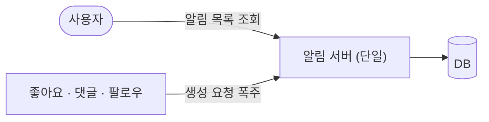
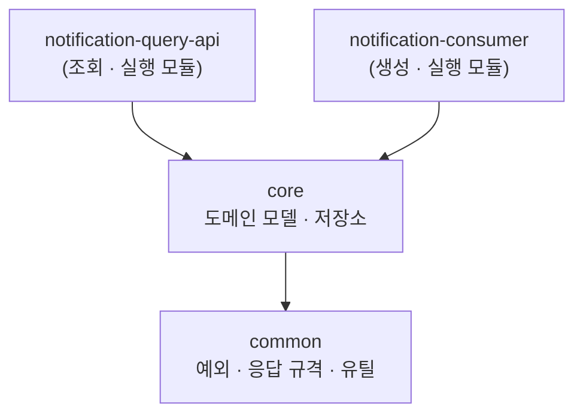

알림 서버 한 대가 좋아요 사건도 받고 알림 목록도 내려주는 구조는 트래픽이 작을 때 아무 문제도 일으키지 않는다. 문제가 드러나는 것은 인기 계정의 게시물 하나에 좋아요가 초당 수천 건 몰리는 순간이고, 그때 느려지는 것은 좋아요를 누른 사람이 아니라 **아무 상관 없이 알림 목록을 열어 본 다른 사용자**다.

[앞 편](/blog/backend-engineering/notification-center-architecture-map/)은 이 어긋남을 세 겹으로 갈라 두었다 — 생성 부하가 조회로 번지는 것, 장애가 알림에서 좋아요 쪽으로 거꾸로 흐르는 것, 그리고 앞의 둘을 끊은 대가로 도메인 코드가 두 벌이 되는 것이다.

이 글이 긋는 선은 두 종류다. **런타임 경계**는 조회와 생성을 다른 프로세스로 띄워 각각 다른 신호를 보고 늘리게 하고, **빌드 경계**는 프로세스를 쪼갠 뒤에도 알림이 무엇인지 아는 코드를 한 벌로 남긴다. 두 경계를 일부러 어긋나게 잡는 것이 이 설계의 핵심이며, 마지막 절은 그 어긋남을 더 밀어 서비스까지 쪼개는 판단을 다룬다.

## 한 서버 안에서 무엇이 먼저 마르는가

분리 전 구조를 그리면 화살표 둘이 한 상자로 모인다.



두 화살표가 다투는 것은 CPU가 아니라 **개수가 정해진 자원**이다. 요청 처리 스레드와 데이터베이스 커넥션 풀에는 상한이 있고, 알림을 만드는 요청이 그 상한을 채우면 뒤에 도착한 조회 요청은 자기 일이 무거워서가 아니라 **차례가 오지 않아서** 느려진다. 응답시간 그래프만 보면 조회 API가 범인처럼 보이지만 조회 쪽 코드는 한 줄도 바뀌지 않았다.

회복 방식은 더 나쁘다. 생성 요청은 밀려도 조금 뒤에 처리하면 그만이지만, 조회 요청이 밀리면 사용자 화면이 비고 그 사용자는 새로고침을 눌러 요청을 한 번 더 만든다. **늦어도 되는 쪽이 자원을 쥐고 있는 동안 늦으면 안 되는 쪽은 부하를 스스로 늘린다.**

그래서 경계는 「부하가 크니까 서버를 늘리자」가 아니라 **늘리는 기준이 서로 다르다**는 데서 나온다. 두 서버를 따로 띄우면 각자 다른 신호를 보고 움직인다.

| | 알림 생성 서버 | 알림 조회 서버 |
| --- | --- | --- |
| 늘리는 신호 | 아직 처리하지 못한 메시지가 쌓인 양 | 응답시간과 초당 요청 수 |
| 늘리면 좋아지는 것 | 밀린 것을 따라잡는 속도 | 동시에 받을 수 있는 사용자 수 |
| 급할 때 줄일 수 있나 | 있다 — 밀린 것은 나중에 따라잡힌다 | 없다 — 지금 화면이 비어 있다 |
| 배포하는 이유 | 사건 종류가 늘 때 | 화면 요구가 바뀔 때 |

마지막 행은 성능과 무관한데도 분리를 지지한다. **함께 배포할 이유가 없는 두 코드는 결국 함께 배포하기 싫어진다.**

## 장애는 중요도의 반대 방향으로 흐른다

부하를 갈라도 남는 문제가 있다. 좋아요 서비스가 알림 서버를 **동기 HTTP로** 부르는 구조라면 알림 서버가 죽는 순간 좋아요 API도 함께 실패한다.


점선이 문제다. 호출한 쪽은 응답을 기다리는 동안 자기 스레드를 붙잡고 있으므로, 알림 서버가 완전히 죽는 것보다 **느리게 살아 있는 편이 더 위험하다.** 죽으면 연결이 즉시 거절되어 빨리 실패하지만, 타임아웃까지 30초를 기다리는 호출이 초당 수천 건 쌓이면 좋아요 서비스의 스레드가 먼저 고갈된다. 알림은 없어도 서비스가 성립하는 부가 기능인데 장애가 번지는 방향은 그 부가 기능에서 핵심 기능 쪽이다.

호출을 브로커를 통한 단방향으로 바꾸면 이 화살표가 끊긴다. 좋아요 서비스는 「좋아요가 눌렸다」는 사실만 던지고 즉시 응답하며, 그 사실을 누가 어떻게 쓰는지 알지 못한다.

| | 동기 호출 | 브로커를 통한 단방향 |
| --- | --- | --- |
| 알림 서버가 죽으면 | 좋아요 API도 실패한다 | 좋아요 API는 정상이다 |
| 알림 서버가 느리면 | 호출한 쪽 스레드가 먼저 마른다 | 호출한 쪽은 영향을 받지 않는다 |
| 스파이크가 오면 | 원 서비스까지 함께 느려진다 | 브로커가 완충 구간이 된다 |
| 알림 서버를 배포하면 | 배포 중 실패 요청이 생긴다 | 밀렸다가 복구 후 처리된다 |
| 대신 지불하는 것 | — | 지연과 중복, 그리고 브로커 자체의 운영 |

오른쪽 열 마지막 행이 다음 편의 몫이다. 알림이 즉시 도착한다는 보장은 사라지고, 같은 사건이 두 번 실려 올 수 있으며, 운영해야 할 구성 요소가 하나 늘어난다. 여기서는 **끊었다는 사실**까지만 확정한다.

## 쪼갠 대가 — 도메인 코드가 두 벌이 된다

서버를 나눈 자리에서 곧바로 새 문제가 나온다. 조회 서버도 알림이 무엇인지 알아야 하고 생성 서버도 알림이 무엇인지 알아야 한다. 저장소에 접근하는 코드, 알림 문서의 구조, 종류별 메시지를 만드는 규칙이 **양쪽 모두에 필요하다.**

프로젝트를 아예 둘로 떼어 놓으면 이 코드는 두 벌이 되고, 두 벌이 된 코드는 반드시 어긋난다 — 알림 문서에 필드를 하나 더할 때 한쪽만 고치면 다른 쪽은 컴파일도 테스트도 통과한 채로 조용히 다른 모양의 문서를 쓴다.

| | 프로젝트를 각각 떼어 놓기 | 한 프로젝트 안에서 모듈 나누기 |
| --- | --- | --- |
| 도메인 코드 | 프로젝트마다 다시 구현한다 | 한 모듈에 한 벌만 둔다 |
| 스키마를 바꾸면 | 고칠 곳을 사람이 기억해야 한다 | 한 곳을 고치면 쓰는 쪽이 전부 깨진다 |
| 공통 코드를 나누려면 | 라이브러리로 뽑아 배포·버전을 관리한다 | 빌드 스크립트에 의존 한 줄을 적는다 |
| 초기 복잡도 | 낮다 | 높다 — 경계를 먼저 설계해야 한다 |
| 어긋남이 드러나는 시점 | 운영 중 | 빌드 중 |

마지막 행이 멀티모듈을 고르는 이유 전부다. **어긋남을 컴파일러가 먼저 발견하게 만드는 것**이 목적이고 초기 복잡도는 그 대가다. 참고로 이 시리즈에서 「모듈」은 언제나 빌드가 갈리는 단위를 가리키며, 따로 띄워 트래픽을 받는 쪽은 「실행 모듈」로 구분해 적는다.

이 알림센터는 모듈 넷으로 나뉜다.



| 모듈 | 아는 것 | 모르는 것 |
| --- | --- | --- |
| `common` | 예외 계층, 응답 포맷, 순수 유틸 | 알림이 무엇인지 모른다 |
| `core` | 알림 문서 구조, 저장소, 도메인 규칙 | 누가 자기를 쓰는지 모른다 |
| `notification-query-api` | 조회 API, 캐시, 문서화 | 이벤트가 어디서 오는지 모른다 |
| `notification-consumer` | 메시지 소비, 사건을 알림으로 바꾸는 변환 | 화면이 무엇을 요구하는지 모른다 |

오른쪽 열이 왼쪽 열보다 중요하다. 모듈을 나누는 실익은 각 모듈이 무엇을 알게 되는가가 아니라 무엇을 **모르도록 강제되는가**에서 나온다. `core`가 조회 API의 응답 형식을 알기 시작하면 화면 요구가 바뀔 때마다 생성 쪽까지 다시 컴파일된다.

## 의존은 한 방향으로만 흐른다

앞 도식의 화살표는 전부 아래를 향한다. 이 방향을 지키는 규칙은 하나뿐이다. **위에서 아래로만 의존하고 역방향과 순환은 금지한다.**

역방향을 한 번이라도 허용하면 모듈 경계는 이름만 남는다. `core`가 실행 모듈 하나를 알게 되는 순간 그 실행 모듈 없이는 `core`를 빌드할 수 없고, 나머지 실행 모듈도 자기와 무관한 코드를 함께 끌고 다니게 된다. 경계는 문서에 적어서 지켜지지 않고 **빌드가 실패해서** 지켜진다.

방향만큼 중요한 것이 의존을 어떤 키워드로 선언하는가다. Gradle에서는 같은 의존이라도 선언 방식에 따라 **다음 모듈까지 전파되는지**가 갈린다.

```groovy
// notification-query-api/build.gradle
dependencies {
    implementation project(':core')   // core가 쓰는 타입은 이 모듈 밖으로 나가지 않는다
}

// core/build.gradle
dependencies {
    api project(':common')            // common의 타입은 core를 쓰는 쪽에도 보인다
}
```

| 키워드 | 컴파일 클래스패스 | 쓰는 자리 |
| --- | --- | --- |
| `implementation` | 다음 모듈로 전파되지 않는다 | 기본값. 고칠 때 다시 컴파일되는 범위가 좁다 |
| `api` | 소비하는 모듈까지 전파된다 | 공용 예외나 응답 규격처럼 **밖에서도 써야 하는 타입**만 |

`api`를 남발하면 의존 그래프는 그대로인데 재컴파일 범위만 넓어진다. `common`을 한 줄 고쳤을 때 실행 모듈 둘이 전부 다시 컴파일된다면 모듈을 나눈 빌드상의 이점은 사라지고 설계상의 이점만 남는다.

## 여기서 멈출 것인가 — 멀티모듈과 MSA

모듈 경계가 이미 깨끗한데 아예 저장소와 팀까지 나눠 서비스로 쪼개면 안 되는가. 두 구조가 겹치는 부분은 넓다 — 관심사를 나누고, 경계를 분명히 하고, 필요한 쪽만 골라 늘린다는 목적은 같으며 실행 모듈을 따로 띄우면 독립적인 확장도 이미 가능하다. 갈라지는 것은 그 경계가 **어디에 그어지는가**다.

| 축 | 멀티모듈 | MSA |
| --- | --- | --- |
| 경계를 강제하는 것 | 컴파일러 | 네트워크와 API 계약 |
| 저장소 | 하나 | 대체로 서비스마다 |
| 모듈 사이 호출 | 같은 프로세스 안의 메서드 호출 | HTTP · gRPC · 메시지 |
| 데이터 | 공유할 수 있다 | 서비스가 자기 것을 소유한다 |
| 트랜잭션 | 로컬 트랜잭션으로 묶인다 | 분산 트랜잭션이나 보상 절차가 필요하다 |
| 경계를 다시 긋는 비용 | 낮다 — 코드를 옮기면 된다 | 높다 — 계약과 배포 경로가 함께 움직인다 |
| 새로 필요한 운영 | 없다 | 서비스 디스커버리, 분산 추적, 장애 격리 |

여섯째 행과 일곱째 행이 값이다. MSA는 경계 하나를 **네트워크 경계로 승격**하는 선택이고, 승격된 경계 위에서는 부분 실패·지연·정합성이 전부 새 비용으로 붙는다. 앞 절에서 브로커를 끼우며 지연과 중복을 받아 든 것과 같은 종류의 거래인데, 이번에는 그 거래를 시스템의 모든 경계에서 한꺼번에 한다.

호출 경로의 개수도 함께 늘어난다. [에이전트를 여럿 두었을 때 라우팅과 디버깅이 동시에 무너지는 이야기](/blog/agentic-coding/scaling-routing-collapse/)가 같은 형태의 문제를 다른 재료로 다루는데, 거기서도 무너지는 것은 개별 구성 요소의 성능이 아니라 **경로를 따라가는 사람의 추적 능력**이다.

## 넘어갈 신호는 조직에서 온다

그렇다면 언제 넘어가는가. 판단 기준을 기술 쪽에서 찾으면 대체로 잘못된 답이 나온다. MSA가 주는 이득은 대부분 **독립 배포와 독립 조직**에서 나오기 때문이다. 한 팀이 한 릴리스 주기를 공유하는 동안에는 그 이득이 발생할 자리가 없고 비용만 먼저 지불된다.

넘어갈 신호는 그래서 세 가지 모양으로 온다.

| 신호 | 무엇이 관찰되는가 | 왜 멀티모듈로는 못 푸는가 |
| --- | --- | --- |
| 배포가 서로를 막는다 | 한 모듈의 릴리스 대기가 다른 팀 일정을 반복해서 밀어낸다 | 같은 코드베이스인 한 릴리스 결정이 한곳에서 난다 |
| 확장 프로파일이 갈린다 | 한쪽만 상시 수십 배 규모로 떠 있어야 한다 | 실행 모듈로도 되지만 자원·의존이 함께 커진다 |
| 폭발 반경을 끊어야 한다 | 한 기능의 장애가 같은 프로세스의 다른 기능을 함께 내린다 | 프로세스를 공유하는 한 격리에 한계가 있다 |

세 신호는 전부 **조직이나 운영에서 관측되는 것**이지 코드에서 관측되는 것이 아니다. 코드가 지저분해서 MSA로 가는 것은 순서가 뒤집힌 판단인데, 경계가 지저분한 상태로 네트워크를 사이에 끼우면 옮겨 가는 것이 깨끗한 경계가 아니라 그 지저분함이기 때문이다.

반대로 보면 멀티모듈은 **예행연습**의 성격을 가진다. 모듈 경계가 실제로 지켜지고 있다면 그 경계선을 서비스 경계로 승격하는 일은 어렵지 않고, 지켜지지 않고 있다면 그 사실이 승격 전에 드러난다.

## 정리

이 편이 그은 선은 성격이 다른 둘이었다. 조회와 생성 사이, 그리고 원 서비스와 알림 사이에 그은 **런타임 경계**는 늘리는 기준이 다르고 장애가 번지면 안 되는 것들을 갈라놓는다. 모듈 사이에 그은 **빌드 경계**는 갈라놓은 것들이 같은 도메인 코드를 계속 공유하게 만든다. 두 경계가 일치하지 않는다는 점이 가장 자주 오해받는 자리다 — 따로 띄운다고 해서 따로 만들 이유는 없다.

남은 것은 대가다. 동기 호출을 끊은 자리에는 브로커가 놓였고, 그 위에서 메시지는 늦게 도착할 수 있으며 같은 사건이 두 번 실려 올 수도 있다. [다음 편](/blog/backend-engineering/kafka-messaging-and-delivery-guarantees/)은 그 브로커의 내부 구조에서 시작해, 두 번 도착한 것을 한 번처럼 다루는 방법과 끝내 처리되지 않는 한 건을 줄 밖으로 빼내는 장치까지 내려간다.
