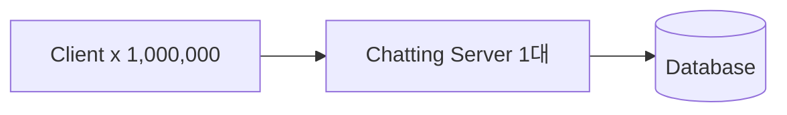
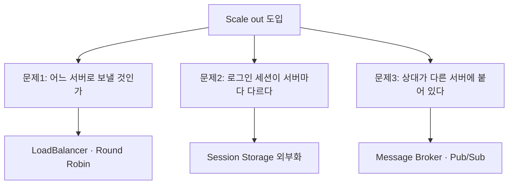
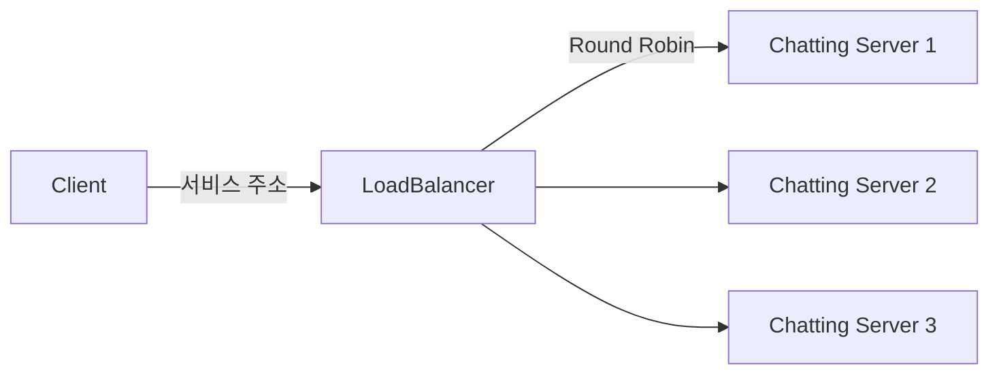
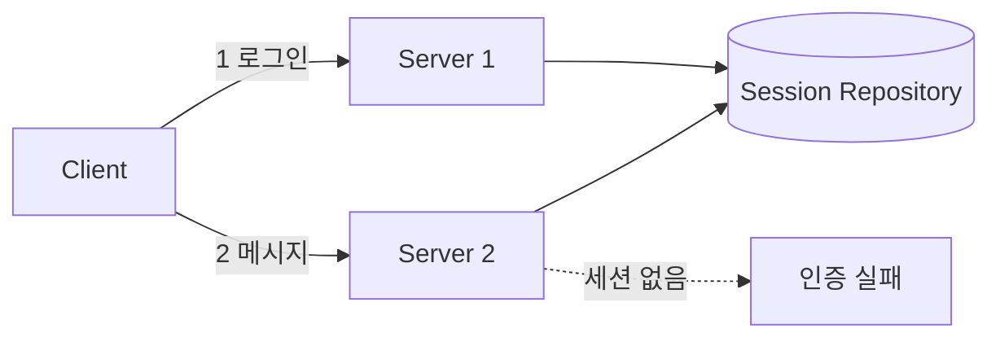
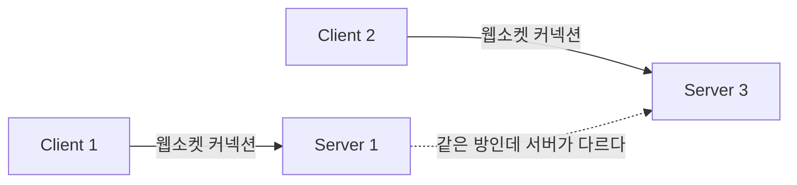
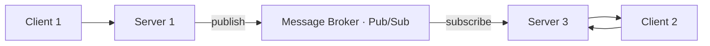
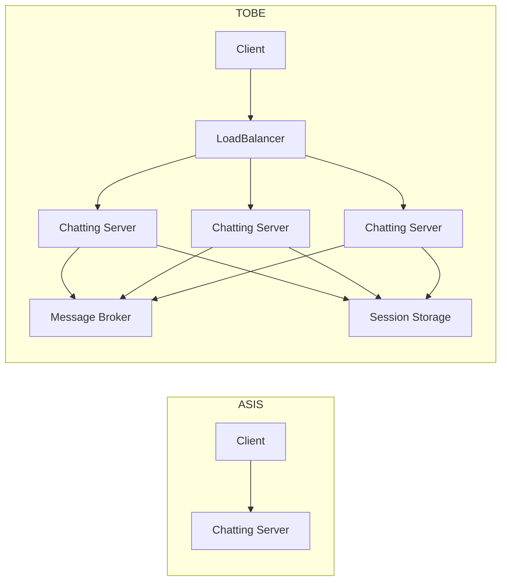
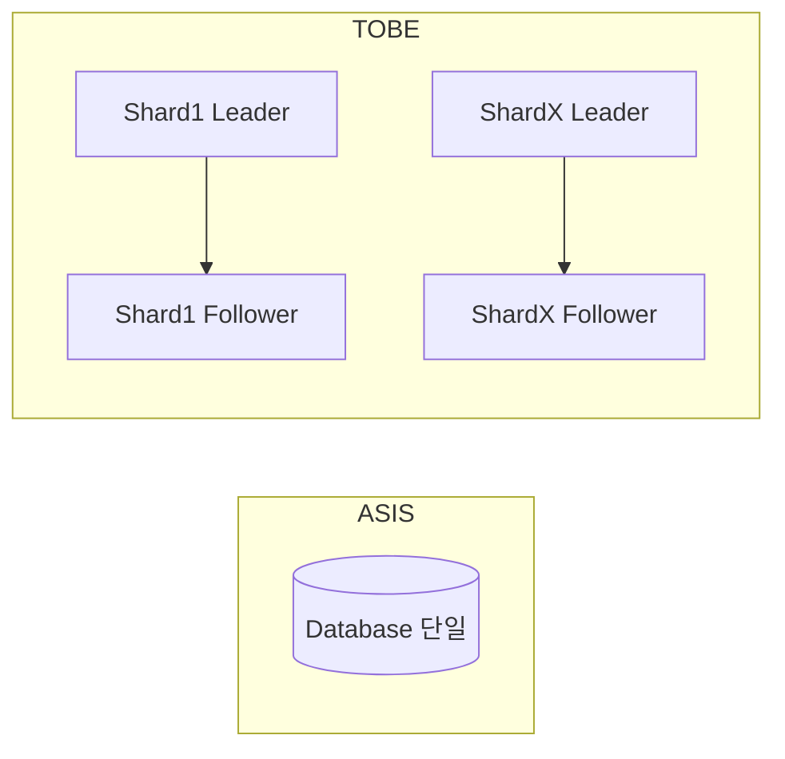

여기까지는 서버가 한 대라는 전제 위에 있었다. 이 편은 그 전제를 걷어낸다.

사용자가 1만에서 10만, 100만으로 늘면 한 대로는 감당할 수 없다. 손댈 방향은 둘뿐이다.



| 전략 | 방법 | 한계 |
|---|---|---|
| **Scale up (수직)** | CPU·메모리를 키운다 | 한계가 명확하고 비용이 지수적. **단일 장애점(SPOF)이 그대로** |
| **Scale out (수평)** | 서버 대수를 늘린다 | 상태(state)를 어디에 둘지 문제가 생긴다 ← WebSocket의 핵심 난점 |

수직 확장은 언젠가 벽에 닿고, 그전에 **한 대가 죽으면 서비스가 죽는다**는 성질이 남는다. 그래서 답은 수평 확장이지만, 오른쪽 열이 예고하듯 그 순간 새 문제가 열린다.

## 서버를 늘리면 세 가지가 깨진다



셋 중 앞의 둘은 WebSocket이 아니어도 겪는다. 어떤 웹 서비스든 서버를 늘리면 분배와 세션 문제가 온다. **셋째만이 WebSocket 고유의 것**이고, 그것이 이 편에서 가장 긴 절을 차지한다.

## 문제 1 — 트래픽 분배: 긴 연결은 고르게 나뉘지 않는다



로드밸런서를 앞에 두는 것 자체는 표준적인 구성이다. 그런데 WebSocket에서는 익숙한 알고리즘이 익숙하게 동작하지 않는다.

| 항목 | 내용 |
|---|---|
| 알고리즘 | Round Robin, Least Connection, IP Hash 등 |
| WebSocket 특이점 | **연결이 길게 유지**되므로 Round Robin으로도 연결 수가 쉽게 불균형해진다. 배포 직후 새 서버에 연결이 안 붙는 현상도 같은 원인 |
| 필수 설정 | L7 LB에서 `Upgrade`·`Connection` 헤더 전달 허용, **idle timeout을 하트비트 주기보다 길게** |
| 권장 | Least Connection 계열 + 연결 수 기반 오토스케일 지표 |

둘째 행이 요지다. 라운드 로빈은 **요청을 고르게 나눈다.** HTTP처럼 요청이 짧게 왔다 가면 요청 수의 균형이 곧 부하의 균형이지만, WebSocket에서는 한 번의 분배가 몇 시간짜리 부하가 된다. 새로 뜬 서버는 그동안 쌓인 연결을 넘겨받지 못하므로, 트래픽이 잦아든 시간대에 투입되면 거의 비어 있는 채로 남는다.

그래서 지표도 달라진다. **초당 요청 수가 아니라 서버별 활성 연결 수가 오토스케일의 기준**이 되어야 한다. 세 번째 행의 idle timeout 설정은 1편에서 본 하트비트 주기와 짝을 이룬다 — 하트비트가 인프라 타임아웃보다 촘촘해야 멀쩡한 연결이 끊기지 않는다.

## 문제 2 — 세션: 서버가 상태를 들고 있으면 안 된다



1번 서버에서 로그인한 사용자의 다음 요청이 2번 서버로 가면, 2번 서버는 그 사용자를 모른다. 해결책은 셋이고 각각 다른 것을 포기한다.

| 전략 | 동작 | 장점 | 단점 / 실패 모드 |
|---|---|---|---|
| **Sticky Session** | LB가 쿠키·IP 해시로 같은 서버에 고정 | 코드 변경 없음, 즉시 적용 | 해당 서버가 죽으면 **그 서버의 세션 전부 소멸**. 부하가 쏠려도 재분배 불가. 배포 시 롤링 재시작마다 세션 유실 |
| **Session 외부화 (Redis)** | 세션을 Redis에 저장, 모든 서버가 공유 | 무상태 서버 → 자유로운 스케일아웃·무중단 배포 | Redis가 새 SPOF(→ 클러스터·센티넬 필요). 매 요청 네트워크 왕복. **직렬화 계약이 생김** |
| **JWT (stateless)** | 토큰 자체에 인증 정보 | 저장소 자체가 불필요 | **즉시 무효화가 어렵다**(로그아웃·권한 회수). 토큰 크기 증가 |

스티키 세션은 "상태를 그대로 두고 라우팅으로 피해 가는" 방식이다. 당장은 가장 싸지만 **문제를 해결한 것이 아니라 미룬 것**이다. 서버가 죽거나 배포로 내려가는 일은 정상 운영에서 계속 일어나고, 그때마다 그 서버에 묶인 사용자들이 로그아웃된다.

이 설계가 택한 방식은 세션 외부화다.

```gradle
implementation 'org.springframework.boot:spring-boot-starter-data-redis'
implementation 'org.springframework.session:spring-session-data-redis'
```

### 세션을 밖으로 내보내면 직렬화 계약이 생긴다

```java
@Entity
public class Member implements Serializable { /* ... */ }

public class CustomOAuth2User implements OAuth2User, Serializable {
    Member member;
    Map<String, Object> attributeMap;
}
```

3편에서 미뤄 둔 `Serializable`이 여기서 필요해진다. **세션이 Redis로 나가는 순간 세션에 담긴 모든 객체가 직렬화 대상이 된다.** 인증 주체인 `CustomOAuth2User`와 그 안에 들어 있는 `Member`까지 전부 해당한다.

**안 하면 무슨 일이 나는가.** 로그인 직후 `NotSerializableException`이 난다. 이것은 즉시 드러나므로 오히려 다루기 쉬운 쪽이다.

고약한 것은 그다음이다. **필드를 하나 추가하고 롤링 배포를 하면**, 아직 교체되지 않은 구버전 서버가 신버전 서버가 써 놓은 세션을 역직렬화하지 못한다. 요청이 어느 서버로 가느냐에 따라 로그인 상태가 있다 없다 한다. 재현이 어렵고, 배포가 끝나면 저절로 사라져 원인을 찾기 전에 넘어가게 된다.

실무에서 이것을 피하는 방법은 두 가지다.

- **세션에는 식별자와 권한만 넣는다.** `memberId`와 역할 정도면 충분하고, 나머지는 필요할 때 조회한다. 세션에 엔티티를 통째로 넣는 것은 편의를 위해 직렬화 계약의 표면적을 넓히는 일이다.
- **직렬화 포맷을 Java 기본 대신 JSON으로 고정한다.** 필드 추가에 대한 내성이 생기고, 저장된 내용을 사람이 읽을 수 있어 운영 중 확인이 가능해진다.

JPA 엔티티를 세션에 넣을 때는 문제가 하나 더 있다. 지연 로딩 프록시가 함께 직렬화되려다 터진다. 위 첫 번째 방법은 이 문제도 함께 없앤다. 세션 저장소로서 Redis를 어떻게 다룰지는 [Redis 저장 구조와 운영](/blog/backend-engineering/redis-storage-and-operations/)에서 다뤘다.

## 문제 3 — 연결은 외부화할 수 없다



**여기가 WebSocket 스케일아웃의 본질적 난점이다.**

세션 문제는 Redis로 풀렸다. 상태를 밖으로 꺼내 모두가 공유하게 만드는 방식이었다. 그런데 **연결에는 그 방법을 쓸 수 없다.** TCP 연결은 특정 서버 프로세스에 물리적으로 붙어 있다. 1번 서버가 2번 클라이언트에게 메시지를 보내려면, 그 소켓을 쥐고 있는 3번 서버를 반드시 거쳐야 한다.

2편에서 본 내장 브로커의 성질이 여기서 실제 사고가 된다. `SimpleBroker`는 자기 프로세스 안의 구독자만 알고 있으므로, **서버가 두 대가 되는 순간 조용히 절반의 메시지를 잃는다.** 예외도 로그도 남지 않는다. 보낸 쪽에서는 정상적으로 전송됐고, 같은 서버에 붙은 사람들에게는 실제로 도착한다. 못 받는 사람만 못 받는다.

### 브로커를 밖에 둔다



해법의 모양은 세션과 같다. 프로세스 안에 있던 것을 밖으로 꺼내 모든 서버가 같은 것을 보게 만든다. 다만 꺼내는 대상이 상태가 아니라 **전달 경로**다.

| 브로커 | 성격 | 장점 | 단점 / 언제 쓰나 |
|---|---|---|---|
| **SimpleBroker (내장)** | 인메모리, 프로세스 로컬 | 의존성 0, 개발·단일 서버에 즉시 | **다중 서버 불가**, 메시지 영속성 없음, 서버 재시작 시 전부 소멸 |
| **RabbitMQ / ActiveMQ (STOMP Relay)** | 전용 메시지 브로커 | STOMP를 네이티브 지원 → 설정 교체만으로 전환. ACK·영속 큐 | 브로커 운영 부담. 브로커가 SPOF가 되지 않게 클러스터링 필요 |
| **Redis Pub/Sub** | 경량 발행/구독 | 이미 세션용 Redis가 있으면 추가 비용 적음 | **전달 보장 없음**(구독자가 없으면 소실). 채팅 정도엔 충분하나 금융성 메시지엔 부적합 |
| **Kafka** | 로그 기반 스트림 | 높은 처리량, 재처리·이력 보관, 저장과 분석을 함께 | 지연이 상대적으로 큼, 방 단위 팬아웃엔 과한 구조. 채팅 저장·분석 파이프라인 쪽에 적합 |

코드 변경은 놀랄 만큼 작다. `enableSimpleBroker("/topic")`을 `enableStompBrokerRelay("/topic", "/queue")`로 바꾸는 정도다. 2편에서 "브로커 선택은 나중에 바꾸려면 메시지 흐름 전체를 다시 검증해야 한다"고 한 것은 이 한 줄 때문이 아니라, 전달 보장·순서·장애 시 동작이 전부 달라지기 때문이다.

세 번째 행은 특히 판단이 필요하다. Redis Pub/Sub은 이미 세션 때문에 Redis를 띄워 뒀다면 추가 비용이 거의 없다. 대신 **전달 보장이 없다** — 발행 시점에 구독자가 없으면 그 메시지는 그냥 사라진다. 서버가 재시작 중이던 짧은 순간에 오간 메시지가 조용히 없어진다는 뜻이고, 채팅에서는 감수할 만하지만 결제나 주문 알림에서는 그렇지 않다.

### 브로커를 넣어도 남는 것

여기서 놓치기 쉬운 사실 하나를 못 박아 둔다. **브로커를 도입해도 연결 자체는 여전히 서버에 고정되어 있다.**

브로커가 하는 일은 "메시지를 옳은 서버로 배달"하는 것까지다. 그 서버가 죽으면 거기 붙어 있던 연결은 전부 끊기고, 브로커는 그것을 대신해 주지 못한다. 무상태 서버를 만들었다는 말이 **연결까지 무상태가 됐다는 뜻은 아니다.**

그래서 **클라이언트 재연결 로직이 반드시 필요하다.** 그리고 그 재연결은 단순히 다시 붙는 것이어서는 안 된다. 서버 한 대가 죽으면 거기 붙어 있던 수만 개의 연결이 동시에 끊기고, 전부 즉시 재접속하면 남은 서버들이 그 폭풍을 맞는다. **지수 백오프에 랜덤 지터를 더해** 재접속 시점을 흩어야 한다.

## 최종 아키텍처



왼쪽에서 오른쪽으로 오면서 늘어난 상자가 셋이다. 로드밸런서가 문제 1을, 세션 저장소가 문제 2를, 메시지 브로커가 문제 3을 맡는다. **서버 상자에서 상태가 빠져나간 것**이 이 그림의 요지다.

### 스케일아웃 후에도 남는 숙제

| 숙제 | 내용 | 대응 |
|---|---|---|
| 무중단 배포 | 서버를 내리면 그 서버의 모든 연결이 끊김 | graceful shutdown으로 신규 연결 차단 후 기존 연결 소진 대기 + 클라이언트 자동 재연결 |
| 재연결 폭주 | 서버 1대가 죽으면 수만 연결이 동시에 재접속 | 지수 백오프 + 랜덤 지터. LB의 신규 연결 rate limit |
| 연결 수 한계 | 파일 디스크립터, 포트, 힙 메모리 | `ulimit` 상향, 연결당 메모리 예산 산정, 세션 맵 정리 |
| 메시지 순서 | 서버·브로커를 거치며 순서가 뒤바뀔 수 있음 | 방 단위 시퀀스 번호 부여, 클라이언트 정렬 |
| 관측성 | 연결 수·구독 수·브로커 지연이 안 보이면 장애 원인을 못 찾음 | 서버별 활성 세션 수, 브로커 큐 depth, 하트비트 실패율 지표화 |

첫 두 행이 짝을 이룬다. 무중단 배포를 하려면 연결을 끊어야 하고, 끊으면 재연결이 몰린다. **WebSocket 서비스의 배포는 HTTP 서비스의 배포보다 구조적으로 어렵다** — 무상태 서버라면 새 요청을 새 서버로 보내면 그만이지만, 여기서는 이미 붙어 있는 연결을 어떻게 옮길지가 남는다.

## 데이터베이스 — 여기서부터는 이미 다룬 문제다

웹 서버를 늘리고 나면 부하가 데이터베이스로 내려간다. 그런데 이 지점의 선택지는 채팅에 고유한 것이 아니라 **모든 서비스가 같은 순서로 겪는 것**이고, 이 블로그에서 이미 시리즈 하나로 다뤘다.

| 필요한 것 | 어디에 있나 |
|---|---|
| 여러 대를 하나처럼 — 복제 토폴로지와 지연 | [복제](/blog/backend-engineering/replication-topologies-and-lag/) |
| 한 DB 안에서 쪼개기 — 수평·수직 파티셔닝 | [파티셔닝의 출발점](/blog/backend-engineering/partitioning-fundamentals/) |
| 여러 인스턴스로 분산 — 샤드 키와 전략 | [파티셔닝 전략과 샤딩](/blog/backend-engineering/partitioning-strategies-and-sharding/) |
| 저장소를 무엇으로 고를 것인가 | [관계형 데이터베이스와 NoSQL](/blog/backend-engineering/rdbms-and-nosql-fundamentals/) |

이 편에서는 **그 개념을 다시 설명하는 대신, 채팅에 적용할 때 달라지는 것**만 본다. 셋이다.

### 읽기/쓰기 분리를 Spring에서 구현하면 함정이 하나 있다

읽기를 복제본으로 보내는 것은 표준적인 처방이다. Spring에서는 `AbstractRoutingDataSource`로 구현한다.

```java
public class ReadWriteRoutingDataSource extends AbstractRoutingDataSource {
    @Override
    protected Object determineCurrentLookupKey() {
        if (TransactionSynchronizationManager.isCurrentTransactionReadOnly()) {
            return "replica";
        }
        return "primary";
    }
}
```

읽기 전용 트랜잭션이면 복제본으로, 아니면 원본으로 보낸다. 코드는 명확한데, 이대로 두면 **모든 요청이 원본으로 간다.** 라우팅이 동작하지 않는 것이 아니라, 라우팅 키를 평가하는 시점이 너무 이르다.

```java
@Bean
public DataSource readWriteDataSource() {
    return new LazyConnectionDataSourceProxy(createReadWriteRoutingDataSource());
}
```

**`LazyConnectionDataSourceProxy`가 이 구성의 핵심이다.** 이것이 없으면 Spring은 트랜잭션을 시작하는 시점에 커넥션을 먼저 얻는데, 그 순간에는 아직 읽기 전용 플래그가 세팅되기 전이다. `determineCurrentLookupKey()`가 항상 거짓을 보고 원본을 고른다.

프록시는 **실제로 첫 쿼리가 나가는 순간까지 커넥션 획득을 미룬다.** 그때는 플래그가 이미 세팅돼 있으므로 라우팅이 의도대로 평가된다.

운영에서 함께 챙길 것이 둘이다.

- **`readOnly`를 붙이는 것이 개발자의 규율에 달려 있다.** 읽기 메서드에 빠뜨리면 조용히 원본 부하가 올라간다. 실패가 눈에 보이지 않으므로 코드 리뷰 항목으로 두는 편이 낫다.
- **복제 지연이 채팅에서 특히 아프다.** 방금 보낸 메시지를 곧바로 다시 읽는 흐름이라, 복제본에서 읽으면 자기가 보낸 메시지가 안 보인다. 쓰기 직후 조회만 원본으로 보내는 예외 규칙이 필요하다. 이 현상의 일반적인 형태는 [복제](/blog/backend-engineering/replication-topologies-and-lag/) 편에 정리돼 있다.

### 메시지만 성격이 다르다

3편에서 회원·채팅방·메시지를 한 RDB에 넣었다. 그중 메시지만 성질이 다르다.

| 메시지의 성질 | RDB가 주는 것 중 쓰이는가 |
|---|---|
| 압도적인 쓰기 편중 | — |
| 수정·삭제가 거의 없음 | 갱신 트랜잭션이 필요 없다 |
| 조인이 필요 없음 | 조인 최적화가 필요 없다 |
| 방 단위 시계열 조회만 | 복잡한 질의 계획이 필요 없다 |

**RDB의 강점을 거의 하나도 쓰지 않는다.** 그래서 메시지 원장을 컬럼 패밀리나 도큐먼트 저장소로 옮기는 선택이 나온다. 특히 `(room_id, created_at)`을 클러스터링 키로 잡을 수 있는 저장소라면, 3편에서 본 커서 페이징 접근 패턴과 물리 저장 순서가 정확히 일치한다.

현실적인 절충은 전부 옮기는 것이 아니다. **회원·채팅방·권한은 RDB에 두고 메시지 본문만 분리하는 하이브리드**가 가장 흔하다. 관계와 무결성이 필요한 쪽과 그렇지 않은 쪽이 명확히 갈리기 때문이다. 저장소별 성격 비교는 [관계형 데이터베이스와 NoSQL](/blog/backend-engineering/rdbms-and-nosql-fundamentals/) 편에 있다.

### 최종 DB 구성은 곱하기다



샤딩과 복제는 대체재가 아니라 **곱해서 쓰는 것**이다. 샤딩이 쓰기를 나누고, 각 샤드 안에서 복제가 읽기를 늘리며 가용성을 준다. 둘 중 하나만으로는 한쪽 축만 해결된다.

## 정리

- **셋 중 둘은 일반적인 문제다.** 트래픽 분배와 세션은 어떤 서비스든 서버를 늘리면 겪는다. WebSocket 고유의 것은 셋째뿐이고, 그것이 이 편이 가장 길게 다룬 자리다.
- **연결은 외부화할 수 없다.** 세션은 밖으로 꺼내 공유할 수 있지만 TCP 연결은 프로세스에 붙어 있다. 브로커는 메시지를 옳은 서버로 배달할 뿐, 서버가 죽으면 그 연결들은 함께 죽는다.
- **세션 외부화는 직렬화 계약을 만든다.** `NotSerializableException`은 즉시 드러나 오히려 쉽고, 롤링 배포 중 구버전이 신버전의 세션을 못 읽는 쪽이 훨씬 고약하다. 세션에는 식별자와 권한만 넣는 것이 근본 대응이다.
- **DB 확장은 채팅에 고유한 문제가 아니다.** 달라지는 것은 셋이다 — 라우팅 데이터소스의 커넥션 획득 시점, 쓰고 바로 읽는 흐름에서의 복제 지연, 그리고 메시지만 RDB의 강점을 쓰지 않는다는 사실.

다음 편은 이 시리즈가 내린 판단들을 문답으로 되짚는다. 선택지 앞에서 무엇을 근거로 갈랐는지, 각 선택이 어떤 실패 모드를 남기는지를 선택지 표·실패 모드 표·25문답 세 형태로 다시 세운다. 실시간 기능을 지금 설계해야 하는 상황, 그리고 이미 운영 중인 채팅에서 원인이 잡히지 않는 미도달·끊김·중복을 추적하는 상황에서 쓸모가 있다.
