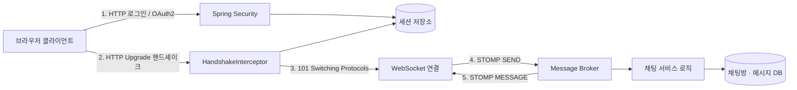
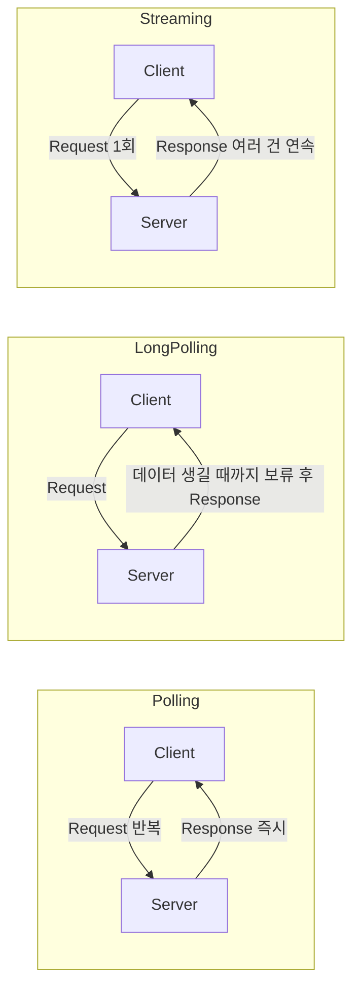
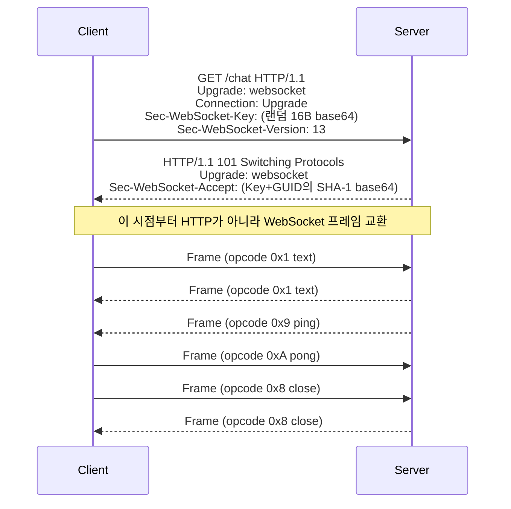

"실시간으로 보이게 해 달라"는 요구는 기술의 이름이 아니라 증상의 이름이다. 같은 문장 아래에 알림이 30초쯤 늦어도 되는 문제, 진행률이 끊기지 않고 흘러야 하는 문제, 그리고 양쪽이 서로에게 말을 걸어야 하는 문제가 함께 들어 있다. 이 셋은 서로 다른 해법을 요구하고, 그중 하나만 WebSocket을 필요로 한다.

구분이 중요한 이유는 WebSocket이 어렵기 때문이 아니라 **연결이 특정 서버에 고정되는 순간부터 배포·스케일아웃·헬스체크 전부에 제약이 생기기 때문**이다. 알림 전용 기능에 WebSocket을 깔면 배포할 때마다 전 사용자의 연결이 끊기고, 끊긴 클라이언트가 동시에 재접속하면서 되살아난 서버를 다시 넘어뜨린다. 그 비용을 치를 만큼 양방향성이 필요한지가 첫 질문이어야 한다.

이 글은 그 판단의 지도를 그린다. 서버가 먼저 말을 걸 수 없다는 HTTP의 제약을 우회하는 방식이 몇 가지이고 각각 무엇을 포기하는지, 그중 WebSocket을 골랐을 때 연결이 어떻게 열리고 무엇이 프레임에 실려 가는지, 그리고 열린 연결이 살아 있다는 것을 무엇으로 확인하는지다.

## 이 시리즈의 구성

실시간 채팅의 설계는 네 질문이 사슬로 이어진다. **연결을 어떻게 열 것인가, 그 위에 무엇을 얹을 것인가, 보낸 사람을 어떻게 확인할 것인가, 서버를 늘리면 무엇이 깨지는가.** 뒤의 질문은 앞의 답이 정해져야 비로소 성립한다. 연결을 열어 두기로 한 순간이 마지막 질문의 난점을 통째로 만들어 낸다.

편은 다섯이고 질문 하나씩을 맡는다. 어느 편부터 읽어도 그 편만으로 말이 되도록 썼다. 예외는 용어뿐이다. 층이 섞이기 쉬운 약어들이라 한자리에 모아 이 글에 뒀다.

| 편 | 다루는 것 |
|---|---|
| **1. 전송 방식과 WebSocket 프로토콜** (이 글) | 용어 사전, 다섯 전송 방식의 선택 기준, 핸드셰이크, 프레임 구조, 하트비트 |
| 2. STOMP와 Spring의 WebSocket 지원 | 생 WebSocket의 공백, STOMP 프레임과 destination 규약, Spring의 세 층위, 핸드셰이크 인증 |
| 3. OAuth2 로그인과 채팅 도메인 | 회원가입 인프라, Authorization Code Grant, 도메인 모델, 페이징과 신규 알림 |
| 4. 스케일아웃과 세션 | 서버를 늘리면 깨지는 세 가지, 스티키 세션과 세션 외부화, 서버 간 메시지 전파, 읽기/쓰기 분리 |
| 5. 실시간 채팅 Q&A | 트레이드오프와 실패 모드, 25문답 |

## 용어 정리

약어를 한 줄로 늘어놓으면 오히려 헷갈린다. `SockJS`와 `STOMP`는 둘 다 "WebSocket을 쓸 때 함께 나오는 것"처럼 들리지만, 하나는 WebSocket을 **못 쓸 때 대신 무엇을 쓸 것인가**의 이야기이고 다른 하나는 WebSocket을 **쓴 다음 그 위에 무엇을 얹을 것인가**의 이야기다. 하나는 아래를 보고 하나는 위를 본다.

그래서 이 시리즈에 나오는 약어 **24개 전부를 다섯 묶음(9 · 4 · 3 · 3 · 5)에 하나씩 넣었다. 가르는 기준은 그 개념이 어느 층의 문제에서 태어났는가**다. 이 층 나누기는 원문에 있던 것이 아니라 이 글이 매긴 것이다.

### 전송 층 — 9개

연결을 어떻게 열고 무엇을 실어 보내는가에서 생기는 개념들이다. 이 층의 선택이 나머지 전부를 규정한다.

| 약어 | 원어 | 뜻 |
|---|---|---|
| WS / WSS | WebSocket / WebSocket Secure | TCP 위에서 동작하는 양방향 통신 프로토콜(RFC 6455). WSS는 TLS 적용본 |
| Upgrade | HTTP Upgrade | HTTP 연결을 다른 프로토콜로 전환 요청하는 헤더. WebSocket 핸드셰이크의 진입점 |
| Frame | WebSocket Frame | WS의 최소 전송 단위. FIN·opcode·MASK·payload len·masking-key·payload로 구성 |
| opcode | operation code | 프레임 종류 코드(0x1 text, 0x2 binary, 0x8 close, 0x9 ping, 0xA pong 등) |
| SSE | Server-Sent Events | HTTP 위 서버→클라이언트 단방향 푸시. `text/event-stream` |
| Polling | Polling | 클라이언트가 일정 간격으로 반복 요청 |
| Long Polling | Long Polling | 응답할 데이터가 생길 때까지 서버가 응답을 붙잡아 두는 방식 |
| Streaming | HTTP Streaming | 한 번의 연결로 서버가 다수 응답을 흘려보내는 방식 |
| SockJS | SockJS | WS를 못 쓰는 환경에서 xhr-streaming·xhr-polling 등으로 자동 대체(fallback)해 주는 라이브러리 |

### 메시징 층 — 4개

연결이 열린 다음, 그 위에 "누가 어디로 보내는 메시지인지"를 얹는 층이다. 전송 층은 바이트를 옮길 뿐 목적지를 모른다.

| 약어 | 원어 | 뜻 |
|---|---|---|
| STOMP | Simple Text Oriented Messaging Protocol | WS 위에 얹는 텍스트 기반 메시징 서브프로토콜. 명령어+헤더+바디 구조 |
| SimpleBroker | Simple Message Broker | Spring 내장 인메모리 STOMP 브로커. 단일 프로세스 안에서만 동작 |
| Relay | STOMP Broker Relay | 외부 브로커(RabbitMQ/ActiveMQ)로 STOMP를 중계하는 Spring 구성 |
| Pub/Sub | Publish/Subscribe | 발행자와 구독자를 브로커로 분리하는 메시징 패턴 |

### 신원 층 — 3개

메시지에 보낸 사람의 이름을 붙이는 층이다. 채팅은 익명일 수 없다는 요구에서 나온다.

| 약어 | 원어 | 뜻 |
|---|---|---|
| OAuth2 | Open Authorization 2.0 | 제3자 서비스에 비밀번호를 주지 않고 권한을 위임하는 인가 프로토콜 |
| Authorization Code | 인가 코드 | OAuth2에서 액세스 토큰과 교환하기 위한 1회성 코드 |
| JWT | JSON Web Token | 서명된 자기완결형 토큰. 서버가 세션을 들고 있지 않아도 검증 가능 |

### 저장 층 — 3개

오간 메시지를 남기는 층이다. 실시간성과 무관해 보이지만, 과거 메시지 조회가 채팅 화면의 절반을 차지한다.

| 약어 | 원어 | 뜻 |
|---|---|---|
| ORM | Object-Relational Mapping | 객체와 관계형 테이블을 매핑하는 기법 |
| JPA | Java Persistence API | 자바 ORM 표준 명세. 구현체는 Hibernate 등 |
| Hikari | HikariCP | Spring Boot 기본 JDBC 커넥션 풀 |

### 확장 층 — 5개

서버를 한 대에서 여러 대로 늘리는 순간 생기는 개념들이다. WebSocket은 연결이 한 서버에 붙어 있으므로 이 층에서 가장 크게 값을 치른다.

| 약어 | 원어 | 뜻 |
|---|---|---|
| Sticky Session | 고정 세션 | 로드밸런서가 같은 클라이언트를 항상 같은 서버로 보내는 정책 |
| Scale up / out | 수직 확장 / 수평 확장 | 서버 사양을 키움 / 서버 대수를 늘림 |
| Clustering | 클러스터링 | 여러 서버를 하나의 시스템처럼 동작시키는 기술 |
| Partitioning | 파티셔닝 | 한 DB 안에서 테이블을 논리적 조각으로 나누는 기법(수평/수직) |
| Sharding | 샤딩 | 데이터를 여러 DB 인스턴스에 분산 저장하는 기법 |

## 전체 그림 — 네 겹의 문제

시리즈 전체가 푸는 것을 한 장으로 놓으면 이렇다. 왼쪽에서 오른쪽으로 갈수록 층이 올라가고, 각 층은 아래 층이 해결하지 못한 것을 떠맡는다.



네 겹을 문제와 해법의 쌍으로 적으면 이렇게 된다.

| # | 문제 | 해법 | 다루는 편 |
|---|---|---|---|
| 1 | HTTP는 서버가 먼저 말을 걸 수 없다. 폴링으로 흉내 내면 요청 오버헤드와 지연이 남는다 | 연결을 열어 두고 양방향 프레임을 주고받는다 | 이 글 |
| 2 | 생 WebSocket은 "누가 어떤 방에 보내는 메시지인지"를 모른다 | STOMP와 브로커로 destination 기반 Pub/Sub을 얻는다 | 2편 |
| 3 | 채팅은 익명일 수 없다. 누가 보냈고 누가 볼 수 있는지가 필요하다 | 폼 로그인과 OAuth2, 그리고 핸드셰이크 시점 인증 | 3편 |
| 4 | 서버 1대는 반드시 부족해진다. 그런데 연결은 특정 서버에 붙어 있다 | 세션 외부화와 서버 간 메시지 전파 | 4편 |

문제 4가 문제 1의 해법에서 곧장 파생된다는 점이 이 시리즈의 골격이다. **연결을 열어 두기로 한 결정이 확장의 난점을 만든다.** 그래서 첫 질문이 "정말 열어 둬야 하는가"가 된다.

## 서버가 먼저 말을 걸 수 없다는 제약

HTTP는 클라이언트가 묻고 서버가 답하는 구조다. 서버에 새 메시지가 도착해도 서버 쪽에서 연결을 열어 밀어 넣을 방법이 없다. 이 제약을 우회하려는 시도가 순서대로 나왔고, 각각이 무엇을 포기했는지가 선택의 근거가 된다.



**폴링**은 클라이언트가 일정 간격으로 계속 묻는다. 구현이 가장 단순한 대신 두 가지를 잃는다. 갱신 주기가 폴링 간격에 묶여 지연의 하한이 정해지고, 대부분 "새것 없음"으로 끝나는 요청마다 헤더와 연결 수립 비용을 전부 치른다.

**롱 폴링**은 서버가 응답할 것이 생길 때까지 응답을 붙잡아 둔다. 지연은 사라지지만 응답을 한 번 보내면 연결이 끝나므로 클라이언트가 곧바로 다시 요청해야 한다. 이벤트가 잦으면 실질적으로 폴링과 같아진다.

**HTTP 스트리밍**은 한 번의 연결로 서버가 여러 응답을 연속해서 흘려보낸다. 재연결이 사라지지만 방향은 여전히 한쪽이다.

### 다섯 방식의 비교

| 방식 | 방향 | 연결 | 지연 | 오버헤드 | 언제 쓰나 |
|---|---|---|---|---|---|
| Polling | 요청/응답 | 매번 새로 | 폴링 주기만큼 | 헤더·핸드셰이크 반복으로 가장 큼 | 갱신 주기가 분 단위이고 구현을 단순하게 두고 싶을 때 |
| Long Polling | 요청/응답 | 응답까지 유지 | 낮음 | 응답마다 재연결 | 이벤트가 드물고 WS를 못 쓰는 환경 |
| HTTP Streaming | 서버→클라 단방향 | 1회 연결 유지 | 낮음 | 중간 | 로그 스트림 등 단방향 흐름 |
| SSE | 서버→클라 단방향 | 1회 연결 유지 | 낮음 | 낮음(텍스트 전용, 자동 재연결 내장) | 알림·피드·진행률처럼 **서버가 일방적으로 밀어주는** 경우 |
| WebSocket | 양방향 | 1회 연결 유지 | 가장 낮음 | 프레임 헤더 2~14바이트로 가장 작음 | 채팅·게임·주식 호가·협업 툴처럼 **양쪽이 다 말하는** 경우 |

표를 세로로 읽으면 지연과 오버헤드가 아래로 갈수록 나아진다. 그래서 맨 아래를 고르는 것이 당연해 보이지만, 이 표에 없는 열이 하나 있다. **인프라를 그대로 쓸 수 있는가**다.

### 선택 기준 — 양방향이 필요 없으면 쓰지 않는다

SSE와 WebSocket의 갈림길이 실무에서 가장 자주 나온다. 판단은 세 줄로 정리된다.

- **양방향이 필요 없으면 WebSocket을 쓰지 않는 게 낫다.** SSE는 HTTP 그대로라 프록시·로드밸런서·인증 인프라를 재사용할 수 있고, 끊겼을 때 다시 붙는 동작이 표준에 들어 있다.
- **왜 그런가.** WebSocket은 연결이 서버에 고정되는 순간부터 배포·스케일아웃·헬스체크 전부에 제약이 생긴다. 그 비용을 치를 만큼 양방향성이 필요한지가 판단 기준이다.
- **안 하면 무슨 일이 나는가.** 알림 전용 기능에 WebSocket을 깔면 배포할 때마다 전 사용자 연결이 끊기고, 그 클라이언트들이 동시에 재접속하면서 방금 뜬 서버를 다시 넘어뜨린다.

기술 선택을 요구사항으로 되돌리는 질문은 하나다. **클라이언트가 서버에게 말을 걸어야 하는가, 아니면 듣기만 하면 되는가.** 듣기만 하면 되는데 양방향 채널을 여는 것은, 쓰지 않을 능력의 대가를 운영 내내 치르는 일이다.

## 핸드셰이크 — HTTP로 시작해서 HTTP를 버린다

양방향이 필요하다고 결론이 났다면 이제 연결이 어떻게 열리는지를 봐야 한다. WebSocket 연결은 **평범한 HTTP 요청으로 시작한다.** 이 성질이 뒤에 나올 인증 설계 전체를 규정하므로 먼저 짚는다.

### HTTP와 무엇이 다른가

| 구분 | HTTP | WebSocket |
|---|---|---|
| 연결 | 요청마다 TCP 연결(Keep-Alive로 재사용) | 최초 1회 핸드셰이크 후 지속 |
| 방향 | 클라이언트 요청 → 서버 응답 | 양쪽 모두 임의 시점에 전송 |
| 상태 | 무상태 | **상태 있음(연결이 곧 상태)** |
| 헤더 | 요청마다 전체 헤더 | 프레임 헤더 2~14바이트 |

세 번째 행이 이 시리즈의 나머지를 만든다. HTTP가 무상태이기 때문에 서버를 몇 대로 늘리든 아무 서버가 아무 요청을 받아도 된다. WebSocket은 **연결 자체가 상태**라서 그 전제가 깨진다.

### 실제로 오가는 것



두 가지를 기억하면 된다.

- 핸드셰이크는 **평범한 HTTP 요청**이다. 그래서 쿠키·세션·`Authorization` 헤더가 그대로 실려 온다. 인증을 이 시점에 처리할 수 있는 이유가 여기에 있고, 3편의 설계가 전부 이 성질 위에 선다.
- 응답 코드가 200이 아니라 **101 Switching Protocols**다. 이 응답 이후로는 같은 TCP 연결 위에서 프레임만 오간다. HTTP 요청·응답의 짝이라는 개념이 사라진다.

`Sec-WebSocket-Key`와 `Sec-WebSocket-Accept`의 교환은 보안이 아니라 **확인 절차**다. 서버가 정해진 GUID를 붙여 SHA-1 해시를 돌려보냄으로써, 이 응답이 WebSocket을 이해하는 서버에서 왔다는 것을 증명한다. 캐시에 남아 있던 응답이나 프로토콜을 모르는 중간 장비의 응답을 걸러 내기 위한 것이다.

## 프레임 — 헤더가 2바이트로 끝나는 구조

연결이 열린 뒤 오가는 최소 단위가 프레임이다. HTTP 요청이 매번 수백 바이트의 헤더를 지고 가는 것과 달리 WebSocket 프레임의 헤더는 최소 2바이트다. 무엇을 덜어냈길래 그런지는 구조를 보면 드러난다.

```
 0                   1                   2                   3
+-+-+-+-+-------+-+-------------+-------------------------------+
|F|R|R|R| opcode|M| Payload len |    Extended payload length    |
|I|S|S|S|  (4)  |A|     (7)     |            (16/64)            |
|N|V|V|V|       |S|             |  (if payload len==126/127)     |
| |1|2|3|       |K|             |                               |
+-+-+-+-+-------+-+-------------+-------------------------------+
|         Masking-key (if MASK set to 1)  |   Payload Data ...  |
+---------------------------------------------------------------+
```

| 필드 | 의미 | 알아 둘 것 |
|---|---|---|
| FIN | 마지막 프레임 여부 | 큰 메시지는 여러 프레임으로 쪼개(fragmentation) 보내고 FIN=1로 종료 |
| opcode(4bit) | 0x0 continuation / 0x1 text / 0x2 binary / 0x8 close / 0x9 ping / 0xA pong | ping·pong은 **제어 프레임**이라 애플리케이션 코드가 관여하지 않아도 된다 |
| MASK | 마스킹 여부 | **클라이언트→서버는 반드시 마스킹** |
| Payload len | 7bit → 126이면 16bit, 127이면 64bit 확장 | 작은 메시지의 헤더가 2바이트로 끝나는 이유 |

길이 필드의 설계가 헤더 크기를 결정한다. 대부분의 채팅 메시지는 125바이트 이하이므로 7비트 안에 길이가 들어가고, 그 경우 헤더는 2바이트에서 끝난다. 길어질 때만 16비트 또는 64비트 필드를 덧붙인다. **자주 오는 것을 짧게 만드는** 전형적인 가변 길이 인코딩이다.

### 마스킹은 클라이언트를 위한 것이 아니다

`MASK` 필드는 처음 보면 의아하다. 암호화도 아니고(마스킹 키가 프레임에 그대로 실려 온다) 서버→클라이언트 방향에는 요구되지도 않는다. 무엇을 막는 장치인가.

**중간 프록시가 프레임을 HTTP 요청으로 오인하는 것을 막는다.** WebSocket을 이해하지 못하는 낡은 프록시가 경로에 있을 때, 공격자가 페이로드에 그럴듯한 HTTP 요청 문자열을 넣어 보내면 프록시가 그것을 별개의 요청으로 해석하고 응답을 캐시에 넣을 수 있다. 그 뒤 같은 프록시를 쓰는 다른 사용자가 오염된 캐시를 받는다. 클라이언트가 매 프레임 임의의 키로 페이로드를 뒤섞으면 공격자가 바이트열을 마음대로 정할 수 없으므로 이 공격이 성립하지 않는다.

서버→클라이언트 방향에 마스킹이 없는 이유도 같은 논리에서 나온다. 이 공격은 **공격자가 내용을 통제할 수 있는 방향**에서만 성립하고, 그 방향은 브라우저에서 나가는 쪽이다.

## 하트비트 — 살아 있다는 착각을 깨는 장치

TCP 연결은 상대가 조용히 사라져도 즉시 알려 주지 않는다. 케이블이 뽑히거나 모바일 네트워크가 바뀌면 종료 프레임이 오지 않고, 서버는 이미 없는 상대를 계속 연결 목록에 들고 있다. 이것을 half-open 상태라고 부른다.

주기적으로 신호를 주고받아 이 상태를 걷어내는 장치가 하트비트이고, 세 계층에 각각 있다.

| 계층 | 수단 | 목적 |
|---|---|---|
| WebSocket | ping/pong 제어 프레임 | 죽은 연결(half-open) 감지, NAT·프록시의 idle timeout 방지 |
| STOMP | `heart-beat: <보낼주기>,<기대주기>` 헤더 | 애플리케이션 레벨 생존 확인. Spring은 `TaskScheduler` 등록 필요 |
| 인프라 | LB/프록시 idle timeout | 보통 60초 전후. 하트비트 주기를 이보다 짧게 잡아야 한다 |

세 번째 행이 실무에서 자주 놓치는 자리다. **인프라의 idle timeout이 하트비트 주기의 상한을 정한다.** 로드밸런서가 60초 동안 아무것도 오가지 않는 연결을 끊는다면, 하트비트를 90초로 잡은 설정은 조용한 대화방의 연결을 규칙적으로 끊어 놓는다. 애플리케이션 로그에는 아무 이유 없이 연결이 끊긴 것으로 보인다.

**안 하면 무슨 일이 나는가.** 하트비트가 없으면 서버는 죽은 세션을 계속 들고 있다. 세션 맵이 새고(leak), 그 세션으로 메시지를 보내는 코드는 예외 없이 성공한 것처럼 동작한다. 사용자는 "보냈는데 상대가 못 받는다"를 겪고, 서버 지표에는 접속자 수가 실제보다 높게 잡힌다.

## 어디서 막히는가 — 브라우저가 아니라 중간 인프라

WebSocket 도입을 검토할 때 브라우저 지원을 먼저 묻게 되지만, 그것은 이미 답이 난 질문이다. caniuse 기준 지원률이 약 97%로 사실상 문제가 없다.

남는 한계는 브라우저가 아니라 **중간 인프라**다. 기업 내부망의 프록시나 오래된 로드밸런서가 `Upgrade` 헤더를 통과시키지 않으면 핸드셰이크 단계에서 실패한다. 이때 필요한 것이 다른 방식으로 자동 대체하는 계층이고, 그것이 SockJS다.

| 환경 | WebSocket | Streaming | Polling |
|---|---|---|---|
| IE 6~9 | 불가 | xdr/iframe-htmlfile | jsonp / iframe-xhr-polling |
| IE 10+, Chrome 14+, FF 10+, Safari 6+ | rfc6455 | xhr-streaming | xhr-polling |

표는 SockJS가 무엇을 하는지를 보여 준다. WebSocket이 되면 그것을 쓰고, 안 되면 스트리밍으로, 그것도 안 되면 폴링으로 내려간다. 애플리케이션 코드는 어느 쪽으로 붙었는지 모른 채 같은 API를 쓴다.

대가가 없지는 않다. 폴백으로 내려간 연결은 앞의 비교표에서 본 폴링·스트리밍의 성질을 그대로 갖는다. 지연이 늘고 서버 자원을 더 쓴다. **폴백은 연결을 되살리는 장치이지 성능을 되살리는 장치가 아니다.**

## 정리

이 글이 정한 것을 세 줄로 줄이면 이렇다.

- **양방향이 필요한지부터 묻는다.** 서버가 밀어 주기만 하면 되는 기능이라면 SSE가 인프라를 그대로 쓸 수 있어 낫다. WebSocket의 값은 연결 유지 비용을 운영 내내 치르고 산다.
- **핸드셰이크가 HTTP라는 성질이 인증 설계를 규정한다.** 쿠키와 헤더가 이 시점에 그대로 오므로 기존 인증 인프라를 붙일 수 있다. 3편이 이 성질 위에 선다.
- **연결이 곧 상태라는 성질이 확장의 난점을 만든다.** HTTP의 무상태 전제가 깨지므로 서버를 늘리는 순간 세션과 메시지 전파가 문제가 된다. 4편이 그것을 다룬다.

다음 편은 열린 연결 위에 얹는 규약을 다룬다. 생 WebSocket은 바이트를 옮길 뿐 "누가 어느 방으로 보내는 메시지인지"를 모르고, 그 공백을 애플리케이션이 직접 메우면 매번 같은 라우팅 코드를 다시 짜게 된다. STOMP가 그 자리를 어떻게 메우는지, 그리고 Spring이 그것을 세 층위로 어떻게 감싸는지를 본다.
