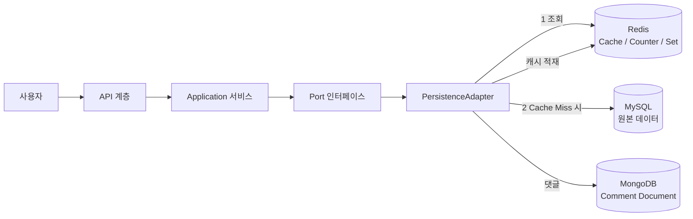
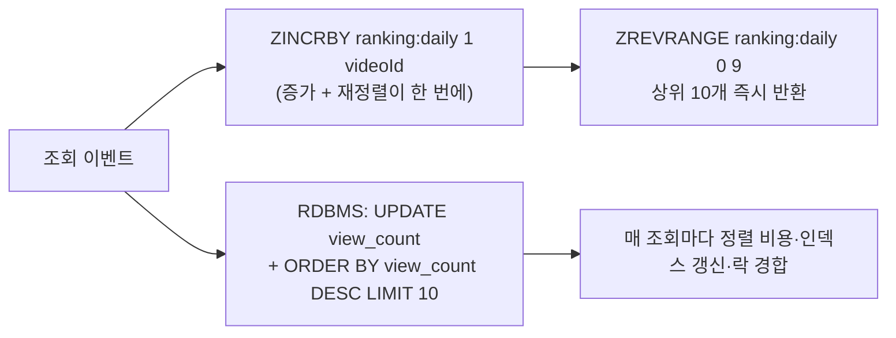
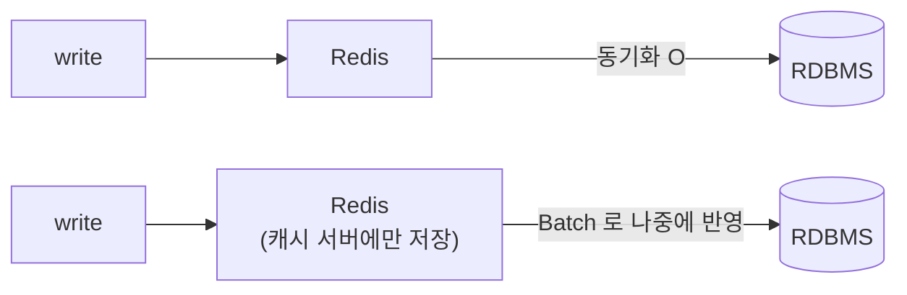

Redis를 붙였는데 응답이 빨라지지 않는 일은 생각보다 흔하다. 원인은 대개 Redis가 아니라 **캐싱 대상을 잘못 골랐거나, 자료구조와 전략이 요구사항과 어긋난 것**이다. 캐시는 붙이는 기술이 아니라 고르는 기술이다.

이 글은 캐시를 붙이기 전에 끝내야 할 세 가지 결정을 다룬다. 어떤 데이터가 캐싱 대상인지 판별하는 기준, 조회수·좋아요·랭킹처럼 성격이 다른 데이터를 각각 어떤 Redis 자료구조에 담을지, 그리고 네 가지 캐시 전략 중 무엇을 고를지다. 읽기 편중 서비스에 캐시 계층을 처음 설계하거나, 이미 붙인 캐시의 히트율이 낮아 원인을 찾는 백엔드 엔지니어를 위한 글이다.

## 이 시리즈의 구성

숏폼 영상 서비스에 Redis를 얹어 조회 성능을 개선하는 과정을 네 편으로 나눠 정리한다. 각 편은 단독으로 읽을 수 있고, 이 글이 시리즈의 시작점이다.

| 편 | 다루는 것 |
|---|---|
| **1. 캐시 설계** (이 글) | 캐싱 후보 판별 기준, Redis와 RDBMS의 역할 분담, 자료구조 5종, 캐시 전략 4종 |
| [2. 무효화와 동시성](/blog/backend-engineering/cache-invalidation-and-concurrency/) | 무효화 방식 4종과 TTL 설계, 캐시 3대 장애, Spring 구현 3계층과 함정, 원자 카운터와 분산 락 |
| [3. 담을 것과 담지 않을 것](/blog/backend-engineering/redis-storage-and-operations/) | 집합 연산으로 푸는 좋아요·구독, 운영 명령의 함정과 Pub/Sub, 저장소 분리, Redis 운영 지식 |
| [4. Q&A](/blog/backend-engineering/redis-cache-qna/) | 선택지 정리, 실패 모드 8가지, 25문답 |

## 용어 정리

| 약어 | 원어 | 뜻 |
|---|---|---|
| Redis | REmote DIctionary Server | 인메모리 key-value 저장소. 자료구조 서버로도 불린다 |
| RDBMS | Relational Database Management System | 관계형 DB. 디스크 기반이며 SQL·스키마·무결성을 제공한다 |
| TTL | Time To Live | 키의 만료 시간. 지나면 자동 삭제된다 |
| Look-Aside | Cache-Aside | 앱이 캐시를 먼저 보고, 없으면 DB 조회 후 캐시에 채우는 전략 |
| Read-Through | — | 캐시 계층이 DB 조회까지 책임지는 전략. 앱은 캐시만 호출한다 |
| Write-Through | — | 쓰기 시 캐시와 DB를 함께 갱신하는 전략 |
| Write-Back | Write-Behind | 캐시에만 쓰고 배치로 DB에 반영하는 전략 |
| stale | — | 원본이 바뀌었는데 캐시에 옛 값이 남아 있는 상태 |
| UV | Unique Visitor | 중복을 제거한 방문자 수 |
| PersistenceAdapter | 헥사고날 아키텍처 용어 | 도메인 Port를 구현해 실제 저장소에 붙는 어댑터 |
| `@RedisHash` | Spring Data Redis 애너테이션 | 객체를 Redis Hash로 저장한다. `@Indexed`로 보조 인덱스를 만든다 |

## 전체 구조 — 저장소 선택은 어댑터 안에 갇힌다

대상은 **동영상 컨텐츠 서비스**라는 읽기 편중 도메인이다. 아키텍처는 헥사고날(Port/Adapter)이고, 도메인은 Redis·RDBMS·MongoDB 중 무엇을 쓰는지 모른 채 `Port`만 바라본다. 저장소 선택은 전부 `PersistenceAdapter` 안에서 끝난다.

이 구조가 중요한 이유는 캐시가 **교체 가능한 결정**으로 남기 때문이다. 도메인 코드가 `RedisTemplate`을 직접 알면 캐시 전략을 바꿀 때 도메인이 함께 흔들린다.

이 시리즈가 푸는 문제와 해법을 네 줄로 압축하면 이렇다.

| 문제 | 해법 | 어디서 다루나 |
|---|---|---|
| 채널·비디오 조회가 매번 RDBMS를 때린다 | Look-Aside 캐시(`@RedisHash` / `@Cacheable`)로 읽기 경로를 단축한다 | 이 글 |
| 조회수 증가마다 Video 행 전체를 UPDATE하면 부하가 크다 | 조회 API와 조회수 API를 분리하고 `video:view-count` 카운터 키만 원자 증가시킨다 | 2편 |
| 좋아요·구독의 중복 제어를 RDBMS 제약으로 풀면 복잡하다 | Redis Set의 멱등성(`SADD`)으로 중복 자체가 성립하지 않게 만든다 | 3편 |
| 운영 중 캐시를 비우려고 `KEYS *`를 쓰면 서버가 멈춘다 | 정의된 CacheName 기반 삭제, 직접 접근이 필요하면 `SCAN` | 3편 |

## 캐시가 필요한 지점을 어떻게 고르는가

### 판별 기준 두 개면 대부분 걸러진다

캐싱 후보를 고르는 기준은 두 개다. 이 두 개를 통과하지 못하는 데이터는 캐싱해도 이득이 없다.

| 기준 | 설명 | 위반하면 |
|---|---|---|
| 원본 접근 비용이 캐시 접근 비용보다 훨씬 크다 | 디스크 I/O·조인·집계·외부 API 호출이 여기 해당한다 | 캐시 왕복 비용이 이득보다 커서 오히려 느려진다 |
| 반복적으로 동일한 결과를 돌려준다 | 같은 입력에 같은 출력이 나오고 사용자별로 갈리지 않는다 | 히트율이 0에 수렴하고 메모리만 낭비된다 |

여기에 실무에서 두 가지를 더 본다.

- **읽기 대 쓰기 비율.** 읽기가 압도적으로 많아야 캐시가 산다. 쓰기가 잦으면 무효화 비용이 이득을 잡아먹는다.
- **stale 허용 범위.** "몇 초 낡아도 괜찮은가"에 답할 수 없으면 캐싱하면 안 된다. 잔액·재고·권한은 기본적으로 캐싱 대상이 아니다.

두 번째 항목이 실무에서 더 자주 걸린다. 앞의 두 기준은 성능 문제로 드러나지만, stale 허용 범위를 정하지 않고 캐싱한 데이터는 **정합성 사고로 드러나고 원인 추적이 훨씬 어렵다.**

### 왜 이 도메인이 캐시에 유리한가 — 컨텐츠와 커뮤니티의 차이

같은 Redis를 붙여도 도메인에 따라 투자 대비 효과가 다르다. 컨텐츠 서비스와 커뮤니티 서비스를 네 축으로 비교하면 차이가 분명해진다.

| 주제 | 컨텐츠 서비스(유튜브형) | 커뮤니티 서비스(게시판형) |
|---|---|---|
| 컨텐츠 생성 | 적다 | 많다 |
| 컨텐츠 조회 | 생성 대비 매우 많다 | 생성 대비 적다 |
| 목록 기준 | 연관성·랜덤(추천) | 시간순 |
| 시간 지난 컨텐츠 조회 | 장기간 지속된다 | 조회가 집중되는 시기가 짧다 |

읽어야 할 결론은 하나다. **컨텐츠 서비스는 "적게 쓰고 오래 많이 읽는" 구조라 캐시 히트율이 구조적으로 높다.** 반대로 커뮤니티 서비스는 새 글이 계속 쏟아져 캐시가 금방 무효화되고, 오래된 글은 조회가 끊겨 캐싱 이득이 작다.

### Redis와 RDBMS — 무엇을 어디에 두는가

| 주제 | Redis | RDBMS |
|---|---|---|
| 데이터 저장소 | Memory | Disk |
| 저장 방식 | key-value(+ 다양한 자료구조) | SQL / 관계 모델 |
| 장점 | 빠른 조회 속도, 다양한 데이터 구조 | 무결성, 복잡한 관계 처리 |
| 단점 | 비싼 메모리 가격, 휘발성 | 고정 스키마, 확장의 어려움 |

역할 분담의 원칙은 한 문장으로 정리된다. **원본(source of truth)은 RDBMS에 두고, Redis는 언제든 날아가도 되는 파생 데이터만 담는다.**

이 원칙을 깨는 순간 — 예를 들어 좋아요를 Redis에만 저장하면 — Redis는 캐시가 아니라 주 저장소가 된다. 그러면 영속화·백업·페일오버 요구사항이 전부 따라붙는다. 캐시로 쓸 때는 필요 없던 운영 부담이 통째로 생기는 것이다.

## Redis 자료구조별 용도

### 자료구조 선택표

Redis를 "빠른 key-value 저장소"로만 쓰면 절반만 쓰는 것이다. 자료구조 자체가 요구사항을 표현하는 수단이다.

| 자료구조 | Spring Operations | 대표 명령 | 이 프로젝트의 용도 | 왜 이걸 쓰나 |
|---|---|---|---|---|
| String | `ValueOperations` | `SET` `GET` `INCR` `DECR` | 조회수 카운터, 단순 캐시 | `INCR`이 원자적이라 동시 증가에 안전하다 |
| Hash | `HashOperations` | `HSET` `HGET` `HGETALL` `HDEL` | Channel·User 객체(`@RedisHash`) | 필드 단위 부분 갱신이 되고 객체당 키 폭발을 막는다 |
| Set | `SetOperations` | `SADD` `SREM` `SISMEMBER` `SCARD` | 비디오 좋아요, 구독 목록 | 중복 불가 + 순서 무의미가 좋아요 의미와 정확히 일치한다 |
| Sorted Set | `ZSetOperations` | `ZADD` `ZINCRBY` `ZRANGE` `ZRANK` | 인기 영상 랭킹, 시간순 피드 | score로 정렬 상태를 항상 유지한다 |
| List | `ListOperations` | `RPUSH` `RPOP` `LRANGE` `LINDEX` | 최근 목록, 간단한 큐 | 삽입 순서를 보존하고 양끝 연산이 O(1)이다 |

이 표의 마지막 열이 선택의 실제 근거다. **자료구조를 고르는 일은 요구사항의 성질을 자료구조의 성질에 맞추는 일이지, 성능 순위표에서 위쪽을 고르는 일이 아니다.**

### 왜 조회수·랭킹에 Sorted Set인가

랭킹을 RDBMS로 구현하면 매 요청마다 정렬이 돈다. Sorted Set은 그 정렬을 쓰기 시점으로 옮긴다.

근거는 세 가지다.

- **정렬을 미리 유지한다.** Sorted Set은 score 순서를 항상 보장하므로 상위 N 조회가 `O(log N + M)`이다. RDBMS는 `ORDER BY ... LIMIT`을 매 요청마다 계산한다.
- **증가와 재정렬이 하나의 원자 연산이다.** `ZINCRBY`는 값 증가와 순위 반영을 동시에 처리한다. RDBMS에서 같은 것을 하려면 UPDATE 후 인덱스 갱신이 뒤따르고, 인기 행에 락이 몰린다.
- **기간별 랭킹을 키로 쪼갤 수 있다.** `ranking:2026-07-26`처럼 날짜를 키에 넣으면 일간 랭킹이 자연스럽게 분리되고 TTL로 자동 소멸시킬 수 있다.

### Set과 Sorted Set을 가르는 질문 하나

> 선택 기준은 "순서·점수가 의미를 갖는가" 하나다.
>
> 좋아요는 누가 먼저 눌렀는지 아무도 궁금해하지 않으므로 Set이 맞다.
>
> 랭킹은 점수 자체가 데이터이므로 Sorted Set이 맞다. 여기서 Set을 고르면 정렬을 애플리케이션이 떠안게 된다.

`SCARD`로 좋아요 수를 O(1)에 얻는 것과 `ZREVRANGE`로 상위 10개를 얻는 것은 겉보기에 비슷하지만, **전자는 집합의 크기이고 후자는 정렬의 결과**라 저장 구조가 다르다. Set에 좋아요를 담고 나중에 "좋아요 많은 순 정렬"이 요구사항으로 들어오면 자료구조를 바꿔야 한다.

## 캐시 전략 네 가지

대상과 자료구조가 정해지면 남는 질문은 "읽기와 쓰기가 캐시와 DB를 각각 언제 건드리는가"다. 이 조합이 네 가지 전략을 만든다.

### 전략 비교

| 전략 | 읽기 경로 | 쓰기 경로 | 장점 | 단점 | 언제 쓰나 |
|---|---|---|---|---|---|
| **Look-Aside (Cache-Aside)** | 앱이 캐시 조회 → miss면 DB → 캐시 적재 | DB에 쓰고 캐시를 무효화 | 캐시 장애가 서비스 중단으로 직결되지 않는다. 가장 보편적이다 | 첫 요청은 항상 miss, 스탬피드에 노출, 무효화 코드가 앱에 흩어진다 | 읽기 편중 일반 서비스(이 프로젝트의 기본값) |
| **Read-Through** | 앱은 캐시만 호출하고 캐시 계층이 DB 조회·적재를 담당 | 별도 | 앱 코드에서 캐시 분기가 사라진다 | 캐시 계층 장애가 읽기 전면 실패로 이어진다. 라이브러리에 의존한다 | `@Cacheable`처럼 프레임워크가 대신해 줄 때 |
| **Write-Through** | 캐시 우선 | 캐시와 DB를 **동시에** 갱신 | 캐시와 DB가 항상 동기 상태라 stale이 없다 | 쓰기 지연이 두 배가 된다. 읽히지 않을 데이터도 캐시에 적재된다 | 쓴 직후 바로 읽히는 데이터 |
| **Write-Back (Write-Behind)** | 캐시 우선 | 캐시에만 쓰고 **배치로** DB에 반영 | 쓰기 폭주를 흡수하고 DB 부하가 급감한다 | 배치 반영 전에 캐시가 죽으면 **데이터가 유실된다** | 조회수·로그처럼 소량 유실을 감내할 수 있는 데이터 |

### 쓰기 전략의 유일한 차이는 동기화 시점이다

위가 Write-Through(쓰기 즉시 DB 동기화), 아래가 Write-Back(배치 반영)이다. 두 그림의 유일한 차이인 **동기화 시점**이 곧 유실 위험과 성능의 교환 조건이다. 전략을 고르는 일은 "이 데이터가 몇 초어치 유실을 감당할 수 있는가"에 답하는 일과 같다.

### 이 프로젝트의 실제 적용

하나의 서비스가 하나의 전략만 쓰는 것이 아니다. **데이터마다 요구 정합성이 다르므로 전략도 데이터별로 갈린다.**

| 대상 | 읽기 | 쓰기 | 전략 |
|---|---|---|---|
| Channel | RedisRepository 조회 → miss면 JPA 조회 후 `@RedisHash` 저장 | JPA 저장 후 **RedisHash 삭제** | Look-Aside + 무효화 |
| Video 단건·목록 | `@Cacheable(cacheNames="video", key="#videoId")` | `@CacheEvict` | Read-Through 형태(Spring Cache에 위임) |
| Video 조회수 | Redis 카운터를 조회해 Video에 결합 | Redis `INCR`만, DB는 배치 | Write-Back |

> 채널 쓰기에서 **캐시를 갱신하지 않고 삭제**하는 점이 중요하다.
>
> 갱신(update) 방식은 동시에 두 요청이 쓰기를 하면 캐시에 옛 값이 덮이는 경쟁 조건이 생긴다.
>
> 삭제(invalidate) 방식은 다음 읽기가 DB 원본을 다시 채우므로 그런 역전이 없다. 캐시 무효화의 기본은 "고쳐 쓰지 말고 지운다"이다.

## 정리

캐시를 붙이기 전에 끝내야 할 결정은 세 가지다.

| 결정 | 판단 근거 |
|---|---|
| 이 데이터를 캐싱할 것인가 | 원본 접근 비용 · 결과의 반복성 · 읽기 대 쓰기 비율 · stale 허용 범위 |
| 어떤 자료구조에 담을 것인가 | 중복을 막아야 하나(Set) · 순서에 의미가 있나(Sorted Set) · 원자 증가가 필요한가(String) · 부분 갱신이 필요한가(Hash) |
| 어떤 전략으로 읽고 쓸 것인가 | 캐시가 죽어도 서비스가 살아야 하나(Look-Aside) · stale을 허용할 수 없나(Write-Through) · 유실을 감내할 수 있나(Write-Back) |

세 결정이 끝나면 다음 질문은 "낡은 값을 언제 어떻게 지우는가"다. 무효화를 놓치면 캐시는 성능 개선이 아니라 정합성 사고의 원인이 된다. 무효화 방식 네 가지와 TTL 설계, 캐시가 무너지는 세 가지 방식, 그리고 동시 접근을 다루는 원자 카운터와 분산 락은 [캐시 무효화와 동시성](/blog/backend-engineering/cache-invalidation-and-concurrency/)에서 다룬다.
