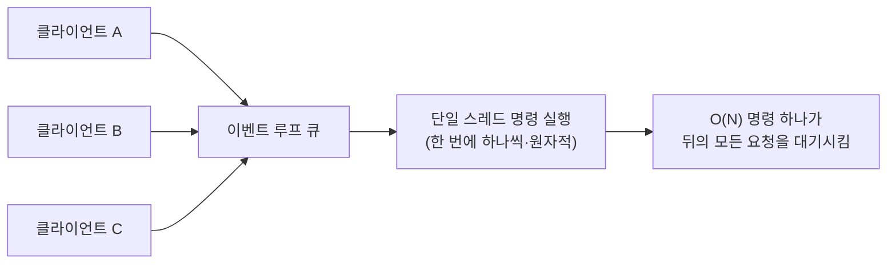
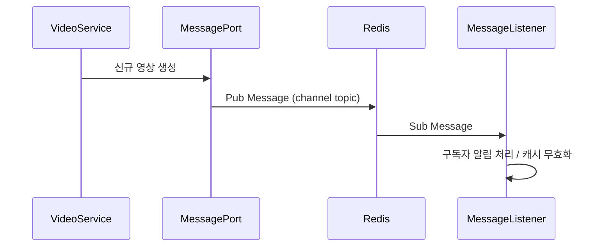

캐시 전략과 무효화가 정해지면 다음은 실제 도메인 데이터다. 좋아요와 구독은 Redis의 집합 연산과 요구사항이 정확히 맞아떨어지는 반면, 댓글은 같은 서비스 안에 있으면서도 Redis에 두지 않는다. **무엇을 담을지 못지않게 무엇을 담지 않을지가 설계다.**

이 글은 그 경계를 다룬다. 좋아요·구독을 Set으로 푸는 근거와 멱등 API 설계, 댓글을 다른 저장소에 두는 판단, 그리고 담은 것을 운영하는 데 필요한 Redis 자체의 성질 — 단일 스레드 모델, 영속화, 메모리 축출, 고가용성 구성이다. 캐시 대상 선정과 자료구조 선택은 [Redis 캐시 설계](/blog/backend-engineering/redis-cache-design/), 무효화와 동시성 제어는 [캐시 무효화와 동시성](/blog/backend-engineering/cache-invalidation-and-concurrency/)에서 다룬다.

## 사용자 액션 — 좋아요와 구독

### 좋아요를 Set으로 푸는 이유

요구사항을 하나씩 자료구조의 성질에 대응시켜 보면 선택이 자명해진다.

| 요구사항 | Redis Set의 성질 |
|---|---|
| 한 사용자가 중복으로 좋아요할 수 없다 | Set은 중복 원소를 애초에 담지 않는다(`SADD`가 멱등) |
| 좋아요의 순서는 의미가 없다 | Set은 순서를 보장하지 않는다 — 요구사항과 일치한다 |
| 눌렀는지 여부를 빠르게 확인해야 한다 | `SISMEMBER`가 O(1)이다 |
| 좋아요 수가 필요하다 | `SCARD`가 O(1)이다 |

RDBMS로 같은 것을 하려면 `UNIQUE(video_id, user_id)` 제약이 필수이고, 제약이 없으면 중복 확인 로직이 복잡해진다. 제약이 있어도 위반 예외 처리와 카운트 집계(`COUNT(*)`) 비용이 따라온다.

핵심은 **중복 방지를 검증 로직으로 구현하지 않고 자료구조의 성질에 맡긴다**는 점이다. `SADD`를 두 번 호출해도 결과가 같으므로 "이미 눌렀는지 먼저 확인한다"는 단계 자체가 사라진다.

### 좋아요 API를 토글로 만들면 안 되는 이유

| 설계 | 동작 | 장점 | 단점 |
|---|---|---|---|
| 단일 엔드포인트 토글 | 호출할 때마다 like ↔ none으로 전환된다 | API가 하나로 끝난다 | **호출마다 결과가 바뀐다** — 재시도·중복 클릭에 취약하다(비멱등) |
| like / unlike 분리 | 각각 별도 엔드포인트를 둔다 | 몇 번을 호출해도 결과가 같다(**멱등**) | API가 두 개다 |
| 카운트 반환 여부 | 응답에 likeCount를 포함할지 별도 API로 뺄지 | 포함하면 왕복이 한 번이다 | 포함하면 매번 집계 비용과 캐시 정합 이슈가 생긴다 |

> 모바일 환경에서는 네트워크 재시도가 일상이라 **토글 API는 사고를 부른다.**
>
> 사용자가 한 번 눌렀는데 요청이 두 번 도달하면 좋아요가 취소된 상태로 끝난다.
>
> 그래서 like / unlike를 분리해 멱등으로 만드는 쪽이 정답에 가깝다. REST의 PUT/DELETE 의미론과도 맞는다.

`SADD`가 멱등이라는 성질은 API 계층까지 올려야 값어치가 산다. 저장소는 멱등인데 API가 토글이면 **멱등성이 엔드포인트에서 끊긴다.**

### 구독 — 다대다를 key-value로 푸는 법

Channel과 User는 다대다 관계다. Redis는 다대다에 효율적인 구조가 아니므로 **양방향 키를 각각 유지**한다.

```
subscribe-channel:{channelId}  ->  Set[userId, ...]    # 이 채널의 구독자
subscribe-user:{userId}        ->  Set[channelId, ...] # 이 사용자의 구독 채널
```

| 항목 | 내용 |
|---|---|
| 왜 두 개인가 | "채널의 구독자 수"와 "내 구독 목록"은 조회 방향이 반대다. 한쪽만 두면 반대 조회가 전체 스캔이 된다 |
| 대가 | 두 키의 **정합성을 애플리케이션이 책임진다.** 한쪽만 성공하면 불일치가 남는다 |
| 완화 | 두 연산을 `MULTI/EXEC` 또는 Lua로 묶는다. 그래도 RDBMS 원본과의 동기화는 배치로 검증한다 |

이것은 NoSQL 일반의 원칙이기도 하다. **정규화 대신 조회 패턴별로 데이터를 중복 저장하고, 정합성 비용을 애플리케이션이 떠안는다.** 조인이 없는 저장소에서 조회 방향이 둘이면 데이터도 둘이 된다.

## Redis에 담지 않는 것 — 댓글

### 왜 댓글만 다른 저장소인가

| 특성 | 댓글 데이터 | MongoDB 적합성 |
|---|---|---|
| 구조 | 댓글·대댓글이 중첩되고 필드가 유동적이다 | 스키마 유연성 |
| 볼륨 | 컨텐츠 대비 폭발적으로 증가한다 | 수평 확장이 용이하다 |
| 조회 패턴 | videoId·parentId·시간순으로만 조회한다 | `@Indexed` 몇 개로 커버된다 |
| 트랜잭션 | 강한 정합성 요구가 낮다 | 감내 가능하다 |

```java
@Document("comment")
public class CommentDocument {
    @Id private String id;
    private String channelId;
    @Indexed private String videoId;
    @Indexed private String parentId;
    private String authorId;
    private String text;
    @Indexed private LocalDateTime publishedAt;
}
```

댓글이 Redis에 맞지 않는 이유는 **원본이기 때문**이다. 좋아요·구독은 RDBMS에 원본이 있는 파생 데이터지만 댓글 본문은 잃으면 복구할 수 없다. 캐시로 쓰는 저장소에 원본을 두면 영속화·백업 요구가 통째로 따라붙는다.

작성자 정보(`authorName`, `authorProfileImageUrl`)는 문서에 저장하지 않고 **Redis의 `UserRedisHash`에서 조회해 결합**한다. 프로필이 바뀌었을 때 모든 댓글 문서를 갱신하지 않아도 되기 때문이다. 여기서도 "**변경 주기가 다른 데이터는 분리한다**"는 원칙이 반복된다.

### 페이지 기반과 커서 기반

| 항목 | 페이지 기반(page + size) | 커서 기반(cursor offset + maxSize) |
|---|---|---|
| 요청 | 페이지 번호 | 마지막으로 본 지점(offset) |
| 응답 | Page slice 정보 + Content | offset 이후 최대 maxSize 개 |
| 프레임워크 | Spring Data `Pageable` 제공 | 직접 구현 |
| 성능 | 뒤쪽 페이지일수록 **offset 스킵 비용이 증가**하고 매번 total count를 계산한다 | offset부터 바로 읽어 성능이 일정하다 |
| 정합성 | 조회 중 신규 컨텐츠가 생기면 **slice 간 중복 노출**이 생긴다 | 기준점이 고정돼 중복이 없다 |
| 한계 | — | 임의 페이지로 **직접 점프가 불가능하다** |

> 무한 스크롤에는 커서, 관리자 화면에는 페이지가 맞다.
>
> 관리자는 "37페이지로 이동"이 필요하고 데이터 규모도 작지만, 사용자 피드는 점프가 필요 없고 규모가 크기 때문이다.
>
> 댓글처럼 계속 새 글이 붙는 목록에서 페이지 기반을 쓰면, 2페이지를 열었을 때 1페이지에서 이미 본 댓글이 다시 나오는 사고가 난다.

### 대댓글과 고아 데이터

대댓글은 `parentId`로 부모를 참조하며 독립적으로 존재할 수 없다. 부모를 삭제하면 고아 데이터(dangling comment)가 생긴다.

| 방안 | 동작 | 장점 | 단점 |
|---|---|---|---|
| 1. 포함된 대댓글 모두 삭제 | 부모와 자식을 일괄 삭제한다 | 데이터가 깔끔하다 | 남의 댓글이 통보 없이 사라진다 |
| 2. 대댓글이 다 지워질 때까지 부모 삭제 불가 | 삭제를 막는다 | 정합성이 확실하다 | 작성자가 자기 글을 못 지운다 |
| 3. **'삭제됨' 마크 처리 후 구조 유지** | soft delete로 본문만 가린다 | 스레드 맥락이 보존된다. 실무 표준이다 | 데이터가 계속 남아 별도 정리 배치가 필요하다 |

실제 서비스는 대부분 3번을 택한다. "삭제된 댓글입니다"라는 화면이 그 결과물이다.

## Redis 자체를 운영한다

### 단일 스레드 모델 — 모든 운영 제약의 출발점



| 결과 | 설명 |
|---|---|
| 모든 명령이 원자적이다 | 락 없이 `INCR` `SADD`가 안전한 이유다 |
| 컨텍스트 스위칭·락 경합이 없다 | 단순 연산에서 매우 빠르다 |
| **한 명령이 느리면 전체가 느리다** | `KEYS` `FLUSHALL` 대형 컬렉션 조회가 전면 장애로 번진다 |
| Redis 6+ I/O threads | 멀티 스레드화된 것은 **네트워크 I/O뿐**이고 명령 실행은 여전히 단일 스레드다 |

이 표의 첫 행과 셋째 행은 같은 성질의 양면이다. **원자성을 공짜로 얻는 대가가 블로킹**이다. 앞 편에서 `INCR`이 동시성에 안전한 근거로 든 것이 여기이고, 아래 `KEYS`가 사고인 근거도 여기다.

### `KEYS *`가 왜 사고인가

| 명령 | 복잡도 | 결과 |
|---|---|---|
| `KEYS pattern` | O(N) — 전체 키 스캔 | 스캔이 끝날 때까지 **다른 모든 명령을 블록한다** → 서비스 전면 지연·장애 |
| `SCAN cursor COUNT n` | 커서 기반 분할 조회 | 매 호출이 짧아 블로킹이 없다. 중복·누락 가능성은 있으나 운영상 허용된다 |

실무 결론은 두 단계다.

- **애플리케이션에서는 미리 정의된 CacheName을 이용한다.** 임의 패턴 검색 자체를 하지 않는 설계로 만든다.
- **Redis에 직접 접근해야 할 때만 `SCAN`** 을 쓴다.

같은 이유로 `FLUSHALL`, 대용량 키의 `SMEMBERS` / `HGETALL` / `ZRANGE 0 -1`, 대형 컬렉션 `DEL`도 위험하다. 삭제는 `UNLINK`로 비동기 처리할 수 있다. 운영 계정에서는 `rename-command`로 위험 명령을 아예 막아 두는 편이 안전하다.

### 영속화 — RDB와 AOF

| 항목 | RDB(스냅샷) | AOF(명령 로그) |
|---|---|---|
| 방식 | 특정 시점 메모리 전체를 파일로 덤프한다 | 쓰기 명령을 순차 기록한다 |
| 유실 범위 | **마지막 스냅샷 이후 전부** | `appendfsync everysec` 기준 최대 약 1초 |
| 복구 속도 | 빠르다(바이너리 로드) | 느리다(명령 재생) |
| 파일 크기 | 작다 | 크다 → 주기적 rewrite가 필요하다 |
| 부하 | `fork` + Copy-On-Write. 쓰기가 많으면 **메모리 사용량이 최대 2배**까지 튈 수 있다 | 상시 디스크 쓰기 |
| 권장 | 백업·복제 초기화용 | 유실 최소화용 |

- 실무 기본값은 **둘 다 켜고** AOF에 RDB 프리앰블을 쓰는 혼합 모드(`aof-use-rdb-preamble yes`)다.
- 순수 **캐시 용도라면 영속화를 끄는 것도 정당한 선택**이다. 원본이 RDBMS에 있으므로 Redis는 다시 채우면 되고 fork 부하를 피할 수 있다. 단 재기동 직후 전량 miss를 감당할 수 있어야 한다 — 그것이 곧 Avalanche다.

### 메모리 관리와 축출 정책

| 정책 | 동작 | 적합 |
|---|---|---|
| `noeviction` | 메모리 초과 시 쓰기 에러를 반환한다 | 주 저장소로 쓸 때 |
| `allkeys-lru` | 전체 키 중 오래 안 쓴 것부터 축출한다 | **일반 캐시의 기본값** |
| `allkeys-lfu` | 접근 빈도가 낮은 것부터 축출한다 | 인기 편차가 큰 컨텐츠 캐시 |
| `volatile-ttl` | TTL 있는 키 중 만료가 임박한 순으로 축출한다 | 캐시와 영속 데이터가 섞여 있을 때 |

캐시로 쓰는 Redis에 `noeviction`이 걸려 있으면 메모리가 차는 순간 **쓰기가 전부 실패한다.** 캐시 인스턴스와 영속 인스턴스를 분리하고 정책을 다르게 주는 것이 안전하다.

### 고가용성 — Sentinel과 Cluster

| 구성 | 목적 | 얻는 것 | 제약 |
|---|---|---|---|
| Replication(복제) | 읽기 분산·백업 | 읽기 확장 | 비동기 복제라 페일오버 시 일부 쓰기가 유실될 수 있다 |
| **Sentinel** | 자동 페일오버(HA) | 마스터 장애 시 승격이 자동화된다 | 샤딩이 없다 — 데이터는 여전히 한 마스터 용량 안이다 |
| **Cluster** | 샤딩 + HA | 16384 슬롯 분산, 수평 확장 | **멀티키 연산이 같은 슬롯일 때만** 가능하다. `{videoId}` 해시 태그로 슬롯 고정이 필요하다 |

Cluster에서 `MGET`, `MULTI`, Lua 멀티키가 깨지는 문제는 실제로 자주 밟는다. 앞서 구독을 양방향 키로 나눈 설계가 여기서 대가를 치른다 — 두 키를 `MULTI`로 묶으려면 같은 슬롯에 있어야 한다. **키 설계 단계에서 "함께 연산될 키는 해시 태그로 같은 슬롯에 묶는다"를 미리 정해야 한다.**

## 운영 기능 — Pub/Sub과 차단 목록

### Pub/Sub으로 신규 영상 알림



| 특성 | 내용 |
|---|---|
| 전달 보장 | **없다.** 구독자가 그 순간 연결돼 있지 않으면 메시지는 사라진다(fire-and-forget) |
| 영속성 | 없다. 재시도·재생이 불가능하다 |
| 적합한 용도 | 다중 인스턴스의 **로컬 캐시 무효화 전파**, 실시간 알림처럼 유실을 감내할 수 있는 신호 |
| 부적합한 용도 | 주문·결제 같은 유실 불가 이벤트 → Kafka 또는 Redis Streams(소비자 그룹·ACK 지원) |

"Redis Pub/Sub을 이벤트 버스로 써도 되는가"에 대한 답은 **유실 허용 여부**로 갈린다. 캐시 무효화 신호는 놓쳐도 TTL이 받아 주므로 적합하고, 결제 이벤트는 한 건도 놓칠 수 없으므로 부적합하다.

### 차단 컨텐츠 관리 — 요구사항이 곧 키 설계다

| 요구 | 설계 판단 |
|---|---|
| 사용자가 서비스를 이용하는 동안만 유지되면 된다 | 영속 저장이 불필요하다 → TTL 있는 Redis 키가 적합하다 |
| 차단된 컨텐츠의 **전체 정보가 아닌 key만** 관리한다 | 캐시에는 판정에 필요한 최소 데이터만 담아 메모리를 절약한다 |
| 차단 목록은 시간이 지날수록 증가한다 | 무한 증가를 막기 위해 TTL·범위 제한이 필수다 |
| 차단 범위를 좁히는 key 조건을 관리한다 | 전역 목록 대신 `block:{userId}:{videoId}`처럼 조회 경로에 맞춰 키를 좁힌다 |

네 행이 전부 같은 방향을 가리킨다. **조회 경로를 먼저 정하고 그 경로에 맞춰 키를 만든다.** 키를 먼저 만들고 조회 방법을 나중에 찾으면 `KEYS` 패턴 검색으로 되돌아가게 된다.

## 정리

| 데이터 | 어디에 | 판단 근거 |
|---|---|---|
| 좋아요·구독 | Redis Set | 중복 불가·순서 무의미가 Set의 성질과 일치한다. 원본은 RDBMS에 있다 |
| 조회수 | Redis String 카운터 | 원자 증가가 필요하고 소량 유실을 감내할 수 있다 |
| 댓글 본문 | MongoDB | 원본이며 잃으면 복구할 수 없다. 구조가 유동적이고 볼륨이 크다 |
| 차단 목록 | Redis + TTL | 세션 동안만 유효하고 판정에 필요한 key만 필요하다 |
| 알림 신호 | Redis Pub/Sub | 유실을 감내할 수 있다. 유실 불가면 Kafka로 간다 |

운영 측면에서는 단일 스레드 모델 하나가 대부분의 제약을 설명한다. 원자성을 공짜로 얻는 대신 느린 명령 하나가 전체를 세우고, 그래서 `KEYS`가 금지되며, 그래서 대형 컬렉션 연산을 피한다. 여기까지의 선택지를 한 표로 모으고 실패 모드 여덟 가지와 함께 정리한 내용은 [Redis 캐시 Q&A](/blog/backend-engineering/redis-cache-qna/)에서 다룬다.
