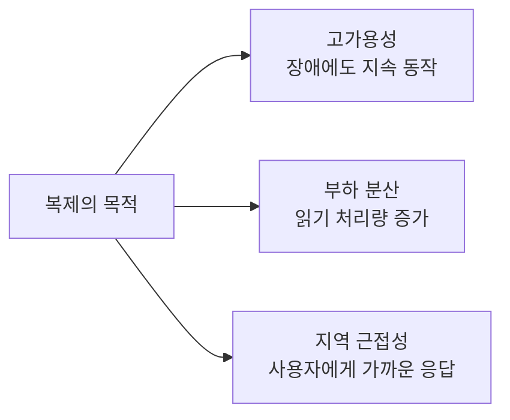
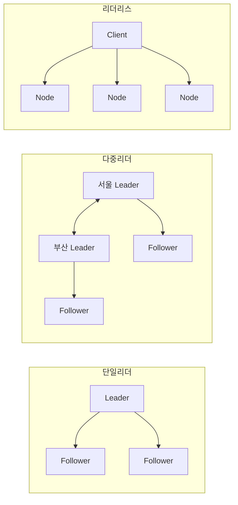
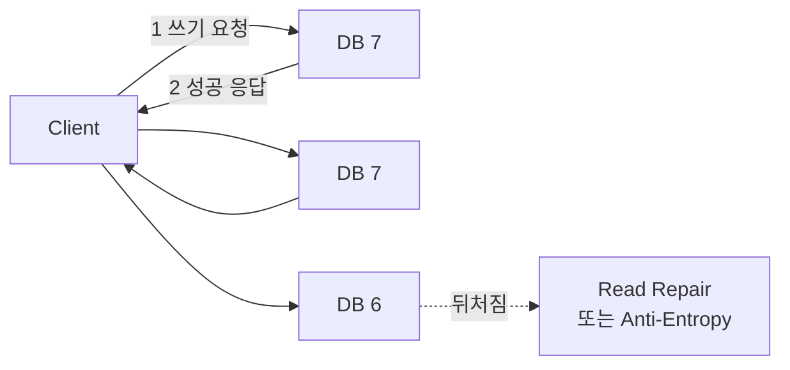
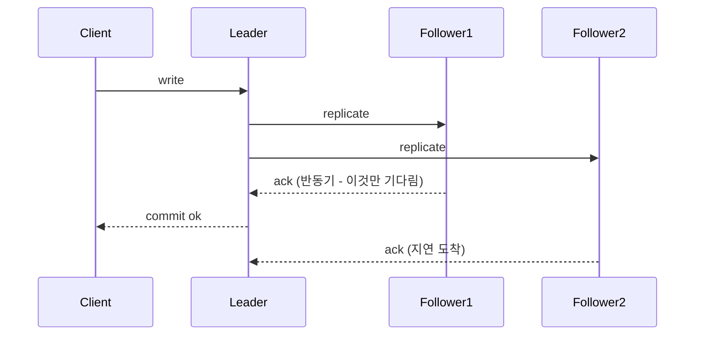
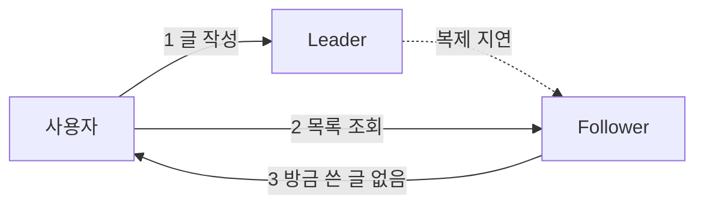

데이터베이스를 확장하는 축은 나누는 것과 복사하는 것 둘뿐이고, 앞 두 편은 나누는 쪽을 다뤘다([파티셔닝의 출발점](/blog/backend-engineering/partitioning-fundamentals/)에 그 지도와 이 시리즈가 쓰는 용어 정의가 있다). 이번 편은 복사하는 쪽이다.

복제는 이유가 명확한 만큼 대가도 명확하다. 같은 데이터를 여러 벌 두는 순간 **그 벌들의 값이 서로 다를 수 있다**는 사실이 새로 생기고, 이후의 설계 선택은 거의 전부 이 하나에서 파생된다. 어느 노드가 쓰기를 받을 것인가, 응답을 돌려주기 전에 몇 대까지 기다릴 것인가, 뒤처진 복제본을 읽은 사용자에게 무엇을 보장할 것인가, 리더가 죽었을 때 아직 전달되지 않은 쓰기를 어떻게 할 것인가. 이 글은 그 네 갈래를 순서대로 따라간다.

## 복제는 무엇을 사는가

목적은 셋이고, 셋 다 "한 벌뿐이라서 생기는 문제"의 해결이다. 한 벌뿐이면 그 서버가 죽을 때 서비스도 죽고, 그 서버의 읽기 한계가 서비스의 한계이며, 먼 사용자는 왕복 지연을 그대로 문다.

목적을 달성하는 순간 문제가 하나 생긴다. **복제된 데이터에 변경이 발생하면 어떻게 처리할 것인가 — 일관성 문제다.** 이 질문에 대한 답이 토폴로지 세 가지다.

## 토폴로지 세 가지

| 항목 | 단일 리더 | 다중 리더 | 리더리스 |
|---|---|---|---|
| 쓰기 처리 | 리더 1대만 | 데이터센터별 리더 각각 | 모든 복제 노드가 직접 |
| 읽기 처리 | 리더·팔로워 모두 | 리더·팔로워 모두 | 여러 노드에 동시 질의 |
| 쓰기 충돌 | **없음** (직렬화됨) | 발생 | 발생 |
| 페일오버 필요 | 있음 (리더 선출) | 데이터센터 격리로 대응 | **불필요** |
| 네트워크 민감도 | 높음. 리더 연결이 끊기면 쓰기 중단 | 낮음. 각 DC가 독립 동작 | 낮음 |
| 대표 제품 | MySQL, PostgreSQL, MongoDB Replica Set | MySQL 멀티소스, CouchDB, 지역 분산 구성 | Cassandra, DynamoDB, Riak |
| 언제 쓰나 | 대부분의 OLTP 서비스 | 멀티 데이터센터, 오프라인 편집 동기화 | 초고가용성·쓰기 가용성 최우선 |

세 열을 가르는 축은 **쓰기를 받는 지점이 몇 개인가** 하나다. 한 개면 충돌이 원천적으로 없는 대신 그 지점이 단일 실패점이 되고, 여러 개면 페일오버 부담이 줄거나 사라지는 대신 충돌 해소를 직접 설계해야 한다. 「쓰기 충돌」 행과 「페일오버 필요」 행이 반대로 채워진 것이 그 교환이다.

### 단일 리더 — 네 단계로 도는 구조

| 단계 | 내용 |
|---|---|
| 1 | 데이터 쓰기(변경)는 **오직 리더만** 처리한다 |
| 2 | 리더는 데이터를 변경하고 **복제 로그 또는 변경 스트림**을 팔로워에게 전송한다 |
| 3 | 팔로워는 리더가 처리한 것과 **동일한 순서로** 쓰기를 적용해 DB를 갱신한다 |
| 4 | 데이터 읽기는 리더·팔로워 모두 처리한다 |

네 단계 중 값어치가 3단계에 몰려 있다. 순서가 같으므로 팔로워는 뒤처질 수는 있어도 리더가 지나온 적 없는 상태에 도달하지는 않는다. 뒤에서 다룰 이상 현상들이 전부 "**얼마나** 뒤처졌는가"의 문제이지 "다른 데이터가 되었는가"의 문제가 아닌 이유가 여기다.

같은 역할이 제품마다 다르게 불린다. 리더는 master 또는 primary, 팔로워는 read replica·slave·secondary·standby다.

### 다중 리더 — 데이터센터를 단위로 쪼갠다

| 관점 | 단일 리더 | 다중 리더 |
|---|---|---|
| 성능 | 모든 쓰기가 리더 소재 DC로 몰려 쓰기 지연 발생 | 각 DC 리더가 처리한 뒤 DC 간 비동기 복제 → **사용자 체감 성능이 빠름** |
| DC 장애 | 리더 DC 장애 시 다른 DC의 팔로워를 리더로 선출 | 장애 DC를 격리하고, 정상 복귀 시 복제로 일관성 회복 |
| 네트워크 장애 | 민감. 쓰기가 동작하지 않을 수 있음 | 비동기 복제라 각 DC가 독립 처리 가능 → **덜 민감** |

세 행이 같은 말을 다른 각도에서 한다. 쓰기를 받는 지점을 사용자 가까이 옮기면 **DC 사이의 왕복이 쓰기 경로에서 빠진다**는 것이다. 그 왕복은 비동기 복제 쪽으로 옮겨 가고, 거기서 충돌이 나온다.

리더가 여럿이면 리더끼리 변경을 주고받는 배선을 정해야 한다. 원형(Circular)·스타(Star)·전체(All-to-All) 세 가지가 있다.

| 토폴로지 | 링크 수 | 장애 취약점 |
|---|---|---|
| 원형 | N | 노드 1개 장애로 전파 경로가 끊김 |
| 스타 | N-1 | 중심 노드가 단일 장애점 |
| 전체 | N(N-1)/2 | 링크 폭증. 경로별 지연 차이로 **인과 순서 역전** 발생 가능 |

링크 수 열이 배선 비용이고 취약점 열이 그 비용을 아낀 대가다. 원형과 스타는 링크를 N 안팎으로 억제하는 대신 특정 노드나 구간이 끊기면 전파가 멈추고, 전체 연결은 그 단일 지점을 없애는 대신 링크가 노드 수의 제곱에 비례한다.

### 리더리스 — 쿼럼으로 겹치게 만든다

리더를 두지 않으면 페일오버가 필요 없어지는 대신, 최신값을 어떻게 읽을지를 클라이언트가 풀어야 한다. 답은 **쓰기 집합과 읽기 집합이 반드시 겹치게 만드는 것**이다.

| 기호 | 의미 |
|---|---|
| `n` | 복제 DB 개수 |
| `w` | 쓰기 성공으로 인정할 응답 수 |
| `r` | 읽기 시 질의할 노드 수 |
| **`w + r > n`** | 읽은 노드 집합 안에 **최신값을 가진 노드가 반드시 하나는 들어 있음** |

부등식이 성립하는 이유는 산수다. 전체가 `n`개뿐인데 쓰기가 `w`개에 닿고 읽기가 `r`개에 묻는다면, `w + r`이 `n`을 넘는 순간 두 집합은 겹치지 않을 수 없다. 도식이 그 예다 — 셋 중 둘이 버전 7을 갖고 하나가 6에 머물 때, 두 대에 물으면 최소 한 대는 7을 돌려준다.

| 설정 | 특성 | 언제 |
|---|---|---|
| `w=n, r=1` | 읽기 초고속, 쓰기 가용성 최악 | 읽기가 압도적으로 우세할 때 |
| `w=1, r=n` | 쓰기 초고속, 읽기 비쌈 | 쓰기 가용성 최우선 |
| `w=r=⌈(n+1)/2⌉` | 균형(예: `n=3` → `w=r=2`) | 일반적 기본값 |

세 설정 모두 부등식을 만족한다(각각 `n+1`, `n+1`, `n=3`일 때 `2+2=4`). 조건은 같은데 성격이 정반대인 이유는 **부등식이 겹침만 요구할 뿐 어느 쪽이 비싸질지는 정해 주지 않기 때문**이다.

부등식은 읽는 순간의 정확도를 보장할 뿐 뒤처진 복제본을 고쳐 주지는 않는다. 따라잡게 하는 메커니즘이 둘 있다.

| 메커니즘 | 시점 | 특징 |
|---|---|---|
| **Read Repair** | 읽기 시 | 클라이언트가 불일치를 발견하면 최신값으로 갱신. 자주 읽히는 데이터만 복구됨 |
| **Anti-Entropy** | 백그라운드 | 주기적으로 DB를 비교해 동기화. 잘 안 읽히는 데이터도 복구되지만 지연이 큼 |

둘의 커버리지가 상보적이라 한쪽만 켜면 구멍이 남는다. 읽기 시점 복구는 트래픽이 있는 데이터만 고치고, 백그라운드 비교는 전부 훑는 대신 느리다.

## 얼마나 기다릴 것인가 — 동기·반동기·비동기

토폴로지가 "누가 쓰기를 받는가"의 문제였다면, 다음 선택은 "쓰기 성공을 응답하기 전에 어디까지 확인할 것인가"다.

| 구분 | 동기식 | 반동기식 | 비동기식 |
|---|---|---|---|
| 동작 | **모든** 팔로워 처리 완료까지 대기 | **정해 둔 최소 개수**의 팔로워 완료까지 대기 | 응답을 기다리지 않고 완료 |
| 장점 | 모든 서버가 동일 시점 동일 데이터. 일관성 매우 높음 | 일관성을 높이면서 동기식보다 빠름 | 쓰기 성능이 가장 높음 |
| 단점 | 성능 저하. **한 대의 성능이 전체 성능을 좌우** | 비동기보다 느림. 일부 팔로워와는 여전히 불일치 | 리더-팔로워 간 일관성 문제 발생 |
| 페일오버 시 데이터 손실 | 없음 | 확인된 팔로워 범위 내에서 없음 | **있음** — 리더가 죽으면 미전송 쓰기 소실 |

마지막 행이 이 표의 핵심이다. 앞의 세 행이 적는 것은 회복할 수 있는 대가다 — 느린 쓰기는 장비를 키워 개선하고, 뒤처진 값은 따라잡으면 맞는다. 마지막 행만이 **데이터가 사라지는가**의 이야기이고, 페일오버 순간에 소실된 쓰기는 이미 성공 응답이 나간 뒤라 복구할 방법이 없다.

리더가 `F1`의 ack만 기다려 커밋을 응답하고 `F2`의 ack는 그 뒤에 도착한다. 반동기의 동작이 이 한 지점에 있다.

> 반동기가 실무 표준인 이유는 **"한 대의 느린 팔로워가 전체 쓰기를 인질로 잡는 것"을** 막으면서도, 최소 1대에는 확실히 전달되었음을 보장하기 때문이다.
>
> MySQL의 `rpl_semi_sync_master_timeout` 처럼 **타임아웃이 있어, 팔로워가 응답하지 않으면 자동으로 비동기로 강등된다.**
>
> 이 "자동 강등"은 반드시 짚어야 하는 조건이다. 반동기를 켰다고 데이터 손실이 0이 되는 것이 아니라, **강등된 그 순간의 쓰기는 비동기와 동일한 손실 위험을 갖는다.**

강등은 설정 실수가 아니라 정상 동작이다. 응답하지 않는 팔로워를 계속 기다린다면 그것은 반동기가 아니라 동기식이고, 표의 첫 열에 그대로 걸린다. 그래서 반동기의 보장은 "손실 없음"이 아니라 **"타임아웃이 걸리지 않은 구간에서 손실 없음"** 으로 읽어야 한다.

### 무엇을 복제 로그에 담는가

리더가 팔로워에게 보내는 것이 무엇이냐에 따라 성질이 갈린다. 방식은 넷이다.

| 방식 | 전달 대상 | 장점 | 문제 |
|---|---|---|---|
| **구문(Statement) 기반** | 모든 statement | 로그 크기 작음 | `NOW()`, `RAND()`, auto_increment 등 **비결정적 함수**로 결과가 갈림 |
| **WAL(Write-Ahead Log)** | 쓰기 전 저장된 로그 파일 | 정확. 복구 로직과 동일 | 스토리지 엔진 내부 포맷에 종속 → 버전 간 롤링 업그레이드 어려움 |
| **Row 기반 (CDC)** | 변경된 row 식별 후 복제 | 엔진 독립적. **CDC로 외부 시스템 연동 가능** | 로그 크기 큼(대량 UPDATE 시 폭증) |
| **트리거 기반** | 트리거가 애플리케이션 레벨에서 처리 | 유연. 선택적 복제 가능 | 오버헤드 크고 버그 여지 많음 |

네 방식이 한 축 위에 놓여 있다. 적게 보내면 받는 쪽이 같은 결과를 재현해야 하고(구문 기반의 비결정적 함수 문제), 많이 보내면 그 부담이 사라지는 대신 로그가 커진다.

> Row 기반, 즉 변경된 row를 식별해 전파하는 CDC 방식은 복제 바깥으로 확장된다.
>
> Debezium 같은 도구가 MySQL binlog(row 포맷)를 읽어 Kafka로 흘려보내면, DB 복제 로그가 그대로 **이벤트 스트림**이 된다.
>
> 즉 "복제 로그"와 "이벤트 소싱"은 구현체가 같아지며, 이것이 MSA에서 데이터 동기화를 폴링 없이 처리하는 표준 경로다.

## 복제 지연이 사용자에게 보이는 모습

비동기 복제에서는 반드시 지연이 생긴다. 지연 자체보다 **지연이 사용자에게 어떤 모습으로 보이는가**가 문제다. 밀리초 단위의 지연도 그 창 안에 읽기 요청이 들어오면 화면에는 오작동으로 나타난다.

| 이상 현상 | 사용자가 겪는 것 | 해결 |
|---|---|---|
| **Read-Your-Writes(RYW) 위반** | 방금 쓴 글이 목록에 없다 | 쓰기 직후 일정 시간 또는 타임스탬프 기준으로 **리더에서 읽는다** |
| **Monotonic Read 위반** | 새로고침했더니 데이터가 과거로 돌아감 | **동일한 팔로워에서만 읽도록** 라우팅(사용자ID 해시로 고정) |
| **Consistent Prefix Read 위반** | 답변이 질문보다 먼저 보인다(인과 역전) | 항상 **동일한 순서로 적용된 것처럼** 조회. 인과 관계 있는 쓰기는 같은 파티션으로 |

세 현상은 각각 다른 것을 보장하지 못해서 생긴다. 자기가 쓴 것이 자기에게 읽히는가, 시간이 거꾸로 흐르지 않는가, 인과 순서가 유지되는가다. 해결책이 겹치지 않는 것도 그 때문이다.

도식이 첫 번째 현상의 경로다. 점선이 복제 지연이고, 두 요청이 서로 다른 노드로 갈라지는 곳이 사고 지점이다.

> Consistent Prefix Read 위반은 **샤딩된 구조에서 특히 흔하다.**
>
> 파티션마다 복제 지연이 다르기 때문에, 서로 다른 파티션에 기록된 인과 관계 있는 두 쓰기가 읽는 쪽에서 역전되어 보인다.
>
> 그래서 "질문과 답변", "주문과 주문상태변경"처럼 인과가 있는 데이터는 **같은 파티션 키**로 묶는 것이 설계 원칙이 된다.

인용의 마지막 문장이 앞 편과 이번 편이 만나는 자리다. 파티션 키는 나누는 축의 결정이고 복제 지연은 복사하는 축의 문제인데, 인과 역전은 두 축이 곱해진 자리에서만 나타난다.

낡은 값이 읽히는 현상 자체는 복제만의 것이 아니다. 캐시 계층에서도 원본이 바뀐 뒤 옛 값이 남아 같은 모양의 오작동이 나온다([캐시 무효화와 동시성](/blog/backend-engineering/cache-invalidation-and-concurrency/)이 무효화 방식과 TTL 설계, 동시 갱신을 다루는 분산 락을 정리한다). 다만 결정적인 차이가 있다. 캐시는 낡은 값을 **지워서** 원본으로 되돌릴 수 있지만, 복제본은 지울 원본이 따로 없다 — 밀린 변경을 따라잡는 것 말고는 방법이 없다.

## 장애가 났을 때 무엇이 사라지는가

### 팔로워 장애 — 밀린 것을 따라잡는다

| 단계 | 내용 |
|---|---|
| 1 | 마지막 트랜잭션 확인(처리한 변경은 디스크에 저장되어 있다) |
| 2 | 정상 복귀 후, 그동안 발생한 데이터 변경을 모두 요청 |
| 3 | 밀린 변경을 전부 처리하고 이후 변경 스트림을 계속 수신 |

세 단계를 묶어 부르는 이름이 Catch-up Recovery다. 팔로워 장애는 서비스 영향이 거의 없다. **리더가 살아 있기 때문**이다. 전제는 1단계에 적혀 있다 — 처리한 변경이 디스크에 남아 있으므로 마지막 지점부터 이어받으면 된다.

### 리더 장애 — 페일오버

절차는 네 단계로 끝나는데 도식 마지막에 분기가 하나 더 달려 있다. 죽은 리더가 돌아오는 사건은 페일오버 이후에 발생하기 때문이다.

| 위험 | 시나리오 | 결과 |
|---|---|---|
| **미복제 쓰기 소실** | 비동기 복제 중 리더 장애. 새 리더가 이전 리더의 마지막 쓰기를 모름 | 해당 쓰기는 **영구 소실**. 사용자에겐 이미 성공 응답이 나갔음 |
| **이전 리더 복귀** | 구 리더가 클러스터에 재합류 | 두 리더가 서로 다른 데이터를 가짐. 통상 구 리더의 미복제 쓰기를 **버린다** |

두 위험은 같은 사건의 앞뒤다. 전달되지 않은 쓰기가 죽은 서버 안에만 남고, 새 리더는 그것을 모른 채 나아간다. 구 리더가 돌아왔을 때 그 쓰기를 살리려면 두 갈래 이력을 합쳐야 하는데, 이미 새 리더 위에 다음 쓰기들이 쌓인 뒤다. **버리는 것이 최선이라서가 아니라 살릴 방법이 없어서 버린다.**

### 스플릿 브레인

네트워크 분할로 **리더가 둘 이상 동시에 존재**하는 상태다. 양쪽이 모두 쓰기를 받으면 데이터가 갈라진다. 앞 절의 "구 리더 복귀"가 시간 축에서 벌어지는 두 리더 문제라면, 이쪽은 공간 축에서 동시에 벌어지는 두 리더 문제다.

| 방어책 | 원리 | 대가 |
|---|---|---|
| **과반수(Quorum) 기반 선출** | 노드 과반의 표를 얻은 쪽만 리더. 소수파는 쓰기 거부 | 노드 수가 짝수면 분할 시 양쪽 다 리더가 못 됨 → **홀수 구성 필수** |
| **Fencing Token** | 단조 증가 토큰을 발급, 스토리지가 낮은 토큰의 쓰기를 거부 | 스토리지 계층 지원 필요 |
| **STONITH** | 의심 노드를 물리적으로 차단·종료 | 오탐 시 정상 노드를 죽임 |
| **Witness / Arbiter 노드** | 데이터 없이 투표만 하는 노드로 홀수 유지 | 추가 인프라 |

네 방어책이 서로 다른 계층에서 작동한다. 과반수 선출과 중재 노드는 리더가 둘이 되는 것 자체를 막고, 토큰 방식은 둘이 되더라도 스토리지 계층에서 옛 리더의 쓰기를 거절하며, 강제 차단은 의심 노드를 없앤다. 계층이 다르므로 겹쳐 쓸 수 있다.

대가 열의 첫 행이 까다롭다. 짝수 구성에서 정확히 반으로 갈리면 어느 쪽도 과반을 얻지 못해 **양쪽 다 쓰기를 받지 못한다.** 투표 전용 노드는 복제 비용 없이 홀수를 만들려는 우회로다.

> 타임아웃 설정은 페일오버의 딜레마를 그대로 보여준다.
>
> 짧게 잡으면 일시적 부하 급증을 장애로 오인해 **불필요한 페일오버**가 일어나고, 그 자체가 부하를 더 키운다.
>
> 길게 잡으면 진짜 장애 시 다운타임이 길어진다. 정답은 없고, 그래서 실무에서는 "몇 초"라는 숫자보다 **연속 실패 횟수 + 다중 관측자 동의**를 조건으로 건다.

"정답은 없다"는 결론이 다음 편의 출발점이다. 타임아웃을 얼마로 잡아도 부하 급증과 진짜 장애를 확실히 구분할 수 없는 것은 설정이 서투르기 때문이 아니라, **응답이 없다는 사실만으로는 죽은 노드와 느린 노드를 구별할 수 없기 때문**이다.

## 정리

| 질문 | 답 |
|---|---|
| 복제는 무엇을 사는가 | 고가용성·읽기 부하 분산·지역 근접성 **셋**이다. 그리고 그 순간 복제본끼리 값이 다를 수 있다는 문제를 함께 산다 |
| 토폴로지는 무엇으로 갈리는가 | **쓰기를 받는 지점의 개수**다. 하나면 충돌이 없는 대신 페일오버가 필요하고, 여럿이면 그 반대다. 리더리스는 쿼럼 `w + r > n` 으로 쓰기 집합과 읽기 집합을 겹치게 만든다 |
| 반동기는 손실을 없애는가 | 아니다. **타임아웃이 걸리면 자동으로 비동기로 강등**되고, 강등된 구간의 쓰기는 비동기와 같은 손실 위험을 갖는다 |
| 복제 지연은 무엇으로 나타나는가 | RYW·Monotonic Read·Consistent Prefix Read 위반 **셋**이다. 처방은 각각 리더에서 읽기, 같은 팔로워로 고정, 인과 있는 쓰기를 같은 파티션으로다 |
| 두 리더는 언제 생기는가 | 구 리더 복귀(시간 축)와 네트워크 분할(공간 축) **둘**이다. 방어책은 선출·스토리지·차단의 서로 다른 계층에 있어 겹쳐 쓸 수 있다 |

복제의 어려움은 장치가 복잡해서가 아니라, **응답이 없다는 사실 하나로는 상대가 죽었는지 느린지 알 수 없다**는 데서 나온다. 페일오버 타임아웃도, 반동기의 자동 강등도, 스플릿 브레인 방어책도 전부 이 하나를 어떻게 우회할 것인가에 대한 답이다.

그 구별 불가능성은 어디까지가 원리적 한계이고 어디까지가 설계로 밀어낼 수 있는 영역인가. 여러 머신에 걸친 시스템에서 무엇이 원리적으로 불가능한지를 [분산 시스템과 CAP — 무엇이 원리적으로 불가능한가](/blog/backend-engineering/distributed-systems-and-cap/)가 다룬다.
