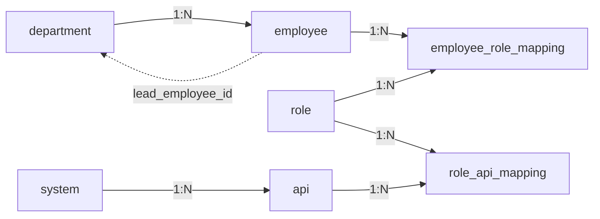
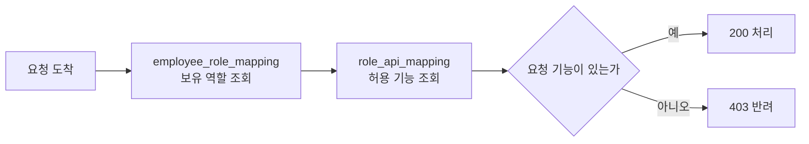

[앞 편](/blog/backend-engineering/auth-domain-and-requirements/)은 무엇을 만들 것인지 정하고 그 결정을 네 종류의 문서로 굳히는 데까지 왔다. 이 편이 맡는 구간은 그 문서들이 **저장 구조라는 형태로 굳는 자리**다. 명세서를 쓰고, 그 안의 기능 문장마다 엔드포인트를 붙이고, 붙여 놓은 표에서 테이블을 꺼낸다.

이 구간에서 조용히 잘못되는 것은 무엇을 만들지 정하는 일이 아니다. 정한 것을 옮겨 적는 동안 **아무도 요구하지 않은 것이 끼어드는 일**이다. 저장 구조를 그릴 때는 익숙한 모양이 먼저 떠오르고, 떠오른 모양은 근거가 있는 것처럼 보인다. 반년 뒤에 그 테이블이 왜 있는지 물으면 아무도 답하지 못하는데, 답하지 못한다는 사실 자체가 그때는 드러나지 않는다.

그래서 이 편의 절차는 전부 **역방향**이다. 테이블을 떠올린 뒤 요구사항에서 근거를 찾는 것이 아니라, 요구사항이 만들어 낸 표를 펼쳐 놓고 거기서 테이블을 꺼낸다. 순서를 뒤집으면 근거 없는 테이블이 생길 자리가 아예 없어진다.

## 명세서는 성격이 다른 문장을 나눠 담는다

요구사항 명세서는 앞 단계의 판단을 한곳에 모아 정리한 문서이고, 그 안의 문장은 성격이 갈린다.

| 구성 | 담기는 것 |
| --- | --- |
| 목적 | 이 문서가 왜 있는가 — 개발과 테스트가 같은 기준을 보게 만드는 일 |
| 범위 | 로그인과 로그아웃, 사용자 등록과 관리, 직무별 접근 제어, 사내 로그인 통합 |
| 기능적 요구사항 | 시스템이 **무엇을 하는가** |
| 비기능적 요구사항 | 시스템이 **어떤 품질로** 하는가 |
| 기타 요구사항 | 운영과 프로세스에 관한 규칙 |

가운데 두 행의 구분이 이후 작업을 두 갈래로 나눈다. 기능 요구는 API 목록이 되고 그 목록이 다시 테이블이 되지만, 품질 요구는 그 경로를 타지 않는다. 대신 **서버를 몇 개 띄울 것인가와 그것들을 어떻게 갈아 끼울 것인가**로 내려간다. 같은 문서 안에 나란히 적혀 있으면서 도착지가 다른 것이고, 이 편은 앞의 갈래를 끝까지 따라간 다음 뒤의 갈래가 어디로 향하는지만 확인한다.

## 요구 문장 옆에 엔드포인트가 붙는다

명세서에서 기능 요구는 문장 혼자 서 있지 않는다. 문장 바로 옆에 그것을 실현하는 API 표가 따라붙어서, 요구 하나가 어느 엔드포인트로 구현되는지를 문서만 보고 짚을 수 있다. 오른쪽 끝 열은 원래 이 표에 없던 것으로, 뒤에서 저장 구조를 뽑을 때 붙게 될 값을 미리 적어 둔 것이다.

| 요구 그룹 | 기능 | METHOD | PATH | 다루는 대상 |
| --- | --- | --- | --- | --- |
| **사용자 관리** | 회원 등록 | `POST` | `/users` | `employee` |
| | 회원 수정 | `PATCH` | `/users/{id}` | |
| | 회원 삭제 | `DELETE` | `/users/{id}` | |
| | 회원 단건 조회 | `GET` | `/users/{id}` | |
| | 회원 다건 조회 | `GET` | `/users` | |
| **사용자 인증** | 로그인 | `POST` | `/login` | — |
| | 로그아웃 | `POST` | `/logout` | |
| **시스템 관리** | 시스템 등록 | `POST` | `/systems` | `system` |
| | API 등록 | `POST` | `/systems/{id}/api` | `api` |
| **권한 관리** | 권한 등록 | `POST` | `/roles` | `role` |
| | 사용자 권한 부여 | `POST` | `/users/{id}/roles` | |
| | 사용자 권한 변경 | `PATCH` | `/users/{id}/roles` | |
| | 사용자 권한 조회 | `GET` | `/users/{id}/roles` | |
| **부서별 권한 관리** | 부서 등록 | `POST` | `/teams` | `department` |
| | 부서 삭제 | `DELETE` | `/teams/{id}` | |
| | 부서 인원 추가 | `POST` | `/teams/{id}/users` | |
| | 부서장 지정 | `POST` | `/teams/{id}/lead` | |
| | 부서 인원 조회 | `GET` | `/teams/{id}/users` | |
| **시스템 간 인증** | 시스템 권한 추가 | `POST` | `/systems/{id}/roles` | `system` × `role` |
| | 시스템 권한 조회 | `GET` | `/systems/{id}/roles` | |

여섯 그룹은 각각 요구 문장 하나에서 나왔다. 인사팀이 입사자를 등록하고 퇴사자를 지우는 일, 사람이 아이디와 비밀번호로 들어오고 나가는 일, IT팀이 시스템과 그 시스템의 기능 목록을 올리는 일, 직무가 바뀔 때 권한을 손보는 일, 부서를 만들고 사람을 넣는 일, 그리고 캘린더가 근태의 휴가 정보를 읽어 가는 일이다. 마지막 그룹이 앞 편에서 본 시스템 간 인증 요구가 엔드포인트의 모양으로 나타난 자리다.

경로를 훑으면 결정 하나가 눈에 띈다. **역할이 사용자의 하위 자원으로 놓여 있다**(`/users/{id}/roles`). 역할을 독립된 자원으로 두고 누구의 것인지를 본문이나 질의 문자열로 받는 형태도 가능했지만 그렇게 하지 않았고, 이 선택은 뒤에서 그릴 테이블 배치와 그대로 맞물린다. 부분 수정에 `PATCH`를 쓴 것도 같은 성격의 판단이다 — 권한 하나를 바꾸려고 사용자 정보 전체를 다시 보내게 만들지 않겠다는 뜻이다.

## 품질 요구는 배포 형태를 미리 정한다

비기능 요구는 다섯 줄뿐이지만, 각 줄이 이 시리즈의 뒷부분을 하나씩 예약해 둔다.

| # | 항목 | 요구 | 어디로 내려가는가 |
| ---: | --- | --- | --- |
| 1 | 보안 | 인증 증표는 위조할 수 없게 만들어지고 진위를 확인할 수 있어야 한다 | 서명 알고리즘 · 키 관리 · 검증 필터 |
| 2 | 성능 | 응답이 빨라야 하고, 동시 접속 규모를 명시하며, 예상 못 한 부하에 늘릴 수 있어야 한다 | 상태를 서버에 두지 않는 구조 · 수평 확장 |
| 3 | 사용성 | 계정 하나로 전 시스템에 들어가고, 오류 메시지가 해결에 도움이 되어야 한다 | 통합 인증 · 오류 응답 규격 |
| 4 | 신뢰성 | 모든 사내 시스템이 공통으로 의존하므로 복구가 빠르고 가용성이 높아야 한다 | 복제본 다수 · 상태 점검 · 무중단 교체 |
| 5 | 유지보수성 | 갱신해도 연동이 깨지지 않고 새 요구를 계속 받아들일 수 있어야 한다 | 하위 호환 API · 계층 분리 |

여기에 기타 요구 두 줄이 붙는다. 보안 취약점에 대응하기 위해 정기적으로 갱신하고 감시할 것, 그리고 개발과 테스트 과정의 모든 변경을 버전 관리로 추적할 것이다.

> 네 번째 줄이 이 프로젝트에서 가장 무겁다.
>
> 인증은 캘린더와 근태와 회의실이 모두 매달려 있는 단일 지점이라서, 여기가 멈추면 사내의 모든 화면이 로그인 앞에서 멈춘다.
>
> 「가용성을 높게 유지한다」를 문서에 적어 놓고 인스턴스 하나로 띄우면 명세와 구현이 어긋난다. 시리즈 뒷부분의 쿠버네티스 구성은 결국 이 문장 하나를 감당하려고 붙는 것이다.

두 번째 줄도 뒤에 그림자를 길게 남긴다. 부하에 따라 서버를 늘리려면 어느 서버가 요청을 받아도 같은 답이 나와야 하고, 그러려면 로그인 상태를 특정 서버의 메모리에 둘 수 없다. **성능 요구 한 줄이 인증 방식의 선택지를 미리 좁혀 놓는 것**이고, 그 좁혀진 선택지를 저울질하는 것이 다음 편의 일이다.

## 엔티티는 떠올리지 않고 뽑아낸다

저장 구조를 그리는 도면에는 네 가지 요소가 들어간다.

| 요소 | 무엇인가 |
| --- | --- |
| 엔티티 | 저장할 대상 |
| 속성 | 그 대상이 지니는 정보 |
| 관계 | 두 대상 사이의 연관 |
| 기수성 | 그 관계에서 각 쪽이 몇 개씩 대응하는가 |

그리는 순서도 정해져 있다.

첫 칸이 이 편의 처음에 말한 역방향이 실제로 적용되는 자리다. 앞에서 만든 API 표를 나란히 놓고 경로에 나오는 명사를 훑으면 대상이 저절로 드러난다. `/users`에서 회원이, `/teams`에서 부서가, `/roles`에서 역할이, `/systems`에서 시스템이, `/systems/{id}/api`에서 기능이 나온다. 다섯 개다.

이 순서가 안전한 이유는 **명세에 근거가 있는 것만 남기 때문**이다. 대상을 먼저 떠올려서 그리면 두 방향으로 어긋난다. 아무도 요구하지 않은 테이블이 끼어들거나, 있어야 할 테이블이 빠진다. 거꾸로 꺼내는 방식이 확실하게 막는 것은 **앞쪽뿐**이다 — 경로에 나오지 않은 명사는 나올 자리가 없기 때문이다. 뒤쪽은 막히지 않는다.

이 표 안에 이미 한 자리가 그렇게 비어 있다. 「시스템 간 인증」 그룹은 캘린더가 근태의 어느 기능을 쓸 수 있는지를 정하는 요구이고, 이것은 시스템과 역할을 잇는 또 하나의 관계다. 그런데 뒤에 나올 스키마에는 그 둘을 잇는 표가 없다. 경로의 명사를 훑는 방식은 **이름으로 등장한 것만 되돌려주므로**, 이름 없이 관계로만 존재하는 대상은 사람이 따로 알아채야 한다.

`/login`과 `/logout`의 대상 칸이 비어 있는 것은 성격이 다르다. 이 둘은 무엇을 새로 저장하는 요청이 아니라 이미 저장된 것을 확인하는 요청이라 **이 단계에서는** 표를 부르지 않는다. 다만 로그인한 상태를 어디에 둘 것인가를 정하고 나면 이야기가 달라질 수 있고, 그 판단은 다음 편의 몫이다.

## 열 하나가 테이블 하나로 갈라지는 자리

다섯 대상에 속성을 붙이는 단계에서 회원 테이블은 처음에 이렇게 생겼다.

| `employee` 초안 | 타입 |
| --- | --- |
| `id` (기본 키) | long |
| `name` | string |
| `department_id` | long |
| `role_id` | long ← **여기가 문제다** |

마지막 열이 회원 하나에 역할 하나를 못 박는다. 그런데 앞 편에서 늘어놓은 이벤트 목록에는 인사팀 소속이면서 조직장인 사람이 두 역할을 함께 가진다는 줄이 있었다. **이 구조로는 그 줄을 표현할 방법이 없다.**

한 사람이 역할 여럿을 가지고 한 역할을 여러 사람이 나눠 가지므로 양쪽 모두 여럿이고, 그런 관계는 열 하나에 담기지 않는다. 사이에 표를 하나 세워 회원 식별자와 역할 식별자의 짝을 행으로 쌓는 방식으로 풀어야 한다. `employee_role_mapping`이 그것이다.

역할과 기능 사이도 정확히 같은 모양이다. 역할 하나가 여러 기능의 호출을 허용하고 기능 하나를 여러 역할이 참조하므로, `role_api_mapping`이 같은 이유로 필요해진다.

여기서 짚어 둘 것은 이 두 표가 **설계자의 취향이 아니라 요구사항 문장에서 나왔다**는 점이다. 이벤트 목록의 한 줄이 없었다면 초안의 `role_id`는 그대로 남았을 것이고, 두 역할을 함께 가진 사람이 실제로 등록되는 시점에야 문제가 드러났을 것이다. 그때는 이미 그 열을 읽는 코드가 여기저기 흩어진 뒤다. 벌어질 일을 성실하게 늘어놓는 작업이 뒤에서 구조를 뜯는 작업을 대신한다는 것이 이 자리에서 실물로 확인된다.

## 완성된 스키마와 그 안에 남은 고리

| 테이블 | 컬럼 |
| --- | --- |
| `employee` | `id`(PK, long) · `name`(string) · `department_id`(long) |
| `department` | `id`(PK, long) · `name`(string) · `lead_employee_id`(long) |
| `employee_role_mapping` | `id`(PK) · `employee_id` · `role_id` |
| `role` | `id`(PK, long) · `name`(string) |
| `role_api_mapping` | `id`(PK) · `role_id` · `api_id` |
| `api` | `id`(PK, long) · `system_id`(long) · `api_path`(string) |
| `system` | `id`(PK, long) · `name`(string) |

점선으로 그린 화살표가 다른 것들과 성격이 다르다. 부서는 소속 직원을 가리키고 직원은 소속 부서를 가리키므로 **두 테이블이 서로를 참조한다.** 부서장이 그 부서 소속 직원이라는 당연한 사실이 도면에서는 고리로 나타나는 것이고, 실무에서는 두 가지가 따라온다. 어느 쪽을 먼저 넣을 것인가 하는 순서 문제와, 한쪽을 지울 때 남은 참조를 어떻게 정리할 것인가 하는 문제다. 둘 다 스키마를 보는 것만으로는 답이 정해지지 않아서, 설계 검토에서 한 번은 짚고 넘어가게 되는 자리다.

전체 모양은 역할 기반 접근 제어의 표준형 그대로다. 사람에서 기능으로 곧장 가지 않고 **역할을 한 번 거쳐 두 단으로 잇는 것**이 핵심이며, 이 한 겹이 운영 비용을 결정한다. 사람에게 기능 접근을 직접 붙였다면 인사 이동이 있을 때마다 그 사람에게 달린 허용 목록을 하나씩 옮겨야 하지만, 역할에 붙여 두면 사람과 역할을 잇는 행 하나만 바꾸면 된다. 앞 편에서 인가에 쓰이는 정보가 인증에 쓰이는 정보보다 훨씬 자주 바뀐다고 한 것의 실질적인 대응이 이 두 단이다.

## 권한을 확인하는 데 드는 비용

스키마가 정해지면 인가 판단의 절차도 함께 정해진다.

이 그림에서 눈여겨볼 것은 **모든 요청마다 조인이 두 번 일어난다**는 사실이다. 앞 절에서 운영 비용을 낮춘 두 단이 여기서는 조회 비용으로 돌아온다. 두 매핑 표의 외래 키에 인덱스를 어떻게 얹느냐가 [실행 계획에서 갈리는 자리](/blog/backend-engineering/sql-execution-and-indexes/)이고, 그것으로 모자랄 때 나오는 다음 수가 결과를 캐시에 얹는 것이다.

그런데 캐시를 얹는 순간 앞 편의 요구 하나와 정면으로 부딪친다. 퇴사하면 권한을 곧바로 거둔다는 줄이다. 거둔 뒤에도 캐시에 옛 판단이 남아 있으면 시스템은 잘못된 답을 자신 있게 돌려주고, 회수 화면도 데이터베이스도 정상으로 보이므로 어긋남이 드러나지 않는다. 이 편에서 세 번째로 만나는 같은 모양의 함정이다 — **어긋났다는 사실 자체가 관측되지 않는 종류**의 것이다.

빠져나갈 길은 두 갈래다. 캐시가 살아 있는 시간을 요구가 견딜 만큼 짧게 잡거나, 권한이 바뀔 때 무효화를 알려 캐시를 비우는 것이다. 앞쪽은 만들기 쉽지만 「곧바로」의 뜻을 캐시 유지 시간만큼 늘려 잡아야 하고, 뒤쪽은 정확한 대신 알림이 유실되면 조용히 옛 값이 남는다. 이 선택은 이 편의 범위 밖이지만, **스키마를 정하는 자리에서 이미 예약된 질문**이라는 점은 여기 적어 둘 값어치가 있다.

## 정리

이 편이 따라온 것은 문장에서 표로, 표에서 도면으로 내려오는 한 방향의 길이었다. 그리고 각 칸은 앞 칸이 남긴 것만 재료로 썼다. 엔드포인트는 요구 문장에서, 대상은 엔드포인트의 명사에서, 관계 테이블은 이벤트 목록의 한 줄에서 나왔다.

이렇게 하면 느려 보이지만 실제로 아끼는 것은 시간이 아니라 **나중에 설명할 수 있는 능력**이다. 스키마의 어느 테이블을 짚어도 그것이 어느 요구에서 왔는지 되짚을 수 있으면, 새 요구가 들어왔을 때 무엇을 고쳐도 되고 무엇을 건드리면 안 되는지가 판단된다. 근거가 남지 않은 구조는 고칠 수 없어서 그대로 굳고, 굳은 구조 위에는 우회로만 쌓인다.

한 가지 더 남았다. 이 편에서 정한 것은 **어떤 데이터를 어떤 모양으로 둘 것인가**까지이고, 그 위에서 실제로 무엇이 도는지는 아직 하나도 정하지 않았다. 요청을 받아 계층을 거쳐 테이블에 닿는 경로가 필요하고, 로그인한 사람이 다음 요청에서도 같은 사람으로 인정되게 만드는 장치가 필요하다. 뒤의 장치는 선택이 갈리는 자리다 — 상태를 서버에 두는 방식과 증표에 담아 보내는 방식이 각각 무엇을 얻고 무엇을 포기하는지, 그리고 이 편의 비기능 요구 두 번째 줄이 그 저울에 어떻게 얹히는지가 [다음 편](/blog/backend-engineering/session-vs-token-authentication/)의 주제다.
