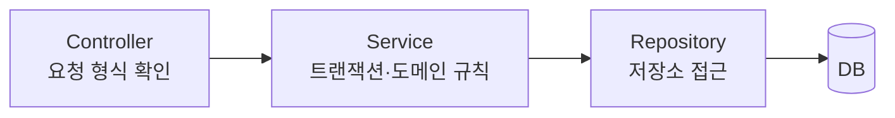
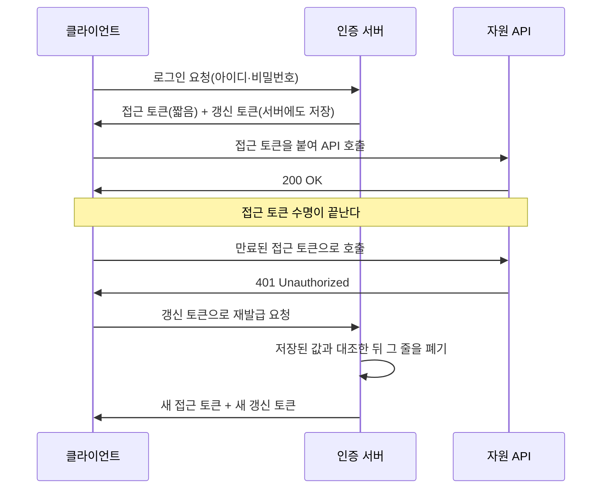
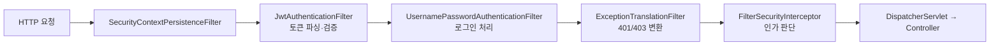

[앞 편](/blog/backend-engineering/requirements-spec-to-erd/)은 요구 문장에서 테이블 일곱 개까지 내려온 뒤 두 가지를 남겨 두었다. 요청을 받아 계층을 거쳐 그 테이블에 닿는 경로가 하나, 한 번 로그인한 사람을 다음 요청에서도 같은 사람으로 알아보게 만드는 장치가 하나다. 이 편이 맡는 구간이 그 둘이다.

앞의 것은 갈릴 여지가 적어서, 여기서 할 일은 관례를 늘어놓는 것이 아니라 **경계를 넘었을 때 무엇이 무너지는지**를 짚는 것이다. 뒤의 것은 다르다. 상태를 서버가 들고 있을 것인가 실어 보낼 것인가는 취향이 아니라 저울질이고, 그 저울의 양쪽에는 성격이 다른 두 요구가 각각 얹힌다. 앞 편이 넘긴 비기능 두 번째 줄이 한쪽이고, 그보다 앞서 요구를 문서로 굳히던 자리에서 나온 회수 요구가 다른 쪽이다.

그리고 이 편은 **만드는 데까지만** 간다. 만든 것을 몇 개 띄우고 어떻게 갈아 끼울 것인가는 여기서 내린 판단이 깔린 뒤에야 시작되므로 다음 편의 몫이다.

## 요청이 테이블에 닿기까지 지나는 세 겹

들어온 요청 하나는 세 겹을 지나 저장소에 닿는다.



아래 표에 한 줄이 더 있는 것은 엔티티가 겹의 하나가 아니라 **그 겹들 사이를 실려 다니는 것**이기 때문이다. 각 칸이 맡는 것보다 **맡지 않는 것**이 더 중요하다.

| 계층 | 여기서 결정하는 것 | 여기로 새어 들어오면 안 되는 것 |
| --- | --- | --- |
| Controller | 요청을 처리에 잇고, 입력 형식을 확인하고, 응답 코드를 정한다 | 도메인 판단과 트랜잭션 경계 |
| Service | 트랜잭션을 열고 닫는 자리, 도메인 규칙의 성립 여부 | `HttpServletRequest` 같은 HTTP 개념 |
| Repository | 저장소에 어떻게 닿는가 | 규칙에 맞는지 아닌지의 판단 |
| Entity | 자기 상태와 그 상태를 바꾸는 규칙 | 화면과 API가 원하는 표현 형태 |

오른쪽 열이 지켜지지 않아도 코드는 그대로 돈다. 무너지는 것은 나중이다 — Service가 HTTP 개념을 알면 그 규칙은 웹 요청이 아닌 경로에서 다시 쓸 수 없고, Controller가 트랜잭션 경계를 쥐면 규칙 하나를 고칠 때마다 어느 요청에서 열린 트랜잭션인지부터 되짚어야 한다. **경계는 지켜지는 동안 아무 효과가 없고 무너진 뒤에야 값을 청구한다.** 계층 분리가 앞 편의 유지보수성 요구에 닿는 자리가 여기다.

## 엔티티를 그대로 내보내지 않는 이유

조회 결과를 그대로 응답에 실으면 코드가 한 줄 짧아진다. 그 한 줄이 부르는 대가는 네 갈래다.

| 무엇이 걸리는가 | 엔티티를 그대로 내보낼 때 | 응답 전용 객체를 따로 둘 때 |
| --- | --- | --- |
| 스키마가 바뀔 때 | 컬럼 하나 늘리면 API 응답 모양이 같이 바뀐다 | 저장 구조와 API 계약이 따로 움직인다 |
| 민감한 필드 | 비밀번호처럼 나가면 안 되는 값이 기본으로 딸려 나간다 | 내보낼 것을 하나씩 골라서 담는다 |
| 검증 규칙 | 화면 사정에 맞춘 검증이 저장 구조 정의에 섞여 든다 | 요청 객체에만 검증을 붙인다 |
| 양방향 연관 | 서로를 가리키는 두 엔티티를 직렬화하면 되돌아온다 | 평평한 모양이라 그럴 자리가 없다 |

앞의 두 줄이 이 프로젝트에서 특히 무겁다. 사내 시스템 전부가 물려 있어서 응답 모양이 흔들리면 그대로 남의 화면으로 번진다.

네 번째 줄은 앞 편의 스키마에서 곧장 나온다. `employee`를 그대로 반환하면 직렬화가 연관을 따라 `employee_role_mapping → role → role_api_mapping → api`까지 끌고 오고, 목록 한 번 조회에 쿼리가 행 수만큼 늘어난다. 그래서 연관은 지연 로딩을 기본으로 깔고 쓰는 자리에서만 조인한다.

```java
@Entity
public class Employee {
    @Id @GeneratedValue
    private Long id;
    private String name;

    @ManyToOne(fetch = FetchType.LAZY)   // 이 줄이 없으면 즉시 로딩이 기본이다
    @JoinColumn(name = "department_id")
    private Department department;

    @OneToMany(mappedBy = "employee")
    private List<EmployeeRoleMapping> roleMappings = new ArrayList<>();
}
```

`@ManyToOne`의 기본값이 즉시 로딩이라는 점이 함정이다. **아무것도 쓰지 않은 상태가 싼 쪽이 아니라 비싼 쪽**이므로, 지연 로딩은 나중에 붙이는 성능 설정이 아니라 처음부터 적는 기본값이다.

```java
@Transactional(readOnly = true)          // 조회에는 더티체킹이 필요 없다
public EmployeeResponse findOne(Long id) {
    Employee e = repository.findById(id)
        .orElseThrow(() -> new EmployeeNotFoundException(id));
    return EmployeeResponse.from(e);     // 엔티티는 이 줄을 넘어가지 않는다
}
```

마지막 줄이 앞의 표 전체를 강제한다. 변환을 Service에서 끝내면 엔티티가 계층 경계를 넘을 길이 없어지고, 표의 네 갈래는 생길 자리를 잃는다.

## 로그인 상태를 어디에 둘 것인가

요구사항을 정리해 둔 목록에는 「로그인 상태는 여덟 시간까지 유지되고, 지나면 다시 로그인해야 한다」는 줄이 있다. 이 한 줄을 어떻게 구현하느냐가 갈림길이다. 서버가 로그인 상태를 들고 있다가 요청마다 꺼내 보는 **서버 세션** 방식과, 서명된 토큰에 신원을 담아 보내고 서명만 확인하는 방식이 있다.

표의 오른쪽 끝 열은 뒤 절의 답을 미리 적어 둔 것이다. 둘 중 하나를 고르는 대신 **줄마다 다른 쪽으로 배정한** 것이 실제로 내린 결정이다.

| 저울에 얹히는 것 | 서버가 상태를 들고 있을 때 | 토큰에 담아 보낼 때 | 뒤 절의 회전 정책이 이 줄을 어떻게 매듭짓는가 |
| --- | --- | --- | --- |
| 상태가 놓이는 곳 | 서버 쪽 메모리나 공용 저장소 | 요청을 보내는 쪽 | 접근 토큰은 보내는 쪽에, 갱신 토큰은 서버 저장소에 나눠 둔다 |
| 인스턴스를 늘릴 때 | 상태 있음이라 저장소를 공유하거나 요청을 한 서버로 몰아야 한다 | 상태 없음이므로 그냥 늘리면 된다 | 매 요청을 받는 쪽은 상태 없음으로 남는다 |
| 권한을 곧바로 거둘 때 | 저장소의 한 줄을 지우면 그 순간부터 막힌다 | 만료 전까지는 유효해서 따로 차단 목록을 둬야 한다 | 갱신 토큰 한 줄을 지운다. 지연은 접근 토큰의 남은 수명뿐이다 |
| 요청 하나가 치르는 비용 | 저장소 조회 한 번 | 서명 검증 한 번, 바깥에 나가지 않는다 | 매 요청은 서명 검증만, 저장소는 재발급 때만 본다 |
| 안이 들여다보이는가 | 식별자 한 줄만 오간다 | 담긴 내용은 누구나 펼쳐 볼 수 있다 | 담는 것을 최소로 줄이고 수명을 짧게 잡는다 |
| 어느 요구에 맞는가 | 퇴사 즉시 권한 회수 | 가용성과 수평 확장 | 두 요구를 서로 다른 토큰에 나눠 배정한다 |

가운데 두 열이 정면으로 부딪친다. 「사람이 나가면 권한을 곧바로 거둔다」는 요구는 왼쪽을, 「부하에 따라 서버를 늘릴 수 있어야 한다」는 비기능 요구는 오른쪽을 가리킨다. 둘 다 명세에 적혀 있으므로 한쪽을 버리는 선택은 없다.

다섯 번째 줄은 오해가 잦다. 서명은 **내용이 고쳐지지 않았음을 보증할 뿐 내용을 가리지는 않는다.** 토큰을 손에 넣은 사람은 안에 든 것을 그대로 읽으므로, 무엇을 담을지 고르는 일이 설계 항목이 된다.

두 번째 줄은 여기서 방식을 고르는 근거로만 썼다. **인스턴스를 몇 개 어떻게 늘릴 것인가는 이 단계에서 정하지 않고**, 그 판단은 다음 편에서 이 표로 돌아온다.

## 짧게 주고 자주 갱신한다

두 요구 중 한쪽을 통째로 고르면 다른 쪽의 대가도 통째로 치른다. 그래서 증표를 둘로 나눈다 — 수명이 짧아 매 요청에 쓰이는 **접근 토큰**과, 길지만 재발급에만 쓰이고 서버에도 사본이 남는 **갱신 토큰**이다.



마지막 화살표에 이 정책의 이름이 붙는다. 재발급할 때 갱신 토큰까지 새것으로 바꾸고 쓰던 것을 버리는 **회전**이다. 회전이 있으면 갱신 토큰 하나는 평생 한 번만 쓰이고, 그 성질에서 재사용 탐지가 딸려 나온다 — 이미 버린 것이 다시 들어오면 정상 흐름이라면 일어나지 않을 일이므로 탈취로 보고 그 사용자의 토큰을 전부 무효화한다.

권한 회수도 같은 저장소에서 처리된다. 갱신 토큰을 지우면 재발급 경로가 막히고, 최악의 지연은 이미 나간 접근 토큰의 남은 수명뿐이다. 앞 절 표의 세 번째 줄이 여기서 실물이 된다.

앞 편이 로그인 요청의 대상 칸을 비워 둔 채 미뤄 놓은 판단도 여기서 닫힌다. 로그인이 아무것도 새로 저장하지 않는 요청이라는 말은 상태를 서버에 두지 않을 때만 성립하고, 갱신 토큰을 서버가 들고 있기로 한 이상 그것을 담을 자리가 하나 는다. 수명은 이미 정해져 있다 — 로그인 상태를 여덟 시간까지 유지한다는 요구가 그대로 갱신 토큰의 수명이 되고, 접근 토큰은 그보다 훨씬 짧게 끊어 그 여덟 시간 동안 여러 번 갈아 끼운다. **절을 열었던 한 줄이 두 증표의 수명으로 나뉘어 내려앉는 자리다.**

다만 회전에는 대가가 따른다. 「대조하고 폐기하고 새로 발급한다」가 하나로 묶여야 하는데, 재발급 요청이 겹쳐 들어오면 두 요청이 같은 줄을 동시에 읽는다. 대조가 둘 다 통과한 뒤 폐기가 두 번 일어나면 방금 발급한 것까지 버려져 정상 사용자가 로그아웃된다. [트랜잭션과 동시성 제어](/blog/backend-engineering/transactions-and-concurrency-control/)가 다루는 문제가 그대로 여기 있고, **탈취를 잡으려고 만든 규칙이 경합에서는 멀쩡한 사용자를 잡는 쪽으로 기운다**는 것이 이 정책의 까다로운 지점이다.

## 되돌릴 수 없게 저장한다

로그인 요청이 들고 오는 비밀번호는 저장 구조에서 성격이 다르다. 다른 값은 넣은 대로 꺼내 쓰지만 이것은 **꺼낼 수 없게 넣어야** 한다.

| 항목 | 왜 그렇게 하는가 |
| --- | --- |
| 되돌릴 수 없는 방식 | 저장소가 통째로 새어 나가도 원문이 복원되지 않는다 |
| 범용 해시를 쓰지 않는 이유 | 빠르라고 만든 함수라서, 그 빠름이 대입 공격에도 그대로 도움이 된다 |
| 값마다 다른 솔트 | BCrypt는 결과 문자열 안에 솔트를 함께 넣는다. 같은 비밀번호도 저장된 모양이 매번 다르다 |
| 계산 비용 조절 | 강도 값을 올려 한 번 계산하는 시간을 늘린다. 장비가 빨라지면 다시 올린다 |
| 확인하는 방법 | 저장값끼리 비교하지 않는다. 원문과 저장값을 함께 넘겨 맞는지 묻는다 |

셋째와 넷째 줄이 짝을 이룬다. 솔트가 있으면 미리 계산해 둔 표가 통하지 않고, 계산 비용이 높으면 표를 새로 만드는 일 자체가 비싸진다. 하나만으로는 반쪽이다.

```java
@Bean
PasswordEncoder passwordEncoder() {
    return new BCryptPasswordEncoder();   // 솔트는 생성도 보관도 알아서 한다
}
```

한 줄이면 끝나는 설정이지만 하지 않았을 때의 결과는 크다. 평문이든 솔트 빠진 해시든, 새어 나간 순간 미리 계산된 표로 즉시 복원되고, 여기는 통합 인증이라 계정 하나가 열리면 그 사람이 쓰던 시스템이 전부 함께 열린다.

## 검사는 컨트롤러 앞에서 끝난다

토큰을 확인하고 권한을 판단하는 일은 요청이 컨트롤러에 닿기 전에 끝난다.



다섯 칸이 각각 다른 실패를 담당한다.

| 필터 | 여기서 하는 일 | 통과하지 못하면 |
| --- | --- | --- |
| SecurityContextPersistenceFilter | 요청 하나짜리 보관함을 열고 끝나면 치운다 | — |
| JwtAuthenticationFilter | 헤더에 실려 온 토큰을 검증하고 결과를 보관함에 넣는다 | 보관함이 빈 채로 흘러가 뒤 칸에서 401이 된다 |
| UsernamePasswordAuthenticationFilter | 로그인 경로의 자격증명을 처리한다 | 인증 예외를 던진다 |
| ExceptionTranslationFilter | 앞뒤에서 올라온 예외를 응답 코드로 옮긴다 | 401 또는 403 |
| FilterSecurityInterceptor | 이 요청이 이 자원에 닿아도 되는지 최종 판단한다 | 접근 거부 예외 → 403 |

두 번째 줄과 다섯 번째 줄의 간격이 인증과 인가의 간격 그대로다. 그 사이에 예외를 응답 코드로 옮기는 칸이 있어서 **401과 403이 갈리는 지점이 한 곳으로 모인다.**

컨트롤러 앞이어야 하는 이유는 성능이 아니라 누락이다. 컨트롤러 안에서 검사하면 검사 코드가 컨트롤러 수만큼 흩어지고, 새 엔드포인트를 추가하며 한 번 빠뜨리면 그 자리가 구멍이 되는데 아무 오류도 나지 않는다. **모든 요청이 반드시 지나는 자리에 한 번 놓으면 빠뜨릴 방법이 없어진다**는 것이 필터를 쓰는 이유다.

앞 편의 시스템 간 인증은 이 체인에 칸이 하나 더 붙는 형태가 된다. 주체가 사람이 아니라 시스템이라 검증할 자격증명도 조회할 대상도 다르므로, 둘을 각각 다른 인증 제공자로 두고 같은 체인에 나란히 세우는 것이 이 단계에서 잡아 둔 모양이다.

## 정리

이 편이 다룬 두 갈래는 성격이 달랐다. 계층과 변환 객체 쪽은 답이 거의 정해져 있어서 판단할 것은 **경계를 지키는 값을 지금 치를까 나중에 치를까**뿐이었다. 로그인 상태 쪽은 정말로 갈리는 자리였고, 갈린 이유는 명세의 두 요구가 서로 다른 답을 가리켰기 때문이다.

거기서 나온 답은 한쪽을 고르는 것이 아니라 **요구마다 다른 토큰을 배정하는 것**이었다. 즉시 회수는 서버가 들고 있는 갱신 토큰이, 수평 확장은 서버가 아무것도 기억하지 않아도 되는 짧은 접근 토큰이 감당한다. 어느 쪽도 통째로 고르지 않았으므로 어느 쪽 대가도 통째로 치르지 않는다. 대신 나눈 만큼 조율할 것이 늘었고, 회전이 경합에서 정상 사용자를 잡아채는 자리가 그 대가로 남았다.

만들 것은 다 만들었는데, 만든 것은 아직 한 대의 서버 안에 있다. 「인스턴스를 늘릴 때」 줄을 근거로만 쓰고 미뤄 둔 판단이 그대로 남아 있다. 만든 것을 어떻게 띄울 것인가 — 몇 개를 띄우고, 환경마다 다른 값과 남에게 보이면 안 되는 값을 어디에 두고, 새 판을 올리는 동안 멈추지 않게 하려면 무엇이 필요한가가 [다음 편](/blog/backend-engineering/kubernetes-deployment-and-rollout/)의 주제다.
