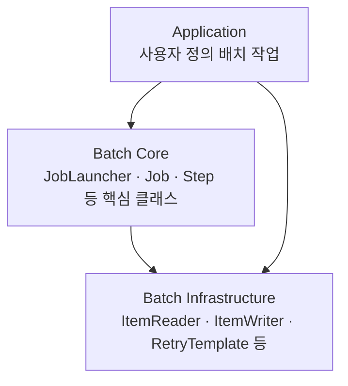
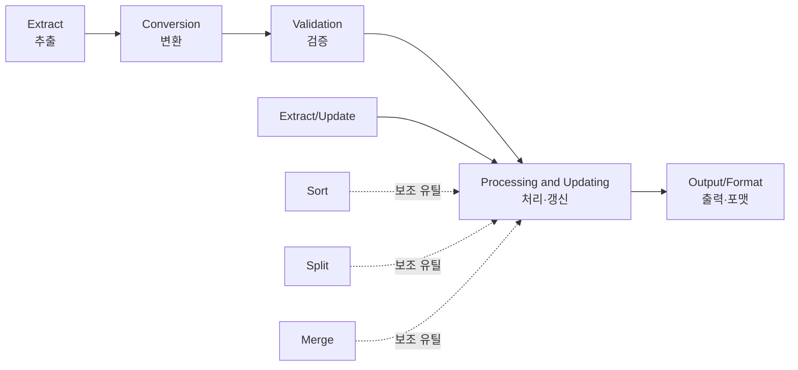
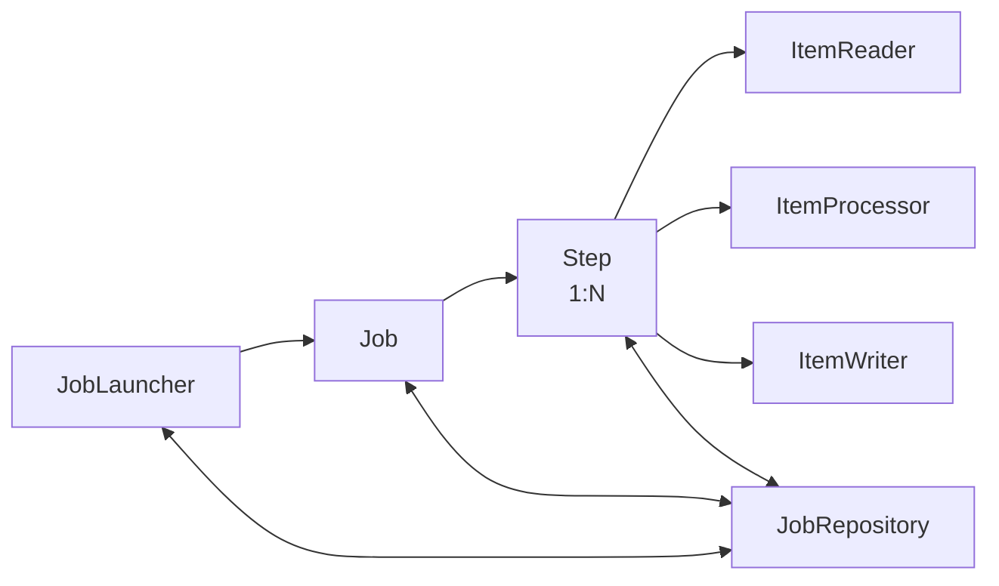
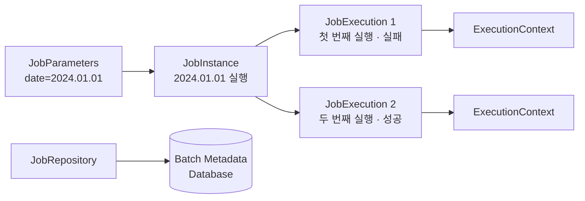
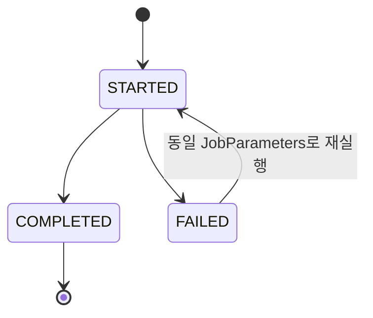

배치를 프레임워크 없이 짜 본 사람은 대개 같은 순서를 밟는다. 마지막으로 처리한 ID를 파일에 적어 두고, 그 파일이 날아가는 사고를 겪은 뒤 테이블로 옮기고, 그다음에는 「어제 돌린 것과 오늘 돌리는 것을 무엇으로 구분하는가」에 답해야 한다. 여기까지 오면 실행 이력 스키마를 절반쯤 설계한 셈이다.

[앞 편](/blog/backend-engineering/batch-processing-fundamentals/)은 배치의 신뢰성이 공짜로 오지 않는다는 데서 끝났다. **Spring Batch를 쓴다는 결정의 실질은 그 스키마를 직접 설계하지 않겠다는 것이다.** 이 글은 그 대신 받는 구조를 연다 — 프레임워크가 계층을 어떻게 갈랐고, 실행 중에 어떤 기록이 남으며, 그 기록이 왜 재시작이라는 성질이 되는지까지다.

## 프레임워크가 셋으로 갈라 놓은 것



세 상자가 위에서 아래로 쌓여 있으니 흔한 3계층 그림처럼 보이지만, 화살표는 둘이 아니라 셋이다. Application에서 Infrastructure로 **곧장 내려가는** 화살표가 하나 더 있다.

이것이 이 그림의 요지다. 배치를 만들며 개발자가 실제로 작성하는 것 — `ItemReader` 구현체, `ItemWriter` 구현체, `ItemProcessor` — 은 Core가 아니라 Infrastructure 계층에 속한다. Core에 있는 `JobLauncher`·`Job`·`Step`은 대개 설정으로 조립할 뿐 상속하거나 다시 구현하지 않는다. **Core는 실행 흐름을 통제하는 층이고, Infrastructure는 갈아 끼우는 층이다.**

### 설계 체크리스트는 결국 I/O 이야기다

| 범주 | 원칙 |
| --- | --- |
| 아키텍처 | 온라인·배치 아키텍처의 상호작용 고려 / 단순화된 설계 / 데이터 처리와 저장의 근접성 유지 |
| 리소스 | 시스템 리소스 최적화 / 불필요한 I/O 방지 / 중복 작업 방지 / 충분한 메모리 할당 |
| 무결성 | 데이터 무결성 유지 / 내부 검증을 위한 체크섬 구현 |
| 검증 | 현실적인 스트레스 테스트 / 백업 절차 준비 및 테스트 |

열두 항목이 나열돼 있지만 아키텍처 범주의 마지막 항목과 리소스 범주는 같은 것을 말한다. 「데이터 처리와 저장의 근접성 유지」는 처리하는 곳과 저장하는 곳이 멀수록 왕복이 늘어난다는 뜻이고, 「불필요한 I/O 방지」와 「중복 작업 방지」는 그 왕복 횟수를 직접 가리킨다. **배치 성능은 대개 CPU가 아니라 I/O 왕복 횟수에서 결정된다** — 성능을 다루는 편이 이 지점에서 시작한다.

### 배치 한 판을 이루는 다섯 단계



본류는 실선으로 이어진 다섯 단계이고, Sort·Split·Merge는 점선으로 붙은 **추가 유틸리티**로 분류된다. 눈여겨볼 것은 **Split이 본류가 아니라 곁가지에 있다는 사실**이다. 그런데 Spring Batch의 Partitioning이 정확히 이 Split이다. 병렬화는 새로운 처리 방식을 도입하는 것이 아니라 이 보조 유틸리티를 프레임워크가 규약으로 흡수한 것이고, 그래서 병렬화를 붙여도 앞의 다섯 단계는 그대로 남는다.

### 입력이 무엇이냐가 재시작 방식까지 정한다

| 유형 | 입력 | 이 시리즈의 요구사항 |
| --- | --- | --- |
| File-driven Application | 플랫 파일(CSV 등) | 요구사항 1 — 상품 대량 등록 |
| Database driven Application | RDB 테이블 | 요구사항 2·5 — 전체 상품 다운로드, 일별 상품 현황 |
| Message-driven Application | 메시지 큐 | 요구사항 4의 원안. 실제 구현에서는 제외됐다 |

이 분류는 이름표가 아니다. 입력 소스가 정해지면 **「어디까지 읽었는가」를 무엇으로 표현할지가 따라 정해진다.** 파일은 몇 번째 줄까지 읽었다고 말할 수 있고, DB는 커서 위치나 페이지 번호를 쥘 수 있다. 이 값이 뒤에 나올 `ExecutionContext`에 담기므로, 입력 유형의 분류는 곧 재시작 방식의 분류이기도 하다.

### 처리 전략은 다섯 개의 선택지가 아니라 하나의 사다리다

처리 전략을 고를 때 봐야 하는 것은 세 가지다 — **예상 데이터 처리량 / 온라인 시스템 또는 다른 배치와의 동시성 관리 / 사용 가능한 배치 윈도우.**

| 옵션 | 설명 | 복잡도 |
| --- | --- | --- |
| 일반 배치 처리 | 단일 프로세스·단일 스레드 | 낮음 |
| 동시 배치 또는 온라인 처리 | 온라인 서비스와 동시에 수행. 잠금 경합 관리가 필요하다 | 중간 |
| 병렬 처리 | 멀티 스레드 또는 병렬 플로우 | 높음 |
| 파티셔닝 | 입력을 분할해 worker가 독립적으로 처리 | 높음 |
| 위 옵션의 조합 | 실무의 대용량 처리는 대개 조합이다 | **가장 높음** |

복잡도 열이 아래로 갈수록 올라간다는 것이 이 표의 형태를 말해 준다. 메뉴판이 아니라 **위에서 시작해 올라갈 이유가 생겼을 때만 한 칸씩 올라가는 사다리다.** 앞의 세 고려사항 중 처리량과 배치 윈도우가 얼마나 올라가야 하는지를 정하고, 동시성 관리는 두 번째 칸에서 곧바로 문제가 된다 — 윈도우가 좁아 배치가 서비스 시간대로 밀려 들어오면 같은 테이블을 두 쪽에서 건드리게 된다.

### 배치가 온라인과 같은 테이블을 볼 때

이때 골라야 하는 것이 잠금 전략이고, 낙관적 잠금과 비관적 잠금의 가정·장단점은 [트랜잭션과 동시성 제어](/blog/backend-engineering/transactions-and-concurrency-control/)에서 비교표와 SQL까지 다뤘다. 여기서는 **배치에서만 달라지는 것**만 짚는다.

**잠금을 쥐는 시간의 단위가 다르다.** 온라인 트랜잭션은 한 건을 밀리초 단위로 처리하고 놓아 주지만, 배치의 트랜잭션 경계는 청크 하나 — 수백에서 수천 건 — 다. 비관적 잠금의 단점으로 적히는 「긴 잠금으로 인한 대기와 데드락」이 예외 상황이 아니라 기본 동작이 된다.

그리고 **충돌했을 때 사정을 물어볼 상대가 없다.** 온라인 서비스는 사용자에게 오류를 보여 주고 다시 시도하게 할 수 있지만, 배치에는 화면 앞에 있는 사람이 없다. 충돌 처리가 전부 자동이어야 하고, 자동 재시도가 안전하려면 같은 작업을 두 번 해도 결과가 같아야 한다. **잠금 전략의 선택이 멱등성 요구로 되돌아온다** — 이 글의 나머지 절반이 그 이야기다.

## 아홉 개의 이름이 하는 일



이름과 뜻은 앞 편의 용어 정리에 묶어 두었으므로, 여기서는 각자가 **무엇을 책임지는가**로 읽는다.

| 구성 요소 | 무엇을 책임지는가 | 놓치기 쉬운 점 |
| --- | --- | --- |
| **Job** | 배치 프로세스 전체를 캡슐화하고 Step을 관리하며 글로벌 속성을 설정한다 | 실행이 아니라 **설정 단위**다 (Bean) |
| **JobInstance** | 논리적 실행 단위를 특정하고 재실행을 관리한다 | `Job 이름 + JobParameters`로 식별된다 |
| **JobParameters** | 이번 기동이 어느 논리적 실행에 해당하는지를 결정하고, 실행에 필요한 값을 함께 넘긴다 | 파라미터가 같으면 **같은 JobInstance**로 취급된다 |
| **JobExecution** | 단일 실행을 추적하고 상태와 기록을 남긴다 | 하나의 JobInstance에 **N개**까지 붙는다 |
| **Step** | 독립적·순차적인 처리 단계를 이룬다 | chunk 방식과 Tasklet 방식 두 갈래가 있다 |
| **StepExecution** | Step 1회 실행의 상태·기록을 남긴다 | **읽기·쓰기·스킵 건수**가 여기 쌓인다 |
| **ExecutionContext** | 재시작에 필요한 상태를 키-값으로 보관한다 | Job용과 Step용이 서로 **독립**이다 |
| **JobRepository** | 위의 기록 전부를 DB에 영속화한다 | 배치의 신뢰성이 여기서 나온다 |
| **JobLauncher** | Job을 기동한다 | 스케줄러·CLI·API가 호출하는 진입점이다 |

아홉 개 중 넷(`JobInstance`·`JobExecution`·`StepExecution`·`ExecutionContext`)은 개발자가 코드로 만드는 물건이 아니라 **실행하면 생기는 기록**이다.

### 기록은 끝나고 나서 남는 것이 아니다

도식에서 `JobRepository`로 향하는 화살표는 셋이고 전부 **양방향**이다. 메타데이터 기록이 잡이 끝난 뒤의 후처리가 아니라 **실행 전 과정에 걸쳐 계속 일어나는 일**이라는 뜻이다. `JobLauncher`는 기동 전에 「이 파라미터로 도는 JobInstance가 이미 있는가」를 물어야 하고, `Step`은 진행하면서 처리 건수를 갱신하며, 완료 시점에 상태를 확정한다.

그래서 `JobRepository`가 쓰는 DB는 배치 성능에 직접 영향을 준다. 업무 데이터를 커밋하는 간격을 정하는 결정이 메타데이터 쪽에도 함께 걸린다는 뜻이고, 그 간격을 무엇으로 정하는지는 다음 편의 주제다.

## 재시작은 이 기록이 만들어 내는 성질이다



왼쪽에서 오른쪽으로 읽으면 파라미터 하나가 JobInstance 하나를 특정하고, 그 아래로 실행이 둘 갈라진다. 첫 번째는 실패했고 두 번째는 성공했다. **요지는 실패한 실행이 지워지지 않고 남아 있다는 것이다.** 실패 기록이 있어야 「이 JobInstance는 아직 완료되지 않았다」를 판단할 수 있고, 그 판단이 재실행을 허용하는 근거가 된다.

Step 레벨도 구조가 같다. Step 1이 성공하고 Step 2가 실패했다면, 재실행할 때 Step 1의 `StepExecution`은 COMPLETED로 남아 있으므로 **Step 2부터** 재개된다. 어디서부터 다시 시작할지를 판단하는 근거가 코드가 아니라 테이블에 있다.

### 이 구조가 없으면 무슨 일이 나는가

첫째, **「어디까지 처리했는가」를 애플리케이션이 직접 관리해야 한다.** 1천만 건짜리 잡이 900만 건째에서 죽었는데 그 위치를 아무도 적어 두지 않았다면 남은 방법은 처음부터 다시 도는 것뿐이고, 앞의 900만 건을 되풀이하는 시간이 남은 배치 윈도우에 들어가지 않으면 그날 배치는 실패로 확정된다.

둘째, **JobParameters를 잘못 설계하면 재시작이 성립하지 않는다.** 파라미터에 `System.currentTimeMillis()`를 넣으면 값이 매번 달라 항상 새 JobInstance가 되므로 되돌아갈 곳이 없어진다. 반대로 날짜만 넣으면 같은 날 다시 돌리려 할 때 「이미 완료됨」으로 거부된다. 두 실패가 마주 보는 이유는 하나다 — **JobInstance의 식별자가 곧 재시작의 단위**이기 때문이다. 식별자를 매 실행마다 바꾸면 돌아갈 좌표가 사라지고, 절대 바꾸지 않으면 정상 완료된 작업을 의도적으로 다시 돌릴 방법이 없어진다. 원본이 이 트레이드오프를 실무 사고의 단골로 꼽은 것은 어느 쪽도 오류처럼 보이지 않기 때문이다.

## 재시작이 안전하려면 배치가 멱등해야 한다



되돌아오는 화살표는 하나뿐이고 그 위에 조건이 적혀 있다 — **동일한 JobParameters.** COMPLETED에서 나가는 화살표가 없다는 것이 앞 절 두 번째 실패의 다른 표현이다.

재시작하면 완료된 Step은 건너뛰고 실패 지점부터 재개된다. 여기에 조건이 하나 더 붙는다. **재시작이 안전하려면 배치가 멱등해야 한다** — 같은 구간을 두 번 처리해도 결과가 같아야 한다는 뜻이다.

| 배치 | 멱등하게 만드는 방법 |
| --- | --- |
| 일별 보고서 | 대상 일자 데이터를 먼저 삭제하고 다시 삽입하거나(delete-then-insert) UPSERT를 쓴다 |
| 상품 등록 | 자연키를 기준으로 UPSERT해 중복 INSERT를 막는다 |
| 카운터·잔액 갱신 | **없다.** 누적 연산은 재실행 시 이중 반영된다 |

앞의 둘과 셋째를 가르는 것은 기법이 아니라 무엇을 쓰는가다. `SET count = 100`은 몇 번을 실행해도 100이지만 `SET count = count + 1`은 실행 횟수만큼 늘어나고, 반영된 뒤에는 두 번 더해진 값과 원래 큰 값을 구분할 방법조차 없다. **배치에서 증분 UPDATE는 튜닝 대상이 아니라 설계 단계에서 배제하는 대상이다.**

### 재시작을 포기해야 하는 자리가 있다

멀티스레드로 도는 Step에서 `saveState(false)`를 지정했다면, **그 잡의 재시작은 부정확하다는 것을 전제로 운영해야 한다.** 여러 스레드가 동시에 진행하는 상황에서는 「여기까지 읽었다」는 하나의 위치 값이 성립하지 않기 때문이다. 이 경우 방어선은 재시작이 아니라 「해당 대상 전체를 다시 실행하고, 그래도 결과가 같도록 멱등성으로 막는다」가 된다.

이것이 앞의 결론을 뒤집는 것처럼 보이지만 그 반대다. 병렬화는 정확한 재시작 지점을 내주고 처리량을 사는 거래이고, 그 거래를 하고 나면 **멱등성 하나만 남는다.** 앞 편이 예고한 「병렬 실행에서는 위치 정보가 의미를 잃는다」는 지점이 여기이고, 어느 방식이 어디까지 이 값을 포기하는지는 성능을 다루는 편이 갈라 본다.

## 한 실행 안에서의 방어 — Skip과 Retry

여기까지가 실행과 실행 **사이**의 방어다. 그런데 CSV 1천만 줄 중 세 줄의 형식이 어긋난 것 때문에 나머지를 버리고 FAILED로 끝내는 것은 대개 과잉이다. Skip과 Retry는 실행 하나 **안에서** 그 판단을 하는 장치다.

### Skip — 건너뛰되 조용히 넘어가지 않게

```java
return new StepBuilder("step1", jobRepository)
        .<String, String>chunk(10, transactionManager)
        .reader(flatFileItemReader())
        .writer(itemWriter())
        .faultTolerant()
        .skipLimit(10)
        .skip(FlatFileParseException.class)
        .build();
```

특정 예외만 제외하고 나머지를 전부 스킵하는 형태도 가능하다.

```java
        .faultTolerant()
        .skipLimit(10)
        .skip(Exception.class)
        .noSkip(FileNotFoundException.class)
        .build();
```

앞은 넘길 것을 열거하는 **허용 목록**이고 뒤는 넘기지 않을 것을 열거하는 **거부 목록**이다. 뒤쪽은 아직 모르는 실패까지 넘기겠다는 뜻이므로 `skipLimit`이 사실상 유일한 안전장치가 된다.

`skipLimit`을 넘어서면 Step은 FAILED로 종료된다. 한도를 두지 않는 스킵은 **데이터 유실을 조용히 만드는 안티패턴**이므로, 한도와 스킵 로그를 반드시 함께 둔다. 로그를 따로 남기라는 단서가 붙는 이유는 앞의 표에 있다 — 스킵 건수는 `StepExecution`에 남지만 **남는 것은 숫자뿐이다.** 「3건이 스킵됐다」는 알 수 있어도 「어느 줄이 왜 스킵됐는가」는 알 수 없고, 그 3건을 나중에 손으로 처리해야 하는 쪽에 필요한 것은 후자다.

### Retry — 다시 해 보면 될 성질인가

Retry는 **일시적** 실패에만 유효하다. 원본이 지목한 대상은 셋이다 — **일시적인 네트워크 문제 / 데이터베이스 잠금 문제 / 외부 API 호출.** 파싱 오류나 제약 위반처럼 결정적으로 실패하는 경우에 Retry를 걸면 같은 실패를 N번 반복할 뿐이다.

| 상황 | Skip | Retry |
| --- | --- | --- |
| CSV 한 줄이 형식에 어긋난다 | **적합** | 부적합 |
| 외부 API가 5xx를 돌려준다 | 부적합 | **적합** |
| DB 데드락이 났다 | 부적합 | **적합** |
| 유니크 제약을 위반했다 | 상황에 따라 | 부적합 |

네 행이 하나의 질문으로 접힌다. **같은 입력으로 다시 시도하면 결과가 달라질 수 있는가.** 달라질 수 있으면 Retry이고, 몇 번을 해도 같으면 Skip이다. 유니크 제약 위반만 「상황에 따라」인 것도 이 질문으로 갈린다 — 이미 처리한 건이 다시 들어와서 난 위반이면 멱등성이 작동한 흔적이지만, 서로 다른 두 건이 같은 키를 갖고 들어온 것이면 데이터가 잘못된 것이다. 예외 타입이 아니라 도메인 규칙이 가르는 자리다.

잘못 골랐을 때 나는 일도 대칭이 아니다. Retry를 결정적 실패에 걸면 같은 실패를 반복하며 시간을 쓰고, Skip을 일시적 실패에 걸면 잠깐의 장애 동안 지나간 건들이 스킵 카운트만 남기고 사라진다. **앞은 늦어지는 실패이고 뒤는 조용한 실패다.**

## 정리

Spring Batch가 대신 설계해 주는 것은 **「어디까지 했는지 기억하는 방법」**이다. `JobRepository`에 남는 기록이 재시작의 근거가 되고, Skip과 Retry가 그 앞단에서 실행 하나를 끝까지 밀어 준다. 첫 문단에서 말한, 직접 짜면 재발명하게 되는 것의 범위가 여기까지다.

대신 해 주지 않는 것은 **「두 번 해도 되는 작업으로 만드는 방법」**이다. 멱등성은 설정 한 줄이 아니라 배치가 쓰는 SQL의 모양이고, 그 SQL을 정하는 것은 도메인이다.

다음 편은 실행 하나 안으로 들어간다. 한 Step 안에서 데이터가 어떤 순서로 흐르는지, chunk size가 왜 커밋 간격과 같은 말인지, 그리고 입력 소스별로 Reader와 Writer 구현체를 무엇을 기준으로 고르는지를 다룬다.
