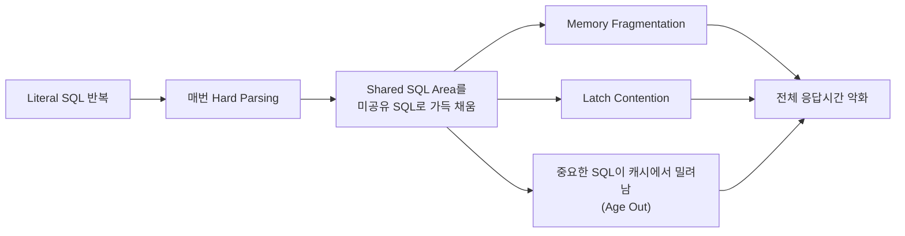
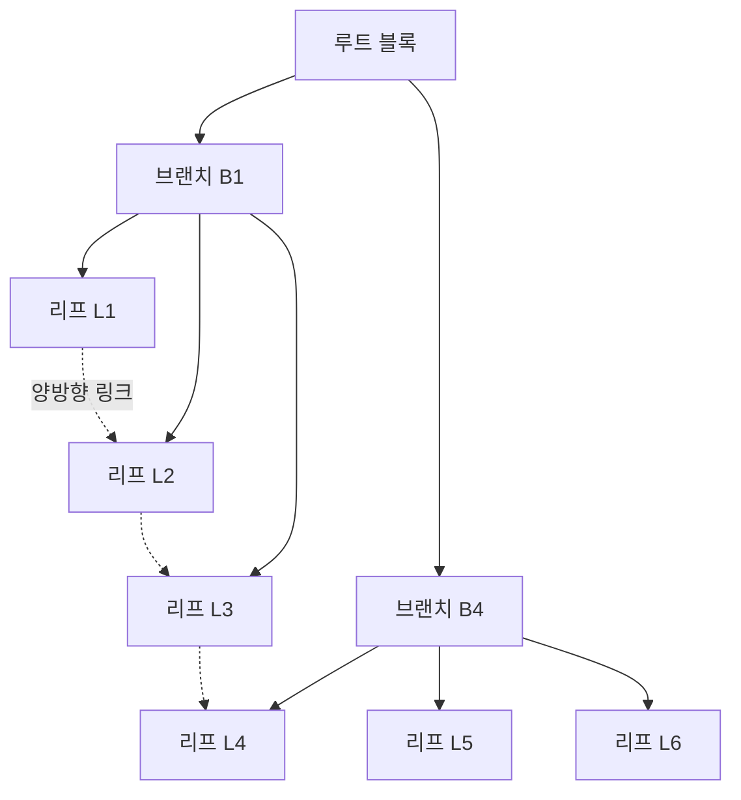
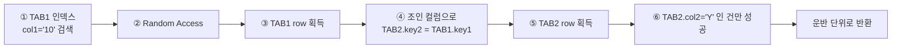

"쿼리가 느리다"는 신고는 원인을 하나로 좁혀 주지 않는다. 같은 테이블, 같은 결과를 내는 SQL인데 하나는 밀리초에 끝나고 다른 하나는 수 초를 쓴다. 그 차이가 생기는 자리는 정해져 있다 — 실행되기 전의 **파싱**, 데이터를 찾아가는 **인덱스**, 옵티마이저가 고른 **실행계획**, 그리고 두 집합을 붙이는 **조인 방식**이다.

이 글은 그 네 자리를 순서대로 짚는다. 어디를 먼저 열어 보아야 하는지, 무엇이 위험 신호인지, 그리고 SQL을 고치는 것으로는 끝나지 않는 경우가 어떤 모양인지까지다. ORM이 만들어 준 쿼리가 왜 느린지 설명해야 하는 백엔드 개발자, 인덱스를 추가했는데도 응답이 그대로인 이유를 찾고 있는 사람을 염두에 두었다. 저장소 자체를 무엇으로 고를 것인가라는 앞 단계의 질문, 즉 문제 해결·비용·유지보수라는 세 기준은 [관계형 데이터베이스와 NoSQL](/blog/backend-engineering/rdbms-and-nosql-fundamentals/) 편이 답한다.

## SQL 명령의 분류

SQL 명령은 하는 일에 따라 다음과 같이 나뉜다.

| 분류 | 원어 | 명령어 |
|---|---|---|
| DDL | Data Definition Language | `CREATE` / `DROP` / `ALTER` / `TRUNCATE` |
| DML | Data Manipulation Language | `INSERT` / `UPDATE` / `DELETE` |
| DQL | Data Query Language | `SELECT` |
| TCL | Transaction Control Language | `COMMIT` / `ROLLBACK` |
| DCL | Data Control Language | `GRANT` / `REVOKE` |

분류 자체는 암기 항목처럼 보이지만, 실무에서 걸리는 지점이 하나 있다. `DELETE`와 `TRUNCATE`의 차이다.

`DELETE`는 DML이라 롤백이 가능하고 행마다 Undo를 남긴다. `TRUNCATE`는 DDL이라 **암묵적 커밋**이 발생하고 롤백이 안 되는 대신 훨씬 빠르다. 대량 삭제를 빠르게 하려고 `TRUNCATE`로 바꿔 놓고 나중에 되돌릴 수 있다고 믿는 것이 사고의 형태다. 되돌릴 수 없는 것은 명령의 속도가 아니라 **분류**에서 이미 정해져 있다.

## 파싱 — SQL이 실행되기 전에 일어나는 일

### Parse · Execute · Fetch


| 단계 | 하는 일 |
|---|---|
| **Parse** | ① Syntax check(문법) ② Semantic check(user·object·privilege 등 의미) ③ **Optimizer**가 실행계획(Execution Plan)·Row Source 생성 ④ 변수 Bind 처리 |
| **Execute** | ① Physical Read(디스크에서 읽기) ② Logical Read(버퍼 캐시에서 읽기) |
| **Fetch** | 컬럼·행 자료를 최종 결과로 반환 |

이 표에서 눈여겨볼 것은 **옵티마이저가 Parse 안에 있다**는 사실이다. 실행계획은 실행 도중에 정해지는 것이 아니라 파싱 시점에 확정된다. 그래서 "이번에는 왜 느린가"를 물을 때 실제로 물어야 하는 것은 "이번에 어떤 실행계획이 만들어졌는가", 더 정확히는 "**새로 만들어지긴 했는가**"다.

### 하드 파싱과 소프트 파싱

Parse 단계에는 **"과거에 수행한 SQL인가?"** 라는 분기가 있다. 오라클이라면 SGA의 **Shared Pool → Shared SQL Area**에 `SQL 문장 텍스트 / 파싱된 형태(parsed form) / 실행계획`이 캐시되어 있는지를 본다.

| 구분 | 흐름 | 비용 |
|---|---|---|
| **소프트 파싱(Soft Parse)** | 캐시 히트 → 저장된 실행계획 재사용 | 저렴 |
| **하드 파싱(Hard Parse)** | 캐시 미스 → 옵티마이저가 실행계획을 새로 생성 | **비싸다.** CPU 소모 + Shared Pool 래치 경합 |

두 경로의 비용 차이가 나는 이유는 옵티마이저가 하는 일 자체가 무겁기 때문이다. 통계정보를 읽고 접근 경로 후보를 비교해 비용을 추정하는 계산을, 캐시가 없으면 **매 실행마다** 다시 한다.

Shared Pool·Literal SQL·바인드 변수처럼 이 절이 쓰는 약어를 한 표에 모아 둔 자리는 [시리즈 1편의 SQL 층 용어 정리](/blog/backend-engineering/rdbms-and-nosql-fundamentals/)다.

### Literal SQL이 왜 재앙인가

캐시 키는 SQL 문장 텍스트다. 값이 문장 안에 그대로 박히면 실행할 때마다 다른 텍스트가 되고, 그때마다 캐시 미스가 난다.

```sql
-- 문제: 값이 바뀔 때마다 서로 다른 SQL 텍스트가 된다
LOOP
  SELECT col1 FROM table1 WHERE col2 = '123';
  SELECT col1 FROM table1 WHERE col2 = '345';
  SELECT col1 FROM table1 WHERE col2 = '456';
END LOOP;

-- 해법: 바인드 변수 — SQL 텍스트가 항상 동일하다
SELECT col1 FROM table1 WHERE col2 = :var1;
```

문제는 하드 파싱 비용에서 끝나지 않는다. 실패가 번지는 경로가 있다.



- Shared SQL Area가 **미공유 SQL 1·2·3·4…** 로 채워지면 정작 재사용해야 할 **중요한 SQL이 밀려나** 다시 하드 파싱된다. 악순환이다.
- 증상은 특정 쿼리가 느린 게 아니라 **DB 전체가 CPU를 태우며 느려지는** 형태로 나타난다. 애플리케이션 로그만 봐서는 원인을 못 찾는 유형의 장애다.

마지막 항목이 이 문제를 어렵게 만든다. 범인은 한 번 실행에 몇 밀리초를 더 쓰는 쿼리인데, **증상은 그 쿼리와 무관한 다른 기능에서** 나타난다. APM에서 느린 쿼리 순위를 뽑아도 상위에 오르지 않는다. 하드 파싱은 개별 쿼리를 느리게 만드는 대신 공용 자원을 갉아먹기 때문이다.

### 파싱 부하를 줄이는 세 가지 원칙

| # | 원칙 | 세부 |
|---|---|---|
| 1 | 이미 수립된 실행계획을 **공유·재사용**하도록 SQL 작성 | 구문 분석 비용 감소, 메모리 사용 개선 |
| 2 | **동일한 SQL 문장**으로 사용 | 텍스트 완전 동일(대/소문자·빈칸·주석 포함), 참조 객체 동일, 바인드 변수 **데이터 형식**까지 동일 |
| 3 | SQL 형식 **표준**을 정해 코딩 | 대/소문자 규칙, 주석 규칙. 자주 쓰는 것은 PL/SQL로 대치 |

2번이 특히 함정이다. `SELECT * FROM EMP`와 `select * from emp`는 **사람에게는 같은 SQL이지만 DBMS에게는 다른 SQL**이다. 캐시 키가 SQL 텍스트의 해시이기 때문이다. 공백 한 칸, 주석 한 줄만 달라도 별도 엔트리가 만들어진다.

그래서 3번은 취향의 문제가 아니라 성능 항목이다. 팀 차원의 SQL 코딩 컨벤션이 없으면 같은 쿼리가 개발자 수만큼 서로 다른 캐시 엔트리로 쌓인다. JPA·MyBatis 같은 프레임워크가 바인드 파라미터를 기본으로 쓰는 것도 같은 이유에서다 — 문자열 조합으로 쿼리를 만드는 코드를 발견하면, 성능 이전에 **캐시 관점에서** 먼저 의심할 자리다.

## DB 접근 횟수(Block I/O)를 줄인다

### 같은 결과, 다른 스캔 횟수

파싱이 실행 **전**의 비용이라면, 이번에는 실행 **중**의 비용이다. 결과가 같아도 DB 왕복과 스캔 횟수가 다르면 비용이 다르다. 아래는 "직원의 연봉과 소속 부서 최대 연봉"을 구하는 두 방식이다.

```sql
-- (A) 인라인 뷰: EMP를 두 번 읽는다
SELECT A.EMP_NAME, A.EMP_SAL, B.MAX_SAL
FROM EMP A,
     (SELECT MAX(SAL) MAX_SAL, DEPT_NO FROM EMP GROUP BY DEPT_NO) B
WHERE A.DEPT_NO = B.DEPT_NO
ORDER BY A.EMP_NAME;

-- (B) 분석함수: EMP를 한 번만 읽는다
SELECT A.EMP_NAME, A.EMP_SAL,
       MAX(SAL) OVER (PARTITION BY DEPT_NO) MAX_SAL
FROM EMP A
ORDER BY A.EMP_NAME;
```

(A)는 집계를 위해 `EMP`를 한 번 더 읽고 그 결과를 원본과 조인한다. (B)는 읽은 행 위에서 윈도우 단위로 집계하므로 테이블 접근이 한 번이다. 두 SQL은 결과 집합이 같지만 **읽는 블록 수가 다르다.** 튜닝에서 "쿼리를 예쁘게 고쳤다"와 "실제로 빨라졌다"가 갈리는 지점이 여기다 — 판단 기준은 문법이 아니라 접근 횟수다.

### 왕복을 줄이는 기법

| 기법 | 무엇을 하나 | 줄이는 것 |
|---|---|---|
| **CASE / DECODE** | 프로그램의 If-Else를 SQL 안에서 처리. 하나의 쿼리로 여러 조건별 결과값 추출 | 조건별 쿼리 N회 → 1회 |
| **MERGE** | `INSERT`와 `UPDATE`를 동시에 처리(`WHEN MATCHED THEN UPDATE` / `WHEN NOT MATCHED THEN INSERT`) | 존재 확인 SELECT + 분기 → 1회 |
| **Multi Table Insert** | `INSERT FIRST` / `INSERT ALL` — 하나의 데이터를 조건에 따라 여러 테이블에 동시 입력 | 소스 테이블 N회 스캔 → 1회 |
| **분석함수(Window Function)** | 추출된 Row에 대해 Window(특정 범위) 단위 집계·순위·평균 제공 | 자기 조인·인라인 뷰 제거, 테이블 접근 1회 |

네 기법이 줄이는 대상은 서로 다르지만 방향은 같다. **애플리케이션이 분기하던 것을 SQL 안으로 밀어 넣어 왕복을 없앤다.**

```sql
-- Multi Table Insert: ORDERS를 한 번만 읽고 4개 테이블로 분기
INSERT FIRST
  WHEN ORDER_TOTAL > 10000 THEN INTO PRIORITY_HANDLING  VALUES (ID)
  WHEN ORDER_TOTAL >  5000 THEN INTO SPECIAL_HANDLING   VALUES (ID)
  WHEN ORDER_TOTAL >  3000 THEN INTO PRIVILEGE_HANDLING VALUES (ID)
  ELSE                          INTO REGULAR_HANDLING   VALUES (ID)
SELECT ORDER_TOTAL, ORDER_ID ID FROM ORDERS;
```

`INSERT FIRST`와 `INSERT ALL`의 차이는 조건을 만나는 방식에 있다. `FIRST`는 조건을 위에서부터 검사해 **처음 만족하는 하나에만** 넣고, `ALL`은 **만족하는 모든 대상에** 넣는다. 위 예제에서 `ALL`로 바꾸면 금액 12,000원짜리 주문이 네 테이블 중 세 곳에 들어간다 — 문법 오류가 나지 않으므로 데이터가 늘어난 뒤에야 발견된다.

## 인덱스 — B-Tree 구조와 선두 컬럼

### B-Tree가 보장하는 것



| 구성 | 역할 |
|---|---|
| 루트/브랜치 블록 | 하위 블록의 시작 키 값과 포인터. `lmc`(leftmost child)는 최소값 미만 구간 포인터 |
| 리프 블록 | **정렬된 키 값 + 테이블 행의 물리 주소(ROWID)**. 리프끼리 **양방향 연결 리스트**로 이어져 범위 스캔이 가능 |

- 리프가 정렬되어 있고 서로 연결되어 있으므로, **범위 조건(BETWEEN, >, LIKE '값%')과 ORDER BY**에 강하다.
- 모든 리프의 깊이가 같아(balanced) 어떤 값을 찾아도 탐색 비용이 균일하다.

도식에서 점선으로 그린 리프 간 링크가 인덱스의 성격을 결정한다. 인덱스는 "값 하나를 빨리 찾는" 자료구조이기도 하지만, 실무에서 더 자주 쓰이는 성질은 **정렬된 상태로 연속 구간을 읽을 수 있다**는 쪽이다. 뒤에 나오는 선두 컬럼 규칙도, 정렬 순서를 못 쓰게 되는 조건들도 전부 이 성질 위에 서 있다.

### 복합 인덱스의 선두 컬럼 규칙

같은 SQL, 같은 데이터인데 **PK 컬럼 순서만** 다르면 성능이 갈린다.

```sql
SELECT COUNT(수험번호)
FROM 대학입시
WHERE 년도 = '2024'
  AND 학기 = 1;
```

| PK 컬럼 순서 | 인덱스 리프 정렬 상태 | 발생하는 스캔 | 결과 |
|---|---|---|---|
| **수험번호 + 년도 + 학기** | `1,2023,1학기` → `1,2024,1학기` → `2,2023,1학기` … (수험번호로 먼저 정렬) | **Index Full Scan** 또는 Index Skip Scan | 조건 컬럼(년도)이 흩어져 있어 **인덱스 전체를 훑어야** 한다 |
| **년도 + 학기 + 수험번호** | `2023,1학기,1` → `2023,1학기,3` → `2023,2학기,1` … (년도·학기로 먼저 정렬) | **Index Range Scan** | 조건에 맞는 **연속 구간만** 읽고 끝 |

두 행의 차이는 인덱스가 있느냐 없느냐가 아니다. **양쪽 다 인덱스가 있다.** 다른 것은 정렬 기준이고, 정렬 기준이 조건과 맞지 않으면 연속 구간이라는 무기가 사라진다.

> **규칙**: 복합 인덱스는 **선두 컬럼(leading column)이 WHERE 절의 등치(=) 조건에 있어야** Range Scan이 가능하다.
>
> 선두 컬럼이 조건에 없으면 인덱스가 "존재하지만 못 타는" 상태가 된다. 인덱스가 있는데 왜 느리냐는 질문의 대부분이 여기서 나온다.
>
> 컬럼 순서 원칙은 ① **등치(=) 조건 컬럼을 앞**에, ② 그다음 **범위(>, BETWEEN) 조건 컬럼**, ③ 카디널리티가 높은(값 종류가 많은) 컬럼을 앞쪽에 두는 것이다.

**Index Skip Scan**은 선두 컬럼의 **고유값 종류가 매우 적을 때**(예: 성별) 옵티마이저가 각 선두 값별로 하위 구간을 건너뛰며 탐색하는 보완책이다. 항상 쓰이는 게 아니라 통계상 유리할 때만 선택된다. 즉 선두 컬럼을 잘못 잡아도 살아나는 경우가 있지만, 그것은 옵티마이저가 봐준 것이지 설계가 맞은 것이 아니다.

### 인덱스를 못 타는 대표 케이스

| 케이스 | 예시 | 왜 못 타나 | 대응 |
|---|---|---|---|
| 인덱스 컬럼 **가공** | `WHERE SUBSTR(dt,1,6) = '202409'` | 인덱스에는 원본 값이 저장되어 있음 | 조건을 `dt >= ... AND dt < ...` 로 변형 or 함수 기반 인덱스 |
| 컬럼에 **연산** | `WHERE sal * 12 > 50000` | 동일 | `sal > 50000/12` 로 우변 이동 |
| **묵시적 형변환** | 컬럼이 VARCHAR인데 `WHERE col = 20240101` | DBMS가 컬럼을 TO_NUMBER로 감쌈 | 타입 맞추기(바인드 변수 타입 포함) |
| **부정형** 조건 | `!=`, `NOT IN`, `IS NOT NULL` | 인덱스는 "찾을 값"이 있어야 유리 | 조건 재설계 |
| **선행 % LIKE** | `LIKE '%검색어'` | 정렬 시작점을 알 수 없음 | 전문 검색 엔진(Elasticsearch 등)으로 분리 |
| **NULL 조건** | `WHERE col IS NULL` | 일부 DBMS(오라클 단일 인덱스)는 NULL을 저장 안 함 | NOT NULL + 기본값, 또는 복합 인덱스 |
| **선두 컬럼 누락** | 위 대학입시 예제 | 정렬 기준이 맞지 않음 | 인덱스 컬럼 순서 재설계 |
| **낮은 선택도** | 전체의 30% 이상을 읽는 조건 | 랜덤 액세스 비용 > Full Scan 비용 | 옵티마이저가 의도적으로 Full Scan 선택. 정상 |

이 표를 세로가 아니라 **가로로** 읽으면 "왜 못 타나" 열이 대부분 한 문장으로 수렴한다. 인덱스는 **정렬된 원본 값**을 갖고 있고, 조건이 그 정렬을 쓸 수 없는 형태면 탐색 시작점이 사라진다. 컬럼을 가공하면 저장된 값과 비교 대상이 달라지고, 묵시적 형변환은 DBMS가 컬럼을 함수로 감싸므로 결국 같은 일이며, 선행 `%` LIKE는 시작점 자체를 지정할 수 없다.

마지막 두 행은 성격이 다르니 따로 본다. **선행 `%` LIKE**는 조건을 고쳐서 해결되는 종류가 아니다. "본문 어디든 포함"은 B-Tree가 지원하도록 만들어진 접근이 아니므로, 요구사항이 진짜로 그것이라면 RDBMS 안에서 버티는 대신 전문 검색 엔진으로 그 기능을 분리하는 것이 맞다. **낮은 선택도**는 아예 문제가 아닌 경우다. 전체의 30% 이상을 읽어야 한다면 랜덤 액세스를 반복하는 것보다 순차적으로 통째 읽는 쪽이 싸다 — 실행계획에 Full Scan이 보인다고 반사적으로 인덱스를 추가하면 오히려 느려진다.

## 실행계획 읽는 법

실행계획은 **트리**다. 읽는 규칙은 세 줄로 정리된다.

| 규칙 | 내용 |
|---|---|
| 1 | **들여쓰기가 깊은 것부터** 실행된다 |
| 2 | 같은 깊이라면 **위에서 아래로** 실행된다 |
| 3 | 자식 결과가 부모로 올라간다 |

읽는 순서를 잡았으면 다음은 무엇을 볼 것인가다.

| 확인 항목 | 무엇을 보나 | 위험 신호 |
|---|---|---|
| **Operation** | TABLE ACCESS FULL / INDEX RANGE SCAN / INDEX FULL SCAN / TABLE ACCESS BY INDEX ROWID | 큰 테이블에 FULL, 대량 건에 BY INDEX ROWID 반복 |
| **Rows(Cardinality)** | 옵티마이저가 **예상한** 행 수 | 실제 행 수와 크게 어긋나면 통계정보가 낡았다는 뜻 |
| **Cost** | 옵티마이저 내부 비용 추정치 | 절대값이 아니라 **대안 계획과의 비교용** |
| **Predicate Information** | `access` vs `filter` | **`filter`가 많다 = 인덱스로 걸러내지 못하고 읽은 뒤 버리는 중** |
| **조인 방식** | NESTED LOOPS / HASH JOIN / MERGE JOIN | 대량 조인에 NL, 소량 조인에 HASH면 의심 |

> 실행계획에서 가장 먼저 볼 것은 Cost가 아니라 **`access`와 `filter`의 구분**이다.
>
> `access`는 인덱스로 **찾아간** 조건이고, `filter`는 일단 읽어온 뒤 **버린** 조건이다.
>
> 10만 건을 읽어 1건을 남겼다면 Cost가 낮게 나와도 그 SQL은 잘못 짜인 것이다. 인덱스 설계로 `filter`를 `access`로 옮기는 것이 튜닝의 본질이다.
>
> 그리고 예상 Rows와 실제 Rows의 괴리는 통계정보 문제를 가리킨다. SQL을 고치기 전에 통계부터 갱신해야 하는 경우가 실제로 많다.

Cost를 먼저 보는 습관이 위험한 이유는 그 값이 **다른 계획과 비교할 때만** 의미가 있기 때문이다. Cost 3,000이 큰 값인지 작은 값인지는 그 자체로 알 수 없다. 반면 `filter`에 걸린 조건은 그 자리에서 판정된다 — 걸러내려고 읽은 행은 전부 버려진 I/O다. 앞 절의 "인덱스를 못 타는 케이스"는 실행계획에서 정확히 이 모습으로 나타난다.

## 조인 알고리즘 세 가지

### Nested Loop Join



| # | Nested Loop Join 특징 |
|---|---|
| 1 | 연결고리에 인덱스가 존재하는 경우에 사용해야 한다 (**inner table 인덱스 존재 필수**) |
| 2 | 처리량이 적은 경우 유리하다 (**랜덤 액세스** 발생) |
| 3 | **순차적으로 처리**하며, **부분범위 처리(Top-N)** 가 가능하다 |
| 4 | **조인 순서에 따라 성능 차이**가 존재 → 처리 범위를 줄일 수 있는 쪽을 선행(driving) 테이블로 |

도식의 ①~⑥이 선행 테이블 한 행마다 반복된다는 점이 이 방식의 성격 전부다. 선행 집합이 10건이면 후행 탐색이 10번이고, 100만 건이면 100만 번이다. 4번 항목이 특징이 아니라 **필수 설계 사항**인 이유가 여기 있다.

### Sort Merge Join

| # | Sort Merge Join 특징 |
|---|---|
| 1 | 주로 처리량이 많으면서 **항상 전체 범위**를 처리해야 하는 경우 유리 |
| 2 | 조인 연결고리 상태에 영향받지 않음 → **연결고리 인덱스가 필요 없다** |
| 3 | 전체 범위를 처리하므로 Fetch 단위 영향이 적다. 적당히 큰 fetch 단위가 좋다 |
| 4 | 데이터가 소량이면 Nested Loop이 유리 |

양쪽을 조인 키로 정렬해 놓고 나란히 훑기 때문에 인덱스가 없어도 성립한다. 대신 정렬 비용을 선불로 낸다.

### Hash Join

Hash Join의 존재 이유는 한 문장이다 — **"Random Access와 Sort를 어떻게 없앨 것인가."**

| # | Hash Join 특징 |
|---|---|
| 1 | **작은 테이블과 큰 테이블의 조인**에 유리 |
| 2 | Hash 함수를 사용하므로 조인 조건이 **항상 `=` (등치)** 여야 한다 |
| 3 | build(driving) 테이블에 **Index가 꼭 필요하지 않다** |
| 4 | 각 테이블을 **1번씩만** 읽는다 |
| 5 | Hash Join의 성능이 더 좋아 **Sort Merge Join의 활용성은 낮아졌다** |
| 6 | **build 테이블의 크기가 매우 중요** — In-Memory Hash가 동작해야 성능이 나온다 |

2번과 6번이 짝을 이룬다. 해시 함수로 위치를 계산하므로 부등호 조건에는 쓸 수 없고, 그 대가로 각 테이블을 한 번씩만 읽는다. 다만 build 테이블이 메모리에 안 들어가면 디스크로 스필하면서 이점이 사라진다.

### 세 방식 비교

| 항목 | Nested Loop | Sort Merge | Hash |
|---|---|---|---|
| **동작 원리** | 외부 행마다 내부 테이블 탐색 | 양쪽을 조인키로 정렬 후 병합 | 작은 쪽으로 해시 테이블 생성 후 큰 쪽을 탐색 |
| **인덱스 필요성** | **inner table 필수** | 불필요 | 불필요 |
| **조인 조건** | `=`, 범위 모두 가능 | `=`, 범위(부등호) 가능 | **`=` 만 가능** |
| **적합한 데이터 양** | 소량 (선행 집합이 작을 때) | 대량 | 대량 |
| **테이블 읽는 횟수** | 외부 1회 + 내부 N회 | 각 1회 + 정렬 | **각 1회** |
| **주요 비용** | 랜덤 액세스 | **정렬(Sort) 비용, TEMP 공간** | 해시 테이블 메모리(부족 시 디스크 스필) |
| **부분범위 처리** | **가능** (첫 행이 빨리 나옴) | 불가 (정렬 완료 후 반환) | 불가 (build 완료 후 반환) |
| **결과 순서** | 선행 테이블 순서 유지 | 조인키 정렬 순서 | 보장 없음 |
| **언제 쓰나** | OLTP 단건·소량 조회, Top-N 페이징 | 부등호 조인 + 대량 | 배치·대량 집계, 등치 조인 |
| **실패 모드** | 대량 데이터에 걸리면 랜덤 액세스 폭증 | TEMP 부족으로 디스크 정렬 | build 테이블이 커서 디스크 스필 → 성능 급락 |

「부분범위 처리」 행이 화면 설계와 직결된다. 페이지 첫 화면에 10건만 보여 주면 되는 목록에서 Hash Join이 잡히면, 사용자는 10건을 기다리는 것이 아니라 **전체 build가 끝나기를** 기다린다. 반대로 야간 배치에서 수백만 건을 집계하는데 Nested Loop이 잡히면 랜덤 액세스가 그만큼 반복된다.

「실패 모드」 행도 함께 본다. 세 방식은 잘 동작할 때가 아니라 **한계를 넘겼을 때 무너지는 모양**이 다르다. Hash Join은 build 테이블이 메모리 안에 있는 동안 가장 빠르다가 임계를 넘는 순간 급락하므로, 데이터가 자라는 서비스에서는 "지금 빠르다"가 안전을 뜻하지 않는다.

## SQL을 바꿀 것인가, 모델을 바꿀 것인가

SQL 튜닝이 언제나 정답인 것은 아니다. 아래는 **모델 자체를 손대야** 하는 신호다.

| # | 모델 변경을 검토할 신호 |
|---|---|
| 1 | 테이블 내 **컬럼 순서 변경**에 따른 성능 이득이 큰 경우 (앞의 복합 인덱스 예제) |
| 2 | **표준화되지 않은 컬럼**으로 조인해 성능 저하가 발생하는 경우 (타입 불일치 → 묵시적 형변환) |
| 3 | **식별자/비식별자 관계** 때문에 SQL이 복잡해지거나 과도한 Join이 발생하는 경우 |
| 4 | **이력 유형** 정보를 관리하는 경우 (최신 값 조회가 매번 서브쿼리) |
| 5 | **순환 관계**(자기 참조 계층) 처리를 해야 하는 경우 |

다섯 신호에는 공통점이 있다. **한 쿼리를 고쳐도 같은 문제가 다른 쿼리에서 다시 나타난다**는 것이다. 2번의 타입 불일치는 그 컬럼을 조인에 쓰는 모든 쿼리에서 묵시적 형변환을 일으키고, 4번의 이력 테이블은 "최신 값"이 필요한 자리마다 서브쿼리를 만든다. 한 자리에서 세 번 이상 같은 결함이 나면 고치는 대신 **그 구조를 의심하는 편이 싸다.**

반대 방향의 함정도 있다. 모델 변경은 이미 배포된 스키마와 그 위에 서 있는 코드를 전부 건드리므로, 신호가 하나 보인다고 곧장 착수할 일은 아니다. 위 표는 "지금 바꿔라"가 아니라 **"SQL만 고쳐서는 끝나지 않는다는 것을 인정할 때가 됐다"**는 판단 근거로 쓴다.

## 정리

아래는 이 글이 다룬 네 자리를 **증상 → 어디를 여나 → 무엇이 원인인가**로 다시 묶은 것이다. 원 자료의 절 순서가 아니라 장애 대응 순서로 배열했다.

| 증상 | 먼저 여는 곳 | 자주 나오는 원인 |
|---|---|---|
| 특정 쿼리가 아니라 DB 전체가 느리고 CPU가 높다 | Shared SQL Area, 하드 파싱 비율 | Literal SQL로 실행계획이 매번 새로 생성된다 |
| 인덱스를 만들었는데 응답이 그대로다 | 실행계획의 Operation과 Predicate Information | 선두 컬럼 누락, 컬럼 가공, 묵시적 형변환 |
| 읽은 행 수에 비해 결과 행 수가 지나치게 적다 | Predicate Information의 `filter` | 인덱스로 걸러내지 못하고 읽은 뒤 버리는 중 |
| 예상 Rows와 실제 Rows가 크게 다르다 | 통계정보 수집 시각 | 통계가 낡아 옵티마이저가 잘못된 계획을 고른다 |
| 목록 첫 화면이 느리다 | 조인 방식 | 부분범위 처리가 안 되는 Hash·Sort Merge가 선택됐다 |
| 대량 배치가 갑자기 몇 배로 느려졌다 | 조인 방식과 TEMP·해시 메모리 | build 테이블이 커져 디스크로 스필한다 |
| 쿼리를 고쳐도 같은 문제가 다른 쿼리에서 재발한다 | 모델 | 컬럼 순서·타입 불일치·이력 구조 등 설계 층의 문제 |

표의 오른쪽 열을 세로로 읽으면 이 글의 주장이 한 줄로 나온다. **SQL이 느린 이유는 대개 SQL 문장 안에 없다.** 파싱 캐시, 인덱스의 정렬 기준, 통계정보, 조인 방식은 전부 문장 밖에 있고, 문장만 들여다보는 동안에는 보이지 않는다. 실행계획을 먼저 여는 습관이 필요한 이유가 이것이다 — 실행계획은 그 네 가지가 지금 어떤 상태인지를 한 화면에 보여 주는 유일한 출력이다.
