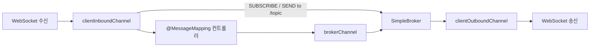
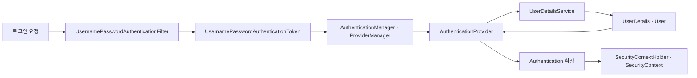
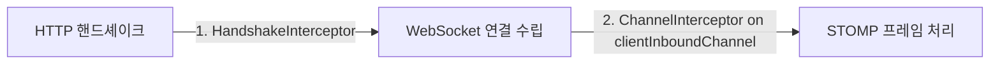

연결을 열어 두기로 결정하고 나면 곧바로 다음 문제가 온다. WebSocket이 보장하는 것은 **한 쌍의 종단 사이에서 바이트가 순서대로 오간다**는 것뿐이다. "이 메시지는 3번 방을 보고 있는 사람들에게"라는 개념은 프로토콜 어디에도 없다.

그래서 생 WebSocket 위에 채팅을 얹으면 다음을 전부 직접 만들게 된다.

- 메시지 타입 구분(입장·퇴장·일반)
- 방 구독 목록 관리와 브로드캐스트 대상 선정
- 세션과 사용자의 매핑, 재연결 시 복구

세 가지 모두 서비스마다 새로 짤 이유가 없는 공통 문제다. STOMP는 이것을 **텍스트 명령어 규약**으로 표준화한다. 이 글은 그 규약이 무엇을 정하는지, Spring이 그 위에 무엇을 얹는지, 그리고 그 구조에서 인증이 어디에 걸리는지를 본다. 마지막 절이 다음 편의 토대다.

## STOMP — 명령어와 헤더, 그리고 목적지

### 프레임 형식은 HTTP를 닮았다

```
COMMAND
header1:value1
header2:value2

Body^@        <- ^@ 는 NULL 종료 바이트
```

명령어 한 줄, 헤더 여러 줄, 빈 줄, 바디. HTTP를 써 본 사람이면 설명 없이 읽을 수 있는 형태다. 이 닮음은 우연이 아니라 선택이고, **텍스트 기반이라 디버깅이 쉽다**는 것이 실무에서 가장 크게 체감되는 장점이다. 브라우저 개발자 도구에서 프레임을 열면 무엇이 오갔는지 그대로 읽힌다.

| 구분 | 명령어 |
|---|---|
| client-command | `SEND` `SUBSCRIBE` `UNSUBSCRIBE` `BEGIN` `COMMIT` `ABORT` `ACK` `NACK` `DISCONNECT` `CONNECT` `STOMP` |
| server-command | `CONNECTED` `MESSAGE` `RECEIPT` `ERROR` |

목록에서 눈여겨볼 것은 채팅에 당장 필요하지 않은 명령어들이다. `BEGIN`·`COMMIT`·`ABORT`가 있다는 것은 여러 메시지를 한 단위로 묶을 수 있다는 뜻이고, `ACK`·`NACK`가 있다는 것은 수신 확인을 프로토콜 수준에서 다룰 수 있다는 뜻이다. **STOMP가 채팅 전용 규약이 아니라 메시징 규약**이라는 사실이 여기서 드러난다. 주문 처리나 작업 배분처럼 유실이 곧 사고인 흐름에도 쓸 수 있다.

### Spring이 메시지를 나르는 세 채널

Spring은 STOMP 메시지를 세 개의 채널로 흘려보낸다. 어느 채널에 무엇을 끼워 넣을 수 있는지가 이후 설계의 여지를 결정한다.



| 채널 | 역할 |
|---|---|
| `clientInboundChannel` | 클라이언트가 보낸 STOMP 메시지의 진입 지점. **인터셉터를 걸어 인증·인가를 검사하는 자리** |
| `brokerChannel` | 서버 코드(`SimpMessagingTemplate`)가 브로커로 메시지를 밀어 넣는 통로 |
| `clientOutboundChannel` | 브로커가 구독자에게 내보내는 출구 |

도식에서 `clientInboundChannel`에서 나가는 화살표가 **둘**이라는 점이 핵심이다. 하나는 컨트롤러로 가고 하나는 브로커로 곧장 간다. 어느 쪽으로 갈지를 정하는 것이 목적지 이름이다.

### destination 접두사 — 이름이 곧 경로다

| 접두사 | 처리 주체 | 용도 |
|---|---|---|
| `/app` (applicationDestinationPrefixes) | `@MessageMapping` 컨트롤러 | 서버 로직을 태워야 하는 메시지(저장·검증·변환) |
| `/topic` | 브로커 | 1:N 브로드캐스트(채팅방) |
| `/queue` | 브로커 | 1:1 전달(개인 알림, 상담 배정) |
| `/user/**` | `UserDestinationMessageHandler` | 특정 사용자에게만. `convertAndSendToUser()`와 짝 |

**왜 나누는가.** `/topic`으로 보낸 메시지는 서버 코드를 거치지 않고 브로커가 즉시 뿌린다. 빠르지만 그 사이에 아무것도 끼어들 수 없다. 메시지를 DB에 저장해야 하거나 권한을 검사해야 한다면 **반드시 `/app`을 거쳐야 한다.**

**안 하면 무슨 일이 나는가.** 클라이언트가 `/topic/room/{남의 방}`으로 직접 `SEND`하면 그 방을 구독 중인 사람들에게 메시지가 그대로 배달된다. 서버 코드를 거치지 않았으므로 방 참여 여부도, 차단 여부도 검사되지 않는다. **인가 검사가 통째로 우회된다.**

이것이 이 편에서 가장 중요한 대목이다. 접두사 분리는 코드 정리의 문제로 보이지만 실제로는 **보안 경계**다. 브로커가 직접 받는 접두사는 "아무나 보내도 되는 목적지"라는 선언과 같다.

### 브로커가 어디 있는가 — 내장이냐 외부냐

도식에 `SimpleBroker`라고 적힌 상자를 무엇으로 채울지가 남았다. 선택은 둘이고, 이 선택이 4편에서 다룰 확장 문제의 절반을 미리 결정한다.

| | SimpleBroker | 외부 브로커 릴레이 |
|---|---|---|
| 실체 | Spring 내장. 애플리케이션과 같은 프로세스의 메모리 | RabbitMQ·ActiveMQ 등 별도 프로세스. Spring은 STOMP를 중계만 한다 |
| 설정 | `enableSimpleBroker("/topic")` | `enableStompBrokerRelay("/topic", "/queue")` |
| 구독 정보 | 그 프로세스의 메모리 안 | 브로커가 관리 |
| 재시작하면 | 구독이 전부 사라진다 | 브로커가 살아 있으면 유지된다 |
| 기능 | 브로드캐스트 위주 | 영속 큐, 수신 확인, 메시지 TTL 등 |

**SimpleBroker의 결정적 성질은 "단일 프로세스 안에서만 동작한다"는 것이다.** 서버가 한 대인 동안은 아무 문제가 없고, 설정도 한 줄이라 개발 초기에 자연스럽게 이것을 고르게 된다.

문제는 서버를 두 대로 늘리는 순간 드러난다. A 서버에 붙은 사용자가 보낸 메시지는 A의 메모리에 있는 구독 목록만 보고 뿌려진다. **같은 방을 보고 있어도 B 서버에 붙은 사용자에게는 도달하지 않는다.** 대화가 절반만 보이는 상태가 되고, 그 절반은 사용자마다 다르다.

이 문제와 그 해법은 4편에서 다룬다. 지금 기억할 것은 하나다 — **브로커 선택은 성능 튜닝이 아니라 확장 가능 여부의 문제**이고, 나중에 바꾸려면 메시지 흐름 전체를 다시 검증해야 한다.

## Spring의 세 층위 — 어디까지 내려갈 것인가

Spring은 WebSocket을 세 층으로 감싸 두었다. 아래로 내려갈수록 통제가 늘고 직접 만들 것도 늘어난다.

| 층위 | 제공 내용 | 언제 쓰나 |
|---|---|---|
| **WebSocket API** | `WebSocketHandler`, `TextWebSocketHandler`, 핸드셰이크 인터셉터 | 프로토콜을 직접 정의하는 저수준 제어가 필요할 때 |
| **SockJS Fallback** | WS 불가 환경에서 xhr-streaming·폴링으로 자동 대체 | 사내망·구형 프록시 등 통과 보장이 필요할 때 |
| **STOMP** | 브로커·`@MessageMapping`·`SimpMessagingTemplate` | 채팅·알림처럼 Pub/Sub 라우팅이 필요할 때(대부분) |

대부분의 채팅은 맨 아래 줄로 끝난다. 그럼에도 위의 두 층을 알아야 하는 이유는 **연결 자체의 성질이 그 층에서 정해지기 때문**이다.

### 저수준 API — 세션이 곧 연결이다

```java
public class MyHandler extends TextWebSocketHandler {
    @Override
    public void handleTextMessage(WebSocketSession session, TextMessage message) { /* ... */ }
}

@Configuration
@EnableWebSocket
public class WebSocketConfig implements WebSocketConfigurer {
    @Override
    public void registerWebSocketHandlers(WebSocketHandlerRegistry registry) {
        registry.addHandler(new MyHandler(), "/myHandler")
                .addInterceptors(new HttpSessionHandshakeInterceptor());
    }
}
```

`WebSocketSession`이 곧 연결이다. 이 객체를 어디에 어떻게 보관하느냐가 4편에서 다룰 확장 논의의 출발점이 된다. 서버 한 대에서는 맵에 담아 두면 그만이지만, 두 대가 되는 순간 **내 맵에 없는 세션에게 어떻게 메시지를 보낼 것인가**가 문제가 된다.

`HttpSessionHandshakeInterceptor`는 HTTP 세션의 속성을 WebSocket 세션 속성으로 복사한다. 1편에서 본 성질 — 핸드셰이크가 평범한 HTTP 요청이라는 것 — 이 있어서 가능한 일이다. 이미 로그인해서 만들어진 세션이 그대로 넘어온다.

### 컨테이너 튜닝 — 기본값이 서비스를 끊는 자리

```java
@Bean
public ServletServerContainerFactoryBean createWebSocketContainer() {
    ServletServerContainerFactoryBean container = new ServletServerContainerFactoryBean();
    container.setMaxTextMessageBufferSize(8192);
    container.setMaxBinaryMessageBufferSize(8192);
    return container;
}
```

| 설정 | 의미 | 놓치면 |
|---|---|---|
| `maxTextMessageBufferSize` | 한 메시지의 최대 버퍼 | 초과 시 연결이 끊긴다. 이미지 base64 전송 등에서 바로 터짐 |
| `maxSessionIdleTimeout` | 유휴 세션 종료 시간 | 하트비트 주기와 어긋나면 멀쩡한 연결이 끊긴다 |
| send buffer / send time limit | 느린 클라이언트 대응 | 설정이 없으면 느린 소비자 하나가 서버 메모리를 갉아먹는다 |

세 행 모두 **평소에는 아무 일도 일어나지 않다가 특정 조건에서 연결을 끊는** 종류다. 첫 행은 사용자가 이미지를 붙여 넣는 순간 드러나고, 둘째 행은 1편에서 본 하트비트 주기와의 관계에서 드러난다. 셋째 행이 가장 늦게 드러난다 — 모바일 네트워크가 느린 사용자 한 명이 서버가 보낸 메시지를 제때 받아 가지 못하면, 그 사용자 몫의 송신 버퍼가 계속 쌓인다. 제한이 없으면 그것이 힙을 먹는다.

### STOMP 활성화와 컨트롤러

```java
@Configuration
@EnableWebSocketMessageBroker
public class WebSocketConfig implements WebSocketMessageBrokerConfigurer {
    @Override
    public void registerStompEndpoints(StompEndpointRegistry registry) {
        registry.addEndpoint("/portfolio");   // .withSockJS() 로 fallback 추가
    }
    @Override
    public void configureMessageBroker(MessageBrokerRegistry registry) {
        registry.setApplicationDestinationPrefixes("/app");
        registry.enableSimpleBroker("/topic");
    }
}
```

설정은 두 줄로 끝난다. 앞 줄이 "서버 로직을 태울 접두사"를, 뒷 줄이 "브로커가 직접 받을 접두사"를 정한다. 앞 절에서 본 보안 경계가 이 두 줄에 들어 있다.

```java
@Controller
public class GreetingController {
    private final SimpMessagingTemplate template;   // 서버 어디서든 푸시 가능

    @MessageMapping("/greeting")                    // /app/greeting 수신
    public String handle(String greeting) { return "[" + getTimestamp() + "]: " + greeting; }

    @RequestMapping(path = "/greetings", method = POST)   // HTTP 요청에서도 푸시
    public void greet(String greeting) {
        template.convertAndSend("/topic/greetings", "[" + getTimestamp() + "]:" + greeting);
    }
}
```

두 메서드가 같은 클래스에 있다는 점이 이 코드의 요지다. 위는 WebSocket으로 들어온 메시지를 받고, 아래는 **평범한 HTTP 요청**을 받아 WebSocket 구독자에게 밀어 넣는다.

| 컨트롤러 인자 | 얻는 것 |
|---|---|
| `@Payload` | 메시지 본문(기본값이라 생략 가능). `@Valid`로 검증 가능 |
| `@Header` / `@Headers` | 특정 헤더 / 전체 헤더 Map |
| `@DestinationVariable` | destination 템플릿 변수(`/topic/room/{roomId}`) |
| `SimpMessageHeaderAccessor`, `StompHeaderAccessor` | 세션 ID·구독 ID 등 타입 안전 접근 |
| `java.security.Principal` | **핸드셰이크 시점에 로그인한 사용자** ← 인증 연결 고리 |

마지막 행이 다음 절로 이어지는 고리다. 컨트롤러가 `Principal`을 인자로 받을 수 있다는 것은, 그 시점에 이미 인증이 끝나 있다는 뜻이다. 어디서 끝났는가가 다음 질문이다.

`SimpMessagingTemplate`이 중요한 이유도 함께 짚어 둔다. 이 객체를 주입받으면 **WebSocket 바깥에서도 푸시를 만들 수 있다.** HTTP 요청, 배치 작업, 메시지 컨슈머 어디서든 `convertAndSend`를 호출하면 구독자에게 전달된다. 상담사 배정 알림이나 시스템 공지처럼 사용자가 보내지 않은 메시지가 전부 여기서 나온다.

## 인증이 걸리는 두 지점

### 왜 채팅에 로그인이 필요한가

로그인하지 않은 클라이언트도 붙을 수 있다면 메시지의 **작성자를 특정할 수 없다.** 작성자를 모르면 방 접근 권한을 검사할 수 없고, 신고나 차단 같은 운영 기능이 성립하지 않는다. 실시간 기능이 아니라 서비스의 요구가 인증을 부른다.

Spring Security의 폼 로그인은 요청에서 자격 증명을 뽑는 필터부터 인증 결과를 보관하는 홀더까지 정해진 경로를 지난다.



| 구성요소 | 책임 |
|---|---|
| `UsernamePasswordAuthenticationFilter` | 요청에서 아이디·비밀번호를 뽑아 인증 토큰 생성 |
| `AuthenticationManager`(`ProviderManager`) | 등록된 Provider들에 인증을 위임 |
| `AuthenticationProvider` | 실제 인증 수행. `UserDetailsService`로 사용자 조회 |
| `UserDetailsService` → `UserDetails` | DB에서 사용자·권한 로딩 |
| `SecurityContextHolder` | 스레드 로컬에 인증 결과 보관 |

이 경로에서 갈아 끼울 수 있는 지점이 `AuthenticationProvider`와 `UserDetailsService`다. 3편에서 볼 소셜 로그인은 이 두 자리를 다른 구현으로 바꾸는 일이다.

### 핸드셰이크와 프레임 — 두 번 걸린다



| 지점 | 수단 | 특징 |
|---|---|---|
| **핸드셰이크(1회)** | `HandshakeInterceptor`, `HttpSessionHandshakeInterceptor` | 쿠키·세션이 그대로 실려 온다. 여기서 거절하면 연결 자체가 안 열림 |
| **STOMP CONNECT / 프레임마다** | `ChannelInterceptor` + `StompHeaderAccessor` | JWT를 STOMP 헤더에 실어 검증. 구독 destination 인가 검사도 여기서 |

두 지점을 모두 알아야 하는 이유는 각자가 다른 것을 잡기 때문이다.

**핸드셰이크만으로 끝내면 안 되는 이유는 그것이 딱 한 번이기 때문이다.** 연결은 몇 시간씩 유지되는데, 그동안 토큰이 만료되거나 권한이 회수되어도 이미 열린 연결에는 아무 영향이 없다. 관리자 권한을 회수당한 사용자가 연결을 끊지 않는 한 계속 관리자로 남는다. 민감한 기능이라면 주기적 재검증이나 서버 쪽에서 연결을 강제 종료하는 경로가 필요하다.

**반대로 프레임 검사만으로 끝내도 안 된다.** 인증 없이 열린 WebSocket 엔드포인트는 그 자체가 인증 우회 통로가 된다. HTTP API에 붙여 둔 필터와 인가 규칙이 전부 무의미해진다.

### 브라우저가 헤더를 못 붙인다는 제약

JWT를 쓰기로 했다면 곧 벽에 부딪힌다. **브라우저의 WebSocket API는 커스텀 헤더를 붙일 수 없다.** `new WebSocket(url)`에 헤더를 실을 자리가 없다. 남는 선택지는 셋이다.

| 방법 | 문제 |
|---|---|
| 쿼리 파라미터 | URL이 접근 로그·프록시 로그·브라우저 히스토리에 남는다 |
| 쿠키 | 자동으로 실려 편하지만 CSWSH에 노출된다(아래) |
| STOMP `CONNECT` 프레임 헤더 | 핸드셰이크가 아니라 그다음 프레임이라 헤더를 마음대로 넣을 수 있다 |

**실무 권장은 셋째다.** 토큰이 URL에 남지 않고, 프레임마다 검사하는 구조와도 자연스럽게 맞는다. 대신 연결은 인증 없이 한 번 열리므로, `CONNECT` 프레임이 오기 전까지 아무것도 허용하지 않는 상태를 유지해야 한다.

### CSWSH — 동일 출처 정책이 적용되지 않는다

마지막으로 WebSocket에만 있는 함정 하나를 짚는다. **WebSocket 핸드셰이크에는 동일 출처 정책(SOP)이 적용되지 않는다.** 공격자의 페이지에서 우리 서버로 WebSocket 연결을 여는 것이 브라우저 차원에서 막히지 않고, 쿠키는 평소처럼 실려 간다.

결과는 CSRF와 같은 형태의 공격이 된다. 사용자가 로그인한 상태로 공격자 페이지를 열면, 그 페이지의 스크립트가 사용자의 자격으로 채팅 서버에 붙어 메시지를 읽고 보낼 수 있다. 이름이 붙어 있다 — Cross-Site WebSocket Hijacking, 줄여서 CSWSH다.

막는 방법은 핸드셰이크에서 **`Origin` 헤더를 검증**하는 것이다. 앞 절에서 쿠키 방식에 표를 달아 둔 이유가 이것이다. 쿠키로 인증한다면 `Origin` 검증은 선택이 아니다.

## 정리

- **destination 접두사는 코드 정리가 아니라 보안 경계다.** 브로커가 직접 받는 접두사는 "서버 로직을 거치지 않아도 되는 목적지"라는 선언이고, 저장·인가가 필요한 메시지는 반드시 `/app`을 지나야 한다.
- **인증은 두 지점에 건다.** 핸드셰이크는 연결 자체를 막을 수 있지만 한 번뿐이고, 채널 인터셉터는 프레임마다 검사할 수 있지만 연결은 이미 열린 뒤다. 둘 중 하나만 쓰면 각각의 구멍이 남는다.
- **브라우저 제약이 설계를 정한다.** 커스텀 헤더를 못 붙인다는 사실 하나가 토큰 전달 방식을 셋으로 좁히고, 그중 쿠키를 고르면 `Origin` 검증이 따라온다.
- **브로커 선택은 확장 가능 여부의 문제다.** 내장 브로커는 설정 한 줄로 끝나지만 그 메모리는 한 프로세스의 것이다. 서버를 늘리는 순간 대화가 절반만 보인다.

다음 편은 이 인증을 완성한다. 비밀번호를 우리가 들고 있지 않으면서 사용자를 식별하는 방법 — OAuth2 Authorization Code Grant가 어떤 순서로 도는지, Spring Security가 앞서 본 경로의 어느 자리를 갈아 끼우는지, 그리고 인증이 끝난 다음에 필요한 채팅 도메인 모델을 다룬다.
