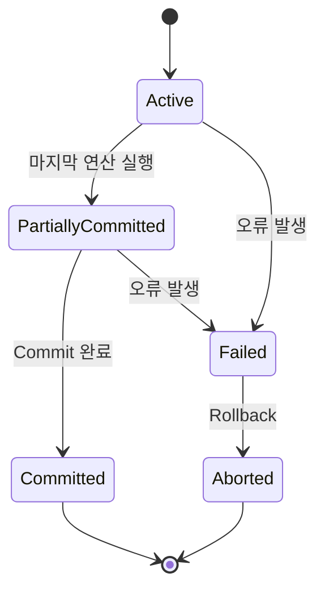
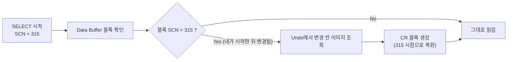
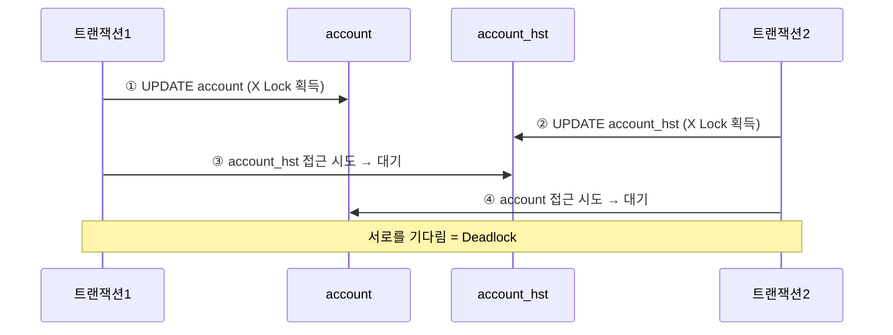

주문 하나가 재고를 깎고, 결제 이력을 남기고, 포인트를 적립한다. 셋 중 하나가 실패했는데 나머지 둘이 그대로 남으면 데이터는 틀린 상태로 굳는다. 그리고 같은 재고 행을 두 요청이 동시에 건드리면, 각각은 정상 동작인데 합쳐 놓으면 숫자가 맞지 않는다. **트랜잭션은 앞의 문제를, 동시성 제어는 뒤의 문제를 다룬다.**

이 글은 그 둘을 다룬다. ACID 네 특성이 각각 어떤 장치로 구현되는지, 읽기 일관성이 무엇을 보장하는지, 격리수준 네 단계가 어떤 이상현상을 허용하고 막는지, 락이 어떻게 블로킹이 되고 블로킹이 어떻게 데드락이 되는지, 그리고 그 데드락을 실무에서 어떤 순서로 없애는지다. 데이터베이스를 무엇을 기준으로 고르는가, NoSQL 네 유형이 각각 무엇에 강하고 무엇에 불리한가는 [관계형 데이터베이스와 NoSQL](/blog/backend-engineering/rdbms-and-nosql-fundamentals/)에서 다룬다.

## 트랜잭션 — 무엇의 단위인가

### 나눌 수 없는 업무 처리의 단위

트랜잭션은 시스템에서 한 번의 처리로 실행되어야 할 **나눌 수 없는 업무 처리의 단위**다. "쿼리 여러 개를 묶는 문법"이 아니라 **업무가 쪼개지면 안 되는 지점**을 데이터베이스에 알려 주는 선언이다.

| # | 데이터베이스 관점의 트랜잭션 |
|---|---|
| 1 | 논리적으로 한 번에 수행되어야 하는 **작업들의 묶음** |
| 2 | 보통 여러 개의 SQL로 구성된다 |
| 3 | 처리 중 SQL 작업이 실패하면 **Rollback**해서 데이터 일관성을 보장한다 |
| 4 | 일반적으로 DML·DCL·DDL 명령어를 하나 이상 포함한다 |
| 5 | 종료 조건은 **Commit / Rollback / Error 발생 / DB Shutdown / 시스템 장애** |
| 6 | DBMS는 동시 실행 트랜잭션 간 충돌을 막기 위해 **동시성 제어 기법(Lock 등)** 을 쓴다 |

5번이 실무에서 자주 잊힌다. 트랜잭션은 애플리케이션이 `COMMIT`을 부르지 않아도 끝난다 — 프로세스가 죽거나 DB가 내려가도 끝난다. **끝나는 방법이 여러 가지라는 것**이 6번의 전제이기도 하다. 어느 경로로 끝나든 다른 트랜잭션이 그 결과를 볼 수 있는 상태로 정리돼야 하기 때문이다.

```sql
START TRANSACTION;
UPDATE accounts SET balance = balance - 100 WHERE id = 'Alice';
UPDATE accounts SET balance = balance + 100 WHERE id = 'Bob';
COMMIT;   -- 이 시점에 변경사항이 영구 반영된다
```

두 `UPDATE` 사이에서 장애가 나면 Alice의 100원만 사라진다. 그 상태를 만들지 않겠다는 약속이 위의 세 줄이다.

### ACID는 각각 무엇으로 구현되는가

ACID를 네 단어로 외우는 것과, 각 글자가 **어떤 장치 위에 서 있는지** 아는 것은 다르다. 오른쪽 열이 그 장치다.

| ACID | 정의 | 무엇으로 구현되나 |
|---|---|---|
| **원자성(Atomicity)** | 더 이상 분해할 수 없는 업무의 최소 단위. 모든 연산이 완전히 수행되거나, 에러가 나면 모두 취소된다 | Undo 로그 (변경 전 이미지) |
| **일관성(Consistency)** | 트랜잭션 수행 전후로 DB의 제약조건·규칙이 유지된다 | 제약조건(PK/FK/CHECK), 애플리케이션 규칙 |
| **격리성(Isolation)** | 동시에 실행되는 트랜잭션들이 서로 간섭하지 않는다 | Lock, MVCC, 격리수준 |
| **영속성(Durability)** | 성공적으로 완료하면 그 결과가 **영속적으로 저장**된다 | Redo 로그 + WAL(Write Ahead Logging) |

오른쪽 열을 가로로 읽으면 이 글의 나머지가 그대로 나온다. **원자성은 Undo가, 영속성은 Redo가, 격리성은 락과 MVCC가 떠받친다.** Undo는 "되돌리기 위해 옛 값을 남기는 것"이고 Redo는 "다시 적용하기 위해 새 값을 먼저 기록하는 것"이라 방향이 반대다. 그리고 뒤에서 볼 읽기 일관성은 **원자성을 위해 남겨 둔 Undo를 격리성에 재사용**하는 구조다 — 하나의 장치가 두 글자를 동시에 떠받친다.

일관성만 성질이 다르다. 나머지 셋은 DBMS가 책임지지만, **일관성의 절반은 애플리케이션이 정의한다.** "잔액은 음수가 될 수 없다"를 DB가 알 방법은 `CHECK` 제약이나 코드밖에 없다. 제약을 걸지 않고 트랜잭션만 두르면 원자적으로 틀린 데이터가 만들어진다.

### 트랜잭션의 상태 전이



주목할 화살표는 `PartiallyCommitted → Failed`다. 마지막 연산까지 실행했는데도 아직 끝난 것이 아니다 — **커밋을 확정하는 단계가 남아 있고, 거기서 오류가 나면 여기서 뒤집힌다.** `Committed`에 도달해야 비로소 영속성이 보장된다는 뜻이고, 애플리케이션이 "쿼리가 다 나갔으니 성공"으로 판단하면 안 되는 이유다.

### DBMS마다 트랜잭션 구현이 다르다

> **트랜잭션 구현의 내용은 DBMS별로 서로 다르다.**

같은 `REPEATABLE READ`라도 MySQL InnoDB는 갭 락으로 Phantom Read까지 상당 부분 막지만, **표준 정의상으로는 Phantom Read가 허용된다.** 그래서 격리수준을 말할 때는 "표준 기준으로는 ~, 그런데 InnoDB에서는 ~"처럼 두 층을 나눠야 정확해진다.

이것은 용어 다툼이 아니라 이식성 문제다. 표준 문서만 읽고 짠 방어 로직은 InnoDB에서 과잉이 되고, InnoDB 동작만 믿고 짠 코드는 다른 제품으로 옮길 때 조용히 깨진다.

## 읽기 일관성

### 두 가지 수준

**읽기 일관성**은 단일 SQL 또는 트랜잭션 안에서 일련의 SQL이 차례로 수행될 때, **수행된 시점 기준으로 일관성 있게** 데이터를 읽는 것이다.

| 수준 | 범위 | 보장 대상 |
|---|---|---|
| **문장 수준 읽기 일관성** (Statement Level) | 하나의 SQL | 그 SQL이 시작된 시점의 데이터를 끝까지 |
| **트랜잭션 수준 읽기 일관성** (Transaction Level) | 트랜잭션 전체 | 트랜잭션 시작 시점의 데이터를 트랜잭션 종료까지 |

다음 상황이 이 구분을 정확히 짚는다.

- Client1: 19:01:01에 `SELECT SUM(balance) FROM accounts;` 시작 → 19:01:05 종료
- Client2: 19:01:02에 `INSERT INTO accounts VALUES('Bill','100'); COMMIT;` → 19:01:03 종료

**합계는 얼마여야 하는가.** 문장 수준 읽기 일관성이 보장되면 Client1은 **19:01:01 시점의 합계**를 반환한다. Bill의 100원은 포함되지 않는다. 쿼리가 4초간 돌면서 중간에 들어온 행을 주워 담는다면, 그 결과는 어느 시점의 합계도 아닌 값이 된다.

### Current 모드와 Consistent 모드

읽기 일관성은 "읽는 시점을 무엇으로 잡는가"로 구현된다. 모드는 둘이다.

| 모드 | 읽는 시점 | 사용처 |
|---|---|---|
| **Current 모드** | SQL이 수행되고 **읽는 시점에 최종 commit된** 데이터를 읽는다 | INSERT·UPDATE·DELETE의 **쓰기** |
| **Consistent 모드 (MVCC)** | **SQL 실행 시점의 번호(SCN)** 기준으로, Undo에서 그 시점에 존재했던 변경 전 블록을 복사해 읽는다 (**CR 블록**) | SELECT의 **읽기** |

SCN은 오라클의 논리적 시점 번호다. 핵심은 **읽는 쪽이 시점을 들고 다닌다**는 것이다. 그래서 원본 블록이 이미 바뀌었어도 "내 시점의 모습"을 Undo에서 복원해 볼 수 있다.



도식의 분기 하나가 MVCC의 전부다. **내가 시작한 뒤에 변경된 블록만 복원 비용을 낸다.** 변경이 없었으면 그대로 읽으므로 읽기가 쓰기를 기다리지 않고, 쓰기도 읽기를 기다리지 않는다. 대신 Undo 영역을 유지해야 하고, 트랜잭션이 아주 길어지면 필요한 옛 이미지가 이미 재사용된 뒤라 복원에 실패하는 경우가 생긴다(오라클의 `snapshot too old`가 그 상황이다).

### 조건절이 갱신 손실을 실패로 바꾼다

규칙은 두 줄이다.

1. `SELECT`는 **Consistent 모드**로 읽는다.
2. `INSERT`·`UPDATE`·`DELETE`는 **Current 모드로 읽고 쓴다.** 다만 **변경할 레코드를 찾을 때는 Consistent 모드**로 읽는다.

2번이 함정이다. 찾을 때와 바꿀 때의 모드가 다르다. Alice 잔액이 1000원인 상태에서 두 트랜잭션이 거의 동시에 아래를 실행하면 어떻게 되는가.

```sql
-- TR1
UPDATE accounts SET balance = balance + 100
WHERE id = 'Alice' AND balance = 1000;
COMMIT;

-- TR2 (거의 동시)
UPDATE accounts SET balance = balance + 200
WHERE id = 'Alice' AND balance = 1000;
COMMIT;
```

- TR2는 **Consistent 모드로 대상을 찾을 때** `balance = 1000`을 만족하므로 후보로 잡는다.
- 그러나 TR1이 커밋한 뒤 **Current 모드로 실제 갱신**하려는 순간 조건을 다시 확인하고, 이미 1100으로 바뀐 값은 `balance = 1000`을 만족하지 않으므로 **0건 갱신**으로 끝난다.
- 즉 **갱신 손실(Lost Update)이 조용히 일어나는 대신, 조건절 덕분에 갱신이 실패**한다.

조건절을 뺐다면 TR2는 1100에 200을 더해 1300을 쓰고 끝났을 것이다. 결과만 보면 두 트랜잭션이 다 반영된 것처럼 보이지만, TR2가 판단 근거로 삼은 잔액은 1000이었다. **조건절이 있어야 "내가 본 값이 아직 그대로인가"를 DB가 대신 확인해 준다.**

> 애플리케이션이 이 결과를 무시하면 최악이다. `UPDATE`의 **영향받은 행 수(rowcount)가 0인지 반드시 확인**해야 한다. 0건은 성공이 아니라 충돌 신호다.
>
> JPA의 `@Version` 낙관적 락이 하는 일이 정확히 이것이다. 버전 컬럼을 `WHERE`에 넣고, 0건이면 `OptimisticLockException`을 던진다.

여기서 이미 낙관적 동시성 제어의 원리가 나왔다. 뒤의 「동시성 제어」 절은 이 동작에 이름을 붙이고 반대편 전략과 비교하는 자리다.

## 격리수준과 이상현상

트랜잭션 수준 읽기 일관성을 강화하려면 격리수준을 높여야 한다. 다만 **대부분의 DBMS는 기본적으로 트랜잭션 수준 읽기 일관성을 보장하지 않는다.** 기본값이 안전한 쪽이 아니라는 것이 이 절의 출발점이다.

### 이상현상 3종

| 이상현상 | 정의 | 시나리오 |
|---|---|---|
| **Dirty Read** | commit되지 않은 데이터를 읽은 뒤, **rollback이 일어나면서** 데이터 결함이 생긴다 | TR1이 Alice를 1000→1100으로 UPDATE(미커밋) → TR2가 1100을 읽고 1300으로 변경·커밋 → TR1이 ROLLBACK. 존재한 적 없는 값 위에 결과가 쌓인다 |
| **Non-Repeatable Read** | 트랜잭션 안에서 **같은 데이터를 여러 번 읽을 때**, 그 사이 다른 트랜잭션이 수정·삭제해 결과가 달라진다 | TR1이 Alice 잔액 10000을 조회 → TR2가 5000으로 UPDATE·커밋 → TR1의 `UPDATE ... WHERE balance > 10000`이 **수행되지 못한다** |
| **Phantom Read** | 트랜잭션 안에서 **일정 범위의 레코드를 여러 번 읽을 때**, 없던 레코드가 나타나거나 있던 레코드가 사라진다 | TR1이 고객 N명을 집계 → TR2가 'Steve'를 INSERT·커밋 → TR1이 다시 세면 **N+1명**이 되어 평균이 어긋난다 |

**Non-Repeatable Read와 Phantom Read**는 자주 뒤섞인다. 구분은 한 줄이다 — **전자는 "같은 행"의 값이 바뀌는 것**, **후자는 "행의 집합"이 늘거나 주는 것**이다.

이 구분이 실용적인 이유는 **막는 방법이 다르기** 때문이다. 값이 바뀌는 것은 이미 읽은 행을 잠그면 막히지만, 없던 행이 끼어드는 것은 아직 존재하지 않는 행을 잠글 수 없으므로 **범위 자체**를 잠가야 한다. InnoDB의 갭 락이 그 자리를 메운다.

### 격리수준 4단계 교차표

| Level | 격리수준 | Dirty Read | Non-Repeatable Read | Phantom Read | 동시성 | 비고 |
|---|---|---|---|---|---|---|
| **0** | READ UNCOMMITTED | **발생** | **발생** | **발생** | 최고 | 커밋되지 않은 데이터 읽기를 허용한다 |
| **1** | READ COMMITTED | 방지 | **발생** | **발생** | 높음 | **대부분의 DBMS가 채택하는 기본값** (Oracle, PostgreSQL, SQL Server) |
| **2** | REPEATABLE READ | 방지 | 방지 | **발생** | 중간 | 먼저 시작한 TR이 읽은 데이터는 종료까지 다른 TR이 갱신·삭제하지 못한다. `SELECT FOR UPDATE` 구문. **MySQL InnoDB 기본값** |
| **3** | SERIALIZABLE | 방지 | 방지 | 방지 | 최저 | 갱신뿐 아니라 **새 레코드 삽입도 차단**한다. 완벽한 읽기 일관성 |

표를 세로로 읽으면 격리수준이 오를수록 막는 것이 늘고 동시성이 준다는 당연한 이야기지만, **가로로 읽으면 실무 판단이 나온다.** Level 1과 Level 2의 차이는 "같은 행을 다시 읽을 일이 있는가"이고, Level 2와 Level 3의 차이는 "범위를 다시 읽을 일이 있는가"다. 단건 조회 후 단건 갱신만 하는 API는 **조건절에 상태 값을 넣으면** Level 1로 충분하고, 집계 후 그 집계를 근거로 쓰는 트랜잭션은 Level 2로도 부족하다.

```sql
SET TRANSACTION ISOLATION LEVEL SERIALIZABLE;
```

### 격리수준은 성능 설정이 아니라 데이터 유실 방지 설계다

Level 3이 필요한 상황은 다음 형태다. TR1이 `INSERT INTO account_history SELECT * FROM tmp;` 로 옮긴 뒤 `DELETE FROM tmp;` 를 한다. 그 사이 TR2가 tmp에 'Steve'를 INSERT·커밋한다.

| 격리수준 | 결과 |
|---|---|
| Level 2 이하 | TR1의 DELETE가 방금 들어온 'Steve'까지 지운다. **history에는 없는데 tmp에서도 사라지는 데이터 유실**이 발생한다 |
| Level 3 | Lock으로 새로운 데이터 삽입 자체를 막으므로 'Steve' 레코드가 tmp에 그대로 남는다 |

이것이 격리수준을 **성능 설정이 아니라 데이터 유실 방지 설계**로 봐야 하는 이유다. 배치성 "읽고 → 옮기고 → 지운다" 패턴은 격리수준이 낮으면 조용히 데이터를 잃는다. **로그에도 에러가 남지 않는다** — 두 SQL 모두 정상 종료했기 때문이다.

실무 대응은 격리수준을 전역으로 올리는 것이 아니다. 전역 상향은 그 문제와 무관한 트랜잭션까지 락 범위를 넓혀 처리량을 떨어뜨린다. 대신 둘 중 하나를 쓴다.

1. **해당 트랜잭션만 SERIALIZABLE로 올린다.**
2. **삭제 조건에 처리 대상 키·타임스탬프를 명시해 범위를 고정한다** — `DELETE FROM tmp WHERE id IN (...)` 처럼 옮긴 것만 지우면 격리수준과 무관하게 안전하다.

두 방법의 차이는 **기억을 누가 책임지는가**다. 격리수준을 올리는 것은 DBMS에게 "내가 무엇을 읽었는지 트랜잭션이 끝날 때까지 기억해 달라"고 부탁하는 일이고, 삭제 조건을 명시하는 것은 애플리케이션이 그것을 이미 알고 있다고 말하는 일이다. 옮긴 키를 손에 쥐고 있는 배치라면 후자를 쓸 수 있다.

## 동시성 제어 — 비관적과 낙관적

### 두 가정, 두 전략

동시성 제어 전략의 갈림은 기법이 아니라 **가정**에서 시작한다. "충돌이 잦은가"에 대한 답이 나머지를 전부 결정한다.

| 구분 | 비관적 동시성 제어 (Pessimistic) | 낙관적 동시성 제어 (Optimistic) |
|---|---|---|
| **가정** | 사용자들이 같은 데이터를 **동시에 수정할 것이다** | 사용자들이 같은 데이터를 **동시에 수정하지 않을 것이다** |
| **방법** | Lock 또는 트랜잭션 타임스탬프로 제어. 읽을 때부터 잠근다 | 잠금 없이 진행하고, **commit 전에** 다른 트랜잭션의 변경이 있었는지 확인한 뒤 commit한다 |
| **장점** | 충돌 시 확실히 보호된다. 재시도 로직이 필요 없다 | 대기가 없어 동시성이 높다 |
| **단점** | 블로킹·데드락 위험, 처리량 저하 | 충돌 시 **실패 처리·재시도 로직**을 애플리케이션이 책임진다 |
| **쓰는 곳** | 재고 차감, 좌석·쿠폰 선점 등 충돌이 잦고 실패가 치명적인 경우 | 게시글 수정 등 충돌이 드문 경우 |

```sql
-- 비관적: 읽는 시점에 배타 락 획득
SELECT balance FROM account WHERE id = 'Alice' FOR UPDATE;
UPDATE account SET balance = balance + 100 WHERE id = 'Alice';

-- 낙관적: 변경일시(버전)를 조건에 넣고, 0건이면 충돌로 판단
SELECT balance, 변경일시 INTO :a, :b FROM account WHERE id = 'Alice';
UPDATE account SET balance = balance + 100
WHERE id = 'Alice' AND 변경일시 = :b;
IF (SQL%ROWCOUNT = 0) THEN alert('modified'); END IF;
```

두 코드의 차이는 **비용을 언제 내는가**다. 비관적은 앞에서 대기 비용을 내고 뒤에서 확실해진다. 낙관적은 앞에서 아무 비용도 내지 않고 뒤에서 실패 가능성을 떠안는다. 그래서 낙관적 락은 **재시도가 멱등하게 가능한 작업**에서만 값어치가 있다 — 재시도할 수 없는 작업에 붙이면 충돌이 곧 사용자 오류 화면이 된다.

낙관적 쪽 코드가 앞 절의 `WHERE ... AND balance = 1000`과 같은 모양인 것은 우연이 아니다. **"내가 읽은 값이 아직 그대로인가"를 조건절로 확인하는 것**이 낙관적 제어의 전부이고, 버전 컬럼은 그 확인을 값 대신 세대 번호로 하는 최적화다.

### 같은 이름이 다른 계층에도 있다

분산 환경에서는 같은 문제가 애플리케이션 앞단에서 먼저 나타난다. 이 시리즈 밖의 [캐시 무효화와 동시성](/blog/backend-engineering/cache-invalidation-and-concurrency/)이 그 계층을 다루는데, **두 글이 만나는 지점을 짚어 두는 것은 이 글의 정리다.**

그 글은 「분산 락」 절에서 Redis의 `SET NX PX`와 Lua 해제로 분산 락을 세운 뒤, 「Redis 락은 성능 최적화용이지 정합성이 돈과 직결되는 곳의 최후 방어선이 아니다」라고 못을 박는다. 그러고는 금액과 재고를 확정하는 책임을 DB 쪽으로 넘긴다 — 재고 수량에 조건을 단 갱신, 그리고 유니크 제약이 그 마지막 자리를 맡는다.

넘겨받은 그 자리가 이 글에서 방금 본 것이다. 재고 수량이 조건을 만족하지 않으면 갱신은 0건으로 끝나고, 애플리케이션은 rowcount로 재고 소진을 안다 — 앞 절의 `balance = 1000`이 하던 일과 구조가 같다. **분산 락은 DB 경합을 줄이는 앞단 최적화이고, 정확성의 최종 근거는 여기서 다룬 트랜잭션과 조건절이다.**

⚠️ 두 글에서 「락」이라는 낱말이 가리키는 물건은 다르다. 그쪽의 락은 **Redis 키 하나에 만료 시간을 건 상호 배제**라 시간 가정에 의존한다(보유자가 GC로 멈추면 TTL이 먼저 지날 수 있다). 이 글의 락은 **DBMS가 트랜잭션 종료까지 유지하는 행·테이블 단위 잠금**이라 시간이 아니라 트랜잭션 경계에 묶인다. 낱말이 같다고 성질까지 옮겨 읽으면 안 된다.

## Lock

**Lock**은 DBMS의 동시성 제어 메커니즘으로, 데이터와 공유 리소스를 보호한다.

화장실에 비유하면 이해가 빠르다. 화장실이 Lock, 사람이 트랜잭션, 화장실 안 물건이 데이터다. 세수·양치(공유)는 여러 명이 함께 할 수 있지만 변기(배타)는 한 명만 쓴다. 그리고 **누가 세수 중이면 변기를 쓸 수 없고, 변기 사용 중이면 세수도 못 한다.**

### Shared와 Exclusive

| Lock | 용도 | 성질 |
|---|---|---|
| **Shared Lock (공유·조회용)** | 데이터를 **조회**하려는 경우 | 잠겨 있어도 조회하려는 다른 사용자는 계속 들어올 수 있다. **조회하는 동안 데이터가 변경되지 않음을 보장한다** |
| **Exclusive Lock (배타·수정용)** | 데이터를 **갱신**하려는 경우 | 한 명이 들어가면 나올 때까지 다른 사람은 못 들어온다 |

**S와 X는 호환되지 않는다. 즉 둘 중 하나만 설정될 수 있다.** 비유의 마지막 문장이 이 규칙이다 — 호환되지 않는다는 것은 한 방향이 아니라 양방향이다.

### 호환성 매트릭스와 Intention Lock

아래 매트릭스는 **MySQL(InnoDB)** 의 것이다.

| | X | IX | S | IS |
|---|---|---|---|---|
| **X** | Conflict | Conflict | Conflict | Conflict |
| **IX** | Conflict | **Compatible** | Conflict | **Compatible** |
| **S** | Conflict | Conflict | **Compatible** | **Compatible** |
| **IS** | Conflict | **Compatible** | **Compatible** | **Compatible** |

표에서 눈에 띄는 칸은 **IX와 IX가 호환된다**는 자리다. X끼리는 충돌하는데 그 의도 표시끼리는 충돌하지 않는다. 이유를 보면 Intention Lock이 왜 필요한지가 함께 나온다.

어떤 트랜잭션이 테이블 전체에 X 락을 걸려 할 때, 그 안 수백만 행 중 어느 하나라도 락이 걸려 있는지 **행을 전부 확인할 수는 없다.** 그래서 행에 X를 걸기 전에 **테이블 레벨에 IX(의도 표시)** 를 먼저 건다. 이후 테이블 락 요청자는 테이블 레벨의 IX 하나만 보고 즉시 충돌을 판정한다. **계층적 락의 확인 비용을 O(N)에서 O(1)로 줄이는 장치**다.

IX끼리 호환되는 이유도 여기서 나온다. 서로 다른 행에 X를 걸겠다는 두 의도는 실제로 충돌하지 않는다.

### Lock Level

| Level | 내용 |
|---|---|
| **Row Level** | ROW에만 Lock을 설정한다. 동시성이 가장 높다 |
| **Page Level** | 변경하려는 페이지(블록) 단위. **같은 페이지에 있으면 무관한 데이터라도 Lock이 걸린다** |
| **Extent Level** | Extent 단위. Extent는 객체 저장 시 할당되는 단위로 여러 page/block으로 구성된다 |
| **Table Level** | 테이블 전체와 **인덱스 전체**에 Lock |
| **Database Level** | DB 전체에 Lock (DB 복구 작업 등) |

**Lock 메커니즘은 DBMS별로 상이하다.** 레벨이 위로 갈수록 관리 비용이 싸지고 동시성이 떨어진다. 락 하나를 유지하는 데도 메모리가 들기 때문에, 행 락이 너무 많아지면 DBMS가 자동으로 상위 레벨로 올리는 **Lock Escalation**이 일어나는 제품도 있다.

Escalation이 있는 제품에서 이것이 까다로운 이유는 **임계점을 넘는 순간 동작이 바뀐다**는 데 있다. 소량을 지울 때는 행 락이라 아무 문제가 없던 배치가, 데이터가 늘어 대량을 지우게 되면 상위 레벨 락으로 승격되면서 그 시간 동안 훨씬 넓은 범위가 멈춘다. 적은 데이터로 돌린 시험에서는 드러나지 않는 종류의 문제다.

## 블로킹과 데드락

### 블로킹(Blocking)

**블로킹**은 Lock 경합으로 후행 트랜잭션이 **선행 트랜잭션이 완료되기를 기다리는 것**이다. 오류가 아니라 정상 동작이라는 점이 중요하다 — 그저 느려진다.

1. TR1이 `SELECT ... FROM account WHERE id='Alice'` 를 수행하며 **Shared Lock** 을 설정한다
2. TR2는 Shared Lock 때문에 `UPDATE`를 수행하지 못하고 TR1의 완료를 대기한다
3. TR1이 이후 `UPDATE`에서 Lock을 **Exclusive로 업그레이드**한다
4. TR1이 Commit되고 나서야 TR2가 수행된다

> 단, 오라클이나 MySQL은 일반적으로 조회 시에 Lock을 설정하지 않는다(MVCC). 그래서 위 흐름은 SQL Server 계열의 기본 동작에 가깝다.

MVCC를 쓰는 DBMS에서는 **"읽기는 쓰기를 막지 않고, 쓰기는 읽기를 막지 않는다"** 가 핵심 장점이다. 앞에서 본 CR 블록이 그것을 가능하게 한다 — 읽는 쪽이 자기 시점의 사본을 보므로 원본을 잠글 이유가 없다. 대신 Undo 영역 관리 비용을 내고, 롱 트랜잭션에서는 필요한 옛 이미지가 사라져 읽기가 실패하는 문제를 감수한다.

**같은 SQL이 제품에 따라 락을 잡기도 하고 안 잡기도 한다**는 것이 요점이다. 3단계의 락 업그레이드는 다음 절의 데드락으로 이어지는 전형적인 경로이기도 하다.

### 데드락(Deadlock)

**데드락**은 두 트랜잭션이 각각 설정한 Lock 리소스에 접근하기 위해 **서로 대기**하는 경우다. 블로킹과 달리 기다린다고 풀리지 않으므로, DBMS가 한 트랜잭션에 에러를 발생시켜(희생자 선정) 문제를 해결한다.



도식에서 문제를 만든 것은 ①과 ②가 아니라 **①②의 순서가 서로 반대**라는 사실이다. 두 트랜잭션 모두 자기 관점에서는 지극히 평범한 코드다. 데드락이 코드 리뷰에서 잘 안 잡히는 이유가 여기 있다 — **결함이 한 트랜잭션 안이 아니라 두 트랜잭션 사이에 있다.**

### Coffman 4조건 — 하나만 깨면 된다

데드락은 아래 네 조건이 **모두 성립해야** 발생한다. 뒤집으면 **하나만 깨도 발생하지 않는다.** 오른쪽 열이 각 조건을 깨는 방법이다.

| 조건 | 내용 | 깨는 방법 |
|---|---|---|
| **상호 배제(Mutual Exclusion)** | 자원을 한 번에 하나만 점유할 수 있다 | 락 없는 설계(MVCC 읽기, 낙관적 락) |
| **점유와 대기(Hold and Wait)** | 자원을 쥔 채 다른 자원을 기다린다 | 필요한 락을 **한 번에** 획득, 짧은 트랜잭션 |
| **비선점(No Preemption)** | 남이 쥔 자원을 뺏을 수 없다 | 락 타임아웃 설정 (`NOWAIT`, `WAIT n`) |
| **순환 대기(Circular Wait)** | 대기 관계가 원형을 이룬다 | **자원 접근 순서를 전역 규칙으로 통일** ← 가장 실용적 |

표가 순환 대기를 **「가장 실용적」**으로 지목한 이유는 오른쪽 열을 가로로 읽으면 보인다. 나머지 셋을 깨는 방법은 무언가를 내주기 때문이다 — 상호 배제를 없애면 락이 주던 보호를 재시도 로직으로 옮겨야 하고, 점유와 대기를 없애려면 트랜잭션을 쪼개거나 락을 한꺼번에 잡도록 구조를 바꿔야 하며, 비선점을 깨는 타임아웃은 데드락을 **데드락 대신 타임아웃 에러**로 바꿀 뿐 그 작업을 성공시키지는 않는다. 접근 순서 통일만이 각 트랜잭션이 하는 일을 그대로 두고 순서만 맞춘다. 그것이 아래 우선순위의 1번인 이유다.

### 실무 회피 전략 우선순위

| # | 전략 | 내용 |
|---|---|---|
| 1 | **접근 순서 통일** | 위 도식의 데드락은 TR2도 `account → account_hst` 순으로 갱신했다면 발생하지 않는다. 팀 규칙 하나로 대부분의 데드락이 사라진다 |
| 2 | **트랜잭션을 짧게** | 트랜잭션 안에 외부 API 호출·파일 I/O·사용자 입력 대기를 넣지 않는다 |
| 3 | **인덱스 정비** | 인덱스가 없으면 넓은 범위에 락이 걸려 충돌 확률이 급증한다. 데드락 대응이 인덱스 추가로 끝나는 경우가 실제로 많다 |
| 4 | **격리수준 하향 검토** | 필요 이상으로 높은 격리수준은 락 범위를 넓힌다 |
| 5 | **재시도 로직** | 데드락 희생자는 에러로 끝나므로, 애플리케이션이 **멱등하게 재시도**할 수 있어야 한다 |

3번이 의외로 자주 정답이다. 조건 컬럼에 인덱스가 없으면 해당 행을 찾기 위해 **훑은 범위에 락이 걸린다.** 서로 다른 행을 건드리는 두 트랜잭션이 충돌한다면 인덱스부터 확인할 값어치가 있다.

5번은 앞의 넷과 성격이 다르다. 1~4가 데드락을 **줄이는** 방법이라면 5는 데드락이 **날 것을 전제**한 방법이다. 확률을 0으로 만들 수 없으므로 둘 다 필요하다. 다만 재시도는 그 트랜잭션이 멱등할 때만 안전하다 — 재시도로 주문이 두 건 생기면 데드락보다 나쁘다.

## 정리

이 글이 다룬 것을 문제 단위로 다시 배열했다. 세 열로 나눈 것은 이 글의 정리다.

| 문제 | 무엇이 답하는가 | 어디를 보나 |
|---|---|---|
| 일부만 반영된 상태를 만들지 않으려면 | 원자성 — Undo 로그와 Rollback | 트랜잭션의 종료 조건 5가지 |
| 긴 조회 중에 들어온 데이터가 섞이지 않으려면 | 문장 수준 읽기 일관성, Consistent 모드(MVCC) | CR 블록 생성 흐름 |
| 내가 읽은 값이 아직 그대로인지 확인하려면 | 조건절 + rowcount 확인, 낙관적 제어 | `WHERE ... AND balance = 1000` 의 0건 갱신 |
| 배치가 데이터를 조용히 잃지 않으려면 | 격리수준, 또는 삭제 범위 고정 | Level 3 예제와 두 가지 실무 대응 |
| 테이블 전체를 확인하지 않고 충돌을 판정하려면 | Intention Lock (IS/IX) | 호환성 매트릭스 |
| 서로 기다리다 멈추지 않으려면 | Coffman 4조건 중 순환 대기 깨기 | 접근 순서 통일 |

여섯 행을 관통하는 질문은 하나다 — **누가 무엇을 언제 봤는가.** 읽기 일관성은 그 "언제"를 고정하고, 격리수준과 락은 그동안 남이 못 바꾸게 막고, 조건절과 버전 컬럼은 막는 대신 바뀌었는지를 나중에 확인한다. 막을 것인가 확인할 것인가는 **충돌이 얼마나 잦고 실패가 얼마나 비싼가**로 갈린다. 충돌이 잦으면 막는 비용이 싸고, 드물면 확인하는 쪽이 싸다.

앞단에서 같은 문제를 캐시 계층으로 다루는 법 — 분산 락, 원자 카운터, 스탬피드 방어 — 은 [캐시 무효화와 동시성](/blog/backend-engineering/cache-invalidation-and-concurrency/)에 있다. 이 시리즈의 출발점인 [관계형 데이터베이스와 NoSQL](/blog/backend-engineering/rdbms-and-nosql-fundamentals/)은 애초에 어떤 저장소를 고를 것인가를 다룬다.
